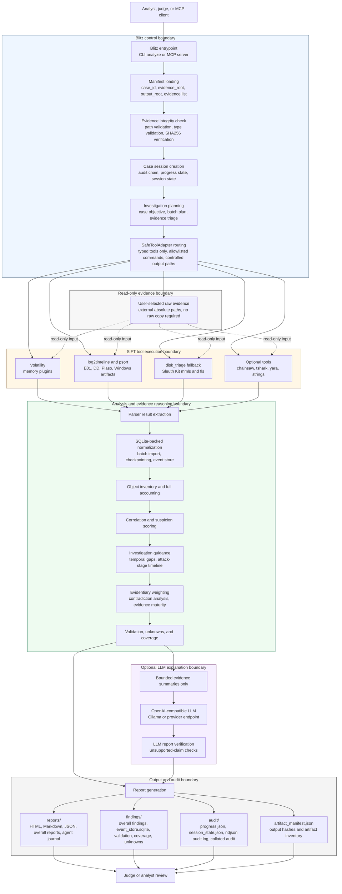

JUDGES: Submission Compliance Quick-Reference
All required components are present. This table tells you exactly where to find each one.

Requirement	Location
Public repository	https://github.com/rienman88/Blitz-DFIR
License	LICENSE (Apache 2.0)
Installation and Setup of writable Volatility symbol cache - This file (Readme)
Try it out (https://github.com/rienman88/Blitz-DFIR/blob/main/submission/packet/09_TRY_IT_OUT_INSTRUCTIONS.md)
Feature description	Overview https://github.com/rienman88/Blitz-DFIR/edit/main/README.md
Demonstration video	[YouTube — ](https://www.youtube.com/watch?v=KVRA7pNhdnU&t=93s)
Architecture diagrams	https://github.com/rienman88/Blitz-DFIR/blob/main/docs/ARCHITECTURE.md
Datasets https://github.com/rienman88/Blitz-DFIR/blob/main/docs/DATASETS.md
Investigation conclusion https://github.com/rienman88/Blitz-DFIR/blob/main/submission/packet/01_INVESTIGATION_CONCLUSION.md
Run Summary https://github.com/rienman88/Blitz-DFIR/blob/main/submission/packet/02_RUN_SUMMARY_COMPACT.json
Rocba llm Agent logs https://github.com/rienman88/Blitz-DFIR/tree/main/submission/rocba_llm_agent_logs

# Blitz DFIR

Blitz DFIR is an autonomous digital forensics and incident response pipeline for SANS SIFT.

In plain words:

- SIFT tools do the forensic extraction.
- Blitz chooses approved tool routes, verifies evidence hashes, records the run, normalizes events, correlates suspicious activity, validates claims, and writes reports.
- LLM reasoning is optional. Blitz can run fully without an LLM.
- Raw evidence is referenced in place. The public runner does not copy large raw files into `/cases`.
- LLM output is treated as explanation only. Findings must come from deterministic tool, parser, normalization, correlation, and validation layers.

## Safest Testing Order

Use this order for demos, judging, and client testing:

1. Run one small or known-good evidence item without LLM.
2. Check status and open the generated reports.
3. Run the same evidence with LLM enabled.
4. Run two evidence items together, for example memory plus E01, without LLM.
5. Run the same two evidence items with LLM enabled.
6. Review coverage gaps, validation warnings, unknowns, and agent logs before making any conclusion.

Each new clean run creates:

```text
/cases/<CASE>/analysis/runs/<timestamp>_*
/cases/<CASE>/output/sess-*
```

`scripts/blitz_status.sh` only reads the latest run. It does not continue, restart, or modify an analysis.

## Requirements

Recommended environment:

- SANS SIFT Workstation or Ubuntu with the required SIFT tools installed.
- Python 3.11 or newer.
- A writable case directory under `/cases`.
- Optional Ollama or another OpenAI-compatible chat-completions service for LLM reasoning.

Core Python package requirements are in:

```text
requirements.txt
requirements-dev.txt
pyproject.toml
```

Required SIFT/tooling checks:

```bash
which python3
which log2timeline.py
which psort.py
which pinfo.py
which vol
which mmls
which fls
which strings
```

Optional tools:

```bash
which chainsaw || true
which tshark || true
which yara || true
```

## Download And Install

On SIFT:

```bash
cd /home/sansforensics/src
git clone <your-github-url> Blitz_DFIR
cd /home/sansforensics/src/Blitz_DFIR

python3 -m venv .venv
. .venv/bin/activate
python -m pip install --upgrade pip
python -m pip install -r requirements.txt
```

Quick health check:

```bash
cd /home/sansforensics/src/Blitz_DFIR
.venv/bin/python -m compileall -q app.py blitz_dfir tests
.venv/bin/python -m pytest -q
```

If test dependencies are not installed:

```bash
.venv/bin/python -m pip install -r requirements-dev.txt
.venv/bin/python -m pytest -q
```

## Volatility Symbols

Blitz is configured to use a writable Volatility symbol cache:

```text
/cases/volatility_symbols
```

Create it once:

```bash
sudo mkdir -p /cases/volatility_symbols
sudo chown "$USER:$USER" /cases/volatility_symbols
chmod 700 /cases/volatility_symbols
```

The active tool config contains:

```yaml
symbols_dir: "/cases/volatility_symbols"
```

This prevents Volatility 3 from trying to save downloaded Windows symbols into a root-owned Python package directory.

## Supported Evidence Type Labels

Use these values in `case.yaml` or `EVIDENCE*_TYPE`:

```text
E01
DD
MEMORY
EVTX
PCAP
REGISTRY_HIVE
FILESYSTEM_ARTIFACT
PLASO
CSV_TIMELINE
JSON_EXPORT
VOLATILITY_JSON
YARA_MATCHES
STRINGS_OUTPUT
PREPROCESSED_EVTX
THIRD_PARTY_EXPORT
```

Common tested paths:

- `MEMORY` for raw memory images processed by Volatility.
- `E01` and `DD` for disk images processed by Plaso/log2timeline, with Sleuth Kit disk-triage fallback when full timeline extraction fails.
- `EVTX` or `PREPROCESSED_EVTX` for Windows event logs.
- `PLASO` and `CSV_TIMELINE` for already generated timeline data.
- `PCAP` for packet capture triage when `tshark` is available.

Only a maximum of two raw datasets simultaneously are tested for the public run flow. The manifest model can hold more records, but the judge/client runbook should use one or two evidence inputs for predictable review.

## Windows Artifact Coverage

The default Windows profile is:

```text
windows-light
```

It targets these artifact families when Plaso supports them:

```text
winevtx
prefetch
lnk
setupapi
windows_timeline
srum
amcache
bam
usbstor
usb devices
```

`mft` and `usnjrnl` are intentionally not part of the light default because they can be high-volume. They should be treated as deeper optional parsing, not the default demo path.

## Allowed Tools And Modules

The active allowlist is in:

```text
config/tools.yaml
```

Main tool routes:

```text
log2timeline  -> E01/DD/Windows artifact timeline extraction
psort         -> PLASO export
disk_triage   -> Sleuth Kit fallback for E01/DD when full Plaso extraction fails
volatility    -> MEMORY analysis
chainsaw      -> EVTX triage when available
tshark        -> PCAP triage when available
yara          -> YARA matching when rules are configured
strings       -> string extraction route
```

Default Volatility plugins:

```text
windows.pslist
windows.pstree
windows.cmdline
windows.psscan
windows.netscan
windows.malfind
```

Blitz does not expose a generic shell through its typed tool layer. Tool execution is constrained by manifest evidence type, configured executable path, allowlisted plugins, output directories, and audit logging.

## Manifest Basics

A manifest tells Blitz what case is being analyzed, where results should be written, and which evidence files are in scope.

Important fields:

```text
case_id        Short case name. This becomes part of /cases/<CASE>.
evidence_root  Use external when raw files live anywhere on disk and should not be copied.
output_root    Where Blitz writes reports, findings, audit files, and SQLite stores.
evidence       One or more evidence records with id, path, type, sha256, and description.
```

For user-selected files from any folder, use:

```yaml
evidence_root: external
```

That allows absolute evidence paths while keeping output under `/cases/<CASE>/output`.

## Run One Dataset By Script

No LLM:

```bash
cd /home/sansforensics/src/Blitz_DFIR

CASE=BLITZ-MY-MEMORY \
EVIDENCE1_PATH="/absolute/path/to/memory.raw" \
EVIDENCE1_TYPE=MEMORY \
EVIDENCE1_ID=memory-01 \
bash scripts/sift_run_external_evidence_no_llm.sh
```

With Ollama:

```bash
cd /home/sansforensics/src/Blitz_DFIR

CASE=BLITZ-MY-MEMORY \
EVIDENCE1_PATH="/absolute/path/to/memory.raw" \
EVIDENCE1_TYPE=MEMORY \
EVIDENCE1_ID=memory-01 \
OLLAMA_BASE_URL=http://127.0.0.1:11434 \
LLM_MODEL=llama3.2:1b \
bash scripts/sift_run_external_evidence_ollama.sh
```

If a SHA256 file already exists:

```bash
CASE=BLITZ-MY-E01 \
EVIDENCE1_PATH="/absolute/path/to/disk.E01" \
EVIDENCE1_TYPE=E01 \
EVIDENCE1_ID=disk-01 \
EVIDENCE1_SHA_FILE="/absolute/path/to/disk.E01.sha256" \
bash scripts/sift_run_external_evidence_no_llm.sh
```

If no SHA is provided, Blitz computes SHA256 and writes it into `/cases/<CASE>/case.yaml`.

## Run Two Datasets By Script

No LLM:

```bash
cd /home/sansforensics/src/Blitz_DFIR

CASE=BLITZ-MY-MEMORY-E01 \
EVIDENCE1_PATH="/absolute/path/to/memory.raw" \
EVIDENCE1_TYPE=MEMORY \
EVIDENCE1_ID=memory-01 \
EVIDENCE2_PATH="/absolute/path/to/disk.E01" \
EVIDENCE2_TYPE=E01 \
EVIDENCE2_ID=disk-01 \
bash scripts/sift_run_external_evidence_no_llm.sh
```

With Ollama:

```bash
cd /home/sansforensics/src/Blitz_DFIR

CASE=BLITZ-MY-MEMORY-E01 \
EVIDENCE1_PATH="/absolute/path/to/memory.raw" \
EVIDENCE1_TYPE=MEMORY \
EVIDENCE1_ID=memory-01 \
EVIDENCE2_PATH="/absolute/path/to/disk.E01" \
EVIDENCE2_TYPE=E01 \
EVIDENCE2_ID=disk-01 \
OLLAMA_BASE_URL=http://127.0.0.1:11434 \
LLM_MODEL=llama3.2:1b \
bash scripts/sift_run_external_evidence_ollama.sh
```

Useful optional variables:

```bash
CASE_OBJECTIVE="Analyze the selected evidence for execution, persistence, credential activity, temporal gaps, cross-source correlation, and unknowns while avoiding unsupported conclusions."
EVIDENCE1_SHA="<sha256>"
EVIDENCE1_SHA_FILE="/absolute/path/to/file.sha256"
EVIDENCE2_SHA="<sha256>"
EVIDENCE2_SHA_FILE="/absolute/path/to/file.sha256"
MAX_NORMALIZED_EVENTS=5000000
MAX_ANALYSIS_EVENTS=2000000
BLITZ_SQLITE_ANALYSIS_EVENT_MEMORY_LIMIT=50000
BLITZ_SQLITE_NORMALIZATION_CHECKPOINT_INTERVAL=100000
```

## Run One Dataset Manually

Use this when you do not want the helper script. Replace the case name, evidence path, evidence type, and objective.

```bash
cd /home/sansforensics/src/Blitz_DFIR

CASE=BLITZ-MANUAL-ONE
CASE_ROOT="/cases/${CASE}"
EVIDENCE1_ID=evidence-01
EVIDENCE1_TYPE=MEMORY
EVIDENCE1_PATH="/absolute/path/to/evidence.raw"

mkdir -p "${CASE_ROOT}/output" "${CASE_ROOT}/analysis/runs"
EVIDENCE1_SHA="$(sha256sum "${EVIDENCE1_PATH}" | awk '{print $1}')"

cat > "${CASE_ROOT}/case.yaml" <<EOF
case_id: ${CASE}
evidence_root: external
output_root: ${CASE_ROOT}/output
evidence:
  - id: ${EVIDENCE1_ID}
    path: "${EVIDENCE1_PATH}"
    type: ${EVIDENCE1_TYPE}
    sha256: ${EVIDENCE1_SHA}
    description: "User-selected evidence referenced in place."
EOF

.venv/bin/python app.py analyze \
  --manifest "${CASE_ROOT}/case.yaml" \
  --mode timeline \
  --tool-config /home/sansforensics/src/Blitz_DFIR/config/tools.yaml \
  --case-objective "Analyze the selected evidence for evidence-backed execution artifacts, persistence, credential activity, user activity, temporal gaps, and unknowns while avoiding unsupported conclusions." \
  --psort-profile triage \
  --windows-artifact-profile windows-light \
  --tool-timeout 7200 \
  --max-normalized-events 5000000 \
  --max-analysis-events 2000000 \
  --report-event-limit 2000000 \
  --report-finding-limit 2000000 \
  --normalized-export-limit 10000 \
  --parser-record-export-limit 10000 \
  --full-sql-correlation

CASE="${CASE}" bash scripts/blitz_status.sh
```

To enable LLM in the manual command, add these exports before `app.py analyze` and add `--enable-reasoning` to the analyze command:

```bash
export LLM_PROVIDER=ollama
export LLM_BASE_URL=http://127.0.0.1:11434/v1
export LLM_API_KEY=ollama
export LLM_MODEL=llama3.2:1b
export LLM_TIMEOUT_SECONDS=600
export LLM_MAX_TOKENS=800
export LLM_RESPONSE_FORMAT_JSON=1
```

## Run Two Datasets Manually

This is the same pattern with two evidence records:

```bash
cd /home/sansforensics/src/Blitz_DFIR

CASE=BLITZ-MANUAL-TWO
CASE_ROOT="/cases/${CASE}"

EVIDENCE1_ID=memory-01
EVIDENCE1_TYPE=MEMORY
EVIDENCE1_PATH="/absolute/path/to/memory.raw"

EVIDENCE2_ID=disk-01
EVIDENCE2_TYPE=E01
EVIDENCE2_PATH="/absolute/path/to/disk.E01"

mkdir -p "${CASE_ROOT}/output" "${CASE_ROOT}/analysis/runs"
EVIDENCE1_SHA="$(sha256sum "${EVIDENCE1_PATH}" | awk '{print $1}')"
EVIDENCE2_SHA="$(sha256sum "${EVIDENCE2_PATH}" | awk '{print $1}')"

cat > "${CASE_ROOT}/case.yaml" <<EOF
case_id: ${CASE}
evidence_root: external
output_root: ${CASE_ROOT}/output
evidence:
  - id: ${EVIDENCE1_ID}
    path: "${EVIDENCE1_PATH}"
    type: ${EVIDENCE1_TYPE}
    sha256: ${EVIDENCE1_SHA}
    description: "User-selected evidence 1 referenced in place."
  - id: ${EVIDENCE2_ID}
    path: "${EVIDENCE2_PATH}"
    type: ${EVIDENCE2_TYPE}
    sha256: ${EVIDENCE2_SHA}
    description: "User-selected evidence 2 referenced in place."
EOF

export LLM_PROVIDER=ollama
export LLM_BASE_URL=http://127.0.0.1:11434/v1
export LLM_API_KEY=ollama
export LLM_MODEL=llama3.2:1b
export LLM_TIMEOUT_SECONDS=600
export LLM_MAX_TOKENS=800
export LLM_RESPONSE_FORMAT_JSON=1

BLITZ_SQLITE_ANALYSIS_EVENT_MEMORY_LIMIT=50000 \
BLITZ_SQLITE_NORMALIZATION_CHECKPOINT_INTERVAL=100000 \
.venv/bin/python app.py analyze \
  --manifest "${CASE_ROOT}/case.yaml" \
  --mode timeline \
  --tool-config /home/sansforensics/src/Blitz_DFIR/config/tools.yaml \
  --case-objective "Analyze the selected evidence together for evidence-backed suspicious processes, execution artifacts, persistence, credential activity, user activity, temporal gaps, cross-source correlation, and unknowns while avoiding unsupported conclusions." \
  --enable-reasoning \
  --psort-profile triage \
  --windows-artifact-profile windows-light \
  --tool-timeout 7200 \
  --max-normalized-events 5000000 \
  --max-analysis-events 2000000 \
  --report-event-limit 2000000 \
  --report-finding-limit 2000000 \
  --normalized-export-limit 10000 \
  --parser-record-export-limit 10000 \
  --full-sql-correlation

CASE="${CASE}" bash scripts/blitz_status.sh
```

## Check Status

By script:

```bash
cd /home/sansforensics/src/Blitz_DFIR
CASE=BLITZ-MY-MEMORY-E01 bash scripts/blitz_status.sh
```

Monitor until done:

```bash
CASE=BLITZ-MY-MEMORY-E01 bash scripts/blitz_monitor_until_done.sh
```

Manual checks:

```bash
CASE=BLITZ-MY-MEMORY-E01
ls -td "/cases/${CASE}/output"/sess-* 2>/dev/null | head -n 1
ls -td "/cases/${CASE}/analysis/runs"/* 2>/dev/null | head -n 1
tail -n 80 "$(ls -td "/cases/${CASE}/analysis/runs"/*/launcher.log 2>/dev/null | head -n 1)"
cat "$(ls -td "/cases/${CASE}/output"/sess-*/audit/progress.json 2>/dev/null | head -n 1)"
```

Check active Blitz/SIFT processes:

```bash
ps -eo pid,ppid,stat,etime,%mem,%cpu,rss,vsz,cmd \
| egrep 'app.py analyze|log2timeline.py|psort.py|tsk_e01_triage.py|(^|[[:space:]/])vol([[:space:]]|$)|(^|[[:space:]/])mmls([[:space:]]|$)|(^|[[:space:]/])fls([[:space:]]|$)|ollama' \
| grep -v grep || true
```

Stop one process only after confirming it is safe:

```bash
kill <PID>
```

Force stop only if normal stop fails:

```bash
kill -9 <PID>
```

Stop known Blitz/SIFT analysis helpers:

```bash
bash scripts/blitz_stop_processes.sh
```

## Continue After A Failed Or Interrupted Run

Use resume only when a session exists and you want Blitz to reuse completed tool/parser work. For a fresh investigation, start a new clean run instead.

Find the latest session:

```bash
CASE=BLITZ-MY-MEMORY-E01
RESUME_SESSION="$(ls -td "/cases/${CASE}/output"/sess-* 2>/dev/null | head -n 1)"
echo "${RESUME_SESSION}"
```

Resume manually:

```bash
cd /home/sansforensics/src/Blitz_DFIR

CASE=BLITZ-MY-MEMORY-E01
RESUME_SESSION="$(ls -td "/cases/${CASE}/output"/sess-* 2>/dev/null | head -n 1)"

.venv/bin/python app.py analyze \
  --manifest "/cases/${CASE}/case.yaml" \
  --resume-session "${RESUME_SESSION}" \
  --mode timeline \
  --tool-config /home/sansforensics/src/Blitz_DFIR/config/tools.yaml \
  --case-objective "Resume analysis of the selected evidence using existing completed tool and parser outputs where available." \
  --enable-reasoning \
  --psort-profile triage \
  --windows-artifact-profile windows-light \
  --tool-timeout 7200 \
  --max-normalized-events 5000000 \
  --max-analysis-events 2000000 \
  --report-event-limit 2000000 \
  --report-finding-limit 2000000 \
  --normalized-export-limit 10000 \
  --parser-record-export-limit 10000 \
  --full-sql-correlation

CASE="${CASE}" bash scripts/blitz_status.sh
```

The public generic helper scripts are clean-run wrappers. For generic resume, use the manual `--resume-session` command above.

## LLM Configuration

Blitz uses an OpenAI-compatible chat-completions interface. Any provider can be used if it supports:

```text
POST /v1/chat/completions
choices[0].message.content
```

Ollama on the SIFT machine:

```bash
export LLM_PROVIDER=ollama
export LLM_BASE_URL=http://127.0.0.1:11434/v1
export LLM_API_KEY=ollama
export LLM_MODEL=llama3.2:1b
```

Ollama on a host reachable from SIFT:

```bash
export LLM_PROVIDER=ollama
export LLM_BASE_URL=http://192.168.88.1:11434/v1
export LLM_API_KEY=ollama
export LLM_MODEL=llama3.2:1b
```

Online OpenAI-compatible provider:

```bash
export LLM_PROVIDER=openai-compatible
export LLM_BASE_URL=https://api.openai.com/v1
export LLM_API_KEY="<your api key>"
export LLM_MODEL="<your chosen chat model>"
```

Recommended bounds:

```bash
export LLM_TIMEOUT_SECONDS=600
export LLM_MAX_TOKENS=800
export LLM_RESPONSE_FORMAT_JSON=1
```

Start Ollama:

```bash
ollama serve
```

Start Ollama for network access:

```bash
OLLAMA_HOST=0.0.0.0:11434 ollama serve
```

Check Ollama:

```bash
ollama list
curl -sS --max-time 10 http://127.0.0.1:11434/api/tags | python3 -m json.tool
curl -sS --max-time 10 http://127.0.0.1:11434/v1/models | python3 -m json.tool
```

Stop Ollama:

```bash
pkill -f 'ollama serve'
```

If Ollama is a service:

```bash
sudo systemctl start ollama
sudo systemctl status ollama --no-pager
sudo systemctl stop ollama
```

LLM fail-safe:

- If LLM preflight fails, fix the LLM or run the no-LLM command.
- If bounded LLM reasoning fails after deterministic analysis, Blitz records the issue and continues deterministic reporting when possible.
- Review `findings/llm_report_verification.json` to confirm whether LLM reasoning ran and whether it stayed within evidence-backed summaries.

## Architecture And MCP Commands

### Full Architecture Illustration



Architectural guardrails:

- Raw evidence is read through typed tool routes and is not copied by the generic external-evidence runner.
- `evidence_root: external` allows user-selected absolute paths while keeping Blitz output under `/cases/<CASE>/output`.
- Tool execution is routed through `SafeToolAdapter` and `config/tools.yaml`.
- Volatility plugins are explicitly allowlisted.
- Outputs are written to controlled session folders, not back into evidence folders.
- Audit, progress, session state, and artifact hashes are generated as part of the run.

Prompt-based guardrails:

- `CASE_OBJECTIVE` tells Blitz what to investigate and what unsupported conclusions to avoid.
- The LLM receives bounded summaries after deterministic parsing, normalization, correlation, and validation.
- The LLM does not create raw findings by itself; `llm_report_verification` checks whether explanation text stays evidence-backed.

Direct CLI run:

```bash
.venv/bin/python app.py analyze --manifest /cases/<CASE>/case.yaml --tool-config config/tools.yaml --mode timeline
```

MCP server launch:

```bash
.venv/bin/python app.py mcp-serve \
  --manifest /cases/<CASE>/case.yaml \
  --tool-config /home/sansforensics/src/Blitz_DFIR/config/tools.yaml
```

Short architecture flow:

```text
User or MCP client
  -> Blitz CLI/MCP boundary
  -> manifest validation and evidence hash verification
  -> typed SafeToolAdapter allowlist
  -> SIFT tools
  -> parser extraction
  -> SQLite-backed normalization
  -> correlation and suspicion scoring
  -> validation, unknowns, and coverage
  -> optional bounded LLM explanation
  -> report, findings, audit, artifact hashes
```

Security boundaries:

- Raw evidence is read-only input.
- Output must be outside raw evidence folders.
- `evidence_root: external` references user-selected files without copying them.
- Typed tools are selected from `config/tools.yaml`.
- Volatility plugins are allowlisted.
- LLM receives bounded summaries, not raw evidence or raw tool output.
- Audit events, progress state, session state, and artifact hashes are written for traceability.

Useful architecture documents:

```text
docs/ARCHITECTURE.md
docs/PROTOCOL_SIFT_INTEGRATION.md
docs/DATASETS.md
docs/ACCURACY_REPORT.md
```

Spoliation safety demo:

```bash
.venv/bin/python scripts/blitz_spoliation_demo.py --work-dir /tmp/blitz-spoliation-demo
```

## Where To Find Results

Every run writes results under:

```text
/cases/<CASE>/output/sess-*
```

### Reports

| File | Purpose |
| --- | --- |
| `reports/report.html` | Full browser-friendly report for judge review and screenshots. |
| `reports/report.md` | Markdown version of the main report. |
| `reports/report.json` | Structured report data, including findings, validation fields, and optional LLM reasoning fields. |
| `reports/case_objective.md` | The investigation objective Blitz used. |
| `reports/investigation_plan.md` | Planned artifact priorities and investigation direction. |
| `reports/evidence_triage.md` | Evidence priority and triage summary. |
| `reports/temporal_gap_analysis.md` | Time ranges where evidence is strong, weak, or missing. |
| `reports/attack_stage_timeline.md` | Findings grouped by attack-stage style timeline when supported. |
| `reports/evidentiary_weighting.md` | Explanation of stronger versus weaker evidence support. |
| `reports/contradiction_analysis.md` | Conflicts, contradictions, and caution areas. |
| `reports/evidence_maturity.md` | Traceability and maturity of findings. |
| `reports/finding_provenance.md` | Finding-to-evidence provenance map. |
| `reports/agent_journal.md` | Human-readable agent execution and investigation journal. |
| `reports/overall_reports.md` | Collated report sections in one judge-friendly document. |

Important `reports/report.json` sections:

| Section | Purpose |
| --- | --- |
| `findings` | Structured correlated findings. |
| `truth_validation` | Truth-set scoring if a labeled truth dataset is supplied; otherwise expect `not_run`. |
| `inferred_analyst_reasoning` | Optional bounded LLM explanation when `--enable-reasoning` is used. |

### Findings

| File | Purpose |
| --- | --- |
| `findings/overall_findings.md` | First review file. Collates findings, coverage, failures, unknowns, and validation state. |
| `findings/agent_trace.json` | Structured agent/tool decision trace for judging and audit. |
| `findings/tool_results.json` | Tool execution results, exit codes, stderr paths, output paths, and timeout state. |
| `findings/parser_results.json` | Parser extraction results and record counts. |
| `findings/normalized_events.json` | Exported normalized event sample for quick review. |
| `findings/event_store.sqlite` | SQLite event store for larger normalized events and correlation support. |
| `findings/full_accounting.json` | Accounting of rows, sources, parser outputs, and event handling. |
| `findings/coverage.json` | What Blitz could inspect and which routes were partial. |
| `findings/unknowns.json` | Unknowns and unresolved areas that must not be overclaimed. |
| `findings/validation.json` | Validation issues and pass/fail state for report safety. |
| `findings/signal_integrity.json` | Signal-quality warnings and integrity notes. |
| `findings/investigation_guidance.json` | Suggested next review steps. |
| `findings/temporal_gap_analysis.json` | Structured temporal gap findings. |
| `findings/attack_stage_timeline.json` | Structured attack-stage timeline. |
| `findings/llm_report_verification.json` | Verification of LLM reasoning safety and support. |
| `findings/evidence_maturity.json` | Structured evidence maturity and traceability. |
| `findings/artifact_manifest.json` | Output artifact inventory and hashes. |

### Audit

| File | Purpose |
| --- | --- |
| `audit/progress.json` | Layer-by-layer progress state. |
| `audit/session_state.json` | Final session state and high-level run metadata. |
| `audit/<session>.ndjson` | Append-only audit events with timestamps. |
| `audit/collated_audit.md` | Collated audit summary for judge review. |

### Tool Output Folders

| Folder | Purpose |
| --- | --- |
| `timelines/` | Plaso/log2timeline outputs, psort exports, and timeline stderr/stdout logs. |
| `findings/` | Parser outputs, normalized exports, SQLite stores, and analysis JSON. |
| `reports/` | Human-readable Markdown, HTML, and structured report JSON. |
| `audit/` | Progress, session state, audit events, collated audit, and hashes. |

## Beginner Review Order

1. Open `findings/overall_findings.md`.
2. Open `reports/overall_reports.md`.
3. Open `reports/report.html`.
4. Open `reports/agent_journal.md`.
5. Open `findings/agent_trace.json`.
6. Open `audit/collated_audit.md`.
7. Check `findings/validation.json`.
8. Check `findings/coverage.json` and `findings/unknowns.json`.
9. Check `findings/tool_results.json` and `findings/parser_results.json` for failed or partial tools.
10. Check `findings/artifact_manifest.json` for output hashes.

Do not treat a small normalized-event count as proof that nothing happened. It only means that the selected tools and parsers produced that many normalized records. Always review coverage, unknowns, validation issues, and tool results.

## Common Issues

Manifest not found:

```text
manifest not found: /case.yaml
```

Fix: set `CASE` and use `/cases/<CASE>/case.yaml`.

```bash
CASE=BLITZ-MY-CASE bash scripts/blitz_status.sh
```

Output root inside evidence root:

Use this for external files:

```yaml
evidence_root: external
output_root: /cases/<CASE>/output
```

Do not use `evidence_root: /`.

Validation says `passed=false`:

- This is report/signal validation, not evidence hash validation.
- Evidence hash validation happens at the manifest layer.
- Open `findings/validation.json` to see the issue list.

E01 `log2timeline.py` exits with code `1`:

- Review `findings/tool_results.json`.
- Review `timelines/<evidence>.log2timeline.stderr.txt`.
- Blitz can fall back to `disk_triage` using Sleuth Kit for accessible filesystem metadata.
- Treat fallback output as partial coverage, not full Plaso/VSS coverage.

LLM timeout:

- Check Ollama or provider reachability.
- Run no-LLM first if the LLM is unstable.
- Review `findings/llm_report_verification.json`.

Terminal closes:

- Check active processes.
- Run `CASE=<CASE> bash scripts/blitz_status.sh`.
- If no process is alive, review `audit/progress.json`, `audit/session_state.json`, and the latest launcher log under `/cases/<CASE>/analysis/runs`.

## Cleanup For A Clean Retest

This removes generated run outputs for one case. It does not delete user evidence files referenced from external paths.

Preview:

```bash
cd /home/sansforensics/src/Blitz_DFIR
CASE=BLITZ-MY-CASE bash scripts/sift_clean_generated_for_rerun.sh
```

Apply:

```bash
APPLY=1 CASE=BLITZ-MY-CASE bash scripts/sift_clean_generated_for_rerun.sh
```

## Developer Quality Gates

Use before packaging or submitting code:

```bash
cd /home/sansforensics/src/Blitz_DFIR
.venv/bin/python -m compileall -q app.py blitz_dfir tests
.venv/bin/python -m pytest -q
```

Optional stricter local checks:

```bash
.venv/bin/python -m ruff check app.py blitz_dfir tests
.venv/bin/python -m mypy app.py blitz_dfir tests
pip-audit -r requirements.txt -r requirements-dev.txt
```
