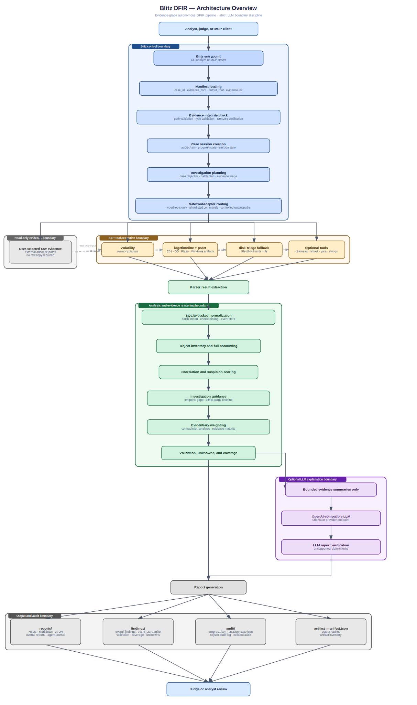

# JUDGES: Submission Compliance Quick-Reference

> All required components are present. This table tells you exactly where to find each one.

| Requirement | Location |
|---|---|
| Public repository | [`github.com/rienman88/Blitz-DFIR`](https://github.com/rienman88/Blitz-DFIR) |
| License | [`LICENSE`](LICENSE) (Apache 2.0) |
| Why use Blitz-DFIR? | [`What problem/s does Blitz-DFIR solve?`](docs/Why%20use%20Blitz%20DFIR.md) |
| Demonstration video | [YouTube — Blitz DFIR Demo 2026](https://www.youtube.com/watch?v=KVRA7pNhdnU&t=93s) |
| Architecture diagrams |  |
| Datasets | [`Combined run of Rocba Memory and E01`] |
| Blitz-DFIR-Results | [`findings, audit, reports`](https://github.com/rienman88/Blitz-DFIR-Results/tree/main) |
| Investigation conclusion | [`INVESTIGATION_CONCLUSION`](submission/packet/01_INVESTIGATION_CONCLUSION.md) |
| Run summary | [`RUN_SUMMARY_COMPACT.json`](submission/packet/02_RUN_SUMMARY_COMPACT.json) |
| Rocba LLM agent logs | [`submission/rocba_llm_agent_logs`](submission/rocba_llm_agent_logs/) |
| Devpost Blitz DFIR | [`devpost post`](https://devpost.com/software/blitz-dfir?ref_content=user-portfolio&ref_feature=in_progress) |


# Blitz-DFIR

Blitz-DFIR is an evidence-driven investigative analysis pipeline for digital forensics and incident response.

It orchestrates forensic tools, correlates findings across artifacts, preserves uncertainty, and produces repeatable, traceable, and structured investigations.

## In plain words

* SIFT tools perform the forensic extraction.
* Blitz executes approved tool routes, verifies evidence integrity, records provenance, normalizes artifacts, correlates findings, validates claims, and generates structured reports.
* Raw evidence remains in place. Large evidence files are referenced directly and are not copied into `/cases`.
* Investigative findings come from deterministic extraction, normalization, correlation, and validation layers.
* LLM support is optional. Blitz operates fully without an LLM.
* When enabled, LLMs are used only for bounded explanations and summaries. They are never authoritative and cannot create findings.

**Evidence remains the source of truth. Humans remain the final authority.**


| Guides | Location |
|---|---|
| Installation and setup of writable Volatility symbol cache | [`This Document`](#download-and-install) |
| Ways to run Blitz DFIR | [`How to run Blitz DFIR`](docs/Ways%20to%20run%20Blitz%20DFIR.md) |
| Helpful Commands | [`Commands`](docs/Helpful%20commands.md) |
| LLM Configuration | [LLM](docs/LLM%20Configurations.md) |
| Everything about Blitz DFIR results | [`Files expected to generate after every successful run`](docs/Where%20%20to%20find%20Blitz%20DFIR%20generated%20results.md) |
| Troubleshooting Guide | [Common Issues](docs/Common%20Issues.md) |

# How It Works

"Evidence → Tool Routes → Parsing → Normalization → Correlation → Validation → Optional AI Explanation → Reports"

1. Provide evidence – Supply memory images, disk images, timelines, or supported forensic artifacts. Evidence remains the source of truth throughout the workflow.

2. Execute approved analysis routes – Blitz orchestrates deterministic DFIR tools and parsers, verifies evidence integrity, and records execution details for auditability and reproducibility.

3. Parse and normalize artifacts – Outputs from multiple sources are transformed into a common representation to enable cross-artifact analysis and correlation.

4. Correlate and score findings – Related events are linked across artifacts to identify suspicious activity and generate evidence-backed findings.

5. Preserve uncertainty and validate claims – Parser limitations, warnings, contradictions, and coverage gaps are retained to prevent overstating confidence and to support transparent analysis.

6. Generate optional AI explanations – When enabled, AI summarizes and explains evidence-backed findings. AI does not create evidence, determine conclusions, or modify findings.

7. Produce structured reports – Blitz generates reports and investigation artifacts that help analysts continue deeper forensic analysis and incident response activities.
## Safest Testing Order

Use this order for demos, judging, and client testing:

1. Run one small or known-good evidence item without LLM.
2. Check status and open the generated reports.
3. Run the same evidence with LLM enabled.
4. Run two evidence items together, for example memory plus E01, without LLM.
5. Run the same two evidence items with LLM enabled.
6. Review coverage gaps, validation warnings, unknowns, and agent logs before making any conclusion.

Each new clean run creates:

```text
/cases/<CASE>/analysis/runs/<timestamp>_*
/cases/<CASE>/output/sess-*
```

`scripts/blitz_status.sh` only reads the latest run. It does not continue, restart, or modify an analysis.

## Requirements

Recommended environment:

- SANS SIFT Workstation or Ubuntu with the required SIFT tools installed.
- Python 3.11 or newer.
- A writable case directory under `/cases`.
- Optional Ollama or another OpenAI-compatible chat-completions service for LLM reasoning.

Core Python package requirements are in:

```text
requirements.txt
requirements-dev.txt
pyproject.toml
```

Required SIFT/tooling checks:

```bash
which python3
which log2timeline.py
which psort.py
which pinfo.py
which vol
which mmls
which fls
which strings
```

Optional tools:

```bash
which chainsaw || true
which tshark || true
which yara || true
```

## Download And Install

On SIFT:

```bash
cd /home/sansforensics/src
git clone https://github.com/rienman88/Blitz-DFIR
cd /home/sansforensics/src/Blitz-DFIR

python3 -m venv .venv
. .venv/bin/activate
python -m pip install --upgrade pip
python -m pip install -r requirements.txt
```

Quick health check:

```bash
cd /home/sansforensics/src/Blitz-DFIR
.venv/bin/python -m compileall -q app.py blitz_dfir tests
.venv/bin/python -m pytest -q
```

If test dependencies are not installed:

```bash
.venv/bin/python -m pip install -r requirements-dev.txt
.venv/bin/python -m pytest -q
```

## Volatility Symbols

Blitz is configured to use a writable Volatility symbol cache:

```text
/cases/volatility_symbols
```

Create it once:

```bash
sudo mkdir -p /cases/volatility_symbols
sudo chown "$USER:$USER" /cases/volatility_symbols
chmod 700 /cases/volatility_symbols
```

The active tool config contains:

```yaml
symbols_dir: "/cases/volatility_symbols"
```

This prevents Volatility 3 from trying to save downloaded Windows symbols into a root-owned Python package directory.

## Supported Evidence Type Labels

Use these values in `case.yaml` or `EVIDENCE*_TYPE`:

```text
E01
DD
MEMORY
EVTX
PCAP
REGISTRY_HIVE
FILESYSTEM_ARTIFACT
PLASO
CSV_TIMELINE
JSON_EXPORT
VOLATILITY_JSON
YARA_MATCHES
STRINGS_OUTPUT
PREPROCESSED_EVTX
THIRD_PARTY_EXPORT
```

Common tested paths:

- `MEMORY` for raw memory images processed by Volatility.
- `E01` and `DD` for disk images processed by Plaso/log2timeline, with Sleuth Kit disk-triage fallback when full timeline extraction fails.
- `EVTX` or `PREPROCESSED_EVTX` for Windows event logs.
- `PLASO` and `CSV_TIMELINE` for already generated timeline data.
- `PCAP` for packet capture triage when `tshark` is available.

Only a maximum of two raw datasets simultaneously are tested for the public run flow. The manifest model can hold more records, but the judge/client runbook should use one or two evidence inputs for predictable review.

## Windows Artifact Coverage

The default Windows profile is:

```text
windows-light
```

It targets these artifact families when Plaso supports them:

```text
winevtx
prefetch
lnk
setupapi
windows_timeline
srum
amcache
bam
usbstor
usb devices
```

`mft` and `usnjrnl` are intentionally not part of the light default because they can be high-volume. They should be treated as deeper optional parsing, not the default demo path.

## Allowed Tools And Modules

The active allowlist is in:

```text
config/tools.yaml
```

Main tool routes:

```text
log2timeline  -> E01/DD/Windows artifact timeline extraction
psort         -> PLASO export
disk_triage   -> Sleuth Kit fallback for E01/DD when full Plaso extraction fails
volatility    -> MEMORY analysis
chainsaw      -> EVTX triage when available
tshark        -> PCAP triage when available
yara          -> YARA matching when rules are configured
strings       -> string extraction route
```

Default Volatility plugins:

```text
windows.pslist
windows.pstree
windows.cmdline
windows.psscan
windows.netscan
windows.malfind
```

Blitz does not expose a generic shell through its typed tool layer. Tool execution is constrained by manifest evidence type, configured executable path, allowlisted plugins, output directories, and audit logging.

## Manifest Basics

A manifest tells Blitz what case is being analyzed, where results should be written, and which evidence files are in scope.

Important fields:

```text
case_id        Short case name. This becomes part of /cases/<CASE>.
evidence_root  Use external when raw files live anywhere on disk and should not be copied.
output_root    Where Blitz writes reports, findings, audit files, and SQLite stores.
evidence       One or more evidence records with id, path, type, sha256, and description.
```

For user-selected files from any folder, use:

```yaml
evidence_root: external
```

That allows absolute evidence paths while keeping output under `/cases/<CASE>/output`.


