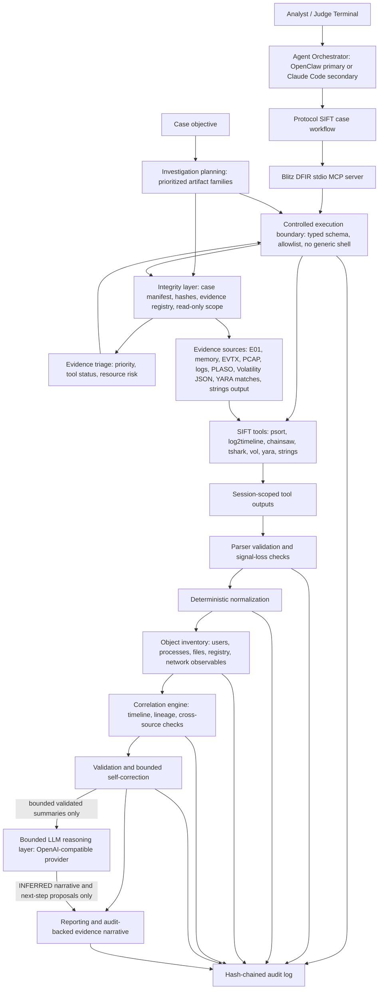
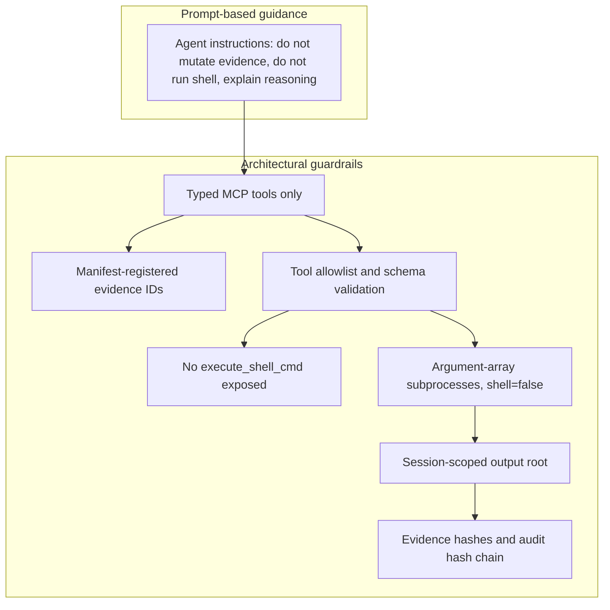
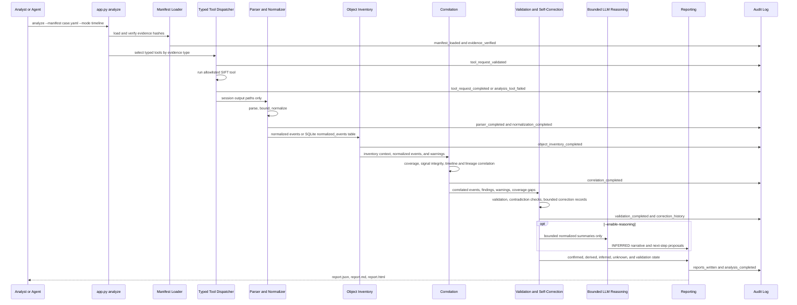

# Architecture

Blitz DFIR is a Protocol SIFT-compatible controlled forensic reasoning layer for the Find Evil hackathon.

Blitz DFIR uses a Custom MCP Server architecture running on SIFT, integrated with a Protocol SIFT-compatible agent path using OpenClaw or Claude Code. The LLM provider is swappable and not part of the security boundary.

## Supported Pattern

Primary Devpost pattern: Custom MCP Server.

Secondary compatibility path: Direct Agent Extension through Claude Code or OpenClaw when available.

The security boundary is architectural, not prompt-only. The model cannot call generic shell through Blitz because Blitz does not expose a generic shell tool.

## Simple Mental Model

- SIFT = forensic tools.
- Blitz = safety boundary, typed MCP server, parser, validator, normalizer, object inventory, correlation engine, reporter, and audit trail.
- Protocol SIFT / OpenClaw / Claude Code = the agent path that decides what typed action to request next.
- LLM provider = bounded text generator for validated reasoning summaries when enabled; it is not the security boundary.
- MCP = the safe bridge between the agent and Blitz typed forensic functions.
- Audit log = the proof trail connecting evidence, tools, parser output, findings, and reports.

## Relationship To SIFT And Protocol SIFT

Blitz does not replace SIFT, Protocol SIFT, Claude Code, or OpenClaw.

SIFT is the forensic tool platform. Blitz should use tools already installed in SIFT, such as Plaso, psort, Volatility, tshark, Chainsaw, YARA, and strings. Blitz must not become a separate forensic distribution and should not bundle or redeploy those tools.

Protocol SIFT is the AI-assisted SIFT workflow and integration path. It gives an analyst or agent a way to request forensic work inside the SIFT environment. Blitz sits underneath that workflow as the typed safety and evidence-accounting layer. The intended control path is:

```text
Protocol SIFT / OpenClaw / Claude Code
  -> Blitz typed MCP tools
  -> SIFT-installed forensic utilities
  -> Blitz parsing, accounting, validation, unknowns, reports, and audit logs
```

This distinction is central to the submission. Protocol SIFT helps the AI operate inside SIFT. Blitz constrains what the AI can ask for, sequences heavy work into bounded batches, records complete accounting for exported evidence rows, and refuses to turn unsupported or partial data into confirmed claims.

The input strategy is deliberately split:

- The case objective is analyst context. It guides prioritization but cannot create findings.
- Raw evidence goes to SIFT tools for extraction, carving, parsing, timeline generation, and deleted-artifact recovery.
- Normalized events, accounting totals, warnings, source metadata, and provenance links go to Blitz correlation, evidentiary weighting, contradiction analysis, confidence, validation, and bounded LLM reasoning when enabled.

This is stronger than asking an AI to inspect raw data directly. The judge-facing claim is that Blitz inventories and routes supported evidence, preserves full accounting, and reports missing, unsupported, degraded, or unprocessed areas as coverage gaps.

## Evidence-First Planning

Blitz is evidence-first, not SOC-style alert-first. The operator may provide a case objective, but the objective is treated as planning context only.

```text
Case Objective
  -> Investigation Plan
  -> Manifest-verified evidence
  -> Evidence Inventory
  -> Recovery Planning
  -> Evidence Triage
  -> Existing Blitz DFIR pipeline
```

The case objective layer writes `findings/case_objective.json` and `reports/case_objective.md`. It records the investigation objective, success criteria, constraints, and all evidence IDs in scope. The objective cannot create findings or override manifest, hash, parser, tool, correlation, or confidence controls.

The investigation planning layer writes `findings/investigation_plan.json` and `reports/investigation_plan.md`. It prioritizes available artifact families such as event logs, PLASO timeline, registry, memory, PCAP, disk timeline, and filesystem evidence. It can change batch order, but it cannot bypass typed tool allowlists, parser validation, full accounting, correlation, confidence scoring, contradiction analysis, or evidence maturity.

The evidence triage layer writes `findings/evidence_triage.json` and `reports/evidence_triage.md`. It ranks actual manifest evidence by forensic value, tool availability, resource risk, and recovery state. This is the judge-facing proof that Blitz knows what evidence should be analyzed first and which routes are blocked, unsupported, risky, or incomplete.

The earlier alert-intake/trigger overlay was removed from the active architecture on 2026-06-02 to keep Blitz focused on DFIR evidence rather than SOC alert handling.

The operator-facing monitor now includes these layers:

```text
Manifest and evidence integrity
Protocol SIFT workflow context
Case objective definition
Tool discovery
Investigation planning
Batch planning
Evidence inventory
Recovery planning
Evidence triage
...
```

## What Protocol SIFT Resolves And What Blitz Adds

| Capability | Protocol SIFT / SIFT Role | Blitz Role |
| --- | --- | --- |
| Tool availability | SIFT provides the DFIR tool environment. | Detects and calls SIFT tools through controlled wrappers; does not bundle them. |
| Agent entry point | Protocol SIFT, Claude Code, or OpenClaw provides the analyst/agent workflow. | Exposes typed MCP functions that an agent can call safely. |
| Command governance | Protocol SIFT emphasizes logged, artifact-tied action. | Adds schema validation, evidence IDs, allowlists, no generic shell, output scoping, and hash-chain audit records. |
| Heavy case execution | SIFT tools can process large evidence, but direct broad execution can overload small VMs. | Builds a batch plan and executes one artifact family at a time with resource limits. |
| Evidence completeness | SIFT tools emit raw outputs and parser exports. | Preserves full exported rows in accounting/event-store artifacts while keeping reports bounded. |
| Interpretation quality | Human responder remains responsible for conclusions. | Labels confirmed, derived, inferred, unknown, unsupported, partial, and needs-review states explicitly. |

## Component Diagram



## Batch Plan Layer

The batch plan layer is the bridge between broad agent intent and safe SIFT tool execution. Instead of letting an agent ask for unrestricted full-case analysis, Blitz converts the manifest into ordered artifact-family batches:

```text
1. Direct processed inputs
2. Windows Event Logs
3. PLASO timelines
4. Registry and persistence
5. Execution artifacts
6. Browser artifacts
7. Memory
8. PCAP
9. Disk timeline
10. Filesystem artifacts
11. Unsupported/manual review
```

Each batch declares a resource policy. For constrained SIFT VMs, the default is `max_parallel_tools=1`, explicit per-tool timeout policy, checkpoint-after-batch behavior, bounded normalized reporting, and full-accounting preservation where complete outputs are available.

The recovery planner writes `findings/recovery_plan.json` beside the batch plan. It enumerates primary and fallback extraction paths per evidence item, marks whether each path is typed, allowlisted, available, auto-runnable, blocked, or not integrated, and records unchecked recovery paths instead of letting an agent improvise. This is how Blitz handles scenarios where the correct forensic answer may require Plaso, Chainsaw, Velociraptor, or another specialized tool: supported typed routes can be sequenced safely, while unsupported routes are made explicit as gaps until a typed adapter, parser, and allowlist entry exist.

This batch plan is not a tool deployment mechanism. It is an execution contract for Protocol SIFT/OpenClaw/Claude Code so the agent can request the next safe step without overloading the workstation or bypassing forensic guardrails.

Planned MCP controls should expose the batch plan incrementally:

- `create_batch_plan`
- `get_batch_status`
- `run_next_batch`
- `summarize_unknowns`

Those controls allow Protocol SIFT to drive Blitz one batch at a time instead of invoking unrestricted all-at-once analysis.

## Who Does What

| Layer | Owner | AI? | Responsibility |
| --- | --- | --- | --- |
| Evidence sources | Case owner / analyst | No | Supplies raw or processed artifacts such as E01, memory, EVTX, PCAP, logs, and PLASO stores. |
| Integrity layer | Blitz | No | Loads manifest, verifies hashes, resolves evidence IDs, maintains read-only evidence posture, and records provenance. |
| Agent Orchestrator | OpenClaw primary, Claude Code secondary | Yes | Chooses the next typed forensic action to request, reacts to failures, and explains why a follow-up is needed. |
| Protocol SIFT case workflow | Protocol SIFT plus case instructions | Indirect | Provides the SIFT-oriented agent workflow and case context. It does not replace Blitz's typed boundary. |
| Typed MCP server | Blitz | No | Exposes structured tools such as `psort`, `pcap`, `events`, `memory`, `strings`, and `yara`; no generic shell tool is exposed. |
| Controlled execution boundary | Blitz | No | Validates schemas, evidence IDs, allowlisted tools, argument arrays, timeouts, and session-scoped output paths. |
| SIFT tooling | SANS SIFT tools | No | Performs forensic extraction and analysis using tools such as Plaso, psort, Volatility, Chainsaw, tshark, YARA, and strings. |
| Recovery planner | Blitz | No | Records primary and fallback extraction paths per evidence item, including blocked non-allowlisted or not-yet-integrated tools such as Velociraptor. |
| Parser validation and signal-loss checks | Blitz | No | Parses tool output, detects malformed or missing output, flags timeouts/truncation, and avoids false certainty. |
| Deterministic normalization | Blitz | No | Converts parser output into stable event and finding schemas with evidence references. |
| Object inventory | Blitz | No | Scans normalized events and records observed users, process images, process IDs, files, registry keys, hashes, network IPs, domains, URLs, evidence with no normalized events, and unsupported or unavailable evidence. |
| Correlation engine | Blitz | No | Builds timelines, process lineage, cross-source links, persistence signals, contradiction notes, and coverage gaps. |
| Evidentiary weighting | Blitz | No | Scores each finding's supporting sources by trust tier, parser/signal warning penalties, contradiction penalties, and source diversity. |
| Evidence contradiction analysis | Blitz | No | Formalizes cross-source disagreement, timestamp-skew contradictions, case contradiction score, and per-finding confidence impact. |
| Validation and self-correction | Blitz | No for trust decisions | Checks findings against evidence, distinguishes confirmed/derived/inferred claims, and records bounded retry decisions. |
| Bounded LLM reasoning | Swappable OpenAI-compatible provider | Yes | Explains bounded validated summaries and proposes next steps when enabled. Output is labeled `INFERRED` and cannot create confirmed findings. |
| Reporting and audit | Blitz | No | Writes JSON, Markdown, HTML reports, intermediate findings, and hash-chained NDJSON audit logs. |
| Private provider harness | Local developer environment | Yes, private only | Used only for private timing/reasoning smoke tests. It is excluded from judge setup and not part of the public security boundary. |

## Trust Boundaries



Prompt instructions improve behavior, but they are not the main safety control. The main safety controls are the manifest, typed MCP schema, allowlist, no generic shell exposure, session-scoped output paths, evidence hash verification, and audit chain.

## Run Completion And Tamper Evidence

Blitz distinguishes a complete run from an interrupted or partial run.

During analysis, Blitz also writes `audit/progress.json`. This is the analysis-layer status file for long SIFT runs. It lists the major layers, the current layer, layer status, weighted overall percent, elapsed time, writer PID, heartbeat updates, and a coarse ETA when enough progress exists to estimate one. SQLite-backed normalization also updates processed-row counts periodically so large 1M/2M/5M runs visibly advance instead of appearing hung. A completed normalization layer records the actual normalized row count, not merely the configured cap.

The current progress layers are intentionally separated for operator clarity: manifest/evidence integrity, Protocol SIFT workflow context, case objective, tool discovery, investigation planning, batch planning, evidence inventory, recovery planning, evidence triage, typed SIFT tool execution, parser result extraction, SQLite-backed normalization, object inventory, full accounting, SQLite event store, correlation/suspicion scoring, investigation guidance, evidentiary weighting, evidence contradiction analysis, validation, unknowns/coverage, bounded LLM reasoning over validated summaries, report generation, evidence maturity/provenance visualization, and audit finalization/artifact hashes. The bounded LLM reasoning layer is marked skipped when reasoning is disabled for a run and completed when a configured OpenAI-compatible provider such as Windows-hosted Ollama returns a bounded reasoning result.

The supervised SIFT launcher has a separate run/operator status file at `/cases/<CASE>/analysis/runs/<RUN_ID>/run_status.json`. This is the source of truth for whether the analysis process exited, post-run checks started or completed, and the launcher has returned or is returning the shell prompt. `audit/progress.json` can legitimately reach 100% before post-run checks finish; `scripts/blitz_status.sh` now shows both views and includes an artifact-readiness section for reports, case objective, investigation priorities, evidence triage, bounded LLM reasoning, validation/safety outputs, evidentiary weighting, contradiction analysis, provenance, audit attribution, and post-run checks.

`scripts/blitz_status.sh` also separates operator readability from raw process diagnostics. The active-process section summarizes long Blitz/SIFT commands into a table with PID, parent PID, state, elapsed time, CPU, memory, a process label, and parsed run limits. The evidence-category proof section shows manifest-registered evidence categories and normalized event category counts from SQLite, so a PLASO input is shown as `DERIVED` while bounded LLM reasoning remains separately labeled `INFERRED`. The review-map section then points analysts to the exact generated artifacts for final reports, bounded LLM reasoning, correlation findings/scoring, evidentiary weighting, contradiction analysis, evidence traceability, audit progress, artifact hashes, normalized samples, parser results, and tool results.

For shell monitoring, use:

```bash
unset SESSION
CASE=BLITZ-RD01-PLASO bash ~/src/Blitz_DFIR/scripts/blitz_monitor_until_done.sh
```

`scripts/blitz_monitor_until_done.sh` refreshes the same status screen and then returns to the shell prompt with `Blitz DFIR Process completed` only when the supervised run status is complete when that status file exists. `scripts/blitz_status.sh` remains the canonical one-shot status command. It reports `effective_status=LIVE_RUNNING` when a process is actively updating the selected session, `effective_status=COMPLETED` for finalized analysis sessions, and `effective_status=ABANDONED_OR_PARTIAL` when a session state still says `RUNNING` but no live process is updating it.

During analysis, Blitz writes `audit/session_state.json` at key checkpoints such as session creation, batch-plan creation, normalization completion, full-accounting completion, validation/unknowns completion, and final analysis completion. If a terminal closes or the process is killed, this state file shows the last completed phase instead of allowing a partial session to look complete.

On successful completion, Blitz writes `findings/artifact_manifest.json`. This manifest records the relative path, size, and SHA256 for generated session artifacts such as reports, parser outputs, full accounting, event stores, batch plans, and audit files available at manifest creation time. The audit log also records that the artifact manifest was written.

These are tamper-evident controls, not tamper-proof storage. If an attacker or user has unrestricted write access to the VM and can rewrite every local file, hashes alone cannot prevent that. The operational control for judge-grade evidence is to copy the final audit log, artifact manifest, report hashes, and evidence hashes off the VM or into a read-only location immediately after a completed run.

Interrupted sessions must be treated as `PARTIAL` or `RUNNING` unless the audit contains `analysis_completed`, the session state says `COMPLETED`, and the artifact manifest verifies against the current files.

Resume is checkpoint-based, not a license to skip forensic layers. A resume run may reuse completed typed tool outputs from `findings/tool_results.json` or recoverable `analysis_tool_result` audit entries, but it must rerun parsing, normalization, object inventory, accounting, SQLite storage, correlation, validation, unknowns, bounded LLM reasoning, reporting, and final artifact hashing. If the typed tool layer did not complete, the correct action is a fresh run.

## Analyze Flow



## Evidence Type Routing

```mermaid
flowchart TD
  Start["Manifest evidence item"]
  EVTX["EVTX"]
  PCAP["PCAP"]
  Memory["MEMORY"]
  Plaso["PLASO"]
  Csv["CSV_TIMELINE"]
  Disk["E01 / DD / registry / filesystem artifact"]
  Json["JSON_EXPORT"]
  VolJson["VOLATILITY_JSON"]
  YaraMatches["YARA_MATCHES"]
  StringsOutput["STRINGS_OUTPUT"]
  PreEvtx["PREPROCESSED_EVTX"]

  Start --> EVTX --> Events["events typed tool -> Chainsaw parser"]
  Start --> PCAP --> PcapTool["pcap typed tool -> tshark parser"]
  Start --> Memory --> Vol["memory typed tool -> allowlisted Volatility plugin"]
  Start --> Plaso --> Psort["psort typed tool -> dynamic triage/full export -> PLASO CSV parser"]
  Start --> Csv --> CsvParse["direct PLASO CSV parser"]
  Start --> Disk --> Timeline["timeline typed tool -> log2timeline -> derived PLASO -> psort"]
  Start --> Json --> JsonParse["direct Volatility JSON parser"]
  Start --> VolJson --> VolJsonParse["direct Volatility JSON parser"]
  Start --> YaraMatches --> YaraParse["direct YARA match parser"]
  Start --> StringsOutput --> StringsParse["direct strings-output parser"]
  Start --> PreEvtx --> EvtxParse["direct EVTX JSON parser"]
```



Processed PLASO files are imported through the manifest as `type: PLASO`. Existing CSV timelines are imported as `type: CSV_TIMELINE`. Preprocessed tool outputs can be submitted as `VOLATILITY_JSON`, `YARA_MATCHES`, `STRINGS_OUTPUT`, or `PREPROCESSED_EVTX`. Blitz accepts up to six manifest evidence inputs per run for this mixed-source workflow, routes typed processed outputs through direct parsers, and records `report.json.correlation_scope` to prove which evidence IDs produced normalized events for correlation and which remained unsupported or empty. Large PLASO stores use the bounded `triage` psort profile first; `full` export is explicit because multi-million-event stores can take longer than a safe first-pass autonomous loop.

## Reporting Interface

Blitz currently uses static report outputs rather than a web application:

- `reports/report.json` for machine-readable validation and Devpost evidence.
- `reports/report.md` for terminal-friendly review.
- `reports/report.html` for judge/demo viewing in a browser.
- `findings/object_inventory.json` for observed users, processes, files, registry keys, hashes, network observables, evidence with no normalized events, and unsupported/unavailable evidence.
- `findings/normalized_events.json`, `findings/validation.json`, `findings/signal_integrity.json`, `findings/evidentiary_weighting.json`, `findings/contradiction_analysis.json`, and `audit/*.ndjson` for traceability.
- `reports/finding_provenance.md` for Mermaid diagrams that trace selected findings through normalized events, parser output, typed tool execution, evidence IDs, and audit references.
- `audit/progress.json` plus `scripts/blitz_status.sh` for shell-readable live status, layer percent, writer PID/heartbeat, stale partial-session detection, elapsed time, and coarse ETA during long runs.

This is intentional for submission stability. A separate GUI would add risk before the deadline. The HTML report is the reporting interface for the MVP.

## Bounded LLM Reasoning

`app.py analyze` does not call an LLM by default. Bounded LLM reasoning runs only when `--enable-reasoning` and provider environment variables are supplied. Validation runs before bounded LLM reasoning. Only bounded normalized summaries are sent to a provider. Raw evidence, raw tool output, raw packet dumps, memory strings, and parser exports are not sent.

LLM output is labeled `INFERRED`. Deterministic findings, evidence references, and validation remain controlled by Blitz.

If the configured provider fails during runtime, for example a local Ollama timeout after preflight, Blitz fails closed for the LLM layer: it writes an audited `reasoning_provider_failed` condition, marks LLM report verification as `not_run`, and continues deterministic reporting, evidence maturity, agent trace, collated outputs, and artifact hashing. Provider failure does not create findings and does not suppress parser, normalization, correlation, validation, or coverage artifacts.
