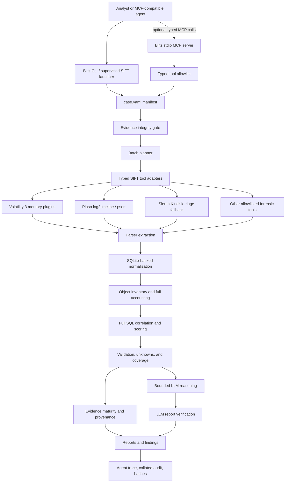

# Architecture Diagram And Trust Boundaries

## Architectural Pattern

Blitz DFIR uses a deterministic forensic control plane with a bounded LLM explanation layer and a typed MCP-compatible tool boundary.

The pattern is:

`Manifest-gated evidence pipeline -> typed forensic tools -> parsers -> SQLite normalization -> deterministic correlation -> validation and unknowns -> bounded LLM explanation -> report verification -> audit artifacts`

## Diagram

## Security Boundaries

| Boundary | Enforced By | What It Prevents |
| --- | --- | --- |
| Manifest evidence gate | `case.yaml`, hash verification, evidence type checks | Running tools against unregistered or tampered evidence |
| Typed tool boundary | Safe tool adapters, allowlists, `shell=False` subprocesses | Generic shell execution and arbitrary tool commands |
| Session output boundary | Session-scoped output directories and path validation | Writing outside the run output area |
| Evidence immutability | Read-only evidence references and external absolute path mode | Copying or modifying large raw evidence files unnecessarily |
| Parser and normalization boundary | Structured parsers, sanitized records, SQLite storage | Raw output directly controlling reports or prompts |
| LLM boundary | Bounded summaries only, no raw evidence, no raw tool output | Model access to raw case data and model-created findings |
| Verification boundary | LLM report verification and validation layers | Unsupported LLM claims entering trusted findings |
| Audit boundary | Append-only `.ndjson`, artifact hashes, progress state | Untraceable execution or silent pipeline changes |

## Prompt Guardrails Versus Architectural Guardrails

Prompt guardrails are used only for explanation style and structured response expectations.

Architectural guardrails are the real controls:

- The LLM cannot execute tools.
- The LLM cannot access raw evidence.
- The LLM cannot access raw tool output.
- The LLM cannot create or mutate findings.
- Generic shell is not exposed through the typed MCP tool surface.
- Findings require typed tool output, parser results, normalization, correlation, and traceability.

## Self-Correction Boundary

The self-correction behavior is bounded. In this run, full E01 Plaso timeline extraction failed with exit code `1`. Blitz recorded that failure, marked it as a coverage issue, and switched to bounded Sleuth Kit disk triage. It did not invent a new tool chain and did not hide the degraded Plaso coverage.

