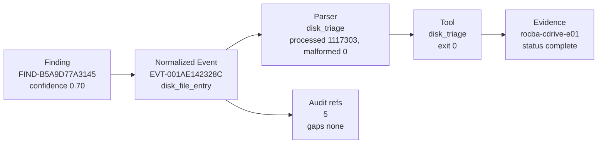
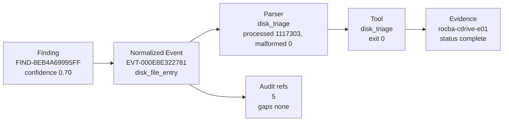
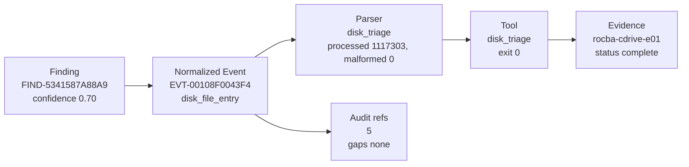
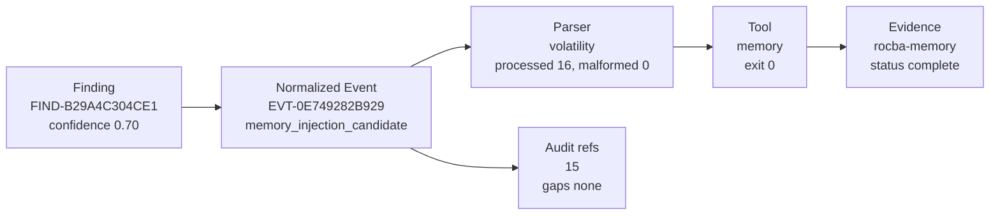
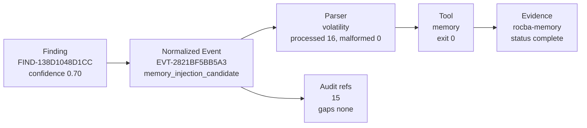
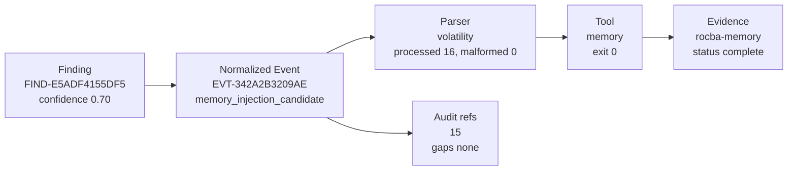
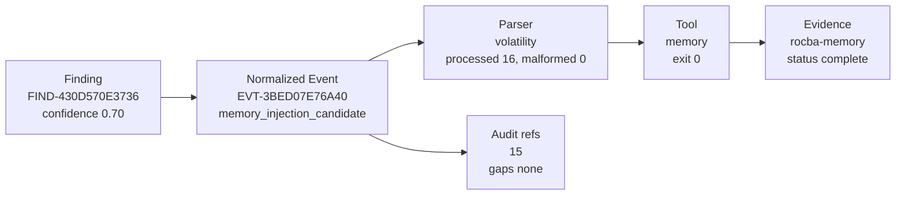

# Finding Provenance Visualization

- Case: `BLITZ-ROCBA-MEMORY-E01`
- Session: `sess-20260615T073626Z-5118ee34`
- Traceable findings: `22293/22293`
- Evidence hashes preserved: `True`
- Displayed findings: `10`

This file is generated from `findings/evidence_maturity.json`. It is a visualization of existing provenance, not a separate source of truth.

## Finding 1: `FIND-B5A9D77A3145`

- Title: Long-horizon authentication activity
- Confidence: `0.70`
- Triage score: `0.75`
- Confidence modifiers: `SINGLE_SOURCE_PENALTY`
- Attack stages: `initial_access_or_lateral_movement`
- Trace complete: `True`
- Gaps: none

Why flagged:

- long-horizon activity pattern detected by SQL aggregation across the normalized event store

## Finding 2: `FIND-8EB4A69995FF`

- Title: Long-horizon credential activity
- Confidence: `0.70`
- Triage score: `0.75`
- Confidence modifiers: `SINGLE_SOURCE_PENALTY`
- Attack stages: `privilege_or_credential_use`
- Trace complete: `True`
- Gaps: none

Why flagged:

- long-horizon activity pattern detected by SQL aggregation across the normalized event store

## Finding 3: `FIND-5341587A88A9`

- Title: Long-horizon persistence activity
- Confidence: `0.70`
- Triage score: `0.75`
- Confidence modifiers: `SINGLE_SOURCE_PENALTY`
- Attack stages: `persistence`
- Trace complete: `True`
- Gaps: none

Why flagged:

- long-horizon activity pattern detected by SQL aggregation across the normalized event store

## Finding 4: `FIND-B29A4C304CE1`

- Title: MEMORY_INJECTION_CANDIDATE event with memory-process indicators
- Confidence: `0.70`
- Triage score: `1.00`
- Confidence modifiers: `SINGLE_SOURCE_PENALTY`
- Attack stages: `execution, defense_evasion_or_injection`
- Trace complete: `True`
- Gaps: none

Why flagged:

- high-signal command or credential-analysis token observed
- memory plugin output indicates possible injected or suspicious memory region
- source event carried parser or signal warnings requiring analyst review

## Finding 5: `FIND-AD63D6A0FB9B`

- Title: MEMORY_INJECTION_CANDIDATE event with memory-process indicators
- Confidence: `0.70`
- Triage score: `1.00`
- Confidence modifiers: `SINGLE_SOURCE_PENALTY`
- Attack stages: `execution, defense_evasion_or_injection`
- Trace complete: `True`
- Gaps: none

Why flagged:

- high-signal command or credential-analysis token observed
- memory plugin output indicates possible injected or suspicious memory region
- source event carried parser or signal warnings requiring analyst review

## Finding 6: `FIND-138D1048D1CC`

- Title: MEMORY_INJECTION_CANDIDATE event with memory-process indicators
- Confidence: `0.70`
- Triage score: `1.00`
- Confidence modifiers: `SINGLE_SOURCE_PENALTY`
- Attack stages: `execution, defense_evasion_or_injection`
- Trace complete: `True`
- Gaps: none

Why flagged:

- high-signal command or credential-analysis token observed
- memory plugin output indicates possible injected or suspicious memory region
- source event carried parser or signal warnings requiring analyst review

## Finding 7: `FIND-EFAD092B4EF3`

- Title: MEMORY_INJECTION_CANDIDATE event with memory-process indicators
- Confidence: `0.70`
- Triage score: `1.00`
- Confidence modifiers: `SINGLE_SOURCE_PENALTY`
- Attack stages: `execution, defense_evasion_or_injection`
- Trace complete: `True`
- Gaps: none

Why flagged:

- high-signal command or credential-analysis token observed
- memory plugin output indicates possible injected or suspicious memory region
- source event carried parser or signal warnings requiring analyst review

## Finding 8: `FIND-E5ADF4155DF5`

- Title: MEMORY_INJECTION_CANDIDATE event with memory-process indicators
- Confidence: `0.70`
- Triage score: `1.00`
- Confidence modifiers: `SINGLE_SOURCE_PENALTY`
- Attack stages: `execution, defense_evasion_or_injection`
- Trace complete: `True`
- Gaps: none

Why flagged:

- high-signal command or credential-analysis token observed
- memory plugin output indicates possible injected or suspicious memory region
- source event carried parser or signal warnings requiring analyst review

## Finding 9: `FIND-6265AFED966F`

- Title: MEMORY_INJECTION_CANDIDATE event with memory-process indicators
- Confidence: `0.70`
- Triage score: `1.00`
- Confidence modifiers: `SINGLE_SOURCE_PENALTY`
- Attack stages: `execution, defense_evasion_or_injection`
- Trace complete: `True`
- Gaps: none

Why flagged:

- high-signal command or credential-analysis token observed
- memory plugin output indicates possible injected or suspicious memory region
- source event carried parser or signal warnings requiring analyst review

## Finding 10: `FIND-430D570E3736`

- Title: MEMORY_INJECTION_CANDIDATE event with memory-process indicators
- Confidence: `0.70`
- Triage score: `1.00`
- Confidence modifiers: `SINGLE_SOURCE_PENALTY`
- Attack stages: `execution, defense_evasion_or_injection`
- Trace complete: `True`
- Gaps: none

Why flagged:

- high-signal command or credential-analysis token observed
- memory plugin output indicates possible injected or suspicious memory region
- source event carried parser or signal warnings requiring analyst review
