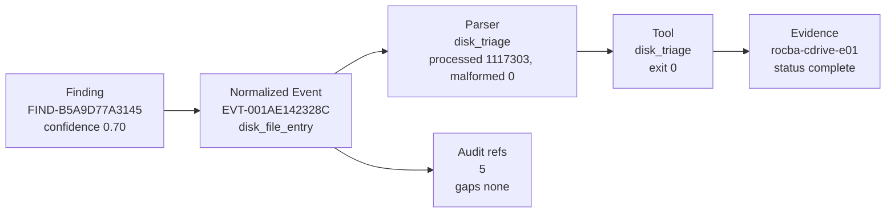
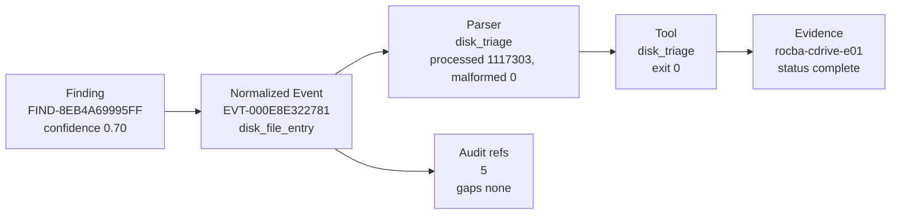
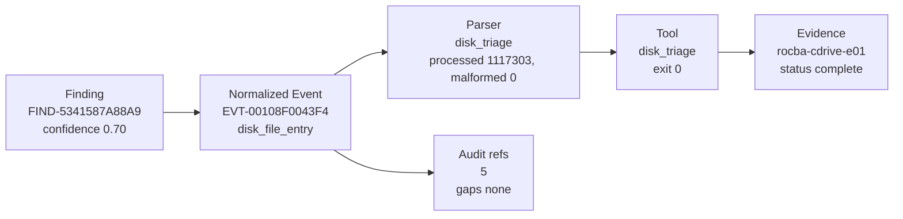
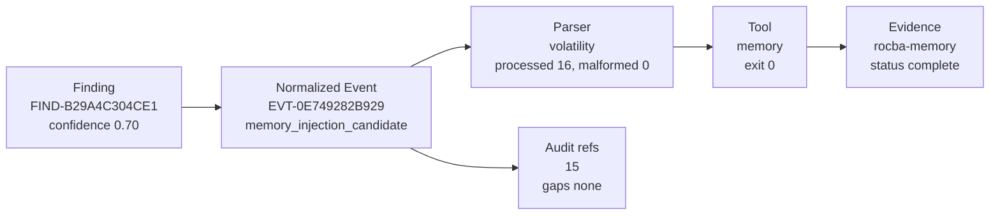
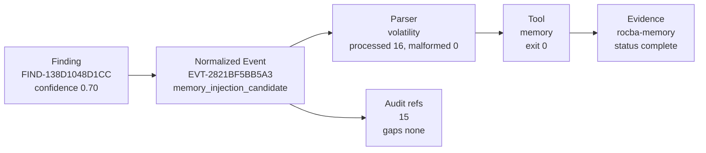
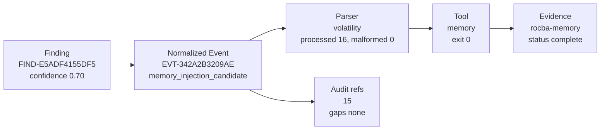
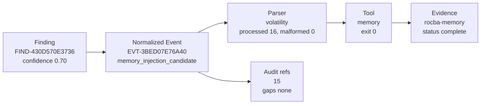

# Overall Reports

Label: overall reports

This document collates the judge-readable report documents generated for this session.

## Report Markdown

Source: `reports/report.md`

# Blitz DFIR Report

- Case: BLITZ-ROCBA-MEMORY-E01
- Generated: `2026-06-15T08:09:02.724520Z`
- Audit trail: `/cases/BLITZ-ROCBA-MEMORY-E01/output/sess-20260615T073626Z-5118ee34/audit/sess-20260615T073626Z-5118ee34.ndjson`
- Global case trust: `0.50`
- Parser consensus: `1.00`
- Tool integrity: `degraded`

Coverage X percent; analysis gaps documented. Tool output is evidence candidate.

## Case Objective And Evidence Triage

- Objective: Analyze Rocba memory and C-drive E01 together for evidence-backed suspicious processes, execution artifacts, persistence indicators, credential activity, user activity, temporal gaps, cross-source correlation, and unknowns while avoiding unsupported conclusions.
- Objective source: `cli`
- Planning mode: `evidence_first`
- Prioritized families: `memory, disk_timeline`
- Prioritized evidence: `rocba-memory, rocba-cdrive-e01`

The objective and triage plan guide work order only. Blitz findings still require manifest-verified evidence and typed tool output.

## Investigation Guidance

- Recommended tools: `events, memory, strings, timeline, yara`
- Attack stages: `defense_evasion_or_injection, execution, initial_access_or_lateral_movement, persistence, privilege_or_credential_use`
- Finding categories: `browser_artifact, campaign_activity, disk_file_entry, disk_suspicious_path, memory_injection_candidate, memory_process, memory_process_scan, powershell_history, scheduled_task, startup_item, windows_event_log, windows_prefetch`

- Investigate credential-use activity and related authentication artifacts.
- Review Volatility output, then run or review strings and YARA coverage.
- Review injected memory regions, unsigned code indicators, and process hollowing candidates.
- Review logon sources, remote access paths, and lateral-movement indicators.
- Review malfind memory regions and correlate injected process context.
- Review persistence mechanisms across registry, startup folders, services, and scheduled tasks.
- Validate process lineage and parent-child process relationships.

## Temporal Gap Analysis

- Events evaluated: `50000`
- Valid timestamps: `47795`
- Invalid or placeholder timestamps: `2205`
- First seen UTC: `1980-01-01T05:00:00Z`
- Last seen UTC: `2020-11-16T03:05:45Z`
- Largest gap seconds: `876745118`
- Timestamp quality: `partial`

2205 event(s) had invalid or placeholder timestamps. Review those records before using the 182 detected gap(s) as investigative boundaries.

## Attack-Stage Timeline

- Stage count: `5`
- Finding count: `22293`
- Limitation: This timeline orders deterministic attack-stage evidence only. It is not a campaign reconstruction and does not claim actor intent, victimology, or full intrusion scope without additional corroboration.

- `persistence` first `2013-10-17T19:20:02Z` last `2020-11-16T02:44:48Z` confidence `0.70` findings `143` events `855`
- `execution` first `2015-10-30T07:21:27Z` last `2020-11-16T02:41:33Z` confidence `0.70` findings `21496` events `21498`
- `privilege_or_credential_use` first `2019-12-07T09:08:52Z` last `2020-11-16T02:41:33Z` confidence `0.69` findings `61` events `61`
- `initial_access_or_lateral_movement` first `2019-12-07T09:09:47Z` last `2020-11-14T14:17:58Z` confidence `0.67` findings `13` events `13`
- `defense_evasion_or_injection` first `none` last `none` confidence `0.70` findings `16` events `16`

## Correlation Scope

- Input evidence: `2` of limit `6`
- Correlatable evidence: `2`
- Source mix: `multi_source`
- Correlation mode: `sqlite_full_store`
- Normalized events: `1124391`
- Analysis events: `50000`
- Participating evidence: `rocba-cdrive-e01, rocba-memory`
- Evidence without normalized events: ``
- Unsupported or unchecked evidence: ``

### Memory Plugin Scope

- Expected plugins: `windows.pslist, windows.pstree, windows.cmdline, windows.psscan, windows.netscan, windows.malfind`
- Successful plugins: `windows.pslist, windows.pstree, windows.cmdline, windows.psscan, windows.netscan, windows.malfind`
- Missing expected plugins: ``
- Scope note: A memory image is not cleared by process listing alone. Suspicious-process, command-line, network, process-scan, and malfind coverage must either succeed or remain explicit unknowns.

## Evidence-Supported Findings

### DISK_FILE_ENTRY event with persistence indicators

- Finding ID: `FIND-F9FE484FA830`
- Traceability: `traceable-to-normalized-events`
- Confidence: `0.70`
- Triage score: `1.00`
- Why suspicious: artifact or message references a common persistence location or scheduled task; living-off-the-land binary or shell token observed; path references a user-writable or temporary execution location; memory process name or command token merits review
- Why flagged: artifact or message references a common persistence location or scheduled task; living-off-the-land binary or shell token observed; path references a user-writable or temporary execution location; memory process name or command token merits review
- Confidence basis: `deterministic confidence score 0.70, SINGLE_SOURCE_PENALTY`
- Limitations: finding currently has single-source support; bounded recovery or correction notes are attached
- Evidence source: `rocba-cdrive-e01`
- Source tool/parser: `disk_triage / disk_triage`
- Correlation path: `EVT-79526AB7B1DF`
- Confidence modifiers: `SINGLE_SOURCE_PENALTY`
- Recovery notes: CORR-6B393CACF8EA: SKIPPED; correction action recorded but no executor was provided; CORR-671D1ACAF0CA: SKIPPED; correction action recorded but no executor was provided

SQLite full-correlation scan evaluated 1124391 normalized row(s), identified 22290 candidate row(s), and selected this single-source timeline event for analyst review.

### MEMORY_INJECTION_CANDIDATE event with memory-process indicators

- Finding ID: `FIND-F9D3EC513BBE`
- Traceability: `traceable-to-normalized-events`
- Confidence: `0.70`
- Triage score: `1.00`
- Why suspicious: high-signal command or credential-analysis token observed; memory plugin output indicates possible injected or suspicious memory region; source event carried parser or signal warnings requiring analyst review
- Why flagged: high-signal command or credential-analysis token observed; memory plugin output indicates possible injected or suspicious memory region; source event carried parser or signal warnings requiring analyst review
- Confidence basis: `deterministic confidence score 0.70, SINGLE_SOURCE_PENALTY`
- Limitations: finding currently has single-source support; bounded recovery or correction notes are attached
- Evidence source: `rocba-memory`
- Source tool/parser: `volatility / volatility`
- Correlation path: `EVT-58E6F8742D10`
- Confidence modifiers: `SINGLE_SOURCE_PENALTY`
- Recovery notes: CORR-6B393CACF8EA: SKIPPED; correction action recorded but no executor was provided; CORR-671D1ACAF0CA: SKIPPED; correction action recorded but no executor was provided

SQLite full-correlation scan evaluated 1124391 normalized row(s), identified 22290 candidate row(s), and selected this single-source timeline event for analyst review.

### DISK_FILE_ENTRY event with persistence indicators

- Finding ID: `FIND-F49921627423`
- Traceability: `traceable-to-normalized-events`
- Confidence: `0.70`
- Triage score: `1.00`
- Why suspicious: artifact or message references a common persistence location or scheduled task; living-off-the-land binary or shell token observed; path references a user-writable or temporary execution location; memory process name or command token merits review
- Why flagged: artifact or message references a common persistence location or scheduled task; living-off-the-land binary or shell token observed; path references a user-writable or temporary execution location; memory process name or command token merits review
- Confidence basis: `deterministic confidence score 0.70, SINGLE_SOURCE_PENALTY`
- Limitations: finding currently has single-source support; bounded recovery or correction notes are attached
- Evidence source: `rocba-cdrive-e01`
- Source tool/parser: `disk_triage / disk_triage`
- Correlation path: `EVT-6FDADBDA8E12`
- Confidence modifiers: `SINGLE_SOURCE_PENALTY`
- Recovery notes: CORR-6B393CACF8EA: SKIPPED; correction action recorded but no executor was provided; CORR-671D1ACAF0CA: SKIPPED; correction action recorded but no executor was provided

SQLite full-correlation scan evaluated 1124391 normalized row(s), identified 22290 candidate row(s), and selected this single-source timeline event for analyst review.

### MEMORY_INJECTION_CANDIDATE event with memory-process indicators

- Finding ID: `FIND-EFAD092B4EF3`
- Traceability: `traceable-to-normalized-events`
- Confidence: `0.70`
- Triage score: `1.00`
- Why suspicious: high-signal command or credential-analysis token observed; memory plugin output indicates possible injected or suspicious memory region; source event carried parser or signal warnings requiring analyst review
- Why flagged: high-signal command or credential-analysis token observed; memory plugin output indicates possible injected or suspicious memory region; source event carried parser or signal warnings requiring analyst review
- Confidence basis: `deterministic confidence score 0.70, SINGLE_SOURCE_PENALTY`
- Limitations: finding currently has single-source support; bounded recovery or correction notes are attached
- Evidence source: `rocba-memory`
- Source tool/parser: `volatility / volatility`
- Correlation path: `EVT-31F168B6C43F`
- Confidence modifiers: `SINGLE_SOURCE_PENALTY`
- Recovery notes: CORR-6B393CACF8EA: SKIPPED; correction action recorded but no executor was provided; CORR-671D1ACAF0CA: SKIPPED; correction action recorded but no executor was provided

SQLite full-correlation scan evaluated 1124391 normalized row(s), identified 22290 candidate row(s), and selected this single-source timeline event for analyst review.

### MEMORY_INJECTION_CANDIDATE event with memory-process indicators

- Finding ID: `FIND-E5CABFC1C61F`
- Traceability: `traceable-to-normalized-events`
- Confidence: `0.70`
- Triage score: `1.00`
- Why suspicious: high-signal command or credential-analysis token observed; memory plugin output indicates possible injected or suspicious memory region; source event carried parser or signal warnings requiring analyst review
- Why flagged: high-signal command or credential-analysis token observed; memory plugin output indicates possible injected or suspicious memory region; source event carried parser or signal warnings requiring analyst review
- Confidence basis: `deterministic confidence score 0.70, SINGLE_SOURCE_PENALTY`
- Limitations: finding currently has single-source support; bounded recovery or correction notes are attached
- Evidence source: `rocba-memory`
- Source tool/parser: `volatility / volatility`
- Correlation path: `EVT-F5293755BCE6`
- Confidence modifiers: `SINGLE_SOURCE_PENALTY`
- Recovery notes: CORR-6B393CACF8EA: SKIPPED; correction action recorded but no executor was provided; CORR-671D1ACAF0CA: SKIPPED; correction action recorded but no executor was provided

SQLite full-correlation scan evaluated 1124391 normalized row(s), identified 22290 candidate row(s), and selected this single-source timeline event for analyst review.

### MEMORY_INJECTION_CANDIDATE event with memory-process indicators

- Finding ID: `FIND-E5ADF4155DF5`
- Traceability: `traceable-to-normalized-events`
- Confidence: `0.70`
- Triage score: `1.00`
- Why suspicious: high-signal command or credential-analysis token observed; memory plugin output indicates possible injected or suspicious memory region; source event carried parser or signal warnings requiring analyst review
- Why flagged: high-signal command or credential-analysis token observed; memory plugin output indicates possible injected or suspicious memory region; source event carried parser or signal warnings requiring analyst review
- Confidence basis: `deterministic confidence score 0.70, SINGLE_SOURCE_PENALTY`
- Limitations: finding currently has single-source support; bounded recovery or correction notes are attached
- Evidence source: `rocba-memory`
- Source tool/parser: `volatility / volatility`
- Correlation path: `EVT-342A2B3209AE`
- Confidence modifiers: `SINGLE_SOURCE_PENALTY`
- Recovery notes: CORR-6B393CACF8EA: SKIPPED; correction action recorded but no executor was provided; CORR-671D1ACAF0CA: SKIPPED; correction action recorded but no executor was provided

SQLite full-correlation scan evaluated 1124391 normalized row(s), identified 22290 candidate row(s), and selected this single-source timeline event for analyst review.

### DISK_FILE_ENTRY event with persistence indicators

- Finding ID: `FIND-E4FD56264644`
- Traceability: `traceable-to-normalized-events`
- Confidence: `0.70`
- Triage score: `1.00`
- Why suspicious: artifact or message references a common persistence location or scheduled task; living-off-the-land binary or shell token observed; path references a user-writable or temporary execution location; memory process name or command token merits review
- Why flagged: artifact or message references a common persistence location or scheduled task; living-off-the-land binary or shell token observed; path references a user-writable or temporary execution location; memory process name or command token merits review
- Confidence basis: `deterministic confidence score 0.70, SINGLE_SOURCE_PENALTY`
- Limitations: finding currently has single-source support; bounded recovery or correction notes are attached
- Evidence source: `rocba-cdrive-e01`
- Source tool/parser: `disk_triage / disk_triage`
- Correlation path: `EVT-65A6B78EAE23`
- Confidence modifiers: `SINGLE_SOURCE_PENALTY`
- Recovery notes: CORR-6B393CACF8EA: SKIPPED; correction action recorded but no executor was provided; CORR-671D1ACAF0CA: SKIPPED; correction action recorded but no executor was provided

SQLite full-correlation scan evaluated 1124391 normalized row(s), identified 22290 candidate row(s), and selected this single-source timeline event for analyst review.

### DISK_FILE_ENTRY event with persistence indicators

- Finding ID: `FIND-DCB062FCDC6F`
- Traceability: `traceable-to-normalized-events`
- Confidence: `0.70`
- Triage score: `1.00`
- Why suspicious: artifact or message references a common persistence location or scheduled task; living-off-the-land binary or shell token observed; path references a user-writable or temporary execution location; memory process name or command token merits review
- Why flagged: artifact or message references a common persistence location or scheduled task; living-off-the-land binary or shell token observed; path references a user-writable or temporary execution location; memory process name or command token merits review
- Confidence basis: `deterministic confidence score 0.70, SINGLE_SOURCE_PENALTY`
- Limitations: finding currently has single-source support; bounded recovery or correction notes are attached
- Evidence source: `rocba-cdrive-e01`
- Source tool/parser: `disk_triage / disk_triage`
- Correlation path: `EVT-DAB57AFB6EA9`
- Confidence modifiers: `SINGLE_SOURCE_PENALTY`
- Recovery notes: CORR-6B393CACF8EA: SKIPPED; correction action recorded but no executor was provided; CORR-671D1ACAF0CA: SKIPPED; correction action recorded but no executor was provided

SQLite full-correlation scan evaluated 1124391 normalized row(s), identified 22290 candidate row(s), and selected this single-source timeline event for analyst review.

### MEMORY_INJECTION_CANDIDATE event with memory-process indicators

- Finding ID: `FIND-D55BCD9BD454`
- Traceability: `traceable-to-normalized-events`
- Confidence: `0.70`
- Triage score: `1.00`
- Why suspicious: high-signal command or credential-analysis token observed; memory plugin output indicates possible injected or suspicious memory region; source event carried parser or signal warnings requiring analyst review
- Why flagged: high-signal command or credential-analysis token observed; memory plugin output indicates possible injected or suspicious memory region; source event carried parser or signal warnings requiring analyst review
- Confidence basis: `deterministic confidence score 0.70, SINGLE_SOURCE_PENALTY`
- Limitations: finding currently has single-source support; bounded recovery or correction notes are attached
- Evidence source: `rocba-memory`
- Source tool/parser: `volatility / volatility`
- Correlation path: `EVT-E9B595CAB100`
- Confidence modifiers: `SINGLE_SOURCE_PENALTY`
- Recovery notes: CORR-6B393CACF8EA: SKIPPED; correction action recorded but no executor was provided; CORR-671D1ACAF0CA: SKIPPED; correction action recorded but no executor was provided

SQLite full-correlation scan evaluated 1124391 normalized row(s), identified 22290 candidate row(s), and selected this single-source timeline event for analyst review.

### DISK_FILE_ENTRY event with persistence indicators

- Finding ID: `FIND-D0D9902A12CD`
- Traceability: `traceable-to-normalized-events`
- Confidence: `0.70`
- Triage score: `1.00`
- Why suspicious: artifact or message references a common persistence location or scheduled task; living-off-the-land binary or shell token observed; path references a user-writable or temporary execution location; memory process name or command token merits review
- Why flagged: artifact or message references a common persistence location or scheduled task; living-off-the-land binary or shell token observed; path references a user-writable or temporary execution location; memory process name or command token merits review
- Confidence basis: `deterministic confidence score 0.70, SINGLE_SOURCE_PENALTY`
- Limitations: finding currently has single-source support; bounded recovery or correction notes are attached
- Evidence source: `rocba-cdrive-e01`
- Source tool/parser: `disk_triage / disk_triage`
- Correlation path: `EVT-42521D2724D5`
- Confidence modifiers: `SINGLE_SOURCE_PENALTY`
- Recovery notes: CORR-6B393CACF8EA: SKIPPED; correction action recorded but no executor was provided; CORR-671D1ACAF0CA: SKIPPED; correction action recorded but no executor was provided

SQLite full-correlation scan evaluated 1124391 normalized row(s), identified 22290 candidate row(s), and selected this single-source timeline event for analyst review.

### MEMORY_INJECTION_CANDIDATE event with memory-process indicators

- Finding ID: `FIND-B29A4C304CE1`
- Traceability: `traceable-to-normalized-events`
- Confidence: `0.70`
- Triage score: `1.00`
- Why suspicious: high-signal command or credential-analysis token observed; memory plugin output indicates possible injected or suspicious memory region; source event carried parser or signal warnings requiring analyst review
- Why flagged: high-signal command or credential-analysis token observed; memory plugin output indicates possible injected or suspicious memory region; source event carried parser or signal warnings requiring analyst review
- Confidence basis: `deterministic confidence score 0.70, SINGLE_SOURCE_PENALTY`
- Limitations: finding currently has single-source support; bounded recovery or correction notes are attached
- Evidence source: `rocba-memory`
- Source tool/parser: `volatility / volatility`
- Correlation path: `EVT-0E749282B929`
- Confidence modifiers: `SINGLE_SOURCE_PENALTY`
- Recovery notes: CORR-6B393CACF8EA: SKIPPED; correction action recorded but no executor was provided; CORR-671D1ACAF0CA: SKIPPED; correction action recorded but no executor was provided

SQLite full-correlation scan evaluated 1124391 normalized row(s), identified 22290 candidate row(s), and selected this single-source timeline event for analyst review.

### MEMORY_INJECTION_CANDIDATE event with memory-process indicators

- Finding ID: `FIND-AD63D6A0FB9B`
- Traceability: `traceable-to-normalized-events`
- Confidence: `0.70`
- Triage score: `1.00`
- Why suspicious: high-signal command or credential-analysis token observed; memory plugin output indicates possible injected or suspicious memory region; source event carried parser or signal warnings requiring analyst review
- Why flagged: high-signal command or credential-analysis token observed; memory plugin output indicates possible injected or suspicious memory region; source event carried parser or signal warnings requiring analyst review
- Confidence basis: `deterministic confidence score 0.70, SINGLE_SOURCE_PENALTY`
- Limitations: finding currently has single-source support; bounded recovery or correction notes are attached
- Evidence source: `rocba-memory`
- Source tool/parser: `volatility / volatility`
- Correlation path: `EVT-267C4A910D94`
- Confidence modifiers: `SINGLE_SOURCE_PENALTY`
- Recovery notes: CORR-6B393CACF8EA: SKIPPED; correction action recorded but no executor was provided; CORR-671D1ACAF0CA: SKIPPED; correction action recorded but no executor was provided

SQLite full-correlation scan evaluated 1124391 normalized row(s), identified 22290 candidate row(s), and selected this single-source timeline event for analyst review.

### DISK_FILE_ENTRY event with persistence indicators

- Finding ID: `FIND-973E8DE61908`
- Traceability: `traceable-to-normalized-events`
- Confidence: `0.70`
- Triage score: `1.00`
- Why suspicious: artifact or message references a common persistence location or scheduled task; living-off-the-land binary or shell token observed; path references a user-writable or temporary execution location; memory process name or command token merits review
- Why flagged: artifact or message references a common persistence location or scheduled task; living-off-the-land binary or shell token observed; path references a user-writable or temporary execution location; memory process name or command token merits review
- Confidence basis: `deterministic confidence score 0.70, SINGLE_SOURCE_PENALTY`
- Limitations: finding currently has single-source support; bounded recovery or correction notes are attached
- Evidence source: `rocba-cdrive-e01`
- Source tool/parser: `disk_triage / disk_triage`
- Correlation path: `EVT-EB4D6FE7CA52`
- Confidence modifiers: `SINGLE_SOURCE_PENALTY`
- Recovery notes: CORR-6B393CACF8EA: SKIPPED; correction action recorded but no executor was provided; CORR-671D1ACAF0CA: SKIPPED; correction action recorded but no executor was provided

SQLite full-correlation scan evaluated 1124391 normalized row(s), identified 22290 candidate row(s), and selected this single-source timeline event for analyst review.

### MEMORY_INJECTION_CANDIDATE event with memory-process indicators

- Finding ID: `FIND-8C97C1B55202`
- Traceability: `traceable-to-normalized-events`
- Confidence: `0.70`
- Triage score: `1.00`
- Why suspicious: high-signal command or credential-analysis token observed; memory plugin output indicates possible injected or suspicious memory region; source event carried parser or signal warnings requiring analyst review
- Why flagged: high-signal command or credential-analysis token observed; memory plugin output indicates possible injected or suspicious memory region; source event carried parser or signal warnings requiring analyst review
- Confidence basis: `deterministic confidence score 0.70, SINGLE_SOURCE_PENALTY`
- Limitations: finding currently has single-source support; bounded recovery or correction notes are attached
- Evidence source: `rocba-memory`
- Source tool/parser: `volatility / volatility`
- Correlation path: `EVT-B0FD9E8B4E96`
- Confidence modifiers: `SINGLE_SOURCE_PENALTY`
- Recovery notes: CORR-6B393CACF8EA: SKIPPED; correction action recorded but no executor was provided; CORR-671D1ACAF0CA: SKIPPED; correction action recorded but no executor was provided

SQLite full-correlation scan evaluated 1124391 normalized row(s), identified 22290 candidate row(s), and selected this single-source timeline event for analyst review.

### DISK_FILE_ENTRY event with persistence indicators

- Finding ID: `FIND-861ED749DE97`
- Traceability: `traceable-to-normalized-events`
- Confidence: `0.70`
- Triage score: `1.00`
- Why suspicious: artifact or message references a common persistence location or scheduled task; living-off-the-land binary or shell token observed; path references a user-writable or temporary execution location; memory process name or command token merits review
- Why flagged: artifact or message references a common persistence location or scheduled task; living-off-the-land binary or shell token observed; path references a user-writable or temporary execution location; memory process name or command token merits review
- Confidence basis: `deterministic confidence score 0.70, SINGLE_SOURCE_PENALTY`
- Limitations: finding currently has single-source support; bounded recovery or correction notes are attached
- Evidence source: `rocba-cdrive-e01`
- Source tool/parser: `disk_triage / disk_triage`
- Correlation path: `EVT-A20FB977B994`
- Confidence modifiers: `SINGLE_SOURCE_PENALTY`
- Recovery notes: CORR-6B393CACF8EA: SKIPPED; correction action recorded but no executor was provided; CORR-671D1ACAF0CA: SKIPPED; correction action recorded but no executor was provided

SQLite full-correlation scan evaluated 1124391 normalized row(s), identified 22290 candidate row(s), and selected this single-source timeline event for analyst review.

### DISK_FILE_ENTRY event with persistence indicators

- Finding ID: `FIND-8057BCF7048F`
- Traceability: `traceable-to-normalized-events`
- Confidence: `0.70`
- Triage score: `1.00`
- Why suspicious: artifact or message references a common persistence location or scheduled task; living-off-the-land binary or shell token observed; path references a user-writable or temporary execution location; memory process name or command token merits review
- Why flagged: artifact or message references a common persistence location or scheduled task; living-off-the-land binary or shell token observed; path references a user-writable or temporary execution location; memory process name or command token merits review
- Confidence basis: `deterministic confidence score 0.70, SINGLE_SOURCE_PENALTY`
- Limitations: finding currently has single-source support; bounded recovery or correction notes are attached
- Evidence source: `rocba-cdrive-e01`
- Source tool/parser: `disk_triage / disk_triage`
- Correlation path: `EVT-FC845BB45795`
- Confidence modifiers: `SINGLE_SOURCE_PENALTY`
- Recovery notes: CORR-6B393CACF8EA: SKIPPED; correction action recorded but no executor was provided; CORR-671D1ACAF0CA: SKIPPED; correction action recorded but no executor was provided

SQLite full-correlation scan evaluated 1124391 normalized row(s), identified 22290 candidate row(s), and selected this single-source timeline event for analyst review.

### DISK_FILE_ENTRY event with persistence indicators

- Finding ID: `FIND-73A5B33CC0D8`
- Traceability: `traceable-to-normalized-events`
- Confidence: `0.70`
- Triage score: `1.00`
- Why suspicious: artifact or message references a common persistence location or scheduled task; living-off-the-land binary or shell token observed; path references a user-writable or temporary execution location; memory process name or command token merits review
- Why flagged: artifact or message references a common persistence location or scheduled task; living-off-the-land binary or shell token observed; path references a user-writable or temporary execution location; memory process name or command token merits review
- Confidence basis: `deterministic confidence score 0.70, SINGLE_SOURCE_PENALTY`
- Limitations: finding currently has single-source support; bounded recovery or correction notes are attached
- Evidence source: `rocba-cdrive-e01`
- Source tool/parser: `disk_triage / disk_triage`
- Correlation path: `EVT-44524C496296`
- Confidence modifiers: `SINGLE_SOURCE_PENALTY`
- Recovery notes: CORR-6B393CACF8EA: SKIPPED; correction action recorded but no executor was provided; CORR-671D1ACAF0CA: SKIPPED; correction action recorded but no executor was provided

SQLite full-correlation scan evaluated 1124391 normalized row(s), identified 22290 candidate row(s), and selected this single-source timeline event for analyst review.

### MEMORY_INJECTION_CANDIDATE event with memory-process indicators

- Finding ID: `FIND-7244635D1323`
- Traceability: `traceable-to-normalized-events`
- Confidence: `0.70`
- Triage score: `1.00`
- Why suspicious: high-signal command or credential-analysis token observed; memory plugin output indicates possible injected or suspicious memory region; source event carried parser or signal warnings requiring analyst review
- Why flagged: high-signal command or credential-analysis token observed; memory plugin output indicates possible injected or suspicious memory region; source event carried parser or signal warnings requiring analyst review
- Confidence basis: `deterministic confidence score 0.70, SINGLE_SOURCE_PENALTY`
- Limitations: finding currently has single-source support; bounded recovery or correction notes are attached
- Evidence source: `rocba-memory`
- Source tool/parser: `volatility / volatility`
- Correlation path: `EVT-C33F97A7639F`
- Confidence modifiers: `SINGLE_SOURCE_PENALTY`
- Recovery notes: CORR-6B393CACF8EA: SKIPPED; correction action recorded but no executor was provided; CORR-671D1ACAF0CA: SKIPPED; correction action recorded but no executor was provided

SQLite full-correlation scan evaluated 1124391 normalized row(s), identified 22290 candidate row(s), and selected this single-source timeline event for analyst review.

### MEMORY_INJECTION_CANDIDATE event with memory-process indicators

- Finding ID: `FIND-6265AFED966F`
- Traceability: `traceable-to-normalized-events`
- Confidence: `0.70`
- Triage score: `1.00`
- Why suspicious: high-signal command or credential-analysis token observed; memory plugin output indicates possible injected or suspicious memory region; source event carried parser or signal warnings requiring analyst review
- Why flagged: high-signal command or credential-analysis token observed; memory plugin output indicates possible injected or suspicious memory region; source event carried parser or signal warnings requiring analyst review
- Confidence basis: `deterministic confidence score 0.70, SINGLE_SOURCE_PENALTY`
- Limitations: finding currently has single-source support; bounded recovery or correction notes are attached
- Evidence source: `rocba-memory`
- Source tool/parser: `volatility / volatility`
- Correlation path: `EVT-3B1099250470`
- Confidence modifiers: `SINGLE_SOURCE_PENALTY`
- Recovery notes: CORR-6B393CACF8EA: SKIPPED; correction action recorded but no executor was provided; CORR-671D1ACAF0CA: SKIPPED; correction action recorded but no executor was provided

SQLite full-correlation scan evaluated 1124391 normalized row(s), identified 22290 candidate row(s), and selected this single-source timeline event for analyst review.

### DISK_FILE_ENTRY event with persistence indicators

- Finding ID: `FIND-56391617C7B6`
- Traceability: `traceable-to-normalized-events`
- Confidence: `0.70`
- Triage score: `1.00`
- Why suspicious: artifact or message references a common persistence location or scheduled task; living-off-the-land binary or shell token observed; path references a user-writable or temporary execution location; memory process name or command token merits review
- Why flagged: artifact or message references a common persistence location or scheduled task; living-off-the-land binary or shell token observed; path references a user-writable or temporary execution location; memory process name or command token merits review
- Confidence basis: `deterministic confidence score 0.70, SINGLE_SOURCE_PENALTY`
- Limitations: finding currently has single-source support; bounded recovery or correction notes are attached
- Evidence source: `rocba-cdrive-e01`
- Source tool/parser: `disk_triage / disk_triage`
- Correlation path: `EVT-64536292B11A`
- Confidence modifiers: `SINGLE_SOURCE_PENALTY`
- Recovery notes: CORR-6B393CACF8EA: SKIPPED; correction action recorded but no executor was provided; CORR-671D1ACAF0CA: SKIPPED; correction action recorded but no executor was provided

SQLite full-correlation scan evaluated 1124391 normalized row(s), identified 22290 candidate row(s), and selected this single-source timeline event for analyst review.

### MEMORY_INJECTION_CANDIDATE event with memory-process indicators

- Finding ID: `FIND-4CAA4BE5F588`
- Traceability: `traceable-to-normalized-events`
- Confidence: `0.70`
- Triage score: `1.00`
- Why suspicious: high-signal command or credential-analysis token observed; memory plugin output indicates possible injected or suspicious memory region; source event carried parser or signal warnings requiring analyst review
- Why flagged: high-signal command or credential-analysis token observed; memory plugin output indicates possible injected or suspicious memory region; source event carried parser or signal warnings requiring analyst review
- Confidence basis: `deterministic confidence score 0.70, SINGLE_SOURCE_PENALTY`
- Limitations: finding currently has single-source support; bounded recovery or correction notes are attached
- Evidence source: `rocba-memory`
- Source tool/parser: `volatility / volatility`
- Correlation path: `EVT-44DC6AE40516`
- Confidence modifiers: `SINGLE_SOURCE_PENALTY`
- Recovery notes: CORR-6B393CACF8EA: SKIPPED; correction action recorded but no executor was provided; CORR-671D1ACAF0CA: SKIPPED; correction action recorded but no executor was provided

SQLite full-correlation scan evaluated 1124391 normalized row(s), identified 22290 candidate row(s), and selected this single-source timeline event for analyst review.

### MEMORY_INJECTION_CANDIDATE event with memory-process indicators

- Finding ID: `FIND-430D570E3736`
- Traceability: `traceable-to-normalized-events`
- Confidence: `0.70`
- Triage score: `1.00`
- Why suspicious: high-signal command or credential-analysis token observed; memory plugin output indicates possible injected or suspicious memory region; source event carried parser or signal warnings requiring analyst review
- Why flagged: high-signal command or credential-analysis token observed; memory plugin output indicates possible injected or suspicious memory region; source event carried parser or signal warnings requiring analyst review
- Confidence basis: `deterministic confidence score 0.70, SINGLE_SOURCE_PENALTY`
- Limitations: finding currently has single-source support; bounded recovery or correction notes are attached
- Evidence source: `rocba-memory`
- Source tool/parser: `volatility / volatility`
- Correlation path: `EVT-3BED07E76A40`
- Confidence modifiers: `SINGLE_SOURCE_PENALTY`
- Recovery notes: CORR-6B393CACF8EA: SKIPPED; correction action recorded but no executor was provided; CORR-671D1ACAF0CA: SKIPPED; correction action recorded but no executor was provided

SQLite full-correlation scan evaluated 1124391 normalized row(s), identified 22290 candidate row(s), and selected this single-source timeline event for analyst review.

### DISK_FILE_ENTRY event with persistence indicators

- Finding ID: `FIND-3598EEBCDFB2`
- Traceability: `traceable-to-normalized-events`
- Confidence: `0.70`
- Triage score: `1.00`
- Why suspicious: artifact or message references a common persistence location or scheduled task; living-off-the-land binary or shell token observed; path references a user-writable or temporary execution location; memory process name or command token merits review
- Why flagged: artifact or message references a common persistence location or scheduled task; living-off-the-land binary or shell token observed; path references a user-writable or temporary execution location; memory process name or command token merits review
- Confidence basis: `deterministic confidence score 0.70, SINGLE_SOURCE_PENALTY`
- Limitations: finding currently has single-source support; bounded recovery or correction notes are attached
- Evidence source: `rocba-cdrive-e01`
- Source tool/parser: `disk_triage / disk_triage`
- Correlation path: `EVT-888BA08830B4`
- Confidence modifiers: `SINGLE_SOURCE_PENALTY`
- Recovery notes: CORR-6B393CACF8EA: SKIPPED; correction action recorded but no executor was provided; CORR-671D1ACAF0CA: SKIPPED; correction action recorded but no executor was provided

SQLite full-correlation scan evaluated 1124391 normalized row(s), identified 22290 candidate row(s), and selected this single-source timeline event for analyst review.

### MEMORY_INJECTION_CANDIDATE event with memory-process indicators

- Finding ID: `FIND-3137EACCEC90`
- Traceability: `traceable-to-normalized-events`
- Confidence: `0.70`
- Triage score: `1.00`
- Why suspicious: high-signal command or credential-analysis token observed; memory plugin output indicates possible injected or suspicious memory region; source event carried parser or signal warnings requiring analyst review
- Why flagged: high-signal command or credential-analysis token observed; memory plugin output indicates possible injected or suspicious memory region; source event carried parser or signal warnings requiring analyst review
- Confidence basis: `deterministic confidence score 0.70, SINGLE_SOURCE_PENALTY`
- Limitations: finding currently has single-source support; bounded recovery or correction notes are attached
- Evidence source: `rocba-memory`
- Source tool/parser: `volatility / volatility`
- Correlation path: `EVT-7C0D2C941675`
- Confidence modifiers: `SINGLE_SOURCE_PENALTY`
- Recovery notes: CORR-6B393CACF8EA: SKIPPED; correction action recorded but no executor was provided; CORR-671D1ACAF0CA: SKIPPED; correction action recorded but no executor was provided

SQLite full-correlation scan evaluated 1124391 normalized row(s), identified 22290 candidate row(s), and selected this single-source timeline event for analyst review.

### MEMORY_INJECTION_CANDIDATE event with memory-process indicators

- Finding ID: `FIND-179EDFB27E2D`
- Traceability: `traceable-to-normalized-events`
- Confidence: `0.70`
- Triage score: `1.00`
- Why suspicious: high-signal command or credential-analysis token observed; memory plugin output indicates possible injected or suspicious memory region; source event carried parser or signal warnings requiring analyst review
- Why flagged: high-signal command or credential-analysis token observed; memory plugin output indicates possible injected or suspicious memory region; source event carried parser or signal warnings requiring analyst review
- Confidence basis: `deterministic confidence score 0.70, SINGLE_SOURCE_PENALTY`
- Limitations: finding currently has single-source support; bounded recovery or correction notes are attached
- Evidence source: `rocba-memory`
- Source tool/parser: `volatility / volatility`
- Correlation path: `EVT-3C7C0870DF05`
- Confidence modifiers: `SINGLE_SOURCE_PENALTY`
- Recovery notes: CORR-6B393CACF8EA: SKIPPED; correction action recorded but no executor was provided; CORR-671D1ACAF0CA: SKIPPED; correction action recorded but no executor was provided

SQLite full-correlation scan evaluated 1124391 normalized row(s), identified 22290 candidate row(s), and selected this single-source timeline event for analyst review.

### MEMORY_INJECTION_CANDIDATE event with memory-process indicators

- Finding ID: `FIND-138D1048D1CC`
- Traceability: `traceable-to-normalized-events`
- Confidence: `0.70`
- Triage score: `1.00`
- Why suspicious: high-signal command or credential-analysis token observed; memory plugin output indicates possible injected or suspicious memory region; source event carried parser or signal warnings requiring analyst review
- Why flagged: high-signal command or credential-analysis token observed; memory plugin output indicates possible injected or suspicious memory region; source event carried parser or signal warnings requiring analyst review
- Confidence basis: `deterministic confidence score 0.70, SINGLE_SOURCE_PENALTY`
- Limitations: finding currently has single-source support; bounded recovery or correction notes are attached
- Evidence source: `rocba-memory`
- Source tool/parser: `volatility / volatility`
- Correlation path: `EVT-2821BF5BB5A3`
- Confidence modifiers: `SINGLE_SOURCE_PENALTY`
- Recovery notes: CORR-6B393CACF8EA: SKIPPED; correction action recorded but no executor was provided; CORR-671D1ACAF0CA: SKIPPED; correction action recorded but no executor was provided

SQLite full-correlation scan evaluated 1124391 normalized row(s), identified 22290 candidate row(s), and selected this single-source timeline event for analyst review.

### MEMORY_INJECTION_CANDIDATE event with memory-process indicators

- Finding ID: `FIND-071F6F991E6E`
- Traceability: `traceable-to-normalized-events`
- Confidence: `0.70`
- Triage score: `1.00`
- Why suspicious: high-signal command or credential-analysis token observed; memory plugin output indicates possible injected or suspicious memory region; source event carried parser or signal warnings requiring analyst review
- Why flagged: high-signal command or credential-analysis token observed; memory plugin output indicates possible injected or suspicious memory region; source event carried parser or signal warnings requiring analyst review
- Confidence basis: `deterministic confidence score 0.70, SINGLE_SOURCE_PENALTY`
- Limitations: finding currently has single-source support; bounded recovery or correction notes are attached
- Evidence source: `rocba-memory`
- Source tool/parser: `volatility / volatility`
- Correlation path: `EVT-B894E6A033F0`
- Confidence modifiers: `SINGLE_SOURCE_PENALTY`
- Recovery notes: CORR-6B393CACF8EA: SKIPPED; correction action recorded but no executor was provided; CORR-671D1ACAF0CA: SKIPPED; correction action recorded but no executor was provided

SQLite full-correlation scan evaluated 1124391 normalized row(s), identified 22290 candidate row(s), and selected this single-source timeline event for analyst review.

### DISK_FILE_ENTRY event with persistence indicators

- Finding ID: `FIND-02EE2DA48152`
- Traceability: `traceable-to-normalized-events`
- Confidence: `0.70`
- Triage score: `1.00`
- Why suspicious: artifact or message references a common persistence location or scheduled task; living-off-the-land binary or shell token observed; path references a user-writable or temporary execution location; memory process name or command token merits review
- Why flagged: artifact or message references a common persistence location or scheduled task; living-off-the-land binary or shell token observed; path references a user-writable or temporary execution location; memory process name or command token merits review
- Confidence basis: `deterministic confidence score 0.70, SINGLE_SOURCE_PENALTY`
- Limitations: finding currently has single-source support; bounded recovery or correction notes are attached
- Evidence source: `rocba-cdrive-e01`
- Source tool/parser: `disk_triage / disk_triage`
- Correlation path: `EVT-2E0F2D89E88B`
- Confidence modifiers: `SINGLE_SOURCE_PENALTY`
- Recovery notes: CORR-6B393CACF8EA: SKIPPED; correction action recorded but no executor was provided; CORR-671D1ACAF0CA: SKIPPED; correction action recorded but no executor was provided

SQLite full-correlation scan evaluated 1124391 normalized row(s), identified 22290 candidate row(s), and selected this single-source timeline event for analyst review.

### SCHEDULED_TASK event with persistence indicators

- Finding ID: `FIND-E3343B312321`
- Traceability: `traceable-to-normalized-events`
- Confidence: `0.70`
- Triage score: `0.95`
- Why suspicious: event category indicates a persistence-capable change; artifact or message references a common persistence location or scheduled task
- Why flagged: event category indicates a persistence-capable change; artifact or message references a common persistence location or scheduled task
- Confidence basis: `deterministic confidence score 0.70, SINGLE_SOURCE_PENALTY`
- Limitations: finding currently has single-source support; bounded recovery or correction notes are attached
- Evidence source: `rocba-cdrive-e01`
- Source tool/parser: `disk_triage / disk_triage`
- Correlation path: `EVT-C1520ECFDF31`
- Confidence modifiers: `SINGLE_SOURCE_PENALTY`
- Recovery notes: CORR-6B393CACF8EA: SKIPPED; correction action recorded but no executor was provided; CORR-671D1ACAF0CA: SKIPPED; correction action recorded but no executor was provided

SQLite full-correlation scan evaluated 1124391 normalized row(s), identified 22290 candidate row(s), and selected this single-source timeline event for analyst review.

### SCHEDULED_TASK event with persistence indicators

- Finding ID: `FIND-461742ABA238`
- Traceability: `traceable-to-normalized-events`
- Confidence: `0.70`
- Triage score: `0.95`
- Why suspicious: event category indicates a persistence-capable change; artifact or message references a common persistence location or scheduled task
- Why flagged: event category indicates a persistence-capable change; artifact or message references a common persistence location or scheduled task
- Confidence basis: `deterministic confidence score 0.70, SINGLE_SOURCE_PENALTY`
- Limitations: finding currently has single-source support; bounded recovery or correction notes are attached
- Evidence source: `rocba-cdrive-e01`
- Source tool/parser: `disk_triage / disk_triage`
- Correlation path: `EVT-CFF1067534A6`
- Confidence modifiers: `SINGLE_SOURCE_PENALTY`
- Recovery notes: CORR-6B393CACF8EA: SKIPPED; correction action recorded but no executor was provided; CORR-671D1ACAF0CA: SKIPPED; correction action recorded but no executor was provided

SQLite full-correlation scan evaluated 1124391 normalized row(s), identified 22290 candidate row(s), and selected this single-source timeline event for analyst review.

### SCHEDULED_TASK event with credential or privileged-logon indicators

- Finding ID: `FIND-E6170F957870`
- Traceability: `traceable-to-normalized-events`
- Confidence: `0.70`
- Triage score: `0.90`
- Why suspicious: event category indicates a persistence-capable change; high-signal command or credential-analysis token observed
- Why flagged: event category indicates a persistence-capable change; high-signal command or credential-analysis token observed
- Confidence basis: `deterministic confidence score 0.70, SINGLE_SOURCE_PENALTY`
- Limitations: finding currently has single-source support; bounded recovery or correction notes are attached
- Evidence source: `rocba-cdrive-e01`
- Source tool/parser: `disk_triage / disk_triage`
- Correlation path: `EVT-F724D66AA237`
- Confidence modifiers: `SINGLE_SOURCE_PENALTY`
- Recovery notes: CORR-6B393CACF8EA: SKIPPED; correction action recorded but no executor was provided; CORR-671D1ACAF0CA: SKIPPED; correction action recorded but no executor was provided

SQLite full-correlation scan evaluated 1124391 normalized row(s), identified 22290 candidate row(s), and selected this single-source timeline event for analyst review.

### SCHEDULED_TASK event with credential or privileged-logon indicators

- Finding ID: `FIND-385CDC25FF9A`
- Traceability: `traceable-to-normalized-events`
- Confidence: `0.70`
- Triage score: `0.90`
- Why suspicious: event category indicates a persistence-capable change; high-signal command or credential-analysis token observed
- Why flagged: event category indicates a persistence-capable change; high-signal command or credential-analysis token observed
- Confidence basis: `deterministic confidence score 0.70, SINGLE_SOURCE_PENALTY`
- Limitations: finding currently has single-source support; bounded recovery or correction notes are attached
- Evidence source: `rocba-cdrive-e01`
- Source tool/parser: `disk_triage / disk_triage`
- Correlation path: `EVT-1581B97B88F5`
- Confidence modifiers: `SINGLE_SOURCE_PENALTY`
- Recovery notes: CORR-6B393CACF8EA: SKIPPED; correction action recorded but no executor was provided; CORR-671D1ACAF0CA: SKIPPED; correction action recorded but no executor was provided

SQLite full-correlation scan evaluated 1124391 normalized row(s), identified 22290 candidate row(s), and selected this single-source timeline event for analyst review.

### DISK_FILE_ENTRY event with living-off-the-land execution indicators

- Finding ID: `FIND-FD298E371DF7`
- Traceability: `traceable-to-normalized-events`
- Confidence: `0.70`
- Triage score: `0.75`
- Why suspicious: living-off-the-land binary or shell token observed; path references a user-writable or temporary execution location; memory process name or command token merits review
- Why flagged: living-off-the-land binary or shell token observed; path references a user-writable or temporary execution location; memory process name or command token merits review
- Confidence basis: `deterministic confidence score 0.70, SINGLE_SOURCE_PENALTY`
- Limitations: finding currently has single-source support; bounded recovery or correction notes are attached
- Evidence source: `rocba-cdrive-e01`
- Source tool/parser: `disk_triage / disk_triage`
- Correlation path: `EVT-AE23909E5031`
- Confidence modifiers: `SINGLE_SOURCE_PENALTY`
- Recovery notes: CORR-6B393CACF8EA: SKIPPED; correction action recorded but no executor was provided; CORR-671D1ACAF0CA: SKIPPED; correction action recorded but no executor was provided

SQLite full-correlation scan evaluated 1124391 normalized row(s), identified 22290 candidate row(s), and selected this single-source timeline event for analyst review.

### DISK_FILE_ENTRY event with living-off-the-land execution indicators

- Finding ID: `FIND-FBAE73A5B259`
- Traceability: `traceable-to-normalized-events`
- Confidence: `0.70`
- Triage score: `0.75`
- Why suspicious: living-off-the-land binary or shell token observed; path references a user-writable or temporary execution location; memory process name or command token merits review
- Why flagged: living-off-the-land binary or shell token observed; path references a user-writable or temporary execution location; memory process name or command token merits review
- Confidence basis: `deterministic confidence score 0.70, SINGLE_SOURCE_PENALTY`
- Limitations: finding currently has single-source support; bounded recovery or correction notes are attached
- Evidence source: `rocba-cdrive-e01`
- Source tool/parser: `disk_triage / disk_triage`
- Correlation path: `EVT-471B6C080333`
- Confidence modifiers: `SINGLE_SOURCE_PENALTY`
- Recovery notes: CORR-6B393CACF8EA: SKIPPED; correction action recorded but no executor was provided; CORR-671D1ACAF0CA: SKIPPED; correction action recorded but no executor was provided

SQLite full-correlation scan evaluated 1124391 normalized row(s), identified 22290 candidate row(s), and selected this single-source timeline event for analyst review.

### DISK_FILE_ENTRY event with living-off-the-land execution indicators

- Finding ID: `FIND-FA158EC92F1B`
- Traceability: `traceable-to-normalized-events`
- Confidence: `0.70`
- Triage score: `0.75`
- Why suspicious: living-off-the-land binary or shell token observed; path references a user-writable or temporary execution location; memory process name or command token merits review
- Why flagged: living-off-the-land binary or shell token observed; path references a user-writable or temporary execution location; memory process name or command token merits review
- Confidence basis: `deterministic confidence score 0.70, SINGLE_SOURCE_PENALTY`
- Limitations: finding currently has single-source support; bounded recovery or correction notes are attached
- Evidence source: `rocba-cdrive-e01`
- Source tool/parser: `disk_triage / disk_triage`
- Correlation path: `EVT-E7EA9154FCF4`
- Confidence modifiers: `SINGLE_SOURCE_PENALTY`
- Recovery notes: CORR-6B393CACF8EA: SKIPPED; correction action recorded but no executor was provided; CORR-671D1ACAF0CA: SKIPPED; correction action recorded but no executor was provided

SQLite full-correlation scan evaluated 1124391 normalized row(s), identified 22290 candidate row(s), and selected this single-source timeline event for analyst review.

### DISK_FILE_ENTRY event with living-off-the-land execution indicators

- Finding ID: `FIND-F96C7E0BD08D`
- Traceability: `traceable-to-normalized-events`
- Confidence: `0.70`
- Triage score: `0.75`
- Why suspicious: living-off-the-land binary or shell token observed; path references a user-writable or temporary execution location; memory process name or command token merits review
- Why flagged: living-off-the-land binary or shell token observed; path references a user-writable or temporary execution location; memory process name or command token merits review
- Confidence basis: `deterministic confidence score 0.70, SINGLE_SOURCE_PENALTY`
- Limitations: finding currently has single-source support; bounded recovery or correction notes are attached
- Evidence source: `rocba-cdrive-e01`
- Source tool/parser: `disk_triage / disk_triage`
- Correlation path: `EVT-F97D5D2A35B9`
- Confidence modifiers: `SINGLE_SOURCE_PENALTY`
- Recovery notes: CORR-6B393CACF8EA: SKIPPED; correction action recorded but no executor was provided; CORR-671D1ACAF0CA: SKIPPED; correction action recorded but no executor was provided

SQLite full-correlation scan evaluated 1124391 normalized row(s), identified 22290 candidate row(s), and selected this single-source timeline event for analyst review.

### DISK_FILE_ENTRY event with living-off-the-land execution indicators

- Finding ID: `FIND-F8B930DD92F2`
- Traceability: `traceable-to-normalized-events`
- Confidence: `0.70`
- Triage score: `0.75`
- Why suspicious: living-off-the-land binary or shell token observed; path references a user-writable or temporary execution location; memory process name or command token merits review
- Why flagged: living-off-the-land binary or shell token observed; path references a user-writable or temporary execution location; memory process name or command token merits review
- Confidence basis: `deterministic confidence score 0.70, SINGLE_SOURCE_PENALTY`
- Limitations: finding currently has single-source support; bounded recovery or correction notes are attached
- Evidence source: `rocba-cdrive-e01`
- Source tool/parser: `disk_triage / disk_triage`
- Correlation path: `EVT-CFCD6FA33CE4`
- Confidence modifiers: `SINGLE_SOURCE_PENALTY`
- Recovery notes: CORR-6B393CACF8EA: SKIPPED; correction action recorded but no executor was provided; CORR-671D1ACAF0CA: SKIPPED; correction action recorded but no executor was provided

SQLite full-correlation scan evaluated 1124391 normalized row(s), identified 22290 candidate row(s), and selected this single-source timeline event for analyst review.

### DISK_FILE_ENTRY event with living-off-the-land execution indicators

- Finding ID: `FIND-F6EC02E0799D`
- Traceability: `traceable-to-normalized-events`
- Confidence: `0.70`
- Triage score: `0.75`
- Why suspicious: living-off-the-land binary or shell token observed; path references a user-writable or temporary execution location; memory process name or command token merits review
- Why flagged: living-off-the-land binary or shell token observed; path references a user-writable or temporary execution location; memory process name or command token merits review
- Confidence basis: `deterministic confidence score 0.70, SINGLE_SOURCE_PENALTY`
- Limitations: finding currently has single-source support; bounded recovery or correction notes are attached
- Evidence source: `rocba-cdrive-e01`
- Source tool/parser: `disk_triage / disk_triage`
- Correlation path: `EVT-BC604D786FBF`
- Confidence modifiers: `SINGLE_SOURCE_PENALTY`
- Recovery notes: CORR-6B393CACF8EA: SKIPPED; correction action recorded but no executor was provided; CORR-671D1ACAF0CA: SKIPPED; correction action recorded but no executor was provided

SQLite full-correlation scan evaluated 1124391 normalized row(s), identified 22290 candidate row(s), and selected this single-source timeline event for analyst review.

### DISK_FILE_ENTRY event with living-off-the-land execution indicators

- Finding ID: `FIND-F6BA1FB303B9`
- Traceability: `traceable-to-normalized-events`
- Confidence: `0.70`
- Triage score: `0.75`
- Why suspicious: living-off-the-land binary or shell token observed; path references a user-writable or temporary execution location; memory process name or command token merits review
- Why flagged: living-off-the-land binary or shell token observed; path references a user-writable or temporary execution location; memory process name or command token merits review
- Confidence basis: `deterministic confidence score 0.70, SINGLE_SOURCE_PENALTY`
- Limitations: finding currently has single-source support; bounded recovery or correction notes are attached
- Evidence source: `rocba-cdrive-e01`
- Source tool/parser: `disk_triage / disk_triage`
- Correlation path: `EVT-F4A5C91D2A86`
- Confidence modifiers: `SINGLE_SOURCE_PENALTY`
- Recovery notes: CORR-6B393CACF8EA: SKIPPED; correction action recorded but no executor was provided; CORR-671D1ACAF0CA: SKIPPED; correction action recorded but no executor was provided

SQLite full-correlation scan evaluated 1124391 normalized row(s), identified 22290 candidate row(s), and selected this single-source timeline event for analyst review.

### DISK_FILE_ENTRY event with living-off-the-land execution indicators

- Finding ID: `FIND-F486A3BD4FE5`
- Traceability: `traceable-to-normalized-events`
- Confidence: `0.70`
- Triage score: `0.75`
- Why suspicious: living-off-the-land binary or shell token observed; path references a user-writable or temporary execution location; memory process name or command token merits review
- Why flagged: living-off-the-land binary or shell token observed; path references a user-writable or temporary execution location; memory process name or command token merits review
- Confidence basis: `deterministic confidence score 0.70, SINGLE_SOURCE_PENALTY`
- Limitations: finding currently has single-source support; bounded recovery or correction notes are attached
- Evidence source: `rocba-cdrive-e01`
- Source tool/parser: `disk_triage / disk_triage`
- Correlation path: `EVT-9BF3C5EE9DBB`
- Confidence modifiers: `SINGLE_SOURCE_PENALTY`
- Recovery notes: CORR-6B393CACF8EA: SKIPPED; correction action recorded but no executor was provided; CORR-671D1ACAF0CA: SKIPPED; correction action recorded but no executor was provided

SQLite full-correlation scan evaluated 1124391 normalized row(s), identified 22290 candidate row(s), and selected this single-source timeline event for analyst review.

### DISK_FILE_ENTRY event with living-off-the-land execution indicators

- Finding ID: `FIND-F0DCA3FBB8DA`
- Traceability: `traceable-to-normalized-events`
- Confidence: `0.70`
- Triage score: `0.75`
- Why suspicious: living-off-the-land binary or shell token observed; path references a user-writable or temporary execution location; memory process name or command token merits review
- Why flagged: living-off-the-land binary or shell token observed; path references a user-writable or temporary execution location; memory process name or command token merits review
- Confidence basis: `deterministic confidence score 0.70, SINGLE_SOURCE_PENALTY`
- Limitations: finding currently has single-source support; bounded recovery or correction notes are attached
- Evidence source: `rocba-cdrive-e01`
- Source tool/parser: `disk_triage / disk_triage`
- Correlation path: `EVT-8349F1285606`
- Confidence modifiers: `SINGLE_SOURCE_PENALTY`
- Recovery notes: CORR-6B393CACF8EA: SKIPPED; correction action recorded but no executor was provided; CORR-671D1ACAF0CA: SKIPPED; correction action recorded but no executor was provided

SQLite full-correlation scan evaluated 1124391 normalized row(s), identified 22290 candidate row(s), and selected this single-source timeline event for analyst review.

### DISK_FILE_ENTRY event with living-off-the-land execution indicators

- Finding ID: `FIND-EFEE0930EB5C`
- Traceability: `traceable-to-normalized-events`
- Confidence: `0.70`
- Triage score: `0.75`
- Why suspicious: living-off-the-land binary or shell token observed; path references a user-writable or temporary execution location; memory process name or command token merits review
- Why flagged: living-off-the-land binary or shell token observed; path references a user-writable or temporary execution location; memory process name or command token merits review
- Confidence basis: `deterministic confidence score 0.70, SINGLE_SOURCE_PENALTY`
- Limitations: finding currently has single-source support; bounded recovery or correction notes are attached
- Evidence source: `rocba-cdrive-e01`
- Source tool/parser: `disk_triage / disk_triage`
- Correlation path: `EVT-FCCD8B78407E`
- Confidence modifiers: `SINGLE_SOURCE_PENALTY`
- Recovery notes: CORR-6B393CACF8EA: SKIPPED; correction action recorded but no executor was provided; CORR-671D1ACAF0CA: SKIPPED; correction action recorded but no executor was provided

SQLite full-correlation scan evaluated 1124391 normalized row(s), identified 22290 candidate row(s), and selected this single-source timeline event for analyst review.

### DISK_FILE_ENTRY event with living-off-the-land execution indicators

- Finding ID: `FIND-EF90A5FB952D`
- Traceability: `traceable-to-normalized-events`
- Confidence: `0.70`
- Triage score: `0.75`
- Why suspicious: living-off-the-land binary or shell token observed; path references a user-writable or temporary execution location; memory process name or command token merits review
- Why flagged: living-off-the-land binary or shell token observed; path references a user-writable or temporary execution location; memory process name or command token merits review
- Confidence basis: `deterministic confidence score 0.70, SINGLE_SOURCE_PENALTY`
- Limitations: finding currently has single-source support; bounded recovery or correction notes are attached
- Evidence source: `rocba-cdrive-e01`
- Source tool/parser: `disk_triage / disk_triage`
- Correlation path: `EVT-4CE20123CBC6`
- Confidence modifiers: `SINGLE_SOURCE_PENALTY`
- Recovery notes: CORR-6B393CACF8EA: SKIPPED; correction action recorded but no executor was provided; CORR-671D1ACAF0CA: SKIPPED; correction action recorded but no executor was provided

SQLite full-correlation scan evaluated 1124391 normalized row(s), identified 22290 candidate row(s), and selected this single-source timeline event for analyst review.

### DISK_FILE_ENTRY event with living-off-the-land execution indicators

- Finding ID: `FIND-EDA6441FC93D`
- Traceability: `traceable-to-normalized-events`
- Confidence: `0.70`
- Triage score: `0.75`
- Why suspicious: living-off-the-land binary or shell token observed; path references a user-writable or temporary execution location; memory process name or command token merits review
- Why flagged: living-off-the-land binary or shell token observed; path references a user-writable or temporary execution location; memory process name or command token merits review
- Confidence basis: `deterministic confidence score 0.70, SINGLE_SOURCE_PENALTY`
- Limitations: finding currently has single-source support; bounded recovery or correction notes are attached
- Evidence source: `rocba-cdrive-e01`
- Source tool/parser: `disk_triage / disk_triage`
- Correlation path: `EVT-7CB2D4B0978B`
- Confidence modifiers: `SINGLE_SOURCE_PENALTY`
- Recovery notes: CORR-6B393CACF8EA: SKIPPED; correction action recorded but no executor was provided; CORR-671D1ACAF0CA: SKIPPED; correction action recorded but no executor was provided

SQLite full-correlation scan evaluated 1124391 normalized row(s), identified 22290 candidate row(s), and selected this single-source timeline event for analyst review.

### DISK_FILE_ENTRY event with living-off-the-land execution indicators

- Finding ID: `FIND-ED45E918DF7A`
- Traceability: `traceable-to-normalized-events`
- Confidence: `0.70`
- Triage score: `0.75`
- Why suspicious: living-off-the-land binary or shell token observed; path references a user-writable or temporary execution location; memory process name or command token merits review
- Why flagged: living-off-the-land binary or shell token observed; path references a user-writable or temporary execution location; memory process name or command token merits review
- Confidence basis: `deterministic confidence score 0.70, SINGLE_SOURCE_PENALTY`
- Limitations: finding currently has single-source support; bounded recovery or correction notes are attached
- Evidence source: `rocba-cdrive-e01`
- Source tool/parser: `disk_triage / disk_triage`
- Correlation path: `EVT-90FD97161EF7`
- Confidence modifiers: `SINGLE_SOURCE_PENALTY`
- Recovery notes: CORR-6B393CACF8EA: SKIPPED; correction action recorded but no executor was provided; CORR-671D1ACAF0CA: SKIPPED; correction action recorded but no executor was provided

SQLite full-correlation scan evaluated 1124391 normalized row(s), identified 22290 candidate row(s), and selected this single-source timeline event for analyst review.

### DISK_FILE_ENTRY event with living-off-the-land execution indicators

- Finding ID: `FIND-ECAC6485488C`
- Traceability: `traceable-to-normalized-events`
- Confidence: `0.70`
- Triage score: `0.75`
- Why suspicious: living-off-the-land binary or shell token observed; path references a user-writable or temporary execution location; memory process name or command token merits review
- Why flagged: living-off-the-land binary or shell token observed; path references a user-writable or temporary execution location; memory process name or command token merits review
- Confidence basis: `deterministic confidence score 0.70, SINGLE_SOURCE_PENALTY`
- Limitations: finding currently has single-source support; bounded recovery or correction notes are attached
- Evidence source: `rocba-cdrive-e01`
- Source tool/parser: `disk_triage / disk_triage`
- Correlation path: `EVT-D700315A2062`
- Confidence modifiers: `SINGLE_SOURCE_PENALTY`
- Recovery notes: CORR-6B393CACF8EA: SKIPPED; correction action recorded but no executor was provided; CORR-671D1ACAF0CA: SKIPPED; correction action recorded but no executor was provided

SQLite full-correlation scan evaluated 1124391 normalized row(s), identified 22290 candidate row(s), and selected this single-source timeline event for analyst review.

### DISK_FILE_ENTRY event with living-off-the-land execution indicators

- Finding ID: `FIND-EB330B0FCDCF`
- Traceability: `traceable-to-normalized-events`
- Confidence: `0.70`
- Triage score: `0.75`
- Why suspicious: living-off-the-land binary or shell token observed; path references a user-writable or temporary execution location; memory process name or command token merits review
- Why flagged: living-off-the-land binary or shell token observed; path references a user-writable or temporary execution location; memory process name or command token merits review
- Confidence basis: `deterministic confidence score 0.70, SINGLE_SOURCE_PENALTY`
- Limitations: finding currently has single-source support; bounded recovery or correction notes are attached
- Evidence source: `rocba-cdrive-e01`
- Source tool/parser: `disk_triage / disk_triage`
- Correlation path: `EVT-DEFE24A98769`
- Confidence modifiers: `SINGLE_SOURCE_PENALTY`
- Recovery notes: CORR-6B393CACF8EA: SKIPPED; correction action recorded but no executor was provided; CORR-671D1ACAF0CA: SKIPPED; correction action recorded but no executor was provided

SQLite full-correlation scan evaluated 1124391 normalized row(s), identified 22290 candidate row(s), and selected this single-source timeline event for analyst review.

### DISK_FILE_ENTRY event with living-off-the-land execution indicators

- Finding ID: `FIND-EA53C0B52170`
- Traceability: `traceable-to-normalized-events`
- Confidence: `0.70`
- Triage score: `0.75`
- Why suspicious: living-off-the-land binary or shell token observed; path references a user-writable or temporary execution location; memory process name or command token merits review
- Why flagged: living-off-the-land binary or shell token observed; path references a user-writable or temporary execution location; memory process name or command token merits review
- Confidence basis: `deterministic confidence score 0.70, SINGLE_SOURCE_PENALTY`
- Limitations: finding currently has single-source support; bounded recovery or correction notes are attached
- Evidence source: `rocba-cdrive-e01`
- Source tool/parser: `disk_triage / disk_triage`
- Correlation path: `EVT-D59D489959C7`
- Confidence modifiers: `SINGLE_SOURCE_PENALTY`
- Recovery notes: CORR-6B393CACF8EA: SKIPPED; correction action recorded but no executor was provided; CORR-671D1ACAF0CA: SKIPPED; correction action recorded but no executor was provided

SQLite full-correlation scan evaluated 1124391 normalized row(s), identified 22290 candidate row(s), and selected this single-source timeline event for analyst review.

### DISK_FILE_ENTRY event with living-off-the-land execution indicators

- Finding ID: `FIND-E9674DFA16B6`
- Traceability: `traceable-to-normalized-events`
- Confidence: `0.70`
- Triage score: `0.75`
- Why suspicious: living-off-the-land binary or shell token observed; path references a user-writable or temporary execution location; memory process name or command token merits review
- Why flagged: living-off-the-land binary or shell token observed; path references a user-writable or temporary execution location; memory process name or command token merits review
- Confidence basis: `deterministic confidence score 0.70, SINGLE_SOURCE_PENALTY`
- Limitations: finding currently has single-source support; bounded recovery or correction notes are attached
- Evidence source: `rocba-cdrive-e01`
- Source tool/parser: `disk_triage / disk_triage`
- Correlation path: `EVT-E24F1B9CB50C`
- Confidence modifiers: `SINGLE_SOURCE_PENALTY`
- Recovery notes: CORR-6B393CACF8EA: SKIPPED; correction action recorded but no executor was provided; CORR-671D1ACAF0CA: SKIPPED; correction action recorded but no executor was provided

SQLite full-correlation scan evaluated 1124391 normalized row(s), identified 22290 candidate row(s), and selected this single-source timeline event for analyst review.

### DISK_FILE_ENTRY event with living-off-the-land execution indicators

- Finding ID: `FIND-E8E74201D314`
- Traceability: `traceable-to-normalized-events`
- Confidence: `0.70`
- Triage score: `0.75`
- Why suspicious: living-off-the-land binary or shell token observed; path references a user-writable or temporary execution location; memory process name or command token merits review
- Why flagged: living-off-the-land binary or shell token observed; path references a user-writable or temporary execution location; memory process name or command token merits review
- Confidence basis: `deterministic confidence score 0.70, SINGLE_SOURCE_PENALTY`
- Limitations: finding currently has single-source support; bounded recovery or correction notes are attached
- Evidence source: `rocba-cdrive-e01`
- Source tool/parser: `disk_triage / disk_triage`
- Correlation path: `EVT-CCE3FA4EC27C`
- Confidence modifiers: `SINGLE_SOURCE_PENALTY`
- Recovery notes: CORR-6B393CACF8EA: SKIPPED; correction action recorded but no executor was provided; CORR-671D1ACAF0CA: SKIPPED; correction action recorded but no executor was provided

SQLite full-correlation scan evaluated 1124391 normalized row(s), identified 22290 candidate row(s), and selected this single-source timeline event for analyst review.

### DISK_FILE_ENTRY event with living-off-the-land execution indicators

- Finding ID: `FIND-E8BB0C15DE61`
- Traceability: `traceable-to-normalized-events`
- Confidence: `0.70`
- Triage score: `0.75`
- Why suspicious: living-off-the-land binary or shell token observed; path references a user-writable or temporary execution location; memory process name or command token merits review
- Why flagged: living-off-the-land binary or shell token observed; path references a user-writable or temporary execution location; memory process name or command token merits review
- Confidence basis: `deterministic confidence score 0.70, SINGLE_SOURCE_PENALTY`
- Limitations: finding currently has single-source support; bounded recovery or correction notes are attached
- Evidence source: `rocba-cdrive-e01`
- Source tool/parser: `disk_triage / disk_triage`
- Correlation path: `EVT-11A4821D4047`
- Confidence modifiers: `SINGLE_SOURCE_PENALTY`
- Recovery notes: CORR-6B393CACF8EA: SKIPPED; correction action recorded but no executor was provided; CORR-671D1ACAF0CA: SKIPPED; correction action recorded but no executor was provided

SQLite full-correlation scan evaluated 1124391 normalized row(s), identified 22290 candidate row(s), and selected this single-source timeline event for analyst review.

### DISK_FILE_ENTRY event with living-off-the-land execution indicators

- Finding ID: `FIND-E8B2ABE5E694`
- Traceability: `traceable-to-normalized-events`
- Confidence: `0.70`
- Triage score: `0.75`
- Why suspicious: living-off-the-land binary or shell token observed; path references a user-writable or temporary execution location; memory process name or command token merits review
- Why flagged: living-off-the-land binary or shell token observed; path references a user-writable or temporary execution location; memory process name or command token merits review
- Confidence basis: `deterministic confidence score 0.70, SINGLE_SOURCE_PENALTY`
- Limitations: finding currently has single-source support; bounded recovery or correction notes are attached
- Evidence source: `rocba-cdrive-e01`
- Source tool/parser: `disk_triage / disk_triage`
- Correlation path: `EVT-2BCDEB6ECCDB`
- Confidence modifiers: `SINGLE_SOURCE_PENALTY`
- Recovery notes: CORR-6B393CACF8EA: SKIPPED; correction action recorded but no executor was provided; CORR-671D1ACAF0CA: SKIPPED; correction action recorded but no executor was provided

SQLite full-correlation scan evaluated 1124391 normalized row(s), identified 22290 candidate row(s), and selected this single-source timeline event for analyst review.

### DISK_FILE_ENTRY event with living-off-the-land execution indicators

- Finding ID: `FIND-E89B957442BF`
- Traceability: `traceable-to-normalized-events`
- Confidence: `0.70`
- Triage score: `0.75`
- Why suspicious: living-off-the-land binary or shell token observed; path references a user-writable or temporary execution location; memory process name or command token merits review
- Why flagged: living-off-the-land binary or shell token observed; path references a user-writable or temporary execution location; memory process name or command token merits review
- Confidence basis: `deterministic confidence score 0.70, SINGLE_SOURCE_PENALTY`
- Limitations: finding currently has single-source support; bounded recovery or correction notes are attached
- Evidence source: `rocba-cdrive-e01`
- Source tool/parser: `disk_triage / disk_triage`
- Correlation path: `EVT-78BC47CC564A`
- Confidence modifiers: `SINGLE_SOURCE_PENALTY`
- Recovery notes: CORR-6B393CACF8EA: SKIPPED; correction action recorded but no executor was provided; CORR-671D1ACAF0CA: SKIPPED; correction action recorded but no executor was provided

SQLite full-correlation scan evaluated 1124391 normalized row(s), identified 22290 candidate row(s), and selected this single-source timeline event for analyst review.

### DISK_FILE_ENTRY event with living-off-the-land execution indicators

- Finding ID: `FIND-E7A2563FD274`
- Traceability: `traceable-to-normalized-events`
- Confidence: `0.70`
- Triage score: `0.75`
- Why suspicious: living-off-the-land binary or shell token observed; path references a user-writable or temporary execution location; memory process name or command token merits review
- Why flagged: living-off-the-land binary or shell token observed; path references a user-writable or temporary execution location; memory process name or command token merits review
- Confidence basis: `deterministic confidence score 0.70, SINGLE_SOURCE_PENALTY`
- Limitations: finding currently has single-source support; bounded recovery or correction notes are attached
- Evidence source: `rocba-cdrive-e01`
- Source tool/parser: `disk_triage / disk_triage`
- Correlation path: `EVT-2921B805716F`
- Confidence modifiers: `SINGLE_SOURCE_PENALTY`
- Recovery notes: CORR-6B393CACF8EA: SKIPPED; correction action recorded but no executor was provided; CORR-671D1ACAF0CA: SKIPPED; correction action recorded but no executor was provided

SQLite full-correlation scan evaluated 1124391 normalized row(s), identified 22290 candidate row(s), and selected this single-source timeline event for analyst review.

### DISK_FILE_ENTRY event with living-off-the-land execution indicators

- Finding ID: `FIND-E624FB50B9D7`
- Traceability: `traceable-to-normalized-events`
- Confidence: `0.70`
- Triage score: `0.75`
- Why suspicious: living-off-the-land binary or shell token observed; path references a user-writable or temporary execution location; memory process name or command token merits review
- Why flagged: living-off-the-land binary or shell token observed; path references a user-writable or temporary execution location; memory process name or command token merits review
- Confidence basis: `deterministic confidence score 0.70, SINGLE_SOURCE_PENALTY`
- Limitations: finding currently has single-source support; bounded recovery or correction notes are attached
- Evidence source: `rocba-cdrive-e01`
- Source tool/parser: `disk_triage / disk_triage`
- Correlation path: `EVT-83D0F43B1333`
- Confidence modifiers: `SINGLE_SOURCE_PENALTY`
- Recovery notes: CORR-6B393CACF8EA: SKIPPED; correction action recorded but no executor was provided; CORR-671D1ACAF0CA: SKIPPED; correction action recorded but no executor was provided

SQLite full-correlation scan evaluated 1124391 normalized row(s), identified 22290 candidate row(s), and selected this single-source timeline event for analyst review.

### DISK_FILE_ENTRY event with living-off-the-land execution indicators

- Finding ID: `FIND-E43C38C072F7`
- Traceability: `traceable-to-normalized-events`
- Confidence: `0.70`
- Triage score: `0.75`
- Why suspicious: living-off-the-land binary or shell token observed; path references a user-writable or temporary execution location; memory process name or command token merits review
- Why flagged: living-off-the-land binary or shell token observed; path references a user-writable or temporary execution location; memory process name or command token merits review
- Confidence basis: `deterministic confidence score 0.70, SINGLE_SOURCE_PENALTY`
- Limitations: finding currently has single-source support; bounded recovery or correction notes are attached
- Evidence source: `rocba-cdrive-e01`
- Source tool/parser: `disk_triage / disk_triage`
- Correlation path: `EVT-537CF1678C35`
- Confidence modifiers: `SINGLE_SOURCE_PENALTY`
- Recovery notes: CORR-6B393CACF8EA: SKIPPED; correction action recorded but no executor was provided; CORR-671D1ACAF0CA: SKIPPED; correction action recorded but no executor was provided

SQLite full-correlation scan evaluated 1124391 normalized row(s), identified 22290 candidate row(s), and selected this single-source timeline event for analyst review.

### DISK_FILE_ENTRY event with living-off-the-land execution indicators

- Finding ID: `FIND-E333D561BBC9`
- Traceability: `traceable-to-normalized-events`
- Confidence: `0.70`
- Triage score: `0.75`
- Why suspicious: living-off-the-land binary or shell token observed; path references a user-writable or temporary execution location; memory process name or command token merits review
- Why flagged: living-off-the-land binary or shell token observed; path references a user-writable or temporary execution location; memory process name or command token merits review
- Confidence basis: `deterministic confidence score 0.70, SINGLE_SOURCE_PENALTY`
- Limitations: finding currently has single-source support; bounded recovery or correction notes are attached
- Evidence source: `rocba-cdrive-e01`
- Source tool/parser: `disk_triage / disk_triage`
- Correlation path: `EVT-3B3463F1E11D`
- Confidence modifiers: `SINGLE_SOURCE_PENALTY`
- Recovery notes: CORR-6B393CACF8EA: SKIPPED; correction action recorded but no executor was provided; CORR-671D1ACAF0CA: SKIPPED; correction action recorded but no executor was provided

SQLite full-correlation scan evaluated 1124391 normalized row(s), identified 22290 candidate row(s), and selected this single-source timeline event for analyst review.

### DISK_FILE_ENTRY event with living-off-the-land execution indicators

- Finding ID: `FIND-E2F1B348E42C`
- Traceability: `traceable-to-normalized-events`
- Confidence: `0.70`
- Triage score: `0.75`
- Why suspicious: living-off-the-land binary or shell token observed; path references a user-writable or temporary execution location; memory process name or command token merits review
- Why flagged: living-off-the-land binary or shell token observed; path references a user-writable or temporary execution location; memory process name or command token merits review
- Confidence basis: `deterministic confidence score 0.70, SINGLE_SOURCE_PENALTY`
- Limitations: finding currently has single-source support; bounded recovery or correction notes are attached
- Evidence source: `rocba-cdrive-e01`
- Source tool/parser: `disk_triage / disk_triage`
- Correlation path: `EVT-5E08226DC4A4`
- Confidence modifiers: `SINGLE_SOURCE_PENALTY`
- Recovery notes: CORR-6B393CACF8EA: SKIPPED; correction action recorded but no executor was provided; CORR-671D1ACAF0CA: SKIPPED; correction action recorded but no executor was provided

SQLite full-correlation scan evaluated 1124391 normalized row(s), identified 22290 candidate row(s), and selected this single-source timeline event for analyst review.

### DISK_FILE_ENTRY event with living-off-the-land execution indicators

- Finding ID: `FIND-E10B9BB87CDB`
- Traceability: `traceable-to-normalized-events`
- Confidence: `0.70`
- Triage score: `0.75`
- Why suspicious: living-off-the-land binary or shell token observed; path references a user-writable or temporary execution location; memory process name or command token merits review
- Why flagged: living-off-the-land binary or shell token observed; path references a user-writable or temporary execution location; memory process name or command token merits review
- Confidence basis: `deterministic confidence score 0.70, SINGLE_SOURCE_PENALTY`
- Limitations: finding currently has single-source support; bounded recovery or correction notes are attached
- Evidence source: `rocba-cdrive-e01`
- Source tool/parser: `disk_triage / disk_triage`
- Correlation path: `EVT-81E8E217AE83`
- Confidence modifiers: `SINGLE_SOURCE_PENALTY`
- Recovery notes: CORR-6B393CACF8EA: SKIPPED; correction action recorded but no executor was provided; CORR-671D1ACAF0CA: SKIPPED; correction action recorded but no executor was provided

SQLite full-correlation scan evaluated 1124391 normalized row(s), identified 22290 candidate row(s), and selected this single-source timeline event for analyst review.

### DISK_FILE_ENTRY event with living-off-the-land execution indicators

- Finding ID: `FIND-E0D668F6995A`
- Traceability: `traceable-to-normalized-events`
- Confidence: `0.70`
- Triage score: `0.75`
- Why suspicious: living-off-the-land binary or shell token observed; path references a user-writable or temporary execution location; memory process name or command token merits review
- Why flagged: living-off-the-land binary or shell token observed; path references a user-writable or temporary execution location; memory process name or command token merits review
- Confidence basis: `deterministic confidence score 0.70, SINGLE_SOURCE_PENALTY`
- Limitations: finding currently has single-source support; bounded recovery or correction notes are attached
- Evidence source: `rocba-cdrive-e01`
- Source tool/parser: `disk_triage / disk_triage`
- Correlation path: `EVT-B502605BD57F`
- Confidence modifiers: `SINGLE_SOURCE_PENALTY`
- Recovery notes: CORR-6B393CACF8EA: SKIPPED; correction action recorded but no executor was provided; CORR-671D1ACAF0CA: SKIPPED; correction action recorded but no executor was provided

SQLite full-correlation scan evaluated 1124391 normalized row(s), identified 22290 candidate row(s), and selected this single-source timeline event for analyst review.

### DISK_FILE_ENTRY event with living-off-the-land execution indicators

- Finding ID: `FIND-DF934F715B7C`
- Traceability: `traceable-to-normalized-events`
- Confidence: `0.70`
- Triage score: `0.75`
- Why suspicious: living-off-the-land binary or shell token observed; path references a user-writable or temporary execution location; memory process name or command token merits review
- Why flagged: living-off-the-land binary or shell token observed; path references a user-writable or temporary execution location; memory process name or command token merits review
- Confidence basis: `deterministic confidence score 0.70, SINGLE_SOURCE_PENALTY`
- Limitations: finding currently has single-source support; bounded recovery or correction notes are attached
- Evidence source: `rocba-cdrive-e01`
- Source tool/parser: `disk_triage / disk_triage`
- Correlation path: `EVT-26D3FBE5FC55`
- Confidence modifiers: `SINGLE_SOURCE_PENALTY`
- Recovery notes: CORR-6B393CACF8EA: SKIPPED; correction action recorded but no executor was provided; CORR-671D1ACAF0CA: SKIPPED; correction action recorded but no executor was provided

SQLite full-correlation scan evaluated 1124391 normalized row(s), identified 22290 candidate row(s), and selected this single-source timeline event for analyst review.

### DISK_FILE_ENTRY event with living-off-the-land execution indicators

- Finding ID: `FIND-DF7C1819254F`
- Traceability: `traceable-to-normalized-events`
- Confidence: `0.70`
- Triage score: `0.75`
- Why suspicious: living-off-the-land binary or shell token observed; path references a user-writable or temporary execution location; memory process name or command token merits review
- Why flagged: living-off-the-land binary or shell token observed; path references a user-writable or temporary execution location; memory process name or command token merits review
- Confidence basis: `deterministic confidence score 0.70, SINGLE_SOURCE_PENALTY`
- Limitations: finding currently has single-source support; bounded recovery or correction notes are attached
- Evidence source: `rocba-cdrive-e01`
- Source tool/parser: `disk_triage / disk_triage`
- Correlation path: `EVT-9719B7A90221`
- Confidence modifiers: `SINGLE_SOURCE_PENALTY`
- Recovery notes: CORR-6B393CACF8EA: SKIPPED; correction action recorded but no executor was provided; CORR-671D1ACAF0CA: SKIPPED; correction action recorded but no executor was provided

SQLite full-correlation scan evaluated 1124391 normalized row(s), identified 22290 candidate row(s), and selected this single-source timeline event for analyst review.

### DISK_FILE_ENTRY event with living-off-the-land execution indicators

- Finding ID: `FIND-DDE497CE209B`
- Traceability: `traceable-to-normalized-events`
- Confidence: `0.70`
- Triage score: `0.75`
- Why suspicious: living-off-the-land binary or shell token observed; path references a user-writable or temporary execution location; memory process name or command token merits review
- Why flagged: living-off-the-land binary or shell token observed; path references a user-writable or temporary execution location; memory process name or command token merits review
- Confidence basis: `deterministic confidence score 0.70, SINGLE_SOURCE_PENALTY`
- Limitations: finding currently has single-source support; bounded recovery or correction notes are attached
- Evidence source: `rocba-cdrive-e01`
- Source tool/parser: `disk_triage / disk_triage`
- Correlation path: `EVT-B10AE12BD118`
- Confidence modifiers: `SINGLE_SOURCE_PENALTY`
- Recovery notes: CORR-6B393CACF8EA: SKIPPED; correction action recorded but no executor was provided; CORR-671D1ACAF0CA: SKIPPED; correction action recorded but no executor was provided

SQLite full-correlation scan evaluated 1124391 normalized row(s), identified 22290 candidate row(s), and selected this single-source timeline event for analyst review.

### DISK_FILE_ENTRY event with living-off-the-land execution indicators

- Finding ID: `FIND-DA6C6E22A52F`
- Traceability: `traceable-to-normalized-events`
- Confidence: `0.70`
- Triage score: `0.75`
- Why suspicious: living-off-the-land binary or shell token observed; path references a user-writable or temporary execution location; memory process name or command token merits review
- Why flagged: living-off-the-land binary or shell token observed; path references a user-writable or temporary execution location; memory process name or command token merits review
- Confidence basis: `deterministic confidence score 0.70, SINGLE_SOURCE_PENALTY`
- Limitations: finding currently has single-source support; bounded recovery or correction notes are attached
- Evidence source: `rocba-cdrive-e01`
- Source tool/parser: `disk_triage / disk_triage`
- Correlation path: `EVT-16050A6BC645`
- Confidence modifiers: `SINGLE_SOURCE_PENALTY`
- Recovery notes: CORR-6B393CACF8EA: SKIPPED; correction action recorded but no executor was provided; CORR-671D1ACAF0CA: SKIPPED; correction action recorded but no executor was provided

SQLite full-correlation scan evaluated 1124391 normalized row(s), identified 22290 candidate row(s), and selected this single-source timeline event for analyst review.

### DISK_FILE_ENTRY event with living-off-the-land execution indicators

- Finding ID: `FIND-D8D339819C1E`
- Traceability: `traceable-to-normalized-events`
- Confidence: `0.70`
- Triage score: `0.75`
- Why suspicious: living-off-the-land binary or shell token observed; path references a user-writable or temporary execution location; memory process name or command token merits review
- Why flagged: living-off-the-land binary or shell token observed; path references a user-writable or temporary execution location; memory process name or command token merits review
- Confidence basis: `deterministic confidence score 0.70, SINGLE_SOURCE_PENALTY`
- Limitations: finding currently has single-source support; bounded recovery or correction notes are attached
- Evidence source: `rocba-cdrive-e01`
- Source tool/parser: `disk_triage / disk_triage`
- Correlation path: `EVT-F2E2D73F212E`
- Confidence modifiers: `SINGLE_SOURCE_PENALTY`
- Recovery notes: CORR-6B393CACF8EA: SKIPPED; correction action recorded but no executor was provided; CORR-671D1ACAF0CA: SKIPPED; correction action recorded but no executor was provided

SQLite full-correlation scan evaluated 1124391 normalized row(s), identified 22290 candidate row(s), and selected this single-source timeline event for analyst review.

### DISK_FILE_ENTRY event with living-off-the-land execution indicators

- Finding ID: `FIND-D7E733872A0E`
- Traceability: `traceable-to-normalized-events`
- Confidence: `0.70`
- Triage score: `0.75`
- Why suspicious: living-off-the-land binary or shell token observed; path references a user-writable or temporary execution location; memory process name or command token merits review
- Why flagged: living-off-the-land binary or shell token observed; path references a user-writable or temporary execution location; memory process name or command token merits review
- Confidence basis: `deterministic confidence score 0.70, SINGLE_SOURCE_PENALTY`
- Limitations: finding currently has single-source support; bounded recovery or correction notes are attached
- Evidence source: `rocba-cdrive-e01`
- Source tool/parser: `disk_triage / disk_triage`
- Correlation path: `EVT-A2B27BF9DB5D`
- Confidence modifiers: `SINGLE_SOURCE_PENALTY`
- Recovery notes: CORR-6B393CACF8EA: SKIPPED; correction action recorded but no executor was provided; CORR-671D1ACAF0CA: SKIPPED; correction action recorded but no executor was provided

SQLite full-correlation scan evaluated 1124391 normalized row(s), identified 22290 candidate row(s), and selected this single-source timeline event for analyst review.

### DISK_FILE_ENTRY event with living-off-the-land execution indicators

- Finding ID: `FIND-D3B9D579A582`
- Traceability: `traceable-to-normalized-events`
- Confidence: `0.70`
- Triage score: `0.75`
- Why suspicious: living-off-the-land binary or shell token observed; path references a user-writable or temporary execution location; memory process name or command token merits review
- Why flagged: living-off-the-land binary or shell token observed; path references a user-writable or temporary execution location; memory process name or command token merits review
- Confidence basis: `deterministic confidence score 0.70, SINGLE_SOURCE_PENALTY`
- Limitations: finding currently has single-source support; bounded recovery or correction notes are attached
- Evidence source: `rocba-cdrive-e01`
- Source tool/parser: `disk_triage / disk_triage`
- Correlation path: `EVT-FD690A9F506E`
- Confidence modifiers: `SINGLE_SOURCE_PENALTY`
- Recovery notes: CORR-6B393CACF8EA: SKIPPED; correction action recorded but no executor was provided; CORR-671D1ACAF0CA: SKIPPED; correction action recorded but no executor was provided

SQLite full-correlation scan evaluated 1124391 normalized row(s), identified 22290 candidate row(s), and selected this single-source timeline event for analyst review.

### DISK_FILE_ENTRY event with living-off-the-land execution indicators

- Finding ID: `FIND-D3B35F610017`
- Traceability: `traceable-to-normalized-events`
- Confidence: `0.70`
- Triage score: `0.75`
- Why suspicious: living-off-the-land binary or shell token observed; path references a user-writable or temporary execution location; memory process name or command token merits review
- Why flagged: living-off-the-land binary or shell token observed; path references a user-writable or temporary execution location; memory process name or command token merits review
- Confidence basis: `deterministic confidence score 0.70, SINGLE_SOURCE_PENALTY`
- Limitations: finding currently has single-source support; bounded recovery or correction notes are attached
- Evidence source: `rocba-cdrive-e01`
- Source tool/parser: `disk_triage / disk_triage`
- Correlation path: `EVT-2EAC1A9E3970`
- Confidence modifiers: `SINGLE_SOURCE_PENALTY`
- Recovery notes: CORR-6B393CACF8EA: SKIPPED; correction action recorded but no executor was provided; CORR-671D1ACAF0CA: SKIPPED; correction action recorded but no executor was provided

SQLite full-correlation scan evaluated 1124391 normalized row(s), identified 22290 candidate row(s), and selected this single-source timeline event for analyst review.

### DISK_FILE_ENTRY event with living-off-the-land execution indicators

- Finding ID: `FIND-D3A07CECDDF7`
- Traceability: `traceable-to-normalized-events`
- Confidence: `0.70`
- Triage score: `0.75`
- Why suspicious: living-off-the-land binary or shell token observed; path references a user-writable or temporary execution location; memory process name or command token merits review
- Why flagged: living-off-the-land binary or shell token observed; path references a user-writable or temporary execution location; memory process name or command token merits review
- Confidence basis: `deterministic confidence score 0.70, SINGLE_SOURCE_PENALTY`
- Limitations: finding currently has single-source support; bounded recovery or correction notes are attached
- Evidence source: `rocba-cdrive-e01`
- Source tool/parser: `disk_triage / disk_triage`
- Correlation path: `EVT-DD986100E16E`
- Confidence modifiers: `SINGLE_SOURCE_PENALTY`
- Recovery notes: CORR-6B393CACF8EA: SKIPPED; correction action recorded but no executor was provided; CORR-671D1ACAF0CA: SKIPPED; correction action recorded but no executor was provided

SQLite full-correlation scan evaluated 1124391 normalized row(s), identified 22290 candidate row(s), and selected this single-source timeline event for analyst review.

### DISK_FILE_ENTRY event with living-off-the-land execution indicators

- Finding ID: `FIND-D37CC9615FB5`
- Traceability: `traceable-to-normalized-events`
- Confidence: `0.70`
- Triage score: `0.75`
- Why suspicious: living-off-the-land binary or shell token observed; path references a user-writable or temporary execution location; memory process name or command token merits review
- Why flagged: living-off-the-land binary or shell token observed; path references a user-writable or temporary execution location; memory process name or command token merits review
- Confidence basis: `deterministic confidence score 0.70, SINGLE_SOURCE_PENALTY`
- Limitations: finding currently has single-source support; bounded recovery or correction notes are attached
- Evidence source: `rocba-cdrive-e01`
- Source tool/parser: `disk_triage / disk_triage`
- Correlation path: `EVT-CDBE55C6440A`
- Confidence modifiers: `SINGLE_SOURCE_PENALTY`
- Recovery notes: CORR-6B393CACF8EA: SKIPPED; correction action recorded but no executor was provided; CORR-671D1ACAF0CA: SKIPPED; correction action recorded but no executor was provided

SQLite full-correlation scan evaluated 1124391 normalized row(s), identified 22290 candidate row(s), and selected this single-source timeline event for analyst review.

### DISK_FILE_ENTRY event with living-off-the-land execution indicators

- Finding ID: `FIND-D355D5738135`
- Traceability: `traceable-to-normalized-events`
- Confidence: `0.70`
- Triage score: `0.75`
- Why suspicious: living-off-the-land binary or shell token observed; path references a user-writable or temporary execution location; memory process name or command token merits review
- Why flagged: living-off-the-land binary or shell token observed; path references a user-writable or temporary execution location; memory process name or command token merits review
- Confidence basis: `deterministic confidence score 0.70, SINGLE_SOURCE_PENALTY`
- Limitations: finding currently has single-source support; bounded recovery or correction notes are attached
- Evidence source: `rocba-cdrive-e01`
- Source tool/parser: `disk_triage / disk_triage`
- Correlation path: `EVT-780B5E812518`
- Confidence modifiers: `SINGLE_SOURCE_PENALTY`
- Recovery notes: CORR-6B393CACF8EA: SKIPPED; correction action recorded but no executor was provided; CORR-671D1ACAF0CA: SKIPPED; correction action recorded but no executor was provided

SQLite full-correlation scan evaluated 1124391 normalized row(s), identified 22290 candidate row(s), and selected this single-source timeline event for analyst review.

### DISK_FILE_ENTRY event with living-off-the-land execution indicators

- Finding ID: `FIND-D305616FF0B9`
- Traceability: `traceable-to-normalized-events`
- Confidence: `0.70`
- Triage score: `0.75`
- Why suspicious: living-off-the-land binary or shell token observed; path references a user-writable or temporary execution location; memory process name or command token merits review
- Why flagged: living-off-the-land binary or shell token observed; path references a user-writable or temporary execution location; memory process name or command token merits review
- Confidence basis: `deterministic confidence score 0.70, SINGLE_SOURCE_PENALTY`
- Limitations: finding currently has single-source support; bounded recovery or correction notes are attached
- Evidence source: `rocba-cdrive-e01`
- Source tool/parser: `disk_triage / disk_triage`
- Correlation path: `EVT-4E13E20E8B0F`
- Confidence modifiers: `SINGLE_SOURCE_PENALTY`
- Recovery notes: CORR-6B393CACF8EA: SKIPPED; correction action recorded but no executor was provided; CORR-671D1ACAF0CA: SKIPPED; correction action recorded but no executor was provided

SQLite full-correlation scan evaluated 1124391 normalized row(s), identified 22290 candidate row(s), and selected this single-source timeline event for analyst review.

### DISK_FILE_ENTRY event with living-off-the-land execution indicators

- Finding ID: `FIND-D2B89C9700C4`
- Traceability: `traceable-to-normalized-events`
- Confidence: `0.70`
- Triage score: `0.75`
- Why suspicious: living-off-the-land binary or shell token observed; path references a user-writable or temporary execution location; memory process name or command token merits review
- Why flagged: living-off-the-land binary or shell token observed; path references a user-writable or temporary execution location; memory process name or command token merits review
- Confidence basis: `deterministic confidence score 0.70, SINGLE_SOURCE_PENALTY`
- Limitations: finding currently has single-source support; bounded recovery or correction notes are attached
- Evidence source: `rocba-cdrive-e01`
- Source tool/parser: `disk_triage / disk_triage`
- Correlation path: `EVT-B0328B7ECD43`
- Confidence modifiers: `SINGLE_SOURCE_PENALTY`
- Recovery notes: CORR-6B393CACF8EA: SKIPPED; correction action recorded but no executor was provided; CORR-671D1ACAF0CA: SKIPPED; correction action recorded but no executor was provided

SQLite full-correlation scan evaluated 1124391 normalized row(s), identified 22290 candidate row(s), and selected this single-source timeline event for analyst review.

### DISK_FILE_ENTRY event with living-off-the-land execution indicators

- Finding ID: `FIND-D27A0A71FFE2`
- Traceability: `traceable-to-normalized-events`
- Confidence: `0.70`
- Triage score: `0.75`
- Why suspicious: living-off-the-land binary or shell token observed; path references a user-writable or temporary execution location; memory process name or command token merits review
- Why flagged: living-off-the-land binary or shell token observed; path references a user-writable or temporary execution location; memory process name or command token merits review
- Confidence basis: `deterministic confidence score 0.70, SINGLE_SOURCE_PENALTY`
- Limitations: finding currently has single-source support; bounded recovery or correction notes are attached
- Evidence source: `rocba-cdrive-e01`
- Source tool/parser: `disk_triage / disk_triage`
- Correlation path: `EVT-BCDEEE649B73`
- Confidence modifiers: `SINGLE_SOURCE_PENALTY`
- Recovery notes: CORR-6B393CACF8EA: SKIPPED; correction action recorded but no executor was provided; CORR-671D1ACAF0CA: SKIPPED; correction action recorded but no executor was provided

SQLite full-correlation scan evaluated 1124391 normalized row(s), identified 22290 candidate row(s), and selected this single-source timeline event for analyst review.

### DISK_FILE_ENTRY event with living-off-the-land execution indicators

- Finding ID: `FIND-D22889DC87D0`
- Traceability: `traceable-to-normalized-events`
- Confidence: `0.70`
- Triage score: `0.75`
- Why suspicious: living-off-the-land binary or shell token observed; path references a user-writable or temporary execution location; memory process name or command token merits review
- Why flagged: living-off-the-land binary or shell token observed; path references a user-writable or temporary execution location; memory process name or command token merits review
- Confidence basis: `deterministic confidence score 0.70, SINGLE_SOURCE_PENALTY`
- Limitations: finding currently has single-source support; bounded recovery or correction notes are attached
- Evidence source: `rocba-cdrive-e01`
- Source tool/parser: `disk_triage / disk_triage`
- Correlation path: `EVT-7AE05A745E1A`
- Confidence modifiers: `SINGLE_SOURCE_PENALTY`
- Recovery notes: CORR-6B393CACF8EA: SKIPPED; correction action recorded but no executor was provided; CORR-671D1ACAF0CA: SKIPPED; correction action recorded but no executor was provided

SQLite full-correlation scan evaluated 1124391 normalized row(s), identified 22290 candidate row(s), and selected this single-source timeline event for analyst review.

### DISK_FILE_ENTRY event with living-off-the-land execution indicators

- Finding ID: `FIND-D1ECCA24A50C`
- Traceability: `traceable-to-normalized-events`
- Confidence: `0.70`
- Triage score: `0.75`
- Why suspicious: living-off-the-land binary or shell token observed; path references a user-writable or temporary execution location; memory process name or command token merits review
- Why flagged: living-off-the-land binary or shell token observed; path references a user-writable or temporary execution location; memory process name or command token merits review
- Confidence basis: `deterministic confidence score 0.70, SINGLE_SOURCE_PENALTY`
- Limitations: finding currently has single-source support; bounded recovery or correction notes are attached
- Evidence source: `rocba-cdrive-e01`
- Source tool/parser: `disk_triage / disk_triage`
- Correlation path: `EVT-B1C4780898B4`
- Confidence modifiers: `SINGLE_SOURCE_PENALTY`
- Recovery notes: CORR-6B393CACF8EA: SKIPPED; correction action recorded but no executor was provided; CORR-671D1ACAF0CA: SKIPPED; correction action recorded but no executor was provided

SQLite full-correlation scan evaluated 1124391 normalized row(s), identified 22290 candidate row(s), and selected this single-source timeline event for analyst review.

### DISK_FILE_ENTRY event with living-off-the-land execution indicators

- Finding ID: `FIND-D1E114AF4559`
- Traceability: `traceable-to-normalized-events`
- Confidence: `0.70`
- Triage score: `0.75`
- Why suspicious: living-off-the-land binary or shell token observed; path references a user-writable or temporary execution location; memory process name or command token merits review
- Why flagged: living-off-the-land binary or shell token observed; path references a user-writable or temporary execution location; memory process name or command token merits review
- Confidence basis: `deterministic confidence score 0.70, SINGLE_SOURCE_PENALTY`
- Limitations: finding currently has single-source support; bounded recovery or correction notes are attached
- Evidence source: `rocba-cdrive-e01`
- Source tool/parser: `disk_triage / disk_triage`
- Correlation path: `EVT-DF9E24FE2C2A`
- Confidence modifiers: `SINGLE_SOURCE_PENALTY`
- Recovery notes: CORR-6B393CACF8EA: SKIPPED; correction action recorded but no executor was provided; CORR-671D1ACAF0CA: SKIPPED; correction action recorded but no executor was provided

SQLite full-correlation scan evaluated 1124391 normalized row(s), identified 22290 candidate row(s), and selected this single-source timeline event for analyst review.

### DISK_FILE_ENTRY event with living-off-the-land execution indicators

- Finding ID: `FIND-D16D92FA1E2B`
- Traceability: `traceable-to-normalized-events`
- Confidence: `0.70`
- Triage score: `0.75`
- Why suspicious: living-off-the-land binary or shell token observed; path references a user-writable or temporary execution location; memory process name or command token merits review
- Why flagged: living-off-the-land binary or shell token observed; path references a user-writable or temporary execution location; memory process name or command token merits review
- Confidence basis: `deterministic confidence score 0.70, SINGLE_SOURCE_PENALTY`
- Limitations: finding currently has single-source support; bounded recovery or correction notes are attached
- Evidence source: `rocba-cdrive-e01`
- Source tool/parser: `disk_triage / disk_triage`
- Correlation path: `EVT-ADFB4D6DAC29`
- Confidence modifiers: `SINGLE_SOURCE_PENALTY`
- Recovery notes: CORR-6B393CACF8EA: SKIPPED; correction action recorded but no executor was provided; CORR-671D1ACAF0CA: SKIPPED; correction action recorded but no executor was provided

SQLite full-correlation scan evaluated 1124391 normalized row(s), identified 22290 candidate row(s), and selected this single-source timeline event for analyst review.

### DISK_FILE_ENTRY event with living-off-the-land execution indicators

- Finding ID: `FIND-D1190968AC31`
- Traceability: `traceable-to-normalized-events`
- Confidence: `0.70`
- Triage score: `0.75`
- Why suspicious: living-off-the-land binary or shell token observed; path references a user-writable or temporary execution location; memory process name or command token merits review
- Why flagged: living-off-the-land binary or shell token observed; path references a user-writable or temporary execution location; memory process name or command token merits review
- Confidence basis: `deterministic confidence score 0.70, SINGLE_SOURCE_PENALTY`
- Limitations: finding currently has single-source support; bounded recovery or correction notes are attached
- Evidence source: `rocba-cdrive-e01`
- Source tool/parser: `disk_triage / disk_triage`
- Correlation path: `EVT-C5BCD748C7F4`
- Confidence modifiers: `SINGLE_SOURCE_PENALTY`
- Recovery notes: CORR-6B393CACF8EA: SKIPPED; correction action recorded but no executor was provided; CORR-671D1ACAF0CA: SKIPPED; correction action recorded but no executor was provided

SQLite full-correlation scan evaluated 1124391 normalized row(s), identified 22290 candidate row(s), and selected this single-source timeline event for analyst review.

### POWERSHELL_HISTORY event with living-off-the-land execution indicators

- Finding ID: `FIND-CFE0DE6C2505`
- Traceability: `traceable-to-normalized-events`
- Confidence: `0.70`
- Triage score: `0.75`
- Why suspicious: living-off-the-land binary or shell token observed; path references a user-writable or temporary execution location; memory process name or command token merits review
- Why flagged: living-off-the-land binary or shell token observed; path references a user-writable or temporary execution location; memory process name or command token merits review
- Confidence basis: `deterministic confidence score 0.70, SINGLE_SOURCE_PENALTY`
- Limitations: finding currently has single-source support; bounded recovery or correction notes are attached
- Evidence source: `rocba-cdrive-e01`
- Source tool/parser: `disk_triage / disk_triage`
- Correlation path: `EVT-68E406700DCE`
- Confidence modifiers: `SINGLE_SOURCE_PENALTY`
- Recovery notes: CORR-6B393CACF8EA: SKIPPED; correction action recorded but no executor was provided; CORR-671D1ACAF0CA: SKIPPED; correction action recorded but no executor was provided

SQLite full-correlation scan evaluated 1124391 normalized row(s), identified 22290 candidate row(s), and selected this single-source timeline event for analyst review.

### DISK_FILE_ENTRY event with living-off-the-land execution indicators

- Finding ID: `FIND-CF1041B177BC`
- Traceability: `traceable-to-normalized-events`
- Confidence: `0.70`
- Triage score: `0.75`
- Why suspicious: living-off-the-land binary or shell token observed; path references a user-writable or temporary execution location; memory process name or command token merits review
- Why flagged: living-off-the-land binary or shell token observed; path references a user-writable or temporary execution location; memory process name or command token merits review
- Confidence basis: `deterministic confidence score 0.70, SINGLE_SOURCE_PENALTY`
- Limitations: finding currently has single-source support; bounded recovery or correction notes are attached
- Evidence source: `rocba-cdrive-e01`
- Source tool/parser: `disk_triage / disk_triage`
- Correlation path: `EVT-CFBBBE1DACF7`
- Confidence modifiers: `SINGLE_SOURCE_PENALTY`
- Recovery notes: CORR-6B393CACF8EA: SKIPPED; correction action recorded but no executor was provided; CORR-671D1ACAF0CA: SKIPPED; correction action recorded but no executor was provided

SQLite full-correlation scan evaluated 1124391 normalized row(s), identified 22290 candidate row(s), and selected this single-source timeline event for analyst review.

### DISK_FILE_ENTRY event with living-off-the-land execution indicators

- Finding ID: `FIND-CF03E2632835`
- Traceability: `traceable-to-normalized-events`
- Confidence: `0.70`
- Triage score: `0.75`
- Why suspicious: living-off-the-land binary or shell token observed; path references a user-writable or temporary execution location; memory process name or command token merits review
- Why flagged: living-off-the-land binary or shell token observed; path references a user-writable or temporary execution location; memory process name or command token merits review
- Confidence basis: `deterministic confidence score 0.70, SINGLE_SOURCE_PENALTY`
- Limitations: finding currently has single-source support; bounded recovery or correction notes are attached
- Evidence source: `rocba-cdrive-e01`
- Source tool/parser: `disk_triage / disk_triage`
- Correlation path: `EVT-6A66A8F24C86`
- Confidence modifiers: `SINGLE_SOURCE_PENALTY`
- Recovery notes: CORR-6B393CACF8EA: SKIPPED; correction action recorded but no executor was provided; CORR-671D1ACAF0CA: SKIPPED; correction action recorded but no executor was provided

SQLite full-correlation scan evaluated 1124391 normalized row(s), identified 22290 candidate row(s), and selected this single-source timeline event for analyst review.

### DISK_FILE_ENTRY event with living-off-the-land execution indicators

- Finding ID: `FIND-CE5FD1722AD5`
- Traceability: `traceable-to-normalized-events`
- Confidence: `0.70`
- Triage score: `0.75`
- Why suspicious: living-off-the-land binary or shell token observed; path references a user-writable or temporary execution location; memory process name or command token merits review
- Why flagged: living-off-the-land binary or shell token observed; path references a user-writable or temporary execution location; memory process name or command token merits review
- Confidence basis: `deterministic confidence score 0.70, SINGLE_SOURCE_PENALTY`
- Limitations: finding currently has single-source support; bounded recovery or correction notes are attached
- Evidence source: `rocba-cdrive-e01`
- Source tool/parser: `disk_triage / disk_triage`
- Correlation path: `EVT-B9A189F5EA7B`
- Confidence modifiers: `SINGLE_SOURCE_PENALTY`
- Recovery notes: CORR-6B393CACF8EA: SKIPPED; correction action recorded but no executor was provided; CORR-671D1ACAF0CA: SKIPPED; correction action recorded but no executor was provided

SQLite full-correlation scan evaluated 1124391 normalized row(s), identified 22290 candidate row(s), and selected this single-source timeline event for analyst review.

### DISK_FILE_ENTRY event with living-off-the-land execution indicators

- Finding ID: `FIND-CDB90FAEAC5A`
- Traceability: `traceable-to-normalized-events`
- Confidence: `0.70`
- Triage score: `0.75`
- Why suspicious: living-off-the-land binary or shell token observed; path references a user-writable or temporary execution location; memory process name or command token merits review
- Why flagged: living-off-the-land binary or shell token observed; path references a user-writable or temporary execution location; memory process name or command token merits review
- Confidence basis: `deterministic confidence score 0.70, SINGLE_SOURCE_PENALTY`
- Limitations: finding currently has single-source support; bounded recovery or correction notes are attached
- Evidence source: `rocba-cdrive-e01`
- Source tool/parser: `disk_triage / disk_triage`
- Correlation path: `EVT-A1367E5D2738`
- Confidence modifiers: `SINGLE_SOURCE_PENALTY`
- Recovery notes: CORR-6B393CACF8EA: SKIPPED; correction action recorded but no executor was provided; CORR-671D1ACAF0CA: SKIPPED; correction action recorded but no executor was provided

SQLite full-correlation scan evaluated 1124391 normalized row(s), identified 22290 candidate row(s), and selected this single-source timeline event for analyst review.

### DISK_FILE_ENTRY event with living-off-the-land execution indicators

- Finding ID: `FIND-CD78AA03264C`
- Traceability: `traceable-to-normalized-events`
- Confidence: `0.70`
- Triage score: `0.75`
- Why suspicious: living-off-the-land binary or shell token observed; path references a user-writable or temporary execution location; memory process name or command token merits review
- Why flagged: living-off-the-land binary or shell token observed; path references a user-writable or temporary execution location; memory process name or command token merits review
- Confidence basis: `deterministic confidence score 0.70, SINGLE_SOURCE_PENALTY`
- Limitations: finding currently has single-source support; bounded recovery or correction notes are attached
- Evidence source: `rocba-cdrive-e01`
- Source tool/parser: `disk_triage / disk_triage`
- Correlation path: `EVT-8C1F4BA45103`
- Confidence modifiers: `SINGLE_SOURCE_PENALTY`
- Recovery notes: CORR-6B393CACF8EA: SKIPPED; correction action recorded but no executor was provided; CORR-671D1ACAF0CA: SKIPPED; correction action recorded but no executor was provided

SQLite full-correlation scan evaluated 1124391 normalized row(s), identified 22290 candidate row(s), and selected this single-source timeline event for analyst review.

### DISK_FILE_ENTRY event with living-off-the-land execution indicators

- Finding ID: `FIND-CC8BAB098884`
- Traceability: `traceable-to-normalized-events`
- Confidence: `0.70`
- Triage score: `0.75`
- Why suspicious: living-off-the-land binary or shell token observed; path references a user-writable or temporary execution location; memory process name or command token merits review
- Why flagged: living-off-the-land binary or shell token observed; path references a user-writable or temporary execution location; memory process name or command token merits review
- Confidence basis: `deterministic confidence score 0.70, SINGLE_SOURCE_PENALTY`
- Limitations: finding currently has single-source support; bounded recovery or correction notes are attached
- Evidence source: `rocba-cdrive-e01`
- Source tool/parser: `disk_triage / disk_triage`
- Correlation path: `EVT-69FBAC2DB86C`
- Confidence modifiers: `SINGLE_SOURCE_PENALTY`
- Recovery notes: CORR-6B393CACF8EA: SKIPPED; correction action recorded but no executor was provided; CORR-671D1ACAF0CA: SKIPPED; correction action recorded but no executor was provided

SQLite full-correlation scan evaluated 1124391 normalized row(s), identified 22290 candidate row(s), and selected this single-source timeline event for analyst review.

### DISK_FILE_ENTRY event with living-off-the-land execution indicators

- Finding ID: `FIND-CBE45F49FF95`
- Traceability: `traceable-to-normalized-events`
- Confidence: `0.70`
- Triage score: `0.75`
- Why suspicious: living-off-the-land binary or shell token observed; path references a user-writable or temporary execution location; memory process name or command token merits review
- Why flagged: living-off-the-land binary or shell token observed; path references a user-writable or temporary execution location; memory process name or command token merits review
- Confidence basis: `deterministic confidence score 0.70, SINGLE_SOURCE_PENALTY`
- Limitations: finding currently has single-source support; bounded recovery or correction notes are attached
- Evidence source: `rocba-cdrive-e01`
- Source tool/parser: `disk_triage / disk_triage`
- Correlation path: `EVT-BC46CE57F571`
- Confidence modifiers: `SINGLE_SOURCE_PENALTY`
- Recovery notes: CORR-6B393CACF8EA: SKIPPED; correction action recorded but no executor was provided; CORR-671D1ACAF0CA: SKIPPED; correction action recorded but no executor was provided

SQLite full-correlation scan evaluated 1124391 normalized row(s), identified 22290 candidate row(s), and selected this single-source timeline event for analyst review.

### DISK_FILE_ENTRY event with living-off-the-land execution indicators

- Finding ID: `FIND-CA9A9DBA41D8`
- Traceability: `traceable-to-normalized-events`
- Confidence: `0.70`
- Triage score: `0.75`
- Why suspicious: living-off-the-land binary or shell token observed; path references a user-writable or temporary execution location; memory process name or command token merits review
- Why flagged: living-off-the-land binary or shell token observed; path references a user-writable or temporary execution location; memory process name or command token merits review
- Confidence basis: `deterministic confidence score 0.70, SINGLE_SOURCE_PENALTY`
- Limitations: finding currently has single-source support; bounded recovery or correction notes are attached
- Evidence source: `rocba-cdrive-e01`
- Source tool/parser: `disk_triage / disk_triage`
- Correlation path: `EVT-839142FBD1C4`
- Confidence modifiers: `SINGLE_SOURCE_PENALTY`
- Recovery notes: CORR-6B393CACF8EA: SKIPPED; correction action recorded but no executor was provided; CORR-671D1ACAF0CA: SKIPPED; correction action recorded but no executor was provided

SQLite full-correlation scan evaluated 1124391 normalized row(s), identified 22290 candidate row(s), and selected this single-source timeline event for analyst review.

### DISK_FILE_ENTRY event with living-off-the-land execution indicators

- Finding ID: `FIND-C95624F1C21E`
- Traceability: `traceable-to-normalized-events`
- Confidence: `0.70`
- Triage score: `0.75`
- Why suspicious: living-off-the-land binary or shell token observed; path references a user-writable or temporary execution location; memory process name or command token merits review
- Why flagged: living-off-the-land binary or shell token observed; path references a user-writable or temporary execution location; memory process name or command token merits review
- Confidence basis: `deterministic confidence score 0.70, SINGLE_SOURCE_PENALTY`
- Limitations: finding currently has single-source support; bounded recovery or correction notes are attached
- Evidence source: `rocba-cdrive-e01`
- Source tool/parser: `disk_triage / disk_triage`
- Correlation path: `EVT-3DC1CAEA24E7`
- Confidence modifiers: `SINGLE_SOURCE_PENALTY`
- Recovery notes: CORR-6B393CACF8EA: SKIPPED; correction action recorded but no executor was provided; CORR-671D1ACAF0CA: SKIPPED; correction action recorded but no executor was provided

SQLite full-correlation scan evaluated 1124391 normalized row(s), identified 22290 candidate row(s), and selected this single-source timeline event for analyst review.

### DISK_FILE_ENTRY event with living-off-the-land execution indicators

- Finding ID: `FIND-C94F174A0773`
- Traceability: `traceable-to-normalized-events`
- Confidence: `0.70`
- Triage score: `0.75`
- Why suspicious: living-off-the-land binary or shell token observed; path references a user-writable or temporary execution location; memory process name or command token merits review
- Why flagged: living-off-the-land binary or shell token observed; path references a user-writable or temporary execution location; memory process name or command token merits review
- Confidence basis: `deterministic confidence score 0.70, SINGLE_SOURCE_PENALTY`
- Limitations: finding currently has single-source support; bounded recovery or correction notes are attached
- Evidence source: `rocba-cdrive-e01`
- Source tool/parser: `disk_triage / disk_triage`
- Correlation path: `EVT-6CA7069BFAEA`
- Confidence modifiers: `SINGLE_SOURCE_PENALTY`
- Recovery notes: CORR-6B393CACF8EA: SKIPPED; correction action recorded but no executor was provided; CORR-671D1ACAF0CA: SKIPPED; correction action recorded but no executor was provided

SQLite full-correlation scan evaluated 1124391 normalized row(s), identified 22290 candidate row(s), and selected this single-source timeline event for analyst review.

### DISK_FILE_ENTRY event with living-off-the-land execution indicators

- Finding ID: `FIND-C8817074C0A0`
- Traceability: `traceable-to-normalized-events`
- Confidence: `0.70`
- Triage score: `0.75`
- Why suspicious: living-off-the-land binary or shell token observed; path references a user-writable or temporary execution location; memory process name or command token merits review
- Why flagged: living-off-the-land binary or shell token observed; path references a user-writable or temporary execution location; memory process name or command token merits review
- Confidence basis: `deterministic confidence score 0.70, SINGLE_SOURCE_PENALTY`
- Limitations: finding currently has single-source support; bounded recovery or correction notes are attached
- Evidence source: `rocba-cdrive-e01`
- Source tool/parser: `disk_triage / disk_triage`
- Correlation path: `EVT-225DE4E33520`
- Confidence modifiers: `SINGLE_SOURCE_PENALTY`
- Recovery notes: CORR-6B393CACF8EA: SKIPPED; correction action recorded but no executor was provided; CORR-671D1ACAF0CA: SKIPPED; correction action recorded but no executor was provided

SQLite full-correlation scan evaluated 1124391 normalized row(s), identified 22290 candidate row(s), and selected this single-source timeline event for analyst review.

### DISK_FILE_ENTRY event with living-off-the-land execution indicators

- Finding ID: `FIND-C8584F617BB6`
- Traceability: `traceable-to-normalized-events`
- Confidence: `0.70`
- Triage score: `0.75`
- Why suspicious: living-off-the-land binary or shell token observed; path references a user-writable or temporary execution location; memory process name or command token merits review
- Why flagged: living-off-the-land binary or shell token observed; path references a user-writable or temporary execution location; memory process name or command token merits review
- Confidence basis: `deterministic confidence score 0.70, SINGLE_SOURCE_PENALTY`
- Limitations: finding currently has single-source support; bounded recovery or correction notes are attached
- Evidence source: `rocba-cdrive-e01`
- Source tool/parser: `disk_triage / disk_triage`
- Correlation path: `EVT-2AE1AF314887`
- Confidence modifiers: `SINGLE_SOURCE_PENALTY`
- Recovery notes: CORR-6B393CACF8EA: SKIPPED; correction action recorded but no executor was provided; CORR-671D1ACAF0CA: SKIPPED; correction action recorded but no executor was provided

SQLite full-correlation scan evaluated 1124391 normalized row(s), identified 22290 candidate row(s), and selected this single-source timeline event for analyst review.

### DISK_FILE_ENTRY event with living-off-the-land execution indicators

- Finding ID: `FIND-C83D4E8CF96E`
- Traceability: `traceable-to-normalized-events`
- Confidence: `0.70`
- Triage score: `0.75`
- Why suspicious: living-off-the-land binary or shell token observed; path references a user-writable or temporary execution location; memory process name or command token merits review
- Why flagged: living-off-the-land binary or shell token observed; path references a user-writable or temporary execution location; memory process name or command token merits review
- Confidence basis: `deterministic confidence score 0.70, SINGLE_SOURCE_PENALTY`
- Limitations: finding currently has single-source support; bounded recovery or correction notes are attached
- Evidence source: `rocba-cdrive-e01`
- Source tool/parser: `disk_triage / disk_triage`
- Correlation path: `EVT-074C64959AA7`
- Confidence modifiers: `SINGLE_SOURCE_PENALTY`
- Recovery notes: CORR-6B393CACF8EA: SKIPPED; correction action recorded but no executor was provided; CORR-671D1ACAF0CA: SKIPPED; correction action recorded but no executor was provided

SQLite full-correlation scan evaluated 1124391 normalized row(s), identified 22290 candidate row(s), and selected this single-source timeline event for analyst review.

### DISK_FILE_ENTRY event with living-off-the-land execution indicators

- Finding ID: `FIND-C779EEBB92BC`
- Traceability: `traceable-to-normalized-events`
- Confidence: `0.70`
- Triage score: `0.75`
- Why suspicious: living-off-the-land binary or shell token observed; path references a user-writable or temporary execution location; memory process name or command token merits review
- Why flagged: living-off-the-land binary or shell token observed; path references a user-writable or temporary execution location; memory process name or command token merits review
- Confidence basis: `deterministic confidence score 0.70, SINGLE_SOURCE_PENALTY`
- Limitations: finding currently has single-source support; bounded recovery or correction notes are attached
- Evidence source: `rocba-cdrive-e01`
- Source tool/parser: `disk_triage / disk_triage`
- Correlation path: `EVT-434B02FF5732`
- Confidence modifiers: `SINGLE_SOURCE_PENALTY`
- Recovery notes: CORR-6B393CACF8EA: SKIPPED; correction action recorded but no executor was provided; CORR-671D1ACAF0CA: SKIPPED; correction action recorded but no executor was provided

SQLite full-correlation scan evaluated 1124391 normalized row(s), identified 22290 candidate row(s), and selected this single-source timeline event for analyst review.

### DISK_FILE_ENTRY event with living-off-the-land execution indicators

- Finding ID: `FIND-C6B5C0E941EA`
- Traceability: `traceable-to-normalized-events`
- Confidence: `0.70`
- Triage score: `0.75`
- Why suspicious: living-off-the-land binary or shell token observed; path references a user-writable or temporary execution location; memory process name or command token merits review
- Why flagged: living-off-the-land binary or shell token observed; path references a user-writable or temporary execution location; memory process name or command token merits review
- Confidence basis: `deterministic confidence score 0.70, SINGLE_SOURCE_PENALTY`
- Limitations: finding currently has single-source support; bounded recovery or correction notes are attached
- Evidence source: `rocba-cdrive-e01`
- Source tool/parser: `disk_triage / disk_triage`
- Correlation path: `EVT-0228BE65E999`
- Confidence modifiers: `SINGLE_SOURCE_PENALTY`
- Recovery notes: CORR-6B393CACF8EA: SKIPPED; correction action recorded but no executor was provided; CORR-671D1ACAF0CA: SKIPPED; correction action recorded but no executor was provided

SQLite full-correlation scan evaluated 1124391 normalized row(s), identified 22290 candidate row(s), and selected this single-source timeline event for analyst review.

### DISK_FILE_ENTRY event with living-off-the-land execution indicators

- Finding ID: `FIND-C6462EFABBEA`
- Traceability: `traceable-to-normalized-events`
- Confidence: `0.70`
- Triage score: `0.75`
- Why suspicious: living-off-the-land binary or shell token observed; path references a user-writable or temporary execution location; memory process name or command token merits review
- Why flagged: living-off-the-land binary or shell token observed; path references a user-writable or temporary execution location; memory process name or command token merits review
- Confidence basis: `deterministic confidence score 0.70, SINGLE_SOURCE_PENALTY`
- Limitations: finding currently has single-source support; bounded recovery or correction notes are attached
- Evidence source: `rocba-cdrive-e01`
- Source tool/parser: `disk_triage / disk_triage`
- Correlation path: `EVT-CFACB9C0E46C`
- Confidence modifiers: `SINGLE_SOURCE_PENALTY`
- Recovery notes: CORR-6B393CACF8EA: SKIPPED; correction action recorded but no executor was provided; CORR-671D1ACAF0CA: SKIPPED; correction action recorded but no executor was provided

SQLite full-correlation scan evaluated 1124391 normalized row(s), identified 22290 candidate row(s), and selected this single-source timeline event for analyst review.

### DISK_FILE_ENTRY event with living-off-the-land execution indicators

- Finding ID: `FIND-C5D67A8C3661`
- Traceability: `traceable-to-normalized-events`
- Confidence: `0.70`
- Triage score: `0.75`
- Why suspicious: living-off-the-land binary or shell token observed; path references a user-writable or temporary execution location; memory process name or command token merits review
- Why flagged: living-off-the-land binary or shell token observed; path references a user-writable or temporary execution location; memory process name or command token merits review
- Confidence basis: `deterministic confidence score 0.70, SINGLE_SOURCE_PENALTY`
- Limitations: finding currently has single-source support; bounded recovery or correction notes are attached
- Evidence source: `rocba-cdrive-e01`
- Source tool/parser: `disk_triage / disk_triage`
- Correlation path: `EVT-8D35779468DB`
- Confidence modifiers: `SINGLE_SOURCE_PENALTY`
- Recovery notes: CORR-6B393CACF8EA: SKIPPED; correction action recorded but no executor was provided; CORR-671D1ACAF0CA: SKIPPED; correction action recorded but no executor was provided

SQLite full-correlation scan evaluated 1124391 normalized row(s), identified 22290 candidate row(s), and selected this single-source timeline event for analyst review.

### DISK_FILE_ENTRY event with living-off-the-land execution indicators

- Finding ID: `FIND-C4132741A46A`
- Traceability: `traceable-to-normalized-events`
- Confidence: `0.70`
- Triage score: `0.75`
- Why suspicious: living-off-the-land binary or shell token observed; path references a user-writable or temporary execution location; memory process name or command token merits review
- Why flagged: living-off-the-land binary or shell token observed; path references a user-writable or temporary execution location; memory process name or command token merits review
- Confidence basis: `deterministic confidence score 0.70, SINGLE_SOURCE_PENALTY`
- Limitations: finding currently has single-source support; bounded recovery or correction notes are attached
- Evidence source: `rocba-cdrive-e01`
- Source tool/parser: `disk_triage / disk_triage`
- Correlation path: `EVT-403B8CD8C18A`
- Confidence modifiers: `SINGLE_SOURCE_PENALTY`
- Recovery notes: CORR-6B393CACF8EA: SKIPPED; correction action recorded but no executor was provided; CORR-671D1ACAF0CA: SKIPPED; correction action recorded but no executor was provided

SQLite full-correlation scan evaluated 1124391 normalized row(s), identified 22290 candidate row(s), and selected this single-source timeline event for analyst review.

### DISK_FILE_ENTRY event with living-off-the-land execution indicators

- Finding ID: `FIND-C3A0702C30C2`
- Traceability: `traceable-to-normalized-events`
- Confidence: `0.70`
- Triage score: `0.75`
- Why suspicious: living-off-the-land binary or shell token observed; path references a user-writable or temporary execution location; memory process name or command token merits review
- Why flagged: living-off-the-land binary or shell token observed; path references a user-writable or temporary execution location; memory process name or command token merits review
- Confidence basis: `deterministic confidence score 0.70, SINGLE_SOURCE_PENALTY`
- Limitations: finding currently has single-source support; bounded recovery or correction notes are attached
- Evidence source: `rocba-cdrive-e01`
- Source tool/parser: `disk_triage / disk_triage`
- Correlation path: `EVT-74B5C2A9A7C2`
- Confidence modifiers: `SINGLE_SOURCE_PENALTY`
- Recovery notes: CORR-6B393CACF8EA: SKIPPED; correction action recorded but no executor was provided; CORR-671D1ACAF0CA: SKIPPED; correction action recorded but no executor was provided

SQLite full-correlation scan evaluated 1124391 normalized row(s), identified 22290 candidate row(s), and selected this single-source timeline event for analyst review.

### DISK_FILE_ENTRY event with living-off-the-land execution indicators

- Finding ID: `FIND-C301EF85290C`
- Traceability: `traceable-to-normalized-events`
- Confidence: `0.70`
- Triage score: `0.75`
- Why suspicious: living-off-the-land binary or shell token observed; path references a user-writable or temporary execution location; memory process name or command token merits review
- Why flagged: living-off-the-land binary or shell token observed; path references a user-writable or temporary execution location; memory process name or command token merits review
- Confidence basis: `deterministic confidence score 0.70, SINGLE_SOURCE_PENALTY`
- Limitations: finding currently has single-source support; bounded recovery or correction notes are attached
- Evidence source: `rocba-cdrive-e01`
- Source tool/parser: `disk_triage / disk_triage`
- Correlation path: `EVT-E97EED3DF018`
- Confidence modifiers: `SINGLE_SOURCE_PENALTY`
- Recovery notes: CORR-6B393CACF8EA: SKIPPED; correction action recorded but no executor was provided; CORR-671D1ACAF0CA: SKIPPED; correction action recorded but no executor was provided

SQLite full-correlation scan evaluated 1124391 normalized row(s), identified 22290 candidate row(s), and selected this single-source timeline event for analyst review.

### DISK_FILE_ENTRY event with living-off-the-land execution indicators

- Finding ID: `FIND-C2DEBEFF70C5`
- Traceability: `traceable-to-normalized-events`
- Confidence: `0.70`
- Triage score: `0.75`
- Why suspicious: living-off-the-land binary or shell token observed; path references a user-writable or temporary execution location; memory process name or command token merits review
- Why flagged: living-off-the-land binary or shell token observed; path references a user-writable or temporary execution location; memory process name or command token merits review
- Confidence basis: `deterministic confidence score 0.70, SINGLE_SOURCE_PENALTY`
- Limitations: finding currently has single-source support; bounded recovery or correction notes are attached
- Evidence source: `rocba-cdrive-e01`
- Source tool/parser: `disk_triage / disk_triage`
- Correlation path: `EVT-6712237CA6FF`
- Confidence modifiers: `SINGLE_SOURCE_PENALTY`
- Recovery notes: CORR-6B393CACF8EA: SKIPPED; correction action recorded but no executor was provided; CORR-671D1ACAF0CA: SKIPPED; correction action recorded but no executor was provided

SQLite full-correlation scan evaluated 1124391 normalized row(s), identified 22290 candidate row(s), and selected this single-source timeline event for analyst review.

### DISK_FILE_ENTRY event with living-off-the-land execution indicators

- Finding ID: `FIND-C27CEDA0284B`
- Traceability: `traceable-to-normalized-events`
- Confidence: `0.70`
- Triage score: `0.75`
- Why suspicious: living-off-the-land binary or shell token observed; path references a user-writable or temporary execution location; memory process name or command token merits review
- Why flagged: living-off-the-land binary or shell token observed; path references a user-writable or temporary execution location; memory process name or command token merits review
- Confidence basis: `deterministic confidence score 0.70, SINGLE_SOURCE_PENALTY`
- Limitations: finding currently has single-source support; bounded recovery or correction notes are attached
- Evidence source: `rocba-cdrive-e01`
- Source tool/parser: `disk_triage / disk_triage`
- Correlation path: `EVT-11DECC43318C`
- Confidence modifiers: `SINGLE_SOURCE_PENALTY`
- Recovery notes: CORR-6B393CACF8EA: SKIPPED; correction action recorded but no executor was provided; CORR-671D1ACAF0CA: SKIPPED; correction action recorded but no executor was provided

SQLite full-correlation scan evaluated 1124391 normalized row(s), identified 22290 candidate row(s), and selected this single-source timeline event for analyst review.

### DISK_FILE_ENTRY event with living-off-the-land execution indicators

- Finding ID: `FIND-C12711912EFA`
- Traceability: `traceable-to-normalized-events`
- Confidence: `0.70`
- Triage score: `0.75`
- Why suspicious: living-off-the-land binary or shell token observed; path references a user-writable or temporary execution location; memory process name or command token merits review
- Why flagged: living-off-the-land binary or shell token observed; path references a user-writable or temporary execution location; memory process name or command token merits review
- Confidence basis: `deterministic confidence score 0.70, SINGLE_SOURCE_PENALTY`
- Limitations: finding currently has single-source support; bounded recovery or correction notes are attached
- Evidence source: `rocba-cdrive-e01`
- Source tool/parser: `disk_triage / disk_triage`
- Correlation path: `EVT-68B7356F14CB`
- Confidence modifiers: `SINGLE_SOURCE_PENALTY`
- Recovery notes: CORR-6B393CACF8EA: SKIPPED; correction action recorded but no executor was provided; CORR-671D1ACAF0CA: SKIPPED; correction action recorded but no executor was provided

SQLite full-correlation scan evaluated 1124391 normalized row(s), identified 22290 candidate row(s), and selected this single-source timeline event for analyst review.

### DISK_FILE_ENTRY event with living-off-the-land execution indicators

- Finding ID: `FIND-C05040D262D2`
- Traceability: `traceable-to-normalized-events`
- Confidence: `0.70`
- Triage score: `0.75`
- Why suspicious: living-off-the-land binary or shell token observed; path references a user-writable or temporary execution location; memory process name or command token merits review
- Why flagged: living-off-the-land binary or shell token observed; path references a user-writable or temporary execution location; memory process name or command token merits review
- Confidence basis: `deterministic confidence score 0.70, SINGLE_SOURCE_PENALTY`
- Limitations: finding currently has single-source support; bounded recovery or correction notes are attached
- Evidence source: `rocba-cdrive-e01`
- Source tool/parser: `disk_triage / disk_triage`
- Correlation path: `EVT-80CFF1597F54`
- Confidence modifiers: `SINGLE_SOURCE_PENALTY`
- Recovery notes: CORR-6B393CACF8EA: SKIPPED; correction action recorded but no executor was provided; CORR-671D1ACAF0CA: SKIPPED; correction action recorded but no executor was provided

SQLite full-correlation scan evaluated 1124391 normalized row(s), identified 22290 candidate row(s), and selected this single-source timeline event for analyst review.

### DISK_FILE_ENTRY event with living-off-the-land execution indicators

- Finding ID: `FIND-BFEEF5F92910`
- Traceability: `traceable-to-normalized-events`
- Confidence: `0.70`
- Triage score: `0.75`
- Why suspicious: living-off-the-land binary or shell token observed; path references a user-writable or temporary execution location; memory process name or command token merits review
- Why flagged: living-off-the-land binary or shell token observed; path references a user-writable or temporary execution location; memory process name or command token merits review
- Confidence basis: `deterministic confidence score 0.70, SINGLE_SOURCE_PENALTY`
- Limitations: finding currently has single-source support; bounded recovery or correction notes are attached
- Evidence source: `rocba-cdrive-e01`
- Source tool/parser: `disk_triage / disk_triage`
- Correlation path: `EVT-4DCBF6E9D3B0`
- Confidence modifiers: `SINGLE_SOURCE_PENALTY`
- Recovery notes: CORR-6B393CACF8EA: SKIPPED; correction action recorded but no executor was provided; CORR-671D1ACAF0CA: SKIPPED; correction action recorded but no executor was provided

SQLite full-correlation scan evaluated 1124391 normalized row(s), identified 22290 candidate row(s), and selected this single-source timeline event for analyst review.

### DISK_FILE_ENTRY event with living-off-the-land execution indicators

- Finding ID: `FIND-BD2D52B26FE6`
- Traceability: `traceable-to-normalized-events`
- Confidence: `0.70`
- Triage score: `0.75`
- Why suspicious: living-off-the-land binary or shell token observed; path references a user-writable or temporary execution location; memory process name or command token merits review
- Why flagged: living-off-the-land binary or shell token observed; path references a user-writable or temporary execution location; memory process name or command token merits review
- Confidence basis: `deterministic confidence score 0.70, SINGLE_SOURCE_PENALTY`
- Limitations: finding currently has single-source support; bounded recovery or correction notes are attached
- Evidence source: `rocba-cdrive-e01`
- Source tool/parser: `disk_triage / disk_triage`
- Correlation path: `EVT-3B9AFC98DB62`
- Confidence modifiers: `SINGLE_SOURCE_PENALTY`
- Recovery notes: CORR-6B393CACF8EA: SKIPPED; correction action recorded but no executor was provided; CORR-671D1ACAF0CA: SKIPPED; correction action recorded but no executor was provided

SQLite full-correlation scan evaluated 1124391 normalized row(s), identified 22290 candidate row(s), and selected this single-source timeline event for analyst review.

### DISK_FILE_ENTRY event with living-off-the-land execution indicators

- Finding ID: `FIND-BA3439E9C194`
- Traceability: `traceable-to-normalized-events`
- Confidence: `0.70`
- Triage score: `0.75`
- Why suspicious: living-off-the-land binary or shell token observed; path references a user-writable or temporary execution location; memory process name or command token merits review
- Why flagged: living-off-the-land binary or shell token observed; path references a user-writable or temporary execution location; memory process name or command token merits review
- Confidence basis: `deterministic confidence score 0.70, SINGLE_SOURCE_PENALTY`
- Limitations: finding currently has single-source support; bounded recovery or correction notes are attached
- Evidence source: `rocba-cdrive-e01`
- Source tool/parser: `disk_triage / disk_triage`
- Correlation path: `EVT-700DF3797968`
- Confidence modifiers: `SINGLE_SOURCE_PENALTY`
- Recovery notes: CORR-6B393CACF8EA: SKIPPED; correction action recorded but no executor was provided; CORR-671D1ACAF0CA: SKIPPED; correction action recorded but no executor was provided

SQLite full-correlation scan evaluated 1124391 normalized row(s), identified 22290 candidate row(s), and selected this single-source timeline event for analyst review.

### DISK_FILE_ENTRY event with living-off-the-land execution indicators

- Finding ID: `FIND-B92B23FB3BE2`
- Traceability: `traceable-to-normalized-events`
- Confidence: `0.70`
- Triage score: `0.75`
- Why suspicious: living-off-the-land binary or shell token observed; path references a user-writable or temporary execution location; memory process name or command token merits review
- Why flagged: living-off-the-land binary or shell token observed; path references a user-writable or temporary execution location; memory process name or command token merits review
- Confidence basis: `deterministic confidence score 0.70, SINGLE_SOURCE_PENALTY`
- Limitations: finding currently has single-source support; bounded recovery or correction notes are attached
- Evidence source: `rocba-cdrive-e01`
- Source tool/parser: `disk_triage / disk_triage`
- Correlation path: `EVT-BC73A0B46FE6`
- Confidence modifiers: `SINGLE_SOURCE_PENALTY`
- Recovery notes: CORR-6B393CACF8EA: SKIPPED; correction action recorded but no executor was provided; CORR-671D1ACAF0CA: SKIPPED; correction action recorded but no executor was provided

SQLite full-correlation scan evaluated 1124391 normalized row(s), identified 22290 candidate row(s), and selected this single-source timeline event for analyst review.

### DISK_FILE_ENTRY event with living-off-the-land execution indicators

- Finding ID: `FIND-B825134F41FE`
- Traceability: `traceable-to-normalized-events`
- Confidence: `0.70`
- Triage score: `0.75`
- Why suspicious: living-off-the-land binary or shell token observed; path references a user-writable or temporary execution location; memory process name or command token merits review
- Why flagged: living-off-the-land binary or shell token observed; path references a user-writable or temporary execution location; memory process name or command token merits review
- Confidence basis: `deterministic confidence score 0.70, SINGLE_SOURCE_PENALTY`
- Limitations: finding currently has single-source support; bounded recovery or correction notes are attached
- Evidence source: `rocba-cdrive-e01`
- Source tool/parser: `disk_triage / disk_triage`
- Correlation path: `EVT-337A8A2DCB35`
- Confidence modifiers: `SINGLE_SOURCE_PENALTY`
- Recovery notes: CORR-6B393CACF8EA: SKIPPED; correction action recorded but no executor was provided; CORR-671D1ACAF0CA: SKIPPED; correction action recorded but no executor was provided

SQLite full-correlation scan evaluated 1124391 normalized row(s), identified 22290 candidate row(s), and selected this single-source timeline event for analyst review.

### DISK_FILE_ENTRY event with living-off-the-land execution indicators

- Finding ID: `FIND-B78531275687`
- Traceability: `traceable-to-normalized-events`
- Confidence: `0.70`
- Triage score: `0.75`
- Why suspicious: living-off-the-land binary or shell token observed; path references a user-writable or temporary execution location; memory process name or command token merits review
- Why flagged: living-off-the-land binary or shell token observed; path references a user-writable or temporary execution location; memory process name or command token merits review
- Confidence basis: `deterministic confidence score 0.70, SINGLE_SOURCE_PENALTY`
- Limitations: finding currently has single-source support; bounded recovery or correction notes are attached
- Evidence source: `rocba-cdrive-e01`
- Source tool/parser: `disk_triage / disk_triage`
- Correlation path: `EVT-22CF4B3B1E34`
- Confidence modifiers: `SINGLE_SOURCE_PENALTY`
- Recovery notes: CORR-6B393CACF8EA: SKIPPED; correction action recorded but no executor was provided; CORR-671D1ACAF0CA: SKIPPED; correction action recorded but no executor was provided

SQLite full-correlation scan evaluated 1124391 normalized row(s), identified 22290 candidate row(s), and selected this single-source timeline event for analyst review.

### DISK_FILE_ENTRY event with living-off-the-land execution indicators

- Finding ID: `FIND-B63F4966EA9F`
- Traceability: `traceable-to-normalized-events`
- Confidence: `0.70`
- Triage score: `0.75`
- Why suspicious: living-off-the-land binary or shell token observed; path references a user-writable or temporary execution location; memory process name or command token merits review
- Why flagged: living-off-the-land binary or shell token observed; path references a user-writable or temporary execution location; memory process name or command token merits review
- Confidence basis: `deterministic confidence score 0.70, SINGLE_SOURCE_PENALTY`
- Limitations: finding currently has single-source support; bounded recovery or correction notes are attached
- Evidence source: `rocba-cdrive-e01`
- Source tool/parser: `disk_triage / disk_triage`
- Correlation path: `EVT-3BCCA3202DCE`
- Confidence modifiers: `SINGLE_SOURCE_PENALTY`
- Recovery notes: CORR-6B393CACF8EA: SKIPPED; correction action recorded but no executor was provided; CORR-671D1ACAF0CA: SKIPPED; correction action recorded but no executor was provided

SQLite full-correlation scan evaluated 1124391 normalized row(s), identified 22290 candidate row(s), and selected this single-source timeline event for analyst review.

### Long-horizon authentication activity

- Finding ID: `FIND-B5A9D77A3145`
- Traceability: `traceable-to-normalized-events`
- Confidence: `0.70`
- Triage score: `0.75`
- Why suspicious: long-horizon activity pattern detected by SQL aggregation across the normalized event store
- Why flagged: long-horizon activity pattern detected by SQL aggregation across the normalized event store
- Confidence basis: `deterministic confidence score 0.70, SINGLE_SOURCE_PENALTY`
- Limitations: finding currently has single-source support; bounded recovery or correction notes are attached
- Evidence source: `rocba-cdrive-e01`
- Source tool/parser: `disk_triage / disk_triage`
- Correlation path: `EVT-001AE142328C`
- Confidence modifiers: `SINGLE_SOURCE_PENALTY`
- Recovery notes: CORR-6B393CACF8EA: SKIPPED; correction action recorded but no executor was provided; CORR-671D1ACAF0CA: SKIPPED; correction action recorded but no executor was provided

SQLite full-correlation scan observed 3798 matching event(s) across 1124391 normalized row(s), from 1970-01-01T00:00:00Z to 2020-11-16T02:35:25Z.

### DISK_FILE_ENTRY event with living-off-the-land execution indicators

- Finding ID: `FIND-B56C862F185D`
- Traceability: `traceable-to-normalized-events`
- Confidence: `0.70`
- Triage score: `0.75`
- Why suspicious: living-off-the-land binary or shell token observed; path references a user-writable or temporary execution location; memory process name or command token merits review
- Why flagged: living-off-the-land binary or shell token observed; path references a user-writable or temporary execution location; memory process name or command token merits review
- Confidence basis: `deterministic confidence score 0.70, SINGLE_SOURCE_PENALTY`
- Limitations: finding currently has single-source support; bounded recovery or correction notes are attached
- Evidence source: `rocba-cdrive-e01`
- Source tool/parser: `disk_triage / disk_triage`
- Correlation path: `EVT-3D16CFF562C9`
- Confidence modifiers: `SINGLE_SOURCE_PENALTY`
- Recovery notes: CORR-6B393CACF8EA: SKIPPED; correction action recorded but no executor was provided; CORR-671D1ACAF0CA: SKIPPED; correction action recorded but no executor was provided

SQLite full-correlation scan evaluated 1124391 normalized row(s), identified 22290 candidate row(s), and selected this single-source timeline event for analyst review.

### DISK_FILE_ENTRY event with living-off-the-land execution indicators

- Finding ID: `FIND-B475FAB2F334`
- Traceability: `traceable-to-normalized-events`
- Confidence: `0.70`
- Triage score: `0.75`
- Why suspicious: living-off-the-land binary or shell token observed; path references a user-writable or temporary execution location; memory process name or command token merits review
- Why flagged: living-off-the-land binary or shell token observed; path references a user-writable or temporary execution location; memory process name or command token merits review
- Confidence basis: `deterministic confidence score 0.70, SINGLE_SOURCE_PENALTY`
- Limitations: finding currently has single-source support; bounded recovery or correction notes are attached
- Evidence source: `rocba-cdrive-e01`
- Source tool/parser: `disk_triage / disk_triage`
- Correlation path: `EVT-6F5423134DA2`
- Confidence modifiers: `SINGLE_SOURCE_PENALTY`
- Recovery notes: CORR-6B393CACF8EA: SKIPPED; correction action recorded but no executor was provided; CORR-671D1ACAF0CA: SKIPPED; correction action recorded but no executor was provided

SQLite full-correlation scan evaluated 1124391 normalized row(s), identified 22290 candidate row(s), and selected this single-source timeline event for analyst review.

### DISK_FILE_ENTRY event with living-off-the-land execution indicators

- Finding ID: `FIND-AE44F2165521`
- Traceability: `traceable-to-normalized-events`
- Confidence: `0.70`
- Triage score: `0.75`
- Why suspicious: living-off-the-land binary or shell token observed; path references a user-writable or temporary execution location; memory process name or command token merits review
- Why flagged: living-off-the-land binary or shell token observed; path references a user-writable or temporary execution location; memory process name or command token merits review
- Confidence basis: `deterministic confidence score 0.70, SINGLE_SOURCE_PENALTY`
- Limitations: finding currently has single-source support; bounded recovery or correction notes are attached
- Evidence source: `rocba-cdrive-e01`
- Source tool/parser: `disk_triage / disk_triage`
- Correlation path: `EVT-33B03CB43782`
- Confidence modifiers: `SINGLE_SOURCE_PENALTY`
- Recovery notes: CORR-6B393CACF8EA: SKIPPED; correction action recorded but no executor was provided; CORR-671D1ACAF0CA: SKIPPED; correction action recorded but no executor was provided

SQLite full-correlation scan evaluated 1124391 normalized row(s), identified 22290 candidate row(s), and selected this single-source timeline event for analyst review.

### DISK_FILE_ENTRY event with living-off-the-land execution indicators

- Finding ID: `FIND-ADB19C1B5270`
- Traceability: `traceable-to-normalized-events`
- Confidence: `0.70`
- Triage score: `0.75`
- Why suspicious: living-off-the-land binary or shell token observed; path references a user-writable or temporary execution location; memory process name or command token merits review
- Why flagged: living-off-the-land binary or shell token observed; path references a user-writable or temporary execution location; memory process name or command token merits review
- Confidence basis: `deterministic confidence score 0.70, SINGLE_SOURCE_PENALTY`
- Limitations: finding currently has single-source support; bounded recovery or correction notes are attached
- Evidence source: `rocba-cdrive-e01`
- Source tool/parser: `disk_triage / disk_triage`
- Correlation path: `EVT-24FDA8D144E4`
- Confidence modifiers: `SINGLE_SOURCE_PENALTY`
- Recovery notes: CORR-6B393CACF8EA: SKIPPED; correction action recorded but no executor was provided; CORR-671D1ACAF0CA: SKIPPED; correction action recorded but no executor was provided

SQLite full-correlation scan evaluated 1124391 normalized row(s), identified 22290 candidate row(s), and selected this single-source timeline event for analyst review.

### DISK_FILE_ENTRY event with living-off-the-land execution indicators

- Finding ID: `FIND-ADACE8DF8322`
- Traceability: `traceable-to-normalized-events`
- Confidence: `0.70`
- Triage score: `0.75`
- Why suspicious: living-off-the-land binary or shell token observed; path references a user-writable or temporary execution location; memory process name or command token merits review
- Why flagged: living-off-the-land binary or shell token observed; path references a user-writable or temporary execution location; memory process name or command token merits review
- Confidence basis: `deterministic confidence score 0.70, SINGLE_SOURCE_PENALTY`
- Limitations: finding currently has single-source support; bounded recovery or correction notes are attached
- Evidence source: `rocba-cdrive-e01`
- Source tool/parser: `disk_triage / disk_triage`
- Correlation path: `EVT-8549023D815D`
- Confidence modifiers: `SINGLE_SOURCE_PENALTY`
- Recovery notes: CORR-6B393CACF8EA: SKIPPED; correction action recorded but no executor was provided; CORR-671D1ACAF0CA: SKIPPED; correction action recorded but no executor was provided

SQLite full-correlation scan evaluated 1124391 normalized row(s), identified 22290 candidate row(s), and selected this single-source timeline event for analyst review.

### DISK_FILE_ENTRY event with living-off-the-land execution indicators

- Finding ID: `FIND-ACFF04C8E87D`
- Traceability: `traceable-to-normalized-events`
- Confidence: `0.70`
- Triage score: `0.75`
- Why suspicious: living-off-the-land binary or shell token observed; path references a user-writable or temporary execution location; memory process name or command token merits review
- Why flagged: living-off-the-land binary or shell token observed; path references a user-writable or temporary execution location; memory process name or command token merits review
- Confidence basis: `deterministic confidence score 0.70, SINGLE_SOURCE_PENALTY`
- Limitations: finding currently has single-source support; bounded recovery or correction notes are attached
- Evidence source: `rocba-cdrive-e01`
- Source tool/parser: `disk_triage / disk_triage`
- Correlation path: `EVT-0F909ADAF544`
- Confidence modifiers: `SINGLE_SOURCE_PENALTY`
- Recovery notes: CORR-6B393CACF8EA: SKIPPED; correction action recorded but no executor was provided; CORR-671D1ACAF0CA: SKIPPED; correction action recorded but no executor was provided

SQLite full-correlation scan evaluated 1124391 normalized row(s), identified 22290 candidate row(s), and selected this single-source timeline event for analyst review.

### DISK_FILE_ENTRY event with living-off-the-land execution indicators

- Finding ID: `FIND-ACEFA03EBBC0`
- Traceability: `traceable-to-normalized-events`
- Confidence: `0.70`
- Triage score: `0.75`
- Why suspicious: living-off-the-land binary or shell token observed; path references a user-writable or temporary execution location; memory process name or command token merits review
- Why flagged: living-off-the-land binary or shell token observed; path references a user-writable or temporary execution location; memory process name or command token merits review
- Confidence basis: `deterministic confidence score 0.70, SINGLE_SOURCE_PENALTY`
- Limitations: finding currently has single-source support; bounded recovery or correction notes are attached
- Evidence source: `rocba-cdrive-e01`
- Source tool/parser: `disk_triage / disk_triage`
- Correlation path: `EVT-ED1B37C43F77`
- Confidence modifiers: `SINGLE_SOURCE_PENALTY`
- Recovery notes: CORR-6B393CACF8EA: SKIPPED; correction action recorded but no executor was provided; CORR-671D1ACAF0CA: SKIPPED; correction action recorded but no executor was provided

SQLite full-correlation scan evaluated 1124391 normalized row(s), identified 22290 candidate row(s), and selected this single-source timeline event for analyst review.

### DISK_FILE_ENTRY event with living-off-the-land execution indicators

- Finding ID: `FIND-AC4205CA3627`
- Traceability: `traceable-to-normalized-events`
- Confidence: `0.70`
- Triage score: `0.75`
- Why suspicious: living-off-the-land binary or shell token observed; path references a user-writable or temporary execution location; memory process name or command token merits review
- Why flagged: living-off-the-land binary or shell token observed; path references a user-writable or temporary execution location; memory process name or command token merits review
- Confidence basis: `deterministic confidence score 0.70, SINGLE_SOURCE_PENALTY`
- Limitations: finding currently has single-source support; bounded recovery or correction notes are attached
- Evidence source: `rocba-cdrive-e01`
- Source tool/parser: `disk_triage / disk_triage`
- Correlation path: `EVT-18D34AF69884`
- Confidence modifiers: `SINGLE_SOURCE_PENALTY`
- Recovery notes: CORR-6B393CACF8EA: SKIPPED; correction action recorded but no executor was provided; CORR-671D1ACAF0CA: SKIPPED; correction action recorded but no executor was provided

SQLite full-correlation scan evaluated 1124391 normalized row(s), identified 22290 candidate row(s), and selected this single-source timeline event for analyst review.

### DISK_FILE_ENTRY event with living-off-the-land execution indicators

- Finding ID: `FIND-AC084D47E367`
- Traceability: `traceable-to-normalized-events`
- Confidence: `0.70`
- Triage score: `0.75`
- Why suspicious: living-off-the-land binary or shell token observed; path references a user-writable or temporary execution location; memory process name or command token merits review
- Why flagged: living-off-the-land binary or shell token observed; path references a user-writable or temporary execution location; memory process name or command token merits review
- Confidence basis: `deterministic confidence score 0.70, SINGLE_SOURCE_PENALTY`
- Limitations: finding currently has single-source support; bounded recovery or correction notes are attached
- Evidence source: `rocba-cdrive-e01`
- Source tool/parser: `disk_triage / disk_triage`
- Correlation path: `EVT-1B37706D5312`
- Confidence modifiers: `SINGLE_SOURCE_PENALTY`
- Recovery notes: CORR-6B393CACF8EA: SKIPPED; correction action recorded but no executor was provided; CORR-671D1ACAF0CA: SKIPPED; correction action recorded but no executor was provided

SQLite full-correlation scan evaluated 1124391 normalized row(s), identified 22290 candidate row(s), and selected this single-source timeline event for analyst review.

### DISK_FILE_ENTRY event with living-off-the-land execution indicators

- Finding ID: `FIND-A9F28E9DA78C`
- Traceability: `traceable-to-normalized-events`
- Confidence: `0.70`
- Triage score: `0.75`
- Why suspicious: living-off-the-land binary or shell token observed; path references a user-writable or temporary execution location; memory process name or command token merits review
- Why flagged: living-off-the-land binary or shell token observed; path references a user-writable or temporary execution location; memory process name or command token merits review
- Confidence basis: `deterministic confidence score 0.70, SINGLE_SOURCE_PENALTY`
- Limitations: finding currently has single-source support; bounded recovery or correction notes are attached
- Evidence source: `rocba-cdrive-e01`
- Source tool/parser: `disk_triage / disk_triage`
- Correlation path: `EVT-5B33D91B84EB`
- Confidence modifiers: `SINGLE_SOURCE_PENALTY`
- Recovery notes: CORR-6B393CACF8EA: SKIPPED; correction action recorded but no executor was provided; CORR-671D1ACAF0CA: SKIPPED; correction action recorded but no executor was provided

SQLite full-correlation scan evaluated 1124391 normalized row(s), identified 22290 candidate row(s), and selected this single-source timeline event for analyst review.

### DISK_FILE_ENTRY event with living-off-the-land execution indicators

- Finding ID: `FIND-A92E51DBE752`
- Traceability: `traceable-to-normalized-events`
- Confidence: `0.70`
- Triage score: `0.75`
- Why suspicious: living-off-the-land binary or shell token observed; path references a user-writable or temporary execution location; memory process name or command token merits review
- Why flagged: living-off-the-land binary or shell token observed; path references a user-writable or temporary execution location; memory process name or command token merits review
- Confidence basis: `deterministic confidence score 0.70, SINGLE_SOURCE_PENALTY`
- Limitations: finding currently has single-source support; bounded recovery or correction notes are attached
- Evidence source: `rocba-cdrive-e01`
- Source tool/parser: `disk_triage / disk_triage`
- Correlation path: `EVT-67D8BFA3B275`
- Confidence modifiers: `SINGLE_SOURCE_PENALTY`
- Recovery notes: CORR-6B393CACF8EA: SKIPPED; correction action recorded but no executor was provided; CORR-671D1ACAF0CA: SKIPPED; correction action recorded but no executor was provided

SQLite full-correlation scan evaluated 1124391 normalized row(s), identified 22290 candidate row(s), and selected this single-source timeline event for analyst review.

### DISK_FILE_ENTRY event with living-off-the-land execution indicators

- Finding ID: `FIND-A872DCC01FE5`
- Traceability: `traceable-to-normalized-events`
- Confidence: `0.70`
- Triage score: `0.75`
- Why suspicious: living-off-the-land binary or shell token observed; path references a user-writable or temporary execution location; memory process name or command token merits review
- Why flagged: living-off-the-land binary or shell token observed; path references a user-writable or temporary execution location; memory process name or command token merits review
- Confidence basis: `deterministic confidence score 0.70, SINGLE_SOURCE_PENALTY`
- Limitations: finding currently has single-source support; bounded recovery or correction notes are attached
- Evidence source: `rocba-cdrive-e01`
- Source tool/parser: `disk_triage / disk_triage`
- Correlation path: `EVT-122B4D8AED46`
- Confidence modifiers: `SINGLE_SOURCE_PENALTY`
- Recovery notes: CORR-6B393CACF8EA: SKIPPED; correction action recorded but no executor was provided; CORR-671D1ACAF0CA: SKIPPED; correction action recorded but no executor was provided

SQLite full-correlation scan evaluated 1124391 normalized row(s), identified 22290 candidate row(s), and selected this single-source timeline event for analyst review.

### DISK_FILE_ENTRY event with living-off-the-land execution indicators

- Finding ID: `FIND-A86421534E81`
- Traceability: `traceable-to-normalized-events`
- Confidence: `0.70`
- Triage score: `0.75`
- Why suspicious: living-off-the-land binary or shell token observed; path references a user-writable or temporary execution location; memory process name or command token merits review
- Why flagged: living-off-the-land binary or shell token observed; path references a user-writable or temporary execution location; memory process name or command token merits review
- Confidence basis: `deterministic confidence score 0.70, SINGLE_SOURCE_PENALTY`
- Limitations: finding currently has single-source support; bounded recovery or correction notes are attached
- Evidence source: `rocba-cdrive-e01`
- Source tool/parser: `disk_triage / disk_triage`
- Correlation path: `EVT-33D288439144`
- Confidence modifiers: `SINGLE_SOURCE_PENALTY`
- Recovery notes: CORR-6B393CACF8EA: SKIPPED; correction action recorded but no executor was provided; CORR-671D1ACAF0CA: SKIPPED; correction action recorded but no executor was provided

SQLite full-correlation scan evaluated 1124391 normalized row(s), identified 22290 candidate row(s), and selected this single-source timeline event for analyst review.

### DISK_FILE_ENTRY event with living-off-the-land execution indicators

- Finding ID: `FIND-A737CE48811F`
- Traceability: `traceable-to-normalized-events`
- Confidence: `0.70`
- Triage score: `0.75`
- Why suspicious: living-off-the-land binary or shell token observed; path references a user-writable or temporary execution location; memory process name or command token merits review
- Why flagged: living-off-the-land binary or shell token observed; path references a user-writable or temporary execution location; memory process name or command token merits review
- Confidence basis: `deterministic confidence score 0.70, SINGLE_SOURCE_PENALTY`
- Limitations: finding currently has single-source support; bounded recovery or correction notes are attached
- Evidence source: `rocba-cdrive-e01`
- Source tool/parser: `disk_triage / disk_triage`
- Correlation path: `EVT-FE7441BC7CE6`
- Confidence modifiers: `SINGLE_SOURCE_PENALTY`
- Recovery notes: CORR-6B393CACF8EA: SKIPPED; correction action recorded but no executor was provided; CORR-671D1ACAF0CA: SKIPPED; correction action recorded but no executor was provided

SQLite full-correlation scan evaluated 1124391 normalized row(s), identified 22290 candidate row(s), and selected this single-source timeline event for analyst review.

### DISK_FILE_ENTRY event with living-off-the-land execution indicators

- Finding ID: `FIND-A6DD0DD0CA80`
- Traceability: `traceable-to-normalized-events`
- Confidence: `0.70`
- Triage score: `0.75`
- Why suspicious: living-off-the-land binary or shell token observed; path references a user-writable or temporary execution location; memory process name or command token merits review
- Why flagged: living-off-the-land binary or shell token observed; path references a user-writable or temporary execution location; memory process name or command token merits review
- Confidence basis: `deterministic confidence score 0.70, SINGLE_SOURCE_PENALTY`
- Limitations: finding currently has single-source support; bounded recovery or correction notes are attached
- Evidence source: `rocba-cdrive-e01`
- Source tool/parser: `disk_triage / disk_triage`
- Correlation path: `EVT-4C70F3D8E7AA`
- Confidence modifiers: `SINGLE_SOURCE_PENALTY`
- Recovery notes: CORR-6B393CACF8EA: SKIPPED; correction action recorded but no executor was provided; CORR-671D1ACAF0CA: SKIPPED; correction action recorded but no executor was provided

SQLite full-correlation scan evaluated 1124391 normalized row(s), identified 22290 candidate row(s), and selected this single-source timeline event for analyst review.

### DISK_FILE_ENTRY event with living-off-the-land execution indicators

- Finding ID: `FIND-A63512AB5F40`
- Traceability: `traceable-to-normalized-events`
- Confidence: `0.70`
- Triage score: `0.75`
- Why suspicious: living-off-the-land binary or shell token observed; path references a user-writable or temporary execution location; memory process name or command token merits review
- Why flagged: living-off-the-land binary or shell token observed; path references a user-writable or temporary execution location; memory process name or command token merits review
- Confidence basis: `deterministic confidence score 0.70, SINGLE_SOURCE_PENALTY`
- Limitations: finding currently has single-source support; bounded recovery or correction notes are attached
- Evidence source: `rocba-cdrive-e01`
- Source tool/parser: `disk_triage / disk_triage`
- Correlation path: `EVT-7A7E1E3D21A8`
- Confidence modifiers: `SINGLE_SOURCE_PENALTY`
- Recovery notes: CORR-6B393CACF8EA: SKIPPED; correction action recorded but no executor was provided; CORR-671D1ACAF0CA: SKIPPED; correction action recorded but no executor was provided

SQLite full-correlation scan evaluated 1124391 normalized row(s), identified 22290 candidate row(s), and selected this single-source timeline event for analyst review.

### DISK_FILE_ENTRY event with living-off-the-land execution indicators

- Finding ID: `FIND-A60FA7779EA4`
- Traceability: `traceable-to-normalized-events`
- Confidence: `0.70`
- Triage score: `0.75`
- Why suspicious: living-off-the-land binary or shell token observed; path references a user-writable or temporary execution location; memory process name or command token merits review
- Why flagged: living-off-the-land binary or shell token observed; path references a user-writable or temporary execution location; memory process name or command token merits review
- Confidence basis: `deterministic confidence score 0.70, SINGLE_SOURCE_PENALTY`
- Limitations: finding currently has single-source support; bounded recovery or correction notes are attached
- Evidence source: `rocba-cdrive-e01`
- Source tool/parser: `disk_triage / disk_triage`
- Correlation path: `EVT-789789C6D6D1`
- Confidence modifiers: `SINGLE_SOURCE_PENALTY`
- Recovery notes: CORR-6B393CACF8EA: SKIPPED; correction action recorded but no executor was provided; CORR-671D1ACAF0CA: SKIPPED; correction action recorded but no executor was provided

SQLite full-correlation scan evaluated 1124391 normalized row(s), identified 22290 candidate row(s), and selected this single-source timeline event for analyst review.

### DISK_FILE_ENTRY event with living-off-the-land execution indicators

- Finding ID: `FIND-A5FB3E9A7EF0`
- Traceability: `traceable-to-normalized-events`
- Confidence: `0.70`
- Triage score: `0.75`
- Why suspicious: living-off-the-land binary or shell token observed; path references a user-writable or temporary execution location; memory process name or command token merits review
- Why flagged: living-off-the-land binary or shell token observed; path references a user-writable or temporary execution location; memory process name or command token merits review
- Confidence basis: `deterministic confidence score 0.70, SINGLE_SOURCE_PENALTY`
- Limitations: finding currently has single-source support; bounded recovery or correction notes are attached
- Evidence source: `rocba-cdrive-e01`
- Source tool/parser: `disk_triage / disk_triage`
- Correlation path: `EVT-5272C6300A3F`
- Confidence modifiers: `SINGLE_SOURCE_PENALTY`
- Recovery notes: CORR-6B393CACF8EA: SKIPPED; correction action recorded but no executor was provided; CORR-671D1ACAF0CA: SKIPPED; correction action recorded but no executor was provided

SQLite full-correlation scan evaluated 1124391 normalized row(s), identified 22290 candidate row(s), and selected this single-source timeline event for analyst review.

### DISK_FILE_ENTRY event with living-off-the-land execution indicators

- Finding ID: `FIND-A52E2B48BC39`
- Traceability: `traceable-to-normalized-events`
- Confidence: `0.70`
- Triage score: `0.75`
- Why suspicious: living-off-the-land binary or shell token observed; path references a user-writable or temporary execution location; memory process name or command token merits review
- Why flagged: living-off-the-land binary or shell token observed; path references a user-writable or temporary execution location; memory process name or command token merits review
- Confidence basis: `deterministic confidence score 0.70, SINGLE_SOURCE_PENALTY`
- Limitations: finding currently has single-source support; bounded recovery or correction notes are attached
- Evidence source: `rocba-cdrive-e01`
- Source tool/parser: `disk_triage / disk_triage`
- Correlation path: `EVT-39607D950012`
- Confidence modifiers: `SINGLE_SOURCE_PENALTY`
- Recovery notes: CORR-6B393CACF8EA: SKIPPED; correction action recorded but no executor was provided; CORR-671D1ACAF0CA: SKIPPED; correction action recorded but no executor was provided

SQLite full-correlation scan evaluated 1124391 normalized row(s), identified 22290 candidate row(s), and selected this single-source timeline event for analyst review.

### DISK_FILE_ENTRY event with living-off-the-land execution indicators

- Finding ID: `FIND-A27ABAEF39E0`
- Traceability: `traceable-to-normalized-events`
- Confidence: `0.70`
- Triage score: `0.75`
- Why suspicious: living-off-the-land binary or shell token observed; path references a user-writable or temporary execution location; memory process name or command token merits review
- Why flagged: living-off-the-land binary or shell token observed; path references a user-writable or temporary execution location; memory process name or command token merits review
- Confidence basis: `deterministic confidence score 0.70, SINGLE_SOURCE_PENALTY`
- Limitations: finding currently has single-source support; bounded recovery or correction notes are attached
- Evidence source: `rocba-cdrive-e01`
- Source tool/parser: `disk_triage / disk_triage`
- Correlation path: `EVT-D34FFFA1F4AE`
- Confidence modifiers: `SINGLE_SOURCE_PENALTY`
- Recovery notes: CORR-6B393CACF8EA: SKIPPED; correction action recorded but no executor was provided; CORR-671D1ACAF0CA: SKIPPED; correction action recorded but no executor was provided

SQLite full-correlation scan evaluated 1124391 normalized row(s), identified 22290 candidate row(s), and selected this single-source timeline event for analyst review.

### DISK_FILE_ENTRY event with living-off-the-land execution indicators

- Finding ID: `FIND-A03D16F3F6F3`
- Traceability: `traceable-to-normalized-events`
- Confidence: `0.70`
- Triage score: `0.75`
- Why suspicious: living-off-the-land binary or shell token observed; path references a user-writable or temporary execution location; memory process name or command token merits review
- Why flagged: living-off-the-land binary or shell token observed; path references a user-writable or temporary execution location; memory process name or command token merits review
- Confidence basis: `deterministic confidence score 0.70, SINGLE_SOURCE_PENALTY`
- Limitations: finding currently has single-source support; bounded recovery or correction notes are attached
- Evidence source: `rocba-cdrive-e01`
- Source tool/parser: `disk_triage / disk_triage`
- Correlation path: `EVT-6537E48C1950`
- Confidence modifiers: `SINGLE_SOURCE_PENALTY`
- Recovery notes: CORR-6B393CACF8EA: SKIPPED; correction action recorded but no executor was provided; CORR-671D1ACAF0CA: SKIPPED; correction action recorded but no executor was provided

SQLite full-correlation scan evaluated 1124391 normalized row(s), identified 22290 candidate row(s), and selected this single-source timeline event for analyst review.

### DISK_FILE_ENTRY event with living-off-the-land execution indicators

- Finding ID: `FIND-9D7EB1410414`
- Traceability: `traceable-to-normalized-events`
- Confidence: `0.70`
- Triage score: `0.75`
- Why suspicious: living-off-the-land binary or shell token observed; path references a user-writable or temporary execution location; memory process name or command token merits review
- Why flagged: living-off-the-land binary or shell token observed; path references a user-writable or temporary execution location; memory process name or command token merits review
- Confidence basis: `deterministic confidence score 0.70, SINGLE_SOURCE_PENALTY`
- Limitations: finding currently has single-source support; bounded recovery or correction notes are attached
- Evidence source: `rocba-cdrive-e01`
- Source tool/parser: `disk_triage / disk_triage`
- Correlation path: `EVT-6607374855B5`
- Confidence modifiers: `SINGLE_SOURCE_PENALTY`
- Recovery notes: CORR-6B393CACF8EA: SKIPPED; correction action recorded but no executor was provided; CORR-671D1ACAF0CA: SKIPPED; correction action recorded but no executor was provided

SQLite full-correlation scan evaluated 1124391 normalized row(s), identified 22290 candidate row(s), and selected this single-source timeline event for analyst review.

### DISK_FILE_ENTRY event with living-off-the-land execution indicators

- Finding ID: `FIND-9D3C87C6CD2F`
- Traceability: `traceable-to-normalized-events`
- Confidence: `0.70`
- Triage score: `0.75`
- Why suspicious: living-off-the-land binary or shell token observed; path references a user-writable or temporary execution location; memory process name or command token merits review
- Why flagged: living-off-the-land binary or shell token observed; path references a user-writable or temporary execution location; memory process name or command token merits review
- Confidence basis: `deterministic confidence score 0.70, SINGLE_SOURCE_PENALTY`
- Limitations: finding currently has single-source support; bounded recovery or correction notes are attached
- Evidence source: `rocba-cdrive-e01`
- Source tool/parser: `disk_triage / disk_triage`
- Correlation path: `EVT-265D1BD52A6C`
- Confidence modifiers: `SINGLE_SOURCE_PENALTY`
- Recovery notes: CORR-6B393CACF8EA: SKIPPED; correction action recorded but no executor was provided; CORR-671D1ACAF0CA: SKIPPED; correction action recorded but no executor was provided

SQLite full-correlation scan evaluated 1124391 normalized row(s), identified 22290 candidate row(s), and selected this single-source timeline event for analyst review.

### DISK_FILE_ENTRY event with living-off-the-land execution indicators

- Finding ID: `FIND-9C39130C5125`
- Traceability: `traceable-to-normalized-events`
- Confidence: `0.70`
- Triage score: `0.75`
- Why suspicious: living-off-the-land binary or shell token observed; path references a user-writable or temporary execution location; memory process name or command token merits review
- Why flagged: living-off-the-land binary or shell token observed; path references a user-writable or temporary execution location; memory process name or command token merits review
- Confidence basis: `deterministic confidence score 0.70, SINGLE_SOURCE_PENALTY`
- Limitations: finding currently has single-source support; bounded recovery or correction notes are attached
- Evidence source: `rocba-cdrive-e01`
- Source tool/parser: `disk_triage / disk_triage`
- Correlation path: `EVT-53A1DF595606`
- Confidence modifiers: `SINGLE_SOURCE_PENALTY`
- Recovery notes: CORR-6B393CACF8EA: SKIPPED; correction action recorded but no executor was provided; CORR-671D1ACAF0CA: SKIPPED; correction action recorded but no executor was provided

SQLite full-correlation scan evaluated 1124391 normalized row(s), identified 22290 candidate row(s), and selected this single-source timeline event for analyst review.

### DISK_FILE_ENTRY event with living-off-the-land execution indicators

- Finding ID: `FIND-9BED5F0CC689`
- Traceability: `traceable-to-normalized-events`
- Confidence: `0.70`
- Triage score: `0.75`
- Why suspicious: living-off-the-land binary or shell token observed; path references a user-writable or temporary execution location; memory process name or command token merits review
- Why flagged: living-off-the-land binary or shell token observed; path references a user-writable or temporary execution location; memory process name or command token merits review
- Confidence basis: `deterministic confidence score 0.70, SINGLE_SOURCE_PENALTY`
- Limitations: finding currently has single-source support; bounded recovery or correction notes are attached
- Evidence source: `rocba-cdrive-e01`
- Source tool/parser: `disk_triage / disk_triage`
- Correlation path: `EVT-15C5ACABC5C2`
- Confidence modifiers: `SINGLE_SOURCE_PENALTY`
- Recovery notes: CORR-6B393CACF8EA: SKIPPED; correction action recorded but no executor was provided; CORR-671D1ACAF0CA: SKIPPED; correction action recorded but no executor was provided

SQLite full-correlation scan evaluated 1124391 normalized row(s), identified 22290 candidate row(s), and selected this single-source timeline event for analyst review.

### DISK_FILE_ENTRY event with living-off-the-land execution indicators

- Finding ID: `FIND-99C2DEDC13AD`
- Traceability: `traceable-to-normalized-events`
- Confidence: `0.70`
- Triage score: `0.75`
- Why suspicious: living-off-the-land binary or shell token observed; path references a user-writable or temporary execution location; memory process name or command token merits review
- Why flagged: living-off-the-land binary or shell token observed; path references a user-writable or temporary execution location; memory process name or command token merits review
- Confidence basis: `deterministic confidence score 0.70, SINGLE_SOURCE_PENALTY`
- Limitations: finding currently has single-source support; bounded recovery or correction notes are attached
- Evidence source: `rocba-cdrive-e01`
- Source tool/parser: `disk_triage / disk_triage`
- Correlation path: `EVT-FEE1CD78BE2C`
- Confidence modifiers: `SINGLE_SOURCE_PENALTY`
- Recovery notes: CORR-6B393CACF8EA: SKIPPED; correction action recorded but no executor was provided; CORR-671D1ACAF0CA: SKIPPED; correction action recorded but no executor was provided

SQLite full-correlation scan evaluated 1124391 normalized row(s), identified 22290 candidate row(s), and selected this single-source timeline event for analyst review.

### DISK_FILE_ENTRY event with living-off-the-land execution indicators

- Finding ID: `FIND-987A3E6FC39B`
- Traceability: `traceable-to-normalized-events`
- Confidence: `0.70`
- Triage score: `0.75`
- Why suspicious: living-off-the-land binary or shell token observed; path references a user-writable or temporary execution location; memory process name or command token merits review
- Why flagged: living-off-the-land binary or shell token observed; path references a user-writable or temporary execution location; memory process name or command token merits review
- Confidence basis: `deterministic confidence score 0.70, SINGLE_SOURCE_PENALTY`
- Limitations: finding currently has single-source support; bounded recovery or correction notes are attached
- Evidence source: `rocba-cdrive-e01`
- Source tool/parser: `disk_triage / disk_triage`
- Correlation path: `EVT-77D8268EE8DE`
- Confidence modifiers: `SINGLE_SOURCE_PENALTY`
- Recovery notes: CORR-6B393CACF8EA: SKIPPED; correction action recorded but no executor was provided; CORR-671D1ACAF0CA: SKIPPED; correction action recorded but no executor was provided

SQLite full-correlation scan evaluated 1124391 normalized row(s), identified 22290 candidate row(s), and selected this single-source timeline event for analyst review.

### DISK_SUSPICIOUS_PATH event with living-off-the-land execution indicators

- Finding ID: `FIND-985156679CB8`
- Traceability: `traceable-to-normalized-events`
- Confidence: `0.70`
- Triage score: `0.75`
- Why suspicious: living-off-the-land binary or shell token observed; path references a user-writable or temporary execution location; memory process name or command token merits review
- Why flagged: living-off-the-land binary or shell token observed; path references a user-writable or temporary execution location; memory process name or command token merits review
- Confidence basis: `deterministic confidence score 0.70, SINGLE_SOURCE_PENALTY`
- Limitations: finding currently has single-source support; bounded recovery or correction notes are attached
- Evidence source: `rocba-cdrive-e01`
- Source tool/parser: `disk_triage / disk_triage`
- Correlation path: `EVT-F73E6E4E0AE2`
- Confidence modifiers: `SINGLE_SOURCE_PENALTY`
- Recovery notes: CORR-6B393CACF8EA: SKIPPED; correction action recorded but no executor was provided; CORR-671D1ACAF0CA: SKIPPED; correction action recorded but no executor was provided

SQLite full-correlation scan evaluated 1124391 normalized row(s), identified 22290 candidate row(s), and selected this single-source timeline event for analyst review.

### DISK_FILE_ENTRY event with living-off-the-land execution indicators

- Finding ID: `FIND-9531A8E0A71D`
- Traceability: `traceable-to-normalized-events`
- Confidence: `0.70`
- Triage score: `0.75`
- Why suspicious: living-off-the-land binary or shell token observed; path references a user-writable or temporary execution location; memory process name or command token merits review
- Why flagged: living-off-the-land binary or shell token observed; path references a user-writable or temporary execution location; memory process name or command token merits review
- Confidence basis: `deterministic confidence score 0.70, SINGLE_SOURCE_PENALTY`
- Limitations: finding currently has single-source support; bounded recovery or correction notes are attached
- Evidence source: `rocba-cdrive-e01`
- Source tool/parser: `disk_triage / disk_triage`
- Correlation path: `EVT-630CC6DC95AD`
- Confidence modifiers: `SINGLE_SOURCE_PENALTY`
- Recovery notes: CORR-6B393CACF8EA: SKIPPED; correction action recorded but no executor was provided; CORR-671D1ACAF0CA: SKIPPED; correction action recorded but no executor was provided

SQLite full-correlation scan evaluated 1124391 normalized row(s), identified 22290 candidate row(s), and selected this single-source timeline event for analyst review.

### DISK_FILE_ENTRY event with living-off-the-land execution indicators

- Finding ID: `FIND-94CDE3E790B2`
- Traceability: `traceable-to-normalized-events`
- Confidence: `0.70`
- Triage score: `0.75`
- Why suspicious: living-off-the-land binary or shell token observed; path references a user-writable or temporary execution location; memory process name or command token merits review
- Why flagged: living-off-the-land binary or shell token observed; path references a user-writable or temporary execution location; memory process name or command token merits review
- Confidence basis: `deterministic confidence score 0.70, SINGLE_SOURCE_PENALTY`
- Limitations: finding currently has single-source support; bounded recovery or correction notes are attached
- Evidence source: `rocba-cdrive-e01`
- Source tool/parser: `disk_triage / disk_triage`
- Correlation path: `EVT-6878DAE9EFB6`
- Confidence modifiers: `SINGLE_SOURCE_PENALTY`
- Recovery notes: CORR-6B393CACF8EA: SKIPPED; correction action recorded but no executor was provided; CORR-671D1ACAF0CA: SKIPPED; correction action recorded but no executor was provided

SQLite full-correlation scan evaluated 1124391 normalized row(s), identified 22290 candidate row(s), and selected this single-source timeline event for analyst review.

### DISK_FILE_ENTRY event with living-off-the-land execution indicators

- Finding ID: `FIND-932AF036033B`
- Traceability: `traceable-to-normalized-events`
- Confidence: `0.70`
- Triage score: `0.75`
- Why suspicious: living-off-the-land binary or shell token observed; path references a user-writable or temporary execution location; memory process name or command token merits review
- Why flagged: living-off-the-land binary or shell token observed; path references a user-writable or temporary execution location; memory process name or command token merits review
- Confidence basis: `deterministic confidence score 0.70, SINGLE_SOURCE_PENALTY`
- Limitations: finding currently has single-source support; bounded recovery or correction notes are attached
- Evidence source: `rocba-cdrive-e01`
- Source tool/parser: `disk_triage / disk_triage`
- Correlation path: `EVT-C1798856236E`
- Confidence modifiers: `SINGLE_SOURCE_PENALTY`
- Recovery notes: CORR-6B393CACF8EA: SKIPPED; correction action recorded but no executor was provided; CORR-671D1ACAF0CA: SKIPPED; correction action recorded but no executor was provided

SQLite full-correlation scan evaluated 1124391 normalized row(s), identified 22290 candidate row(s), and selected this single-source timeline event for analyst review.

### DISK_FILE_ENTRY event with living-off-the-land execution indicators

- Finding ID: `FIND-9281FD334EA2`
- Traceability: `traceable-to-normalized-events`
- Confidence: `0.70`
- Triage score: `0.75`
- Why suspicious: living-off-the-land binary or shell token observed; path references a user-writable or temporary execution location; memory process name or command token merits review
- Why flagged: living-off-the-land binary or shell token observed; path references a user-writable or temporary execution location; memory process name or command token merits review
- Confidence basis: `deterministic confidence score 0.70, SINGLE_SOURCE_PENALTY`
- Limitations: finding currently has single-source support; bounded recovery or correction notes are attached
- Evidence source: `rocba-cdrive-e01`
- Source tool/parser: `disk_triage / disk_triage`
- Correlation path: `EVT-AF3CA695A081`
- Confidence modifiers: `SINGLE_SOURCE_PENALTY`
- Recovery notes: CORR-6B393CACF8EA: SKIPPED; correction action recorded but no executor was provided; CORR-671D1ACAF0CA: SKIPPED; correction action recorded but no executor was provided

SQLite full-correlation scan evaluated 1124391 normalized row(s), identified 22290 candidate row(s), and selected this single-source timeline event for analyst review.

### DISK_FILE_ENTRY event with living-off-the-land execution indicators

- Finding ID: `FIND-8F5629C59FE4`
- Traceability: `traceable-to-normalized-events`
- Confidence: `0.70`
- Triage score: `0.75`
- Why suspicious: living-off-the-land binary or shell token observed; path references a user-writable or temporary execution location; memory process name or command token merits review
- Why flagged: living-off-the-land binary or shell token observed; path references a user-writable or temporary execution location; memory process name or command token merits review
- Confidence basis: `deterministic confidence score 0.70, SINGLE_SOURCE_PENALTY`
- Limitations: finding currently has single-source support; bounded recovery or correction notes are attached
- Evidence source: `rocba-cdrive-e01`
- Source tool/parser: `disk_triage / disk_triage`
- Correlation path: `EVT-9C7BDD424B4E`
- Confidence modifiers: `SINGLE_SOURCE_PENALTY`
- Recovery notes: CORR-6B393CACF8EA: SKIPPED; correction action recorded but no executor was provided; CORR-671D1ACAF0CA: SKIPPED; correction action recorded but no executor was provided

SQLite full-correlation scan evaluated 1124391 normalized row(s), identified 22290 candidate row(s), and selected this single-source timeline event for analyst review.

### Long-horizon credential activity

- Finding ID: `FIND-8EB4A69995FF`
- Traceability: `traceable-to-normalized-events`
- Confidence: `0.70`
- Triage score: `0.75`
- Why suspicious: long-horizon activity pattern detected by SQL aggregation across the normalized event store
- Why flagged: long-horizon activity pattern detected by SQL aggregation across the normalized event store
- Confidence basis: `deterministic confidence score 0.70, SINGLE_SOURCE_PENALTY`
- Limitations: finding currently has single-source support; bounded recovery or correction notes are attached
- Evidence source: `rocba-cdrive-e01`
- Source tool/parser: `disk_triage / disk_triage`
- Correlation path: `EVT-000E8E322781`
- Confidence modifiers: `SINGLE_SOURCE_PENALTY`
- Recovery notes: CORR-6B393CACF8EA: SKIPPED; correction action recorded but no executor was provided; CORR-671D1ACAF0CA: SKIPPED; correction action recorded but no executor was provided

SQLite full-correlation scan observed 1401 matching event(s) across 1124391 normalized row(s), from 2019-12-07T09:05:11Z to 2020-11-16T02:41:33Z.

### DISK_FILE_ENTRY event with living-off-the-land execution indicators

- Finding ID: `FIND-8E684C2A9610`
- Traceability: `traceable-to-normalized-events`
- Confidence: `0.70`
- Triage score: `0.75`
- Why suspicious: living-off-the-land binary or shell token observed; path references a user-writable or temporary execution location; memory process name or command token merits review
- Why flagged: living-off-the-land binary or shell token observed; path references a user-writable or temporary execution location; memory process name or command token merits review
- Confidence basis: `deterministic confidence score 0.70, SINGLE_SOURCE_PENALTY`
- Limitations: finding currently has single-source support; bounded recovery or correction notes are attached
- Evidence source: `rocba-cdrive-e01`
- Source tool/parser: `disk_triage / disk_triage`
- Correlation path: `EVT-E7A54C46DE21`
- Confidence modifiers: `SINGLE_SOURCE_PENALTY`
- Recovery notes: CORR-6B393CACF8EA: SKIPPED; correction action recorded but no executor was provided; CORR-671D1ACAF0CA: SKIPPED; correction action recorded but no executor was provided

SQLite full-correlation scan evaluated 1124391 normalized row(s), identified 22290 candidate row(s), and selected this single-source timeline event for analyst review.

### DISK_FILE_ENTRY event with living-off-the-land execution indicators

- Finding ID: `FIND-8D802428BDD6`
- Traceability: `traceable-to-normalized-events`
- Confidence: `0.70`
- Triage score: `0.75`
- Why suspicious: living-off-the-land binary or shell token observed; path references a user-writable or temporary execution location; memory process name or command token merits review
- Why flagged: living-off-the-land binary or shell token observed; path references a user-writable or temporary execution location; memory process name or command token merits review
- Confidence basis: `deterministic confidence score 0.70, SINGLE_SOURCE_PENALTY`
- Limitations: finding currently has single-source support; bounded recovery or correction notes are attached
- Evidence source: `rocba-cdrive-e01`
- Source tool/parser: `disk_triage / disk_triage`
- Correlation path: `EVT-ACF0643A8145`
- Confidence modifiers: `SINGLE_SOURCE_PENALTY`
- Recovery notes: CORR-6B393CACF8EA: SKIPPED; correction action recorded but no executor was provided; CORR-671D1ACAF0CA: SKIPPED; correction action recorded but no executor was provided

SQLite full-correlation scan evaluated 1124391 normalized row(s), identified 22290 candidate row(s), and selected this single-source timeline event for analyst review.

### DISK_FILE_ENTRY event with living-off-the-land execution indicators

- Finding ID: `FIND-8C50EB8D2346`
- Traceability: `traceable-to-normalized-events`
- Confidence: `0.70`
- Triage score: `0.75`
- Why suspicious: living-off-the-land binary or shell token observed; path references a user-writable or temporary execution location; memory process name or command token merits review
- Why flagged: living-off-the-land binary or shell token observed; path references a user-writable or temporary execution location; memory process name or command token merits review
- Confidence basis: `deterministic confidence score 0.70, SINGLE_SOURCE_PENALTY`
- Limitations: finding currently has single-source support; bounded recovery or correction notes are attached
- Evidence source: `rocba-cdrive-e01`
- Source tool/parser: `disk_triage / disk_triage`
- Correlation path: `EVT-A3C284E902ED`
- Confidence modifiers: `SINGLE_SOURCE_PENALTY`
- Recovery notes: CORR-6B393CACF8EA: SKIPPED; correction action recorded but no executor was provided; CORR-671D1ACAF0CA: SKIPPED; correction action recorded but no executor was provided

SQLite full-correlation scan evaluated 1124391 normalized row(s), identified 22290 candidate row(s), and selected this single-source timeline event for analyst review.

### DISK_FILE_ENTRY event with living-off-the-land execution indicators

- Finding ID: `FIND-8C3AC56B2308`
- Traceability: `traceable-to-normalized-events`
- Confidence: `0.70`
- Triage score: `0.75`
- Why suspicious: living-off-the-land binary or shell token observed; path references a user-writable or temporary execution location; memory process name or command token merits review
- Why flagged: living-off-the-land binary or shell token observed; path references a user-writable or temporary execution location; memory process name or command token merits review
- Confidence basis: `deterministic confidence score 0.70, SINGLE_SOURCE_PENALTY`
- Limitations: finding currently has single-source support; bounded recovery or correction notes are attached
- Evidence source: `rocba-cdrive-e01`
- Source tool/parser: `disk_triage / disk_triage`
- Correlation path: `EVT-53F501D43C49`
- Confidence modifiers: `SINGLE_SOURCE_PENALTY`
- Recovery notes: CORR-6B393CACF8EA: SKIPPED; correction action recorded but no executor was provided; CORR-671D1ACAF0CA: SKIPPED; correction action recorded but no executor was provided

SQLite full-correlation scan evaluated 1124391 normalized row(s), identified 22290 candidate row(s), and selected this single-source timeline event for analyst review.

### DISK_FILE_ENTRY event with living-off-the-land execution indicators

- Finding ID: `FIND-87B3127F1944`
- Traceability: `traceable-to-normalized-events`
- Confidence: `0.70`
- Triage score: `0.75`
- Why suspicious: living-off-the-land binary or shell token observed; path references a user-writable or temporary execution location; memory process name or command token merits review
- Why flagged: living-off-the-land binary or shell token observed; path references a user-writable or temporary execution location; memory process name or command token merits review
- Confidence basis: `deterministic confidence score 0.70, SINGLE_SOURCE_PENALTY`
- Limitations: finding currently has single-source support; bounded recovery or correction notes are attached
- Evidence source: `rocba-cdrive-e01`
- Source tool/parser: `disk_triage / disk_triage`
- Correlation path: `EVT-267C4F7FC244`
- Confidence modifiers: `SINGLE_SOURCE_PENALTY`
- Recovery notes: CORR-6B393CACF8EA: SKIPPED; correction action recorded but no executor was provided; CORR-671D1ACAF0CA: SKIPPED; correction action recorded but no executor was provided

SQLite full-correlation scan evaluated 1124391 normalized row(s), identified 22290 candidate row(s), and selected this single-source timeline event for analyst review.

### DISK_FILE_ENTRY event with living-off-the-land execution indicators

- Finding ID: `FIND-86E9BBED9EDF`
- Traceability: `traceable-to-normalized-events`
- Confidence: `0.70`
- Triage score: `0.75`
- Why suspicious: living-off-the-land binary or shell token observed; path references a user-writable or temporary execution location; memory process name or command token merits review
- Why flagged: living-off-the-land binary or shell token observed; path references a user-writable or temporary execution location; memory process name or command token merits review
- Confidence basis: `deterministic confidence score 0.70, SINGLE_SOURCE_PENALTY`
- Limitations: finding currently has single-source support; bounded recovery or correction notes are attached
- Evidence source: `rocba-cdrive-e01`
- Source tool/parser: `disk_triage / disk_triage`
- Correlation path: `EVT-29374171E000`
- Confidence modifiers: `SINGLE_SOURCE_PENALTY`
- Recovery notes: CORR-6B393CACF8EA: SKIPPED; correction action recorded but no executor was provided; CORR-671D1ACAF0CA: SKIPPED; correction action recorded but no executor was provided

SQLite full-correlation scan evaluated 1124391 normalized row(s), identified 22290 candidate row(s), and selected this single-source timeline event for analyst review.

### DISK_FILE_ENTRY event with living-off-the-land execution indicators

- Finding ID: `FIND-86766B42A0FA`
- Traceability: `traceable-to-normalized-events`
- Confidence: `0.70`
- Triage score: `0.75`
- Why suspicious: living-off-the-land binary or shell token observed; path references a user-writable or temporary execution location; memory process name or command token merits review
- Why flagged: living-off-the-land binary or shell token observed; path references a user-writable or temporary execution location; memory process name or command token merits review
- Confidence basis: `deterministic confidence score 0.70, SINGLE_SOURCE_PENALTY`
- Limitations: finding currently has single-source support; bounded recovery or correction notes are attached
- Evidence source: `rocba-cdrive-e01`
- Source tool/parser: `disk_triage / disk_triage`
- Correlation path: `EVT-BE998BD9EF0C`
- Confidence modifiers: `SINGLE_SOURCE_PENALTY`
- Recovery notes: CORR-6B393CACF8EA: SKIPPED; correction action recorded but no executor was provided; CORR-671D1ACAF0CA: SKIPPED; correction action recorded but no executor was provided

SQLite full-correlation scan evaluated 1124391 normalized row(s), identified 22290 candidate row(s), and selected this single-source timeline event for analyst review.

### DISK_FILE_ENTRY event with living-off-the-land execution indicators

- Finding ID: `FIND-865D44CA80FE`
- Traceability: `traceable-to-normalized-events`
- Confidence: `0.70`
- Triage score: `0.75`
- Why suspicious: living-off-the-land binary or shell token observed; path references a user-writable or temporary execution location; memory process name or command token merits review
- Why flagged: living-off-the-land binary or shell token observed; path references a user-writable or temporary execution location; memory process name or command token merits review
- Confidence basis: `deterministic confidence score 0.70, SINGLE_SOURCE_PENALTY`
- Limitations: finding currently has single-source support; bounded recovery or correction notes are attached
- Evidence source: `rocba-cdrive-e01`
- Source tool/parser: `disk_triage / disk_triage`
- Correlation path: `EVT-41926D6CC9C4`
- Confidence modifiers: `SINGLE_SOURCE_PENALTY`
- Recovery notes: CORR-6B393CACF8EA: SKIPPED; correction action recorded but no executor was provided; CORR-671D1ACAF0CA: SKIPPED; correction action recorded but no executor was provided

SQLite full-correlation scan evaluated 1124391 normalized row(s), identified 22290 candidate row(s), and selected this single-source timeline event for analyst review.

### DISK_FILE_ENTRY event with living-off-the-land execution indicators

- Finding ID: `FIND-8640311D17C7`
- Traceability: `traceable-to-normalized-events`
- Confidence: `0.70`
- Triage score: `0.75`
- Why suspicious: living-off-the-land binary or shell token observed; path references a user-writable or temporary execution location; memory process name or command token merits review
- Why flagged: living-off-the-land binary or shell token observed; path references a user-writable or temporary execution location; memory process name or command token merits review
- Confidence basis: `deterministic confidence score 0.70, SINGLE_SOURCE_PENALTY`
- Limitations: finding currently has single-source support; bounded recovery or correction notes are attached
- Evidence source: `rocba-cdrive-e01`
- Source tool/parser: `disk_triage / disk_triage`
- Correlation path: `EVT-BFF875E89437`
- Confidence modifiers: `SINGLE_SOURCE_PENALTY`
- Recovery notes: CORR-6B393CACF8EA: SKIPPED; correction action recorded but no executor was provided; CORR-671D1ACAF0CA: SKIPPED; correction action recorded but no executor was provided

SQLite full-correlation scan evaluated 1124391 normalized row(s), identified 22290 candidate row(s), and selected this single-source timeline event for analyst review.

### DISK_FILE_ENTRY event with living-off-the-land execution indicators

- Finding ID: `FIND-84ABDB2CC248`
- Traceability: `traceable-to-normalized-events`
- Confidence: `0.70`
- Triage score: `0.75`
- Why suspicious: living-off-the-land binary or shell token observed; path references a user-writable or temporary execution location; memory process name or command token merits review
- Why flagged: living-off-the-land binary or shell token observed; path references a user-writable or temporary execution location; memory process name or command token merits review
- Confidence basis: `deterministic confidence score 0.70, SINGLE_SOURCE_PENALTY`
- Limitations: finding currently has single-source support; bounded recovery or correction notes are attached
- Evidence source: `rocba-cdrive-e01`
- Source tool/parser: `disk_triage / disk_triage`
- Correlation path: `EVT-B70813E2E283`
- Confidence modifiers: `SINGLE_SOURCE_PENALTY`
- Recovery notes: CORR-6B393CACF8EA: SKIPPED; correction action recorded but no executor was provided; CORR-671D1ACAF0CA: SKIPPED; correction action recorded but no executor was provided

SQLite full-correlation scan evaluated 1124391 normalized row(s), identified 22290 candidate row(s), and selected this single-source timeline event for analyst review.

### DISK_FILE_ENTRY event with living-off-the-land execution indicators

- Finding ID: `FIND-8447B29DDA2A`
- Traceability: `traceable-to-normalized-events`
- Confidence: `0.70`
- Triage score: `0.75`
- Why suspicious: living-off-the-land binary or shell token observed; path references a user-writable or temporary execution location; memory process name or command token merits review
- Why flagged: living-off-the-land binary or shell token observed; path references a user-writable or temporary execution location; memory process name or command token merits review
- Confidence basis: `deterministic confidence score 0.70, SINGLE_SOURCE_PENALTY`
- Limitations: finding currently has single-source support; bounded recovery or correction notes are attached
- Evidence source: `rocba-cdrive-e01`
- Source tool/parser: `disk_triage / disk_triage`
- Correlation path: `EVT-E29248AECD12`
- Confidence modifiers: `SINGLE_SOURCE_PENALTY`
- Recovery notes: CORR-6B393CACF8EA: SKIPPED; correction action recorded but no executor was provided; CORR-671D1ACAF0CA: SKIPPED; correction action recorded but no executor was provided

SQLite full-correlation scan evaluated 1124391 normalized row(s), identified 22290 candidate row(s), and selected this single-source timeline event for analyst review.

### DISK_FILE_ENTRY event with living-off-the-land execution indicators

- Finding ID: `FIND-832323FD7FB8`
- Traceability: `traceable-to-normalized-events`
- Confidence: `0.70`
- Triage score: `0.75`
- Why suspicious: living-off-the-land binary or shell token observed; path references a user-writable or temporary execution location; memory process name or command token merits review
- Why flagged: living-off-the-land binary or shell token observed; path references a user-writable or temporary execution location; memory process name or command token merits review
- Confidence basis: `deterministic confidence score 0.70, SINGLE_SOURCE_PENALTY`
- Limitations: finding currently has single-source support; bounded recovery or correction notes are attached
- Evidence source: `rocba-cdrive-e01`
- Source tool/parser: `disk_triage / disk_triage`
- Correlation path: `EVT-C446E45F9C55`
- Confidence modifiers: `SINGLE_SOURCE_PENALTY`
- Recovery notes: CORR-6B393CACF8EA: SKIPPED; correction action recorded but no executor was provided; CORR-671D1ACAF0CA: SKIPPED; correction action recorded but no executor was provided

SQLite full-correlation scan evaluated 1124391 normalized row(s), identified 22290 candidate row(s), and selected this single-source timeline event for analyst review.

### DISK_FILE_ENTRY event with living-off-the-land execution indicators

- Finding ID: `FIND-828324A3FA10`
- Traceability: `traceable-to-normalized-events`
- Confidence: `0.70`
- Triage score: `0.75`
- Why suspicious: living-off-the-land binary or shell token observed; path references a user-writable or temporary execution location; memory process name or command token merits review
- Why flagged: living-off-the-land binary or shell token observed; path references a user-writable or temporary execution location; memory process name or command token merits review
- Confidence basis: `deterministic confidence score 0.70, SINGLE_SOURCE_PENALTY`
- Limitations: finding currently has single-source support; bounded recovery or correction notes are attached
- Evidence source: `rocba-cdrive-e01`
- Source tool/parser: `disk_triage / disk_triage`
- Correlation path: `EVT-2A4D045410B8`
- Confidence modifiers: `SINGLE_SOURCE_PENALTY`
- Recovery notes: CORR-6B393CACF8EA: SKIPPED; correction action recorded but no executor was provided; CORR-671D1ACAF0CA: SKIPPED; correction action recorded but no executor was provided

SQLite full-correlation scan evaluated 1124391 normalized row(s), identified 22290 candidate row(s), and selected this single-source timeline event for analyst review.

### DISK_FILE_ENTRY event with living-off-the-land execution indicators

- Finding ID: `FIND-802EEECAA108`
- Traceability: `traceable-to-normalized-events`
- Confidence: `0.70`
- Triage score: `0.75`
- Why suspicious: living-off-the-land binary or shell token observed; path references a user-writable or temporary execution location; memory process name or command token merits review
- Why flagged: living-off-the-land binary or shell token observed; path references a user-writable or temporary execution location; memory process name or command token merits review
- Confidence basis: `deterministic confidence score 0.70, SINGLE_SOURCE_PENALTY`
- Limitations: finding currently has single-source support; bounded recovery or correction notes are attached
- Evidence source: `rocba-cdrive-e01`
- Source tool/parser: `disk_triage / disk_triage`
- Correlation path: `EVT-922B46F7554C`
- Confidence modifiers: `SINGLE_SOURCE_PENALTY`
- Recovery notes: CORR-6B393CACF8EA: SKIPPED; correction action recorded but no executor was provided; CORR-671D1ACAF0CA: SKIPPED; correction action recorded but no executor was provided

SQLite full-correlation scan evaluated 1124391 normalized row(s), identified 22290 candidate row(s), and selected this single-source timeline event for analyst review.

### DISK_SUSPICIOUS_PATH event with living-off-the-land execution indicators

- Finding ID: `FIND-7EAA09FEA249`
- Traceability: `traceable-to-normalized-events`
- Confidence: `0.70`
- Triage score: `0.75`
- Why suspicious: living-off-the-land binary or shell token observed; path references a user-writable or temporary execution location; memory process name or command token merits review
- Why flagged: living-off-the-land binary or shell token observed; path references a user-writable or temporary execution location; memory process name or command token merits review
- Confidence basis: `deterministic confidence score 0.70, SINGLE_SOURCE_PENALTY`
- Limitations: finding currently has single-source support; bounded recovery or correction notes are attached
- Evidence source: `rocba-cdrive-e01`
- Source tool/parser: `disk_triage / disk_triage`
- Correlation path: `EVT-8C38AA0C421F`
- Confidence modifiers: `SINGLE_SOURCE_PENALTY`
- Recovery notes: CORR-6B393CACF8EA: SKIPPED; correction action recorded but no executor was provided; CORR-671D1ACAF0CA: SKIPPED; correction action recorded but no executor was provided

SQLite full-correlation scan evaluated 1124391 normalized row(s), identified 22290 candidate row(s), and selected this single-source timeline event for analyst review.

### DISK_FILE_ENTRY event with living-off-the-land execution indicators

- Finding ID: `FIND-779CECF26982`
- Traceability: `traceable-to-normalized-events`
- Confidence: `0.70`
- Triage score: `0.75`
- Why suspicious: living-off-the-land binary or shell token observed; path references a user-writable or temporary execution location; memory process name or command token merits review
- Why flagged: living-off-the-land binary or shell token observed; path references a user-writable or temporary execution location; memory process name or command token merits review
- Confidence basis: `deterministic confidence score 0.70, SINGLE_SOURCE_PENALTY`
- Limitations: finding currently has single-source support; bounded recovery or correction notes are attached
- Evidence source: `rocba-cdrive-e01`
- Source tool/parser: `disk_triage / disk_triage`
- Correlation path: `EVT-5DFBA5EDC12E`
- Confidence modifiers: `SINGLE_SOURCE_PENALTY`
- Recovery notes: CORR-6B393CACF8EA: SKIPPED; correction action recorded but no executor was provided; CORR-671D1ACAF0CA: SKIPPED; correction action recorded but no executor was provided

SQLite full-correlation scan evaluated 1124391 normalized row(s), identified 22290 candidate row(s), and selected this single-source timeline event for analyst review.

### DISK_FILE_ENTRY event with living-off-the-land execution indicators

- Finding ID: `FIND-77586D992237`
- Traceability: `traceable-to-normalized-events`
- Confidence: `0.70`
- Triage score: `0.75`
- Why suspicious: living-off-the-land binary or shell token observed; path references a user-writable or temporary execution location; memory process name or command token merits review
- Why flagged: living-off-the-land binary or shell token observed; path references a user-writable or temporary execution location; memory process name or command token merits review
- Confidence basis: `deterministic confidence score 0.70, SINGLE_SOURCE_PENALTY`
- Limitations: finding currently has single-source support; bounded recovery or correction notes are attached
- Evidence source: `rocba-cdrive-e01`
- Source tool/parser: `disk_triage / disk_triage`
- Correlation path: `EVT-A838F1828BCB`
- Confidence modifiers: `SINGLE_SOURCE_PENALTY`
- Recovery notes: CORR-6B393CACF8EA: SKIPPED; correction action recorded but no executor was provided; CORR-671D1ACAF0CA: SKIPPED; correction action recorded but no executor was provided

SQLite full-correlation scan evaluated 1124391 normalized row(s), identified 22290 candidate row(s), and selected this single-source timeline event for analyst review.

### DISK_FILE_ENTRY event with living-off-the-land execution indicators

- Finding ID: `FIND-77477AA0FFBA`
- Traceability: `traceable-to-normalized-events`
- Confidence: `0.70`
- Triage score: `0.75`
- Why suspicious: living-off-the-land binary or shell token observed; path references a user-writable or temporary execution location; memory process name or command token merits review
- Why flagged: living-off-the-land binary or shell token observed; path references a user-writable or temporary execution location; memory process name or command token merits review
- Confidence basis: `deterministic confidence score 0.70, SINGLE_SOURCE_PENALTY`
- Limitations: finding currently has single-source support; bounded recovery or correction notes are attached
- Evidence source: `rocba-cdrive-e01`
- Source tool/parser: `disk_triage / disk_triage`
- Correlation path: `EVT-0410E6629F94`
- Confidence modifiers: `SINGLE_SOURCE_PENALTY`
- Recovery notes: CORR-6B393CACF8EA: SKIPPED; correction action recorded but no executor was provided; CORR-671D1ACAF0CA: SKIPPED; correction action recorded but no executor was provided

SQLite full-correlation scan evaluated 1124391 normalized row(s), identified 22290 candidate row(s), and selected this single-source timeline event for analyst review.

### DISK_FILE_ENTRY event with living-off-the-land execution indicators

- Finding ID: `FIND-7712F2BBB82C`
- Traceability: `traceable-to-normalized-events`
- Confidence: `0.70`
- Triage score: `0.75`
- Why suspicious: living-off-the-land binary or shell token observed; path references a user-writable or temporary execution location; memory process name or command token merits review
- Why flagged: living-off-the-land binary or shell token observed; path references a user-writable or temporary execution location; memory process name or command token merits review
- Confidence basis: `deterministic confidence score 0.70, SINGLE_SOURCE_PENALTY`
- Limitations: finding currently has single-source support; bounded recovery or correction notes are attached
- Evidence source: `rocba-cdrive-e01`
- Source tool/parser: `disk_triage / disk_triage`
- Correlation path: `EVT-0B9998A911DC`
- Confidence modifiers: `SINGLE_SOURCE_PENALTY`
- Recovery notes: CORR-6B393CACF8EA: SKIPPED; correction action recorded but no executor was provided; CORR-671D1ACAF0CA: SKIPPED; correction action recorded but no executor was provided

SQLite full-correlation scan evaluated 1124391 normalized row(s), identified 22290 candidate row(s), and selected this single-source timeline event for analyst review.

### DISK_FILE_ENTRY event with living-off-the-land execution indicators

- Finding ID: `FIND-76E3C5BC8591`
- Traceability: `traceable-to-normalized-events`
- Confidence: `0.70`
- Triage score: `0.75`
- Why suspicious: living-off-the-land binary or shell token observed; path references a user-writable or temporary execution location; memory process name or command token merits review
- Why flagged: living-off-the-land binary or shell token observed; path references a user-writable or temporary execution location; memory process name or command token merits review
- Confidence basis: `deterministic confidence score 0.70, SINGLE_SOURCE_PENALTY`
- Limitations: finding currently has single-source support; bounded recovery or correction notes are attached
- Evidence source: `rocba-cdrive-e01`
- Source tool/parser: `disk_triage / disk_triage`
- Correlation path: `EVT-4D002FDD936B`
- Confidence modifiers: `SINGLE_SOURCE_PENALTY`
- Recovery notes: CORR-6B393CACF8EA: SKIPPED; correction action recorded but no executor was provided; CORR-671D1ACAF0CA: SKIPPED; correction action recorded but no executor was provided

SQLite full-correlation scan evaluated 1124391 normalized row(s), identified 22290 candidate row(s), and selected this single-source timeline event for analyst review.

### DISK_FILE_ENTRY event with living-off-the-land execution indicators

- Finding ID: `FIND-76B31B9F1889`
- Traceability: `traceable-to-normalized-events`
- Confidence: `0.70`
- Triage score: `0.75`
- Why suspicious: living-off-the-land binary or shell token observed; path references a user-writable or temporary execution location; memory process name or command token merits review
- Why flagged: living-off-the-land binary or shell token observed; path references a user-writable or temporary execution location; memory process name or command token merits review
- Confidence basis: `deterministic confidence score 0.70, SINGLE_SOURCE_PENALTY`
- Limitations: finding currently has single-source support; bounded recovery or correction notes are attached
- Evidence source: `rocba-cdrive-e01`
- Source tool/parser: `disk_triage / disk_triage`
- Correlation path: `EVT-12FDC2AD90AD`
- Confidence modifiers: `SINGLE_SOURCE_PENALTY`
- Recovery notes: CORR-6B393CACF8EA: SKIPPED; correction action recorded but no executor was provided; CORR-671D1ACAF0CA: SKIPPED; correction action recorded but no executor was provided

SQLite full-correlation scan evaluated 1124391 normalized row(s), identified 22290 candidate row(s), and selected this single-source timeline event for analyst review.

### DISK_FILE_ENTRY event with living-off-the-land execution indicators

- Finding ID: `FIND-769080A95CC9`
- Traceability: `traceable-to-normalized-events`
- Confidence: `0.70`
- Triage score: `0.75`
- Why suspicious: living-off-the-land binary or shell token observed; path references a user-writable or temporary execution location; memory process name or command token merits review
- Why flagged: living-off-the-land binary or shell token observed; path references a user-writable or temporary execution location; memory process name or command token merits review
- Confidence basis: `deterministic confidence score 0.70, SINGLE_SOURCE_PENALTY`
- Limitations: finding currently has single-source support; bounded recovery or correction notes are attached
- Evidence source: `rocba-cdrive-e01`
- Source tool/parser: `disk_triage / disk_triage`
- Correlation path: `EVT-68ABD2D7C81D`
- Confidence modifiers: `SINGLE_SOURCE_PENALTY`
- Recovery notes: CORR-6B393CACF8EA: SKIPPED; correction action recorded but no executor was provided; CORR-671D1ACAF0CA: SKIPPED; correction action recorded but no executor was provided

SQLite full-correlation scan evaluated 1124391 normalized row(s), identified 22290 candidate row(s), and selected this single-source timeline event for analyst review.

### DISK_FILE_ENTRY event with living-off-the-land execution indicators

- Finding ID: `FIND-7569030C0844`
- Traceability: `traceable-to-normalized-events`
- Confidence: `0.70`
- Triage score: `0.75`
- Why suspicious: living-off-the-land binary or shell token observed; path references a user-writable or temporary execution location; memory process name or command token merits review
- Why flagged: living-off-the-land binary or shell token observed; path references a user-writable or temporary execution location; memory process name or command token merits review
- Confidence basis: `deterministic confidence score 0.70, SINGLE_SOURCE_PENALTY`
- Limitations: finding currently has single-source support; bounded recovery or correction notes are attached
- Evidence source: `rocba-cdrive-e01`
- Source tool/parser: `disk_triage / disk_triage`
- Correlation path: `EVT-FB7260CDABD0`
- Confidence modifiers: `SINGLE_SOURCE_PENALTY`
- Recovery notes: CORR-6B393CACF8EA: SKIPPED; correction action recorded but no executor was provided; CORR-671D1ACAF0CA: SKIPPED; correction action recorded but no executor was provided

SQLite full-correlation scan evaluated 1124391 normalized row(s), identified 22290 candidate row(s), and selected this single-source timeline event for analyst review.

### DISK_FILE_ENTRY event with living-off-the-land execution indicators

- Finding ID: `FIND-753BE4867D95`
- Traceability: `traceable-to-normalized-events`
- Confidence: `0.70`
- Triage score: `0.75`
- Why suspicious: living-off-the-land binary or shell token observed; path references a user-writable or temporary execution location; memory process name or command token merits review
- Why flagged: living-off-the-land binary or shell token observed; path references a user-writable or temporary execution location; memory process name or command token merits review
- Confidence basis: `deterministic confidence score 0.70, SINGLE_SOURCE_PENALTY`
- Limitations: finding currently has single-source support; bounded recovery or correction notes are attached
- Evidence source: `rocba-cdrive-e01`
- Source tool/parser: `disk_triage / disk_triage`
- Correlation path: `EVT-F35B41E77C9A`
- Confidence modifiers: `SINGLE_SOURCE_PENALTY`
- Recovery notes: CORR-6B393CACF8EA: SKIPPED; correction action recorded but no executor was provided; CORR-671D1ACAF0CA: SKIPPED; correction action recorded but no executor was provided

SQLite full-correlation scan evaluated 1124391 normalized row(s), identified 22290 candidate row(s), and selected this single-source timeline event for analyst review.

### DISK_FILE_ENTRY event with living-off-the-land execution indicators

- Finding ID: `FIND-75069A627E5F`
- Traceability: `traceable-to-normalized-events`
- Confidence: `0.70`
- Triage score: `0.75`
- Why suspicious: living-off-the-land binary or shell token observed; path references a user-writable or temporary execution location; memory process name or command token merits review
- Why flagged: living-off-the-land binary or shell token observed; path references a user-writable or temporary execution location; memory process name or command token merits review
- Confidence basis: `deterministic confidence score 0.70, SINGLE_SOURCE_PENALTY`
- Limitations: finding currently has single-source support; bounded recovery or correction notes are attached
- Evidence source: `rocba-cdrive-e01`
- Source tool/parser: `disk_triage / disk_triage`
- Correlation path: `EVT-0615D446A8A8`
- Confidence modifiers: `SINGLE_SOURCE_PENALTY`
- Recovery notes: CORR-6B393CACF8EA: SKIPPED; correction action recorded but no executor was provided; CORR-671D1ACAF0CA: SKIPPED; correction action recorded but no executor was provided

SQLite full-correlation scan evaluated 1124391 normalized row(s), identified 22290 candidate row(s), and selected this single-source timeline event for analyst review.

### DISK_FILE_ENTRY event with living-off-the-land execution indicators

- Finding ID: `FIND-74AB29B0E0AE`
- Traceability: `traceable-to-normalized-events`
- Confidence: `0.70`
- Triage score: `0.75`
- Why suspicious: living-off-the-land binary or shell token observed; path references a user-writable or temporary execution location; memory process name or command token merits review
- Why flagged: living-off-the-land binary or shell token observed; path references a user-writable or temporary execution location; memory process name or command token merits review
- Confidence basis: `deterministic confidence score 0.70, SINGLE_SOURCE_PENALTY`
- Limitations: finding currently has single-source support; bounded recovery or correction notes are attached
- Evidence source: `rocba-cdrive-e01`
- Source tool/parser: `disk_triage / disk_triage`
- Correlation path: `EVT-FF17E9F360EA`
- Confidence modifiers: `SINGLE_SOURCE_PENALTY`
- Recovery notes: CORR-6B393CACF8EA: SKIPPED; correction action recorded but no executor was provided; CORR-671D1ACAF0CA: SKIPPED; correction action recorded but no executor was provided

SQLite full-correlation scan evaluated 1124391 normalized row(s), identified 22290 candidate row(s), and selected this single-source timeline event for analyst review.

### DISK_FILE_ENTRY event with living-off-the-land execution indicators

- Finding ID: `FIND-72DB4086A052`
- Traceability: `traceable-to-normalized-events`
- Confidence: `0.70`
- Triage score: `0.75`
- Why suspicious: living-off-the-land binary or shell token observed; path references a user-writable or temporary execution location; memory process name or command token merits review
- Why flagged: living-off-the-land binary or shell token observed; path references a user-writable or temporary execution location; memory process name or command token merits review
- Confidence basis: `deterministic confidence score 0.70, SINGLE_SOURCE_PENALTY`
- Limitations: finding currently has single-source support; bounded recovery or correction notes are attached
- Evidence source: `rocba-cdrive-e01`
- Source tool/parser: `disk_triage / disk_triage`
- Correlation path: `EVT-7E84D5007710`
- Confidence modifiers: `SINGLE_SOURCE_PENALTY`
- Recovery notes: CORR-6B393CACF8EA: SKIPPED; correction action recorded but no executor was provided; CORR-671D1ACAF0CA: SKIPPED; correction action recorded but no executor was provided

SQLite full-correlation scan evaluated 1124391 normalized row(s), identified 22290 candidate row(s), and selected this single-source timeline event for analyst review.

### DISK_FILE_ENTRY event with living-off-the-land execution indicators

- Finding ID: `FIND-71F790288C24`
- Traceability: `traceable-to-normalized-events`
- Confidence: `0.70`
- Triage score: `0.75`
- Why suspicious: living-off-the-land binary or shell token observed; path references a user-writable or temporary execution location; memory process name or command token merits review
- Why flagged: living-off-the-land binary or shell token observed; path references a user-writable or temporary execution location; memory process name or command token merits review
- Confidence basis: `deterministic confidence score 0.70, SINGLE_SOURCE_PENALTY`
- Limitations: finding currently has single-source support; bounded recovery or correction notes are attached
- Evidence source: `rocba-cdrive-e01`
- Source tool/parser: `disk_triage / disk_triage`
- Correlation path: `EVT-6DB8117AA095`
- Confidence modifiers: `SINGLE_SOURCE_PENALTY`
- Recovery notes: CORR-6B393CACF8EA: SKIPPED; correction action recorded but no executor was provided; CORR-671D1ACAF0CA: SKIPPED; correction action recorded but no executor was provided

SQLite full-correlation scan evaluated 1124391 normalized row(s), identified 22290 candidate row(s), and selected this single-source timeline event for analyst review.

### DISK_FILE_ENTRY event with living-off-the-land execution indicators

- Finding ID: `FIND-717682F1CE7C`
- Traceability: `traceable-to-normalized-events`
- Confidence: `0.70`
- Triage score: `0.75`
- Why suspicious: living-off-the-land binary or shell token observed; path references a user-writable or temporary execution location; memory process name or command token merits review
- Why flagged: living-off-the-land binary or shell token observed; path references a user-writable or temporary execution location; memory process name or command token merits review
- Confidence basis: `deterministic confidence score 0.70, SINGLE_SOURCE_PENALTY`
- Limitations: finding currently has single-source support; bounded recovery or correction notes are attached
- Evidence source: `rocba-cdrive-e01`
- Source tool/parser: `disk_triage / disk_triage`
- Correlation path: `EVT-1D94EAD5421A`
- Confidence modifiers: `SINGLE_SOURCE_PENALTY`
- Recovery notes: CORR-6B393CACF8EA: SKIPPED; correction action recorded but no executor was provided; CORR-671D1ACAF0CA: SKIPPED; correction action recorded but no executor was provided

SQLite full-correlation scan evaluated 1124391 normalized row(s), identified 22290 candidate row(s), and selected this single-source timeline event for analyst review.

### DISK_FILE_ENTRY event with living-off-the-land execution indicators

- Finding ID: `FIND-711B995681FC`
- Traceability: `traceable-to-normalized-events`
- Confidence: `0.70`
- Triage score: `0.75`
- Why suspicious: living-off-the-land binary or shell token observed; path references a user-writable or temporary execution location; memory process name or command token merits review
- Why flagged: living-off-the-land binary or shell token observed; path references a user-writable or temporary execution location; memory process name or command token merits review
- Confidence basis: `deterministic confidence score 0.70, SINGLE_SOURCE_PENALTY`
- Limitations: finding currently has single-source support; bounded recovery or correction notes are attached
- Evidence source: `rocba-cdrive-e01`
- Source tool/parser: `disk_triage / disk_triage`
- Correlation path: `EVT-0686CDEADB6D`
- Confidence modifiers: `SINGLE_SOURCE_PENALTY`
- Recovery notes: CORR-6B393CACF8EA: SKIPPED; correction action recorded but no executor was provided; CORR-671D1ACAF0CA: SKIPPED; correction action recorded but no executor was provided

SQLite full-correlation scan evaluated 1124391 normalized row(s), identified 22290 candidate row(s), and selected this single-source timeline event for analyst review.

### DISK_FILE_ENTRY event with living-off-the-land execution indicators

- Finding ID: `FIND-6F25BC9510F5`
- Traceability: `traceable-to-normalized-events`
- Confidence: `0.70`
- Triage score: `0.75`
- Why suspicious: living-off-the-land binary or shell token observed; path references a user-writable or temporary execution location; memory process name or command token merits review
- Why flagged: living-off-the-land binary or shell token observed; path references a user-writable or temporary execution location; memory process name or command token merits review
- Confidence basis: `deterministic confidence score 0.70, SINGLE_SOURCE_PENALTY`
- Limitations: finding currently has single-source support; bounded recovery or correction notes are attached
- Evidence source: `rocba-cdrive-e01`
- Source tool/parser: `disk_triage / disk_triage`
- Correlation path: `EVT-A670F0746DBA`
- Confidence modifiers: `SINGLE_SOURCE_PENALTY`
- Recovery notes: CORR-6B393CACF8EA: SKIPPED; correction action recorded but no executor was provided; CORR-671D1ACAF0CA: SKIPPED; correction action recorded but no executor was provided

SQLite full-correlation scan evaluated 1124391 normalized row(s), identified 22290 candidate row(s), and selected this single-source timeline event for analyst review.

### DISK_FILE_ENTRY event with living-off-the-land execution indicators

- Finding ID: `FIND-6F055E8C9C92`
- Traceability: `traceable-to-normalized-events`
- Confidence: `0.70`
- Triage score: `0.75`
- Why suspicious: living-off-the-land binary or shell token observed; path references a user-writable or temporary execution location; memory process name or command token merits review
- Why flagged: living-off-the-land binary or shell token observed; path references a user-writable or temporary execution location; memory process name or command token merits review
- Confidence basis: `deterministic confidence score 0.70, SINGLE_SOURCE_PENALTY`
- Limitations: finding currently has single-source support; bounded recovery or correction notes are attached
- Evidence source: `rocba-cdrive-e01`
- Source tool/parser: `disk_triage / disk_triage`
- Correlation path: `EVT-0D9D5059E107`
- Confidence modifiers: `SINGLE_SOURCE_PENALTY`
- Recovery notes: CORR-6B393CACF8EA: SKIPPED; correction action recorded but no executor was provided; CORR-671D1ACAF0CA: SKIPPED; correction action recorded but no executor was provided

SQLite full-correlation scan evaluated 1124391 normalized row(s), identified 22290 candidate row(s), and selected this single-source timeline event for analyst review.

### DISK_FILE_ENTRY event with living-off-the-land execution indicators

- Finding ID: `FIND-6E6585D1EEA2`
- Traceability: `traceable-to-normalized-events`
- Confidence: `0.70`
- Triage score: `0.75`
- Why suspicious: living-off-the-land binary or shell token observed; path references a user-writable or temporary execution location; memory process name or command token merits review
- Why flagged: living-off-the-land binary or shell token observed; path references a user-writable or temporary execution location; memory process name or command token merits review
- Confidence basis: `deterministic confidence score 0.70, SINGLE_SOURCE_PENALTY`
- Limitations: finding currently has single-source support; bounded recovery or correction notes are attached
- Evidence source: `rocba-cdrive-e01`
- Source tool/parser: `disk_triage / disk_triage`
- Correlation path: `EVT-469D883E2F70`
- Confidence modifiers: `SINGLE_SOURCE_PENALTY`
- Recovery notes: CORR-6B393CACF8EA: SKIPPED; correction action recorded but no executor was provided; CORR-671D1ACAF0CA: SKIPPED; correction action recorded but no executor was provided

SQLite full-correlation scan evaluated 1124391 normalized row(s), identified 22290 candidate row(s), and selected this single-source timeline event for analyst review.

### DISK_FILE_ENTRY event with living-off-the-land execution indicators

- Finding ID: `FIND-6D6A9A51F9CA`
- Traceability: `traceable-to-normalized-events`
- Confidence: `0.70`
- Triage score: `0.75`
- Why suspicious: living-off-the-land binary or shell token observed; path references a user-writable or temporary execution location; memory process name or command token merits review
- Why flagged: living-off-the-land binary or shell token observed; path references a user-writable or temporary execution location; memory process name or command token merits review
- Confidence basis: `deterministic confidence score 0.70, SINGLE_SOURCE_PENALTY`
- Limitations: finding currently has single-source support; bounded recovery or correction notes are attached
- Evidence source: `rocba-cdrive-e01`
- Source tool/parser: `disk_triage / disk_triage`
- Correlation path: `EVT-0388FFB00A30`
- Confidence modifiers: `SINGLE_SOURCE_PENALTY`
- Recovery notes: CORR-6B393CACF8EA: SKIPPED; correction action recorded but no executor was provided; CORR-671D1ACAF0CA: SKIPPED; correction action recorded but no executor was provided

SQLite full-correlation scan evaluated 1124391 normalized row(s), identified 22290 candidate row(s), and selected this single-source timeline event for analyst review.

### DISK_FILE_ENTRY event with living-off-the-land execution indicators

- Finding ID: `FIND-6A9189DBE9F9`
- Traceability: `traceable-to-normalized-events`
- Confidence: `0.70`
- Triage score: `0.75`
- Why suspicious: living-off-the-land binary or shell token observed; path references a user-writable or temporary execution location; memory process name or command token merits review
- Why flagged: living-off-the-land binary or shell token observed; path references a user-writable or temporary execution location; memory process name or command token merits review
- Confidence basis: `deterministic confidence score 0.70, SINGLE_SOURCE_PENALTY`
- Limitations: finding currently has single-source support; bounded recovery or correction notes are attached
- Evidence source: `rocba-cdrive-e01`
- Source tool/parser: `disk_triage / disk_triage`
- Correlation path: `EVT-8AB979BCF508`
- Confidence modifiers: `SINGLE_SOURCE_PENALTY`
- Recovery notes: CORR-6B393CACF8EA: SKIPPED; correction action recorded but no executor was provided; CORR-671D1ACAF0CA: SKIPPED; correction action recorded but no executor was provided

SQLite full-correlation scan evaluated 1124391 normalized row(s), identified 22290 candidate row(s), and selected this single-source timeline event for analyst review.

### DISK_FILE_ENTRY event with living-off-the-land execution indicators

- Finding ID: `FIND-6A27A4447EDD`
- Traceability: `traceable-to-normalized-events`
- Confidence: `0.70`
- Triage score: `0.75`
- Why suspicious: living-off-the-land binary or shell token observed; path references a user-writable or temporary execution location; memory process name or command token merits review
- Why flagged: living-off-the-land binary or shell token observed; path references a user-writable or temporary execution location; memory process name or command token merits review
- Confidence basis: `deterministic confidence score 0.70, SINGLE_SOURCE_PENALTY`
- Limitations: finding currently has single-source support; bounded recovery or correction notes are attached
- Evidence source: `rocba-cdrive-e01`
- Source tool/parser: `disk_triage / disk_triage`
- Correlation path: `EVT-54CBDB97E8FF`
- Confidence modifiers: `SINGLE_SOURCE_PENALTY`
- Recovery notes: CORR-6B393CACF8EA: SKIPPED; correction action recorded but no executor was provided; CORR-671D1ACAF0CA: SKIPPED; correction action recorded but no executor was provided

SQLite full-correlation scan evaluated 1124391 normalized row(s), identified 22290 candidate row(s), and selected this single-source timeline event for analyst review.

### DISK_FILE_ENTRY event with living-off-the-land execution indicators

- Finding ID: `FIND-68AACE5140FC`
- Traceability: `traceable-to-normalized-events`
- Confidence: `0.70`
- Triage score: `0.75`
- Why suspicious: living-off-the-land binary or shell token observed; path references a user-writable or temporary execution location; memory process name or command token merits review
- Why flagged: living-off-the-land binary or shell token observed; path references a user-writable or temporary execution location; memory process name or command token merits review
- Confidence basis: `deterministic confidence score 0.70, SINGLE_SOURCE_PENALTY`
- Limitations: finding currently has single-source support; bounded recovery or correction notes are attached
- Evidence source: `rocba-cdrive-e01`
- Source tool/parser: `disk_triage / disk_triage`
- Correlation path: `EVT-BA2C52D72E57`
- Confidence modifiers: `SINGLE_SOURCE_PENALTY`
- Recovery notes: CORR-6B393CACF8EA: SKIPPED; correction action recorded but no executor was provided; CORR-671D1ACAF0CA: SKIPPED; correction action recorded but no executor was provided

SQLite full-correlation scan evaluated 1124391 normalized row(s), identified 22290 candidate row(s), and selected this single-source timeline event for analyst review.

### DISK_FILE_ENTRY event with living-off-the-land execution indicators

- Finding ID: `FIND-6794BCC1D0FF`
- Traceability: `traceable-to-normalized-events`
- Confidence: `0.70`
- Triage score: `0.75`
- Why suspicious: living-off-the-land binary or shell token observed; path references a user-writable or temporary execution location; memory process name or command token merits review
- Why flagged: living-off-the-land binary or shell token observed; path references a user-writable or temporary execution location; memory process name or command token merits review
- Confidence basis: `deterministic confidence score 0.70, SINGLE_SOURCE_PENALTY`
- Limitations: finding currently has single-source support; bounded recovery or correction notes are attached
- Evidence source: `rocba-cdrive-e01`
- Source tool/parser: `disk_triage / disk_triage`
- Correlation path: `EVT-CFB1A148F5C3`
- Confidence modifiers: `SINGLE_SOURCE_PENALTY`
- Recovery notes: CORR-6B393CACF8EA: SKIPPED; correction action recorded but no executor was provided; CORR-671D1ACAF0CA: SKIPPED; correction action recorded but no executor was provided

SQLite full-correlation scan evaluated 1124391 normalized row(s), identified 22290 candidate row(s), and selected this single-source timeline event for analyst review.

### DISK_FILE_ENTRY event with living-off-the-land execution indicators

- Finding ID: `FIND-6781682314F4`
- Traceability: `traceable-to-normalized-events`
- Confidence: `0.70`
- Triage score: `0.75`
- Why suspicious: living-off-the-land binary or shell token observed; path references a user-writable or temporary execution location; memory process name or command token merits review
- Why flagged: living-off-the-land binary or shell token observed; path references a user-writable or temporary execution location; memory process name or command token merits review
- Confidence basis: `deterministic confidence score 0.70, SINGLE_SOURCE_PENALTY`
- Limitations: finding currently has single-source support; bounded recovery or correction notes are attached
- Evidence source: `rocba-cdrive-e01`
- Source tool/parser: `disk_triage / disk_triage`
- Correlation path: `EVT-7DDB71D2809F`
- Confidence modifiers: `SINGLE_SOURCE_PENALTY`
- Recovery notes: CORR-6B393CACF8EA: SKIPPED; correction action recorded but no executor was provided; CORR-671D1ACAF0CA: SKIPPED; correction action recorded but no executor was provided

SQLite full-correlation scan evaluated 1124391 normalized row(s), identified 22290 candidate row(s), and selected this single-source timeline event for analyst review.

### DISK_FILE_ENTRY event with living-off-the-land execution indicators

- Finding ID: `FIND-6776067B70DB`
- Traceability: `traceable-to-normalized-events`
- Confidence: `0.70`
- Triage score: `0.75`
- Why suspicious: living-off-the-land binary or shell token observed; path references a user-writable or temporary execution location; memory process name or command token merits review
- Why flagged: living-off-the-land binary or shell token observed; path references a user-writable or temporary execution location; memory process name or command token merits review
- Confidence basis: `deterministic confidence score 0.70, SINGLE_SOURCE_PENALTY`
- Limitations: finding currently has single-source support; bounded recovery or correction notes are attached
- Evidence source: `rocba-cdrive-e01`
- Source tool/parser: `disk_triage / disk_triage`
- Correlation path: `EVT-D576B396DE9A`
- Confidence modifiers: `SINGLE_SOURCE_PENALTY`
- Recovery notes: CORR-6B393CACF8EA: SKIPPED; correction action recorded but no executor was provided; CORR-671D1ACAF0CA: SKIPPED; correction action recorded but no executor was provided

SQLite full-correlation scan evaluated 1124391 normalized row(s), identified 22290 candidate row(s), and selected this single-source timeline event for analyst review.

### DISK_FILE_ENTRY event with living-off-the-land execution indicators

- Finding ID: `FIND-65B0AABAA4E8`
- Traceability: `traceable-to-normalized-events`
- Confidence: `0.70`
- Triage score: `0.75`
- Why suspicious: living-off-the-land binary or shell token observed; path references a user-writable or temporary execution location; memory process name or command token merits review
- Why flagged: living-off-the-land binary or shell token observed; path references a user-writable or temporary execution location; memory process name or command token merits review
- Confidence basis: `deterministic confidence score 0.70, SINGLE_SOURCE_PENALTY`
- Limitations: finding currently has single-source support; bounded recovery or correction notes are attached
- Evidence source: `rocba-cdrive-e01`
- Source tool/parser: `disk_triage / disk_triage`
- Correlation path: `EVT-7B49429BF472`
- Confidence modifiers: `SINGLE_SOURCE_PENALTY`
- Recovery notes: CORR-6B393CACF8EA: SKIPPED; correction action recorded but no executor was provided; CORR-671D1ACAF0CA: SKIPPED; correction action recorded but no executor was provided

SQLite full-correlation scan evaluated 1124391 normalized row(s), identified 22290 candidate row(s), and selected this single-source timeline event for analyst review.

### DISK_FILE_ENTRY event with living-off-the-land execution indicators

- Finding ID: `FIND-6596F8AD9D96`
- Traceability: `traceable-to-normalized-events`
- Confidence: `0.70`
- Triage score: `0.75`
- Why suspicious: living-off-the-land binary or shell token observed; path references a user-writable or temporary execution location; memory process name or command token merits review
- Why flagged: living-off-the-land binary or shell token observed; path references a user-writable or temporary execution location; memory process name or command token merits review
- Confidence basis: `deterministic confidence score 0.70, SINGLE_SOURCE_PENALTY`
- Limitations: finding currently has single-source support; bounded recovery or correction notes are attached
- Evidence source: `rocba-cdrive-e01`
- Source tool/parser: `disk_triage / disk_triage`
- Correlation path: `EVT-AECF84F6A36B`
- Confidence modifiers: `SINGLE_SOURCE_PENALTY`
- Recovery notes: CORR-6B393CACF8EA: SKIPPED; correction action recorded but no executor was provided; CORR-671D1ACAF0CA: SKIPPED; correction action recorded but no executor was provided

SQLite full-correlation scan evaluated 1124391 normalized row(s), identified 22290 candidate row(s), and selected this single-source timeline event for analyst review.

### DISK_FILE_ENTRY event with living-off-the-land execution indicators

- Finding ID: `FIND-642A28FDB7DC`
- Traceability: `traceable-to-normalized-events`
- Confidence: `0.70`
- Triage score: `0.75`
- Why suspicious: living-off-the-land binary or shell token observed; path references a user-writable or temporary execution location; memory process name or command token merits review
- Why flagged: living-off-the-land binary or shell token observed; path references a user-writable or temporary execution location; memory process name or command token merits review
- Confidence basis: `deterministic confidence score 0.70, SINGLE_SOURCE_PENALTY`
- Limitations: finding currently has single-source support; bounded recovery or correction notes are attached
- Evidence source: `rocba-cdrive-e01`
-

_Section truncated in collated report; see source artifact for full content._

## Case Objective Markdown

Source: `reports/case_objective.md`

# Blitz DFIR Case Objective

- Case: `BLITZ-ROCBA-MEMORY-E01`
- Source: `cli`
- Objective: Analyze Rocba memory and C-drive E01 together for evidence-backed suspicious processes, execution artifacts, persistence indicators, credential activity, user activity, temporal gaps, cross-source correlation, and unknowns while avoiding unsupported conclusions.

## Success Criteria

- Every report claim references normalized evidence or an explicit unknown zone.
- Evidence hashes are preserved and generated artifacts are hashed.
- Correlation confidence reflects single-source limits, contradictions, and coverage gaps.
- Unsupported or unavailable evidence routes remain visible instead of becoming findings.

## Constraints

- No case objective, prompt, or analyst note can create a finding without evidence support.
- Only manifest-registered evidence can enter the automated pipeline.
- Only typed and allowlisted tool routes can execute automatically.
- Bounded LLM reasoning is disabled unless explicitly enabled and remains INFERRED over bounded summaries.

## Investigation Plan Markdown

Source: `reports/investigation_plan.md`

# Blitz DFIR Investigation Plan

- Case: `BLITZ-ROCBA-MEMORY-E01`
- Mode: `evidence_first`
- Objective: Analyze Rocba memory and C-drive E01 together for evidence-backed suspicious processes, execution artifacts, persistence indicators, credential activity, user activity, temporal gaps, cross-source correlation, and unknowns while avoiding unsupported conclusions.
- Operating rule: Evidence planning can prioritize work, but findings require manifest-verified evidence, typed tool output, parser validation, correlation, and traceability.

## Prioritized Artifact Families

- `memory` - Memory
- `disk_timeline` - Disk timeline

## Phases

### 1. Scope and evidence integrity

- Purpose: Verify registered evidence, tool availability, resource risk, and unsupported paths before extraction.
- Artifact families: `memory, disk_timeline`
- Evidence IDs: `rocba-memory, rocba-cdrive-e01`

### 2. Cross-source corroboration

- Purpose: Use registry, memory, network, and disk context to support, contradict, or bound timeline findings.
- Artifact families: `memory, disk_timeline`
- Evidence IDs: `rocba-memory, rocba-cdrive-e01`

### 3. Coverage, contradictions, and unknowns

- Purpose: Surface missing sources, blocked recovery paths, single-source claims, contradictions, and confidence penalties.
- Artifact families: `memory, disk_timeline`
- Evidence IDs: `rocba-memory, rocba-cdrive-e01`

## Limitations

- none recorded

## Evidence Triage Markdown

Source: `reports/evidence_triage.md`

# Blitz DFIR Evidence Triage

- Case: `BLITZ-ROCBA-MEMORY-E01`
- Evidence count: `2`
- Priority counts: critical `0`, high `1`, medium `1`, low `0`

## Prioritized Evidence

### 1. `rocba-memory`

- Priority: `HIGH`
- Type/family: `MEMORY` / `memory`
- Tool/status: `memory` / `AVAILABLE`
- Resource risk: `HIGH`
- Recovery candidates: `3` total, `0` blocked
- Reasons: high forensic value for execution, logon, persistence, or process context; resource risk is HIGH; process with checkpointing and bounded exports
- Questions: Which processes, network handles, modules, or suspicious strings are recoverable?; Does memory support or contradict timeline/process evidence?

### 2. `rocba-cdrive-e01`

- Priority: `MEDIUM`
- Type/family: `E01` / `disk_timeline`
- Tool/status: `timeline` / `AVAILABLE`
- Resource risk: `CRITICAL`
- Recovery candidates: `5` total, `1` blocked
- Reasons: useful corroboration source for timeline and host findings; resource risk is CRITICAL; process with checkpointing and bounded exports; 1 recovery path(s) are blocked and must remain documented
- Questions: Which file, execution, persistence, and timeline artifacts can be extracted safely?; Does disk context expand or contradict the current timeline?

## Limitations

- rocba-cdrive-e01 has 1 blocked recovery path(s).

## Temporal Gap Analysis Markdown

Source: `reports/temporal_gap_analysis.md`

# Temporal Gap Analysis

- Events evaluated: `50000`
- Valid timestamps: `47795`
- Invalid or placeholder timestamps: `2205`
- First seen UTC: `1980-01-01T05:00:00Z`
- Last seen UTC: `2020-11-16T03:05:45Z`
- Largest gap seconds: `876745118`
- Gap threshold seconds: `3600`
- Timestamp quality: `partial`

2205 event(s) had invalid or placeholder timestamps. Review those records before using the 182 detected gap(s) as investigative boundaries.

## Gaps

- `183600900` seconds from `1980-01-01T05:00:00Z` to `1985-10-26T05:15:00Z` between `EVT-E918537AD708` and `EVT-0956502D59C9`
- `876745118` seconds from `1985-10-26T05:15:00Z` to `2013-08-07T17:33:38Z` between `EVT-A3B4CAEA6023` and `EVT-006EBDF87553`
- `5076274` seconds from `2013-08-07T17:33:38Z` to `2013-10-05T11:38:12Z` between `EVT-C7108EA69DC8` and `EVT-DCA503E32BC1`
- `189736` seconds from `2013-10-05T11:40:04Z` to `2013-10-07T16:22:20Z` between `EVT-418111F79BA5` and `EVT-4CA77B415298`
- `45418415` seconds from `2013-10-07T16:22:20Z` to `2015-03-17T08:35:55Z` between `EVT-D19280960D8E` and `EVT-22B838DE466B`
- `13373877` seconds from `2015-03-17T08:42:22Z` to `2015-08-19T03:40:19Z` between `EVT-CEBB91EE0AA3` and `EVT-65C006CC8108`
- `2880715` seconds from `2015-08-19T03:40:19Z` to `2015-09-21T11:52:14Z` between `EVT-DDCA44F12940` and `EVT-0FF0BA10836B`
- `194036` seconds from `2015-09-21T11:52:14Z` to `2015-09-23T17:46:10Z` between `EVT-7B1D92858B89` and `EVT-5618F74D336C`
- `2534615` seconds from `2015-09-23T17:46:10Z` to `2015-10-23T01:49:45Z` between `EVT-B201944B5021` and `EVT-789030196B0B`
- `624879` seconds from `2015-10-23T01:49:45Z` to `2015-10-30T07:24:24Z` between `EVT-A664C27A3258` and `EVT-178016F1162D`
- `5900` seconds from `2015-10-30T07:24:24Z` to `2015-10-30T09:02:44Z` between `EVT-FF04FC8933C1` and `EVT-9CE7A6B31CE5`
- `9040991` seconds from `2015-10-30T09:07:42Z` to `2016-02-12T00:30:53Z` between `EVT-6666191D64BB` and `EVT-07886137C79E`
- `6713696` seconds from `2016-02-12T00:59:45Z` to `2016-04-29T17:54:41Z` between `EVT-4407C29461E0` and `EVT-0667FF7972CA`
- `279823` seconds from `2016-04-29T17:54:41Z` to `2016-05-02T23:38:24Z` between `EVT-46A39D85C4B6` and `EVT-03A4EDA0CDC8`
- `5064967` seconds from `2016-05-02T23:43:24Z` to `2016-06-30T14:39:31Z` between `EVT-EB7E69309897` and `EVT-A2282666DD36`
- `1134334` seconds from `2016-06-30T15:01:26Z` to `2016-07-13T18:07:00Z` between `EVT-F9A3AD7F42D0` and `EVT-780E693ACC7A`
- `5259315` seconds from `2016-07-13T18:08:38Z` to `2016-09-12T15:03:53Z` between `EVT-FA5BEFADBF38` and `EVT-4944266A8BF5`
- `5976405` seconds from `2016-09-12T15:03:53Z` to `2016-11-20T19:10:38Z` between `EVT-959623B0B2A8` and `EVT-6A92B7E957CD`
- `4346245` seconds from `2016-11-20T19:23:07Z` to `2017-01-10T02:40:32Z` between `EVT-EFC3DA118E3A` and `EVT-0454C1EBF5C7`
- `23203254` seconds from `2017-01-10T02:40:32Z` to `2017-10-05T16:01:26Z` between `EVT-D7C175A20E62` and `EVT-22184BD876C5`
- `21265000` seconds from `2017-10-05T16:02:12Z` to `2018-06-08T18:58:52Z` between `EVT-E46BA5DCCCE0` and `EVT-23DF66B6A824`
- `5228042` seconds from `2018-06-08T18:58:52Z` to `2018-08-08T07:12:54Z` between `EVT-F69895D137D2` and `EVT-9BDF574790D3`
- `3517706` seconds from `2018-08-08T07:12:54Z` to `2018-09-18T00:21:20Z` between `EVT-FCDFF8B9B011` and `EVT-7898991A01EF`
- `1471302` seconds from `2018-09-18T00:21:20Z` to `2018-10-05T01:03:02Z` between `EVT-7898991A01EF` and `EVT-13E91BEE1133`
- `72500` seconds from `2018-10-05T01:03:02Z` to `2018-10-05T21:11:22Z` between `EVT-FB18EF2FA0C4` and `EVT-265F7A9D17EC`
- `6371868` seconds from `2018-10-05T21:11:22Z` to `2018-12-18T15:09:10Z` between `EVT-CD15196A4032` and `EVT-19E178AE0A1F`
- `6556482` seconds from `2018-12-18T15:09:10Z` to `2019-03-04T12:23:52Z` between `EVT-19E178AE0A1F` and `EVT-7D1B77133A05`
- `281776` seconds from `2019-03-04T12:23:52Z` to `2019-03-07T18:40:08Z` between `EVT-E5FD8BE334A3` and `EVT-CA6D918F7EB2`
- `2339866` seconds from `2019-03-07T18:40:48Z` to `2019-04-03T20:38:34Z` between `EVT-D0B1919C136E` and `EVT-024BF2FBA078`
- `4135160` seconds from `2019-04-03T20:38:34Z` to `2019-05-21T17:17:54Z` between `EVT-E088F90F2E9B` and `EVT-0626947C4E4D`
- `595398` seconds from `2019-05-21T17:17:54Z` to `2019-05-28T14:41:12Z` between `EVT-FD21EAE5EF95` and `EVT-5CE160B1BC20`
- `17702` seconds from `2019-05-28T14:41:14Z` to `2019-05-28T19:36:16Z` between `EVT-FDA681139A41` and `EVT-58363CC090F4`
- `4738450` seconds from `2019-05-28T19:36:16Z` to `2019-07-22T15:50:26Z` between `EVT-DCB124DA5C3B` and `EVT-01F6FC52BA3D`
- `102616` seconds from `2019-07-22T15:50:26Z` to `2019-07-23T20:20:42Z` between `EVT-01F6FC52BA3D` and `EVT-C0583D3A7B27`
- `2155274` seconds from `2019-07-23T20:22:44Z` to `2019-08-17T19:03:58Z` between `EVT-000BEF0E1F42` and `EVT-CB73B4332F92`
- `3546886` seconds from `2019-08-17T19:03:58Z` to `2019-09-27T20:18:44Z` between `EVT-CB73B4332F92` and `EVT-62CB0EFA3FC6`
- `239994` seconds from `2019-09-27T20:18:44Z` to `2019-09-30T14:58:38Z` between `EVT-62CB0EFA3FC6` and `EVT-00F6748ADE17`
- `1289012` seconds from `2019-09-30T15:44:28Z` to `2019-10-15T13:48:00Z` between `EVT-C90C738C9FC9` and `EVT-0D49284D62CC`
- `612030` seconds from `2019-10-15T13:53:00Z` to `2019-10-22T15:53:30Z` between `EVT-D1568A55C3B5` and `EVT-4F8CAC5B045A`
- `519848` seconds from `2019-10-22T15:53:30Z` to `2019-10-28T16:17:38Z` between `EVT-ADBD2E46CC66` and `EVT-006BF06BA443`
- `12967` seconds from `2019-10-28T17:35:54Z` to `2019-10-28T21:12:01Z` between `EVT-CE3971F54F01` and `EVT-2400364CE9CA`
- `3354591` seconds from `2019-10-28T21:14:09Z` to `2019-12-06T17:04:00Z` between `EVT-E003E5216EAD` and `EVT-0F909ADAF544`
- `16920` seconds from `2019-12-06T17:04:00Z` to `2019-12-06T21:46:00Z` between `EVT-6C8C53078F51` and `EVT-07ACB3D1505E`
- `39944` seconds from `2019-12-06T21:58:00Z` to `2019-12-07T09:03:44Z` between `EVT-FEB78824FC39` and `EVT-9E234CA2F537`
- `1063388` seconds from `2019-12-07T09:59:12Z` to `2019-12-19T17:22:20Z` between `EVT-B0091D72A54D` and `EVT-0CD4A7EB5340`
- `2779334` seconds from `2019-12-19T17:22:20Z` to `2020-01-20T21:24:34Z` between `EVT-DD28F0CC221A` and `EVT-012562A8D53A`
- `1014770` seconds from `2020-01-20T21:24:34Z` to `2020-02-01T15:17:24Z` between `EVT-FB5FA7197A5E` and `EVT-48F50D0146E1`
- `541786` seconds from `2020-02-01T15:17:24Z` to `2020-02-07T21:47:10Z` between `EVT-48F50D0146E1` and `EVT-08BECE2EBA1C`
- `2129884` seconds from `2020-02-07T21:47:10Z` to `2020-03-03T13:25:14Z` between `EVT-08BECE2EBA1C` and `EVT-15B4AB7422B3`
- `263274` seconds from `2020-03-03T13:25:14Z` to `2020-03-06T14:33:08Z` between `EVT-83D458ABC4E5` and `EVT-501C0721D7DA`
- `1854618` seconds from `2020-03-06T14:33:10Z` to `2020-03-28T01:43:28Z` between `EVT-68DF415EF61A` and `EVT-B2F7DAA2A059`
- `400536` seconds from `2020-03-28T01:43:28Z` to `2020-04-01T16:59:04Z` between `EVT-B2F7DAA2A059` and `EVT-054F9B3EFA8D`
- `35822` seconds from `2020-04-01T16:59:04Z` to `2020-04-02T02:56:06Z` between `EVT-AB95ECEF2A37` and `EVT-1F8BC5BF1787`
- `566856` seconds from `2020-04-02T02:56:06Z` to `2020-04-08T16:23:42Z` between `EVT-AF3854162BCD` and `EVT-3B08E4302A01`
- `1896760` seconds from `2020-04-08T16:23:42Z` to `2020-04-30T15:16:22Z` between `EVT-DF76F969ECE1` and `EVT-5CB91D746ACA`
- `610186` seconds from `2020-04-30T15:16:22Z` to `2020-05-07T16:46:08Z` between `EVT-5CB91D746ACA` and `EVT-10BA5BFB0ED8`
- `1727900` seconds from `2020-05-07T16:46:08Z` to `2020-05-27T16:44:28Z` between `EVT-DBEB4FDDCFDA` and `EVT-09F6AE544DE3`
- `3018666` seconds from `2020-05-27T16:45:38Z` to `2020-07-01T15:16:44Z` between `EVT-F7B806D43D38` and `EVT-AA60628B5E1E`
- `1663398` seconds from `2020-07-01T15:16:44Z` to `2020-07-20T21:20:02Z` between `EVT-AA60628B5E1E` and `EVT-041FC95E981B`
- `674536` seconds from `2020-07-20T21:20:02Z` to `2020-07-28T16:42:18Z` between `EVT-F013B8F813EF` and `EVT-0453991C0059`
- `1830928` seconds from `2020-07-28T16:42:18Z` to `2020-08-18T21:17:46Z` between `EVT-B08F73481EB3` and `EVT-13E527625501`
- `74666` seconds from `2020-08-18T21:36:10Z` to `2020-08-19T18:20:36Z` between `EVT-E7AF87F390E2` and `EVT-8B633B7D45E9`
- `14340` seconds from `2020-08-19T18:20:36Z` to `2020-08-19T22:19:36Z` between `EVT-F4696733C8F0` and `EVT-5EFC81B50EC2`
- `395122` seconds from `2020-08-19T22:19:36Z` to `2020-08-24T12:04:58Z` between `EVT-E2DB0C7C6FF5` and `EVT-038377DFDA7D`
- `28014` seconds from `2020-08-24T12:04:58Z` to `2020-08-24T19:51:52Z` between `EVT-F363B7A90303` and `EVT-0A24DEEA4FB7`
- `233020` seconds from `2020-08-24T19:51:52Z` to `2020-08-27T12:35:32Z` between `EVT-FF84D7FA39F7` and `EVT-0D7B0DE04A1E`
- `1221844` seconds from `2020-08-27T12:35:32Z` to `2020-09-10T15:59:36Z` between `EVT-3B95C42F4B31` and `EVT-DD0B870B7F70`
- `96634` seconds from `2020-09-10T15:59:36Z` to `2020-09-11T18:50:10Z` between `EVT-DD0B870B7F70` and `EVT-026E8315658A`
- `1342444` seconds from `2020-09-11T18:50:10Z` to `2020-09-27T07:44:14Z` between `EVT-F3A2DCFCAD87` and `EVT-A8E22DA3D2EF`
- `24593` seconds from `2020-09-27T07:44:14Z` to `2020-09-27T14:34:07Z` between `EVT-A8E22DA3D2EF` and `EVT-06F5A82C9418`
- `1020832` seconds from `2020-09-27T14:43:18Z` to `2020-10-09T10:17:10Z` between `EVT-6F7ADF9C6120` and `EVT-41E23AC68E48`
- `38008` seconds from `2020-10-09T10:17:10Z` to `2020-10-09T20:50:38Z` between `EVT-B789B78418EB` and `EVT-25760FA568E4`
- `344769` seconds from `2020-10-09T20:51:29Z` to `2020-10-13T20:37:38Z` between `EVT-7DBDDC92E131` and `EVT-7D98244F16E7`
- `67934` seconds from `2020-10-13T20:37:38Z` to `2020-10-14T15:29:52Z` between `EVT-7D98244F16E7` and `EVT-1A94F1D6A0F3`
- `5176` seconds from `2020-10-14T15:29:52Z` to `2020-10-14T16:56:08Z` between `EVT-F38E30A045E2` and `EVT-8900C8385D56`
- `440944` seconds from `2020-10-14T16:56:08Z` to `2020-10-19T19:25:12Z` between `EVT-BDC93F37FC81` and `EVT-45B84BE02614`
- `25762` seconds from `2020-10-19T19:25:20Z` to `2020-10-20T02:34:42Z` between `EVT-ECBA111997B2` and `EVT-8322169D71F6`
- `20694` seconds from `2020-10-20T02:48:12Z` to `2020-10-20T08:33:06Z` between `EVT-F81511C1D99D` and `EVT-14206A1C5028`
- `22808` seconds from `2020-10-20T08:41:27Z` to `2020-10-20T15:01:35Z` between `EVT-74DDC2955251` and `EVT-AAFD32F0242C`
- `4349` seconds from `2020-10-20T15:01:59Z` to `2020-10-20T16:14:28Z` between `EVT-DFB64C87581C` and `EVT-005DC7D266BD`
- `5848` seconds from `2020-10-20T20:29:16Z` to `2020-10-20T22:06:44Z` between `EVT-DDB382A3A5A8` and `EVT-17A9BC931BFD`
- `11098` seconds from `2020-10-20T23:52:55Z` to `2020-10-21T02:57:53Z` between `EVT-081A15A3FB4E` and `EVT-390DF8139AA1`
- `3800` seconds from `2020-10-21T02:57:53Z` to `2020-10-21T04:01:13Z` between `EVT-390DF8139AA1` and `EVT-018C7D22349A`
- `5252` seconds from `2020-10-21T04:01:13Z` to `2020-10-21T05:28:45Z` between `EVT-FE08B0F8C228` and `EVT-16692A7CC5E9`
- `41505` seconds from `2020-10-21T05:28:45Z` to `2020-10-21T17:00:30Z` between `EVT-9211AD49B53A` and `EVT-0C14C9BE894D`
- `9935` seconds from `2020-10-21T17:00:58Z` to `2020-10-21T19:46:33Z` between `EVT-E56158EC3A7C` and `EVT-76BDF5A79B72`
- `34936` seconds from `2020-10-21T19:46:33Z` to `2020-10-22T05:28:49Z` between `EVT-76BDF5A79B72` and `EVT-2323D98D1972`
- `35445` seconds from `2020-10-22T05:28:49Z` to `2020-10-22T15:19:34Z` between `EVT-3B930079E5A9` and `EVT-4DE075019405`
- `7569` seconds from `2020-10-22T15:28:05Z` to `2020-10-22T17:34:14Z` between `EVT-B5515664F29E` and `EVT-BE7518DC2829`
- `4362` seconds from `2020-10-22T17:34:14Z` to `2020-10-22T18:46:56Z` between `EVT-F6F139284909` and `EVT-85ACC38EBB46`
- `22107` seconds from `2020-10-22T18:47:08Z` to `2020-10-23T00:55:35Z` between `EVT-FCC1D5F8132A` and `EVT-1DB392D567CC`
- `16398` seconds from `2020-10-23T00:55:35Z` to `2020-10-23T05:28:53Z` between `EVT-ED7055EF6706` and `EVT-A095406AC7A7`
- `36103` seconds from `2020-10-23T05:28:53Z` to `2020-10-23T15:30:36Z` between `EVT-A4B4F3B5DDF0` and `EVT-10A47A5A3F2E`
- `16264` seconds from `2020-10-23T15:30:40Z` to `2020-10-23T20:01:44Z` between `EVT-721798775928` and `EVT-EEB4C2EE7F3F`
- `33393` seconds from `2020-10-23T20:12:26Z` to `2020-10-24T05:28:59Z` between `EVT-F9589DCF7A42` and `EVT-FAD4B6B624FD`
- `82968` seconds from `2020-10-24T05:28:59Z` to `2020-10-25T04:31:47Z` between `EVT-FE9894517C1F` and `EVT-4CC19DBA877A`
- `93613` seconds from `2020-10-25T04:32:55Z` to `2020-10-26T06:33:08Z` between `EVT-6ADAA3FC0571` and `EVT-2C4BDCEBD3E4`
- `70565` seconds from `2020-10-26T06:33:08Z` to `2020-10-27T02:09:13Z` between `EVT-2C4BDCEBD3E4` and `EVT-481C19C42F9E`
- `51034` seconds from `2020-10-27T04:00:50Z` to `2020-10-27T18:11:24Z` between `EVT-6E149EACBF8C` and `EVT-2F13E214ACC1`
- `4500` seconds from `2020-10-27T20:45:06Z` to `2020-10-27T22:00:06Z` between `EVT-CDBF3A398800` and `EVT-1AB01EF7CCC6`

## Attack Stage Timeline Markdown

Source: `reports/attack_stage_timeline.md`

# Attack-Stage Timeline

- Stages: `5`
- Findings evaluated: `22293`
- Events evaluated: `22293`
- Ordering basis: `first_valid_stage_timestamp_then_stage_name`

This timeline orders deterministic attack-stage evidence only. It is not a campaign reconstruction and does not claim actor intent, victimology, or full intrusion scope without additional corroboration.

## Stages

### persistence

- First seen UTC: `2013-10-17T19:20:02Z`
- Last seen UTC: `2020-11-16T02:44:48Z`
- Confidence: `0.70`
- Timestamp quality: `complete`
- Findings: `FIND-00A304E2654F, FIND-029843D7AC5E, FIND-02EE2DA48152, FIND-02F08C565A96, FIND-03830DAD581B, FIND-0C55A2C04531, FIND-0C5FFD81D35D, FIND-10051E15BF5C, FIND-10CF4694C01D, FIND-10DF8E6F33C1, FIND-11910DB9D818, FIND-11C39C01F2CD, FIND-12E612F50C36, FIND-137918C47D66, FIND-14B49A88F3C9, FIND-16AE294793BA, FIND-16CF1FB54C77, FIND-1790C0AEC8D8, FIND-17A504E044D1, FIND-182917F32E77, FIND-193DF8BEF64A, FIND-19EF0B893C06, FIND-1E2C02981B68, FIND-1E787875DD4D, FIND-1F05CF089DDA, FIND-24AFD6E31737, FIND-25BDF235F023, FIND-266742C3454D, FIND-2671FCC9A0C2, FIND-2BA765DD516E, FIND-2FE3117748DF, FIND-316352A6477F, FIND-33ED601593E5, FIND-3598EEBCDFB2, FIND-38827E4DC087, FIND-3B6534D5EB52, FIND-3BE97195CF9B, FIND-3ED653152E65, FIND-41A6BD4AB43C, FIND-42CAF00B6897, FIND-439741008452, FIND-4439A8ACDEB3, FIND-461742ABA238, FIND-47F479C07D29, FIND-484A58B03FDE, FIND-527B05412C27, FIND-52D90EDDEB16, FIND-5341587A88A9, FIND-53BC5B873964, FIND-54046F981770, FIND-543FB9C1F721, FIND-56391617C7B6, FIND-57D0D0EBCAE5, FIND-58A8EAB74446, FIND-594C32A371F8, FIND-5C02878DD2EB, FIND-5C40D60FA395, FIND-5D788124E5D0, FIND-5E6DD7A9AFE8, FIND-638113040FC2, FIND-665851608105, FIND-677BF789C081, FIND-6829A7C34354, FIND-68662501FF46, FIND-6CE4EDBAFD77, FIND-6FBAE0881BCC, FIND-723185E0BCF6, FIND-739F7E92278E, FIND-73A5B33CC0D8, FIND-73F4D9FA9393, FIND-7960598B0D93, FIND-7B2262C89866, FIND-7ED61FA371EB, FIND-8057BCF7048F, FIND-8357A79EF0DE, FIND-84E72DFA8AFD, FIND-85D8FA88AC15, FIND-860477D694DD, FIND-861ED749DE97, FIND-8AD56D8E958C, FIND-8BBF4A4D9F85, FIND-919190C0BF10, FIND-973E8DE61908, FIND-9A522146CCFE, FIND-9A96038FC950, FIND-9B6F70698704, FIND-9BAB59D9F911, FIND-A0F28AE2D1CF, FIND-A1C69C20FEB3, FIND-A63B6CFFE29C, FIND-A7216681D9C2, FIND-AB75DB00FD26, FIND-ABBB866838AE, FIND-ABCB44441B66, FIND-B232433BA9D2, FIND-B3DF6B634AB0, FIND-B41FBBBCEF34, FIND-B7C269472EBF, FIND-B8ADB9101F19, FIND-B910A58FFEBB, FIND-BE988BBC98C8, FIND-BF9B1D71AAB1, FIND-C70E458918B6, FIND-C789FA4BF607, FIND-C9228B12C372, FIND-C9EE7488D5A8, FIND-CAA912AE6CD9, FIND-CB65EFF0743F, FIND-CC6F61CBFE4F, FIND-CEA038C8A318, FIND-CED4873DB800, FIND-CF2E2AA29CCF, FIND-D0D9902A12CD, FIND-D491B5433F9F, FIND-D58A911648C4, FIND-D6BF7ADA2D63, FIND-D775677E10EC, FIND-DB313A5103C1, FIND-DB66D778620A, FIND-DCB062FCDC6F, FIND-DCEBD9BFF12A, FIND-DF6FF42E8BC2, FIND-DFA8BF626F5F, FIND-E10355869CCB, FIND-E3343B312321, FIND-E4FD56264644, FIND-E594AE4B922A, FIND-E5FE47CB9875, FIND-E6052ECABDF5, FIND-E77E91F4438D, FIND-E7B66A8F149A, FIND-ED22B5421D6E, FIND-EDD4F394A0B5, FIND-EEB6D15E26FE, FIND-F076E50484D5, FIND-F1D4614408A8, FIND-F2A350309396, FIND-F32CCB70AAFC, FIND-F49921627423, FIND-F5EF9D6E452C, FIND-F9FE484FA830, FIND-FA13AA7FB5EC, FIND-FE346FC16018`
- Events: `855`
- Evidence: `rocba-cdrive-e01, rocba-memory`

The `persistence` stage is anchored by 855 event(s) and 143 finding(s).

### execution

- First seen UTC: `2015-10-30T07:21:27Z`
- Last seen UTC: `2020-11-16T02:41:33Z`
- Confidence: `0.70`
- Timestamp quality: `partial`
- Findings: `FIND-000111407E14, FIND-0006545B083B, FIND-00103C466883, FIND-00152C3F264E, FIND-001A288C92BA, FIND-001BF36C560B, FIND-001E3081331A, FIND-00228813CD9C, FIND-0025360A9FF9, FIND-002C7ED3371A, FIND-002DED1EBA76, FIND-002EDEC8D1F7, FIND-002FA294E4AC, FIND-0030419938EB, FIND-00310462AB05, FIND-003194192F05, FIND-00362A4FA3E1, FIND-0037E7D99929, FIND-003B97FEA22D, FIND-003C0EBCE1F4, FIND-003E276D6EAE, FIND-003E3A703D03, FIND-0047D20A9F50, FIND-004FEA255BED, FIND-0051D3B74994, FIND-0054358D872E, FIND-0054833E7177, FIND-00582038D23F, FIND-005A24850B55, FIND-005A6E362849, FIND-00604E7E7F60, FIND-00626FBF8604, FIND-0067FB0502B7, FIND-006C635498C1, FIND-00700B8B60FC, FIND-00715F5D89EE, FIND-007868A40A21, FIND-007CB9D43356, FIND-00804329EB35, FIND-0080DB51A05D, FIND-0081310E43FB, FIND-0083A765A124, FIND-008577D640D1, FIND-0085B074DF57, FIND-0087CE5D6601, FIND-008B98E9F9C3, FIND-008ED2F43530, FIND-0090725BA1FA, FIND-0091909CA81D, FIND-0091D00382B4, FIND-00927C3DCC0B, FIND-0092AB91CB01, FIND-00932A55217D, FIND-009986623ACB, FIND-0099EDC85CDE, FIND-009A3386CB5D, FIND-009E51443AD8, FIND-00A304E2654F, FIND-00A383D3C215, FIND-00A6F8333735, FIND-00A9378C7948, FIND-00B43C29FE51, FIND-00B455808471, FIND-00BA5FAC71E5, FIND-00BDCFA4967D, FIND-00BE830AA112, FIND-00BEAAC0BA24, FIND-00C197D5F67C, FIND-00C59B627A4C, FIND-00CB94164310, FIND-00D1A06CAE0F, FIND-00D440112A5C, FIND-00D50CDF2693, FIND-00D52E56BFD8, FIND-00D6DC25E642, FIND-00D7E89D3662, FIND-00DD01F8A478, FIND-00DD605FEDDB, FIND-00E50DD54547, FIND-00E7CA1B37AD, FIND-00E98076E689, FIND-00F0D4E1E57E, FIND-00F1FA082A17, FIND-00F39003EFAF, FIND-010019255493, FIND-01019282B616, FIND-0101B808514E, FIND-0105826B59A3, FIND-0105CAE88323, FIND-0106FFA7BC92, FIND-01077D7690D6, FIND-0108CC71AAE4, FIND-010B491E7162, FIND-010DDB3C10E0, FIND-01161373CE73, FIND-0116369956AE, FIND-011856EDBD5D, FIND-0118C1310A99, FIND-0118C1EAB064, FIND-011F590C248B, FIND-011FF9FB844E, FIND-012291FF62F8, FIND-0123BCF1732A, FIND-01260336328F, FIND-012B1A3C8847, FIND-012E7C41AADB, FIND-012F16A25538, FIND-013A8834808B, FIND-013B2268773F, FIND-013BE24EE200, FIND-013D8EE8C9A7, FIND-013DA75B9C7D, FIND-013DD18C2971, FIND-0143D47CD9F9, FIND-0144DC39EF3E, FIND-014789F897B5, FIND-0149B253F4B1, FIND-014B20E2E731, FIND-014D4D59EA44, FIND-014DBCD094B6, FIND-0151E3D05CA1, FIND-0156EDB434F0, FIND-01570E90ED6B, FIND-015780525CD8, FIND-015ADF72C25C, FIND-015E27A4F075, FIND-016246E1E9CA, FIND-01638A3AE3BB, FIND-0166CDB4129C, FIND-01678568A757, FIND-0169648E555C, FIND-016B1B6FC1FA, FIND-016BB90A07AD, FIND-017493E5C8EB, FIND-017616BF29CB, FIND-0176E60378B1, FIND-01782AAFBFC2, FIND-017CB50DCA6E, FIND-017E2CC62780, FIND-018652876652, FIND-0186A0B09D24, FIND-0187F4FD3550, FIND-018EE2AA0CE9, FIND-018F42C8B8A2, FIND-0195A4BFA535, FIND-019B7ED7EA91, FIND-019EBDCF16F2, FIND-01A03BFA4F35, FIND-01A4D8B3281E, FIND-01A87B246F45, FIND-01A9E34E5A65, FIND-01AB6A1F2AA9, FIND-01AE015BC69F, FIND-01B5B3248428, FIND-01B7FE8B02E5, FIND-01B98865FBDA, FIND-01BF83754E68, FIND-01C48A6FAD67, FIND-01C7E3037391, FIND-01C8F6B16C53, FIND-01CA2844B277, FIND-01CD7C65F29A, FIND-01CFAE424562, FIND-01D37817E2E8, FIND-01D3A8B63EC2, FIND-01D47DEAD698, FIND-01D8BC13DA8D, FIND-01D8EFAA9D25, FIND-01DA9783AC7F, FIND-01DC640108C6, FIND-01DFF09F32E2, FIND-01E2E5EB0C60, FIND-01E4EFBC8D27, FIND-01E584B5A855, FIND-01E81294AE1F, FIND-01E9332602A1, FIND-01EF08073932, FIND-01F41589AB15, FIND-01F4B398C968, FIND-01F76C07CF68, FIND-01F8AB6C3542, FIND-020017D43F59, FIND-020507836B28, FIND-02051261B333, FIND-020651570C5F, FIND-020B45F7768C, FIND-020D1EA47E62, FIND-021158E0C733, FIND-0213A384C392, FIND-021B578CCF96, FIND-02285B99E908, FIND-022B945E2374, FIND-022C3D24891E, FIND-022F439D6E45, FIND-02326CD9D29D, FIND-0233F6E4FDC6, FIND-0236BCB3FE0B, FIND-0237D944A0BC, FIND-02383994C01F, FIND-0238CA0D9272, FIND-02393B28AF1E, FIND-023954082764, FIND-023D980A8A0E, FIND-023DC5700A26, FIND-023E061C4359, FIND-023F4531DE2E, FIND-02401C558F85, FIND-0240EFB2729A, FIND-02412DFBB835, FIND-024353AF2150, FIND-02448934AE55, FIND-024F1FDFDC28, FIND-024F5FC0D083, FIND-0254E5C874AE, FIND-0256DAF9A460, FIND-0257E4CBB071, FIND-0259C7D3A346, FIND-025CCCBDC374, FIND-026353396BEF, FIND-02698DB256BF, FIND-0269B28A7B9E, FIND-0269BC24DBC7, FIND-026BA6AE42D6, FIND-026D9C480581, FIND-026F0C15354E, FIND-0275DF758E5C, FIND-027759BC9F33, FIND-027941113750, FIND-027DB7513CDE, FIND-027E27CCD65C, FIND-0281854862B0, FIND-0287A5B02568, FIND-028955111E59, FIND-028ED33E7325, FIND-02929EA08EB6, FIND-0294BCA9B229, FIND-0294FFBF504D, FIND-02983A01CA69, FIND-029ABAB7CAE5, FIND-029CA250EEB2, FIND-029EDE2EE761, FIND-02A3ECD1D777, FIND-02A457BD3528, FIND-02A4827BC121, FIND-02A99D231F42, FIND-02AF83B1CDEC, FIND-02B01F0C3859, FIND-02B22FC64C4D, FIND-02B615490A22, FIND-02B62D7AD637, FIND-02B84919BE81, FIND-02B885C621E6, FIND-02BC77A144CC, FIND-02BED88FF32C, FIND-02BF44ED8D2D, FIND-02C32C6AFD4D, FIND-02CAA75BE63A, FIND-02CAF7C1214F, FIND-02CC9C8603DD, FIND-02CCC969F054, FIND-02CF118A031D, FIND-02D5417EAD04, FIND-02D58CC30B9A, FIND-02D59F9EBD3A, FIND-02D64EC81407, FIND-02DBFA3CEA2F, FIND-02DDA5A6D692, FIND-02DED972AE29, FIND-02E3916A1ADC, FIND-02E40676E6CB, FIND-02E43763D0E1, FIND-02E591757E57, FIND-02E6E56F9494, FIND-02E701FCA05C, FIND-02E7C17D2E6C, FIND-02E8C406B314, FIND-02E94F56186C, FIND-02E9A12FFA08, FIND-02EB85DDA6A0, FIND-02EBE8E83985, FIND-02EE2DA48152, FIND-02F08C565A96, FIND-02F3BA379267, FIND-02F44F0DC9B1, FIND-02FB41662002, FIND-02FD48E90E2D, FIND-02FF257E0F23, FIND-03029C3A0DC5, FIND-0306E02628AD, FIND-03072C769806, FIND-03088DE1A22C, FIND-030978434AFD, FIND-030A8DB0385A, FIND-030DC4FADB4E, FIND-030E1623B6FC, FIND-030F4FFCCED0, FIND-0310B2EB95F6, FIND-031497F99EF9, FIND-0317CEABAFEE, FIND-0318F0CC4FB5, FIND-0319251F8077, FIND-031B971623CE, FIND-031C1D1B39F0, FIND-031C70B5AF4C, FIND-031E399A7295, FIND-031F0C96F170, FIND-031F35520B97, FIND-0320C0B00299, FIND-03252F25CB10, FIND-0325C46947EB, FIND-0325EE0E5DFF, FIND-03263E2CBFA8, FIND-0329B3A89962, FIND-032BB1CFF3B2, FIND-0330733423EF, FIND-03319D9A014C, FIND-0334CDC228D6, FIND-0338E1C3EA1E, FIND-033E84A3C844, FIND-034048089AE5, FIND-0342B349EF9C, FIND-034B06717D4B, FIND-034CF39B4069, FIND-034D3BDE97D8, FIND-034DE451F8D1, FIND-034E6C74C050, FIND-03522316373B, FIND-03567F11FB2D, FIND-035ADD69555B, FIND-035BC8145336, FIND-035F9B92CF3C, FIND-0362F593031F, FIND-036348C1E3D3, FIND-0364A2633EE8, FIND-036813D96C06, FIND-036A2BE6E474, FIND-036CAB615AA3, FIND-037A57F934B2, FIND-037D0402FAD0, FIND-037E08FF55A2, FIND-037FDEDB3AB3, FIND-0381E4F781BC, FIND-0383726AD7B8, FIND-03954B09BC86, FIND-039B7E8C7EED, FIND-039BAF936614, FIND-039D9621B199, FIND-03A3B9DE97DF, FIND-03A696133CFB, FIND-03AB986A8006, FIND-03B315CCDEC4, FIND-03B8DC9F94E7, FIND-03B9FF2750C9, FIND-03BE934F5AD9, FIND-03C02A56CF32, FIND-03C798DB2DAE, FIND-03C7FB9D51FE, FIND-03C896729F0F, FIND-03C94E8A063B, FIND-03CB39C9A36E, FIND-03D00DB70067, FIND-03D4E83B1A49, FIND-03D79ECC93B6, FIND-03D92D7B357D, FIND-03DBA4371A51, FIND-03DC6526005E, FIND-03DCE2FCEB3D, FIND-03E224EE23EE, FIND-03E28E3D8F1D, FIND-03E80FD84563, FIND-03EF2FE7AA7C, FIND-03F1E304BEB0, FIND-03F4DC3ED663, FIND-03F6049E31F5, FIND-03F8282F1329, FIND-03F9D6B60AD6, FIND-03FCB865B51D, FIND-04093D8792C9, FIND-040A9A85FBB9, FIND-040EF14C13AE, FIND-040F38DAB607, FIND-041443D5E501, FIND-04188584F476, FIND-0419716D716B, FIND-041C63265FCF, FIND-04229CF3F798, FIND-042404F02ADB, FIND-0426157595C9, FIND-042933BCA548, FIND-042974B02BE1, FIND-042C08DD2F06, FIND-042FA221FD26, FIND-042FDE33E016, FIND-043439C48E1A, FIND-0434EB50206D, FIND-0438AFA7C36A, FIND-043EC54B4690, FIND-0446692F8B8C, FIND-044690C98AC2, FIND-0446E6CA9D49, FIND-0449D1BA0327, FIND-0449DCEDED04, FIND-044B9DDDA025, FIND-0454338BC75F, FIND-04580F3E73D0, FIND-045D256D6819, FIND-04623AF4C627, FIND-046AEE2CB5A6, FIND-046E9F592355, FIND-04767AB15789, FIND-0477CF206158, FIND-04785CAD7698, FIND-0478A2FA4959, FIND-047A22A9F526, FIND-047E3D183096, FIND-0482A954B1AE, FIND-048332E2F776, FIND-048746F398A1, FIND-0489E610B2B2, FIND-048A62A5205C, FIND-048D67CEDC14, FIND-048DB72ABBDC, FIND-04906A53CBDB, FIND-049149149129, FIND-0494A2D5119A, FIND-0495DDA2681F, FIND-0496AA153174, FIND-049AB860965A, FIND-049B81E6BE59, FIND-049F3BD22183, FIND-04A440859D5D, FIND-04B0C9407EAE, FIND-04B0E6D0F088, FIND-04B767CDC8E6, FIND-04B9ADD7BB3C, FIND-04BDEC261D79, FIND-04BED604E785, FIND-04BFE1EC75E5, FIND-04C86A8BC18C, FIND-04CAC148FB85, FIND-04CADD738199, FIND-04D108A6921C, FIND-04D4901F9ECD, FIND-04DA188563A8, FIND-04DBF68193A5, FIND-04DDCBCDACE6, FIND-04DF9EB21699, FIND-04EC6A08CF09, FIND-04EC9C0EB493, FIND-04ED0A719B17, FIND-04EECF5EA3F1, FIND-04F00A95CAEB, FIND-04F0CA66744F, FIND-04F10B1DA66C, FIND-04F32A6C9199, FIND-04F3D133C546, FIND-04FA85AB058E, FIND-04FB7B7B639D, FIND-04FBE944CD09, FIND-04FD50A65CF5, FIND-04FE5ED51CA8, FIND-050356484F7C, FIND-0503F638C474, FIND-050B2F12A160, FIND-050DB04A2385, FIND-05106F93C7ED, FIND-051174158A39, FIND-051F26407983, FIND-0521986DDB15, FIND-052C5957E33A, FIND-053589EA5415, FIND-05360836E15D, FIND-05376223F6CC, FIND-0537D8E63597, FIND-05388CAEF057, FIND-0539F72D67A9, FIND-053ECAD18457, FIND-0549B5B78E4B, FIND-054B13D407A2, FIND-054C86D8FC96, FIND-054F9C1F8E9A, FIND-0554B2BCD1C0, FIND-0556ABC4A73F, FIND-055B33E17740, FIND-055C1C49BCBB, FIND-055DAB585F11, FIND-0563B2FDDC8D, FIND-05699E10225A, FIND-0569E30E9E07, FIND-056BF186FC74, FIND-056F70200A96, FIND-05770380B04A, FIND-0578639498F7, FIND-05801C883915, FIND-0580ACEAB7FD, FIND-0589F2C6CE66, FIND-058F0EF9DE7B, FIND-059498F588F5, FIND-059772AC2B1D, FIND-0598A4D2AD13, FIND-0599981194C9, FIND-059B8378DA27, FIND-05A05C251EAC, FIND-05A20A031DED, FIND-05A59CAF1CEF, FIND-05A5B83FE76F, FIND-05A60802C6C5, FIND-05B0775507F4, FIND-05B1EAB6BD65, FIND-05B684942780, FIND-05C12531B97A, FIND-05C27841758C, FIND-05C33CFB4CF3, FIND-05C9277ED714, FIND-05CA36AD0413, FIND-05CE2BF6492F, FIND-05CFDDDE2095, FIND-05D5102F576C, FIND-05D571705413, FIND-05E0545CA16A, FIND-05E671EEA6B2, FIND-05E8E4DE67DF, FIND-05EA5C837A23, FIND-05EE41C52EBA, FIND-05EED1D61630, FIND-05EF81C2B556, FIND-05F83161A7F5, FIND-05F9D911E7CC, FIND-05FC4FC79C04, FIND-05FEA424C7D3, FIND-06024559C08F, FIND-0609095AFA58, FIND-060A519756BB, FIND-060F68A732DF, FIND-06121D0C8A7A, FIND-0616CA69BC8C, FIND-0617A1D4CE5E, FIND-0617BC7C6CC8, FIND-061DF93575DE, FIND-061E91805D9D, FIND-06210456D0E2, FIND-062255B4E454, FIND-0623733CACDC, FIND-0624676CC8A3, FIND-062951DF7DA3, FIND-062A01BD9FFB, FIND-062F77FB1893, FIND-06307EE9F5CC, FIND-0639C511AFA5, FIND-06408D8102A7, FIND-0641F3C06D21, FIND-06433DD38700, FIND-0643CB59868F, FIND-0643DA7FC57C, FIND-0644B17E08A1, FIND-06453E9A3756, FIND-064BA62D2C3D, FIND-064F8BD6CBB3, FIND-064FC5341BBA, FIND-0650C5CF42F2, FIND-06534F5D2A89, FIND-065353560AE9, FIND-06564E340A6C, FIND-065901F0CDBC, FIND-065BF15AA979, FIND-065F423C6B7B, FIND-06629A36AC97, FIND-0665543DA96F, FIND-0665672F6F85, FIND-0666EBE716FC, FIND-066B73F2F1A8, FIND-06704A220EBF, FIND-0678A50FA7BF, FIND-067A3F235FAF, FIND-067FD5EDEE0F, FIND-0686921A010A, FIND-068BC43A5050, FIND-068BDA2E7E0B, FIND-068C80AF6D27, FIND-0691F29FB83D, FIND-0695A6418C0F, FIND-069CDCAF3EF3, FIND-06A0AC4C6471, FIND-06A3398D2096, FIND-06A7A8B536E9, FIND-06A91C84A40C, FIND-06AD1BD95B1B, FIND-06AEB19F97EB, FIND-06B708FE7B75, FIND-06BB48F6443B, FIND-06BB5779F7B0, FIND-06BBA035609D, FIND-06BBA865EB90, FIND-06BC41ADECF7, FIND-06BCFEE7F9A0, FIND-06BD2C2CBCE4, FIND-06C025C5138C, FIND-06C342857D52, FIND-06C680DF8D79, FIND-06C697A6E2C3, FIND-06CD0033557C, FIND-06CF7E351EE8, FIND-06D16F80DE01, FIND-06D1F1479E08, FIND-06D7595F79E2, FIND-06DCF1E0DC04, FIND-06ECCB12BD1D, FIND-06EDE4D16887, FIND-06EFC92A8FE1, FIND-06F45BA53B68, FIND-06F4881DFB12, FIND-06F67B64947F, FIND-06FA297A1C4E, FIND-06FA7D4302D6, FIND-06FA9A34BFDE, FIND-06FAABC37E0C, FIND-0701D0B15C3E, FIND-0702E6DF0F36, FIND-07060B21794B, FIND-0708C3BC889D, FIND-070A618789A1, FIND-070A86A089B6, FIND-070FA733D3B5, FIND-0713BAA6764D, FIND-0715AC767667, FIND-0715F4FF0BDF, FIND-071772530DDD, FIND-0717B1D93C5B, FIND-0718D20E111C, FIND-071970C0D9DA, FIND-0719DE4D4E8B, FIND-071B44085E16, FIND-071C1DDB061F, FIND-071F6F991E6E, FIND-072344091E22, FIND-0723DC20CFEF, FIND-0727B34A0A7A, FIND-07282B878C33, FIND-0729476C84C9, FIND-072A7CA5F8E4, FIND-072B9BF194FA, FIND-072FE5C391B5, FIND-07317A36C372, FIND-07322C440B8E, FIND-0732B1FE7F09, FIND-07340ED165E9, FIND-0734D8418E18, FIND-0738EAA33606, FIND-0739B0383BDE, FIND-0739BC20514C, FIND-073BD70CC5BC, FIND-073E2BC91546, FIND-073FE6E208DB, FIND-07411295378A, FIND-0745F86A6087, FIND-0746910A5553, FIND-0747D7F52F31, FIND-074B3144ED44, FIND-074B45878414, FIND-074BA12F2846, FIND-074C9EABD2B1, FIND-0752B54DF775, FIND-07561FB4A576, FIND-07569E358BDF, FIND-07575F711707, FIND-0758CD0B9E6D, FIND-075904EB8056, FIND-075DB9845043, FIND-0764E111D8A0, FIND-076697523E16, FIND-076A46A45D03, FIND-07708C54318D, FIND-077350C0C232, FIND-07738C60F8F8, FIND-077398778154, FIND-077899709F76, FIND-0778E16868E3, FIND-077AEDD8BDAE, FIND-0782AAB2AD65, FIND-07837BD616AE, FIND-0786A227E72B, FIND-0786C00854E9, FIND-07871CED602B, FIND-0788B6BB88E2, FIND-0788D5B73EC6, FIND-078BCDA9EABE, FIND-0790FAD5716B, FIND-07938BE4679C, FIND-07948B6B8984, FIND-0798EC3BB623, FIND-079EFC8C25DD, FIND-07A2841562AE, FIND-07A730A8B579, FIND-07A7760D481E, FIND-07A91A0D3527, FIND-07ADCE4AFDBB, FIND-07AE2D80C395, FIND-07B294388C6F, FIND-07B3314E0F36, FIND-07BB84FC3931, FIND-07BE599D7F87, FIND-07C564E0E009, FIND-07CD829DA58A, FIND-07D153BD6B96, FIND-07D9BF0F6CB5, FIND-07DA84D0AF5A, FIND-07E0461619C6, FIND-07E2507F87E6, FIND-07E3EB8F5889, FIND-07E4879CBE7C, FIND-07E537BC54FF, FIND-07E6AA3DCFD2, FIND-07E778B2332C, FIND-07ECDB708F5F, FIND-07F74F23DE18, FIND-07F857A0AAB9, FIND-07F91D60200C, FIND-07FB334D6B49, FIND-07FB9B7CDEC4, FIND-07FFC47CAAE5, FIND-07FFF69CC51B, FIND-080298DE6A76, FIND-080734322576, FIND-08083AD78251, FIND-0815503843FD, FIND-081B0FB12ADB, FIND-081C601FA3E1, FIND-0821C1CA8223, FIND-08239C564111, FIND-0825027A04A0, FIND-082AFC22EDDF, FIND-082B715F2289, FIND-08301839D996, FIND-083131F84ED1, FIND-0834BA8491E7, FIND-083D9580BE4F, FIND-084365B09350, FIND-084889A44539, FIND-08489B6BEA59, FIND-084B22DA7703, FIND-084B9A78CBAA, FIND-084EA0AC6B7D, FIND-084F3C9F8A36, FIND-085FA897A371, FIND-08611DDB5A13, FIND-0863D67F2B34, FIND-08662DD1EC0E, FIND-0869EEBB7EC2, FIND-086A4416B048, FIND-08702692E3B2, FIND-08754A2AA865, FIND-08762107A7D3, FIND-087A54E3A014, FIND-087B5425FB49, FIND-088057F3B2A9, FIND-08840E895B27, FIND-0886389D655D, FIND-088C7B014776, FIND-0893C700B151, FIND-089EE3695B76, FIND-08A04C60E25F, FIND-08A0E56FC384, FIND-08A4859F0890, FIND-08AAAD7D3D6B, FIND-08ACE8DCEE3A, FIND-08B00857AFD9, FIND-08B446EA0386, FIND-08BAC603D754, FIND-08BB6C0D3821, FIND-08C2AD9FAF94, FIND-08C339A879F4, FIND-08C4E40D286C, FIND-08C57812B4FE, FIND-08CD2D015F3D, FIND-08CDB6E0AA7A, FIND-08D2B3DDC4F6, FIND-08D2D21401AB, FIND-08D697B326B5, FIND-08D7698505EA, FIND-08D7FDFBA4B7, FIND-08D8735D0745, FIND-08D88C7C320C, FIND-08D9EAAF836D, FIND-08DAB42558C2, FIND-08DB8D52FFB7, FIND-08DF5AC5181D, FIND-08E0E00E2B6C, FIND-08E626B84676, FIND-08E8DC2444CD, FIND-08EF751A766B, FIND-08F043BCD19D, FIND-08F0FD078805, FIND-08F180062228, FIND-08F435E302AA, FIND-08F796975D8D, FIND-08F8A8FE213E, FIND-08F9E8F795D3, FIND-08FA040EB5B5, FIND-08FE821E1D0F, FIND-090119474333, FIND-0904F9204C86, FIND-09061D74C1FE, FIND-0909553E9BA3, FIND-090CE52D70FF, FIND-090D78CD5F09, FIND-09109F3F46B1, FIND-0910A02D9D70, FIND-091717993EE4, FIND-09173CA73FDC, FIND-0918260BCF48, FIND-091A3FFCA604, FIND-091DD3764B58, FIND-09242B1D38D9, FIND-092436C8AE7E, FIND-0927415518E8, FIND-092A77FBEB54, FIND-092E65B652FA, FIND-0935900BF672, FIND-0936CDE47B2D, FIND-0936F52056CB, FIND-093957740FD5, FIND-093A260A324A, FIND-093A9C2FE300, FIND-093D0901B56E, FIND-0943F45F63B2, FIND-0949C6520B0B, FIND-0949CA6376D9, FIND-0950B020AA78, FIND-0951B6F0D837, FIND-09571849DD2C, FIND-09589EFAAAF0, FIND-095976BB443A, FIND-095B72145D6F, FIND-095D4F941F2F, FIND-095E2F5EEABA, FIND-09632DD0D2F1, FIND-0967CFA87E85, FIND-096ADB6C888D, FIND-096B5EB17861, FIND-09710D8DD690, FIND-0979642D9BF5, FIND-097C61D5293E, FIND-0983274A6B27, FIND-098635A46196, FIND-09881DD2E68C, FIND-098AAA329E78, FIND-0992D127ABD1, FIND-0995A56B2E89, FIND-099CCD950F14, FIND-099EDA709457, FIND-09A921E791FB, FIND-09B53B0A5155, FIND-09B7A70AD9C2, FIND-09B880903BE3, FIND-09BA97AE916E, FIND-09BE6937DA12, FIND-09BECEA2FD32, FIND-09BFA5F698B6, FIND-09BFA7FF2B63, FIND-09C4F4E8B314, FIND-09C5D89FF1F0, FIND-09CB69FC7507, FIND-09CC2849B2F5, FIND-09D0334CEAF4, FIND-09D07D29DB1B, FIND-09DD44544EC2, FIND-09DE90FD82DE, FIND-09E48EDFFFF1, FIND-09E9A4B51B48, FIND-09EDC2128623, FIND-09EEB4FB8D72, FIND-09F13F963225, FIND-09F7358744AC, FIND-09F836BAB274, FIND-09F9ABD3C2D2, FIND-09FAD2168143, FIND-0A01F23DF629, FIND-0A042F12F80C, FIND-0A045B629A00, FIND-0A05CA8EFA4D, FIND-0A08D9BC1202, FIND-0A08FAEEF82B, FIND-0A09789B46C9, FIND-0A0F3F0AC5F5, FIND-0A11E5CF7EA7, FIND-0A1248FB731A, FIND-0A1264B2D596, FIND-0A1426240B13, FIND-0A1933F602A4, FIND-0A1BE64E91F8, FIND-0A20FB9878E7, FIND-0A29DF3EDAB0, FIND-0A2A33942C60, FIND-0A2C70E355CA, FIND-0A2CAA297BBB, FIND-0A2D1D853E6E, FIND-0A31341864A2, FIND-0A326A46F9FE, FIND-0A332D54A820, FIND-0A35E40753B2, FIND-0A35F36E5DD5, FIND-0A38E0F3ACD9, FIND-0A3B841625A8, FIND-0A48BB0F652B, FIND-0A4ABF0B18E3, FIND-0A519D2C1CD1, FIND-0A54B6E01AF8, FIND-0A5B71EEDF0F, FIND-0A5CB5C19341, FIND-0A5DF68CCBAD, FIND-0A5EDA372FEC, FIND-0A5F2C803317, FIND-0A62552036B5, FIND-0A62904719FA, FIND-0A666E13E2A2, FIND-0A68C1076F5C, FIND-0A6CBBA95DC1, FIND-0A6DF3CA3049, FIND-0A7011ADD4ED, FIND-0A73F6823C15, FIND-0A774C11B2F1, FIND-0A796B30868E, FIND-0A7AED89A5AD, FIND-0A7CF65C3598, FIND-0A864BBF60EC, FIND-0A8AAA4097DC, FIND-0A93A9A50AEF, FIND-0A9603540CDB, FIND-0A984BCFE969, FIND-0A9BF54594AA, FIND-0A9CB7B1954B, FIND-0A9CCF28D6FA, FIND-0A9E931B1427, FIND-0AA109CE2AEF, FIND-0AA1445C1D1A, FIND-0AA44A31F8E0, FIND-0AAEEB5B704C, FIND-0AAEF29B5AC5, FIND-0AB1A0987A27, FIND-0AB78723EE26, FIND-0AB8E3938F6C, FIND-0AC609C71C7C, FIND-0AC85372BB85, FIND-0AC897057679, FIND-0AC8C7B27C7E, FIND-0AC9CEEFC403, FIND-0ACB7C1DBEF3, FIND-0ACC6134F265, FIND-0ACECBEE04AB, FIND-0AD5F40D9E3B, FIND-0AE09A1D1AA3, FIND-0AE3CF5F03A0, FIND-0AE474AF4E89, FIND-0AE4E79E1FD7, FIND-0AE734ACE74F, FIND-0AE828EC3813, FIND-0AEA91DC89A7, FIND-0AEB369ED98A, FIND-0AEBA0F59C81, FIND-0AEC07BA0B5D, FIND-0AFCE3255B56, FIND-0AFFCD140D0A, FIND-0AFFD12B7DC5, FIND-0B02A0B173D7, FIND-0B067CB3F9E6, FIND-0B08A9F1BABC, FIND-0B09C88916DE, FIND-0B10F3B87E45, FIND-0B117599D12D, FIND-0B16FE5FD5F3, FIND-0B2031B754A8, FIND-0B237553BE75, FIND-0B264529BF91, FIND-0B35E9C2226D, FIND-0B36A0304A24, FIND-0B375C936EB5, FIND-0B3802A91C96, FIND-0B3BE0B0A5AE, FIND-0B3C2EA9C040, FIND-0B3DC7B5A5EE, FIND-0B3FBCF27C94, FIND-0B45E47630FE, FIND-0B4684B40434, FIND-0B478497A6CA, FIND-0B48D38DEDBC, FIND-0B4980C3DF00, FIND-0B50821B074B, FIND-0B549F17F90F, FIND-0B60FBCF467D, FIND-0B68A54B50A8, FIND-0B6AC0A52FF1, FIND-0B6C709796D6, FIND-0B6F4233F2F3, FIND-0B72F7501711, FIND-0B73B989728C, FIND-0B73CD294C55, FIND-0B74D684B97E, FIND-0B89C97369EF, FIND-0B8C694633FC, FIND-0B8F232D9302, FIND-0B8F6CD39DFA, FIND-0B90279DBEAC, FIND-0B92502D9362, FIND-0B9285EAECF6, FIND-0B98A16C8640, FIND-0B9E15B3F2FA, FIND-0BA9D0092864, FIND-0BAC8EA0F6C0, FIND-0BB25B825B80, FIND-0BB292B01549, FIND-0BB2A4D412E2, FIND-0BB5E79C7C03, FIND-0BB6A2B94187, FIND-0BB9825F7C5B, FIND-0BBE022EF1A9, FIND-0BBEF7CF703D, FIND-0BC52F78F1BA, FIND-0BC620E51B11, FIND-0BC64E446FBC, FIND-0BC933E0E5C7, FIND-0BCCD0BADB07, FIND-0BD12A32B654, FIND-0BD14D1441E0, FIND-0BD743096065, FIND-0BDF107F58F3, FIND-0BE228B4CD05, FIND-0BE571ABACC9, FIND-0BE6669F7359, FIND-0BE6A354D9D7, FIND-0BE75E07AEF8, FIND-0BE909F9B6ED, FIND-0BED08FFCCB7, FIND-0BEFD583ACCD, FIND-0BF02642AE05, FIND-0BF643BE2BC7, FIND-0BF6E65E4A2D, FIND-0BF875BE3A03, FIND-0BFACD808FE0, FIND-0C018BCDAB9E, FIND-0C02D8AA8451, FIND-0C050570658A, FIND-0C05D016ECF5, FIND-0C0813AE9D6C, FIND-0C0A6C732789, FIND-0C0F6A3B183F, FIND-0C17CD2F9B98, FIND-0C186DB3898D, FIND-0C1AEB908713, FIND-0C20E75B5765, FIND-0C21D00567F3, FIND-0C231037242A, FIND-0C254B5938A4, FIND-0C25ABFA4C10, FIND-0C2919A06C69, FIND-0C2A949A5FC7, FIND-0C36003B2E5E, FIND-0C3AC3F30E85, FIND-0C3F850E2070, FIND-0C4048C80881, FIND-0C44108DB88E, FIND-0C4BF07438C8, FIND-0C4EA463B9F6, FIND-0C4F24E62061, FIND-0C4F5FB90EEC, FIND-0C512A2597FC, FIND-0C56C0B6202D, FIND-0C582B72DCDD, FIND-0C5BD6FD295A, FIND-0C5D0D068317, FIND-0C5F76C16B43, FIND-0C60406EE0DF, FIND-0C66D7279477, FIND-0C699EFE2655, FIND-0C73AE9374B7, FIND-0C7448B0EB20, FIND-0C75172F151B, FIND-0C7C3718EC21, FIND-0C7D0B775522, FIND-0C7DC63A40AC, FIND-0C7EB6E9DC85, FIND-0C7F4ED43E45, FIND-0C864B6328D3, FIND-0C86ED0E09B5, FIND-0C926ECCE52F, FIND-0C98FC62BB0E, FIND-0C9B722E5AD1, FIND-0CA1C3D904D9, FIND-0CA4DCF6CBC4, FIND-0CA59FA49BEE, FIND-0CAB426762DA, FIND-0CAD2C1CB029, FIND-0CAFF3DF8B96, FIND-0CB03E5EFBEE, FIND-0CB1978C5D45, FIND-0CB7417B8CF8, FIND-0CBF4309163D, FIND-0CC2A5624483, FIND-0CC375F6F971, FIND-0CC8F5260A84, FIND-0CC95F8A4F54, FIND-0CD726858483, FIND-0CDA0C6CDBBB, FIND-0CDAACFEFBE3, FIND-0CDB778BB612, FIND-0CDFB679BACC, FIND-0CDFBD2F7587, FIND-0CE4775B6224, FIND-0CEC2DB72FA5, FIND-0CF31A49364F, FIND-0CFA6B46FA7A, FIND-0CFFB903BC60, FIND-0D0A14613ABE, FIND-0D0B17214186, FIND-0D12BCDFBB41, FIND-0D177E84630E, FIND-0D1A144BC6DE, FIND-0D1AE493D832, FIND-0D20629DE21B, FIND-0D234C963D44, FIND-0D2507252927, FIND-0D2593D7850B, FIND-0D2A75FF9820, FIND-0D2D12FD452F, FIND-0D34956BB72F, FIND-0D34B54FE24E, FIND-0D34CE5D0E38, FIND-0D3F58C89858, FIND-0D49A5E280AB, FIND-0D4F6BAB78E6, FIND-0D4F911D00C3, FIND-0D52F27539B3, FIND-0D5426D8D4FF, FIND-0D5950432F8E, FIND-0D5D7E702364, FIND-0D5F12912A23, FIND-0D635D1D0286, FIND-0D6878CDC437, FIND-0D6E303DC493, FIND-0D71E99BF390, FIND-0D77B1BBBD67, FIND-0D793609C8F7, FIND-0D7CF267B24F, FIND-0D7D4BA48C7C, FIND-0D7D5A50F70A, FIND-0D7E28616189, FIND-0D7EAB1A17E6, FIND-0D7FC4E80783, FIND-0D7FE3F27848, FIND-0D8186851B96, FIND-0D827BA5E9F1, FIND-0D8B21A13BE6, FIND-0D8CFE46D0F1, FIND-0D9144886781, FIND-0D930F79AD09, FIND-0D97314DFFD6, FIND-0D98D39DB58E, FIND-0D9C511BDCB6, FIND-0DA090127415, FIND-0DA48534A56B, FIND-0DA5B4A166F3, FIND-0DA85CD00007, FIND-0DA9531A2D2C, FIND-0DAA1EE3E0A2, FIND-0DAC821949C6, FIND-0DAEFB9D6F8F, FIND-0DB2739F78A7, FIND-0DB47FBAAD80, FIND-0DB92B068152, FIND-0DB93EEB971D, FIND-0DB9EBA62D6D, FIND-0DBF9FF7D527, FIND-0DC0F2161CCF, FIND-0DC0F68E94E6, FIND-0DC12F7C58F6, FIND-0DC563C4DC41, FIND-0DC92734D874, FIND-0DD01D4943DB, FIND-0DD4C9C70494, FIND-0DD5252A0D8A, FIND-0DDA13EF57C0, FIND-0DDAB8C8509D, FIND-0DDB49520920, FIND-0DDD00417FDC, FIND-0DE5B0A18D86, FIND-0DEE726E70D2, FIND-0DEF2FA21454, FIND-0DF3773A3C3A, FIND-0DF9E292A747, FIND-0DFA7C3B36CA, FIND-0DFE76982754, FIND-0E0064DC3DC7, FIND-0E01DCBC8581, FIND-0E0439763410, FIND-0E04AF7A339C, FIND-0E04DB9EF09C, FIND-0E090C5F4884, FIND-0E0B3E3D5D2B, FIND-0E0B5DDB0F06, FIND-0E0E1C4441E2, FIND-0E1095AF961C, FIND-0E10B5380A2F, FIND-0E1153637CE6, FIND-0E124BCAF928, FIND-0E1338D1C851, FIND-0E15F28EB19F, FIND-0E1B53F2C529, FIND-0E1EB436BB2B, FIND-0E20F9B0B782, FIND-0E233854690E, FIND-0E238E5817C8, FIND-0E239CFCFD28, FIND-0E2B89FE042B, FIND-0E2CDD726E4C, FIND-0E3165403DB1, FIND-0E34EF1CF024, FIND-0E372E1193B3, FIND-0E46771A7831, FIND-0E47A179BD63, FIND-0E49E973FFBE, FIND-0E49F8AFA1F4, FIND-0E4BC3C14F6D, FIND-0E4C5D4A8855, FIND-0E56D67C7190, FIND-0E589F4C2DBE, FIND-0E5C9E3E41DA, FIND-0E5CED2D440C, FIND-0E60498FE96A, FIND-0E61CBF717AA, FIND-0E62485FCFC0, FIND-0E624D992736, FIND-0E6290D0899C, FIND-0E62AFE47409, FIND-0E6703032DB4, FIND-0E6B33C7897B, FIND-0E6D9B5792D4, FIND-0E6DEC59766F, FIND-0E6FB191E262, FIND-0E72E0A1A44C, FIND-0E737931AB85, FIND-0E7540DFD313, FIND-0E75D7D72C43, FIND-0E76230B3595, FIND-0E762FF62EF2, FIND-0E793F26C721, FIND-0E7AC50CABD0, FIND-0E7AFA68E936, FIND-0E7EDE4286C2, FIND-0E7F5A45A36B, FIND-0E7FEE444680, FIND-0E80B4B7F9E8, FIND-0E80B5173C8A, FIND-0E8304330025, FIND-0E8366427F07, FIND-0E858E35CA07, FIND-0E91C3745137, FIND-0E9471E3CB12, FIND-0E98A0168DE4, FIND-0E9B9FA53806, FIND-0E9C0619B159, FIND-0EAF3D09EFCE, FIND-0EB14B3F3B4B, FIND-0EB7547AEDCE, FIND-0EB82C1A842F, FIND-0EB95C87B6EF, FIND-0EBEA9A5838F, FIND-0EBFAC49004B, FIND-0EC31B8F8589, FIND-0EC36A77136F, FIND-0EC4ADD64DE0, FIND-0EC556EE1EE9, FIND-0EC6211DF773, FIND-0EC6B9B2A960, FIND-0ECED00ECAC3, FIND-0ED36A03BE15, FIND-0EE065C62FFB, FIND-0EE205E90A51, FIND-0EE57AB9C132, FIND-0EE57F8E2783, FIND-0EE5E3583FD7, FIND-0EEA77CAD48C, FIND-0EEC2C869C16, FIND-0EED6B74ECF4, FIND-0EEDBDD5EAD2, FIND-0EEEBBF7C06C, FIND-0EF002A4F617, FIND-0EFB31788A1D, FIND-0EFD3234C43B, FIND-0EFE49A523DB, FIND-0EFE75FB5BDA, FIND-0F0015DE2E62, FIND-0F0387ABAE53, FIND-0F0AF1049515, FIND-0F0FF19A3BBF, FIND-0F1797C122EF, FIND-0F1A5E2FF5C2, FIND-0F2897FB82F0, FIND-0F28A87507F8, FIND-0F2B9AC8A610, FIND-0F2CC7EF3D59, FIND-0F2E30839122, FIND-0F30495C162F, FIND-0F318A5FBB32, FIND-0F36D50F6A26, FIND-0F38F65D031D, FIND-0F39224598D3, FIND-0F3B15CE33EF, FIND-0F3B8D1FD894, FIND-0F3D813B9F7B, FIND-0F3E675483A7, FIND-0F3F265DCFD4, FIND-0F3FBA18F382, FIND-0F4541819B91, FIND-0F478970ABDE, FIND-0F481BD7A3A3, FIND-0F4A78FFFEDC, FIND-0F4B5F2FB80B, FIND-0F50871DDA88, FIND-0F519F72D299, FIND-0F5385A63743, FIND-0F54BCD3BEEA, FIND-0F5A2A754136, FIND-0F64D969C194, FIND-0F65360F54B4, FIND-0F667CB9E103, FIND-0F6C4A247537, FIND-0F741540A72A, FIND-0F74BEF68EE8, FIND-0F7691D18E12, FIND-0F77D3230D46, FIND-0F78549C0AD9, FIND-0F7F7D693491, FIND-0F81A1CE262B, FIND-0F82C12B3006, FIND-0F91E3817B54, FIND-0F953DA257F4, FIND-0F958A0D384F, FIND-0F9DBBB72E68, FIND-0FA2264057C6, FIND-0FA8D9C30BE5, FIND-0FACAA72A754, FIND-0FAF6716281A, FIND-0FB02E1C9B13, FIND-0FB0D90FCA51, FIND-0FB209A5D7BA, FIND-0FB3CC4B4A82, FIND-0FBC69C8BAB1, FIND-0FC31D16101D, FIND-0FC4026D01C3, FIND-0FC4736FC9B3, FIND-0FC95D0C227F, FIND-0FCAAD7D2F84, FIND-0FCB205C53FD, FIND-0FCD847DC2C6, FIND-0FD18F4E5AF3, FIND-0FD378FF3F86, FIND-0FDECEFBD79A, FIND-0FE668EC3592, FIND-0FE6920B2016, FIND-0FE8559475AA, FIND-0FE9B48B36F9, FIND-0FEC60852589, FIND-0FF08EC3DF7C, FIND-0FF3D92EAC86, FIND-0FF7E29DF932, FIND-0FFC990A5AA9, FIND-100070EADF34, FIND-1000C642211B, FIND-1008717CDF5F, FIND-100C36DE41AA, FIND-100E955BB512, FIND-10199AE6F65D, FIND-101A9558FD7E, FIND-101F878C007D, FIND-10273F37BA42, FIND-10296CC6E4E9, FIND-102A830D26DB, FIND-10364A4C4506, FIND-1038CC7E1708, FIND-1039C108F4CE, FIND-104F5E4A95D8, FIND-10519ED508C7, FIND-10528ADA545E, FIND-1055327A9F71, FIND-105545C88AE0, FIND-10580AD053A5, FIND-105F17292694, FIND-105F25945021, FIND-10672B8FDF92, FIND-106910D737EA, FIND-106D072E0672, FIND-10702608BF27, FIND-10704CA09403, FIND-1070E9203FB9, FIND-10716B9E62DA, FIND-10744D0B0B52, FIND-10750048539F, FIND-107520F303E2, FIND-107571B93293, FIND-10773572E070, FIND-1077FE33B7F2, FIND-107C7C39A03B, FIND-10844CEE5CE4, FIND-1085F9883F02, FIND-108B7BB6F6AF, FIND-108E96286964, FIND-108FE814E7AA, FIND-10910981D31C, FIND-10925AB697D4, FIND-109381C2214B, FIND-1095FEF1E052, FIND-10963B252C99, FIND-109CC46BF70A, FIND-109E5C7AEF1B, FIND-10A21474E0E1, FIND-10AB9D038B48, FIND-10AEA41738FA, FIND-10AFD7BB925F, FIND-10B0972B2EAF, FIND-10B8311EF21B, FIND-10BB8896AB6A, FIND-10BFF88DDCF9, FIND-10C4A0A910AD, FIND-10C57847F9EB, FIND-10CA5BC3E512, FIND-10CB501FC937, FIND-10CF4694C01D, FIND-10D15109CC91, FIND-10D722D0B915, FIND-10D7B10D960B, FIND-10D98FBBA9EB, FIND-10DAA84550E1, FIND-10DABA08A424, FIND-10DD37CAAA6F, FIND-10DFB5CA7B63, FIND-10E588743D36, FIND-10E6125C8A30, FIND-10E68C0C2D0A, FIND-10ECBA400CD4, FIND-10ED87E5CEA7, FIND-10EE7092AAF4, FIND-10EED6A3311C, FIND-10EF54EE3722, FIND-10F19F9BAC0B, FIND-10F1B6E0250A, FIND-10F4542FCFCC, FIND-10F580444C42, FIND-10FA0CD954A9, FIND-10FE8F74AC29, FIND-11073083BA96, FIND-110BB13A333D, FIND-110CFBC392DC, FIND-110E01002F5C, FIND-1116778B2AFD, FIND-111D05907C68, FIND-111DFEE09E84, FIND-111FA2BB6433, FIND-1128712BAC61, FIND-1129533520BA, FIND-112C5698B14F, FIND-112D21377214, FIND-11334120EFD9, FIND-11345206919B, FIND-113692B635C6, FIND-1137B781BAD2, FIND-11384B9ECF9A, FIND-1138F9FD8D68, FIND-113B87299E40, FIND-114256C626A0, FIND-1142B5A6995F, FIND-1146CACAE145, FIND-114E908DDB1A, FIND-115D3FE215CC, FIND-11600950D788, FIND-11651C824619, FIND-11668C42CD13, FIND-116997D474F2, FIND-116D39A1E977, FIND-116D63E6D4D2, FIND-11700CF403D0, FIND-117062FD7255, FIND-11752261D623, FIND-117AC646150B, FIND-1182018AC67B, FIND-1183CE5E6A02, FIND-11843A88D375, FIND-1184670C4140, FIND-1184DB1C4136, FIND-11871EA3770B, FIND-118BA959446D, FIND-118BAC17F9D0, FIND-118C17F2E0E1, FIND-118D99B85D16, FIND-11910DB9D818, FIND-1191F0DF1794, FIND-11924F18F27D, FIND-1192CA6DBF81, FIND-11957D9CAFD2, FIND-119583A60077, FIND-1197986363DE, FIND-119FE2019E04, FIND-11A1249D1EC2, FIND-11A28FBB8FEA, FIND-11A449B23180, FIND-11A8C70A0ABF, FIND-11A981A571C5, FIND-11AFDB82633D, FIND-11B09DA627D7, FIND-11B2C01014B1, FIND-11B51FDA7AB1, FIND-11B866DCD837, FIND-11BA2E87EAE5, FIND-11BE72E5F4C5, FIND-11C0BCD59C10, FIND-11C27C7E0F10, FIND-11C4B27F631E, FIND-11C503CD5A1A, FIND-11C7D8363ECA, FIND-11C8519D8304, FIND-11CB5E87CA2D, FIND-11CCAF411800, FIND-11CD60EA1823, FIND-11CE58B27540, FIND-11D07F210D78, FIND-11D646581015, FIND-11DE84B8DA7E, FIND-11DF817C4733, FIND-11E190B4E58B, FIND-11E50A22C7CA, FIND-11E5E3AAC074, FIND-11E7D32B2FCE, FIND-11EA534E9AE3, FIND-11F05395625A, FIND-11F4CB3F5D47, FIND-11F5C33E2A98, FIND-11F7E8C34B22, FIND-11F96018018D, FIND-11FE2302F5A6, FIND-11FEF108FFDA, FIND-12047728A532, FIND-12087E9A8F06, FIND-120AEC30F838, FIND-120E9FF4814D, FIND-12101D950F7A, FIND-12115685D874, FIND-1215FE582542, FIND-1216EEE24934, FIND-1218C2196BBF, FIND-1219559AC1D6, FIND-121966B44839, FIND-121A7FC26D73, FIND-121CA98AAFBF, FIND-12215A13401B, FIND-1224257C9362, FIND-12276EEDD0D9, FIND-1230436D2051, FIND-123225B9ED35, FIND-1234215D75E8, FIND-123443C24E97, FIND-12355BE349D7, FIND-123BF0809F64, FIND-124277D4541D, FIND-124B3AF6AA72, FIND-124DB82096A9, FIND-124E49F4DB0B, FIND-124ECBEB1FD0, FIND-124F06FEF5C1, FIND-124FA55BB02B, FIND-124FB390704B, FIND-124FF421AA68, FIND-12502FB93755, FIND-12538229F639, FIND-12569CA34431, FIND-12582E4DF8E8, FIND-12609B065A29, FIND-1260EF8FB686, FIND-1264884F05A0, FIND-126B1719CAF4, FIND-126B5F8E9BCD, FIND-126E8C0D52B8, FIND-1272C5727A86, FIND-1276DD59FFA1, FIND-127B342B708D, FIND-127FCA8E9C36, FIND-1280DA7C78A3, FIND-12844BD49B16, FIND-1285313AA268, FIND-12889D6F3526, FIND-128E5B63457B, FIND-129031B33EF1, FIND-1291ADD7A0FB, FIND-12984F10C484, FIND-129DF29933E9, FIND-129E4378C641, FIND-129E9390B2EA, FIND-12A1AD585EA2, FIND-12A1F83037B7, FIND-12A8958391DB, FIND-12ADDEB79068, FIND-12B07A755726, FIND-12B4D18FA83A, FIND-12B66FAD6674, FIND-12B765B90128, FIND-12BA245C80CB, FIND-12BBFFF59CA3, FIND-12BD211A69E5, FIND-12BDA0D06DA8, FIND-12C3816A59F6, FIND-12C680343243, FIND-12C710EB18D7, FIND-12CC8DD674FA, FIND-12CCC9539B71, FIND-12CD7D14B6D4, FIND-12D1642A2F27, FIND-12D416ADAC3F, FIND-12D47161C2A3, FIND-12D7B3D8D4BA, FIND-12D7C8E3D368, FIND-12DB249ED370, FIND-12DC18DF33C3, FIND-12E612F50C36, FIND-12E6AC9D8800, FIND-12ED44927643, FIND-12F5BBC18612, FIND-12F720DA9AB0, FIND-12F76D4AA332, FIND-12FCE4F7C081, FIND-12FD07FFBCDA, FIND-12FD18D6E17A, FIND-130683D81A40, FIND-1308CD2BDF92, FIND-1309A5E77586, FIND-130D828DF7D2, FIND-130DA2CFA21C, FIND-130DA4AB86E9, FIND-1310283BA7FC, FIND-13145D545387, FIND-13161AEB77A4, FIND-131D834A8EC4, FIND-132BC9500759, FIND-133162420E78, FIND-13318256D639, FIND-1336FF6F0388, FIND-13374F10E85E, FIND-133A84E4FCB9, FIND-133BA0EBB881, FIND-13457C899E5D, FIND-1346D4F92E9A, FIND-134A2BD38615, FIND-134B311890F0, FIND-134C3414FF34, FIND-134DD7CCAADE, FIND-1354BBBF815B, FIND-13561688C828, FIND-135C842CF9C9, FIND-135EE156C7C6, FIND-13618032BAB2, FIND-13661FF3B8A6, FIND-136AB69C51B2, FIND-136B97424A9F, FIND-136E3894BCC6, FIND-1371EAD64090, FIND-13727328B056, FIND-13735CE87DF4, FIND-1380D16B7996, FIND-1386146B2E90, FIND-138A157A0B60, FIND-138D1048D1CC, FIND-13906A980E07, FIND-1390E4BF628C, FIND-1396D346CBED, FIND-139719200AD6, FIND-1397A7E99A51, FIND-1398857BD597, FIND-13997CACC1B4, FIND-139A7B1BE140, FIND-139CF102C738, FIND-139ED77FFB88, FIND-139FB63A718E, FIND-13A3CC3C1836, FIND-13A8565F4B3C, FIND-13AE770B18EA, FIND-13AFB8B9560F, FIND-13B016E10051, FIND-13B3C84354E3, FIND-13B74FA57070, FIND-13B810014207, FIND-13B8533C5EE9, FIND-13BB4628178E, FIND-13BB87F91478, FIND-13BBDBDD2B4A, FIND-13BEAB0E2BAF, FIND-13C21CB29AB2, FIND-13C93D0D075A, FIND-13CF07A8DE11, FIND-13CFFCA07A8C, FIND-13D0AFC826A0, FIND-13D4272F77AC, FIND-13D42E761AD5, FIND-13D783AF6F72, FIND-13D78E93B3B9, FIND-13D7F563461E, FIND-13DCFFC3DE57, FIND-13E0D4539812, FIND-13E7C9CE2BE2, FIND-13ED39CFF6DD, FIND-13ED6C92B8BC, FIND-13F10B20DADB, FIND-13F14E12472C, FIND-13F5C0E1DF50, FIND-13F5DF7DE086, FIND-13F6ACF7A5EF, FIND-13F769EFC168, FIND-1409B9072221, FIND-1409FC975D0C, FIND-140B29268107, FIND-140C855BEFD8, FIND-140FD5DEF037, FIND-14134C62C9F7, FIND-1414BF8AB1EF, FIND-1415BDDEA0F5, FIND-141B0A0E6F99, FIND-141EC9372B98, FIND-14235713B744, FIND-1424735FA1E4, FIND-1424F1D8C7A1, FIND-1425A498D890, FIND-1425E9760538, FIND-1427C6DAB99A, FIND-142EAE9D8577, FIND-1430E88FC67E, FIND-1431BAE16EEA, FIND-14337572E497, FIND-144424F292BB, FIND-14475AC7F822, FIND-144DF20F5A7A, FIND-144FB66D4AE2, FIND-1452E34FAEE2, FIND-14560CBE70AD, FIND-1456CCF96CA5, FIND-14584A0CF119, FIND-145A9096257E, FIND-145BF79F66A7, FIND-145CC22419DC, FIND-146040B0ABEE, FIND-14665DE6DE80, FIND-146A1A787E7F, FIND-146B59E90116, FIND-147651291267, FIND-1479935F165F, FIND-1482D0B62607, FIND-148595569AA7, FIND-148A9C97FFFD, FIND-148DFFF8BEE4, FIND-14910DD697B7, FIND-149E131D9D8F, FIND-14A032522559, FIND-14A172C36020, FIND-14A445E58A5C, FIND-14A55AEA614A, FIND-14A6A79CD01E, FIND-14A7FE7A0E14, FIND-14B49A88F3C9, FIND-14B5C056894C, FIND-14BA7B41346A, FIND-14BBF6D07D39, FIND-14C03425F780, FIND-14C68C2F794D, FIND-14C6E2315122, FIND-14C72443B316, FIND-14C725916E8B, FIND-14C95341136B, FIND-14CD1261F511, FIND-14D3ECF53AE6, FIND-14D41A50904C, FIND-14D6F8C885EA, FIND-14DA2DADD225, FIND-14DBD8F5969B, FIND-14E1C048B21E, FIND-14E23B571122, FIND-14E3611F7CA0, FIND-14E396E53C42, FIND-14E672F70A94, FIND-14E762CE9C67, FIND-14E8BDA7A80D, FIND-14EB2FD38471, FIND-14EBFB436313, FIND-14EC4ED94F84, FIND-14ECA74D5E74, FIND-14F0A5F60F8C, FIND-14F59943DA3C, FIND-14F85F99456F, FIND-14FEC4CE859C, FIND-14FF4739EBD0, FIND-15007F89FB0D, FIND-1500F4DD50FA, FIND-1501E6B1671F, FIND-15046A0AD44C, FIND-150982D173E7, FIND-150DD0571EF3, FIND-15109F7BED4F, FIND-1519BA2F93BB, FIND-151AD411D267, FIND-151ADE129695, FIND-15225278EDF5, FIND-1522A7362452, FIND-15272BDB3FCA, FIND-1529AE58DB3E, FIND-152D9F835992, FIND-152E6D4DB9A1, FIND-153532E08177, FIND-153658871B6A, FIND-1538B8DBB570, FIND-153C7B1884DB, FIND-15432305C11B, FIND-1545074DBC39, FIND-15469D3143A0, FIND-15475D01A50A, FIND-154C6EC9EB03, FIND-15550580D1E4, FIND-155EE55ED9CB, FIND-156808A7CF78, FIND-156891979142, FIND-1568E2E84DEC, FIND-156E83FD3A0E, FIND-15738377584B, FIND-1573C7960ACF, FIND-15741A07287E, FIND-1574B9134E5E, FIND-15752B3D2341, FIND-1575C5934179, FIND-1576FFEB5DD3, FIND-157F984DDB43, FIND-1580226CF702, FIND-158568914117, FIND-15872D8C9F3F, FIND-158A1EE1CBAE, FIND-158A96A73318, FIND-159242B2C58E, FIND-1595315AAB8F, FIND-159584CCE8F2, FIND-1598A0D71F6B, FIND-159BCC6AFA74, FIND-15A3CBF93C63, FIND-15A51AB3CA0A, FIND-15AA0054E754, FIND-15AABF98563D, FIND-15AE3EE0D6D3, FIND-15B347681909, FIND-15B77CDC1FE9, FIND-15B81148A7D0, FIND-15B8E0BDAC2E, FIND-15C160D8DD90, FIND-15C8C081EC84, FIND-15CC6F1291C6, FIND-15D2516246E0, FIND-15D4B2C6BB13, FIND-15DA12355235, FIND-15DB2178AEA1, FIND-15DDF0F2EA0B, FIND-15E28BFE283B, FIND-15E799179917, FIND-15EDA717CEF0, FIND-15EE75148BCE, FIND-15F078AC9325, FIND-15F0B1949D38, FIND-15F5DA482670, FIND-15F64138F0D6, FIND-15F8B9C50053, FIND-15F8C2BE2219, FIND-15FBA582F449, FIND-15FDD058B814, FIND-1603CFFB26C4, FIND-16045D5FD7BC, FIND-160971015857, FIND-1610E14BBC4C, FIND-16114125AB2C, FIND-161200380DB1, FIND-1613B36248A6, FIND-1615D9D1C3E0, FIND-1616972A9B2E, FIND-1619FE8688CA, FIND-161ADAA7FD1D, FIND-161B663757D5, FIND-161DEA68ABC4, FIND-1629F0CC4006, FIND-162E2F684693, FIND-16325530537C, FIND-1632B8E50D63, FIND-163581C63E68, FIND-16396C2C1726, FIND-163C20C4067B, FIND-16427091C3BA, FIND-16455EAB8E7B, FIND-1649151C8CC3, FIND-164E8AD99F87, FIND-164FCFD6168C, FIND-165003B5A615, FIND-1653FE263198, FIND-16556022F5A5, FIND-165656E78BEF, FIND-165746C3F28C, FIND-165DCFDA44F5, FIND-1673629E0FB3, FIND-1673AFBEB29B, FIND-167535128CCC, FIND-16773B4B43C2, FIND-167A89E9C956, FIND-167CD9BCAE19, FIND-167E003E1A2A, FIND-1682243AC67C, FIND-168479F58209, FIND-1688EEEBEAB3, FIND-168BBE55364B, FIND-168D75148923, FIND-168E5CAE93C1, FIND-1691C23D9698, FIND-169996F70DE7, FIND-16A0608E8F17, FIND-16A326115D2A, FIND-16A40D83A9B0, FIND-16A72E1C0741, FIND-16A75D5C16E9, FIND-16A8084B636E, FIND-16A825A1CD06, FIND-16A87C8FCA7B, FIND-16A8A6202F37, FIND-16AE294793BA, FIND-16AECCDD73DB, FIND-16B4CFEA64B7, FIND-16B88D0C707E, FIND-16BB4DB0AF99, FIND-16BC7CB65B23, FIND-16C37609E175, FIND-16CD2D97D996, FIND-16CE47D3F139, FIND-16CF1FB54C77, FIND-16D634B4CD38, FIND-16D850FC41FD, FIND-16D9BA4E9C84, FIND-16DA966DD679, FIND-16E09217AC90, FIND-16E0E5F0091E, FIND-16E2CB51BEE8, FIND-16E2E70CB2EF, FIND-16E5E7FCDC2E, FIND-16EC06022F07, FIND-16EEFCDBE357, FIND-16EFD8F9CF3E, FIND-16F501150534, FIND-16F51F487350, FIND-16F5419E31ED, FIND-16F688CDE502, FIND-16F6DFC2D671, FIND-16FAD2CC6C3D, FIND-170FDED39990, FIND-171047381648, FIND-1710DFC798B8, FIND-1713946D1DFF, FIND-1713D6E5DCA3, FIND-171D472668B5, FIND-171E7D5E247E, FIND-171F7DB36A34, FIND-17234D70AC53, FIND-1723E163A6D7, FIND-17256B4BD058, FIND-1725CFEA7CA2, FIND-172FE186DAE3, FIND-17358FD00599, FIND-1736F057C8D0, FIND-17383E2B92EC, FIND-17405E0D21FD, FIND-17415F73D45F, FIND-1747FA070BB0, FIND-1753F4C8D6A1, FIND-1755BF8573D1, FIND-175B58795698, FIND-175C387223EA, FIND-175CB789F8EA, FIND-175DD702F07C, FIND-175F553130E1, FIND-1760CDCE392F, FIND-17664736D786, FIND-1768A8918154, FIND-17694DC60BB8, FIND-176F86AB3A5B, FIND-17718D1507D0, FIND-1776101838ED, FIND-1778A73CD0AB, FIND-1778C3C1F7A5, FIND-177AA70D5958, FIND-178B7C318676, FIND-178BF1D51087, FIND-178C8927C317, FIND-178E2ACE2419, FIND-1791DA53E5B2, FIND-17947C87914C, FIND-1797786E7460, FIND-179C34952331, FIND-179CCB6ADDF8, FIND-179DEF7C2CF8, FIND-179EDFB27E2D, FIND-179F09288BE4, FIND-17A0D99E4324, FIND-17A1045BE321, FIND-17A14829593A, FIND-17A9B9AE695A, FIND-17AE09E6AA3E, FIND-17B1CE0A12C6, FIND-17B96E9F21B0, FIND-17BF5FA926AA, FIND-17BFC955F82E, FIND-17C20379DBA7, FIND-17C8A591F710, FIND-17CA9075BFFF, FIND-17CC9DC731BC, FIND-17CE40B433B2, FIND-17CFB596C4DE, FIND-17D0EE321F5E, FIND-17D263E1D28B, FIND-17D29945E27B, FIND-17D99FC91A1C, FIND-17DFFF189294, FIND-17E10D79688E, FIND-17E3DBFF1020, FIND-17E7081B0F79, FIND-17E92E32395B, FIND-17EB49DDD658, FIND-17EF4D6CFCA6, FIND-17EF8640DB6A, FIND-17F30A86B5D3, FIND-17F38B44E538, FIND-17F482CF803F, FIND-17F51E85874C, FIND-17F98FEA2C54, FIND-17FBFF2AFAB3, FIND-180811A5ED43, FIND-1808944A2F1A, FIND-180AA1211AC2, FIND-180ACB48DE15, FIND-1812AE112AE6, FIND-18152816CB0A, FIND-1818B39508A3, FIND-181F41961177, FIND-1820AB57B32D, FIND-18249E961CAF, FIND-182CFF0E8681, FIND-182D09C53F36, FIND-182F6B91494C, FIND-182FCDD56FE8, FIND-18323FFE7E77, FIND-183D12F15BE6, FIND-1843324E7CF9, FIND-1845A32DA55F, FIND-184601A752F1, FIND-1847E730F3F6, FIND-184A110D8240, FIND-184A5EF3341B, FIND-184B8B1EB515, FIND-184F4F6FC29C, FIND-1851E26FBB88, FIND-1854196836B5, FIND-18585D32E038, FIND-18591049BBD2, FIND-185A54F8EB5F, FIND-185CB52EA1ED, FIND-1860B684888C, FIND-1867850F565C, FIND-18678562A1EC, FIND-1869C9332841, FIND-186A5718705E, FIND-186AF3E4E49C, FIND-1870DB7FB596, FIND-1870F9C0C14B, FIND-1872157B95DC, FIND-1872421462FE, FIND-18727E47CD8F, FIND-18738BC1378C, FIND-187441A25127, FIND-1886B8318382, FIND-188D301D5882, FIND-1893516DAFF4, FIND-18935EB156CD, FIND-18951F35447F, FIND-18978C6EA930, FIND-1897CBA832B4, FIND-18988B32872A, FIND-189D115DAD0D, FIND-18A2C50B0039, FIND-18A416CB8254, FIND-18A4D8D47ACC, FIND-18A710AF70A6, FIND-18ADD4D6F4FA, FIND-18B3490A7693, FIND-18B4956B4D25, FIND-18B81BBD41E9, FIND-18B8F12B87C0, FIND-18BB75F22481, FIND-18BDC5AEA2D0, FIND-18C14400587C, FIND-18C42C363087, FIND-18C521B6CC4D, FIND-18C561191BBB, FIND-18C6E41A6912, FIND-18CA72E0DD6C, FIND-18CCD6F98D67, FIND-18CE245A4458, FIND-18CF4BEDC01C, FIND-18D02C24CEC0, FIND-18D16E607257, FIND-18D3B45E7C21, FIND-18D739EC29EC, FIND-18DE9C9BB242, FIND-18DF291A238E, FIND-18E046957983, FIND-18EAA32983DB, FIND-18EF72BBD1E4, FIND-18F1B5076312, FIND-18FA11D63F2B, FIND-19002FF05A81, FIND-1906AA4BD6A2, FIND-1906ECEC9C96, FIND-1909CC40C0BC, FIND-190F3D872C08, FIND-1911E08126AB, FIND-191317FEED38, FIND-19147FFE4A46, FIND-19199C13B86A, FIND-191E4DD6CB67, FIND-191FBBD2FA56, FIND-19204D2E3867, FIND-1920A698D7B0, FIND-1928A594F578, FIND-19291E02A8A9, FIND-192A6645FC1F, FIND-192C92A9857C, FIND-1935584C79E5, FIND-193A42FEB227, FIND-193B5F8EEDFF, FIND-193C7C142993, FIND-193D0A26905F, FIND-193DB905204F, FIND-193E93D4515C, FIND-194A86D093BB, FIND-194A98DAC59E, FIND-194BA9F6BD03, FIND-195013275FBA, FIND-19508E6D37DE, FIND-19520430954C, FIND-1954AC0603F0, FIND-19558AA477CB, FIND-195A599516F4, FIND-195AE9304DC9, FIND-195EC89AF84A, FIND-196A81951441, FIND-196F0452C9DE, FIND-197463F28350, FIND-19781C12EE6A, FIND-197AA4481CD7, FIND-197B6F55B6CE, FIND-197BCB12A7D7, FIND-1980D189F285, FIND-1982AADE170E, FIND-1987A96160A1, FIND-1988AC85D4A8, FIND-1989C2757634, FIND-1991952341C9, FIND-19973294FDAC, FIND-19984774419B, FIND-199CB417CBD7, FIND-199D0CFD3DF6, FIND-199DC87A999D, FIND-199F5EE3F850, FIND-19A2D9700FEE, FIND-19A5F65391AA, FIND-19A66A2F47DC, FIND-19AB2CBFDC43, FIND-19AE6AB918F2, FIND-19AEC4DD32D3, FIND-19AF115A3DD1, FIND-19AF6F1BBD4A, FIND-19B0D75C734F, FIND-19B2827DFD2C, FIND-19B8261837A4, FIND-19B9BFE453B8, FIND-19BD8885FFCF, FIND-19BF67373788, FIND-19C840271EDC, FIND-19CA41621490, FIND-19CFBE19F2B7, FIND-19D1EB19790E, FIND-19D43888C9BB, FIND-19D551F7B27B, FIND-19D5B3854D9F, FIND-19D928432371, FIND-19DA2B35CCA0, FIND-19DEE190B9C1, FIND-19DF447AC32A, FIND-19E1FFA0F507, FIND-19E29298A8B2, FIND-19E71D4B0822, FIND-19E7F0363960, FIND-19EFFE82096A, FIND-19F0F51FBC7C, FIND-19F38A2FC604, FIND-19F3ED3DB4F8, FIND-19F6B078F937, FIND-19F71B92AC8D, FIND-19F7A9274729, FIND-19F9BDF93173, FIND-19FA8C69E4A2, FIND-1A00286E2679, FIND-1A02E23BE917, FIND-1A03D2CC859D, FIND-1A0E44FF7546, FIND-1A0E6803A30C, FIND-1A160955962C, FIND-1A191DCC543B, FIND-1A222D978B48, FIND-1A235EE432DC, FIND-1A285B620DBA, FIND-1A2A046BC184, FIND-1A302B774826, FIND-1A30B9A9BABC, FIND-1A30E93C8778, FIND-1A31AF617847, FIND-1A36D5A9B23C, FIND-1A3B8462C838, FIND-1A41B3561FBE, FIND-1A43FF21A31A, FIND-1A4C2F6D5921, FIND-1A5341DF47CF, FIND-1A56574294A0, FIND-1A56C47E31BD, FIND-1A57C2AAA557, FIND-1A58A492CEC0, FIND-1A595454F46E, FIND-1A5D49DD5F59, FIND-1A66C4257554, FIND-1A6C168F7E66, FIND-1A6DBAD2F556, FIND-1A6E3CE05F30, FIND-1A6FF08F4758, FIND-1A74B8B1B462, FIND-1A7529B8E0E1, FIND-1A77173C25D3, FIND-1A78F0C1C225, FIND-1A7B8FF09ABE, FIND-1A820A4FE904, FIND-1A839CAB9465, FIND-1A886DE973B6, FIND-1A89B431F9E9, FIND-1A8B40702139, FIND-1A90DB016891, FIND-1A93859F69C1, FIND-1A95CE12933A, FIND-1A95F2F75BF3, FIND-1A9A6A4F2E24, FIND-1A9ABBE5C8D4, FIND-1A9B74DC3C29, FIND-1A9C02521082, FIND-1AA2450B6FE6, FIND-1AA2F3D92C41, FIND-1AA4CA0F67E9, FIND-1AA616CDEA76, FIND-1AB01D6E1877, FIND-1AB3247A843C, FIND-1ABBD96800E0, FIND-1ABEC81007BC, FIND-1ABECC2159DB, FIND-1AC09BBA8D23, FIND-1AC3CD3FF752, FIND-1AC767338344, FIND-1AC8438B6D61, FIND-1ACFD7C1A836, FIND-1ADC3CA291CE, FIND-1ADD2A26B1F2, FIND-1AE21A5B69F5, FIND-1AE347F3E901, FIND-1AE4E21B364E, FIND-1AE607919DFF, FIND-1AE72EB3F62E, FIND-1AEF0AC2CF57, FIND-1AEFA4A55067, FIND-1AF36A3480D0, FIND-1B04D39E7791, FIND-1B06C16A337F, FIND-1B0861EB44C6, FIND-1B0A3D02FF3C, FIND-1B0EC2DEFADE, FIND-1B10F6A796EA, FIND-1B199135FE8B, FIND-1B1B6544C0B0, FIND-1B2253A96FCE, FIND-1B2347EA8B8C, FIND-1B25D7B867EC, FIND-1B2A00C54B9B, FIND-1B31C83682AC, FIND-1B34A1E28266, FIND-1B387BD3404B, FIND-1B389722747B, FIND-1B3A298300C8, FIND-1B3C33B3E7BF, FIND-1B3CE4B9E36F, FIND-1B3D94D678D7, FIND-1B3D956652D3, FIND-1B441B4DCA95, FIND-1B4A38DB1B44, FIND-1B4D9822BACE, FIND-1B4DCDF56218, FIND-1B5817F103AE, FIND-1B58DB8928C5, FIND-1B59AF0DDA93, FIND-1B601664A4A7, FIND-1B68EBB70043, FIND-1B6FBA76350B, FIND-1B700A4DA635, FIND-1B72771FF211, FIND-1B7311AB138E, FIND-1B7369436217, FIND-1B759247F201, FIND-1B7786E9DEE5, FIND-1B7E3E4DF9D5, FIND-1B7EE8E26D41, FIND-1B7FB1A9BEE0, FIND-1B814D82E4AA, FIND-1B82AC54C5A1, FIND-1B833CA628D7, FIND-1B84247AFF4B, FIND-1B8516285EF3, FIND-1B86B6BD4E91, FIND-1B8854DDAC82, FIND-1B8A1D804A5D, FIND-1B92429A1AFD, FIND-1B94CC6BCA75, FIND-1B9917E09BAD, FIND-1B9BC0010822, FIND-1B9BEDA41AB6, FIND-1B9D10DC96F1, FIND-1B9F859010BD, FIND-1BA20E16755B, FIND-1BAA842099FC, FIND-1BAD10598034, FIND-1BAD48D18EBB, FIND-1BADE28D0938, FIND-1BAE68A36621, FIND-1BB5AAE71DF9, FIND-1BB621470466, FIND-1BB8AF015D86, FIND-1BBC3840607D, FIND-1BBCCBEF623A, FIND-1BC04117B5BD, FIND-1BC42027A981, FIND-1BCA45F78D33, FIND-1BCA93E181E7, FIND-1BCAD050102D, FIND-1BD312D98F77, FIND-1BD424270DF6, FIND-1BD45FF9FC60, FIND-1BDD5F0BE1A8, FIND-1BDF3153C919, FIND-1BE0034251BE, FIND-1BE3200D6A83, FIND-1BE57778A053, FIND-1BE729EEF6F1, FIND-1BE8646005B7, FIND-1BEAAA97BB91, FIND-1BEE9BB302F4, FIND-1BEEF5846AB8, FIND-1BF269C39353, FIND-1BF5381921B7, FIND-1BF97147BA82, FIND-1BFA884D91D1, FIND-1BFD84E4F04A, FIND-1C031C26DE54, FIND-1C04F7B95EB4, FIND-1C05F6DBC154, FIND-1C06A912702F, FIND-1C07B1E3C096, FIND-1C07F7885187, FIND-1C0ACA11AF96, FIND-1C0C6D9F1007, FIND-1C0E376D9D83, FIND-1C16B178AEEF, FIND-1C1749B0C277, FIND-1C19942FAC05, FIND-1C1A4EB5F451, FIND-1C217FB945C1, FIND-1C2227F15BC4, FIND-1C2418D7D10A, FIND-1C2632FB8202, FIND-1C284A320DBB, FIND-1C2A74248CB1, FIND-1C2B995D229E, FIND-1C2BDC413549, FIND-1C2E70A3057F, FIND-1C359AF1A148, FIND-1C35CDA18541, FIND-1C3895798415, FIND-1C3B7440FC5D, FIND-1C3BE09146F5, FIND-1C408FC6BC4D, FIND-1C46104F4D0E, FIND-1C46A21F3FC2, FIND-1C47105E1575, FIND-1C483D6C2BCD, FIND-1C48CF81BA10, FIND-1C4C0D538489, FIND-1C4E5CB19A08, FIND-1C579793043A, FIND-1C591654C5B3, FIND-1C5ADB5245F0, FIND-1C5B4C5D09CD, FIND-1C67C243D0D8, FIND-1C67F866FCE3, FIND-1C6971D569CB, FIND-1C6A17F969A7, FIND-1C757D501A43, FIND-1C78AC5DF093, FIND-1C80F0859DE6, FIND-1C8468218EBF, FIND-1C86DE3C3AA7, FIND-1C87D1D0CA05, FIND-1C8814CF6A74, FIND-1C893D81A975, FIND-1C8BFC22D153, FIND-1C8F9B60A9CB, FIND-1C91D090681E, FIND-1C94612F0E2F, FIND-1C97649D485F, FIND-1CA10FEFBC9B, FIND-1CA36B791D81, FIND-1CA73BAA1BD8, FIND-1CA8A0A79A5C, FIND-1CA9BFF1EBAF, FIND-1CB22392B450, FIND-1CB5D7E3F571, FIND-1CB7A77E9A98, FIND-1CB93DE5E9D7, FIND-1CBCBAE7576C, FIND-1CC259B81876, FIND-1CC56299A316, FIND-1CC63BB90B0D, FIND-1CC77DB723DB, FIND-1CCB752A203A, FIND-1CCF1B0C8203, FIND-1CD0076F014C, FIND-1CD0E8099466, FIND-1CD321C1CE51, FIND-1CD5D7759D88, FIND-1CDB6CFFC112, FIND-1CDE410B4660, FIND-1CDF798A5BDF, FIND-1CE229F522A2, FIND-1CE266747713, FIND-1CE3B5127F4A, FIND-1CE9826E2BD2, FIND-1CF28F532C9E, FIND-1CF2BC8F266D, FIND-1CF46191A145, FIND-1CF5F4274244, FIND-1CF706F27577, FIND-1CF7A32F0741, FIND-1CF8A765BA80, FIND-1CFBF8AD4FCD, FIND-1CFCE299C814, FIND-1CFED1778DD7, FIND-1CFF685DD7CB, FIND-1D0A180236DF, FIND-1D109E83B618, FIND-1D10D2CDB9B9, FIND-1D112026D896, FIND-1D150739CE02, FIND-1D1E6F0AAC01, FIND-1D2691CF80A0, FIND-1D2915960DDD, FIND-1D2CFB04E971, FIND-1D2E3F6B290C, FIND-1D2E6B7D2FBB, FIND-1D30FD4D0887, FIND-1D32DFD6F764, FIND-1D34D6425C73, FIND-1D359ACC0F92, FIND-1D3A92C2B5ED, FIND-1D3C3E7768F7, FIND-1D3D4ADC13EC, FIND-1D413114E628, FIND-1D45E7F64D84, FIND-1D4726F36359, FIND-1D48CD60492C, FIND-1D4C84E899C5, FIND-1D4E7E616E0C, FIND-1D4E9ABF4652, FIND-1D5119729AE1, FIND-1D52EC819F0D, FIND-1D538061BA52, FIND-1D53F3938E47, FIND-1D557C967237, FIND-1D56420F5208, FIND-1D59661530BA, FIND-1D59B7F51509, FIND-1D5A63009B1F, FIND-1D5D441A16D1, FIND-1D6135E21391, FIND-1D6513DE36E3, FIND-1D685948FA54, FIND-1D6C8DCFB9D2, FIND-1D7025554FB5, FIND-1D715B6ADAC1, FIND-1D76F4AAA3BE, FIND-1D780017CE9D, FIND-1D78651F6FB8, FIND-1D7D75343054, FIND-1D7EF32D888E, FIND-1D7F50797071, FIND-1D812756FDC1, FIND-1D8157272CA7, FIND-1D8460B382AC, FIND-1D86AFFB1CD9, FIND-1D86DD80CC61, FIND-1D88558EA720, FIND-1D896277CBE0, FIND-1D8B1BD2472A, FIND-1D8B793BA042, FIND-1D908FCC1BBA, FIND-1D90DC4D5263, FIND-1D9BA1264A17, FIND-1D9CDB6CB254, FIND-1D9EF168B0A5, FIND-1DA1C0A9C52E, FIND-1DA2849FC1B2, FIND-1DA66FDCDC79, FIND-1DAB10CC2365, FIND-1DAC834EA838, FIND-1DAFF5202782, FIND-1DB6378AA062, FIND-1DC13B1A0133, FIND-1DC5B50454F9, FIND-1DC79E5E9D23, FIND-1DC8E8B1CE94, FIND-1DC985F4B0CF, FIND-1DC9EF00F115, FIND-1DD05CE7484D, FIND-1DD2AF6425FA, FIND-1DD4EC0AF3A1, FIND-1DDA1DA6CD27, FIND-1DDE50A81124, FIND-1DE4DDDC2D36, FIND-1DEF5845A721, FIND-1DEFF08B6DB4, FIND-1DF12DAA630A, FIND-1DF8938E3318, FIND-1DF97CF3C661, FIND-1DFBBFEC1627, FIND-1DFBEBB5DCA0, FIND-1DFC6E5560C7, FIND-1E062C90F4A7, FIND-1E0858BD8824, FIND-1E09C18A29E3, FIND-1E0ABBA2D934, FIND-1E0BC850C796, FIND-1E0CA0B2B242, FIND-1E133DCCC13E, FIND-1E141B73A4C3, FIND-1E1C4C993808, FIND-1E2930C99AC4, FIND-1E31D429F995, FIND-1E331141AE60, FIND-1E348F0D33D7, FIND-1E35688BF405, FIND-1E35E40208DF, FIND-1E363CB8E6CD, FIND-1E3663811348, FIND-1E3B9A1A2353, FIND-1E3D980692BA, FIND-1E3EB054E7A5, FIND-1E3FD4E532D2, FIND-1E43AA8D0EA5, FIND-1E484E8CCB94, FIND-1E4B626C5C43, FIND-1E4BC4FC7C0F, FIND-1E4EB101BBC0, FIND-1E570457408E, FIND-1E5EA44F9070, FIND-1E632A1D4942, FIND-1E6A3878FB7F, FIND-1E718ACE3629, FIND-1E7C247838B5, FIND-1E7D3536AEDF, FIND-1E822B41DD06, FIND-1E84806FFF5A, FIND-1E8676377118, FIND-1E8C71864E93, FIND-1E8E75A77C9A, FIND-1E8EE41D56FD, FIND-1E9210BEB4E6, FIND-1E92E1A47339, FIND-1E937057A2FD, FIND-1E94723C9B2A, FIND-1E97C36D7145, FIND-1E9A5E46B90D, FIND-1EA0B03A64D5, FIND-1EA3727CCCA7, FIND-1EA3A10D237D, FIND-1EA787E2C1E0, FIND-1EA8B85FAD8E, FIND-1EAEA073DFF3, FIND-1EAF18DBA17A, FIND-1EAF5D723AD0, FIND-1EB20E8752F3, FIND-1EB5467F49F7, FIND-1EB5C9E76532, FIND-1EB9D55F427B, FIND-1ECA8F6C5BAE, FIND-1ECC7F832142, FIND-1ECF4A1B00BB, FIND-1ED056E7A152, FIND-1ED1436D320C, FIND-1ED5405D47E5, FIND-1EDB1661DD17, FIND-1EDEFA003BAB, FIND-1EE911FB4E35, FIND-1EE91D837E46, FIND-1EEF6CFBB6F2, FIND-1EF277456D06, FIND-1EF2A1EEDFBD, FIND-1EFB52D04DCF, FIND-1EFD67FCE88E, FIND-1EFDE7391818, FIND-1F03444707DC, FIND-1F049BC87C51, FIND-1F08DE820E74, FIND-1F0CA30F78FE, FIND-1F101B59C4A3, FIND-1F12CDE45DFE, FIND-1F161E1BEAFF, FIND-1F1A635ACE2B, FIND-1F1E82497F0B, FIND-1F208D068220, FIND-1F20B4C74AB5, FIND-1F2185FCDEAA, FIND-1F26CF742BC7, FIND-1F2990AEFCD1, FIND-1F2ADF555562, FIND-1F2B433104FB, FIND-1F2F7E73632D, FIND-1F33C924AA3D, FIND-1F3421D03E3A, FIND-1F35DED5EFAE, FIND-1F385EEE40CF, FIND-1F3BC4E35CCA, FIND-1F3C22F8FDED, FIND-1F3C6D562546, FIND-1F3D848C17CC, FIND-1F41A77C003D, FIND-1F42DA1813C6, FIND-1F45B149E3FA, FIND-1F46C77BAF20, FIND-1F4ED82EB58E, FIND-1F5399FA1F62, FIND-1F5B5E4F88FF, FIND-1F5BA67255FE, FIND-1F5C46875C84, FIND-1F5C7B439D05, FIND-1F6009C40C07, FIND-1F6190100EEE, FIND-1F6281D7FABA, FIND-1F6863D19168, FIND-1F6D5907E1C8, FIND-1F6E1FD77A70, FIND-1F6E2E6DF8CB, FIND-1F7A0D447AF8, FIND-1F7BD1221279, FIND-1F7E771DE8EC, FIND-1F8926A06A38, FIND-1F89AF24E244, FIND-1F8A4A0478F8, FIND-1F8BF1D90A78, FIND-1F93EA50A33A, FIND-1F973FDD59BE, FIND-1F9ED81D1E9C, FIND-1FA48EEEC265, FIND-1FA4D5436CDB, FIND-1FA70F2A1192, FIND-1FB02DB0AE06, FIND-1FB0F8354924, FIND-1FB1EC2C8922, FIND-1FB3B6F91B88, FIND-1FB4212A9634, FIND-1FB5BACB7C39, FIND-1FB5F083D0DE, FIND-1FC018CCDD00, FIND-1FC059E7C778, FIND-1FC215590330, FIND-1FC590898C51, FIND-1FC6636D5AF8, FIND-1FCE17C41423, FIND-1FCE76406A2F, FIND-1FD7EBE5158E, FIND-1FDD17E97D08, FIND-1FE3B3684E9C, FIND-1FE3E0040E43, FIND-1FE4352FEDB4, FIND-1FE5C951BE4A, FIND-1FE779C0A2B7, FIND-1FE839C2CEF9, FIND-1FE9B3343AF4, FIND-1FECF3E9E7D6, FIND-1FED13767F4D, FIND-1FED1C4A075C, FIND-1FEDEA2E14BE, FIND-1FEEEF4C9B7F, FIND-1FF0BD88B9F1, FIND-1FF30967F581, FIND-1FF749F50EA3, FIND-1FFA09637A2D, FIND-1FFF0B5B352C, FIND-200378FB71E3, FIND-20041BA4D0D1, FIND-20045088CA8E, FIND-2004DADB79DE, FIND-200DB481D345, FIND-2010609A4764, FIND-201D63357CCA, FIND-201FCFE03FAE, FIND-2025F8BE17B0, FIND-2028C0540AEB, FIND-202AEC1E0BAF, FIND-202B95667B68, FIND-202EF8D77C37, FIND-20309D62FF36, FIND-20314D17C41C, FIND-203631A95A3F, FIND-2036A8942B9F, FIND-20376EB15448, FIND-20377D497B13, FIND-2039A08970CA, FIND-203CD608F94F, FIND-203EC2C2E74E, FIND-2040FA9511BD, FIND-2042833C8B74, FIND-204382985EB7, FIND-2043E2269D6A, FIND-20491B0A7915, FIND-204FD92CBD4F, FIND-20549690792D, FIND-2054D60339F5, FIND-2054F3468F99, FIND-2057B146ED12, FIND-205F47C4B11C, FIND-2065783F8F30, FIND-206596713F82, FIND-20676944A5C5, FIND-206911A67030, FIND-206D95AA9F34, FIND-206E6F5C32AA, FIND-20731AB43141, FIND-207703F57154, FIND-207AE314729E, FIND-207EAC4E20AD, FIND-207F17B22283, FIND-20806A5C5996, FIND-2080AFFA2261, FIND-2082F24CD9DD, FIND-2086FD5EA775, FIND-2087E7AA69C8, FIND-208CA885A49C, FIND-208EE601DCB4, FIND-208F8524194C, FIND-2090C30027AE, FIND-209148E6C113, FIND-2092BC9AFB7C, FIND-209356439AE5, FIND-20946A98C3B3, FIND-20964C6B61FF, FIND-209C840130A9, FIND-209EDD3B6D21, FIND-209FAF12742D, FIND-20A93BAFC8EE, FIND-20AB9B9618B6, FIND-20AD298AEAF2, FIND-20B114206B8A, FIND-20B99CD8FBBF, FIND-20BF03190B33, FIND-20C0C8866429, FIND-20C448071CAB, FIND-20CB9F34E210, FIND-20CF1BF46C8B, FIND-20D0A44587DE, FIND-20D18EA064D2, FIND-20D40C97F2EC, FIND-20D7CE409A65, FIND-20DBAB06682C, FIND-20DFBF16EA45, FIND-20E0479C9B80, FIND-20E1D679A1C8, FIND-20E6017918C8, FIND-20E7728F189B, FIND-20E9B5E7125B, FIND-20EFA8A6FE62, FIND-20F02932DFAB, FIND-20F2859AF128, FIND-20F28BB9E4F6, FIND-20F3059190DD, FIND-20F62EC0F352, FIND-20F80BED80D2, FIND-20FC84E0FCF2, FIND-2100D1A7A452, FIND-21026B8BE1F9, FIND-2108C3B648C1, FIND-21096F7AECF5, FIND-210B5860683B, FIND-210C63111C5F, FIND-211213324F40, FIND-2112DF6062E3, FIND-2119D7EC3096, FIND-211A2355841A, FIND-211AEEC50E37, FIND-211C0A49AE82, FIND-2122E792A77B, FIND-2125FFE881CA, FIND-21264442B192, FIND-212BD9932147, FIND-2143DC9EA25A, FIND-214813CBAFF0, FIND-214A6EA71495, FIND-214B679AA277, FIND-214BBB7FAC5A, FIND-2154794C43A0, FIND-21589EF443F1, FIND-215B52BF979B, FIND-215DD5843FEF, FIND-215E5A5AB1CD, FIND-216A1A0B9C1A, FIND-216AF62F327C, FIND-216EE66FFA69, FIND-216F7752F94F, FIND-216FD3C55D04, FIND-2171CDDB6872, FIND-21722795555E, FIND-217478B15D12, FIND-21767B488A6D, FIND-217D4EA0C6E7, FIND-217F0CCEC0C7, FIND-217FF6B1FD38, FIND-2184D4EE9B0B, FIND-2188062460B1, FIND-218D279EEEEF, FIND-2190DEA2D316, FIND-21911C5EE544, FIND-2192FA20F7A7, FIND-2195247D19DE, FIND-219729ED055E, FIND-21972F25F8AC, FIND-2197EBCEA4FB, FIND-219876B17EAA, FIND-219E8A899B27, FIND-21A0D94F94D2, FIND-21A9FEC6F377, FIND-21AA6C93C846, FIND-21AE3C6989E9, FIND-21AE5982A21A, FIND-21AF6A31E63C, FIND-21B00EC43DE1, FIND-21B3C0A69BA4, FIND-21B4CD69CF67, FIND-21BA0D69D4BD, FIND-21BC76302928, FIND-21C317996EEA, FIND-21CCF174FFB7, FIND-21CCF4FEDD0A, FIND-21D26698337A, FIND-21D4E3B19768, FIND-21D83A2CA284, FIND-21D8CB487EBD, FIND-21DBB9C65D11, FIND-21DC901AA59B, FIND-21DF0F4C71F3, FIND-21E4B44213DF, FIND-21E518940F0B, FIND-21E9A734709D, FIND-21EDFFC7FC5D, FIND-21F0FE36DDAA, FIND-21F17412FC81, FIND-21F21D8A4DAA, FIND-21F24D2CB28D, FIND-21F40F477447, FIND-21F9B1182B7E, FIND-21FAF39C13BF, FIND-21FC04F39B34, FIND-21FE0AD7AE99, FIND-21FF4D8E4843, FIND-220230A5EB3A, FIND-2202520EB038, FIND-2204F9767CC6, FIND-220C7CBA8E44, FIND-220CDE8CB561, FIND-220DB2E848CE, FIND-2211C9C8634F, FIND-22120C8132D6, FIND-2212DBCD890B, FIND-22146B8D1E46, FIND-22149038E627, FIND-221944B0D921, FIND-221E0E81CCF1, FIND-221ED13CBE29, FIND-2220365D82B4, FIND-22298A504D18, FIND-2231F80A8FCA, FIND-22322716F518, FIND-22363B62A21D, FIND-223A9FECC0C7, FIND-223BAD5E1A2E, FIND-223C781AEADD, FIND-223DD92D5584, FIND-223E0E0EA0DC, FIND-223F06EC6389, FIND-223FF53B19E6, FIND-224B84467518, FIND-224F009E7C23, FIND-2259F8EA6108, FIND-225C782016C1, FIND-225DAFA87BB8, FIND-226008F0A974, FIND-226038535575, FIND-226132E6511C, FIND-2261A01CAA05, FIND-2261CFFC1108, FIND-2261EB00B24C, FIND-226348C65AA9, FIND-226892CAB737, FIND-226C5CA60874, FIND-226D786DA412, FIND-226EDF92F163, FIND-2274BD47F724, FIND-22753F7DAF70, FIND-227B72433C42, FIND-227D9C871315, FIND-2280090FD1F6, FIND-2280C334000F, FIND-2289E01AC40E, FIND-228A07161FD6, FIND-228E0D0F43AE, FIND-228F2D80D378, FIND-22944E6A4DD8, FIND-2299BDC1A207, FIND-229BAA88DCA8, FIND-229F0658AF82, FIND-22A77CA87BB6, FIND-22A908B88DB5, FIND-22AA94D0C3B3, FIND-22B24824821F, FIND-22B8DF1FEF23, FIND-22BB16DC4FD9, FIND-22BFCCAF0CEA, FIND-22C570CE5151, FIND-22CBE2C055DA, FIND-22CDC41EF1D1, FIND-22D32BE6DB37, FIND-22D3CFB1273E, FIND-22D83D2D4596, FIND-22DA7F756268, FIND-22E181F62AFE, FIND-22E7C1987E26, FIND-22EC7016AFB6, FIND-22EE5F3066F4, FIND-22F640DD73A4, FIND-22F9E18F0A39, FIND-22FECBF3C873, FIND-22FEE76BF3A7, FIND-230016C0F74B, FIND-23045010D2A8, FIND-2307C200BB3A, FIND-230CCD2582A5, FIND-230F5E6190EB, FIND-2314D02AC6E8, FIND-2315A90F0EAE, FIND-23166FD4A3D4, FIND-231E54B7BC89, FIND-2322C0BEE2A9, FIND-2325DCA0FBBF, FIND-232669C05500, FIND-2326CB4A8542, FIND-232B050C2156, FIND-232D9DD4A1DD, FIND-232DAC323C64, FIND-23372D3D797A, FIND-23381302BDE8, FIND-233E2C3A9A6F, FIND-233F94A1D6F3, FIND-2342F0D15F34, FIND-2345F29A6C8E, FIND-234959F306F3, FIND-234F65BAFC77, FIND-2351FF5174EA, FIND-235537E1A185, FIND-235A2A91A6C5, FIND-235DED97F9ED, FIND-23614AAD2C2E, FIND-2366EE551D6E, FIND-23682737D55F, FIND-236BC6FA4919, FIND-236C6DC39024, FIND-236CA62667AE, FIND-236CB20DB355, FIND-236CB486398E, FIND-23737786C39A, FIND-2374810D0675, FIND-2379CD3FCD38, FIND-237A5CCA3138, FIND-237E5FB46B34, FIND-237F431B09B0, FIND-23824CC3E71C, FIND-238429A47CD3, FIND-2388798B4F0D, FIND-238CDF54B625, FIND-2398C872563C, FIND-239CDCA79975, FIND-23A18EBAE98E, FIND-23A229E5EE69, FIND-23A2982A9470, FIND-23A50C37362A, FIND-23A93EA8C33F, FIND-23AB662D345E, FIND-23ADB39EBD01, FIND-23B19FF2E668, FIND-23B27A957322, FIND-23B2B47E56BF, FIND-23BF5C516088, FIND-23C069D43731, FIND-23C9A1F9688F, FIND-23D261FBB480, FIND-23D406DCAD56, FIND-23DD58935A5B, FIND-23DF2581C76C, FIND-23DF4EE60B7F, FIND-23DFE2D2E62A, FIND-23E5DAD49782, FIND-23E899848240, FIND-23E97983291D, FIND-23EA9CDC3E56, FIND-23F35F81F3FD, FIND-23F40F7FFAC7, FIND-23F4CA34F106, FIND-23F58675DA22, FIND-23F7DD9C5B1A, FIND-23F98E1A0887, FIND-23FBC13E58EA, FIND-2401345F45A2, FIND-240E5860B7CE, FIND-240F9662033C, FIND-241799A9BD75, FIND-2419B054A473, FIND-2422FBD52B89, FIND-2425B7AD0536, FIND-2427AF39245B, FIND-242E2301FD2F, FIND-2434C0A3D145, FIND-24365CA1598A, FIND-243A484018B4, FIND-24406BB4EDA2, FIND-2440A5FA75CF, FIND-2444C49538F6, FIND-2447235B227A, FIND-2449E9C9559D, FIND-244CB2FBF335, FIND-244D74A72839, FIND-2451003D4D5F, FIND-24516A481807, FIND-2453928DA19E, FIND-2453A4DBF093, FIND-245A42A516EE, FIND-245B19DE73CC, FIND-245EA29CA09F, FIND-24605179FEBB, FIND-2460F488248C, FIND-246383C054A7, FIND-247019CDFB63, FIND-247467B3503C, FIND-247590A54275, FIND-2475EDDA3F8E, FIND-24780CAE5416, FIND-247B9A95DAC8, FIND-247D27C0CDEC, FIND-247D9E906D57, FIND-248967D8B955, FIND-2489F85C36FA, FIND-248AE7C007DC, FIND-2490F1B64D97, FIND-2494C5D73D5A, FIND-2498C1CDC6D8, FIND-249AD511E870, FIND-249B9841A208, FIND-249EED65E7FD, FIND-24A5D9F43FFA, FIND-24AA713F43BD, FIND-24AAF676F2D7, FIND-24AB569FFAFB, FIND-24AC441013CE, FIND-24ACF729627C, FIND-24B0219E327E, FIND-24B0C391857B, FIND-24B2C3308AFC, FIND-24C24211834B, FIND-24C26FDBAA3F, FIND-24C300DF45E8, FIND-24C853E51FD6, FIND-24CAF2514038, FIND-24CD2F73D1DF, FIND-24D09ED9088E, FIND-24D2C3A79D25, FIND-24D63A59831D, FIND-24D7A6DF9E4C, FIND-24DC239D3717, FIND-24DCBE6ED93A, FIND-24E169790044, FIND-24E445782F0A, FIND-24E465A26EA1, FIND-24E5BB8E2D86, FIND-24E5D59AC245, FIND-24E61DEC54CB, FIND-24E6C5B5F702, FIND-24E82ED8C0E0, FIND-24E8D21500B1, FIND-24EE8E0EFB6C, FIND-24FE88310558, FIND-2503348A15F0, FIND-2505CF0AC0C4, FIND-25093753313D, FIND-250D657C99DA, FIND-2510A3E2AF27, FIND-251172F6178C, FIND-2511A1A8AEDB, FIND-25172DFAAF13, FIND-251985EF6DCB, FIND-251C61287CE9, FIND-2521F8A74AAE, FIND-25235C09BA78, FIND-252490441F9F, FIND-252C0BCFC397, FIND-252C52FCB580, FIND-252D4BF73BE5, FIND-252F204B7AF3, FIND-253695CADF8C, FIND-253886C69F6F, FIND-253EE312161E, FIND-254296E3EF24, FIND-25479513C604, FIND-254AA5CE7EF5, FIND-254B17C7A444, FIND-254DA2A6BF87, FIND-255225EA6F72, FIND-2554ABD27A4F, FIND-2554DDC01164, FIND-25558CFC39E9, FIND-2558B0F74055, FIND-25590291EACD, FIND-25595BBBF1A2, FIND-255ADC1D337C, FIND-25671654ADA9, FIND-2567329DA783, FIND-2567F6978779, FIND-256C795559D2, FIND-2570E4CAA084, FIND-25751A0EA58F, FIND-2576A5588E8E, FIND-2576A9DF4013, FIND-25804251BCB2, FIND-25825608C058, FIND-2584DCAFD28E, FIND-2586391EB921, FIND-25870C0F4521, FIND-258747059B57, FIND-2587C6BC2738, FIND-258C4EE7A2B9, FIND-258C66FC1861, FIND-258E452DF4AB, FIND-258F3B6FFB53, FIND-25927F6C5725, FIND-259354A53B70, FIND-259B2AE28BB4, FIND-25A244E9104A, FIND-25AC30ED8751, FIND-25AFE6AD9BFD, FIND-25B972FB348F, FIND-25BDF235F023, FIND-25C4A0586332, FIND-25C616AD8D34, FIND-25C83E9B8C66, FIND-25C88090FFBA, FIND-25D2DB9781D0, FIND-25D95B8C36F0, FIND-25DD3D053A7F, FIND-25DF6E1646B9, FIND-25E21A4D938A, FIND-25E497A5DCEA, FIND-25E5BBF4419D, FIND-25E6B119D34E, FIND-25E8A6951905, FIND-25F4D95563E8, FIND-25F4F315899D, FIND-25F643268926, FIND-25FF46D8FC98, FIND-260AF9AF66F8, FIND-260BAFC1C332, FIND-260CFB68C8D2, FIND-26135959DFF3, FIND-261524BFD346, FIND-2617D462883E, FIND-261988D5A54B, FIND-261B16144377, FIND-2620277B96CB, FIND-262D207DD165, FIND-262F787DE357, FIND-2639A07149A2, FIND-263C3EC959ED, FIND-2640A971D73C, FIND-264109059A31, FIND-264880A828AD, FIND-26493A061F89, FIND-264B70D24338, FIND-264DB680B897, FIND-26549DFCE1F7, FIND-26566949E209, FIND-265C7252F31E, FIND-265FC0F3DF4E, FIND-2663165FC782, FIND-26642B4B0261, FIND-266654F56145, FIND-26689B4100AC, FIND-266A2A04F5A3, FIND-266C12A44988, FIND-266CA400405A, FIND-2671FCC9A0C2, FIND-2672B48DA701, FIND-26739D5B7A9A, FIND-267822E830FB, FIND-267B38BC8E9B, FIND-267C7F6C4541, FIND-267EF3686FF9, FIND-26843BAD924B, FIND-26872A5EE6D0, FIND-26889E590315, FIND-2688A40A31D8, FIND-268C99A57E79, FIND-268D681BDFB6, FIND-26939C2FE706, FIND-2694A093EAE6, FIND-26A1ADA094F3, FIND-26A6E1DF2AC2, FIND-26A7AE88168D, FIND-26AA9F696D1F, FIND-26AECB4F63C4, FIND-26B788668309, FIND-26BB2CDED5D3, FIND-26BDEDB4AAB9, FIND-26C09C896A0D, FIND-26C49EA3150E, FIND-26CC12C3F3E5, FIND-26CCEAEF27F0, FIND-26CFCCFA78DE, FIND-26D259ADC8CD, FIND-26D7EF3FCC4D, FIND-26DA68420800, FIND-26DC3D479AA9, FIND-26E0A66EC857, FIND-26E2A67099EB, FIND-26E2CEFA5816, FIND-26E6489CA851, FIND-26EAB01EDE3D, FIND-26EC81BC5044, FIND-26ED0D7397E7, FIND-26EDE5A4499E, FIND-26EEAAEADDFE, FIND-26F05A6E638F, FIND-26F1E5846223, FIND-26F3D3EA601E, FIND-26F63DDFB9D8, FIND-26FA2A246051, FIND-26FA61AA40B8, FIND-26FA6C80D075, FIND-26FE58AF6FF1, FIND-26FEA8CD158D, FIND-2703E7C04BF1, FIND-270AA72D915E, FIND-270B6663A0FB, FIND-270D7BE87114, FIND-270E126A552B, FIND-27144772D0D1, FIND-2715BE4EF6BE, FIND-2715FFD72F69, FIND-27167B66B665, FIND-2716BAADF8B4, FIND-27183228E048, FIND-27201C2B7E11, FIND-272337DC358C, FIND-27283DCD76E6, FIND-2728B662319A, FIND-2731711A36BF, FIND-27360A394225, FIND-2736BEBA8F26, FIND-2736C8BBCF5F, FIND-273CCC4EA6D8, FIND-273EEA4FA75A, FIND-273F8215E5EF, FIND-274160EA595B, FIND-27438EE885EF, FIND-2749725C0BCA, FIND-27542C5C3113, FIND-275480FC1F66, FIND-2754874BFE28, FIND-2755FEEC4199, FIND-27573A301307, FIND-275FC0520880, FIND-276362320216, FIND-2763C31513EC, FIND-2765986E716A, FIND-2766DDE1BCC2, FIND-276E8004E684, FIND-276F574E7F55, FIND-2789AAADCB71, FIND-278A37201C96, FIND-278D3BA98FFE, FIND-278F5166D793, FIND-27932E86C73F, FIND-2793D93FA436, FIND-27950664C8AC, FIND-279607C79054, FIND-279A4FCFEFCF, FIND-279ADE6A54BE, FIND-279F60807DEB, FIND-279FDFF9AFC4, FIND-27A9982F0040, FIND-27A9DC09C1CF, FIND-27AE9644BD3F, FIND-27AEA8A834B9, FIND-27B1B5B1B2D6, FIND-27B21E84C65B, FIND-27B3F9BF1453, FIND-27B49B2EF930, FIND-27B50653773E, FIND-27B5EF54D023, FIND-27B75C636B07, FIND-27B7CF62E96F, FIND-27BB59F917ED, FIND-27C17DCE34F4, FIND-27C64E26B173, FIND-27CB309F13A0, FIND-27CB5BE87AD4, FIND-27D0D6E91E83, FIND-27D49AB404F5, FIND-27E212B9BF7A, FIND-27E59A13DF43, FIND-27E7CD2452E8, FIND-27E86F7CF8A4, FIND-27EE49CABED3, FIND-27F394E31424, FIND-27F3AD098F5A, FIND-27F56F482BB2, FIND-27F6C9B29BB5, FIND-27F90DD434B2, FIND-28025EF16FB8, FIND-28044639338C, FIND-2804FCDD28C3, FIND-2805C19D1D78, FIND-2809726E98F2, FIND-280AB206CDF7, FIND-280B90776437, FIND-280D9DB8C8E3, FIND-280D9EC3F40A, FIND-280F24DC9F8B, FIND-281054549814, FIND-28117EA506AD, FIND-2816EAAEA642, FIND-28178621F88E, FIND-281C2E7D059B, FIND-281C4A79BE8D, FIND-281CA8066130, FIND-281DAD629EAB, FIND-281E0CA453D1, FIND-281F6BF8834E, FIND-2820F94015D4, FIND-282420E88461, FIND-28281B462FEA, FIND-28291560B5C2, FIND-2829C4E08CFF, FIND-282A3F366428, FIND-282CC074230F, FIND-282F452F592F, FIND-282FA23473D8, FIND-28316D46947B, FIND-283294D3B2A4, FIND-2841E91B16EE, FIND-28423DED0AED, FIND-284324B83BB0, FIND-28495A1000F9, FIND-284967929BC3, FIND-284B2ED1D813, FIND-28589CF7949D, FIND-286703E4EB28, FIND-286718A57047, FIND-28708BFF48D2, FIND-287441A8172B, FIND-28747CDF95B9, FIND-2875F8F75035, FIND-2877DCD3AB2F, FIND-287A2129B288, FIND-28820DDF17C6, FIND-288868577411, FIND-288A6355CF31, FIND-288D71A00088, FIND-288EEFCF4092, FIND-2891B87F63C0, FIND-2894E72322CB, FIND-2898CA610B13, FIND-289E49CC88CB, FIND-289ED9E33FCD, FIND-28A33E80C79E, FIND-28A42DE2B98F, FIND-28AF74554740, FIND-28B88BA7C3F8, FIND-28BB32DD370C, FIND-28BB99D4784F, FIND-28BFBC805623, FIND-28C67D2CBFCE, FIND-28C6B40C1BB0, FIND-28C9F73411CB, FIND-28CA24EAF855, FIND-28CFA4BD0404, FIND-28D426BC5454, FIND-28D9F0B53EE7, FIND-28DC15F07329, FIND-28E1BED3A633, FIND-28E7A65540E4, FIND-28EADA4D7145, FIND-28EC1B23A019, FIND-28F58E2D2BD3, FIND-28FE45C0B0BE, FIND-28FE57856587, FIND-28FEDC555BAA, FIND-28FEDCD49567, FIND-28FFAACC068D, FIND-290366B670AB, FIND-29040FA8BCB6, FIND-29078DD50D07, FIND-290922E39E2F, FIND-290A55CFCC54, FIND-290CE72415A2, FIND-290E0C839769, FIND-290ED8E39785, FIND-290F01CABBC8, FIND-291ED6893A9D, FIND-292092E08F2A, FIND-2920E53C277E, FIND-2924286301BA, FIND-2924966229EA, FIND-2925365D583A, FIND-2925D53C9CF2, FIND-2927FFD477D8, FIND-2928C92D948C, FIND-2928F2592F1D, FIND-292A8252E9AB, FIND-292C191E15AD, FIND-293109F3B661, FIND-293121DA5E2D, FIND-29367D2C9029, FIND-2936D2DE738C, FIND-293982D749B4, FIND-293E3DEDD924, FIND-293F99A4E541, FIND-294062D073B7, FIND-2947A31D3A8D, FIND-294DC56B806C, FIND-2951500B71DB, FIND-2953889B6A18, FIND-295602FB99A5, FIND-295AECDB40FB, FIND-295B0BF9E986, FIND-2961B2F60F72, FIND-2969A3356AA2, FIND-296B3BA34D31, FIND-296C58D9738C, FIND-296CCA8C5C48, FIND-296E35C83F78, FIND-296F462E5F0D, FIND-29704E541978, FIND-29720BFAEB98, FIND-297311E4AF3B, FIND-2973A94086AA, FIND-2973F0C869D9, FIND-2973FE2DC073, FIND-297966A0699C, FIND-297C83A4767E, FIND-2981AE472B89, FIND-298417EA2F53, FIND-2988DF321DDB, FIND-2988E1FA94D0, FIND-298C1C0DD1A7, FIND-298C4874E09E, FIND-29930667B948, FIND-29932213256E, FIND-299B78FBB0AC, FIND-29A071C5A832, FIND-29A8E21B7763, FIND-29AA4982D436, FIND-29AB83100C73, FIND-29ADFBA0D6E1, FIND-29AE49A7AD2B, FIND-29B1F42333EC, FIND-29B37319C00F, FIND-29B837B89386, FIND-29BD43415BAF, FIND-29BF883A2482, FIND-29C307769EB5, FIND-29C510985103, FIND-29C51F0B824D, FIND-29C54F58AB23, FIND-29CB688EB285, FIND-29CBB20B9FD4, FIND-29CC2B862806, FIND-29D0BBBF59F1, FIND-29D1B58D8ABC, FIND-29D6D36CC1ED, FIND-29D7E61FF48F, FIND-29D93433A757, FIND-29D9F0E0737B, FIND-29DC3C11846D, FIND-29DCF4890A8F, FIND-29E28D7B40F5, FIND-29E48D7B853F, FIND-29E5A0065638, FIND-29E691CB5DD3, FIND-29E6AEB2AED5, FIND-29E75E013048, FIND-29E77CA9173A, FIND-29E8D259767E, FIND-29EB929F188C, FIND-29ED748435FB, FIND-29EE44A36E01, FIND-29EEF490D651, FIND-29EF38DFDB00, FIND-29F2A730C6B5, FIND-29F4264A64F8, FIND-29F6B0AFF47B, FIND-29FB7FFFF438, FIND-29FE0911E13C, FIND-29FEAD73ADC6, FIND-2A05AA0E0D87, FIND-2A0C2DC1A512, FIND-2A0CF58DA056, FIND-2A0F3294D7B8, FIND-2A0FDF754942, FIND-2A128442F802, FIND-2A131864F17F, FIND-2A143B51E48E, FIND-2A15107591DA, FIND-2A1ACACEB4A0, FIND-2A23C3999899, FIND-2A2636FA18F2, FIND-2A283EFD25D9, FIND-2A29BED83E17, FIND-2A2B7D825B36, FIND-2A2E5A3EF5AD, FIND-2A30D4EFFAEC, FIND-2A35C4137F6D, FIND-2A366155D191, FIND-2A3E0B365743, FIND-2A417D6A98DA, FIND-2A446E815745, FIND-2A49FD69B774, FIND-2A4D6CCE4238, FIND-2A4E7AF7DB1E, FIND-2A4F70253A46, FIND-2A4FD5CB86E9, FIND-2A58DC48BA61, FIND-2A5B8C2D0D27, FIND-2A6371F87701, FIND-2A63D446C582, FIND-2A68EDA8768A, FIND-2A6A68BF1F68, FIND-2A6BC6A836B3, FIND-2A6CF3B598AF, FIND-2A6DC4AA5D09, FIND-2A7347BBD979, FIND-2A74AE7C7091, FIND-2A7CBFBE32FE, FIND-2A841B5194D2, FIND-2A85C377EC79, FIND-2A879DA122BA, FIND-2A8B5EE4A6D2, FIND-2A9248CD0819, FIND-2A9362EE4A4E, FIND-2A9452F61BFE, FIND-2A98040A37D3, FIND-2AA03B19B929, FIND-2AA0785B672A, FIND-2AA0BDC2A624, FIND-2AA1F7A7965B, FIND-2AA4FB9F32BF, FIND-2AA5AE618AE7, FIND-2AA98E4C22AB, FIND-2AAC6D70D05D, FIND-2AADB97C23D2, FIND-2AB6F4809E98, FIND-2AB7AB4E9FB7, FIND-2AB93261A01B, FIND-2ABBE3B4E76D, FIND-2ABC1E909D5C, FIND-2ABC1FBB46F2, FIND-2ABEE1C7B9AD, FIND-2ABFBC8420A0, FIND-2AC06B8304B8, FIND-2AC09835759C, FIND-2AC0FE1E2921, FIND-2AC0FE755588, FIND-2AC2706B7B25, FIND-2AC5250B34FC, FIND-2AC6651C161C, FIND-2AC9093C8C3B, FIND-2ACA4479E354, FIND-2ACAD0FD8025, FIND-2ACC255EBAB3, FIND-2ACDD13D806A, FIND-2AD19659D93A, FIND-2AD269C42677, FIND-2AD39FB350D2, FIND-2AD4CD0606D4, FIND-2AD51FC3597B, FIND-2AD8A5BFE49D, FIND-2AD8A97E9330, FIND-2ADC4BDAD835, FIND-2AE7A2536851, FIND-2AE7FD44C05A, FIND-2AE80C360BCC, FIND-2AED082A6DC4, FIND-2AEFAA1AFDF0, FIND-2AF011F17FD1, FIND-2AF193515F67, FIND-2AF823080B40, FIND-2AF9B6103041, FIND-2AFA21DA56EB, FIND-2AFA4DE6C583, FIND-2AFC5D031558, FIND-2AFE5509462A, FIND-2B0057B2F363, FIND-2B007109A45E, FIND-2B04C841380F, FIND-2B05269B2374, FIND-2B0BB343D1DB, FIND-2B0CF0ECF8D8, FIND-2B1064296A7C, FIND-2B1387BAAB30, FIND-2B13AC82051E, FIND-2B13D826E66D, FIND-2B170E740ABB, FIND-2B1727A1E9C4, FIND-2B1B2AD7E729, FIND-2B1C1E8EED51, FIND-2B1CA27C84F9, FIND-2B1DA40E15FD, FIND-2B2083D688C3, FIND-2B28D557C0F4, FIND-2B29BD2D13AF, FIND-2B2F1CB9954A, FIND-2B3297176E26, FIND-2B34C4A3D928, FIND-2B36BCD29869, FIND-2B3AAB9F305D, FIND-2B3BE3117E82, FIND-2B44E572E029, FIND-2B4CE24243FF, FIND-2B518DE9C1B0, FIND-2B563CAC85BB, FIND-2B5EF23F74EB, FIND-2B635216712B, FIND-2B6CEA9ABBE1, FIND-2B7264D95417, FIND-2B726862B483, FIND-2B7449F95C34, FIND-2B7886008CD1, FIND-2B7B62892216, FIND-2B804516B079, FIND-2B85ECB00923, FIND-2B86B766E186, FIND-2B875DA3939B, FIND-2B8AABE6B31C, FIND-2B9066691558, FIND-2B90F3536A77, FIND-2B9227CAEA48, FIND-2B94F7F487A7, FIND-2B95194DCABE, FIND-2B9C3EC2D253, FIND-2B9DDFE35C95, FIND-2BA12EFD56B5, FIND-2BA257A00BE6, FIND-2BA94ECABBAB, FIND-2BAD67AA3CA7, FIND-2BAD67B5A388, FIND-2BAD89BF9CE2, FIND-2BAEB1EA2E34, FIND-2BB411A84A8B, FIND-2BB7066A3BEE, FIND-2BB85239A661, FIND-2BB943AB1D39, FIND-2BB96079D442, FIND-2BBAC24C7ECF, FIND-2BBCD1BF020C, FIND-2BBF8793A610, FIND-2BC0E4CAAEEC, FIND-2BC35F1FE4B6, FIND-2BC367F8685A, FIND-2BC54569D987, FIND-2BC9504648E2, FIND-2BCC66C3EE27, FIND-2BCFDC5C0A97, FIND-2BD263CE2254, FIND-2BD93AB13AA4, FIND-2BDCD3E4B98D, FIND-2BDD2D7AB0DE, FIND-2BDF1BA1185D, FIND-2BEB5AA05850, FIND-2BEB830C9E3D, FIND-2BEDF2408B82, FIND-2BEF2BC3F662, FIND-2BF1158C1E9A, FIND-2BF150B8767A, FIND-2BF2276E3CA7, FIND-2BF95D84F740, FIND-2BFB0574DDF5, FIND-2BFEC82D5825, FIND-2BFFDBA5B149, FIND-2C08BD4CED4A, FIND-2C0C73849BF8, FIND-2C0E5F4A30A7, FIND-2C1073ED55CE, FIND-2C1194D3A239, FIND-2C121ED627DC, FIND-2C135288D8BC, FIND-2C1700CAB81B, FIND-2C26EF6D105A, FIND-2C278486F435, FIND-2C2C07ED12C8, FIND-2C2C348E1758, FIND-2C320FD37778, FIND-2C326152993C, FIND-2C32A8E36689, FIND-2C35AA9B512F, FIND-2C360ED76698, FIND-2C36BF7FE55A, FIND-2C38F949DE85, FIND-2C3A98D6C0E6, FIND-2C3ECF89B8A0, FIND-2C46FE7182E6, FIND-2C48219DCED2, FIND-2C4AF058EB51, FIND-2C4C71024C33, FIND-2C4FFCB4ECFD, FIND-2C50D3B1F1DA, FIND-2C52AF0C0D9E, FIND-2C533EA02954, FIND-2C55FABDD626, FIND-2C57CCB85190, FIND-2C61924B6F31, FIND-2C66ADCEE323, FIND-2C6A0994A00D, FIND-2C6AF6C944A1, FIND-2C715E695E79, FIND-2C767F4CA6C2, FIND-2C773105E2D6, FIND-2C77D79E77FB, FIND-2C783E11DC86, FIND-2C7D78D1F500, FIND-2C8122C534FB, FIND-2C827C047D30, FIND-2C83DF25C891, FIND-2C842549956A, FIND-2C848C4C942A, FIND-2C8C019F40CB, FIND-2C93D0439EFF, FIND-2C9B4BF188B1, FIND-2C9C9622294E, FIND-2C9EE51FEED9, FIND-2C9F2EA81BE1, FIND-2C9F4D731138, FIND-2CA47D4D8905, FIND-2CB921A3B6DC, FIND-2CBAD856EBA3, FIND-2CC13BAB90F7, FIND-2CC408AE0E41, FIND-2CC4BE5C70C3, FIND-2CC73FBDA1DB, FIND-2CCB2DBDC49A, FIND-2CCE99C80301, FIND-2CD012BF1C53, FIND-2CD3B85CE150, FIND-2CD3E1401431, FIND-2CDBED36C2D1, FIND-2CE717C8EFFC, FIND-2CECB7B33397, FIND-2CF06CDAD1A2, FIND-2CF22F492DAC, FIND-2CF42178E6BF, FIND-2CF72DE80792, FIND-2CFC0582AD7B, FIND-2CFC802B5084, FIND-2CFCED779641, FIND-2D04F52EC2F1, FIND-2D05230D2C70, FIND-2D064C17A5AD, FIND-2D09ACA55BB5, FIND-2D0EAFE523B8, FIND-2D11535F5379, FIND-2D15C8379D38, FIND-2D15D88FAD8D, FIND-2D19CDE44206, FIND-2D19D7568A90, FIND-2D1C07EA7EF1, FIND-2D1C8CF48A08, FIND-2D1D492A7E51, FIND-2D203F0EDB76, FIND-2D2336CDFEF1, FIND-2D23FA8BD4CC, FIND-2D25EF9CC2F5, FIND-2D2EF1138C23, FIND-2D2FF855E8AF, FIND-2D3081485247, FIND-2D32325D4628, FIND-2D32A77D5712, FIND-2D32EEDFD952, FIND-2D3627532097, FIND-2D3F6B5D3389, FIND-2D419263F6C3, FIND-2D46EC079665, FIND-2D48C2521C54, FIND-2D49E37B3F61, FIND-2D4AF3DE9EF2, FIND-2D5073807ADD, FIND-2D52510A8B99, FIND-2D54EF99ED0E, FIND-2D569E1CB6C7, FIND-2D579D0239BE, FIND-2D58094EB9E6, FIND-2D580B4EC031, FIND-2D595F66D39F, FIND-2D5BD9A28A4F, FIND-2D619D73E99F, FIND-2D63E1D88C59, FIND-2D682896C8A8, FIND-2D6F80603071, FIND-2D72BB2456FA, FIND-2D759E8CB0ED, FIND-2D75AF8E004E, FIND-2D80A3E0C984, FIND-2D86098C2DAF, FIND-2D8AAF95F608, FIND-2D8ABEF9CA48, FIND-2D8B030E0928, FIND-2D8B9A6B7803, FIND-2D9311FE69AE, FIND-2D952BA4C0F8, FIND-2D9AE943D401, FIND-2D9B3BC0817F, FIND-2DA222703ACA, FIND-2DA8A7F968AC, FIND-2DA9E42CB08F, FIND-2DAA6FB5C82C, FIND-2DAC382E704F, FIND-2DADE3B062B2, FIND-2DB17232647F, FIND-2DB491A67EFB, FIND-2DB5C0757510, FIND-2DB8047F9117, FIND-2DBC05C03F69, FIND-2DBC44D63BA2, FIND-2DD65BBDAD2E, FIND-2DD8DC2AA5E6, FIND-2DDBD0A646BB, FIND-2DDD92309118, FIND-2DDE29BD5265, FIND-2DE3C0046AE5, FIND-2DEA3F81C892, FIND-2DF13129F33F, FIND-2DF17467EA98, FIND-2DF9A8984953, FIND-2E030597753F, FIND-2E05FA04124E, FIND-2E0B62B3C5AE, FIND-2E0DD2357614, FIND-2E0F8441B1C2, FIND-2E105052F460, FIND-2E1399A95689, FIND-2E14DE241E7E, FIND-2E1A1A089D93, FIND-2E1E3A2206B3, FIND-2E2177E04A0A, FIND-2E2A43174729, FIND-2E2D3A515AB5, FIND-2E367998F438, FIND-2E3C61217F38, FIND-2E3C7458167F, FIND-2E3F65EC7A5F, FIND-2E475E6A2AD7, FIND-2E48885B04A0, FIND-2E5462163E10, FIND-2E552F024E92, FIND-2E569C2D4CF3, FIND-2E59E0B23908, FIND-2E5A7A83691A, FIND-2E5AC91FD163, FIND-2E6737C5DBFD, FIND-2E6E3EC6BE68, FIND-2E70480A5464, FIND-2E76A1680A98, FIND-2E79D8E5D8C5, FIND-2E7CAEDDA9A8, FIND-2E80BF090EEB, FIND-2E860964825B, FIND-2E888FEBF7B8, FIND-2E8A76198F9F, FIND-2E8CD7B3CAD1, FIND-2E8F27B7D22D, FIND-2E918AC1A362, FIND-2E9377E9A1AF, FIND-2E978221F9A5, FIND-2E9A6B224286, FIND-2E9E017EF41D, FIND-2E9FAE66062B, FIND-2E9FAFD3546C, FIND-2EA22E60E51C, FIND-2EA263BA5753, FIND-2EA3937E3525, FIND-2EA46DEC6A0A, FIND-2EA6B91B83D3, FIND-2EA7DFF6DEEF, FIND-2EA8495DA3E1, FIND-2EABB67B0154, FIND-2EAC43E70AC3, FIND-2EAF11B81BC3, FIND-2EB1500C5E0A, FIND-2EB1B6D4B01E, FIND-2EB6507C3DD4, FIND-2EBA64FE405C, FIND-2EC160C3079C, FIND-2ECEFBA13263, FIND-2ECF06F38D77, FIND-2ED3190B7EF4, FIND-2ED97E8709FD, FIND-2EDB24797F48, FIND-2EDB3CB2EE91, FIND-2EDBBF9D6D79, FIND-2EEAFB088761, FIND-2EEE8922E947, FIND-2EF0DABDB4EC, FIND-2EF1389CE268, FIND-2EF523D5E2CA, FIND-2EF6327773D4, FIND-2EFB432C34AC, FIND-2EFBB72B660E, FIND-2EFC6536391B, FIND-2EFFD5351C07, FIND-2F050D720787, FIND-2F062BB35C7C, FIND-2F077551CD4E, FIND-2F0C226458A1, FIND-2F1314CA230B, FIND-2F17EE177DDA, FIND-2F1F091A34FC, FIND-2F24FF06EE0B, FIND-2F2D7BC837DD, FIND-2F334F47D107, FIND-2F3B4870C295, FIND-2F3B4ABC8E0D, FIND-2F435BA57E3C, FIND-2F4477012CDB, FIND-2F488E5D638F, FIND-2F4AD8594A2E, FIND-2F4E79BED9F7, FIND-2F58B325465E, FIND-2F5B36A5206B, FIND-2F5D5C843D2A, FIND-2F5EC0DC97D6, FIND-2F621C8E0841, FIND-2F65462BFDB1, FIND-2F67A9FB3078, FIND-2F6885D1FEDB, FIND-2F6E3C5CEA5C, FIND-2F7704BB4A1B, FIND-2F77D772E487, FIND-2F79533B1DCB, FIND-2F7A4C40066F, FIND-2F7A9A59E5F5, FIND-2F7D4888A42E, FIND-2F8054D1048D, FIND-2F81F210B143, FIND-2F832E85C2DD, FIND-2F84BBB8B7AF, FIND-2F85FB2E83AE, FIND-2F88EF59558E, FIND-2F8954FA3E0B, FIND-2F8CB744D7EC, FIND-2F8F36DAE37B, FIND-2F91D332951F, FIND-2F927B96AA88, FIND-2F980E9E1208, FIND-2F989DE94DD5, FIND-2F9CBE701E01, FIND-2FA1DCF18295, FIND-2FA32B479E8D, FIND-2FA49FB3E45A, FIND-2FA696043A3F, FIND-2FA7972BAA61, FIND-2FA8D16C3B68, FIND-2FAA8F93A8E4, FIND-2FB071FEBABB, FIND-2FB58DA14D59, FIND-2FB5A74C742E, FIND-2FB9FDA0658C, FIND-2FBC9BB5A86A, FIND-2FD5A45FA0D6, FIND-2FD6B6508042, FIND-2FD6CF3FB675, FIND-2FDAB0106D8A, FIND-2FDC9E2F9F85, FIND-2FDD43DFD2D7, FIND-2FDDAD3D6F9A, FIND-2FE516D4DC31, FIND-2FED02E57EB7, FIND-2FEF8D6E4983, FIND-2FF37CF68799, FIND-2FF615673F4B, FIND-2FF8AFCED090, FIND-2FFD9F6C2582, FIND-3001BC41F0F7, FIND-3002BD5E0FD5, FIND-3002DD0CB7C9, FIND-3004EEFABD0D, FIND-3007E10707A4, FIND-300874AE1221, FIND-3008FDC27FEA, FIND-300A3A3BC90F, FIND-300C47071DCD, FIND-300D962AD6CB, FIND-3010C010C707, FIND-30126379E331, FIND-3012ECD95380, FIND-3015F3107154, FIND-301705575773, FIND-3019E87DCAE9, FIND-301D513E18DA, FIND-3020189C66C1, FIND-3025F441016A, FIND-302ABEA96E70, FIND-302E2EAFF384, FIND-3033194FEAE9, FIND-30349825164A, FIND-30349F18A297, FIND-3036E4433F45, FIND-303BDF8C5981, FIND-303E16089A0B, FIND-304398106E3A, FIND-3048A1D5DCB5, FIND-30497D35EC98, FIND-304B0CA5FF9A, FIND-3051CCC6AFA9, FIND-30566C3CDD01, FIND-305735CE4800, FIND-305975B00C46, FIND-305C8CFF36A5, FIND-3062F0BD76A6, FIND-306ABFED178B, FIND-306C80DFF507, FIND-30727CF006D3, FIND-3076526D9B70, FIND-30779DBB316D, FIND-30782E8E9ACE, FIND-307A912A0594, FIND-307AEA2947DA, FIND-307B2E73EB12, FIND-307D88250D19, FIND-307EEC0A4544, FIND-3082F7D004B4, FIND-308AFB56AEED, FIND-308F42A6952E, FIND-309231B3C27E, FIND-3094D18A58CE, FIND-3096433FBDC3, FIND-30967EAF6834, FIND-3096E85CE8DF, FIND-3097F80B46CA, FIND-309E404CAEF5, FIND-30A1D0FE208B, FIND-30A2A8780065, FIND-30A2CA249BA8, FIND-30A32C8D69F4, FIND-30A891FD37BE, FIND-30AC7EB12D15, FIND-30AF6F59EF1D, FIND-30AFADC4F749, FIND-30B197AC566A, FIND-30B1F71110CB, FIND-30B40FAF6E50, FIND-30B99BB2DDF4, FIND-30B9C50D979F, FIND-30BCE330BE62, FIND-30C05B261157, FIND-30C16DD080AC, FIND-30C2018EF5A5, FIND-30C3775AE72D, FIND-30C649407571, FIND-30C6E9542C51, FIND-30C746F19D8C, FIND-30CE0C4A8D0A, FIND-30CE18683D13, FIND-30D179628387, FIND-30D237BC0538, FIND-30D3B506214C, FIND-30DACD5C3539, FIND-30DD8999F94E, FIND-30DE234E72A8, FIND-30DE947969AA, FIND-30E4C57B1EFA, FIND-30EBB2A72C88, FIND-30EE0FB64143, FIND-30EFC73912E3, FIND-30F35FDBA383, FIND-30F4D39F8CFA, FIND-30F8E3832C6B, FIND-30FC8509B127, FIND-30FD2C76DD50, FIND-30FE51DE83A6, FIND-310206F8B5D0, FIND-31021DE490D6, FIND-3105DC42EDD9, FIND-310662120422, FIND-31081BFBC95D, FIND-31104AF5FCF5, FIND-31141F150373, FIND-31145C11EEEC, FIND-3114DC7AB919, FIND-31196D6AD84D, FIND-311A24E5CF83, FIND-311ACBE6933C, FIND-311B8FA5D6C0, FIND-311E8064AA33, FIND-311FEA15506C, FIND-3124A821C577, FIND-312537DB727F, FIND-312611B1EE05, FIND-312AE115C6ED, FIND-312B05B0C18D, FIND-312D3F6C412C, FIND-312F1FDA2DFA, FIND-3131F4ECDFB6, FIND-313400355DC6, FIND-3137EACCEC90, FIND-3138B905F6D1, FIND-313C35190ABA, FIND-314A8930DC16, FIND-314B896A53CC, FIND-314BDAFE88D6, FIND-314D574DA2A4, FIND-3150C93409D8, FIND-315174A8091C, FIND-31517C481696, FIND-31587D19705E, FIND-3159BD59E4A9, FIND-315E439E8B87, FIND-315EC92E73E0, FIND-316A91EE4AA1, FIND-316F16EFDB4E, FIND-317175C42DF6, FIND-3178278B684C, FIND-31797ACBE2D4, FIND-317C26ADD20C, FIND-317D36DEE961, FIND-317D842503CE, FIND-317DA02845B0, FIND-317E64D2DF71, FIND-318132C390CC, FIND-3183FDE93F7C, FIND-3189AA4549F2, FIND-318E5D9193E4, FIND-318ED03E60B2, FIND-3190937C67AE, FIND-31939DC9D2BE, FIND-3194E69C76B4, FIND-31986A2BA928, FIND-31996ECAE345, FIND-3199EEF6B0DC, FIND-319AB242F31B, FIND-31A028F8B310, FIND-31A125236E06, FIND-31A2FECC41BA, FIND-31A5C533EB3C, FIND-31B03813C5BB, FIND-31B097F91DA3, FIND-31B1F1119D7D, FIND-31B314C6CB77, FIND-31B57E99B444, FIND-31B87D3EDFF6, FIND-31B88E4BAC21, FIND-31BE11055DA2, FIND-31C15334A42A, FIND-31C4D3070A72, FIND-31C74BECC1C4, FIND-31C9E6860AA7, FIND-31CA2BD5C2BA, FIND-31CEBFC2974B, FIND-31D119C52E8F, FIND-31D537AE4D0E, FIND-31D6E4FABB86, FIND-31DC02DD6851, FIND-31DD04A14484, FIND-31E4CED16EA2, FIND-31E65087DE5D, FIND-31E84C3D4F07, FIND-31EB1E07E20B, FIND-31ECBCED8EF8, FIND-31F05B817F37, FIND-31F2081457D6, FIND-3209BD30CBDB, FIND-320BB6CBD912, FIND-320D563E0348, FIND-3210134F03DC, FIND-32104106CBAA, FIND-321E54E995B9, FIND-32239C7B5EA9, FIND-32286276E7A7, FIND-3228E827E535, FIND-322AC02A9473, FIND-322D02D44CD0, FIND-3230A040D13F, FIND-3235045E8CEB, FIND-32358F5B9764, FIND-3238884A0C90, FIND-323C74483CD0, FIND-323FAC6F5017, FIND-3247ACDC2D2E, FIND-324813629A71, FIND-324A60A1AECA, FIND-324A8115CE4B, FIND-324B09CD6490, FIND-324CDBA2702C, FIND-32572675EA0F, FIND-3258C31C34A0, FIND-325D2504321E, FIND-326306C35E4F, FIND-326C3A61941B, FIND-326CABF2BC24, FIND-326CE7A2FF32, FIND-326D532A90FC, FIND-32761011983A, FIND-327676585456, FIND-327CF1926548, FIND-327E0504B1B9, FIND-32829944B037, FIND-32866E0050EA, FIND-328F14475CA9, FIND-328FB1C13924, FIND-3293E7BE3738, FIND-32955365B086, FIND-32978FA13788, FIND-3297BB2A1A16, FIND-329BFBDC4871, FIND-329E5B0DF9BA, FIND-329F67ABE97A, FIND-32A11486FA97, FIND-32A25BD7A99C, FIND-32A29F8E2872, FIND-32A5EE0758CB, FIND-32A6DDACC2DB, FIND-32A90D3FD6B0, FIND-32ABB9DFBE3D, FIND-32ACD8FDEC3E, FIND-32AEA1FC9696, FIND-32AED103A8A7, FIND-32B3BFCF4742, FIND-32B4EA075552, FIND-32B98D377E27, FIND-32BC0B56390C, FIND-32BDA99AE768, FIND-32BDB9E0A764, FIND-32BED74DF2E3, FIND-32C516C72950, FIND-32CA12F3639A, FIND-32CA7679C707, FIND-32CD4966B3B8, FIND-32CE0119E779, FIND-32D0AF0AEC5D, FIND-32DB41518D88, FIND-32E4D79010C1, FIND-32E63080C1E9, FIND-32E73FFF9134, FIND-32E7410C4E61, FIND-32E85A6C9F0D, FIND-32EF5BC7E7E0, FIND-32F533DAEE40, FIND-32F6EA45ABFB, FIND-32FC10ED699E, FIND-32FFEED2F67E, FIND-3303B9FA2100, FIND-3303C2545456, FIND-33045707E104, FIND-3306BE47E87A, FIND-330EF2D4FE24, FIND-330F1CE88D2A, FIND-3310DA1B5180, FIND-3314A54C93C5, FIND-331515C8F69A, FIND-331737C470FE, FIND-331C3ADD6324, FIND-331E10B2ADC7, FIND-332136D73C74, FIND-3328940B20AF, FIND-332BFFECD920, FIND-332CA315E381, FIND-332D00358AC0, FIND-33300198CB52, FIND-3331C1926B96, FIND-333811093BB6, FIND-333A03EA36F0, FIND-334830765E1B, FIND-334BDA3C8043, FIND-334C13EF3774, FIND-3359146E9E86, FIND-335A43AAAF73, FIND-335D148F3277, FIND-335E6D6A9E2B, FIND-3363D6D6FE86, FIND-3365E3C35812, FIND-33665164D7A6, FIND-33719ABCAE3F, FIND-337298D3488C, FIND-33768DA34137, FIND-338546236C45, FIND-3387517B190B, FIND-33891428D885, FIND-338DE6D21119, FIND-338FD19B5890, FIND-3391995B2EC2, FIND-339221638ED8, FIND-33934AE4E201, FIND-3393F9761616, FIND-3396F0253A36, FIND-339D6D995974, FIND-33A23CDCE85C, FIND-33A6F46F6F9A, FIND-33A7B113A2E3, FIND-33A8D64F3FA3, FIND-33AB4CCAAC3E, FIND-33AEDDCD1753, FIND-33B6390AA37D, FIND-33BDBBD879F0, FIND-33C10DDCE9E6, FIND-33C46686D919, FIND-33D67C497669, FIND-33E234AFBAC7, FIND-33E936933A00, FIND-33EAAB5F21CD, FIND-33F0E34B1C5F, FIND-33F3F955BA3D, FIND-33F5E90F1F13, FIND-33F77F8A8180, FIND-33F9258907CF, FIND-34017CD8D316, FIND-34049BCB216B, FIND-340538E17132, FIND-3408DDA5A6A6, FIND-340D09E9F714, FIND-340DCDE02B36, FIND-340DF5098E45, FIND-341347BA080A, FIND-3415D1C1DA70, FIND-341AC8D83C7C, FIND-341F208E994A, FIND-342056DE5DC4, FIND-34206D7C0BA4, FIND-3424C5F39DC5, FIND-3427456BADD7, FIND-3429571970B2, FIND-342A4E5AA45A, FIND-342E6DA216C6, FIND-342FDF159CAF, FIND-343106862E94, FIND-3431A254EC06, FIND-34327F1497EA, FIND-343830D9EB61, FIND-34386E03A26D, FIND-343B91AC00CB, FIND-343D3D5AA4B7, FIND-3441F87F4F21, FIND-3442D4BEC4F5, FIND-34469EFC3B35, FIND-3451304748A0, FIND-34518B596CEE, FIND-34573307020A, FIND-3460A8DA9D1F, FIND-3467C8661119, FIND-34710105693C, FIND-3477FEB55B89, FIND-3478566AED72, FIND-347BE14C1B12, FIND-34849939AED8, FIND-34895D5130D6, FIND-348A207E1BD0, FIND-348D07B16E74, FIND-348EB6D7AF27, FIND-3491792291C7, FIND-34A1217AFCF4, FIND-34A1D85E3E4B, FIND-34A6E8C2839D, FIND-34A965EF7408, FIND-34AA252E1497, FIND-34AD0C1154C1, FIND-34AD17127589, FIND-34AD619BDD00, FIND-34B09D63D96A, FIND-34B39FFCCBF0, FIND-34B95BD01310, FIND-34C09EAC07E3, FIND-34C4086AD89D, FIND-34C40AEA3A78, FIND-34C86BDF022D, FIND-34CB44AB960C, FIND-34CB86ADC788, FIND-34CE327AC0CF, FIND-34D1FF7CB850, FIND-34D38D705A25, FIND-34D55C4B501F, FIND-34D6255BD77A, FIND-34D6E3EBCC78, FIND-34D7C45F6E3C, FIND-34DBF623F1DB, FIND-34DE9A668802, FIND-34DF9650F1E1, FIND-34E30CB8D29A, FIND-34E326DB86E6, FIND-34EB538FDE4F, FIND-34ED9E73C67D, FIND-34EF857A0C2F, FIND-34F32AD8ECDD, FIND-34FC3A60D98B, FIND-35021FE14597, FIND-35032DF669E8, FIND-35044BA46E1A, FIND-350644282C2B, FIND-3507D22A93C0, FIND-35089FFC8C8C, FIND-3509DFF21D2B, FIND-350B3F37B3BA, FIND-350D63242748, FIND-350F5A87D60C, FIND-3519CA537440, FIND-3519D19E3BA3, FIND-351F53FD7F81, FIND-351FC9BFA557, FIND-3521044B617F, FIND-35228588AF9E, FIND-3522A9436799, FIND-35248E1ECCDB, FIND-35330A9B1FCC, FIND-353443718D08, FIND-353E95A9677A, FIND-354217410ADC, FIND-354402D46F48, FIND-354AFA415EC2, FIND-354C9061F634, FIND-354EBB11A5DC, FIND-3554403BBCB7, FIND-3559F4676111, FIND-355C483049FD, FIND-355F2451C063, FIND-35646B71C12A, FIND-35696A9398C7, FIND-356E2D31E3AB, FIND-35712ECA4D4C, FIND-357D120E5ED2, FIND-3581CC94368E, FIND-3584BE4F7C82, FIND-3587513D0F05, FIND-358E6CA3B61E, FIND-3591F749ED27, FIND-35952CBCBB31, FIND-3596BB268BEF, FIND-359882EE75BA, FIND-3598EEBCDFB2, FIND-359B1CB0D1C8, FIND-359BC9798E20, FIND-359E7B5DDD12, FIND-359FEA8DC5EA, FIND-35A18F960283, FIND-35A372E3C041, FIND-35AD3BECED6E, FIND-35AD3E123C70, FIND-35B8671054DC, FIND-35BB8004238F, FIND-35BF74284E77, FIND-35C8C853547D, FIND-35C8DD04DD2A, FIND-35CDDC4A0F65, FIND-35D36DC64234, FIND-35DB93135CCB, FIND-35DB9E565C71, FIND-35DC559DF85C, FIND-35E1C9E36BC8, FIND-35E5B8DCFE97, FIND-35E97DB95058, FIND-35EA20E270E8, FIND-35F266E7AAC4, FIND-35F27E5065F1, FIND-35F382C29581, FIND-35F8D9F4DF6C, FIND-35FF761864C0, FIND-360519F399CE, FIND-360913AA8D01, FIND-360C1374874C, FIND-3615C1F847DF, FIND-36184553B957, FIND-361E406036E3, FIND-361F9A212249, FIND-362295D72215, FIND-3623E2FF9ECB, FIND-362494648B95, FIND-36254AAC1838, FIND-362B573423B3, FIND-362F556283B6, FIND-3634C54BC700, FIND-3635F5F06A0B, FIND-3639331C1DC5, FIND-3639F8FCFFFF, FIND-363A7B1F9C9B, FIND-363D340067BC, FIND-3641B3E5CC47, FIND-36434BC28712, FIND-36454142E9E2, FIND-365049AEB071, FIND-36551E99D77D, FIND-365A60912EBF, FIND-3663F1BAD457, FIND-36667A3CBCF7, FIND-366A2E604B42, FIND-366DBF6E92F0, FIND-366E6CD0A59F, FIND-366F0885F97A, FIND-3675B41292C6, FIND-367912317016, FIND-367FFB980A38, FIND-36808344B338, FIND-368137286B0F, FIND-368261D3F664, FIND-3682ABFD13BC, FIND-36838FD846D6, FIND-36877195BBE0, FIND-368777BC5BBB, FIND-3688B8330DEF, FIND-368A64978D99, FIND-368B262B6FF1, FIND-368B5CBE32B6, FIND-3695008CD19E, FIND-369923E5348C, FIND-369B77638E29, FIND-369D362A7284, FIND-36A15DBE98E2, FIND-36A16EC6F090, FIND-36A33EC2A414, FIND-36A43EC11B35, FIND-36A7448F7C8F, FIND-36A7DAAEDBED, FIND-36A8301164A3, FIND-36AF4CADC553, FIND-36AFE17647F3, FIND-36B03B363D7E, FIND-36B31730426A, FIND-36B47FC4AC00, FIND-36B50FE6EB95, FIND-36B700142C19, FIND-36BA2A1DC4D7, FIND-36BF48DA24D6, FIND-36C0EF3059F5, FIND-36C4017385A9, FIND-36C937EE09F0, FIND-36CBEE8CDBBC, FIND-36CF7C8F25F4, FIND-36D06D932E8C, FIND-36D46B14DD0E, FIND-36D516B40CE8, FIND-36D6CB95B6E2, FIND-36D6D813F16B, FIND-36DE7A65062D, FIND-36E1358DA3EE, FIND-36E71DD66DE7, FIND-36ECE46D917E, FIND-36F18E9186B5, FIND-36FB3BF8A466, FIND-36FBA3E7EB21, FIND-36FBF86F4F7B, FIND-36FEAF159C23, FIND-36FFA37B950E, FIND-3701B2C71860, FIND-370213BA3C9F, FIND-370322D0776C, FIND-370ABCA67E44, FIND-370B23CFE46B, FIND-370B9D057EAB, FIND-37152185C10E, FIND-371695DE2EF0, FIND-3717BA971C47, FIND-3719FE0B2231, FIND-371D1B82F27B, FIND-371E9356C5A2, FIND-37210740AD97, FIND-372281F9D7B1, FIND-37269E52F67F, FIND-372B74DD9770, FIND-372CDD8F0FDD, FIND-372D919EA4C8, FIND-373BB3697323, FIND-373DDA68E0B6, FIND-373DF920557A, FIND-373E38C7E7A2, FIND-37402A684CB4, FIND-374609BED9DE, FIND-374FF2831B7A, FIND-37515C445A2B, FIND-37517263284D, FIND-3755F81E23ED, FIND-37579EF62C16, FIND-37589B77A18E, FIND-3759C7554438, FIND-375AFA6C9A36, FIND-375D23581891, FIND-375F30D83666, FIND-376003ED0D45, FIND-376655BFA99D, FIND-3766A8C2D022, FIND-3767AB88C601, FIND-376DF80132A2, FIND-3775B75FED92, FIND-3776C4FBBD11, FIND-377895AB2691, FIND-377BA1FA60B2, FIND-377C6B06F7DB, FIND-378758D144B5, FIND-37887B4E82C7, FIND-37887DFEF783, FIND-378A4D127CCB, FIND-378B3F964411, FIND-379090B6080A, FIND-3793F10069C4, FIND-37957F4BDEFF, FIND-3797CA46396C, FIND-379AADE60D5B, FIND-379C74E43A04, FIND-379D45FCEE04, FIND-37A19849E12F, FIND-37A337BC9F32, FIND-37A7A2E3F1F8, FIND-37A878D33248, FIND-37A87D14C659, FIND-37A90A292CA0, FIND-37AE88E94EC3, FIND-37B0F7F165B2, FIND-37B1913E17DF, FIND-37C49D9D776A, FIND-37C6C13E2F85, FIND-37C88E25F31D, FIND-37C8C6AFB441, FIND-37CA1DA00DA8, FIND-37CA80A75A2C, FIND-37CED8E42D1C, FIND-37D0F27B9BC3, FIND-37D2EDDDCF22, FIND-37D4294FF2F1, FIND-37D46CCF359C, FIND-37D4762CF048, FIND-37D5F5776EDF, FIND-37D9936FC8C7, FIND-37DC65FC4907, FIND-37DD464C9383, FIND-37E303A83E8B, FIND-37E6696E75EB, FIND-37E6BD52AC15, FIND-37EF66D33BEA, FIND-37F0ECF2976B, FIND-37F227648AF6, FIND-37F79C1B75EF, FIND-37FD99B63BAC, FIND-37FEECF265EF, FIND-380056406457, FIND-38028B9B2031, FIND-3804D34E91E3, FIND-38053193F707, FIND-380D1A5EEB62, FIND-38133E640F3B, FIND-3816DAC3FF80, FIND-3818B184958F, FIND-381BA9749985, FIND-381DB45DC039, FIND-382831F9D58B, FIND-3828F123FD2D, FIND-382A17BCA90C, FIND-382CB39E4F84, FIND-3830F4414016, FIND-3831315A98B4, FIND-3831AB619826, FIND-3833F6887876, FIND-383A597BA95F, FIND-383D1C87938E, FIND-384008A0F0D9, FIND-384523D72BB5, FIND-3845B5F6FBB7, FIND-3847A4609203, FIND-3849A5ABE001, FIND-3851A4631E7B, FIND-38520F1F1E48, FIND-385285CADF89, FIND-385453A59B25, FIND-38566A4D39DA, FIND-385CDC25FF9A, FIND-385EF4043925, FIND-3862EB9F55E4, FIND-3865F5F235B7, FIND-38687B67E30D, FIND-386D194D1854, FIND-386F9C684121, FIND-3871192ED97F, FIND-387734C7E629, FIND-3878C5E96AAB, FIND-3878C7CFDD8B, FIND-3878CCDE5BFE, FIND-38827E4DC087, FIND-38834AA1DAA6, FIND-38857F0617D1, FIND-3888FD1B76E2, FIND-38890D80A60A, FIND-388993E84537, FIND-388BFBEA0495, FIND-388EBD225694, FIND-38912ACF0C78, FIND-389206F081BB, FIND-3894681FCE41, FIND-389A831595BB, FIND-389AFC34756B, FIND-389C8937E4EB, FIND-389C9652C669, FIND-38AAF3DC9D35, FIND-38AEAF10CDBB, FIND-38B6791592B0, FIND-38B8DB7E5F54, FIND-38B925E1B7F8, FIND-38BB3A45D4A4, FIND-38C14F709031, FIND-38C373D7AF23, FIND-38C389D0E740, FIND-38C4C0322FA1, FIND-38C8A0144F7A, FIND-38D2D311F26C, FIND-38D708B20543, FIND-38D7306EDFA8, FIND-38D763541C8B, FIND-38D92368443A, FIND-38D9E16D8BE2, FIND-38DEF041C853, FIND-38E03057F7AB, FIND-38E64C7A5BCA, FIND-38E85FBB75D4, FIND-38EBFD1D838A, FIND-38F615D4DC99, FIND-38F8DD04F3F8, FIND-38FE30B13B54, FIND-39006DEBB1F6, FIND-39011CA5B252, FIND-3904A25AA45E, FIND-390A22AA7EC2, FIND-3911901F8E7F, FIND-391B2F893B06, FIND-391C458E4F43, FIND-391D2E60FBD9, FIND-392717A6C869, FIND-3929A9CB4D8F, FIND-392B192ED37D, FIND-392C81E34C23, FIND-392D9D210716, FIND-3935A5B83879, FIND-3935FF60AC2C, FIND-3936CED0B94E, FIND-39391C0045B3, FIND-393C37686DDD, FIND-39454BB0CF21, FIND-3946292D11CC, FIND-3946A7CF0CA7, FIND-3946F4AB49F5, FIND-394F375EA0AD, FIND-39508A7A0A7A, FIND-39542107C2D9, FIND-3957788D16DF, FIND-395845B4A52D, FIND-3958936A5FD9, FIND-3958AA852146, FIND-39593593A7E9, FIND-3963D1D27639, FIND-39645492DEFC, FIND-396520984416, FIND-39668C8202AB, FIND-396E33C21244, FIND-396EB4A49192, FIND-3970933CA137, FIND-3971CCB20E74, FIND-397285A4136E, FIND-39731E9E1D72, FIND-3973C3C164F0, FIND-3978E44062D5, FIND-397C91B666E5, FIND-3982C27F4C05, FIND-3984BDA61081, FIND-3988C5AB8583, FIND-398A3265E02E, FIND-398AA37D47A1, FIND-398E61A27ACD, FIND-39927672CA67, FIND-399BC9DEC0FB, FIND-399F856831A7, FIND-399FFD534159, FIND-399FFFE6174B, FIND-39A4E447B0C6, FIND-39A61975C7B5, FIND-39AAD4277C93, FIND-39AED8A7C65D, FIND-39AF38117D0C, FIND-39B8890284F2, FIND-39B9817BD79F, FIND-39BA0DCA2850, FIND-39C44F6ABC9D, FIND-39C9737AB3EE, FIND-39CCC41DAD6D, FIND-39CE609FDFE7, FIND-39D2B09627B3, FIND-39D3B05739CC, FIND-39D4730FA5A4, FIND-39D991A92DE3, FIND-39DA5138436C, FIND-39DB1CCBFCFD, FIND-39DB397B3BE0, FIND-39DEFDE8396E, FIND-39E205AF18D9, FIND-39E7B702E638, FIND-39EF4D9EABE9, FIND-39F55DE8FEF0, FIND-39F61609BEFA, FIND-39F6B1B929EB, FIND-39F6F5D57F11, FIND-39F710BE07F7, FIND-39FD6E057F30, FIND-39FDB3DA73DC, FIND-39FF738E764A, FIND-39FFEC56A266, FIND-39FFEE291182, FIND-3A034BEB6D8F, FIND-3A0743E0CC1F, FIND-3A07CC3537CD, FIND-3A08EAF22CDD, FIND-3A0A0B7A3387, FIND-3A0BBE30D4ED, FIND-3A0ECE7FE2A9, FIND-3A12A6B2038E, FIND-3A1745517D0D, FIND-3A182D25E3C4, FIND-3A18A6060421, FIND-3A1C47C7956D, FIND-3A1ECFA1FFE4, FIND-3A219BDBD6F4, FIND-3A23B5ACDA4E, FIND-3A245B116E0E, FIND-3A27F499AFEE, FIND-3A2E206B7CE7, FIND-3A304792A2D6, FIND-3A351FDDDFF2, FIND-3A37A4E4765B, FIND-3A3A660D30D1, FIND-3A3DC1295603, FIND-3A3F4DB01127, FIND-3A4512593597, FIND-3A491F2290BD, FIND-3A4A3FFF7001, FIND-3A4B7AE80B11, FIND-3A5714FDB4E8, FIND-3A5849092D4E, FIND-3A5DA6C0D9C8, FIND-3A5E140E5AB4, FIND-3A6047C82113, FIND-3A60EF5FD012, FIND-3A61318850C8, FIND-3A618F06B770, FIND-3A6227ACE2AC, FIND-3A633182BE2C, FIND-3A660CF1B8F7, FIND-3A6D527DC011, FIND-3A6EC0CDDC06, FIND-3A79D7685BE9, FIND-3A7B01BDD73B, FIND-3A801B593D6A, FIND-3A8A7CD2964D, FIND-3A8AA8BBB556, FIND-3A91D623BA1E, FIND-3A93EE0BD6C3, FIND-3A9466EAE673, FIND-3A972CCD6DB1, FIND-3AA18944F1E4, FIND-3AA3C8E7AD9B, FIND-3AA9DBE68829, FIND-3AAA65DB9594, FIND-3AACD57AB9B0, FIND-3AB6572213AC, FIND-3AB864A4FC80, FIND-3AB88E761E6C, FIND-3ABA13FB71FA, FIND-3AC757470332, FIND-3AC99191E521, FIND-3ACBC6D393E4, FIND-3ACD4B70A2CE, FIND-3ACE45119984, FIND-3ACE9302F9B6, FIND-3AD8CC47AFE4, FIND-3ADC357F12EB, FIND-3ADC7A34FC6C, FIND-3ADEE28BE3A4, FIND-3AE009913D33, FIND-3AE1C5CF606E, FIND-3AE75050B5E3, FIND-3AE75D34C904, FIND-3AEB1DC6C734, FIND-3AEB8DECCD52, FIND-3AED6B34BD2B, FIND-3AED731FDA88, FIND-3AEF7FAA5A57, FIND-3AF01CB9EEC4, FIND-3AF6E52AB557, FIND-3AF7136AD1DE, FIND-3AFB44BFB253, FIND-3AFD0A99F728, FIND-3AFE0C64D4B0, FIND-3AFFF7B63B6B, FIND-3B05483A9C36, FIND-3B08FCAF568C, FIND-3B090803AC2C, FIND-3B092459D6A3, FIND-3B0AE2509381, FIND-3B0BCBB09B76, FIND-3B0D2AB0D13C, FIND-3B0DC9C5A42E, FIND-3B144B02A5CD, FIND-3B18CAEB519B, FIND-3B1DD8AAEBDC, FIND-3B1DF8850B8A, FIND-3B22E4AE70E2, FIND-3B2470391F29, FIND-3B27B6092360, FIND-3B285753A51E, FIND-3B28926A3AC6, FIND-3B2AE351AD8A, FIND-3B2B8D4CDCD6, FIND-3B2BE9BF0C42, FIND-3B300B7250DD, FIND-3B32DAA08407, FIND-3B330D9A5B25, FIND-3B33AD4D00E7, FIND-3B380B53E10F, FIND-3B39039413DE, FIND-3B3C3066A2EB, FIND-3B3F51B8ECC2, FIND-3B40F5908811, FIND-3B4707DD57AF, FIND-3B4A5E6A36B4, FIND-3B4DA1080FEE, FIND-3B51B07A48D8, FIND-3B55D1A045DF, FIND-3B562B4665C6, FIND-3B5C09A07D4D, FIND-3B617B880D33, FIND-3B63568CCA43, FIND-3B636C0C5575, FIND-3B651048C8B9, FIND-3B6534D5EB52, FIND-3B666F175049, FIND-3B67D3CC2F87, FIND-3B6A280C97AF, FIND-3B6E1DB8E64C, FIND-3B7221565A72, FIND-3B751CEFC6D9, FIND-3B75CE8D7096, FIND-3B78F8934F6A, FIND-3B805A73EB7D, FIND-3B8184B0C81C, FIND-3B82CBFBCEA0, FIND-3B82CC622C29, FIND-3B830CFB3763, FIND-3B83E80F0556, FIND-3B90ECC97C31, FIND-3B923FA3AE6F, FIND-3B96CEFB65A3, FIND-3B9852E5ED13, FIND-3B9A792F6618, FIND-3B9FB38C8AAF, FIND-3B9FF57A3B7A, FIND-3BA37A63208C, FIND-3BA56C6C80AA, FIND-3BAA71D5350F, FIND-3BB3847352C5, FIND-3BB64A6A3BA7, FIND-3BB790EB2BAC, FIND-3BB8BF784610, FIND-3BBA9634D79C, FIND-3BBD0162E860, FIND-3BC018B10286, FIND-3BC059C6F53F, FIND-3BC0B4D082A4, FIND-3BC4BF478E2C, FIND-3BC54A7E09F9, FIND-3BC5AC15C384, FIND-3BC74509CEB9, FIND-3BC88BDF4DA0, FIND-3BC9DB8CBC1C, FIND-3BCBA283FCFE, FIND-3BCE77C27D3B, FIND-3BD14A37071D, FIND-3BD1E703FB2A, FIND-3BD6BB16D135, FIND-3BD80AA86F78, FIND-3BD8E6F35801, FIND-3BDEA5181F3C, FIND-3BE1E699DC91, FIND-3BE38C1A2F59, FIND-3BE47B283F20, FIND-3BE52491ED3B, FIND-3BE67AD54B74, FIND-3BE97195CF9B, FIND-3BF3E165D2A5, FIND-3BF6CC7A2D48, FIND-3BF942B5AC44, FIND-3BFC2B976CA6, FIND-3BFD5060A33A, FIND-3C0231A30129, FIND-3C0A2AD16689, FIND-3C0B392CA5F4, FIND-3C10E8B911A4, FIND-3C129BF7E8E2, FIND-3C17D2DA8956, FIND-3C20712D200C, FIND-3C29D60ACEDB, FIND-3C2A4F769F0D, FIND-3C3C81F15949, FIND-3C3D72CACF19, FIND-3C3D8E1DA871, FIND-3C3FED1BCA49, FIND-3C43A3423F34, FIND-3C44C1756312, FIND-3C4B4484C253, FIND-3C53F9C8A210, FIND-3C54244E7DE9, FIND-3C5441D92DA8, FIND-3C5860E8B156, FIND-3C5C3E28A48E, FIND-3C5C79A4D025, FIND-3C60084B8895, FIND-3C6F7B4E9E5A, FIND-3C71625FFE6E, FIND-3C79C7DCA244, FIND-3C7CBA89E4E2, FIND-3C7D0996C76A, FIND-3C7EAF940C36, FIND-3C85FEA9BE9F, FIND-3C8EA057E2D6, FIND-3C9018B256B5, FIND-3C914A742E09, FIND-3C922CAFA1E1, FIND-3C937AD3A593, FIND-3C97099850A1, FIND-3CA13B16BFA9, FIND-3CA71C127C7B, FIND-3CAB45A022C4, FIND-3CB0149CFDC8, FIND-3CB7387C25C3, FIND-3CB7F720ABEC, FIND-3CBACFC32D31, FIND-3CBDC5D19812, FIND-3CC3E1231F96, FIND-3CC697427EF1, FIND-3CC73FB3868E, FIND-3CC76F3F59FF, FIND-3CCB89EA3260, FIND-3CD2FF2848E7, FIND-3CD6BFD58BF6, FIND-3CDBE0723845, FIND-3CDDAFE3A005, FIND-3CDE9AF8FC23, FIND-3CE101419F76, FIND-3CE65F4B7DA2, FIND-3CEE2A48DF2D, FIND-3CF03F834EBB, FIND-3CF4357CC296, FIND-3CF6A1DEBFF7, FIND-3CF7750C15DB, FIND-3CF9E3F18428, FIND-3CFC36640856, FIND-3CFF77BE08E4, FIND-3D006CC9C2B7, FIND-3D00DF44F7D8, FIND-3D01589CA9C1, FIND-3D04A6E7F885, FIND-3D04ED9D38EA, FIND-3D0BAF26B134, FIND-3D0D58B34C77, FIND-3D1382194288, FIND-3D13F1049BF0, FIND-3D1AAE982ADC, FIND-3D1D8CE69386, FIND-3D1F2131ECD8, FIND-3D1FCE116E94, FIND-3D2462661229, FIND-3D273B91C773, FIND-3D289DC22AD9, FIND-3D31A2C58B48, FIND-3D32AA764565, FIND-3D34A14C82FD, FIND-3D3A81FFC63A, FIND-3D3FCAE4852D, FIND-3D417E39A9C7, FIND-3D46457D881D, FIND-3D47EB0D7E85, FIND-3D48770BB904, FIND-3D4BBC4A24A9, FIND-3D564E3080F7, FIND-3D5B139487E8, FIND-3D5C6C8567A5, FIND-3D661455C6FF, FIND-3D70DD9A2D2D, FIND-3D742324C568, FIND-3D7645BEB9B1, FIND-3D7684722BDD, FIND-3D778E608997, FIND-3D779DB0BCA3, FIND-3D7841F8A92A, FIND-3D79F530DC0F, FIND-3D7C63148929, FIND-3D7CE360BDA1, FIND-3D82A8065CA7, FIND-3D831FAD362E, FIND-3D84A64D738D, FIND-3D85710D0AB7, FIND-3D9995240A8F, FIND-3D9CA73D812C, FIND-3DA82081CFC7, FIND-3DACE0D564D5, FIND-3DAFF8AB2F7E, FIND-3DB44CE8A684, FIND-3DB6C3AA534D, FIND-3DB73C4B1F6A, FIND-3DBB1D6CCB45, FIND-3DC59E5582DC, FIND-3DC6D14ABB0F, FIND-3DC77AEAC7F5, FIND-3DCCB3DE0606, FIND-3DCFC0BCE53E, FIND-3DD20E2EB656, FIND-3DD32A139536, FIND-3DDF8DBD80F1, FIND-3DDF907F7A29, FIND-3DE01CBDF3A5, FIND-3DE2321F4809, FIND-3DE4EAD5A315, FIND-3DE55F138D93, FIND-3DEA16A06D6D, FIND-3DF636647444, FIND-3DF8E7541C42, FIND-3DFA7019BD96, FIND-3DFAAB86AF4C, FIND-3DFDD530B152, FIND-3E0A09BF18C5, FIND-3E0ADC7319FA, FIND-3E0E67351737, FIND-3E0E8A4A5209, FIND-3E107798224E, FIND-3E1763DB439B, FIND-3E18616D037D, FIND-3E1C7CA61010, FIND-3E1F11D3B424, FIND-3E203EE8E9FA, FIND-3E21B91C5D21, FIND-3E22B0FDB4D9, FIND-3E24A1812241, FIND-3E28D23D28AE, FIND-3E2AE3458B4E, FIND-3E2C8D631163, FIND-3E2CB192D494, FIND-3E3120579E3C, FIND-3E31DBEC24CD, FIND-3E36D9CC99CE, FIND-3E37E791C8E3, FIND-3E394936F56C, FIND-3E3ECF7D81A4, FIND-3E3F8BD164AF, FIND-3E41AC49EF12, FIND-3E42A3FF28DD, FIND-3E43ABD18816, FIND-3E441E16E62A, FIND-3E4611988378, FIND-3E47136CAF2C, FIND-3E4C51387350, FIND-3E4D94BA8EF1, FIND-3E51DC6B26B8, FIND-3E52489FB386, FIND-3E53EC2CC7C9, FIND-3E582E0C3F5F, FIND-3E58A14C49A0, FIND-3E5A2BEE9C5E, FIND-3E5F9BE23B84, FIND-3E616E91578F, FIND-3E64132B55D2, FIND-3E667C3536F7, FIND-3E668D76A297, FIND-3E772D5CC55A, FIND-3E77867C8B47, FIND-3E77B96359F3, FIND-3E78F43D34F1, FIND-3E7AE3BC0892, FIND-3E7C36C3FDA1, FIND-3E7C7A27CA59, FIND-3E806EF6715F, FIND-3E80CA81F7EB, FIND-3E80E2DD34B0, FIND-3E83E64428BC, FIND-3E84DA7D1AF9, FIND-3E912BCECAD2, FIND-3E9245AC28D0, FIND-3E933C147EC1, FIND-3E957C0101DC, FIND-3E9C28127481, FIND-3E9FD7EA983F, FIND-3EBCD509E514, FIND-3EBF1A1DEC3A, FIND-3EBFF2AC2B03, FIND-3EC1D45AE28A, FIND-3EC4C067AEB5, FIND-3EC4CEB9C81B, FIND-3EC52DF69290, FIND-3EC815001D4F, FIND-3ECE080E57E2, FIND-3ED19E24B0FF, FIND-3ED498C5FE5B, FIND-3EDC5A40B077, FIND-3EE101C9CFAF, FIND-3EE255EF688A, FIND-3EE2E37D61A9, FIND-3EE489FE5931, FIND-3EE59EAA9481, FIND-3EE816134DFB, FIND-3EEB1A23503F, FIND-3EF0F9D06FFC, FIND-3EF3BBA092B3, FIND-3EF41FEE6E3A, FIND-3EF490DEF9CE, FIND-3EF58E214B63, FIND-3EF766354D06, FIND-3EFB2A392CF7, FIND-3EFBF245534C, FIND-3EFCB5916465, FIND-3F056061099F, FIND-3F086F36D15F, FIND-3F0E76E1F56B, FIND-3F0F22F118AD, FIND-3F0FDB490BEE, FIND-3F10A6EC5ABB, FIND-3F1411ED4BFB, FIND-3F1BB65A282B, FIND-3F1DF09FFB1F, FIND-3F1F319F9A0D, FIND-3F232A2ACE4F, FIND-3F2425348EF6, FIND-3F247107A4A4, FIND-3F274DFE8AA3, FIND-3F28D3A7C35F, FIND-3F2AF19E3580, FIND-3F2B93692BA8, FIND-3F2C8F9CB239, FIND-3F2D935113E3, FIND-3F328548E68A, FIND-3F39CE89A787, FIND-3F3C87EEB784, FIND-3F3E1FE4EA09, FIND-3F3F1CD40639, FIND-3F44BCD5BCF9, FIND-3F44DE957919, FIND-3F45DAFB7C7D, FIND-3F4934138816, FIND-3F4BA9E3DC7E, FIND-3F51213439CF, FIND-3F53D0A67692, FIND-3F543D1CEEC2, FIND-3F564DD290DE, FIND-3F59ECB65035, FIND-3F5D4FFF1808, FIND-3F5ED97CAF07, FIND-3F63F17C8B06, FIND-3F64903BA8A9, FIND-3F66A12031F8, FIND-3F678EB0B1C0, FIND-3F67DDF10FFD, FIND-3F6A3CD7006C, FIND-3F6DD0F6B560, FIND-3F70839EADB6, FIND-3F7136D8A996, FIND-3F71DCA00B8C, FIND-3F71E7C9B16B, FIND-3F727FCC25A8, FIND-3F72C10F829C, FIND-3F734F1E3993, FIND-3F756E8A5992, FIND-3F768AF2E59D, FIND-3F78FBA666D8, FIND-3F7A59E50B56, FIND-3F7DEF5A2D14, FIND-3F809149BD6A, FIND-3F849F73D09F, FIND-3F864582F367, FIND-3F8811214746, FIND-3F8CD204BBC6, FIND-3F92567B4821, FIND-3F9A0C8E8471, FIND-3F9A77187AA9, FIND-3F9AF340EA5A, FIND-3F9E82786036, FIND-3F9EA330C353, FIND-3FA46DA8DD62, FIND-3FA480797CD5, FIND-3FA571073010, FIND-3FAA151ACE8D, FIND-3FAA54AF061B, FIND-3FAB4D8076CB, FIND-3FABE387DF5C, FIND-3FACE4686D82, FIND-3FAF2B008235, FIND-3FB97495AAA1, FIND-3FBE62B3837C, FIND-3FBE660EEFA0, FIND-3FBF95B8BCBB, FIND-3FC1A5BCC1DE, FIND-3FC65DC3AC24, FIND-3FCCF9CBB956, FIND-3FD0F8BC580F, FIND-3FD157A9EB31, FIND-3FD58FF51764, FIND-3FDAAD87E920, FIND-3FDBF71B37EF, FIND-3FDC4D6B8A14, FIND-3FDD371B1854, FIND-3FDE427E5922, FIND-3FE14C13C241, FIND-3FE1FCEA6F16, FIND-3FE26E89F393, FIND-3FEB402A0DD9, FIND-3FECE19332B1, FIND-3FED40B6C368, FIND-3FED82C1EE6B, FIND-3FEFFDA20382, FIND-3FF45FC5F87C, FIND-3FF590B902E1, FIND-3FF65A2E910E, FIND-3FF68F9E130D, FIND-3FF969B54721, FIND-4000C86D7E43, FIND-40010AB43B7B, FIND-4002F8A79521, FIND-4007749B9138, FIND-40090F2C2C97, FIND-4013A4B4D2DE, FIND-4019D703823E, FIND-401FC7096528, FIND-40213555B03F, FIND-40223C2E2742, FIND-4024E7624D2B, FIND-4028DCE9CC09, FIND-402D1276EC39, FIND-402EEA462D37, FIND-402F8D238F02, FIND-403045960F72, FIND-4035E326A39C, FIND-403ED8C9A23D, FIND-404136CE88E8, FIND-4043AA7C79E0, FIND-404F288A520E, FIND-405307B6FD8D, FIND-40555FDE0753, FIND-40570E8004AE, FIND-4059334DE5B2, FIND-405AEFA9DA5F, FIND-405B138BA3FC, FIND-405C161B732F, FIND-405E5921AC51, FIND-405F72135A87, FIND-406015A07D4B, FIND-406BC33BCA76, FIND-4070275872C1, FIND-4073353856CD, FIND-407AA8C8E691, FIND-407B8112C79F, FIND-408317C43709, FIND-40849124839C, FIND-408708BC3198, FIND-4091DC578A6A, FIND-40955F9C5FB6, FIND-40999CD5B9AC, FIND-409DE57F4129, FIND-40AC726D374C, FIND-40B2D2AC9746, FIND-40B3CCFAD13B, FIND-40B3F9DF439F, FIND-40B81DBAEB61, FIND-40BD3934D905, FIND-40C0B332EEF6, FIND-40C0EC5DA545, FIND-40C16AA24DA6, FIND-40C3D60F15E6, FIND-40C50D1B8059, FIND-40C526D4FAEC, FIND-40C6DB1D69B7, FIND-40CC315ED71E, FIND-40CDD774F2F1, FIND-40D2FC644F79, FIND-40D335BBC1D0, FIND-40DF5496353F, FIND-40E2C62DF20B, FIND-40E328F3D277, FIND-40E4DFAC4977, FIND-40E7DC28F8AC, FIND-40E9638EA102, FIND-40EA407A7838, FIND-40EB187DE468, FIND-40ED2A1BE303, FIND-40F6449B5A12, FIND-40F75B028286, FIND-40F950405BAB, FIND-40FB357C21C3, FIND-40FBA3B3EEC0, FIND-40FC3A8C2878, FIND-40FDFEF94A1C, FIND-41005041CDA4, FIND-4104C58A087A, FIND-410A47B6FBA2, FIND-410A5ACDB26F, FIND-4118FFD39335, FIND-411A6A597F95, FIND-411E4F98AEB6, FIND-411E53FFE05A, FIND-412070B200FF, FIND-4121B8A71A7C, FIND-412353E340FF, FIND-4124EA73030E, FIND-412AED8CD308, FIND-41300373D877, FIND-41327EBDE970, FIND-4133596EFAB0, FIND-4133B695DD2E, FIND-413AAC60E538, FIND-413D1DE76FD0, FIND-413D64A28B8F, FIND-413D8CB29F77, FIND-413DE83FC459, FIND-413F70556AD1, FIND-41403812E0C2, FIND-4140D2625066, FIND-4145F83DC203, FIND-41487D5B53C2, FIND-4148B88105D7, FIND-4148F44F788E, FIND-4151036072D7, FIND-4151400714D0, FIND-4153817864EF, FIND-415A17102E77, FIND-415A35487C0A, FIND-415B36294345, FIND-415E93AD26AF, FIND-4160BDC0D44D, FIND-41656C4F62A5, FIND-41672713C7D6, FIND-4167441DED9F, FIND-416F529A939A, FIND-416FBE77A34D, FIND-41705E21EE33, FIND-41733CEFB33A, FIND-4179A45830D5, FIND-417C2C6496EC, FIND-417D6FCB4C17, FIND-417D93357B61, FIND-417DE819E93A, FIND-417FB33149C8, FIND-4184DC80F764, FIND-4185E7A0C161, FIND-41866948B615, FIND-418AA7940C01, FIND-418EFB609BE4, FIND-419D32800405, FIND-419EAE90D3A1, FIND-41A097639703, FIND-41A1A17751AF, FIND-41A42A5A9D2E, FIND-41A8AD7F2543, FIND-41A93AA4CD16, FIND-41AA7EF1D5FC, FIND-41B467332FA1, FIND-41B8BC9F301F, FIND-41B9386A3A1C, FIND-41BC693B06EC, FIND-41BEB27E0D0D, FIND-41C19E667391, FIND-41C5225C47D1, FIND-41C5A79E2D29, FIND-41CE926BBCEF, FIND-41CFD6AA6A20, FIND-41D49C6B19A8, FIND-41D4A2BBA144, FIND-41D500DBF2B9, FIND-41D81ED7E733, FIND-41D879B55960, FIND-41D8ED6273CC, FIND-41D9823AF1DD, FIND-41DA8E1222F3, FIND-41DC938581BD, FIND-41E091C72AF6, FIND-41E29E76332C, FIND-41E36ECB80B9, FIND-41E3B773E0A0, FIND-41E5FE3F501E, FIND-41E73B28A4EA, FIND-41E887CA3966, FIND-41E92F440A57, FIND-41EB68046B05, FIND-41F98DA88CFF, FIND-41F9B3F2BB21, FIND-41FB6BA21911, FIND-41FBAB4E2CED, FIND-42027E0D156D, FIND-4207D7844D7E, FIND-4207EF17F071, FIND-42087EB79B61, FIND-4208832527CD, FIND-420916ED0F68, FIND-420A0182B727, FIND-420CAC618374, FIND-420D77CBA3B8, FIND-421442CCCDEC, FIND-421B151BFCE4, FIND-42209C1A85ED, FIND-42228D3C0600, FIND-42237760E193, FIND-42249D4F1D3D, FIND-4225CED2AA2E, FIND-42284FFAE9D2, FIND-4229D46E9C63, FIND-422A194B9DA6, FIND-422B658F613D, FIND-42317540492A, FIND-4235D6F5C2CC, FIND-4235D8967E60, FIND-423A32F937F3, FIND-423ABAD215B1, FIND-423DC52C9DFB, FIND-4241A7C7E1FB, FIND-424322852B3D, FIND-424BA02F8103, FIND-424EDD479DBA, FIND-424EFF72884C, FIND-425069D2202A, FIND-425079044734, FIND-4259DC23BEF7, FIND-42601DC79A43, FIND-42602532ACA0, FIND-426D9233F86D, FIND-426F4E715500, FIND-42730EFD4D5F, FIND-4274B0703E64, FIND-42783F557772, FIND-427A089D9C87, FIND-427BC0B1C91D, FIND-42828C48C5F1, FIND-428A4AD60215, FIND-428B36F9FF90, FIND-428E8CDC39D6, FIND-428FDADBCB3B, FIND-428FE8ADBC18, FIND-42957585D95A, FIND-429A3E69F7F2, FIND-429A4E09C0A9, FIND-429B9CE90483, FIND-429C785E955C, FIND-429FC7399CE9, FIND-42A65539473F, FIND-42AC2A31C8BF, FIND-42AC6AFCCA73, FIND-42AF1D9C9D19, FIND-42AF37039E10, FIND-42B631C8B9B4, FIND-42B78D0B9D93, FIND-42BC523BC234, FIND-42BD2E5F30FC, FIND-42BEA0EF0A8D, FIND-42BFDA0A25C6, FIND-42C3152C076B, FIND-42C319EA154A, FIND-42C7E2F25E29, FIND-42C954CB36F0, FIND-42CCC0996B78, FIND-42D2E6C3E69C, FIND-42D45FE886EA, FIND-42D798712DA6, FIND-42D93A36513B, FIND-42DB3FACC606, FIND-42DC20DC91D1, FIND-42DC4A87923E, FIND-42E08584D52E, FIND-42E52CE40B54, FIND-42E582E9ACF2, FIND-42E5AF9B96FC, FIND-42E6E0064E4E, FIND-42F248D0D219, FIND-42F346657D24, FIND-42F5BC6FD37F, FIND-42F648EAB847, FIND-42F6FBB402C9, FIND-42F83BA91289, FIND-42FAA336C949, FIND-42FAFB98E62D, FIND-42FB58B19584, FIND-42FD0E49D2E0, FIND-42FD88C0FA1E, FIND-42FF3F8034D3, FIND-4302F4D700A7, FIND-43039752F2FA, FIND-430602AF1D9E, FIND-43063E81C376, FIND-43085B450C9E, FIND-4309479A1A23, FIND-430BA2D5469E, FIND-430D570E3736, FIND-430F6F4785B6, FIND-43150B8789C7, FIND-431811D10DE0, FIND-431905493CD0, FIND-431C8B7C7FFF, FIND-431D11E7A028, FIND-431E9F59E947, FIND-4320C196034D, FIND-4326E88828DC, FIND-432FD849A2AB, FIND-43380F5B1780, FIND-4338F7B9DBFA, FIND-43390189C142, FIND-433963C36AC2, FIND-4346186AECD7, FIND-43482898AB70, FIND-434867E2C219, FIND-434A1D138A62, FIND-434C6C238A61, FIND-434E3232003E, FIND-4350DCD29B3A, FIND-4352B02A14E6, FIND-43540F3FE82F, FIND-4354A5E22413, FIND-4356D822A82A, FIND-4357BA0309D2, FIND-435B4B1AC6FD, FIND-435BDA0E71C1, FIND-436912F92069, FIND-436D96DBA1B5, FIND-436E4A0937AC, FIND-436F15E1694C, FIND-4372326B960E, FIND-43773C850506, FIND-4377AB2551D3, FIND-437A682B17C6, FIND-4382A1434DDF, FIND-43834034CDD2, FIND-4383E03B7461, FIND-438830667DD0, FIND-438B329F50F5, FIND-438DFC340571, FIND-4391BDB5AA42, FIND-4396E9BFFD43, FIND-439741008452, FIND-4397C903AC29, FIND-439C0C467602, FIND-439F0EC34DEC, FIND-43A3AA31A0DD, FIND-43A3CF6244D5, FIND-43A59355C979, FIND-43AB6BD6E396, FIND-43AD3074DA57, FIND-43AD95F1D1DD, FIND-43AEAC763890, FIND-43AFAD5545F6, FIND-43B1A2CE019B, FIND-43B1A63F97D0, FIND-43B1C170B11E, FIND-43B6F8509991, FIND-43C2AF2AC4B9, FIND-43C35A2FE2CC, FIND-43C6082AEC5A, FIND-43C732941D6E, FIND-43CD61FB28D8, FIND-43D0B78A1D55, FIND-43D39AA6514B, FIND-43D8CAB8F9D2, FIND-43DF169E1812, FIND-43E1F071D8B6, FIND-43E30B581190, FIND-43E52F7D73F7, FIND-43EC75002B81, FIND-43ECC68B8773, FIND-43EDB40625FB, FIND-43EEED0B6DA6, FIND-43F44497B4E1, FIND-43F7FA54C5BF, FIND-43FA777E3C34, FIND-4400590591DA, FIND-4400A3532BDE, FIND-4401B1D4820C, FIND-4404CCAA8D0E, FIND-4408D035B2B6, FIND-440CED623A83, FIND-4411DDB93D1F, FIND-4413CD103862, FIND-44147ED34EAC, FIND-4416442489BA, FIND-441B636F581B, FIND-441CD1F40464, FIND-441E07E3BEFF, FIND-441E8CD75642, FIND-4420367EB626, FIND-4424A39B196B, FIND-4425E3541561, FIND-4427E698922A, FIND-442B97AFA822, FIND-442C8E0E88E6, FIND-44302634EA0D, FIND-4431A2EB7C53, FIND-4434D9191767, FIND-44371EF5901E, FIND-44389B0AE93E, FIND-443A8394E05C, FIND-44408D672267, FIND-444428940763, FIND-44477CF97F33, FIND-44494976CF4E, FIND-444AFB640D57, FIND-444C1A0A30C4, FIND-444C720AB72F, FIND-44517CD92153, FIND-44586C4D35A8, FIND-446152B54D1B, FIND-4464F6107F79, FIND-4468012B8560, FIND-4468E44E2F14, FIND-446D1A857109, FIND-4470FB44AC58, FIND-4471BB339C2C, FIND-44782D9035EE, FIND-447998145A61, FIND-44799F3F3D5D, FIND-447DE6FF9BB2, FIND-4480245462D9, FIND-4480883C67E6, FIND-4481C29BE93F, FIND-4485274BF1B0, FIND-4490998E05CC, FIND-449246FBAE2D, FIND-4494C08C1362, FIND-449DA7DE3787, FIND-449DFB6700BA, FIND-44A605574CC3, FIND-44AB60104F49, FIND-44B3AF0A2812, FIND-44B524BCFC6C, FIND-44B5D62877AC, FIND-44BB4FF24EAB, FIND-44BC43E2D472, FIND-44C1A7F14CE5, FIND-44C29AA4A498, FIND-44C4447F12E3, FIND-44C8DC68B819, FIND-44C93204734B, FIND-44CBCFBC6AFB, FIND-44CE995F4974, FIND-44CF44E223A6, FIND-44D07214165C, FIND-44D5EC51786E, FIND-44D8C04CE861, FIND-44D9A4824FB9, FIND-44DA1B99733E, FIND-44DABDD5FF2B, FIND-44DCEF638FB2, FIND-44DD5FC7F268, FIND-44DF22FC12F0, FIND-44DFFFECDB21, FIND-44E3ACD7A1B6, FIND-44E5473026D4, FIND-44ECA538AF29, FIND-44EE9CD08E16, FIND-44F129DD93ED, FIND-44F31C1F7A7D, FIND-44F321E70467, FIND-44F45CFC403B, FIND-44F5A083CE8D, FIND-44F90DA446AA, FIND-44F9DACB6181, FIND-44FAF593C82A, FIND-44FF9BE1CA6B, FIND-4501589854A8, FIND-4507598F4187, FIND-4509917797CC, FIND-450EC55AB421, FIND-4511828FDDCC, FIND-45135ACED943, FIND-45142E462D49, FIND-4514A2620EEC, FIND-4518F45F7BA9, FIND-451C0ED14C08, FIND-45220FE55A41, FIND-4522B144286B, FIND-45251526C83A, FIND-4525A2B0EBB7, FIND-452C5033DA40, FIND-452C5973D4F2, FIND-452E730BB859, FIND-45305DFDCE83, FIND-453F46DF74EA, FIND-45441E3EDAF5, FIND-454B948B5D71, FIND-455251FF0420, FIND-455278E6DCC7, FIND-4555EA7C66AC, FIND-455B14B1FF6B, FIND-455BDED848EF, FIND-455D819D885E, FIND-455DB664BC52, FIND-455E3B6E7D66, FIND-45665C4B6777, FIND-45677BF64BB7, FIND-4567E8EA796A, FIND-4568AA745BD9, FIND-456A9C6B0839, FIND-456D686B1CEE, FIND-456EB7A13E76, FIND-4571FE66CD32, FIND-45798C7C9861, FIND-4579E209BD9D, FIND-457DD87F39B0, FIND-4588D2FB0897, FIND-458F3B0C3686, FIND-458F6A28FE55, FIND-458FB2F7C91F, FIND-4594EEDF5003, FIND-45967C39AC1E, FIND-4598EE947E71, FIND-45997C1AA30D, FIND-459A541003F0, FIND-459E92A61CF4, FIND-45A221BF5AD6, FIND-45A233FCB378, FIND-45A3244A728C, FIND-45A73DF10142, FIND-45A898400F8E, FIND-45A9F038207E, FIND-45AAD39928B6, FIND-45AF2F0896FE, FIND-45B18B780184, FIND-45B21C305DB0, FIND-45B253DCB0C7, FIND-45B363E79787, FIND-45B4AAEE0D73, FIND-45B50FDDCA89, FIND-45BC777B0F92, FIND-45BE0DF14669, FIND-45BF35621A64, FIND-45C3F872A0F4, FIND-45C52FDAFBB8, FIND-45C706BBE395, FIND-45C73813140D, FIND-45C75CD0C846, FIND-45CA007CE5AF, FIND-45CB695D3C2C, FIND-45CDC12FBF3F, FIND-45D2AF154DD6, FIND-45D2FC348C49, FIND-45D42F45BB31, FIND-45D493036FF5, FIND-45D96F147463, FIND-45DAE199BB87, FIND-45DE5CA0CD52, FIND-45DF3A5CC525, FIND-45E4E60D5AD2, FIND-45E6F58B817E, FIND-45EC5776A2F7, FIND-45F42FFBB16A, FIND-45F8F660D921, FIND-45FDE3ECE919, FIND-4603507F9876, FIND-4609D09971A1, FIND-460CB8489747, FIND-460E8E24F70F, FIND-460EBF7BCE92, FIND-460EC062E666, FIND-461370ECD430, FIND-4617679AEE6E, FIND-461802BF4EC8, FIND-46183F230CF5, FIND-461E1D881F46, FIND-461EBE347DA9, FIND-46214D0518FF, FIND-462305219D1C, FIND-4629361F7628, FIND-4632A0463BD8, FIND-4633FF6BC1A3, FIND-4635091A1CD8, FIND-463671F13160, FIND-463702862A6D, FIND-463819ABBFFF, FIND-463CE41B0377, FIND-463D8CA9EFAC, FIND-463EAB1807F5, FIND-46416F4F0E2C, FIND-4642B8937CE8, FIND-464915BA1CC0, FIND-46494F624C26, FIND-464B63D239D0, FIND-4650B6564CC8, FIND-4652DC109DA0, FIND-4654D7BC7A41, FIND-465952AFC9DD, FIND-465A872DCF2E, FIND-465D15985A4B, FIND-465EE5C04603, FIND-465EE8A8CEEF, FIND-465F978B3A4A, FIND-46632FB1D70D, FIND-4665F85F019A, FIND-46706D728654, FIND-4676D0DF814F, FIND-4679500D46BD, FIND-4680D7F492D0, FIND-4681287D0DB7, FIND-46813F6AFDF2, FIND-468289278279, FIND-46840E6B2BB8, FIND-46850C018095, FIND-4685CE40179C, FIND-4687CDA8CCA3, FIND-468823B54544, FIND-46891796A38A, FIND-468B968A3324, FIND-468FD29A6DD7, FIND-4690D9110BAA, FIND-4691BE729B86, FIND-46984B8065AB, FIND-4698510B4369, FIND-469DAF1E614A, FIND-469FD286EF2C, FIND-46AFD9669707, FIND-46B21BA878B9, FIND-46B24D92C75E, FIND-46B59A1A26DC, FIND-46B7B37DFB77, FIND-46B952542480, FIND-46B979782FE4, FIND-46BE5EA82EC8, FIND-46C65B7079C0, FIND-46CAD97CC371, FIND-46D134E7CE89, FIND-46D22CAF457B, FIND-46D22DE156ED, FIND-46D24A85C666, FIND-46D6BE456E65, FIND-46E2D82CD463, FIND-46E5EFB77A8B, FIND-46E6D55A6107, FIND-46E94A4FB8CD, FIND-46ED06A0ED3A, FIND-46EEB13B4459, FIND-46EF7E52ED4F, FIND-46F1E80837BB, FIND-46F3FAA5DA0D, FIND-46F47109FC3C, FIND-46FCD2659E1A, FIND-4704A5D88455, FIND-470917EAD27A, FIND-47097B86DDAC, FIND-47107CFD77A6, FIND-471298579EDB, FIND-471332646AC4, FIND-4716E470CB02, FIND-47228EA82FFD, FIND-47239F03F5BB, FIND-4728006CDBBA, FIND-472A8E01B849, FIND-472D439BEE0A, FIND-4731B4DBBB5D, FIND-4735AF2DD85A, FIND-4735F6D1BE6F, FIND-473B106D0EAE, FIND-473CBD8A917A, FIND-473D33C72CA9, FIND-4742CC30EECF, FIND-4749AB97D03D, FIND-4754B0EB5E84, FIND-4758771D3FF9, FIND-475967FF7756, FIND-475B323B8066, FIND-476477CAA0E1, FIND-4768C2C28303, FIND-476B106F2301, FIND-476E2AA5AF06, FIND-4771B81F0967, FIND-47720ECB789F, FIND-47744BBF05C0, FIND-47783196EFA6, FIND-4778E2F1CB66, FIND-477BC4EA5102, FIND-477C3FF743F7, FIND-477C64F2804F, FIND-477EB3AAE5CB, FIND-47808BC8A923, FIND-4783C423FB14, FIND-478512D765DC, FIND-478C26EC3087, FIND-478CDB1C8A52, FIND-478EA5252C89, FIND-47963EC9D55F, FIND-479BE872508E, FIND-479F6E2B1FCF, FIND-47A3BABDA63B, FIND-47A5220494C6, FIND-47A66F67113F, FIND-47A7B9E9A6F9, FIND-47AD03E755DA, FIND-47AF82EBF943, FIND-47B0E0D2A53F, FIND-47B557076900, FIND-47BAB4A2AE8D, FIND-47BDAB52EBD1, FIND-47BF1CF64BAF, FIND-47C29B62B235, FIND-47CB076884AD, FIND-47D43611711C, FIND-47D58D1A8D5A, FIND-47D916BA781C, FIND-47DBA12BE7D4, FIND-47DBE37C8D34, FIND-47EC87CB0FC2, FIND-47F128B9121E, FIND-47F31F07FF96, FIND-47F479C07D29, FIND-47F55979DE99, FIND-47FEB639E14C, FIND-4800D5841F5C, FIND-480773344BE0, FIND-4807E3AD7EAE, FIND-480B5256E888, FIND-480D0300B05D, FIND-480D607D8E9B, FIND-4815784B17C7, FIND-4816A1300450, FIND-481974E48FDC, FIND-481BBCB6D907, FIND-482127B243E8, FIND-4822E951DAD3, FIND-4823838CE68A, FIND-48262676BB9A, FIND-4827ACC11A74, FIND-4830227E44BA, FIND-4832FA117294, FIND-4832FF842EAF, FIND-483370F886E3, FIND-4836FF011C40, FIND-4837EAE2E290, FIND-48381739A6C9, FIND-483A580CDF91, FIND-483F3531CA06, FIND-484005DAC010, FIND-4840BC1F27FC, FIND-4842385ECDC3, FIND-484748AC6F9B, FIND-4847C77951E1, FIND-484A01D9ADE5, FIND-484A58B03FDE, FIND-484D49FF0B0F, FIND-4850E11BF54D, FIND-485151BD748E, FIND-4852843ADECC, FIND-4852C9A2752C, FIND-48535E772FBB, FIND-4853988673B8, FIND-4857710A6DF8, FIND-485981B8A309, FIND-485985EAAF11, FIND-485B1E941151, FIND-485BC66621B4, FIND-485D2CEF8E31, FIND-485F0E23F5C2, FIND-485F7780C888, FIND-485FBB7FF115, FIND-486124134BFF, FIND-4861AA5E78CF, FIND-4863D3765F03, FIND-486435C297C0, FIND-486635517730, FIND-486C49722A01, FIND-486D35CE02B2, FIND-486E82B2A9CE, FIND-486F618B4B5C, FIND-48741D823956, FIND-487FB66BB82C, FIND-4882A1036D8E, FIND-4889351DFF2A, FIND-4889E01F0119, FIND-488EF1317ED1, FIND-488EFE77DA79, FIND-489330CDF594, FIND-48953FF7A4F0, FIND-48971E7B7DF2, FIND-489BBFD60809, FIND-489BFC4219BA, FIND-489F725A2E62, FIND-48A332428803, FIND-48A4B6EF9EBE, FIND-48A4E7AA71C2, FIND-48A83161663A, FIND-48AB4416A4AF, FIND-48B1448A2902, FIND-48B48E664F9A, FIND-48B747E1C46F, FIND-48B76811B515, FIND-48BB5F1A40FE, FIND-48BC3805B4F1, FIND-48C45C3DB35E, FIND-48C5DE50A03B, FIND-48C99F755A6A, FIND-48C9CC605726, FIND-48CEB1A15D79, FIND-48D1DED3034F, FIND-48D4E2917F38, FIND-48D711FE172D, FIND-48DAFD0FCDF3, FIND-48E2B1B37C7F, FIND-48E2C79C21F3, FIND-48E759334234, FIND-48EAB22D7ED7, FIND-48EE93B5A7E3, FIND-48F08DEB028C, FIND-48F1356B03E7, FIND-48F5EF4E4B9E, FIND-48F62F2CAAA0, FIND-48F857376557, FIND-48FA1F042EAE, FIND-48FB19A92BDD, FIND-49046C78FE66, FIND-49047B8A97F5, FIND-490498371F40, FIND-4906A54001B8, FIND-490AAAC04614, FIND-490CD0912C0E, FIND-4915F7040EC2, FIND-491C8DFE7AFB, FIND-491CC756BF45, FIND-491CE2E21873, FIND-491F02FAD76D, FIND-491F6865413E, FIND-491FF1DD5F7C, FIND-49237B9B968B, FIND-492AD52B7BF3, FIND-492C73C9AF2B, FIND-492CAD2C8A74, FIND-492DA284FDAF, FIND-492E5A637314, FIND-492EA00CF65B, FIND-4932FC8F12AA, FIND-49353038C1A4, FIND-4935B4779DB9, FIND-49386A70E6FD, FIND-493C8F831EE7, FIND-493F21716E70, FIND-493F9511857B, FIND-49423FAAEF9C, FIND-49432658A340, FIND-49456D2E5495, FIND-4946679D4F8B, FIND-494731A422D9, FIND-494846C0C4CC, FIND-4949F46E58A6, FIND-494A1AE9DDBF, FIND-494ACA2EC4E6, FIND-494F8BB0D7D6, FIND-4953C42F9509, FIND-495863C2AA04, FIND-495B6FFF19FA, FIND-496743F6E9B8, FIND-496AF31CB4C9, FIND-4971EC88748B, FIND-497378C27ED7, FIND-4978A0624ECA, FIND-49796CF292AB, FIND-497A795D6C19, FIND-497AD3D5B4BA, FIND-497AF8937A14, FIND-497B18206E42, FIND-497EFBA680C8, FIND-4982E4260CCB, FIND-4984EECAB714, FIND-49856561B36A, FIND-4988E579A67A, FIND-4989E7AB6520, FIND-498B2EFEACA4, FIND-498C76FC1905, FIND-4997FC7DD3B4, FIND-4999616CF4DB, FIND-499ABE738723, FIND-499BD81AC469, FIND-49A1C7C53094, FIND-49A3DA814C97, FIND-49A414F776DA, FIND-49A9739715EE, FIND-49AA87E6E32E, FIND-49AE5B113CA1, FIND-49B560392AAB, FIND-49B58A42F6D6, FIND-49BB321A33D0, FIND-49BB71900328, FIND-49C12B6ADF10, FIND-49C1CDF624B4, FIND-49C280C89474, FIND-49C64B30F16D, FIND-49CA1E0CBA3C, FIND-49CCFAE08649, FIND-49CFC8CF44C5, FIND-49D14959DECD, FIND-49D15666D90B, FIND-49D5467095EC, FIND-49D6E74E75C8, FIND-49D7521848C6, FIND-49D805F2EA10, FIND-49DBF52F3D8B, FIND-49DFD758F0A2, FIND-49E33F29F361, FIND-49E61E128924, FIND-49E695F3D71B, FIND-49EC933DA760, FIND-49ED09EA0AA6, FIND-49F102CCA36B, FIND-49F13528D90F, FIND-49F62474ED23, FIND-49FC45495437, FIND-4A00B65F8012, FIND-4A0B5FA834B2, FIND-4A0E197C4B78, FIND-4A115CAF50E7, FIND-4A1554B0581E, FIND-4A1A80836464, FIND-4A1C317B3F0D, FIND-4A1E1E7F59D7, FIND-4A1EE6EBD534, FIND-4A21F0B0ACC7, FIND-4A2B806B6EEE, FIND-4A30A0255280, FIND-4A34248A0988, FIND-4A3C15E5D6D6, FIND-4A3DD21A06BB, FIND-4A4134BDC7CA, FIND-4A4501A0C59D, FIND-4A45424CC17B, FIND-4A48820C6B18, FIND-4A4D1E0FFDCB, FIND-4A527A7497B5, FIND-4A52F54EEE82, FIND-4A566E5219A9, FIND-4A58461479C8, FIND-4A5BB4DB5816, FIND-4A5FFB6C91A3, FIND-4A62FA0609BF, FIND-4A63B33FA3CB, FIND-4A641BBA4D48, FIND-4A651C31B6F7, FIND-4A65CA689A13, FIND-4A66F84AF051, FIND-4A6C1135944B, FIND-4A6C6CF6C224, FIND-4A6C86157F1E, FIND-4A6EB6403F1C, FIND-4A77CF927CEB, FIND-4A79E7276623, FIND-4A7AA6C383E1, FIND-4A826B18F9CC, FIND-4A852CA8298D, FIND-4A87CC0B8C61, FIND-4A88A17F5D33, FIND-4A8AEBDFD08F, FIND-4A8DC7C36365, FIND-4A90F8C38605, FIND-4A9B67608721, FIND-4A9CD09EE56A, FIND-4A9D19546667, FIND-4A9D5ACC0925, FIND-4A9F909B54C0, FIND-4AA25F36FEE8, FIND-4AAF9B8D4BB2, FIND-4AB28B1612C4, FIND-4AB498F1A429, FIND-4AB793E066CD, FIND-4ABB517FCC7E, FIND-4ABB77C7BA18, FIND-4ABBC5A37584, FIND-4AC186BA4F6A, FIND-4AC5946E1018, FIND-4AC7A8C812B5, FIND-4ACDD3290A61, FIND-4ACE60EB405B, FIND-4AD67F140E85, FIND-4AD6A87867FF, FIND-4AD74BB3AD3E, FIND-4AD9686ABB3F, FIND-4AE148E15495, FIND-4AE2644E3585, FIND-4AE644554C4B, FIND-4AE75BA3EC7F, FIND-4AE81FA6AA78, FIND-4AE8A3293ED6, FIND-4AEC16E358C9, FIND-4AECA368B1AA, FIND-4AF191E162D9, FIND-4AF8F7100BA7, FIND-4AF9C2D6248F, FIND-4AFE4B39405D, FIND-4B00C563AE3B, FIND-4B02ABC2A7F5, FIND-4B03E5BC8C7F, FIND-4B1106A2F471, FIND-4B11386D5378, FIND-4B17224AE6CB, FIND-4B1906E431A1, FIND-4B1B10264F1F, FIND-4B208E9A84F4, FIND-4B239DD4E46F, FIND-4B2946608E56, FIND-4B295B19FDB4, FIND-4B30139E71E2, FIND-4B318E4B8895, FIND-4B3385B4101E, FIND-4B367BCF2A62, FIND-4B39D6CD24F4, FIND-4B40F827A8D1, FIND-4B412B64D247, FIND-4B418DA6D850, FIND-4B436CFBAE70, FIND-4B439F4BEA94, FIND-4B4535A3B9F8, FIND-4B45D1E40E63, FIND-4B462FB2A4E2, FIND-4B4789DAACBA, FIND-4B48E29B75EB, FIND-4B490A250338, FIND-4B49194F8A3C, FIND-4B4C832CEECC, FIND-4B4E656C5B53, FIND-4B51E605545E, FIND-4B55BF4A4853, FIND-4B624245DB5E, FIND-4B633B81EA2D, FIND-4B63D24CF992, FIND-4B64F6035E86, FIND-4B6D8A98AC15, FIND-4B6EA3265234, FIND-4B707C8E2CF1, FIND-4B713279FFF9, FIND-4B75FBC165B9, FIND-4B79AEA9539A, FIND-4B7D723112EE, FIND-4B8542117089, FIND-4B85E083BC31, FIND-4B88015CAA9D, FIND-4B88F56A8E6D, FIND-4B89929575BC, FIND-4B8C2E6CC451, FIND-4B8E9B7BF3E1, FIND-4B9608E485F8, FIND-4B991D0DB37E, FIND-4B9AE84EF391, FIND-4B9DAED9919A, FIND-4B9DD1D88937, FIND-4B9E3375F6CE, FIND-4BA02EBF5937, FIND-4BA29C91D46B, FIND-4BA412690D9E, FIND-4BA56378121C, FIND-4BAA2015AB56, FIND-4BAB555C05DC, FIND-4BAF222514A2, FIND-4BB67D073016, FIND-4BB7E52944B6, FIND-4BC75CCA268F, FIND-4BC7ECF648AF, FIND-4BC86B462789, FIND-4BC87524C04D, FIND-4BC9E72337DF, FIND-4BD2822D0B4A, FIND-4BD2CC95D963, FIND-4BE72A4C3901, FIND-4BEA98742022, FIND-4BEF06AEF1EA, FIND-4BF6153D005C, FIND-4C010F406E70, FIND-4C03084C514E, FIND-4C056A79F470, FIND-4C06385895D4, FIND-4C08AEA4D960, FIND-4C0A63BC2AFC, FIND-4C0C7CD57A1E, FIND-4C1080875FF0, FIND-4C13D5D26B51, FIND-4C13DFD21CD6, FIND-4C15DC0C97AD, FIND-4C1C371FBB6C, FIND-4C2190793239, FIND-4C21B0C10EB8, FIND-4C23922680FE, FIND-4C23FBA86377, FIND-4C24A6158DA2, FIND-4C25F486091B, FIND-4C2809666245, FIND-4C2C2760F4D5, FIND-4C2DDBB23F9A, FIND-4C2E25FCEE21, FIND-4C2F68C413BF, FIND-4C2F73463EA1, FIND-4C3017E47733, FIND-4C30A0A66012, FIND-4C3B182FBB47, FIND-4C3B845CE894, FIND-4C43552063F6, FIND-4C44ED91DFF6, FIND-4C45D3DB2BFA, FIND-4C46845D8769, FIND-4C4842F39FAA, FIND-4C48BD5D13BC, FIND-4C48DC268D61, FIND-4C4ADA44CE7E, FIND-4C4ADD9D49D5, FIND-4C52D6E39CA7, FIND-4C52E9D9F858, FIND-4C591D8284EB, FIND-4C5CD3092FF4, FIND-4C5D05B3B267, FIND-4C5D16FB7E83, FIND-4C5DB9C559C3, FIND-4C5E2A159905, FIND-4C66D2C76EDB, FIND-4C66E64DA646, FIND-4C6A20920FBC, FIND-4C715C3CFBA2, FIND-4C75442958C5, FIND-4C7D3115E078, FIND-4C83228A8644, FIND-4C840EF69827, FIND-4C8731780056, FIND-4C8A477F332F, FIND-4C8DF866FA47, FIND-4C8E13CA2D6A, FIND-4C8EF56DFB45, FIND-4C8FA92343AD, FIND-4C93EC73A644, FIND-4C96195CA4FB, FIND-4C9B8B347431, FIND-4C9D3E547234, FIND-4C9E07E4E0B5, FIND-4CA0765CF634, FIND-4CA0DA982A72, FIND-4CA142B1C42C, FIND-4CA1B2BFF63F, FIND-4CA37B4328D9, FIND-4CA77F6D22C6, FIND-4CA9BA9C18B6, FIND-4CAA4BE5F588, FIND-4CAEBFC38D43, FIND-4CAED04D1A4B, FIND-4CAFB24FB581, FIND-4CBCC619FCD9, FIND-4CC0753B5B24, FIND-4CC0DD56CF44, FIND-4CC146F9F099, FIND-4CC3557FFE19, FIND-4CC486A25A39, FIND-4CC63EF14712, FIND-4CCD0D744045, FIND-4CCEC565C44D, FIND-4CD6470DC32A, FIND-4CDD0C995969, FIND-4CDD68053CC3, FIND-4CE01BAB83B8, FIND-4CE33BB80181, FIND-4CE352F5F76A, FIND-4CE484465BE8, FIND-4CE4A37C669B, FIND-4CE76F199384, FIND-4CF4AD1582E5, FIND-4CF4E736DD50, FIND-4D1056CB39C2, FIND-4D13C6521BA9, FIND-4D148275FB31, FIND-4D1744C83F1A, FIND-4D1817BD14E2, FIND-4D19CD260351, FIND-4D1F559D05E8, FIND-4D22C1AD08C3, FIND-4D236E6D2DD6, FIND-4D2803503FFD, FIND-4D2C29008DBD, FIND-4D2DD5F17159, FIND-4D321E3DD591, FIND-4D32211EC00B, FIND-4D36259401A0, FIND-4D3BC9F95C6C, FIND-4D3BD528929C, FIND-4D3C4A622323, FIND-4D4089CA9CD8, FIND-4D4232A0E9D9, FIND-4D447214D1B6, FIND-4D4D01DAFA1E, FIND-4D54833EF892, FIND-4D56D99FD908, FIND-4D57AA729F1A, FIND-4D582954580D, FIND-4D5B199F5942, FIND-4D5E1C83E532, FIND-4D5E6C4A221A, FIND-4D5EDA6D897D, FIND-4D61BAFE28E5, FIND-4D65EB3F97A0, FIND-4D7B4B8A48AD, FIND-4D801460DEF8, FIND-4D8115F4FCDE, FIND-4D84BC4F8D91, FIND-4D92828276EF, FIND-4D965F1312FF, FIND-4D96E2DB45A4, FIND-4D9859A52E18, FIND-4DA0A02273D1, FIND-4DA13927BFF9, FIND-4DA35F9005B0, FIND-4DA4F5BC8240, FIND-4DA69F924A3C, FIND-4DA7895D5FDA, FIND-4DAA87B38349, FIND-4DAECF19196E, FIND-4DB6C513C7CF, FIND-4DB936393665, FIND-4DBBE8B88810, FIND-4DBF6A7A5FCF, FIND-4DC0C339101E, FIND-4DC17D813014, FIND-4DC831737869, FIND-4DC9814B70BA, FIND-4DCD61DB277A, FIND-4DCE2BC6F5A0, FIND-4DD3FE27356E, FIND-4DD79789EC61, FIND-4DDB204DDD6C, FIND-4DE0C694E574, FIND-4DE22B58BF15, FIND-4DE31CF7DC0A, FIND-4DE8B06BDAA0, FIND-4DED1EBCDA5E, FIND-4DF70EC7A856, FIND-4DF794C7BB95, FIND-4DFFAF2F1C20, FIND-4E031275ECD0, FIND-4E048A9414C7, FIND-4E07D27AD5BA, FIND-4E08787425AE, FIND-4E0B0085CABA, FIND-4E0CDDE3FF7D, FIND-4E0D57941F28, FIND-4E0D7AF34B18, FIND-4E107F31591E, FIND-4E119F935966, FIND-4E1230CE8658, FIND-4E128D53BA1A, FIND-4E13149282FD, FIND-4E14F55DEED5, FIND-4E182887B197, FIND-4E22AD16110D, FIND-4E26EDCB0716, FIND-4E2A0E01AB49, FIND-4E2A8E6BC70D, FIND-4E2B6A94D86E, FIND-4E2B92CE4060, FIND-4E30EFAF94D3, FIND-4E310227E267, FIND-4E375C131A63, FIND-4E3A47885D59, FIND-4E3A7CF1E02F, FIND-4E3C0872A5FA, FIND-4E3C4C5A720A, FIND-4E448F8D5953, FIND-4E4514D322FA, FIND-4E49AF46DD41, FIND-4E57862EF34A, FIND-4E579C61BC31, FIND-4E587E15E6B5, FIND-4E595764E398, FIND-4E5B40341C55, FIND-4E5EE565CCB4, FIND-4E6232B6774E, FIND-4E7518CB7A98, FIND-4E7640F31D8A, FIND-4E76BD8BA86D, FIND-4E78A4CB3F44, FIND-4E8266FC646B, FIND-4E8A510BAA98, FIND-4E8F5286D67D, FIND-4E9231B09765, FIND-4E94DF4EA0DE, FIND-4E9557BF529E, FIND-4E9622D4A5A4, FIND-4E964CB18DEF, FIND-4E99D127218E, FIND-4EA72C2A6365, FIND-4EAA5367179E, FIND-4EB19ED1EA32, FIND-4EB31E9EFFDC, FIND-4EB84CFA293F, FIND-4EB88122AE25, FIND-4EB915D2AA8E, FIND-4EBA7DEB7368, FIND-4EBAD85FCABD, FIND-4EBB17CE4AC5, FIND-4EBE5241BC6F, FIND-4EC2C3DD8F74, FIND-4EC34383F153, FIND-4ED0074346C3, FIND-4ED00FD086D8, FIND-4ED0E959DA54, FIND-4ED4D324F1A7, FIND-4ED6E45081AC, FIND-4ED8F888579E, FIND-4EDFB0E67540, FIND-4EE4CE020690, FIND-4EE58A43206D, FIND-4EE6668CCBCA, FIND-4EE761556626, FIND-4EEE7B5A40F6, FIND-4EEF63D0E2F0, FIND-4EF38F0F48A9, FIND-4EFA6A52F278, FIND-4EFE6965B997, FIND-4EFF3E3158EB, FIND-4F06C6235F10, FIND-4F0728B59507, FIND-4F0F2B3A52F3, FIND-4F0F4C3F78C8, FIND-4F16D848BF68, FIND-4F3149EF1058, FIND-4F3480421EE1, FIND-4F3B5287DB96, FIND-4F3C85CD7C2C, FIND-4F3D85D999B6, FIND-4F42094641E5, FIND-4F496F948BBA, FIND-4F4AC70159C2, FIND-4F4B00D7484A, FIND-4F4E57BC96A2, FIND-4F50E3090D5F, FIND-4F50FAF460E4, FIND-4F511E425F58, FIND-4F5BD7E5C45C, FIND-4F6058DCCDCF, FIND-4F628257CE49, FIND-4F64F97D1C22, FIND-4F6586525F5B, FIND-4F68FD4103FF, FIND-4F6E897E3DAC, FIND-4F71DD278381, FIND-4F742A4C7092, FIND-4F7B4BC010F3, FIND-4F7DE8F626E0, FIND-4F87439CD89E, FIND-4F874593C43E, FIND-4F8A051FB9F6, FIND-4F8A54A3FB7B, FIND-4F8D35E15ADF, FIND-4F96700F70AC, FIND-4FA0B8CDF4D2, FIND-4FA2677CACC4, FIND-4FAAD5665274, FIND-4FB1EE521795, FIND-4FB34E41973C, FIND-4FBA4FD3BBD2, FIND-4FBA891B7518, FIND-4FC39B21A692, FIND-4FC66E78BC89, FIND-4FC839EA574B, FIND-4FC89413DE07, FIND-4FCE4AF4C5B4, FIND-4FD2ABB9E01A, FIND-4FD34D9CF767, FIND-4FD6C7F85889, FIND-4FD7CCBE7746, FIND-4FE3B8338E76, FIND-4FE4A2BDCC37, FIND-4FE79DCB5B7D, FIND-4FF361B0129D, FIND-4FF91F969AC2, FIND-4FFC3FE2B3DD, FIND-4FFC420B5089, FIND-4FFCCCCEBE2C, FIND-5006E42C7409, FIND-5007FF9BF24F, FIND-501128B99E4F, FIND-501214245578, FIND-50141418F0A5, FIND-5015D29AD365, FIND-50195B41D1CB, FIND-501E7FA4E333, FIND-501FEFD25E28, FIND-50219CD9B3B3, FIND-5021AB8DAAA7, FIND-5021AEEB96DA, FIND-5022E3752A17, FIND-5023782ECE6E, FIND-502C4DFFF73C, FIND-502EEC5A1D90, FIND-502F1A232EE3, FIND-502FC2AE1149, FIND-5033CA872ABF, FIND-5036B4E237F6, FIND-5039D6C06F09, FIND-503A3F500D4E, FIND-503C51B91B3D, FIND-503DE0B28C59, FIND-5043E9B70DD2, FIND-5045ACA8EFB0, FIND-504A155F0B0C, FIND-504DA46688AC, FIND-504FDD4B5B5B, FIND-504FDF16D1D9, FIND-5052C74FE5EF, FIND-5053C4F099EA, FIND-5053EBB4E1D0, FIND-50556DF29D35, FIND-5057F022C943, FIND-50589D481DFC, FIND-5058B47236D6, FIND-505DF9AA1B29, FIND-5062FAD162FB, FIND-506381CFFDFD, FIND-506D80201FA9, FIND-5070D913118D, FIND-5070F0C7B634, FIND-50734C6D4D3A, FIND-507A3986CC01, FIND-507A3F69219C, FIND-507C3F6D5F8C, FIND-5080692CE34C, FIND-508349905C2C, FIND-508410C6E7A5, FIND-50882C25DC8E, FIND-5088655FCA6E, FIND-508C49CA6F6B, FIND-508DB5516E6B, FIND-509200D4C87A, FIND-50929746DE68, FIND-509465B89BB1, FIND-50954232870B, FIND-5095EC19946C, FIND-50968D471E84, FIND-5098701BC31E, FIND-5098E0CA4C68, FIND-50998421D2DB, FIND-50A83C1D567A, FIND-50A83EAFA45B, FIND-50AA0899FDA0, FIND-50AD8EA1FAA0, FIND-50B1BB6A333E, FIND-50B379540662, FIND-50B4E3C9B22B, FIND-50B75958ABD4, FIND-50B956E545EC, FIND-50B973E3AEC7, FIND-50BA2A0CD52F, FIND-50BA6D303E18, FIND-50BD682C55C9, FIND-50BE67E65572, FIND-50BF39D25856, FIND-50C3DE69FD79, FIND-50CA2EC931C2, FIND-50CB51CECAA6, FIND-50CBA34FC676, FIND-50CBA46655A9, FIND-50CDE846F75C, FIND-50CFE4DC45F8, FIND-50D27B981D7D, FIND-50D33CB11DC4, FIND-50D49FCF0436, FIND-50D75F9DD036, FIND-50D8CE3C27E3, FIND-50D96C1A36B8, FIND-50DEB9BDD924, FIND-50E16DFE1E07, FIND-50EC7B11C814, FIND-50ED544FF1C4, FIND-50EE309EDD4E, FIND-50EF590C876C, FIND-50F20ABF5FEE, FIND-50FE8F1F48EF, FIND-510F2CA9A2F1, FIND-51166FD95649, FIND-51168ABDF8DA, FIND-511861876987, FIND-511D7FFE4008, FIND-511E24947710, FIND-5122553C3B3C, FIND-512364D4098E, FIND-5127B2B95A73, FIND-5128472375C9, FIND-512AB049E7D9, FIND-512C6DA27201, FIND-512E3029840C, FIND-512E8ED731E8, FIND-513260D2BA50, FIND-5134CE2A39AF, FIND-513A823C2774, FIND-513FDDF2C8A1, FIND-5140A30B04AD, FIND-5142FB637F77, FIND-5148B54E104E, FIND-514EC41F655B, FIND-5150113BCC51, FIND-5150BC2C5A18, FIND-5154E2BEFB76, FIND-5155D4DCF8E4, FIND-515B360D5FF4, FIND-515D0B32F4E1, FIND-515D3060DFBC, FIND-515EF17084A6, FIND-51604CA5A2C3, FIND-5161A58F1EC7, FIND-5163A9E84F6C, FIND-5167F993045B, FIND-516957AB1C2C, FIND-51698434403F, FIND-516B0F778DFA, FIND-5175ED368DF5, FIND-51799F877F9E, FIND-517AFBC2FBC9, FIND-518096592A29, FIND-51834E0EE305, FIND-51870568E1FD, FIND-5189531D0185, FIND-518B86ECD521, FIND-518C50E360F8, FIND-51900C4940C6, FIND-519160149D3B, FIND-519503EB38BF, FIND-519D07D5B07F, FIND-51A0DA02D345, FIND-51A10B04F1A1, FIND-51A20C374B68, FIND-51A24F218675, FIND-51A34F42A515, FIND-51A55E98549A, FIND-51A6DD3AC00E, FIND-51A8EA8B6ACD, FIND-51A974AE1372, FIND-51ABC990ED8B, FIND-51B89B3BF442, FIND-51C638C688CB, FIND-51CF619F26A3, FIND-51D73B2D4765, FIND-51DA416A7156, FIND-51E5DECA369D, FIND-51F07E804682, FIND-51F19620C411, FIND-51F827FF3512, FIND-51FA22D62893, FIND-51FC9A7D0449, FIND-5204E29D77E6, FIND-52055116D01C, FIND-52065BC6198A, FIND-5206D2443C8D, FIND-52071292191F, FIND-5208BD7AE94E, FIND-520B408A48AB, FIND-520D4B717EEC, FIND-520DDC58D85F, FIND-521159729BBE, FIND-5214D21A2057, FIND-521595B811FB, FIND-5216D938AA03, FIND-5218E38CD302, FIND-5219064BCDA6, FIND-521EF94A8080, FIND-522193632047, FIND-52221544669F, FIND-5222ADC0CE60, FIND-5227359343BC, FIND-5229E6DC4B31, FIND-523141E4A792, FIND-52315D58BA80, FIND-5234DAB20FBD, FIND-5236957D8E51, FIND-5239C03E0ACC, FIND-523D2212BE15, FIND-523F88572AC7, FIND-52408EF21D78, FIND-52451171CF13, FIND-5246A021EBA3, FIND-5246C6D98A9A, FIND-524879E16D94, FIND-5248C1F775EF, FIND-525147CB97B7, FIND-525537F5C9D5, FIND-5259D369EDDE, FIND-525A10A00241, FIND-52654DDC176C, FIND-526900AFF5D4, FIND-526AD640408C, FIND-526E6C0672E5, FIND-526F678334CC, FIND-5275D27D24AC, FIND-5275F7150301, FIND-52775931088E, FIND-5277F651800C, FIND-5278057B7A74, FIND-527BE93E68CE, FIND-5280E3A2F1FD, FIND-528651FC15ED, FIND-528B69898333, FIND-529239FE1C2C, FIND-5294EFCD6D29, FIND-529AB073D026, FIND-529AB9ED4515, FIND-529B412C8941, FIND-529F047A1F0B, FIND-52A2DE19072C, FIND-52A328D27FFE, FIND-52A4EB9E9634, FIND-52A6D9020800, FIND-52AD00C3DD6C, FIND-52AE042DCC31, FIND-52B06E2879B1, FIND-52B258A91D39, FIND-52B58140C9F6, FIND-52C3E3BA94E4, FIND-52D0172EFC6C, FIND-52D1814B4B19, FIND-52D21EF103D6, FIND-52D6D921F55F, FIND-52D70E51217C, FIND-52D90EDDEB16, FIND-52DA73430355, FIND-52DBBC20DD22, FIND-52DD61FA2CF0, FIND-52E037F7110E, FIND-52E112ACB279, FIND-52E1E372F462, FIND-52E3D6D76035, FIND-52E439FBB1F4, FIND-52EC5624BCF4, FIND-52ECA48FAB79, FIND-52F253508E1F, FIND-52F27C67DEBB, FIND-52F4FF37C6C6, FIND-52F607DF10FF, FIND-53036CAEF7F9, FIND-53059A20924D, FIND-53076897868B, FIND-530964DDEA15, FIND-530B85E6AFE4, FIND-530BA803B9A4, FIND-530F76208077, FIND-532A83409867, FIND-532C86362B14, FIND-532CF6F4329F, FIND-5330BB51BF27, FIND-533209C9C00C, FIND-53385591BDF0, FIND-5338DE765249, FIND-53393156DC5E, FIND-533AAA13CF18, FIND-533AEFF6E595, FIND-533BC737E6AD, FIND-5340CB3C4D7E, FIND-53471F45A3F7, FIND-53494F59C48B, FIND-534AD97B4E61, FIND-534B6581F758, FIND-534BE3730DD0, FIND-534C33F6AB2B, FIND-534D461035C9, FIND-534E6E24807D, FIND-534FFCDA1E48, FIND-535025D979C7, FIND-5351C7D337D6, FIND-53567BDE440A, FIND-535DC970C1E3, FIND-5360C1A647A4, FIND-5365CAF09D87, FIND-536847E6047B, FIND-5368E1B17A44, FIND-53691D16C68C, FIND-536B8C7D83D8, FIND-537356BDED25, FIND-5373B3D2C429, FIND-5377F3D14116, FIND-5378E3C4EB2B, FIND-537F39CBBFD8, FIND-53806C238D1D, FIND-53857EC72050, FIND-53878DF825FD, FIND-538ACA58E34E, FIND-538D1E34C7BE, FIND-538E1034F4D2, FIND-5392C769BB21, FIND-539449908D26, FIND-53A23B78C7C2, FIND-53A64915544C, FIND-53AB65DB3751, FIND-53AE863A210D, FIND-53AEF8F3C0C7, FIND-53BA80622B1C, FIND-53BD9B963104, FIND-53C375460495, FIND-53C8920575D2, FIND-53CFBACF7CB7, FIND-53D0D50F5B1A, FIND-53D259593860, FIND-53D8B5557B2D, FIND-53D9CE3EF3D8, FIND-53DB90023109, FIND-53DDEAFB1011, FIND-53DF54370A95, FIND-53DFBD21538E, FIND-53E93387631F, FIND-53F09BC6D7BF, FIND-53F5DEC51E2B, FIND-53F652A0B6D3, FIND-53F6A2DB3F37, FIND-53F864853F2D, FIND-53FE9347FB39, FIND-53FF69206F37, FIND-53FFC19D5C5E, FIND-5400E2327690, FIND-54046F981770, FIND-540E2C745C6B, FIND-540F72346D63, FIND-541216CEE81D, FIND-5414AB8E9368, FIND-5415AEF7B9AE, FIND-541816F02D16, FIND-542311C2B491, FIND-542963FD8F35, FIND-542A0B4E893A, FIND-542E05C931EF, FIND-542E83671CDB, FIND-5430A37C11AB, FIND-54328711C9F8, FIND-54352556CE75, FIND-5436A29AE15F, FIND-54390FFDB8EC, FIND-543BF838E39E, FIND-543F879AD6E1, FIND-543FB9C1F721, FIND-5443EF32E073, FIND-544708430D9F, FIND-544A5419802E, FIND-544BF3A38B90, FIND-544EDEEB5BF6, FIND-544EECD2C29A, FIND-5451423ECC6C, FIND-5453AFBA0F00, FIND-5453D4F0641F, FIND-5454ADA6B952, FIND-54566D6F5017, FIND-5456FCC4D720, FIND-54571CBE61F9, FIND-54571E3F3E4F, FIND-54585FDDC598, FIND-5459C45F6089, FIND-545AA852B59C, FIND-545BE4802CD7, FIND-545C6ABD105D, FIND-545D664731F8, FIND-54611B6EB112, FIND-54660723E015, FIND-546DA115C779, FIND-54722CE17065, FIND-5474B1CCDBFC, FIND-547A4BC1B1A7, FIND-547BCE83C2CA, FIND-54813FDCFF1F, FIND-5483BF4FB4A1, FIND-5484E1227EF9, FIND-54892E15C2C4, FIND-548CD0AE0282, FIND-548EEF02ABC3, FIND-5490F1F27A01, FIND-5492598C6F6C, FIND-5496D9D9A93A, FIND-5499BE940067, FIND-549C413A01B5, FIND-549C8E7F41A3, FIND-549CCE04EA45, FIND-549FB1366ADF, FIND-54A2A48AA3C3, FIND-54A7AD17EB28, FIND-54A7B91E8C13, FIND-54B2E9FDBD2A, FIND-54B8522B7805, FIND-54BA5B5FFA39, FIND-54BB5A996328, FIND-54BD44B5B6F8, FIND-54C1CA2D42AB, FIND-54C6D70390A8, FIND-54CA724F5BAA, FIND-54D3D44E89E9, FIND-54D50D582E23, FIND-54DB58B6AC2E, FIND-54DBC6B4F235, FIND-54DF3BE5A07C, FIND-54E430987ACA, FIND-54E9C65DE001, FIND-54EB9157A0C5, FIND-54ECC66B6D08, FIND-54EDBCBFCD9A, FIND-54F4D1EE2AA0, FIND-54F60D4DEA2E, FIND-54F6EB235B49, FIND-54F6FF292822, FIND-54FD03455A66, FIND-54FEEA83AEB9, FIND-55021F71D20C, FIND-550238A92EA3, FIND-5502B5C4EBCE, FIND-55052C5582B3, FIND-5506C6660768, FIND-550821F5F70A, FIND-55099DFAEAA9, FIND-550CFB741703, FIND-550FBD314965, FIND-551429E58EBB, FIND-55159CC34D09, FIND-55178E6E1CF3, FIND-551822077F49, FIND-551925FDC480, FIND-551B19154820, FIND-551B705C46C2, FIND-551E49C9DEA9, FIND-552243C74EF5, FIND-5527E7F682F0, FIND-55283BE70A7F, FIND-552A192E9B29, FIND-552BF98275B6, FIND-552C6C6B9D18, FIND-552EF12AAC6F, FIND-553066CAD18C, FIND-5531A671A46E, FIND-5532F5C46EBB, FIND-553550971468, FIND-55371D232535, FIND-553CE66342F7, FIND-553E85BF90A3, FIND-553F68F3F82B, FIND-554318D76FDD, FIND-55443828CA27, FIND-554A6878D321, FIND-554DD834E55B, FIND-554FD93CCA4C, FIND-5550C9BA0757, FIND-55566B9B6A8D, FIND-5557D74AF2B6, FIND-555CB29127E6, FIND-5562794441A0, FIND-556666CE5DB3, FIND-556967AC2045, FIND-556AEACF227F, FIND-5570481D12E1, FIND-5575876E95BA, FIND-557688C37EF2, FIND-55780845DE58, FIND-557B3F19A539, FIND-557C62AC7AF3, FIND-557DE2C6CAAF, FIND-5583E17E7F69, FIND-5584248D7B13, FIND-5588ED9FF14F, FIND-558AD65BC7DF, FIND-558B0890213B, FIND-558B6C4F9F14, FIND-558E70B30E2E, FIND-55913497619D, FIND-55918294FCC4, FIND-55923BE2675C, FIND-5593BBF9D0CB, FIND-55970D1FA26C, FIND-559DE9691AE3, FIND-559E1A3F5AA2, FIND-559F474A887A, FIND-55A49DCA567E, FIND-55A49F282E00, FIND-55A640231801, FIND-55A6D44E544B, FIND-55AE09A7919C, FIND-55B2667030A6, FIND-55C5AD452ABB, FIND-55CB9D22304F, FIND-55CF97880392, FIND-55D474816D63, FIND-55D706A0E759, FIND-55D782204658, FIND-55DA55BE79C2, FIND-55DBEA017D52, FIND-55DF9587DBE6, FIND-55E153F38448, FIND-55E626CB4C8D, FIND-55EA1647C524, FIND-55F22D2D9823, FIND-55F38BD8E1D3, FIND-55F776C88465, FIND-55F96BC867FD, FIND-55FBCCB736EC, FIND-55FF4245C9B5, FIND-55FF61B8AD1F, FIND-560B18D3CF92, FIND-560C104699B7, FIND-561198B89BBF, FIND-5617C8851C45, FIND-561C7E04B303, FIND-561FA396EA65, FIND-56214D05F4A4, FIND-56235214AFC3, FIND-562707448046, FIND-5627215255BF, FIND-562BB9B86C5D, FIND-562F3A9725F6, FIND-5631E5133FA0, FIND-5636D39AB864, FIND-56391617C7B6, FIND-5639A1EE4A07, FIND-5639A740C87B, FIND-56413272EA81, FIND-5644B9A798E4, FIND-5646C51186D3, FIND-564EE9227881, FIND-564FD10FE332, FIND-5650E4BCD994, FIND-56527D19E871, FIND-5653282E95AC, FIND-565A3EEDAAA6, FIND-565AB6C50BDF, FIND-565C468E6326, FIND-566A33587EF9, FIND-566AB2330643, FIND-5674A81BC55E, FIND-5674DAD9C29D, FIND-56774C3ED0C7, FIND-567D02FA350E, FIND-567D8C1FBC05, FIND-5680F98736ED, FIND-56814257FB0F, FIND-56819E2D8CEE, FIND-568AE6B6AE9A, FIND-568F0EADF975, FIND-569094A8037E, FIND-569159A69187, FIND-5695C02B7A4A, FIND-569979F5EA7C, FIND-569A2B93BAEA, FIND-56A49BEDE2C7, FIND-56A6D63D2011, FIND-56A7F8278E71, FIND-56AD5F0131E7, FIND-56AD8EB46CD4, FIND-56B15297A059, FIND-56B19A7E7CE2, FIND-56B308EA523D, FIND-56B3CA5D0B43, FIND-56BB0A65999A, FIND-56BD093464D3, FIND-56BDD0CBCD05, FIND-56C2FADCA1EE, FIND-56C851A585B6, FIND-56CB8EB0B4D1, FIND-56CBAD0E303B, FIND-56D3A42FD782, FIND-56D460538634, FIND-56D99D3C7B54, FIND-56DDDE3DEA03, FIND-56DF7E1D0B52, FIND-56E0427DDF4D, FIND-56E20F165C33, FIND-56E3827B681D, FIND-56E96CF4965F, FIND-56EA686A17BF, FIND-56EBA0C2E761, FIND-56EF6CA1BA14, FIND-56F2BF0AE13F, FIND-56F2F43AE577, FIND-56F8E297B22D, FIND-56FB12C14306, FIND-56FC882CF9AD, FIND-56FFC1F0E549, FIND-5702C710DE0C, FIND-5703B1C88C4A, FIND-57084CEA9FD0, FIND-570C5BACA1E2, FIND-571B90804342, FIND-571B98DEA181, FIND-571D58B8D7A0, FIND-571DBF53FE4D, FIND-571E2BF8AE66, FIND-571E682EFD5B, FIND-572D121EC707, FIND-573AC4B0736B, FIND-5740EF037C96, FIND-574164D686D5, FIND-5745AA9E333F, FIND-574CBD1DECD4, FIND-5752916D029C, FIND-57536FA577EA, FIND-575410ED2926, FIND-57562F3CF06B, FIND-57671632E193, FIND-576828128483, FIND-576979EB8B0F, FIND-576C2CD21481, FIND-577719530D31, FIND-57778CE52823, FIND-57786AC67F11, FIND-577922922E1F, FIND-577FA389A0DA, FIND-577FCB73B75F, FIND-5785805AF2FF, FIND-57870A91C2B5, FIND-578C4ED95191, FIND-5791273AE4EE, FIND-5798AC18847B, FIND-57991B23DCE2, FIND-579BAB965F7C, FIND-579D16C54FEE, FIND-57A1E849F524, FIND-57A4A8DB01E9, FIND-57AAD7001A7B, FIND-57AD6899CF25, FIND-57AE81BD96A3, FIND-57AF274755CA, FIND-57B1BDCA08E7, FIND-57B2EB5B9314, FIND-57B335522F64, FIND-57B6878D923F, FIND-57B69B4030E2, FIND-57B9CB2B9928, FIND-57BD765D0DBA, FIND-57C5BB917080, FIND-57C9D9C5A3F9, FIND-57CBE1B9445C, FIND-57D0D0EBCAE5, FIND-57D18BC1C2D1, FIND-57D950F5785E, FIND-57DD9038787D, FIND-57E328C1C7A2, FIND-57E3F03F7D97, FIND-57E58093538C, FIND-57E61D6CEF27, FIND-57E64B25B52E, FIND-57E9B8FBA908, FIND-57EA67EA8CED, FIND-57EC7D7CC5E1, FIND-57EF4A95DFA7, FIND-57F374FBE68F, FIND-57F52C2A31E5, FIND-57F729AB6D0E, FIND-57F91F038425, FIND-5801A77AF4D5, FIND-5802D1572656, FIND-5804A31CF832, FIND-580703DC7227, FIND-580ECA9E059B, FIND-581112CCD37C, FIND-581126791FEC, FIND-581130AE3ED2, FIND-5812E01EF3A9, FIND-58149B8AE346, FIND-581550E08893, FIND-581809A8FEDD, FIND-581A71D33BFA, FIND-581A8E30072A, FIND-581BA3624CA7, FIND-582150597388, FIND-582198EACA43, FIND-5824619B0FAD, FIND-5825F901258E, FIND-582AC9E546E0, FIND-582C50D67B35, FIND-582C58FEF097, FIND-582FB25F05F5, FIND-5832726F2598, FIND-583676FF49EE, FIND-58389E64A288, FIND-583FDA69ACB5, FIND-58418C3F127B, FIND-584845AF5F88, FIND-584C67134E1A, FIND-584E64EAB059, FIND-584F5005A754, FIND-5851B429B4C1, FIND-5855E79F2803, FIND-5855FF41EB28, FIND-585630AD42ED, FIND-5857B7ADE66C, FIND-58596BF42F4E, FIND-585E6739A2DD, FIND-5865D78230BA, FIND-586D4EF3E25F, FIND-586F4E4D7394, FIND-5873ED89462F, FIND-587B01938959, FIND-587CEA889B75, FIND-58860254C592, FIND-58872238BD28, FIND-5887EC6E7525, FIND-5893CED4A5C6, FIND-589598AE227C, FIND-589787DBC180, FIND-589BA02201AB, FIND-589C3E4E3406, FIND-589CB162B008, FIND-589D9DB90095, FIND-58A172320802, FIND-58A3985CAD8A, FIND-58A4FE9BC1F3, FIND-58A7ED19F350, FIND-58A8BD3008F4, FIND-58A9620C0B39, FIND-58AAD72C500E, FIND-58ADA8589A09, FIND-58AE57934891, FIND-58B827AD9F71, FIND-58BDAED193BE, FIND-58C0E40154F8, FIND-58C874C63B38, FIND-58CC5DD61698, FIND-58CD6134243E, FIND-58D02609E666, FIND-58DB11978AB5, FIND-58DCBC8E42F9, FIND-58DDD47F9A8F, FIND-58E2169C33AC, FIND-58E6CE7E0C7D, FIND-58E8199E1342, FIND-58E86077B8C4, FIND-58E8D32BCE18, FIND-58E958B8DAC4, FIND-58EC5C72F96A, FIND-58F51EF31115, FIND-58F6731D6326, FIND-58F93BC4DC91, FIND-58FBA4F73A9A, FIND-5901A851A1E0, FIND-5901C34B3C07, FIND-590CF0580B5C, FIND-590DAAD9CA4D, FIND-5910186D37AF, FIND-5910EF0A470D, FIND-5914D3A5CFE1, FIND-59162A467285, FIND-591681580105, FIND-591CC8BF2D1E, FIND-591CCD457690, FIND-591D5DC533EA, FIND-591F289149BF, FIND-5928B237A622, FIND-592912039C19, FIND-5929E2FACA83, FIND-592A23BC0237, FIND-59301B198CA2, FIND-59345E2C708B, FIND-5937C641DDEB, FIND-5937F44C104F, FIND-59387BB02D28, FIND-59392841AE0C, FIND-593A629CE407, FIND-593D1FCAD552, FIND-593E8C943F17, FIND-5942F2B62615, FIND-594496449F42, FIND-594786ED1762, FIND-5947CE5D9D5D, FIND-59490835A353, FIND-594ABDCD99AC, FIND-594B5468EE3B, FIND-594D358E2BC2, FIND-59534C583BEF, FIND-5958417BD6CA, FIND-59609A767981, FIND-59647559B421, FIND-5965D326943B, FIND-597047A489D9, FIND-5972BD296139, FIND-597F09D1A638, FIND-59866875F533, FIND-5988A965CC69, FIND-5989183E1472, FIND-598A3F5A2D0D, FIND-598CC43B6D6F, FIND-598D4C1926C6, FIND-598D868947AD, FIND-598F70F9B04A, FIND-599627DE86FB, FIND-59986D1543C4, FIND-599C6DEB0BAA, FIND-59A874497237, FIND-59B0FCEEE942, FIND-59B162C0DE4C, FIND-59B30C2A80B0, FIND-59B4FEBD5712, FIND-59B85D245012, FIND-59B88CA3C4C0, FIND-59BA97FA1C66, FIND-59BE68E6C74C, FIND-59BF5E4E4D6E, FIND-59C980CA475F, FIND-59CD7FC22EF9, FIND-59D3B0F19F78, FIND-59D8DF748B41, FIND-59DBCB82CFC1, FIND-59DE06A45D5E, FIND-59DFE1E02245, FIND-59E094843C31, FIND-59E62B238BA0, FIND-59E90E2015F5, FIND-59EAC38D4F3A, FIND-59ED4861B4F3, FIND-59EFC017169B, FIND-59F091506423, FIND-59F0C792F653, FIND-59F757C66FC5, FIND-59FBA93B457F, FIND-59FCE950707E, FIND-59FE705381EF, FIND-59FF7C8A5099, FIND-59FF986EAA15, FIND-5A0271488957, FIND-5A079C2E754A, FIND-5A0BBC4DF573, FIND-5A0C46B865AD, FIND-5A104D61772E, FIND-5A11CBAD5E8B, FIND-5A1520FA895A, FIND-5A165CB75E85, FIND-5A183F751E7D, FIND-5A1873D2645A, FIND-5A1B9AC26A6C, FIND-5A1B9FC7A4EF, FIND-5A1C8747C408, FIND-5A1CC8F900BD, FIND-5A201C02FD96, FIND-5A2095FC9C34, FIND-5A257543A798, FIND-5A267F8F6B23, FIND-5A289F8FAF6D, FIND-5A2920B2EA9E, FIND-5A2B9BE653C7, FIND-5A2BE7C372A5, FIND-5A37704DFED5, FIND-5A390C43C483, FIND-5A427606DDD4, FIND-5A43C76A652B, FIND-5A46FD904C1F, FIND-5A47D5DA2B07, FIND-5A4ECD2468B0, FIND-5A4F406D8893, FIND-5A53479B87A3, FIND-5A57C904887F, FIND-5A585675767D, FIND-5A5CCE54DACB, FIND-5A60EFC9B4AE, FIND-5A67C84D5CB3, FIND-5A6BF1578646, FIND-5A6F66DB0C62, FIND-5A71EA8A00B8, FIND-5A76C6D31264, FIND-5A7926A0795E, FIND-5A7977DC7872, FIND-5A7AD90779C1, FIND-5A84658BBFEC, FIND-5A878D60D073, FIND-5A8EBA8F1A45, FIND-5A8FE4060B5B, FIND-5A924456BC76, FIND-5A97D261994F, FIND-5A9E3D1553D1, FIND-5AA3AFB7AEDD, FIND-5AA70284F6BD, FIND-5AA7171ED7BE, FIND-5AA8C299C1E9, FIND-5AA96370F3DC, FIND-5AAA7A0F6E20, FIND-5AABE946AB16, FIND-5AB1844F5020, FIND-5AB29D4A7F7E, FIND-5AB75D5F02AE, FIND-5AB7611CBF04, FIND-5AB945EA0048, FIND-5AB9A91D4924, FIND-5ABA8294B923, FIND-5ABB6DAFC200, FIND-5ABCD5134B67, FIND-5ABE10ABBE86, FIND-5ACABC328A1A, FIND-5ACD82A69F8D, FIND-5ACD83389335, FIND-5ACFF21D6CB2, FIND-5AD14C09396E, FIND-5AD313E83763, FIND-5AD5619266EF, FIND-5ADC6E3492C8, FIND-5ADEBC1A50DD, FIND-5ADF2144A98A, FIND-5AE1A05E16C2, FIND-5AE295794D5E, FIND-5AE49086D26E, FIND-5AE58BF2852E, FIND-5AE8B68E3389, FIND-5AEB30EEC48A, FIND-5AECF794787C, FIND-5AEDA4E621E4, FIND-5AF00AE660B7, FIND-5AF2D5C0AE28, FIND-5AF8FC38BF3F, FIND-5AFB7F243140, FIND-5AFC3941F57C, FIND-5AFF9A48D337, FIND-5B054B52991F, FIND-5B0873A4CBF3, FIND-5B0A520BB897, FIND-5B0C2A481649, FIND-5B0DD115067E, FIND-5B0DEAD7A362, FIND-5B0E147A7443, FIND-5B113410ED0B, FIND-5B143C1AF073, FIND-5B2126F5BD00, FIND-5B21E79EC2A2, FIND-5B2490AF7B86, FIND-5B25A81ECAB1, FIND-5B25EAA694F3, FIND-5B26EC8F73E3, FIND-5B2FC6341D2C, FIND-5B31701663A5, FIND-5B32102313D2, FIND-5B32BB9DBAFC, FIND-5B32DCD9B97B, FIND-5B34C878C274, FIND-5B395CFB4EDE, FIND-5B3B05EAADC0, FIND-5B3D9B9B8564, FIND-5B3DEEDA76F6, FIND-5B3ED50D1793, FIND-5B41E4A764AE, FIND-5B42EFDF1141, FIND-5B43933DA5FD, FIND-5B508B5637E0, FIND-5B5A1657A43B, FIND-5B5AB1F9333C, FIND-5B6A5E73DBCC, FIND-5B750AE65B4E, FIND-5B768A0BE984, FIND-5B774D96F5B8, FIND-5B7926845403, FIND-5B7A2B16EA87, FIND-5B7D89665B56, FIND-5B7F591E347F, FIND-5B876EBB5273, FIND-5B8A138B06E2, FIND-5B8EB2A1C621, FIND-5B90B346BF19, FIND-5B92CA803D2D, FIND-5B93386BBECC, FIND-5B9446A2C012, FIND-5B9849446250, FIND-5B9C2B11DEA7, FIND-5BA112652F0A, FIND-5BA62D2F0A58, FIND-5BA685BA2498, FIND-5BA7342D8987, FIND-5BAC59E01FF1, FIND-5BAEC463C1D3, FIND-5BBC4D15D781, FIND-5BC631315EEB, FIND-5BC77970596B, FIND-5BC78DDDD26E, FIND-5BCBB051B293, FIND-5BD16BFDF4CC, FIND-5BD182DFBCFF, FIND-5BD3C75854C6, FIND-5BDA02E0EE5E, FIND-5BDAFA1678AB, FIND-5BDB32C52659, FIND-5BDB574B0D2B, FIND-5BDDFD07BEA0, FIND-5BDF568DBEFA, FIND-5BE1A14B8712, FIND-5BE1BAB02DFA, FIND-5BE942C59F50, FIND-5BEB751B0343, FIND-5BEF2DC12605, FIND-5BEFF38C0B04, FIND-5BF099FFD21C, FIND-5BF4CDE5887B, FIND-5BFA347279DC, FIND-5BFBFB9F102A, FIND-5BFCF035F58B, FIND-5BFE5617CAED, FIND-5C022BF03F80, FIND-5C02878DD2EB, FIND-5C112D6DDA93, FIND-5C13FBC194E5, FIND-5C16EC525A48, FIND-5C193C3D00AD, FIND-5C1E338800C2, FIND-5C1F69EA5F94, FIND-5C245CA8C643, FIND-5C257DE7F2AB, FIND-5C27941F08BA, FIND-5C30FAD82A25, FIND-5C36447052AF, FIND-5C3650D95565, FIND-5C3D997F3544, FIND-5C3E80A38A00, FIND-5C3EDD43B270, FIND-5C4021BA4235, FIND-5C44C162AD6D, FIND-5C45E003D31D, FIND-5C50FA9959A8, FIND-5C5298B4A201, FIND-5C574829C9B9, FIND-5C5D7269014C, FIND-5C62B5FDA906, FIND-5C6325443F23, FIND-5C64A80EF805, FIND-5C6B0530B9BC, FIND-5C6DB934B1AA, FIND-5C71EDF75148, FIND-5C76F6387F6E, FIND-5C7EE4C7C188, FIND-5C7EEF22A9D7, FIND-5C85A3A95BA6, FIND-5C8C2D84761A, FIND-5C9A6E7D25D5, FIND-5C9B19FE54EC, FIND-5C9BEA16413C, FIND-5C9F99C5E0AE, FIND-5CA0CAA35EDE, FIND-5CA37C917437, FIND-5CA3D8AA5D70, FIND-5CA784868DF8, FIND-5CAE3004BDB7, FIND-5CB0A506229C, FIND-5CB3FC89F698, FIND-5CB50F6CC21B, FIND-5CB54E767AEA, FIND-5CBB53EBEE9E, FIND-5CBC538EFAB3, FIND-5CBC6A4D5BC4, FIND-5CC010F6004B, FIND-5CC24D19C07F, FIND-5CC75F4201E4, FIND-5CCA85312081, FIND-5CCC85F61C00, FIND-5CCCF2DE4A68, FIND-5CD126D3CBE3, FIND-5CD19F5DDDB6, FIND-5CD514EBFFD7, FIND-5CD75E350989, FIND-5CD93D8993C2, FIND-5CDEECB49D03, FIND-5CE08A657DE2, FIND-5CE760F3A92A, FIND-5CEA351FB6A0, FIND-5CED6BF49E1C, FIND-5CED91BE5ED1, FIND-5CF06A01E91E, FIND-5CF0D114F3DC, FIND-5CF5D0AF0D04, FIND-5CF732AD56B3, FIND-5CF81F0EC60C, FIND-5CF931CA895C, FIND-5CFF06F08F35, FIND-5CFFE40782F7, FIND-5CFFF7B50D9C, FIND-5D02CB703A6F, FIND-5D055399C465, FIND-5D085204D5F4, FIND-5D0A0B38722F, FIND-5D0DF59907C4, FIND-5D1159604D76, FIND-5D15B72F8827, FIND-5D18719FCEF0, FIND-5D1E3AAEF736, FIND-5D2205B5E35F, FIND-5D22613271B1, FIND-5D2B0910810F, FIND-5D2D29396042, FIND-5D321C8AD586, FIND-5D35FA87599D, FIND-5D36933D4862, FIND-5D39971ED5A0, FIND-5D39E14614EC, FIND-5D3B1103EE77, FIND-5D3D60E0F553, FIND-5D404AAC9683, FIND-5D42C993584E, FIND-5D42EB9935DB, FIND-5D49CF2A4A93, FIND-5D49E7452D77, FIND-5D4FADBEA1F3, FIND-5D50E928B821, FIND-5D514AE74D24, FIND-5D52D0767660, FIND-5D536891F1A4, FIND-5D5547062C3E, FIND-5D559F443FAE, FIND-5D59ACB673A9, FIND-5D5F04508A56, FIND-5D5F552D572F, FIND-5D60AA656852, FIND-5D617F0CC91B, FIND-5D642E5A42DB, FIND-5D64F0416115, FIND-5D65E8BFBF5C, FIND-5D6745700688, FIND-5D68CE413878, FIND-5D6A665DDE8C, FIND-5D6C557F8E5C, FIND-5D6C9A24D6F6, FIND-5D6E894A85C2, FIND-5D6FE55E7D31, FIND-5D733BE3DAC6, FIND-5D76B4ED4C43, FIND-5D77063E969A, FIND-5D788124E5D0, FIND-5D7BE3DF5C65, FIND-5D8128B2086D, FIND-5D82462B94AF, FIND-5D82C08EF0F6, FIND-5D86437CE6BF, FIND-5D8891EB4EE5, FIND-5D88AEDB0FE5, FIND-5D8ACEB8C00C, FIND-5D8AE0DD9BBA, FIND-5D8C85022C1A, FIND-5D8CFE332F65, FIND-5D8E11538CB5, FIND-5D905551E1C3, FIND-5D9110645EF5, FIND-5D93D0698C89, FIND-5D9AAE6A6D19, FIND-5DA2358C7BB5, FIND-5DA3074D0A4A, FIND-5DA34AD19073, FIND-5DAB1F6A1B8E, FIND-5DAB676159F7, FIND-5DAB861FDE5B, FIND-5DADCF5D87B5, FIND-5DAE3BF423FC, FIND-5DAE4742B5DA, FIND-5DB53E6C8735, FIND-5DB7267C595A, FIND-5DBC4B057B7B, FIND-5DBDE1829C93, FIND-5DBE1E143CA5, FIND-5DBE4878ADE6, FIND-5DC256CC1F46, FIND-5DC5E1F0D8BE, FIND-5DC770B01285, FIND-5DC79F32CD55, FIND-5DD4274E5415, FIND-5DD97AAB056E, FIND-5DD9E0633F15, FIND-5DDA633428E7, FIND-5DDACBEC6024, FIND-5DDDF865A609, FIND-5DDE6BFD16C0, FIND-5DDF16BC4D1E, FIND-5DDF40F986E1, FIND-5DE2E82243A7, FIND-5DEE7A51E0D5, FIND-5DEF0A13B149, FIND-5DF7B8B1400C, FIND-5DFD033A486C, FIND-5DFD5E81C60B, FIND-5DFF1DE03677, FIND-5E03CF5D9C47, FIND-5E0502C089A2, FIND-5E074494E2D3, FIND-5E076053B5FE, FIND-5E0AFC965815, FIND-5E11DF98E64C, FIND-5E15113E29A1, FIND-5E17EFB1DDFF, FIND-5E1ABC7B1385, FIND-5E200A5F5BC8, FIND-5E22A885D94A, FIND-5E26F8673CC7, FIND-5E3045E0F926, FIND-5E317DD92824, FIND-5E395D3855BD, FIND-5E39F77F6A7D, FIND-5E3CB87B3EF2, FIND-5E40C22D8D9C, FIND-5E4620234291, FIND-5E4AA47F5DFE, FIND-5E4B48D2CF2C, FIND-5E4BAAC8D7A3, FIND-5E4FCF697689, FIND-5E50DCC3A885, FIND-5E511158E0D8, FIND-5E5129636716, FIND-5E51CA1F636C, FIND-5E541BE6732A, FIND-5E618374E1D7, FIND-5E644E144A2D, FIND-5E64DDE4065E, FIND-5E6733A2E665, FIND-5E6749565F67, FIND-5E676A53226B, FIND-5E697FE577EC, FIND-5E6988EEB113, FIND-5E6DD7A9AFE8, FIND-5E6DFF1EB85C, FIND-5E7134050E22, FIND-5E723CE39EA4, FIND-5E730D2DE532, FIND-5E74FE4F78D9, FIND-5E763518830B, FIND-5E7A95A1F332, FIND-5E7E92A18E11, FIND-5E7F96E6A3B2, FIND-5E82C96CADD8, FIND-5E841572CDFB, FIND-5E8668DC53DE, FIND-5E8B807FB650, FIND-5E93EC62B4E0, FIND-5E94C5EB99E0, FIND-5E97C72FBFC0, FIND-5E9BC7E76F3A, FIND-5E9E8E8F139F, FIND-5EA0991B97B1, FIND-5EA2BE002824, FIND-5EA5B2E01580, FIND-5EA70326C346, FIND-5EA796634B59, FIND-5EB03856D93D, FIND-5EB2F00903B8, FIND-5EB30FEF3458, FIND-5EB3A1ACC82D, FIND-5EB71A3EFA93, FIND-5EB74C2FD6C1, FIND-5EBBEBCE9DD2, FIND-5EBDCF52B198, FIND-5EBF6953A443, FIND-5EC0CA3156F6, FIND-5EC289CEB2F9, FIND-5EC3F221B3E6, FIND-5EC64BBD756F, FIND-5EC82E61457B, FIND-5ECCC9D04777, FIND-5ED012E1F148, FIND-5ED38827D61C, FIND-5ED39B26152E, FIND-5ED67D821E5A, FIND-5ED96330B7DB, FIND-5EDE30303D00, FIND-5EDF9F1263AC, FIND-5EDFC4855DD2, FIND-5EE642765107, FIND-5EECAF5A9955, FIND-5EEE01E64072, FIND-5EF1E2E5BC24, FIND-5EF5C4CD8E45, FIND-5EF652FF8F22, FIND-5EF66B3F1E74, FIND-5EFE3C2165B3, FIND-5EFE63D87844, FIND-5F00494DF773, FIND-5F008A8D06D4, FIND-5F07A25D44AF, FIND-5F0C0D66F04D, FIND-5F0C21C351CE, FIND-5F0C46890EAF, FIND-5F0E54827CCE, FIND-5F1897C5A844, FIND-5F1BB5A3BAAD, FIND-5F1C79E1645C, FIND-5F1CE895F0D5, FIND-5F1E3640FC96, FIND-5F287682E7B5, FIND-5F294B43D1F7, FIND-5F2B8E232D6F, FIND-5F2CC7DFCE7D, FIND-5F309AD7B304, FIND-5F30A3945869, FIND-5F319C5430B5, FIND-5F339F560ED8, FIND-5F41A4C0F396, FIND-5F47699AF2E5, FIND-5F48E91D9310, FIND-5F4B45D15E7D, FIND-5F4C43CF2E0A, FIND-5F51B94B3B34, FIND-5F52DE960CE2, FIND-5F53F44A9FF1, FIND-5F54D739E4FF, FIND-5F56E355E326, FIND-5F58959E71D0, FIND-5F5EF7976619, FIND-5F5FD9C56B44, FIND-5F62054B81FA, FIND-5F6373F765A6, FIND-5F64144C471E, FIND-5F644CC0F78F, FIND-5F6B10019663, FIND-5F6DAD8DD853, FIND-5F71B6A3E2DF, FIND-5F7739979F2B, FIND-5F77D8E87581, FIND-5F7B99ECE44F, FIND-5F7C80372B3D, FIND-5F7CD53E26A6, FIND-5F7E42DE9DDD, FIND-5F7F8F9FC66A, FIND-5F807BCEF6D4, FIND-5F8243989BA8, FIND-5F8582B8B69A, FIND-5F886308109F, FIND-5F8981CD3340, FIND-5F8A666837FD, FIND-5F8C5D42806A, FIND-5F91C8813B67, FIND-5F976224433C, FIND-5F99D1050E90, FIND-5F9B029ED846, FIND-5F9B80D438FA, FIND-5F9BC0C8F7A6, FIND-5F9DF58AD7B8, FIND-5FA20D050F7B, FIND-5FA250BA0E15, FIND-5FA25A7D41C4, FIND-5FA2662040B8, FIND-5FA43049FE0D, FIND-5FA8B1409E7F, FIND-5FA8B19D8EA5, FIND-5FA8C48DDA2C, FIND-5FA94987AB29, FIND-5FA9704F96EC, FIND-5FA9ABEB6152, FIND-5FB12A21C143, FIND-5FB1812C3DBA, FIND-5FB519523034, FIND-5FB61B5827F0, FIND-5FB834D957FE, FIND-5FBC5F5CA85F, FIND-5FBD0CF49777, FIND-5FBDED554B6A, FIND-5FC60FD37814, FIND-5FC8F4381BAF, FIND-5FCB0E76742C, FIND-5FCD4CA7FA69, FIND-5FD2A05A5426, FIND-5FD69E905680, FIND-5FD713B0BAC5, FIND-5FD9C5AB3FC4, FIND-5FDD87C90A73, FIND-5FE02C5A3E65, FIND-5FE27C23E3BA, FIND-5FE356C5C43D, FIND-5FE8CFE8E266, FIND-5FF3C9D8F493, FIND-5FF4B5CBC873, FIND-5FF4D0B7A5AE, FIND-5FF61B6C95A0, FIND-5FF7209A78FA, FIND-5FF72C1DE08E, FIND-5FF871FF4594, FIND-5FF977373CFD, FIND-5FFA21D2FEB8, FIND-5FFDC17F19A2, FIND-6003134E24DC, FIND-600A20B0551D, FIND-600B683E4AA2, FIND-600EC3202C34, FIND-600F8D7836F9, FIND-6015589BCEAF, FIND-6016720C2CAF, FIND-601B16E4ED4E, FIND-601D0AF31AD9, FIND-602056687A61, FIND-6024F122C8C8, FIND-60291B218721, FIND-602A8451ECDB, FIND-602E306D7508, FIND-6030F41A12A5, FIND-60325D9520BC, FIND-60333EFC2590, FIND-603500F886D7, FIND-6036975B9E60, FIND-603D1F878445, FIND-603D925C9C7E, FIND-603D9C78DDD2, FIND-603E2DD4FFB3, FIND-603EE7040F7A, FIND-603F8B9618EF, FIND-6041FAA323D6, FIND-6048A2EE2324, FIND-604ED2D99D3E, FIND-60515249A84D, FIND-60523536B244, FIND-60524D921FE6, FIND-6053FAF00B43, FIND-605994B12FD2, FIND-605B8284212C, FIND-605E2E09436E, FIND-60616B207A0E, FIND-6063EED9E462, FIND-6067C7357266, FIND-6069FAA89B00, FIND-606B298971A2, FIND-6070BCBB96E4, FIND-60728433C5A1, FIND-60785986E6A9, FIND-608BB971FB84, FIND-60967E3ECA4B, FIND-609A6BB33245, FIND-609CA19E6E69, FIND-609D42853106, FIND-60A0717A3CAC, FIND-60A303A97242, FIND-60AA9F7B42B1, FIND-60AE5B796637, FIND-60B36D7C884E, FIND-60C1054C04B7, FIND-60C31F5B4BAC, FIND-60C89A2A0F5F, FIND-60CB45E5E9BF, FIND-60CE460073B8, FIND-60D64EBB5D8C, FIND-60DA996688A4, FIND-60E3061AEEB9, FIND-60E6A1ADEE34, FIND-60E853019220, FIND-60EE0EAAF79C, FIND-60EF5E2B453A, FIND-60F0C0B408A7, FIND-60F27D77F13D, FIND-60F7EF94EC7B, FIND-60F9D9CD296C, FIND-60FAFC1F3D7A, FIND-60FFA446A9B0, FIND-6101EA0884B4, FIND-61023C58C062, FIND-6103937AC8BE, FIND-610432DBEC42, FIND-61067581FE86, FIND-6109B40BBCE0, FIND-610A26E06EDF, FIND-610A72D11FA9, FIND-610B24B906C5, FIND-610F52EEC1E9, FIND-61133E5A4172, FIND-61139754D240, FIND-611563798D94, FIND-61159BB584B3, FIND-6116AF459306, FIND-611A07F01BEB, FIND-611A69066E8F, FIND-611CFE08C194, FIND-611DDE2FB101, FIND-612722B36572, FIND-612EB356C378, FIND-6138DDAA7AF3, FIND-613A414355DF, FIND-613A95812D91, FIND-613C473C2C47, FIND-6146E45570A1, FIND-61472CF092A2, FIND-614753D039FB, FIND-614956634393, FIND-6149B06C554A, FIND-614D39D72FE4, FIND-6150DBB5320B, FIND-6157801511D6, FIND-61583660D6E3, FIND-615A653FBC38, FIND-615B8A113C28, FIND-615C911618BC, FIND-61620BF40857, FIND-616213D20BEC, FIND-61653227A75D, FIND-616D1F12218D, FIND-616DD24F2688, FIND-6172DC800214, FIND-6173604A1273, FIND-617C1C1E0592, FIND-618CAB4097EB, FIND-618D58AD9E3A, FIND-618E55E74BF8, FIND-6190E709A743, FIND-619181A3507C, FIND-6197FE779B45, FIND-619903EEA6E6, FIND-6199A9A1D223, FIND-619B7105D0F3, FIND-619C11D04E53, FIND-61A1038DA64F, FIND-61A525DF3153, FIND-61A5D79A7AF0, FIND-61B0C0458AAF, FIND-61B1D19D78D4, FIND-61B1E03F4AA6, FIND-61B2B6D06663, FIND-61B46ED3F0E0, FIND-61B5472B6EB3, FIND-61B5D9D18CC2, FIND-61B73BE9CDCB, FIND-61B833769390, FIND-61B8EBC843F3, FIND-61BADD2FFE3A, FIND-61BE89D77F2E, FIND-61C30804FC5B, FIND-61CDA09C1987, FIND-61D19A3B1830, FIND-61D6913607DE, FIND-61DAEE0D30B3, FIND-61DF30098B5A, FIND-61E2C64DCA89, FIND-61E54D0316AB, FIND-61E78F23CFEB, FIND-61E8D5B8A259, FIND-61E8F5EBD691, FIND-61E93592EC7A, FIND-61EFB6B901C9, FIND-61F1B3BF41D7, FIND-61F40FC6AAEE, FIND-61F5A7F0DC5A, FIND-61F715B6EBD1, FIND-61F91F0AA558, FIND-61FCC7A711CC, FIND-6205C7276ED9, FIND-620B998E30E8, FIND-620D915DDA11, FIND-6213EB90FE4E, FIND-6215A044A019, FIND-6217E0B9C974, FIND-621BC5BF9106, FIND-621CE8F333FD, FIND-621D7EDDD531, FIND-621D852F1524, FIND-6223653577BE, FIND-62254B0CBDD8, FIND-6227445C41F3, FIND-622938E251CB, FIND-622AA838A220, FIND-622C25DE1122, FIND-622CE730248E, FIND-622FFA803829, FIND-6232EEC29AED, FIND-62388AAEC2F7, FIND-623A9B08B9EC, FIND-623BEE048931, FIND-623DEF8D0E99, FIND-6242AA97A41C, FIND-6247B10E37D5, FIND-624CDE42DA9F, FIND-624F16523646, FIND-624FC625FF5F, FIND-6250544EEC2B, FIND-625140EFF4A1, FIND-6256747F28EC, FIND-62574B266B8A, FIND-625ACA216254, FIND-625B409F3CFF, FIND-625B57083022, FIND-6265AFED966F, FIND-626B5E7B7F71, FIND-626BA927983E, FIND-626D01EB5EF7, FIND-626F2CF91AF1, FIND-6272BB0F1C5F, FIND-6272E15A611C, FIND-6274A349E7A1, FIND-6275B760C39E, FIND-6277F0B2AA65, FIND-62824A68B732, FIND-62868423B062, FIND-62888F756C9E, FIND-6288B132C32D, FIND-628E98C50EB2, FIND-629ED41719C5, FIND-62A02C7A217F, FIND-62A0DDE4D0FC, FIND-62AC0520C178, FIND-62AD42436894, FIND-62AD44D5B064, FIND-62B68FF0535F, FIND-62B7E9415D2C, FIND-62C24FC80C93, FIND-62C5FDB850B1, FIND-62CC53663AEF, FIND-62CD571115F9, FIND-62D4C6B05929, FIND-62D6553F02B0, FIND-62D952628250, FIND-62E26CC2DB29, FIND-62EABC451006, FIND-62ED8F405A32, FIND-62EF2EBD83A1, FIND-62EF9CDF142B, FIND-62F337B40E83, FIND-62F66CCE04E4, FIND-62FAD7B4C040, FIND-62FB09978F0A, FIND-62FB775C8B36, FIND-62FBFF9FDB1C, FIND-62FCE3A0DC6D, FIND-62FDC4B4F5CA, FIND-62FEE37B1E8D, FIND-6301C7A07787, FIND-63035BC1864E, FIND-63063F943C55, FIND-63070EA9F571, FIND-630FABEF80D7, FIND-63105E1332BF, FIND-6313DD4166CD, FIND-6318CF3EA601, FIND-631B4FD62CE8, FIND-631DF5B4887A, FIND-6322A5F0B477, FIND-632337350496, FIND-63238FD7BD45, FIND-6324EFFACC29, FIND-63291F631BE2, FIND-63292A376D91, FIND-63305E660D7B, FIND-633097753167, FIND-633794379ED4, FIND-6337D9691137, FIND-633A276AFDD2, FIND-633AC9E19D03, FIND-633BA577A31D, FIND-633DCD7566A4, FIND-6341FAA4F7AF, FIND-634249B019A7, FIND-6346F76BF9BF, FIND-63480854BBDA, FIND-634FC3830CDD, FIND-635184DC10CC, FIND-6354D778C3A3, FIND-635655BAE4A5, FIND-635969E32A34, FIND-635AE09BA201, FIND-635B8BBE188D, FIND-6361294E8671, FIND-6362F3038FCE, FIND-6369C241BCD3, FIND-63702F8F8D35, FIND-6374FA278446, FIND-637744EA742D, FIND-637DCE635B3C, FIND-6380B1CD1A7B, FIND-63819BBD10E3, FIND-6382760D85A5, FIND-63866D0405CA, FIND-6388537F79DA, FIND-63899F8FEB50, FIND-6389B150107D, FIND-638A824A39C6, FIND-638DC84091DA, FIND-6390C2D09A5E, FIND-6391CBCF4791, FIND-63941E97E14B, FIND-6394D6E59A61, FIND-639ADA3867E9, FIND-639B6F5F7997, FIND-63A8BDDE5D74, FIND-63A929E94822, FIND-63AAF03E9D7A, FIND-63AF3B05F477, FIND-63B1DEDE67CC, FIND-63B38A0FA911, FIND-63B690013A24, FIND-63B7638577AB, FIND-63BCDF60B2F0, FIND-63BE720BC7A6, FIND-63BEC2310D15, FIND-63BF22836825, FIND-63BF720D22FB, FIND-63C8B7E9374B, FIND-63CB0B987262, FIND-63D09DF67C81, FIND-63D13DEA074F, FIND-63D33E07D40C, FIND-63D5AD366FB9, FIND-63D657D7957D, FIND-63D96653223F, FIND-63DAD3C1FABA, FIND-63DC8CA73DE5, FIND-63DCA19CC339, FIND-63E02C17314B, FIND-63E369992EAA, FIND-63E8BE24C240, FIND-63EA3BAF7E01, FIND-63EAD66956FF, FIND-63EC0DA1C517, FIND-63F7664FE74D, FIND-63FA243361C8, FIND-63FA388EF4B8, FIND-63FD27FE2505, FIND-63FD52BB53F0, FIND-63FD94157E57, FIND-63FDEA56C44D, FIND-63FF96736CAB, FIND-640087CCD457, FIND-64012C68680D, FIND-640326BCA883, FIND-6404F1003AA2, FIND-64061AC4D5AF, FIND-640D64D541AD, FIND-64183F04056E, FIND-6418B14BEE4E, FIND-6418FEBAAF3C, FIND-64257DAAB804, FIND-64279CC53B4D, FIND-642A28FDB7DC, FIND-642DF2D35720, FIND-642F658A473A, FIND-64304A433552, FIND-6430949F8C99, FIND-643124EDFE94, FIND-6431E131C874, FIND-643DA2CE3F4A, FIND-6444B26E94D5, FIND-64456F27E282, FIND-644585F58D56, FIND-6447554BAE15, FIND-64495E3ED2A2, FIND-644A554D48DE, FIND-644C71A21E9A, FIND-644C71BEBA96, FIND-644CCE2A0075, FIND-6457BECC86EF, FIND-64606657125E, FIND-6466DB2CA2EA, FIND-646FF4B95BBA, FIND-64701DC0D856, FIND-647105EA2A46, FIND-6473465CAEA3, FIND-6473DA8AB0A3, FIND-6476536B2726, FIND-647CF6E96E76, FIND-647FB60AB529, FIND-64802F28E5BE, FIND-648398304E27, FIND-64881BB6079A, FIND-648D06438C24, FIND-648E0AEC6F54, FIND-6499CF68E293, FIND-649ACA8A85D5, FIND-649B079A051E, FIND-649B2376DCE1, FIND-649BB0ECC24C, FIND-649C09A65906, FIND-649FE6B7598A, FIND-64A2EAF5910E, FIND-64A49B5A5167, FIND-64AC688559E9, FIND-64ACE2287D62, FIND-64AF714E4F20, FIND-64B91FE075FD, FIND-64BA3725726B, FIND-64BBBE277A43, FIND-64BDA4F0FA94, FIND-64C338D36061, FIND-64C34F6A6B2B, FIND-64C401B12EE2, FIND-64CB74BF4588, FIND-64CCA3020E93, FIND-64CD8D13E932, FIND-64CE303A890C, FIND-64D04CFAD5AE, FIND-64DCD60D9022, FIND-64E0AF4D23B4, FIND-64E1AB853170, FIND-64EC2B8CF1AA, FIND-64EF0721460A, FIND-64F19C66B96C, FIND-64F2957ADC44, FIND-64F53B53379D, FIND-64F5907FB5C3, FIND-64FA6D13E2E0, FIND-650008FECF36, FIND-6505EF134ABC, FIND-65064F3F46F8, FIND-650E2294D68F, FIND-65109503FA06, FIND-65120F58D3DC, FIND-651741282928, FIND-651B5B12F122, FIND-651C58384052, FIND-651CA2253AA4, FIND-651EC5C6CD68, FIND-652207F58C36, FIND-6524EE8460AD, FIND-652C7475725E, FIND-6532F0328E14, FIND-65330D8F1430, FIND-6537B79B9884, FIND-653E90B4A4B1, FIND-65422D9E2C88, FIND-6543868AB252, FIND-6547D9795684, FIND-6549A022EBB1, FIND-654B9CEE21A7, FIND-654D57F9485B, FIND-654E6513BC00, FIND-654F70D6AA0D, FIND-65529535D9DD, FIND-6556D491C76D, FIND-6557CD790286, FIND-655868EA290C, FIND-655977F297DE, FIND-65598E55FFC5, FIND-655B9D0330CA, FIND-655CD45DEE90, FIND-655E607EB0D9, FIND-65637BEC02AA, FIND-65692D0E0437, FIND-656A2C7635A0, FIND-656B9E388C9B, FIND-656E89CEA0FE, FIND-657275BBCED5, FIND-65764DF04062, FIND-65785DC235BF, FIND-657D5C4DDBD8, FIND-657E84917E58, FIND-6583266C4DC3, FIND-6584D8D04F23, FIND-659661740BF3, FIND-6596F8AD9D96, FIND-6599A75FEAC9, FIND-659BC5D652B2, FIND-659D4527E2CB, FIND-65A0EBCA8C39, FIND-65A2E5AEA8F0, FIND-65A46F095B21, FIND-65B0AABAA4E8, FIND-65B17316A1E2, FIND-65B5CB5E0C78, FIND-65B749C2E4B7, FIND-65BF8115ADC7, FIND-65C29C1E19C8, FIND-65C7F1799B84, FIND-65CA01BBA19D, FIND-65CB6C2C2F71, FIND-65CDDFAEA299, FIND-65D0F7592AC0, FIND-65D3AE7D31C3, FIND-65D4D1E12038, FIND-65D5659DA4A3, FIND-65D629642911, FIND-65D700AB3F9C, FIND-65E30DDF133F, FIND-65E649F3782A, FIND-65EB57AF6090, FIND-65EFA2F2AEDF, FIND-65F01DC6899A, FIND-65F1B13BA4BB, FIND-65F553955367, FIND-65F703E1A87E, FIND-65F844855312, FIND-65F96EC22956, FIND-660666790920, FIND-660768E06D35, FIND-6608EF2E47A9, FIND-660B4A960EAD, FIND-6611340E2635, FIND-66144E9108C0, FIND-661753AA1B3C, FIND-661F3747CEF8, FIND-6623F7D8F02E, FIND-6625C3E5BC6F, FIND-6625C7CE2A59, FIND-662A0F193D07, FIND-662B3AB81828, FIND-662BCF919889, FIND-662E1AF4E5E0, FIND-6632114386CE, FIND-663621860E38, FIND-66370B479741, FIND-66386631CCF0, FIND-6638967A0FF4, FIND-663E0768D533, FIND-6640E7211A9B, FIND-6649B9E7810F, FIND-664C13C8E856, FIND-664DF0066838, FIND-664FD3542CF5, FIND-665067FC10AA, FIND-6651419ED803, FIND-6652558D8281, FIND-6654DFC48B30, FIND-66558B74B6C2, FIND-66569697C323, FIND-66581D54B83A, FIND-66583412BFAD, FIND-665851608105, FIND-6658A777559F, FIND-665B83E4CD20, FIND-665C2AF99512, FIND-665D09FD190A, FIND-665F55659E4F, FIND-66659EE49FAF, FIND-66665233F92B, FIND-6666CA62DFF4, FIND-667148A7B61F, FIND-6675298F0B3D, FIND-66794315DE7E, FIND-6679E18DCDA1, FIND-667F24CC45BE, FIND-668044D023CC, FIND-668408349ABE, FIND-66853594AF4E, FIND-668730EBDC5A, FIND-66881A815E75, FIND-668A620CBAF1, FIND-668B574A355F, FIND-668CD0E71709, FIND-668F278FEA05, FIND-668F2804595C, FIND-668FA0F32658, FIND-6690E53458C2, FIND-66923D2F1872, FIND-6692414A4717, FIND-6693A2146CDA, FIND-6696360FB62A, FIND-6698AC29B7A4, FIND-669B0D4A7474, FIND-66A04EE1AB62, FIND-66A1CA096C8B, FIND-66A40D6CA08C, FIND-66A4C0D02590, FIND-66A504F7C8EC, FIND-66A532A65C96, FIND-66A7380E999C, FIND-66ADDBF9B623, FIND-66AEC05929CB, FIND-66B083A016FC, FIND-66B578BC1618, FIND-66B5AB46CCF5, FIND-66BADB337414, FIND-66BCC8BE9845, FIND-66BD025DCA27, FIND-66C0C79CBCD2, FIND-66CAEE290A78, FIND-66CD5AFFF0CA, FIND-66CF774D384F, FIND-66CFE89853CB, FIND-66D8703825B8, FIND-66D9F9D1F409, FIND-66E2D2603E1D, FIND-66EE03100F8A, FIND-66F04AD0F039, FIND-66F3502413F1, FIND-66F633E5CCE8, FIND-66F76BA89E82, FIND-66F77B9BF9CA, FIND-66F82428EE73, FIND-6701086291F9, FIND-6707824C3ED8, FIND-670B3DA9C5EE, FIND-670D29F24458, FIND-67170E452B62, FIND-671BCF62AE4B, FIND-672281FBB570, FIND-6726E86D1BB6, FIND-672707525C85, FIND-672A475CF337, FIND-672A48D2641D, FIND-672A7C3B6442, FIND-672D87F14A44, FIND-6733C3BC2F12, FIND-6733E40B36DE, FIND-673A272F4C57, FIND-673A83FA4774, FIND-673B133CFF8B, FIND-674440678364, FIND-67459633810D, FIND-674DD27FC491, FIND-67504FCD7AF8, FIND-6753A4AC52DC, FIND-6753F42D1D25, FIND-67544E85903D, FIND-675525B0BBD2, FIND-675729341F38, FIND-6759AE362D19, FIND-675B6EDFBAEB, FIND-67604EC49093, FIND-6761B98D37CB, FIND-6764B9663C9F, FIND-67667C847C14, FIND-676C1E5E1D0F, FIND-676F96BDC2BE, FIND-6775EE90FDE0, FIND-6776067B70DB, FIND-677651B66545, FIND-67774F5EBA2E, FIND-6779B6BC7DA3, FIND-6779CD3FD5A0, FIND-677EB7533127, FIND-6781399DDA3E, FIND-6781682314F4, FIND-6783B90A4D27, FIND-678C06CB78AC, FIND-678DCE9A1B53, FIND-678E90209E04, FIND-678EA593DA79, FIND-678F321B43E0, FIND-679124BC3493, FIND-6794BCC1D0FF, FIND-6795ABC1A9C4, FIND-67974D26B69A, FIND-679A54A52538, FIND-679A6E51D83E, FIND-679ED2BA9AD7, FIND-67A4211C2B86, FIND-67A70496F2EC, FIND-67A90D9C4C91, FIND-67A9C39A6520, FIND-67AC59BF954A, FIND-67ACEB372155, FIND-67ADBF1A718B, FIND-67B138E8FF5B, FIND-67B84804D64F, FIND-67C0A45EF950, FIND-67C3C14771D2, FIND-67CD17371D15, FIND-67D1A5DBB115, FIND-67D3FDF1F891, FIND-67D5DED7D158, FIND-67DB7B03F2B8, FIND-67DC4DEBC43C, FIND-67DFB677E2AF, FIND-67E14629C017, FIND-67E349FDC4EE, FIND-67E42A384B54, FIND-67E4DEF88937, FIND-67E513FEA3B5, FIND-67E82ACE4886, FIND-67EA0F0CC45E, FIND-67F1D7B58CEE, FIND-67F36CA2DDDD, FIND-67F4026BD503, FIND-67F49791962B, FIND-67F50C8FCC74, FIND-67F68E91B555, FIND-67FEBC17A9A4, FIND-68076662D94F, FIND-6808275A63B9, FIND-68102FC2C9E5, FIND-6819A13FD827, FIND-681E5BBAC76E, FIND-681F3827D3C4, FIND-6829A7C34354, FIND-682B655D46E3, FIND-682C2636FA91, FIND-682C2B7B4300, FIND-683297EB97E1, FIND-683346907703, FIND-68341ED156E6, FIND-6834CE2567F4, FIND-68379D30B36E, FIND-684531C9F555, FIND-684767E19723, FIND-6848AFFC10DF, FIND-684B704A5140, FIND-684C0F8D0E53, FIND-684CAB0DEBDE, FIND-684CB64553E7, FIND-6855DD97EDA4, FIND-6857EEBAB7A9, FIND-685FE103FB85, FIND-68662501FF46, FIND-6868D6BC267F, FIND-686F5BD35221, FIND-6878D36A9976, FIND-687AFA8FA48B, FIND-687B8C52B59B, FIND-687C4E66EC05, FIND-68806DC5905E, FIND-68859E95083D, FIND-688A3DA76D52, FIND-688B710C9E15, FIND-688E697B60F7, FIND-6893AD78CBD9, FIND-68959C25196D, FIND-6896496425BF, FIND-689909A132D9, FIND-689B6223B61C, FIND-689ED525148C, FIND-68A261A9E0F9, FIND-68A9A55CDDEE, FIND-68AA080C3E27, FIND-68AACE5140FC, FIND-68ABA81D36B8, FIND-68ADDB8DFE91, FIND-68ADFA11B454, FIND-68B6C579AABD, FIND-68B743C68FD1, FIND-68B8203DE822, FIND-68BC481AFC5A, FIND-68BE3DB02332, FIND-68BFD89ED1B6, FIND-68C2B7338262, FIND-68C3116B11CE, FIND-68CC86549A39, FIND-68CC9984ED70, FIND-68CDBE4D082B, FIND-68D33FBD2B52, FIND-68D84B85B9A7, FIND-68D9E5ECB3E6, FIND-68DD5A12BD5F, FIND-68E007C7116B, FIND-68E740671EE5, FIND-68E89463187E, FIND-68EB3C67E37D, FIND-68EC8D71F2A1, FIND-68EDB906159F, FIND-68F084E264B9, FIND-68F0D6E52124, FIND-68F17471585B, FIND-68F1959B09AB, FIND-68F1D89F3551, FIND-68FA7BB4940E, FIND-68FE2847C2AD, FIND-68FE56DD8E2B, FIND-68FEDAF2CFA0, FIND-690458BEC7B1, FIND-69071165C426, FIND-6910C057F2EA, FIND-6910CD057D4A, FIND-6910DF0BC2BF, FIND-691246AA108C, FIND-6912650FE9E5, FIND-6917629C9AD5, FIND-691AB0A58B5F, FIND-691C00CEE628, FIND-691E13481E1F, FIND-6920591027DB, FIND-6922CB70085E, FIND-692383431BAD, FIND-6929D097B4B0, FIND-692D5164D27D, FIND-69319C58F0B5, FIND-6936C0B8CF0B, FIND-69378B202472, FIND-69406413612C, FIND-69456C0B6437, FIND-6946512B8AAA, FIND-694C1A8AC959, FIND-694E25D9400A, FIND-694F160AF9DB, FIND-694F40F289FA, FIND-6950D8B607D9, FIND-6950D9A46B39, FIND-6955F9527A49, FIND-695F154BD440, FIND-6960767347B8, FIND-696314540771, FIND-69664C702376, FIND-6966766933FF, FIND-69670BBFA205, FIND-696DBF90ECD2, FIND-6970AB359578, FIND-69726AD36799, FIND-697772E232EF, FIND-697A7AE69477, FIND-697A96531C8D, FIND-697BC42EF38C, FIND-697C188F5A15, FIND-69857F82E07C, FIND-6986295DB0C4, FIND-698A0909738C, FIND-698CD61E3BF2, FIND-698EF13E1308, FIND-699206CB5A86, FIND-6992B567C815, FIND-6994D9991BFE, FIND-6998FF4EFB36, FIND-699D129CFE01, FIND-699E7BC49643, FIND-699E82EB0625, FIND-69A4144CCFBF, FIND-69A4EF9FA853, FIND-69A63BB4021C, FIND-69A6862745AA, FIND-69A6F144CEA3, FIND-69AD22265A40, FIND-69ADB746EDA1, FIND-69AE097F9AF4, FIND-69AE973B76EE, FIND-69B1FA625D24, FIND-69B407E08089, FIND-69B5DF71685D, FIND-69B86904500A, FIND-69B8D895F027, FIND-69BA1F72E9EE, FIND-69C67890D4EC, FIND-69CAD8257A32, FIND-69CC1C66D9F3, FIND-69CD8B8DA42A, FIND-69D24B163A1C, FIND-69D257712FC7, FIND-69D2A1148EE5, FIND-69D421289306, FIND-69D4EE744BB5, FIND-69D5C24A4859, FIND-69D950D2753F, FIND-69D964183555, FIND-69DA3FA60EB8, FIND-69DACC3666E0, FIND-69DED23DFF1C, FIND-69E16DFE2315, FIND-69EA6B91AFCA, FIND-69EB461A1552, FIND-69ECD5635F65, FIND-69F323D0E11B, FIND-69F394E60D8D, FIND-69FD12B4B722, FIND-6A05438FB799, FIND-6A056562F361, FIND-6A062C99AE3E, FIND-6A0EFFD99DDD, FIND-6A1CFFE709F9, FIND-6A1D9F4CD085, FIND-6A1ED5DDC266, FIND-6A2512A8C721, FIND-6A27A4447EDD, FIND-6A2A1F2F5EA2, FIND-6A2EC606F454, FIND-6A2F7ED568F1, FIND-6A354EAF10A5, FIND-6A38609539E7, FIND-6A38C3C97CE6, FIND-6A3DF784CA7B, FIND-6A3FB76D3834, FIND-6A42DB93551A, FIND-6A44161992EE, FIND-6A4E5CFB8C86, FIND-6A529EE7C19A, FIND-6A541E366872, FIND-6A56DD9153A5, FIND-6A58B2AC5195, FIND-6A61DDDAE2D1, FIND-6A670AB709EA, FIND-6A6A33A237A0, FIND-6A6A3F6C35C6, FIND-6A6E855B4352, FIND-6A7360414AE6, FIND-6A7BCF70B142, FIND-6A881AD8C36E, FIND-6A88A00A5759, FIND-6A8AD1024C03, FIND-6A8CCAFAD807, FIND-6A8CD9E2F270, FIND-6A8CF7EE4CB3, FIND-6A913CA7CFEB, FIND-6A9189DBE9F9, FIND-6A9570384632, FIND-6A961E92E9E0, FIND-6A969D943A42, FIND-6A9FA561CAAC, FIND-6AA6242F273E, FIND-6AAAE695C8F2, FIND-6AAC81431DA7, FIND-6AAD1C1A0CAF, FIND-6AB20ABFB231, FIND-6AB56A8B3EC0, FIND-6AB7B82B013B, FIND-6AC0DE736513, FIND-6AC7082F4033, FIND-6AC8D0540FA9, FIND-6AD011524400, FIND-6AD0692C0229, FIND-6AD11B43F2E1, FIND-6AD37041E669, FIND-6AD46F89098E, FIND-6ADAEB30D183, FIND-6ADF2CB32BE5, FIND-6AE2FF58E5DE, FIND-6AE5F92E7E15, FIND-6AE74A044DE7, FIND-6AE993BAFD53, FIND-6AEB34AC02B0, FIND-6AEC94E88B81, FIND-6AED9FE64A4F, FIND-6AF2DB5E06D6, FIND-6AF367B04B4F, FIND-6AFB7D0F3184, FIND-6B002417D981, FIND-6B04753F437A, FIND-6B08D88FE068, FIND-6B104356C301, FIND-6B1046B03635, FIND-6B1153FCD0E6, FIND-6B127D4AA173, FIND-6B1360AE4C2C, FIND-6B17701D3BCC, FIND-6B18C49DDC66, FIND-6B19BCB78125, FIND-6B1EB7A50B6C, FIND-6B1F34C5470A, FIND-6B1FB955F45A, FIND-6B20AF383F66, FIND-6B20B3EF1CEF, FIND-6B2152C82F25, FIND-6B21663CD299, FIND-6B23C05CBB64, FIND-6B290D70E1BD, FIND-6B29328453EF, FIND-6B2A6CA5ACE8, FIND-6B2CE6594656, FIND-6B30E1BC197D, FIND-6B36DA4A8D8B, FIND-6B3BF7C69D2F, FIND-6B403D6AB459, FIND-6B40478B7D34, FIND-6B4454BAAF78, FIND-6B49A7A93E22, FIND-6B4A802BEEE8, FIND-6B4AD86976CB, FIND-6B4B434D3C44, FIND-6B4F9C8C5064, FIND-6B6A14644B82, FIND-6B6A81C0E138, FIND-6B714C986208, FIND-6B77FC613783, FIND-6B7A6FDDF6DD, FIND-6B7F7BF7D2A7, FIND-6B8016D81B72, FIND-6B8162C6B685, FIND-6B821FC4F98C, FIND-6B86643F40B4, FIND-6B885E674C86, FIND-6B8C12480D34, FIND-6B8C41F798C8, FIND-6B8DE0E97093, FIND-6B93DFBB0F8D, FIND-6B95142474A2, FIND-6B95AD1F0BD3, FIND-6B965AAC5F3B, FIND-6B999822FD48, FIND-6B9C607E3B9D, FIND-6B9D9E27F715, FIND-6B9E0C458446, FIND-6BA07E71514D, FIND-6BA145569972, FIND-6BA23EDAFBE0, FIND-6BA6CBC56C92, FIND-6BAA9F430399, FIND-6BAB1189C9DE, FIND-6BAF5A9EAD9E, FIND-6BB20AABED52, FIND-6BB630911E3E, FIND-6BB75EF0C762, FIND-6BBCD18324A3, FIND-6BBD6D9561AE, FIND-6BBDBFB184F1, FIND-6BC1A6231BA5, FIND-6BC3E96BC982, FIND-6BC6CA099EA5, FIND-6BCCA10AE3B9, FIND-6BD2F5B26EDB, FIND-6BD36EA2148D, FIND-6BD4BA34B95B, FIND-6BD8EFA47EDF, FIND-6BD9DD777434, FIND-6BDD5F59E4C3, FIND-6BDF54B14DC9, FIND-6BE1CE091AFA, FIND-6BE7E25D062A, FIND-6BE8BE067266, FIND-6BE99BF99069, FIND-6BECC411D87E, FIND-6BED9BEBD192, FIND-6BF0357BB1EC, FIND-6BF0FF768AEA, FIND-6BF315556344, FIND-6BF58EB90562, FIND-6BFE4C5B799A, FIND-6C0325760B4B, FIND-6C0783C44BC2, FIND-6C078955DC79, FIND-6C0E9C4AB6E5, FIND-6C1025DEE59C, FIND-6C1130D64E4D, FIND-6C14E54B26CE, FIND-6C187FA725E0, FIND-6C1CBE4C98F2, FIND-6C1F830F7C57, FIND-6C2031ED4DB1, FIND-6C23776892F5, FIND-6C28DCB67464, FIND-6C2D6C0B4536, FIND-6C3068D5D8CC, FIND-6C31BA4DF5C8, FIND-6C3410022C5C, FIND-6C35C994DBE7, FIND-6C36EDEC85D5, FIND-6C3A58CFB128, FIND-6C3A62496E41, FIND-6C3BE6E8F212, FIND-6C3CCDFC9189, FIND-6C45D9D85E8C, FIND-6C488C89E2D4, FIND-6C4EF37153C1, FIND-6C50BDF6AEE0, FIND-6C50C96BEDA8, FIND-6C51C7CD3753, FIND-6C51E6C96248, FIND-6C5928FAEBA3, FIND-6C5CD269ED2A, FIND-6C664431DBB9, FIND-6C67D99715B9, FIND-6C697F4B2E8E, FIND-6C6E206DD0FD, FIND-6C6EDC42892C, FIND-6C6F07CEF16B, FIND-6C7100FBF119, FIND-6C71D0F5CFDE, FIND-6C754FF67B45, FIND-6C760D7E0B51, FIND-6C76DE728B10, FIND-6C7804BA1951, FIND-6C7C1CE3B915, FIND-6C7D944252B7, FIND-6C7E17AD8B22, FIND-6C80DA3F7CC0, FIND-6C8104BA0D59, FIND-6C8947A39A4D, FIND-6C8B9E04EB4E, FIND-6C8D0A249EDF, FIND-6C8DBFDC0063, FIND-6C8E4E8AB258, FIND-6C92CEEBA9B2, FIND-6C98F964784B, FIND-6C9DA6541B2D, FIND-6C9FAD3185D5, FIND-6CA454ED1EF0, FIND-6CA4F373FB22, FIND-6CA5CC295699, FIND-6CABAE806603, FIND-6CAC6B532BCD, FIND-6CB13268F746, FIND-6CB31AD42173, FIND-6CB3D4BB5BEC, FIND-6CB7FDFAAF16, FIND-6CB86CD86D37, FIND-6CB9F69CB972, FIND-6CBAB6A56C1A, FIND-6CBD7C50A2AF, FIND-6CBE8F01018C, FIND-6CC6939E8EA3, FIND-6CC6A2329C4A, FIND-6CC7914F6E3C, FIND-6CCEDBEB6C51, FIND-6CCFAC280F07, FIND-6CD3CA72275A, FIND-6CD83D5DADBB, FIND-6CD868799BD0, FIND-6CD95ED90CB7, FIND-6CDF09048058, FIND-6CE052E54C30, FIND-6CE2D99BFDBF, FIND-6CE604D82326, FIND-6CE6DEA427C9, FIND-6CEE38543458, FIND-6CF69E3A08AD, FIND-6CF9DF682969, FIND-6CFE221B8F00, FIND-6CFF023C993D, FIND-6CFF98179E33, FIND-6D0170554F84, FIND-6D026F0EBE8D, FIND-6D0350E4F1F6, FIND-6D03E34DBBF3, FIND-6D071FEFA8FB, FIND-6D0CFB3EA31B, FIND-6D0EEC620DCD, FIND-6D0F893E0373, FIND-6D10D149FAF7, FIND-6D11A188E8E5, FIND-6D12A11D6FB4, FIND-6D13560471AE, FIND-6D16CB62056C, FIND-6D17F3D76DBC, FIND-6D19EC11F718, FIND-6D1E58CA962C, FIND-6D207F9DEA20, FIND-6D23ED8D5425, FIND-6D283F40AC5E, FIND-6D2B573F753A, FIND-6D2C0E183C37, FIND-6D2F2607EC89, FIND-6D3287B02E39, FIND-6D32AF7C7093, FIND-6D3B2D7A0708, FIND-6D3F05443637, FIND-6D40A4AAE18E, FIND-6D46DDEB51AE, FIND-6D4847ED9F06, FIND-6D59039BBAD7, FIND-6D5A59147058, FIND-6D5BA2045095, FIND-6D5E18FE1D78, FIND-6D65A3AC8BC9, FIND-6D6A57865857, FIND-6D6A9A51F9CA, FIND-6D6C9CFD8A37, FIND-6D708A722D22, FIND-6D74680C0251, FIND-6D75CE5DEBE4, FIND-6D77A7CE046C, FIND-6D787C8152A6, FIND-6D787CA44AFA, FIND-6D7AF60F3AC9, FIND-6D7FB5ECD697, FIND-6D7FE761E7E4, FIND-6D8AAFBFE568, FIND-6D8C37C1FD81, FIND-6D8C45E525F1, FIND-6D9046D80573, FIND-6D97885CBDD6, FIND-6D9FF9B12E62, FIND-6DA1709ADC41, FIND-6DA7C911B69F, FIND-6DB08E3400DC, FIND-6DBC5738FCB1, FIND-6DBCEC8D0594, FIND-6DBDB84FB5F1, FIND-6DBF964EC92B, FIND-6DC43144B419, FIND-6DC5BD52486B, FIND-6DD2F7D5F7E6, FIND-6DD35C101148, FIND-6DDEE7445810, FIND-6DDF0E24A3C0, FIND-6DE308502875, FIND-6DE8A488CDC2, FIND-6DEB946E83A9, FIND-6DEBD714C382, FIND-6DEE89D9ECE0, FIND-6DF08E40B060, FIND-6DF5BDCEEBC4, FIND-6DFDA28B6342, FIND-6DFF1E0F26E3, FIND-6E085B6ECDAE, FIND-6E09A3341321, FIND-6E0DD1F2DADB, FIND-6E1D1A71E17B, FIND-6E1E39C2700C, FIND-6E1EC3CDC6F4, FIND-6E26C41772C5, FIND-6E28A00E613B, FIND-6E29C360445A, FIND-6E2DC1709A85, FIND-6E30D118E930, FIND-6E3534F736F2, FIND-6E3ABF334D71, FIND-6E43CFA697E4, FIND-6E467AC8682C, FIND-6E4DB044EBB3, FIND-6E508BA51721, FIND-6E537BC3684C, FIND-6E53BD85FC2F, FIND-6E595A1C46A4, FIND-6E5C2E26B1B1, FIND-6E5D20AE51F0, FIND-6E61D85545E7, FIND-6E6323052FED, FIND-6E6585D1EEA2, FIND-6E67B1C4CF4F, FIND-6E67B416D893, FIND-6E6874707901, FIND-6E707132BDDC, FIND-6E726CCC4048, FIND-6E7916BABA58, FIND-6E7D2B19133A, FIND-6E7D8B61F54C, FIND-6E81D79AF92B, FIND-6E859FE03836, FIND-6E8CF4A7C141, FIND-6E8D9075B6BB, FIND-6E905ABDEC36, FIND-6E9089C9DF03, FIND-6E9356056E33, FIND-6E9AA65254F8, FIND-6EA1236D48DB, FIND-6EA582881160, FIND-6EAD0CF954C0, FIND-6EB5EFA0F013, FIND-6EB86358A854, FIND-6EB8EF0E9F58, FIND-6EBDF16C243F, FIND-6EC359862505, FIND-6ECCB46B285D, FIND-6ECD0C7CB2DD, FIND-6ED042C82106, FIND-6ED763D173DC, FIND-6ED89777AEF3, FIND-6EDA10162C20, FIND-6EDBF8D34A18, FIND-6EDC6281DD43, FIND-6EDD08A754C6, FIND-6EDD8CB9CF01, FIND-6EDF382F23A1, FIND-6EE24D8C1615, FIND-6EE43D349052, FIND-6EE45EAF9A67, FIND-6EE46B065EF5, FIND-6EE50523250E, FIND-6EE6673CFD72, FIND-6EE8E3AE9C3B, FIND-6EF2A4EFCCD2, FIND-6EF81C693448, FIND-6EF9AB145879, FIND-6EFE1C005840, FIND-6F03E6E7F066, FIND-6F055E8C9C92, FIND-6F071C65C3C2, FIND-6F0D2B1F4433, FIND-6F135A13DE0F, FIND-6F173CFB2ECC, FIND-6F1792568F0B, FIND-6F18CABCB1F8, FIND-6F1E4ACD4AA5, FIND-6F207BEE099A, FIND-6F23E494E5B6, FIND-6F24A2B446DF, FIND-6F25BC9510F5, FIND-6F26131A6010, FIND-6F2B0B78EF62, FIND-6F31183687BD, FIND-6F3366D38CFA, FIND-6F34862C1E86, FIND-6F34BB49CDB3, FIND-6F370E1FB3CD, FIND-6F3E0CD23CDC, FIND-6F3E38C37B71, FIND-6F3E6BB9FE44, FIND-6F3EF145932B, FIND-6F40423DFA07, FIND-6F405D01CC04, FIND-6F40E9F9CAE6, FIND-6F422AD55E7C, FIND-6F435736BB4C, FIND-6F44E82D937D, FIND-6F4D5F048702, FIND-6F55823E45AA, FIND-6F57E0C3B40E, FIND-6F58D6CD945C, FIND-6F597465D444, FIND-6F59799A6554, FIND-6F5A0DCC4205, FIND-6F608DD41977, FIND-6F625ECA3881, FIND-6F6A3ED90E97, FIND-6F6A7A18A042, FIND-6F6AD392C50F, FIND-6F6C6465EF17, FIND-6F6EF1DB8E71, FIND-6F7586663D10, FIND-6F7975CD10C3, FIND-6F7BFC87355D, FIND-6F7C26FA8897, FIND-6F7EA0BBEB90, FIND-6F84371786ED, FIND-6F88FC1F3804, FIND-6F8C846DBCA3, FIND-6F90E0F2F1BC, FIND-6F96968EC6D1, FIND-6F96DE5F54A5, FIND-6F97D9045F3F, FIND-6F9958639162, FIND-6F9B60D3BEF6, FIND-6F9CF5522B1B, FIND-6FA579E5162C, FIND-6FAD01EAED66, FIND-6FAD6208339C, FIND-6FAE24E24E4F, FIND-6FAF3BDCD057, FIND-6FAFA997C147, FIND-6FB25404D7CB, FIND-6FB3DDFE0107, FIND-6FBCDB8F7FD0, FIND-6FBD1E7BF952, FIND-6FBE8529A2FB, FIND-6FBEBE90C971, FIND-6FC2C8406518, FIND-6FC444A8AF2E, FIND-6FC83BE8DC85, FIND-6FCBD0940FD2, FIND-6FCC65A82F2D, FIND-6FD1BA8F1483, FIND-6FDEC090CC14, FIND-6FE6454CEFF8, FIND-6FEA1D48CAD3, FIND-6FEB377E45B8, FIND-6FEC5B06C20F, FIND-6FECA8A9131A, FIND-6FF136CC7362, FIND-6FF43FBB6B3E, FIND-6FF6C4650499, FIND-700170D336E6, FIND-7003C449EF44, FIND-70062E29CE31, FIND-7008CFA7F184, FIND-700983F578B6, FIND-700AF87E7174, FIND-700C097C57D3, FIND-7015A87A5416, FIND-70179E51F9BF, FIND-701C9A365FE4, FIND-701F313AC050, FIND-70201352174C, FIND-702038BA439A, FIND-702B833B4E27, FIND-70368AF5AB2C, FIND-703764C8B9D7, FIND-703A55AE3EFC, FIND-703ABF72DD6D, FIND-703C9BC6C1C2, FIND-703DCABFD29C, FIND-703E84A3DA6C, FIND-7043B8E76727, FIND-704C7C3D7DAC, FIND-70524EF1DFC4, FIND-70530063E3EA, FIND-7054E3EEDB13, FIND-70583F0696F3, FIND-705A50014109, FIND-705CEC05962E, FIND-705E2D4CB4B5, FIND-706023ADDFEC, FIND-7062AE7310BC, FIND-70635DB38512, FIND-70640F99DF16, FIND-7067ED51FBCA, FIND-706938149376, FIND-706CE6C9B228, FIND-7071F6C4EF53, FIND-70725CC40541, FIND-707CABB152BF, FIND-707F684D8D59, FIND-70809777BF6F, FIND-7081849391A3, FIND-70858BD085C0, FIND-708597236413, FIND-708B80B6790E, FIND-7094079B7AB0, FIND-709AB6EFF534, FIND-709C0E2BB9AC, FIND-709D47A9647F, FIND-70A308F64703, FIND-70A985F9609C, FIND-70AFBC95E692, FIND-70B1E794C750, FIND-70B2345DDD01, FIND-70B57CA42D68, FIND-70B59FD8F184, FIND-70B8697DF9B7, FIND-70B88B0B23E2, FIND-70BBF83B08D1, FIND-70C49527A8A6, FIND-70CF4401E99C, FIND-70D001730546, FIND-70D00BED33CF, FIND-70D09B70A68E, FIND-70D1A0381CE1, FIND-70D50312CA35, FIND-70D71220D54B, FIND-70DA715100CA, FIND-70DFDC7A99A5, FIND-70E0BFB0B40D, FIND-70E95D29E6D1, FIND-70E9E9DBEC1A, FIND-70EBC34A6523, FIND-70EE15124947, FIND-70EE7AB1C22C, FIND-70EF8AA411D1, FIND-70F2EAFD7B41, FIND-70F614C37F72, FIND-70F61FE79B7A, FIND-70F7569C1D73, FIND-70F75996EFA7, FIND-70F92C1AC9A7, FIND-7101D3ABA07C, FIND-7101F8DB905D, FIND-7102102E8376, FIND-7102D6BD6412, FIND-71093BE5B7C1, FIND-7109B3A3B62E, FIND-710A5230D4EB, FIND-710A5C0ECCAB, FIND-710C6F2CDBA8, FIND-710E58BB95F2, FIND-7110543D0FB7, FIND-7111BC37E670, FIND-71137B6872B5, FIND-7115707A32C3, FIND-711B07184801, FIND-711B995681FC, FIND-712017D0CE34, FIND-712028B64D39, FIND-71207AC38355, FIND-71211508C115, FIND-7121695BD794, FIND-7121FB15069F, FIND-71245F20D3F8, FIND-71252919DC51, FIND-7128CE9F6DCE, FIND-712F3CD11A7A, FIND-71331049AD21, FIND-7139EE8DF834, FIND-713A6AAE1C16, FIND-714816465C0B, FIND-714C007B351A, FIND-714C353F1497, FIND-714DCACDA123, FIND-7154B6E222B4, FIND-71555E37019D, FIND-71587BD83BF8, FIND-715AF4229E41, FIND-7165AEB0FA32, FIND-716829D61346, FIND-7168E83FAC91, FIND-716A71390177, FIND-7170A7300DC8, FIND-717197AA410A, FIND-717540C8E5E0, FIND-71767C8D89DB, FIND-717682F1CE7C, FIND-7179E04A83AB, FIND-717B08F8B9D0, FIND-7185049A7234, FIND-7185EB63DC23, FIND-7188CAC4911C, FIND-718A1A89CB34, FIND-718D2319D719, FIND-718E598BC0EC, FIND-7192BF080EB9, FIND-719468A43474, FIND-7197C39BBD4F, FIND-719A5CD78BC2, FIND-719AB7950601, FIND-71A47D672531, FIND-71A838EBA6FE, FIND-71AB5E9E5831, FIND-71ABF8C0BE14, FIND-71AC467C0344, FIND-71AFB0FC19EB, FIND-71B26DF5DDDA, FIND-71B339687C24, FIND-71B348D3BC59, FIND-71B3C888B822, FIND-71B3DC8BC39E, FIND-71B747BB85BE, FIND-71B83965C1FF, FIND-71BBDD31B24E, FIND-71BE42DC5F33, FIND-71C10D018B5B, FIND-71C1315F0F6D, FIND-71CB5846EEA7, FIND-71CE10DE61D3, FIND-71D2DB4BACA7, FIND-71D32B8E3F9C, FIND-71D6B573C472, FIND-71DAD89C79D0, FIND-71DBFDC8BC34, FIND-71DC6547544A, FIND-71E1068FF017, FIND-71E2192EBBFA, FIND-71E53E6499F7, FIND-71E5401ADDA5, FIND-71E91EC61E47, FIND-71EB5B9C1903, FIND-71EBD559EA6E, FIND-71EF38FD79BF, FIND-71F11A18D1CA, FIND-71F2B01072DD, FIND-71F2D191F0F4, FIND-71F790288C24, FIND-71FA1CCEA06D, FIND-71FD0042E5F9, FIND-7200FF0D1A48, FIND-7202CA7A1E6A, FIND-72037021B8B3, FIND-720444827D99, FIND-72092E450272, FIND-720A1F724E27, FIND-720A4FD73D7D, FIND-720B18E4FEF2, FIND-720B4C9D3954, FIND-72112E15948B, FIND-721529E994E1, FIND-72152D8C040F, FIND-721B7E39C107, FIND-721C08644783, FIND-7220CD53C91E, FIND-7228FFDFD4BC, FIND-7232A1682EC2, FIND-72382279B48B, FIND-723D9E1A2082, FIND-7244635D1323, FIND-7248B8C076A9, FIND-724CB8B404FE, FIND-725BA1D9E4C7, FIND-725BD409AEBE, FIND-7260DB283E92, FIND-7268BA85204B, FIND-726C77B68A8C, FIND-726CF0A95461, FIND-726FB8BB29D7, FIND-72710EB1C66B, FIND-7271938C1EC3, FIND-7274367D3567, FIND-72745293D791, FIND-7275A1C87BEF, FIND-727609E4DB34, FIND-727781C7789B, FIND-7279B4BE57BD, FIND-727C8903A638, FIND-727DC322C1C8, FIND-72813C25397A, FIND-72857913E309, FIND-7286DF489A7F, FIND-7287F8D34044, FIND-728BBAB6710C, FIND-728D122B1831, FIND-72952445EE5F, FIND-729803FD09DC, FIND-7299920C156C, FIND-729B91F5FC19, FIND-729E933DC80F, FIND-72A14CFCD627, FIND-72A4E795505E, FIND-72A5E26B852E, FIND-72A8D314728A, FIND-72AC276105C9, FIND-72AF7D8C56FA, FIND-72B944FA74B6, FIND-72C13C571F6B, FIND-72C1800887F2, FIND-72C4C25F84F2, FIND-72C6EA168B93, FIND-72CC615D815B, FIND-72CF6A6379DB, FIND-72D1CC0A684C, FIND-72D27C565944, FIND-72D712B4FE63, FIND-72DA6033E849, FIND-72DB4086A052, FIND-72E1EA460675, FIND-72E2E59A04A2, FIND-72E3810193F1, FIND-72E63DEAC73A, FIND-72E91BE50894, FIND-72E9D100BD2C, FIND-72EA0D3BB5EE, FIND-72EA410493A8, FIND-72EB0E566C9E, FIND-72EB4F6E1355, FIND-72EC632929F9, FIND-72F1C8CD6ADD, FIND-73000D14259E, FIND-73019F4B7B8D, FIND-7304030D215A, FIND-730442A6A4D8, FIND-7307CA20EC05, FIND-730914E4DDF6, FIND-73091A4C3DF5, FIND-73094A4E24ED, FIND-730D7EAB074E, FIND-7310138B7E02, FIND-731C6EF31C7A, FIND-731DCDD63BBE, FIND-7322B0B8CCF2, FIND-732392C1BC7E, FIND-73241D6A8BEB, FIND-7332429D218A, FIND-73395957B174, FIND-733EB966F91E, FIND-7342390E3120, FIND-734891E87D38, FIND-73494AD4C9B9, FIND-73497B11F855, FIND-7353BB9D0211, FIND-735FC3C44F5D, FIND-736001C6B460, FIND-7364E8984D6E, FIND-7365E91A39B9, FIND-7367246CED41, FIND-73674B0E5705, FIND-7367EF771C81, FIND-73693679058E, FIND-736947F0D22C, FIND-736AC1F05056, FIND-736B7D456682, FIND-736D57B961F8, FIND-736F4B0B2EA5, FIND-7372ED54288A, FIND-737509A41AD7, FIND-73753F7699EA, FIND-73785729ADE7, FIND-737CA347DD91, FIND-737D306F27E5, FIND-7381C9F5630B, FIND-73840DA3C340, FIND-739099D3CAD2, FIND-739162204EFF, FIND-739F7E92278E, FIND-73A2C03F3362, FIND-73A5B33CC0D8, FIND-73A6F38CB607, FIND-73A7250B8A21, FIND-73A7374BDA26, FIND-73A7D0918F41, FIND-73AAF80144D0, FIND-73ACCAFFCAD5, FIND-73AE1729A393, FIND-73B8B33A1F29, FIND-73BB390DDCB5, FIND-73BF5649A83E, FIND-73BF79838CCD, FIND-73BFA1488D36, FIND-73C03F512873, FIND-73C1BCE53B13, FIND-73C50F27C924, FIND-73C6595DAE87, FIND-73C96DFC5615, FIND-73D279B3F19D, FIND-73D7BB9DD359, FIND-73D92A38D79D, FIND-73DF674502E8, FIND-73E050175EC9, FIND-73E8E0194596, FIND-73F3F15E407D, FIND-73F4A9CAFE4C, FIND-73F9F2EDD660, FIND-7403104C2039, FIND-740476903B93, FIND-74060A6994DC, FIND-740EBA804DF9, FIND-7414FBFECDDE, FIND-741774B30CF3, FIND-741BF37EDD08, FIND-741D2506B526, FIND-741E58F754F1, FIND-741EDD132AD0, FIND-741F4EACB95E, FIND-7423FD1596EF, FIND-7427AE777C3B, FIND-742B34C068F5, FIND-742F655F0AE1, FIND-742F7B27DC2C, FIND-744017B327AB, FIND-7443455718E7, FIND-7449A685BBF1, FIND-744A2AFCA4DF, FIND-744C0DFF2F92, FIND-74515D719138, FIND-7451BD69D74E, FIND-74546C93C974, FIND-7458CB242430, FIND-745B29D5E18D, FIND-745C195113FF, FIND-74611A1795E8, FIND-74638FD5BF84, FIND-7466BEC5D5FA, FIND-74678225A68A, FIND-746B4367CBAA, FIND-746D72FB4A89, FIND-7471A60C1A6C, FIND-747AF55B305B, FIND-74809C629B61, FIND-7482C255D60A, FIND-7482E85F3E19, FIND-7484C83D8CAD, FIND-7487DAC93B77, FIND-74881F3ED653, FIND-7491E3D4D253, FIND-7492ADA4C5AF, FIND-74987A783E54, FIND-7499D7E3146F, FIND-749A74DAE315, FIND-74A01F9BA3FC, FIND-74A0DCCDBBE5, FIND-74A0E8A9177A, FIND-74A7A276885F, FIND-74AB29B0E0AE, FIND-74B2686518E4, FIND-74B388F1B8B2, FIND-74B420EB929E, FIND-74B435ED251A, FIND-74B577D01261, FIND-74B8FFF3EB31, FIND-74BA7E9B2F00, FIND-74BD8B00E726, FIND-74BDCC4DFBAB, FIND-74BE682DA279, FIND-74C3572D60F0, FIND-74C79B8C922A, FIND-74CCD641EFFB, FIND-74D48F19D8E6, FIND-74D572CBF3A4, FIND-74D86F316028, FIND-74D982542D00, FIND-74DBCCA87B00, FIND-74DEF5DAA206, FIND-74E1D2CD03D5, FIND-74E554947B55, FIND-74E79B4385CE, FIND-74E7D835EB4E, FIND-74E80510C090, FIND-74E91648C2B0, FIND-74EFC6B17C15, FIND-74F499CF60C5, FIND-74F49D4D33E1, FIND-74F60881EA00, FIND-74FCE56DA89A, FIND-74FD30291F58, FIND-7500497009D0, FIND-75036029C270, FIND-75069A627E5F, FIND-750B0695EF30, FIND-750C2C534EF9, FIND-750D8514C56F, FIND-750E533EF3A3, FIND-750E9DE8C92F, FIND-750EE20A323D, FIND-75115AF81D33, FIND-75125E5D7335, FIND-75150FB4F0C8, FIND-751737B33FF3, FIND-7519D4454C27, FIND-752115B4CC45, FIND-752173FE9873, FIND-75253A7E5771, FIND-753007E51326, FIND-7530AD6AFC34, FIND-7533060B7DE4, FIND-7534459D69A9, FIND-7539814324D4, FIND-753BE4867D95, FIND-753C2C452491, FIND-753DF42E3C19, FIND-753FACEE6A3B, FIND-75412562BA45, FIND-75464E4BF44F, FIND-7546FE8A3356, FIND-75480451C79C, FIND-7549BDE6BB9F, FIND-754AD830467B, FIND-754C31FD9771, FIND-7555D3E8FDF9, FIND-75571CD08EF6, FIND-755B0629C0F0, FIND-755CCF4E64A4, FIND-755F3BF46F7E, FIND-756077CC7813, FIND-7569030C0844, FIND-75693BB97C05, FIND-756E90A66C19, FIND-75734E3AE99B, FIND-7573939CE8A0, FIND-75754290C8AA, FIND-7575504AC8EB, FIND-757581AE6327, FIND-7576255512AB, FIND-757670D888F4, FIND-757AB8060850, FIND-757B0B42363C, FIND-757C9CFC807C, FIND-757FBF5182A2, FIND-75815DB91C6B, FIND-75819EA3967D, FIND-75878B0CF3A2, FIND-75881A0541AB, FIND-758C4D961E57, FIND-758D3ACFD5D2, FIND-7593E61DDC25, FIND-759537DD7802, FIND-7595B30F97A0, FIND-759AB8D537D5, FIND-759B5F85A1AC, FIND-759BA60D6107, FIND-75A3C937AD69, FIND-75A65B6B6BA1, FIND-75AE4BFDA150, FIND-75AF370176E6, FIND-75AF52A59294, FIND-75B59E58B412, FIND-75B658398164, FIND-75C01A105031, FIND-75CC5B4A8445, FIND-75D1F517A502, FIND-75E1A221501D, FIND-75E742589CCA, FIND-75EE6545615F, FIND-75F8FF9BADE6, FIND-75FC358E5AD6, FIND-75FD45F48437, FIND-75FE97970A41, FIND-76011E452CCF, FIND-76090F55F62C, FIND-760CEA97AD38, FIND-761492117600, FIND-76150F046097, FIND-7619481E37D1, FIND-761BEE845286, FIND-761D1A315BF3, FIND-761EE0E2A2D2, FIND-761FE8FFD266, FIND-7621CD92B091, FIND-7622251D383F, FIND-7622A0ADAF71, FIND-76237F259181, FIND-76261789278C, FIND-7626576A8880, FIND-7627BF848277, FIND-762919660140, FIND-762CAD2952D4, FIND-763670F0876B, FIND-76390CCCFFC8, FIND-7639C455732E, FIND-763AF2D24980, FIND-763B07940EF9, FIND-763F50A7D651, FIND-7640ED6E925B, FIND-7642BCE49ECE, FIND-7645DC44F77A, FIND-764EBE288E30, FIND-765251AB1B5F, FIND-765385C2D72E, FIND-7655A57FCDBB, FIND-765F706F66F8, FIND-76659FD8A87C, FIND-766B1DFC229B, FIND-767757C84951, FIND-767C62DFDDDC, FIND-767C988BECCB, FIND-767DDF979159, FIND-7682718DB9FF, FIND-76837C0C5419, FIND-7684ECA64BC5, FIND-768540252DDC, FIND-76902CD65368, FIND-769080A95CC9, FIND-7693F8D02E91, FIND-769A3890A381, FIND-769BD1FB0CBF, FIND-76A40BC0FF80, FIND-76A5478EC564, FIND-76A5BCC031A2, FIND-76A6F944BF7B, FIND-76A7F10F82CF, FIND-76A8A9452D2A, FIND-76AA7CEB4864, FIND-76AE42C689D7, FIND-76B31B9F1889, FIND-76B3FF3BF84B, FIND-76B51E52CC0F, FIND-76BBCC14E699, FIND-76C05D039E26, FIND-76D1FB4B99BD, FIND-76D3B6670F8E, FIND-76D6F263BDFE, FIND-76D870E3B1C3, FIND-76D91DC388C3, FIND-76DD9626AAAC, FIND-76E3C5BC8591, FIND-76EFA013B075, FIND-76F03605E84A, FIND-76F36B0E5A75, FIND-76F449CABF46, FIND-76F5D4C466F8, FIND-76FAAA8B8F65, FIND-76FBD4C537A6, FIND-76FC07231377, FIND-76FE424D18AD, FIND-770723B87E5F, FIND-7708D64F1F49, FIND-7708F21621CB, FIND-7712F2BBB82C, FIND-77138026FB16, FIND-772185E8AF4B, FIND-77264311A4FB, FIND-772B62AFB4A0, FIND-772C6C1D4D7F, FIND-773A9D5DC856, FIND-773F8E2B40D4, FIND-7740DC58F748, FIND-77426A299060, FIND-77477AA0FFBA, FIND-774C50B71F97, FIND-77586D992237, FIND-77599519C71C, FIND-775A740DDD14, FIND-775F031916AA, FIND-776256F81246, FIND-77673F75C21C, FIND-776E4F372F2A, FIND-776F3A0D8861, FIND-77709DDD76C4, FIND-77715BFC6CEC, FIND-7771A5EF2E01, FIND-77816C72D645, FIND-77879A9F55E2, FIND-778B56B1BC13, FIND-7790163275C5, FIND-7790BCD28832, FIND-77965CC09270, FIND-779A859714AC, FIND-779CECF26982, FIND-779D369342D4, FIND-77A1DCB12B52, FIND-77A703DE9B05, FIND-77AE71D1E4C1, FIND-77AE9CE3C7CE, FIND-77B5197EB9F9, FIND-77BA3D67711B, FIND-77C956D5801B, FIND-77C9ABBBE742, FIND-77CEF8C4C1B5, FIND-77D636A18BD5, FIND-77DB1D8863A9, FIND-77DB27318655, FIND-77DC1C81E363, FIND-77E08CC02292, FIND-77EB505AE436, FIND-77F248E13B5A, FIND-77F26E0B6313, FIND-77F5186F9162, FIND-77F68E2ED90D, FIND-77FA8BB667CF, FIND-78006E14B1B1, FIND-7800DD575FA6, FIND-78029DC0B796, FIND-78062163981B, FIND-780D73D59C3C, FIND-781529C1EED7, FIND-781636AAC8A4, FIND-7816C1B3D030, FIND-781ADD1C269A, FIND-781C573653A4, FIND-781CFA264800, FIND-781EF602DCDA, FIND-7822D7790274, FIND-782E7B001160, FIND-782F6513E2A7, FIND-78347BC68623, FIND-78347CAF5057, FIND-783497452DE4, FIND-7835A798E41C, FIND-783AE20B91FC, FIND-784836126AB5, FIND-784952AAD66A, FIND-784DC72C67DF, FIND-7851F41DD9D3, FIND-785264B2DA69, FIND-7855AA494381, FIND-785A447DE13B, FIND-785C80ECB3FF, FIND-7862C0AB8A25, FIND-786565B082C7, FIND-786B17AB8A95, FIND-786B49B08757, FIND-786E3D8108E2, FIND-786F25448BA3, FIND-78714F39646B, FIND-7876404647E3, FIND-78771948DA74, FIND-787CF1F1A3BC, FIND-787D4E3652D8, FIND-787E9F506129, FIND-787EF20CFBA3, FIND-787EFDEA6E7D, FIND-7885D70EE353, FIND-788747D943D5, FIND-788787E380B2, FIND-788CF060E1CC, FIND-788EF94EEED2, FIND-788F08EBFAA1, FIND-7891B21711B3, FIND-7894600A43E7, FIND-7897D172B4E4, FIND-789B1E29F4BF, FIND-789D3D21D8DB, FIND-78A1C1423B39, FIND-78A2568D604E, FIND-78A29C7271A3, FIND-78A597A3FDE9, FIND-78A60C7F6647, FIND-78AA79EE6BE6, FIND-78AEF9A9078C, FIND-78B773E6F5BB, FIND-78BC0921D7C0, FIND-78BC45DD4C13, FIND-78BD8A904C4A, FIND-78BEC39CF3B6, FIND-78C414FEDB3F, FIND-78C52A231CF1, FIND-78C87F15AE6C, FIND-78CD10C9A705, FIND-78D0C91E6033, FIND-78D64A00D32A, FIND-78D65C59CDBE, FIND-78D7280EA3B5, FIND-78E3931503FD, FIND-78EB521D140F, FIND-78EC25D8713C, FIND-78ED6A79CD66, FIND-78F1FEE5567B, FIND-78F5D4D1CB29, FIND-78FA2E8D0566, FIND-78FA408E5A6E, FIND-78FC68BD3A75, FIND-790125CD3AFC, FIND-7905B0411A3D, FIND-790A703D7FC5, FIND-791376A1DE21, FIND-791A63A84524, FIND-791BC9797C70, FIND-791F3CD562E1, FIND-7920A4088422, FIND-7925873361C2, FIND-79290637FD66, FIND-792AAE5FE666, FIND-792B98A3F476, FIND-792CD5E38F1A, FIND-7935A489869D, FIND-793687C685C2, FIND-793B39FA2659, FIND-793C2248D901, FIND-793CF3957DD6, FIND-793D86D10423, FIND-793E27A6F814, FIND-793EDE936872, FIND-7942D7007DA4, FIND-794F9D57830A, FIND-795AA82790DA, FIND-795FB7350215, FIND-7960598B0D93, FIND-796BFA20CD69, FIND-796C90DFEC70, FIND-796DEA1D0725, FIND-79748F4E382E, FIND-79763F3FACCF, FIND-79816058C0A2, FIND-798192037A8C, FIND-7985038A5291, FIND-79869D975C50, FIND-7991764A6951, FIND-799C617299E2, FIND-79A2D41CCE58, FIND-79A5827146B8, FIND-79A97F119B94, FIND-79AB5AE005C6, FIND-79B062C2AFA0, FIND-79B201B3372D, FIND-79B2CD3A0988, FIND-79B2DBB11AE3, FIND-79B7E5686DBE, FIND-79BA45DE2E4C, FIND-79BDD3E1832D, FIND-79C03459EAF3, FIND-79C0CCFCED66, FIND-79C119F059DF, FIND-79C29DD2D84A, FIND-79C2F795AB03, FIND-79C58882B318, FIND-79C594692AA5, FIND-79D35660E49E, FIND-79D3A43CE1FE, FIND-79D5B9C481E7, FIND-79D7066AB19C, FIND-79D9D5BBEC88, FIND-79DFDEDBE041, FIND-79E57D20BD5B, FIND-79EEA66C3312, FIND-79EFBD9C5C93, FIND-79F7489848D2, FIND-7A06573EEC62, FIND-7A093739095D, FIND-7A098102BA65, FIND-7A0E5392B981, FIND-7A0F56D1014F, FIND-7A0FC08EAD5E, FIND-7A0FF5B2D3B6, FIND-7A139ED92935, FIND-7A14729E7E99, FIND-7A1FB0C7C478, FIND-7A20758E581D, FIND-7A2900208EF6, FIND-7A2E443F32B8, FIND-7A361F2ED8BE, FIND-7A37E857F02F, FIND-7A3DA45F1907, FIND-7A408FF437F2, FIND-7A42536D8989, FIND-7A4747072E43, FIND-7A4796FAD157, FIND-7A4BE9408F6A, FIND-7A4C869919CA, FIND-7A52B1941067, FIND-7A53CEFFC02C, FIND-7A549CBF6F80, FIND-7A54A17448BD, FIND-7A590200CBB7, FIND-7A593F8577DF, FIND-7A598DE8F29A, FIND-7A5A8601AF0D, FIND-7A5AC6A4A1ED, FIND-7A5B18CC2C33, FIND-7A5C1766859D, FIND-7A5C29DEB6C6, FIND-7A6665ABECAF, FIND-7A6B5A92824B, FIND-7A6C869DC722, FIND-7A6FCDAF511D, FIND-7A72AB9009EF, FIND-7A764B7288C5, FIND-7A781DD5453A, FIND-7A792C56A63D, FIND-7A7B90EB792D, FIND-7A809E95F88A, FIND-7A8758299FF1, FIND-7A88226832B9, FIND-7A885DE89515, FIND-7A892F321B9C, FIND-7A893342C561, FIND-7A8BDABD7BCC, FIND-7A950C689260, FIND-7A97D32A0F1B, FIND-7A99F7A743FC, FIND-7AA00EABD364, FIND-7AA0A9469386, FIND-7AA2CDFCCC3C, FIND-7AA336A98175, FIND-7AA4F4BD202A, FIND-7AA5094AA88D, FIND-7AA75229BB0E, FIND-7AAA40A14516, FIND-7AAAC9718DFA, FIND-7AAC9552074C, FIND-7AACCECE3C9E, FIND-7AAF909E8E54, FIND-7AB4622FD7B5, FIND-7AB71A7D6E70, FIND-7AB9630A9FB0, FIND-7ABC001DDC7E, FIND-7AC2B1144E1B, FIND-7AC612A3922D, FIND-7ACE3EC354B1, FIND-7AD0B0714A22, FIND-7AD2C927A276, FIND-7AD567CCD0C6, FIND-7AE4F98DA6A9, FIND-7AE50354F58E, FIND-7AEB592F6BB1, FIND-7AECBE5C6C5E, FIND-7AF25B83D734, FIND-7AF4095F4A20, FIND-7B002619F11E, FIND-7B0A616E7DD2, FIND-7B0FFF41BFBF, FIND-7B10FE1712AF, FIND-7B13AEDCBB5C, FIND-7B15FF096EB3, FIND-7B16F271D428, FIND-7B1AEE0A5DAF, FIND-7B1BA73F0B18, FIND-7B1C33E58D70, FIND-7B1C53AB7B46, FIND-7B2260555255, FIND-7B2262C89866, FIND-7B2400050142, FIND-7B2D16439F22, FIND-7B30E121B311, FIND-7B30E59B8D16, FIND-7B37371FF65E, FIND-7B3A90B3688D, FIND-7B3C9622CD4F, FIND-7B3D5158308F, FIND-7B49FF8A147D, FIND-7B4CCBD5AB4C, FIND-7B4E140524B8, FIND-7B4E7C92F8A7, FIND-7B4F4AA25FD2, FIND-7B4F63C174E5, FIND-7B506A90A630, FIND-7B521AFC9171, FIND-7B528515B6F4, FIND-7B559DA342B6, FIND-7B56033025A9, FIND-7B5A7EE0277A, FIND-7B5B17A91FE6, FIND-7B5D3C0888E6, FIND-7B61ED33A0FA, FIND-7B6335BBDD89, FIND-7B6411E60253, FIND-7B676708D0AF, FIND-7B72F31D8D8E, FIND-7B7634B6CB85, FIND-7B7923E243F7, FIND-7B7A0B63FD41, FIND-7B7E75A1FC42, FIND-7B81ABBF311D, FIND-7B823100FABF, FIND-7B8E97746CC6, FIND-7B9278850E3F, FIND-7B9301D5E29C, FIND-7B9421F56E0B, FIND-7B97790C9FEC, FIND-7B9F0B65C17F, FIND-7BA0C5DC1EA4, FIND-7BA11EE88539, FIND-7BA1379FBD6D, FIND-7BA37C077F36, FIND-7BA438C59357, FIND-7BA5D0A785A8, FIND-7BA8E929809E, FIND-7BB6C9240462, FIND-7BB9F92CDE70, FIND-7BBF6CC5BDD0, FIND-7BBF71935922, FIND-7BC38AA6513A, FIND-7BC80CD5E87B, FIND-7BCB8E0FD3D5, FIND-7BD0BAADD5E6, FIND-7BD11D392D50, FIND-7BD1DAE6935F, FIND-7BD20116676C, FIND-7BD41A9C5F86, FIND-7BD8DB0DEEDF, FIND-7BDA987DDBB1, FIND-7BDC582DEAFF, FIND-7BDE85B2957B, FIND-7BE341EFBA59, FIND-7BE344DB9357, FIND-7BE52E5F4173, FIND-7BE5522D8A7A, FIND-7BE559E5AAF2, FIND-7BE69E03B2BA, FIND-7BE7E87D966F, FIND-7BEAE58A76DD, FIND-7BEBD4CF946C, FIND-7BEF3E7B6ABF, FIND-7BF4C8C550D8, FIND-7BF6D906F2D5, FIND-7BF860A01EE3, FIND-7BFACDB6776F, FIND-7BFD7593A702, FIND-7C014C1603BB, FIND-7C0659576944, FIND-7C08832C8044, FIND-7C0BB6F63C0B, FIND-7C152B28A44E, FIND-7C18655693E0, FIND-7C1E29043FAD, FIND-7C2519FC40D7, FIND-7C25C689FE1B, FIND-7C2F77231831, FIND-7C3153C94D5B, FIND-7C3408B60FD6, FIND-7C40B2B296E1, FIND-7C43CA1E67C5, FIND-7C4613D41FCE, FIND-7C48892D432F, FIND-7C4E35C5A83C, FIND-7C4F3BCF4F83, FIND-7C4F856CB3E4, FIND-7C5006EA4AB0, FIND-7C521C3D104A, FIND-7C54FD40D14E, FIND-7C56AF995704, FIND-7C60AA6C6085, FIND-7C639408886F, FIND-7C6505199170, FIND-7C6DF44E0FDE, FIND-7C6EB92D839B, FIND-7C72E55046FB, FIND-7C79ADDE771C, FIND-7C802A3E4E38, FIND-7C8341A75121, FIND-7C879D51B920, FIND-7C8A8D476272, FIND-7C8B7626E86F, FIND-7C8D49083CE2, FIND-7C8DD163C1AD, FIND-7C92158D1A9F, FIND-7C98799B3C04, FIND-7C9926F75E70, FIND-7C9CAE1952BD, FIND-7C9FAE304C56, FIND-7CA5807C28EF, FIND-7CA6CFE1D231, FIND-7CA8C00E5CDE, FIND-7CA9FC1A6892, FIND-7CAE39DB473D, FIND-7CAE7B8D7E6A, FIND-7CAF08A796D3, FIND-7CB1B57F6FD6, FIND-7CBA4076A296, FIND-7CBCD2245F13, FIND-7CBD064B5B1A, FIND-7CBE413FBDD8, FIND-7CC0785E7D3F, FIND-7CC23EE26666, FIND-7CC430D2D5A5, FIND-7CC8AAEDDA96, FIND-7CC96AC47C53, FIND-7CCA30D56C8E, FIND-7CCB907537CD, FIND-7CCFDEF7312D, FIND-7CD2A3189F1A, FIND-7CD98E23A684, FIND-7CDE9FD52327, FIND-7CE21435D4BC, FIND-7CE2CB508338, FIND-7CE42C534370, FIND-7CE99C0894B7, FIND-7CE9F1ADB68F, FIND-7CEEC36D1A23, FIND-7CF14D43CD5D, FIND-7CF2228D0961, FIND-7CF359FDD47E, FIND-7CF4B94268B4, FIND-7CF65702CDA6, FIND-7CF671AB3422, FIND-7CFB72CDA880, FIND-7CFD224F5838, FIND-7D025DD8CD0A, FIND-7D054A04CA31, FIND-7D05C0D8B6AE, FIND-7D063B3A46F8, FIND-7D0852665CBB, FIND-7D097D4A3A03, FIND-7D0BEF837D08, FIND-7D0FE6CCF22E, FIND-7D11E4B0A465, FIND-7D1B3FA1D960, FIND-7D1D9585DCA9, FIND-7D2602E0E51B, FIND-7D2C0EE3C8CC, FIND-7D2CBE668BF4, FIND-7D305FB1290F, FIND-7D3C81A33FDA, FIND-7D40B6ECA685, FIND-7D41934820F0, FIND-7D46556AD4F6, FIND-7D482C4CDC9F, FIND-7D4A6C44FD21, FIND-7D4C5194FDE6, FIND-7D50CC30051A, FIND-7D53DE2CA5BC, FIND-7D5410795529, FIND-7D57D16ED999, FIND-7D580C6EB0B4, FIND-7D5829D8FC05, FIND-7D59173E9149, FIND-7D6490B4F81A, FIND-7D6565D61DB8, FIND-7D65D01A49A7, FIND-7D6681C342FC, FIND-7D6869120E53, FIND-7D69AB97387C, FIND-7D6E6671F99D, FIND-7D6F12B8541E, FIND-7D72E408C163, FIND-7D83CCB6EC1A, FIND-7D87CCBCFFAF, FIND-7D8991DC0397, FIND-7D8D5ACA558E, FIND-7D9123995615, FIND-7D918851D2DB, FIND-7D97A2CC5F88, FIND-7D9D1527D784, FIND-7D9EE99BFB07, FIND-7D9F15CB2E43, FIND-7DA44B619B95, FIND-7DA5D94D4AF6, FIND-7DA5F791BFCF, FIND-7DA8D09A0A20, FIND-7DA9BDE54AA4, FIND-7DAAC531592F, FIND-7DAB55025B12, FIND-7DAEABCB93FA, FIND-7DB2DB64D450, FIND-7DB42150EF62, FIND-7DB6E8E81501, FIND-7DB96BC87D90, FIND-7DBA52EE4C13, FIND-7DC7B2A8C5D9, FIND-7DD0EB88F264, FIND-7DDC6FE6FF90, FIND-7DDE7140A137, FIND-7DDFAFC0CC4B, FIND-7DE36E411E64, FIND-7DE955FA5963, FIND-7DF23518339B, FIND-7DF4541961D0, FIND-7DF7BAFCC2FF, FIND-7DFA29BE33E1, FIND-7DFC4CBD8FD4, FIND-7E006A9E9593, FIND-7E0521961346, FIND-7E06FB91DCAC, FIND-7E07EA0F3BA7, FIND-7E0C18E2FB9A, FIND-7E20F387C446, FIND-7E21730A2F4B, FIND-7E235FF535A2, FIND-7E257296A967, FIND-7E25780FB58A, FIND-7E2DF20E3FD0, FIND-7E2EB7939D0D, FIND-7E32F61DA455, FIND-7E3727613569, FIND-7E38A07F3A28, FIND-7E3BA4384D2F, FIND-7E3DC28D5009, FIND-7E412EBE7424, FIND-7E46042328DE, FIND-7E4D65876596, FIND-7E518046DEC5, FIND-7E5353E7A7CA, FIND-7E5498C4908D, FIND-7E5AA4933A55, FIND-7E5C44477930, FIND-7E5DC80FF5CF, FIND-7E66FA564399, FIND-7E678D0FE056, FIND-7E6C9B1F9056, FIND-7E7671D933A2, FIND-7E7DBC2CCECB, FIND-7E817D4DEF5A, FIND-7E87665E7A35, FIND-7E8942F5FCBF, FIND-7E8A414619AF, FIND-7E8DEC4A2AD9, FIND-7E95057ACB62, FIND-7E980A9B6C4E, FIND-7E9D1BD765DC, FIND-7E9F06D1ADB2, FIND-7EA78E792363, FIND-7EA9854CD13C, FIND-7EAA09FEA249, FIND-7EADB2E630C9, FIND-7EB119DC4369, FIND-7EB12C0E78A9, FIND-7EB221D4BDE1, FIND-7EB3B20A413A, FIND-7EB48ABB6E5D, FIND-7EB4B7218557, FIND-7EB6640D9717, FIND-7EBB1C000767, FIND-7EBB723F06AC, FIND-7EBDA322F631, FIND-7EC0EA4BABE9, FIND-7EC439193839, FIND-7EC507A324F5, FIND-7EC9BAB9944C, FIND-7ECD77192D56, FIND-7ECEAEC169CD, FIND-7ED05E624C26, FIND-7ED1ACA4A96F, FIND-7ED3F3FFC426, FIND-7ED48E7E8144, FIND-7ED867891474, FIND-7EDA441D79B5, FIND-7EDA72C162FB, FIND-7EDE31B1F1A7, FIND-7EE055EF4C35, FIND-7EE6320674DC, FIND-7EE8396F2AD5, FIND-7EEB451B41DA, FIND-7EEBE6347764, FIND-7EEC389BB84B, FIND-7EEC7A2BC670, FIND-7EF1D70969AA, FIND-7EF2A572B114, FIND-7EF79B1E4477, FIND-7EF881672972, FIND-7EFA6B615874, FIND-7F06DBD977B0, FIND-7F08A543F717, FIND-7F0967FD5699, FIND-7F0B062E61D5, FIND-7F1B9EBA2CDC, FIND-7F1E7350D8B3, FIND-7F20A01A1867, FIND-7F22AAC25271, FIND-7F2EFD419784, FIND-7F3045499E56, FIND-7F3233A5776B, FIND-7F3342EE34AA, FIND-7F344DE0E5D4, FIND-7F36B6EEB4FF, FIND-7F3B439A7EFA, FIND-7F3B731DE961, FIND-7F42E5B3D6FE, FIND-7F4419FBE031, FIND-7F441EB7EBA7, FIND-7F48BACBA06A, FIND-7F4F0EBC8209, FIND-7F55C7E2545C, FIND-7F564E3D9418, FIND-7F5819C9C18A, FIND-7F63CF88CDD2, FIND-7F64CF7FEA80, FIND-7F6F1731A53F, FIND-7F7A663541E8, FIND-7F7C1FCF9F58, FIND-7F7C6793CED8, FIND-7F8ACFA64C11, FIND-7F906B0BB85F, FIND-7F91A1AE82A8, FIND-7F94E1274423, FIND-7F97B9342D30, FIND-7F9A28BB25D0, FIND-7F9F3A40F04A, FIND-7FA13FEDB10C, FIND-7FA2CB9AFC59, FIND-7FA3BA16EDB8, FIND-7FAA79B29B2B, FIND-7FABF33C202A, FIND-7FAD29CBC005, FIND-7FB1F65AC8BA, FIND-7FB237BC6D2B, FIND-7FB4B965D81F, FIND-7FB6A1A6F377, FIND-7FB9EB7B94F1, FIND-7FBB88FC41B6, FIND-7FBBF7B2F3C4, FIND-7FBE6F732255, FIND-7FBECB54B96C, FIND-7FC25EE69AA0, FIND-7FC3CA3D6420, FIND-7FC45A9B906A, FIND-7FC76A28FAAE, FIND-7FCE1418B1EC, FIND-7FD20B35C9EB, FIND-7FD3D2452E24, FIND-7FD504315D4E, FIND-7FD6D2EE16DD, FIND-7FD98738F00C, FIND-7FD9CC127634, FIND-7FE9E83A830B, FIND-7FEBDE08C745, FIND-7FF15B341B1A, FIND-7FF3AAD6ECED, FIND-7FF6AADB09D1, FIND-7FF80183E54F, FIND-7FF8F13DF147, FIND-80005C4AA0B7, FIND-80079774BC2D, FIND-800EB7ADEBCD, FIND-80113D691F04, FIND-8014E51B1D38, FIND-8017DCD9F4C1, FIND-80187ECC1FB1, FIND-80202E60A7D9, FIND-802576BCDEDB, FIND-8026564CE314, FIND-8028BB226793, FIND-8028FAB9D866, FIND-802DE766A8DD, FIND-802EEECAA108, FIND-8035FEFE2071, FIND-8036691A68AE, FIND-803BAC797073, FIND-804827578158, FIND-8048B23474E9, FIND-80495D785F88, FIND-804D2FB5D2E3, FIND-80541274602A, FIND-80552759664A, FIND-8056E3AF66C2, FIND-8057BCF7048F, FIND-805DB6530759, FIND-8064B12A0352, FIND-806AB21FAD08, FIND-806DE017D513, FIND-806F7149D405, FIND-8078D27B5605, FIND-8080861568AE, FIND-8083DCF61458, FIND-808468CB928E, FIND-808573F8461B, FIND-8085C4182945, FIND-8087E7ADDE78, FIND-8088A226D54C, FIND-8089381172C4, FIND-808CC93C9982, FIND-809501225F7A, FIND-8095160D5BFE, FIND-8096D2EBE7E1, FIND-809A8268FEA2, FIND-809ADAAB33E4, FIND-809B3499C808, FIND-809F5C67E107, FIND-809F817ED98B, FIND-80A1838E03F6, FIND-80AB2F6A0250, FIND-80AF35EF6998, FIND-80CB4613974D, FIND-80D18F1C3370, FIND-80D44C801EFF, FIND-80D84909411B, FIND-80D8B50D4B94, FIND-80DA3F1C289B, FIND-80E131D800B2, FIND-80E857308CEA, FIND-80E98D74467F, FIND-80F21FB5D2C6, FIND-80F5C55C6F64, FIND-80F825962A84, FIND-80F87A042AA7, FIND-80FABD47834E, FIND-80FB94400ACC, FIND-80FD8EA5F054, FIND-80FE9C4E94A3, FIND-8101A47A400E, FIND-81020F4C3CFB, FIND-810418B7F4DC, FIND-810660CC14F8, FIND-810F7CDBA6EF, FIND-8114570E8F9D, FIND-8115487718E3, FIND-81159E0921B1, FIND-81173DB5F383, FIND-8117FF578370, FIND-811904F088D9, FIND-811BE76769D3, FIND-811E69ED0DE9, FIND-811E82CF4249, FIND-811F10636FB0, FIND-811F94B5CCE3, FIND-8120C2CF4AE7, FIND-8124D977471C, FIND-812BDBC30769, FIND-812F23AE4C56, FIND-813261FBD420, FIND-81341443E4A1, FIND-8137BA00CCC9, FIND-813A3F9AA466, FIND-813BAFF0B206, FIND-814044DD9FD5, FIND-814554828FC8, FIND-81455F5A47AB, FIND-814575393135, FIND-8146D001ABB5, FIND-8147C97F1EF9, FIND-814CEE399CBA, FIND-814DBB2E1DC8, FIND-8150A6F7F461, FIND-8157D121B0B9, FIND-815888CA223A, FIND-815D7A8823B3, FIND-8160E532F84A, FIND-8163D3B2DEFE, FIND-816840E312B5, FIND-8169BE1D299B, FIND-816C58130A65, FIND-816F85E28E03, FIND-81703494E8D2, FIND-8171B8A84D9F, FIND-81767FCEBE21, FIND-817AB3397601, FIND-817CCE9C419C, FIND-817E490555A3, FIND-81816A8F385D, FIND-818899FF5F81, FIND-818A6C362084, FIND-818AF6AD6EC7, FIND-818BBD9955A0, FIND-818BD3341671, FIND-818C30F92218, FIND-818D3C2E820D, FIND-818F4614C974, FIND-8194447CB2DB, FIND-819C0EB5B134, FIND-81AED9F2A061, FIND-81AEFB02D7AA, FIND-81B03173D22B, FIND-81B0667F3702, FIND-81B5E7C40C89, FIND-81B8C4BD5513, FIND-81BAAC3D4F34, FIND-81BD4E2081C5, FIND-81BDA545E3F3, FIND-81C1F0F6CB16, FIND-81C6CA2A05C9, FIND-81C6D88A79B4, FIND-81C77658A268, FIND-81CD025E3DD1, FIND-81CD3B9B3DC8, FIND-81CE0C935F3B, FIND-81D01B71A347, FIND-81DA991ED59B, FIND-81DCD9DEDCD7, FIND-81DDD8BA0256, FIND-81DFDBD9E418, FIND-81E0EA60196A, FIND-81E267FA8D86, FIND-81E68F9CB148, FIND-81E6E29DE739, FIND-81E7FDC84B97, FIND-81E9269E5D95, FIND-81F034442D31, FIND-81F33DD969DA, FIND-81F95A3DDBFF, FIND-8201E4E78D61, FIND-82069E28E2CE, FIND-8206E68B2ED2, FIND-82097201105E, FIND-820983676095, FIND-820AD1682CB5, FIND-820B391F6BE0, FIND-820BB59A0886, FIND-820D57698929, FIND-820FE53B735D, FIND-8211CD25B1F7, FIND-82175F49D55B, FIND-821A653759CB, FIND-821BC4625861, FIND-821E4044E1BF, FIND-821F16317E09, FIND-822386CF6506, FIND-82243F9865E0, FIND-822A3A1E9387, FIND-8234D59C20FE, FIND-82377D7A5CA2, FIND-823B2DE4EC72, FIND-823B74DC50ED, FIND-823EB992D539, FIND-8243920EE1B1, FIND-824519889358, FIND-82495F0AD194, FIND-824DB5AB797E, FIND-824FFA00BC21, FIND-8252C1EE332E, FIND-8257F388C900, FIND-825DEC9DCDE4, FIND-825E9735834F, FIND-826033EE1D17, FIND-826141BBD3F5, FIND-82625B943404, FIND-826366B5186C, FIND-8265D63CAB30, FIND-8272E3E6BEAD, FIND-82787FA45143, FIND-827B59BD045E, FIND-827C63A6078E, FIND-828324A3FA10, FIND-8283449571CC, FIND-828685D9CCD2, FIND-828FDAC03416, FIND-829018233498, FIND-8291771C61A3, FIND-82940C05499F, FIND-829737C8DB20, FIND-829A545A558C, FIND-82A4F1328242, FIND-82A5134CDD55, FIND-82AB21FAF27C, FIND-82AB2C838EE3, FIND-82ABFDED1891, FIND-82AEADD94A0C, FIND-82AECD22F147, FIND-82B1032E8A10, FIND-82B22FFACF5A, FIND-82B49A73EDC9, FIND-82B5E8D1457E, FIND-82BC970A2029, FIND-82BE36F2B71F, FIND-82C30B253325, FIND-82C7337DDDB6, FIND-82C8D398236D, FIND-82C907FC1A01, FIND-82CAC5EAAABC, FIND-82CDF18267AA, FIND-82D0068535B0, FIND-82D00D797D2E, FIND-82D3FBD8EFF7, FIND-82D52CC8D533, FIND-82DD0AB0E155, FIND-82E0B861F904, FIND-82E30E81736D, FIND-82E33777D1CD, FIND-82E9EEA92531, FIND-82ECDD47C8D1, FIND-82EDFDEFD27E, FIND-82F119B4F34E, FIND-82F4AEBFB70B, FIND-82F56E08C3EF, FIND-82F6C1D54C17, FIND-8308A08ECE53, FIND-83096C26CC08, FIND-8313BC429D39, FIND-83140E14F582, FIND-831EA9CB8392, FIND-832323FD7FB8, FIND-832393F3A6D2, FIND-832A8D8601FB, FIND-832D25662DC1, FIND-83306A4572A3, FIND-8330B625BCD2, FIND-833137194BF5, FIND-8338AC973806, FIND-833DB10CAC31, FIND-8342EA6B45C5, FIND-83450ADC60E0, FIND-8345CF720615, FIND-83485B869A9F, FIND-834955A412B1, FIND-8356038DA337, FIND-835868245F43, FIND-835CBDD0903C, FIND-835EA4AB7F18, FIND-8363177AA3B0, FIND-8363E94D6AC1, FIND-836426787D4C, FIND-8372C300BD8D, FIND-8375145761D7, FIND-83798727727F, FIND-837998DF225F, FIND-837A69D67561, FIND-837BEFFB9C43, FIND-83894B171A71, FIND-8391F0D9CF2A, FIND-83995E4C68D0, FIND-83997233052D, FIND-839BBE3CAD32, FIND-83A0DC4BD0D3, FIND-83A4579D6477, FIND-83A6175A0686, FIND-83A6C36D18E8, FIND-83A6E4700FCD, FIND-83A8A710D0AB, FIND-83A8C7F08805, FIND-83AB9D89338E, FIND-83AEF3604CEB, FIND-83B0AB845901, FIND-83B8B2E0ABBD, FIND-83B967F98C86, FIND-83BE8D6109C5, FIND-83C184A4A622, FIND-83C8AB13C6C4, FIND-83CF6875E084, FIND-83DD2F22B886, FIND-83E21E1A3D4F, FIND-83E4DEF429FB, FIND-83E6608834BD, FIND-83EB3E42E58D, FIND-83ED85300EF8, FIND-83F0C180F9B6, FIND-83F3BDF5ACF6, FIND-83F7F8C42FA7, FIND-83F91E0D09F1, FIND-83FCABCD4CD5, FIND-840776B1D898, FIND-840B98B9E856, FIND-840C154FC0DB, FIND-840E096DCDAD, FIND-84127373B808, FIND-8413ABCEC3BD, FIND-842510A194ED, FIND-84266F7D589C, FIND-842696C6CEC5, FIND-8427BC55FAE6, FIND-8429D8676EA9, FIND-842D321B1E4C, FIND-843451A2CD98, FIND-8434D2E826E4, FIND-8436FB930595, FIND-84384BEFAF6E, FIND-84410AF3D963, FIND-8447B29DDA2A, FIND-8447F8920918, FIND-84487DC007F2, FIND-84494DE2F603, FIND-844F0A086D2E, FIND-8452982F6ADA, FIND-8455367C9B9C, FIND-84565038881E, FIND-84568AC60821, FIND-845A94F91758, FIND-845AA3EA2132, FIND-845BA2D492BD, FIND-845CE7AAFEB0, FIND-845F5FCAA0A1, FIND-846713391F81, FIND-84698004DEC1, FIND-846CDAEBF83B, FIND-84733C9FFC7B, FIND-84782C3181BE, FIND-847CF593F732, FIND-847D11DDD751, FIND-847E0B80D1D2, FIND-848015BDBA04, FIND-84811E9B68CA, FIND-8483D74EA6F3, FIND-848701327D7B, FIND-848723834ABF, FIND-848C1811F828, FIND-8492674F7366, FIND-84973B4A05C7, FIND-849835524A2C, FIND-84986A4739E0, FIND-84987443A389, FIND-8498B3B064CB, FIND-8499E28CC335, FIND-849EA32B96FA, FIND-84A3BBD95BDE, FIND-84A480575F58, FIND-84A5DE284AC7, FIND-84A63ABFB7D9, FIND-84ABDB2CC248, FIND-84AF31E7216D, FIND-84B0BCD672F6, FIND-84B34951548F, FIND-84B43BB7AD8E, FIND-84B4602B28DC, FIND-84B62652A299, FIND-84B79AA10014, FIND-84B7CA6B1B84, FIND-84B7FA4AB4F3, FIND-84B8C5C8172A, FIND-84B8CEBB9849, FIND-84BDFE2D04B6, FIND-84BFA9403197, FIND-84C58AA7BFB8, FIND-84CC084F1AFD, FIND-84CC415D5EFE, FIND-84CE4D84F52B, FIND-84CEB07E61B7, FIND-84CF361B44F5, FIND-84D43C4F2906, FIND-84D686AF6FCA, FIND-84D7B86B78CE, FIND-84D828B887F0, FIND-84DB002A37A9, FIND-84E29DCF60DB, FIND-84E3B4AB0344, FIND-84E46C749A61, FIND-84E50D6A5414, FIND-84E5653AA5CA, FIND-84E72DFA8AFD, FIND-84EA0A3B5A8E, FIND-84F05D6E47E8, FIND-84F570883F6C, FIND-84FE479D8C2A, FIND-84FE5D29791B, FIND-84FF0A03621D, FIND-850036169141, FIND-850CCD668BAA, FIND-850D9567BBEC, FIND-850EDBA09841, FIND-851F12DFA368, FIND-8522E68A63A1, FIND-85241E5EEA4D, FIND-85264C1527A7, FIND-852A7A9B59C9, FIND-852D2A81F338, FIND-853371009277, FIND-853471F90C7B, FIND-8536D2E59D4D, FIND-85375D1F8703, FIND-8537A392DDC9, FIND-85443F5790FA, FIND-8544D8E4819C, FIND-854738083234, FIND-85479475F4CD, FIND-854B6B52AE38, FIND-854F541F1564, FIND-8552D251E9B4, FIND-855842BD8EE2, FIND-855BC84D3FFE, FIND-855E460ED681, FIND-855ECD51B329, FIND-855ECDCA5E01, FIND-8563C9D16411, FIND-8566F969CBCE, FIND-856929179CF8, FIND-856E724DE312, FIND-856FDF873DC7, FIND-8574555F3C9A, FIND-8574B4F7C1C3, FIND-85772F12D630, FIND-857768034B8F, FIND-857A2FEA2703, FIND-857A45D85BA6, FIND-858240883FFB, FIND-85877497A9F4, FIND-85879E72050C, FIND-858823F09A2A, FIND-858E13FB458D, FIND-85963E2512D2, FIND-8596A697AE39, FIND-8596F0F684DF, FIND-859703C98C1E, FIND-859B0898FDB1, FIND-859CC7C471D1, FIND-85A01E542568, FIND-85A31661FE45, FIND-85A3401FFA35, FIND-85A478171E8F, FIND-85AE2F57557A, FIND-85AE78C3BBAE, FIND-85B38D6DC7D4, FIND-85B93A3118C7, FIND-85B9E005A899, FIND-85BC51AF9237, FIND-85C59F1AAD54, FIND-85C7B9298B48, FIND-85C8E4D7D2EC, FIND-85CAB83B137A, FIND-85CC2650C9F4, FIND-85CC7E23F446, FIND-85CE32009E4A, FIND-85CE696AB833, FIND-85D7F30AEB78, FIND-85DB09C54F6D, FIND-85DB2A2AF21C, FIND-85E308968D90, FIND-85E96909CF71, FIND-85EE19D74E79, FIND-85F051BD962C, FIND-85F594544BDF, FIND-85F731444B1B, FIND-85FCE6BAFB38, FIND-85FD9757B7B0, FIND-85FE52E2B0BD, FIND-85FF7B2EB513, FIND-8600A6A13ED0, FIND-860321901D2A, FIND-860344374A1B, FIND-860828D13106, FIND-8608E03C640D, FIND-860EF64DA45C, FIND-861999A7875A, FIND-861C26F818FD, FIND-861ED749DE97, FIND-861F1DAD5953, FIND-862087DB0975, FIND-8620C087BF00, FIND-8623179914C5, FIND-862ADFD0B7A1, FIND-862E552BAD46, FIND-862F396A8D4B, FIND-862F70C664C6, FIND-863436BE7292, FIND-8634EE1F7BF6, FIND-8639742EFE6F, FIND-863AD4B40D05, FIND-863D720B2FFF, FIND-863DD449CCA2, FIND-863F184D04A5, FIND-863F2AF3F203, FIND-8640311D17C7, FIND-86403D9B9C18, FIND-86448049980A, FIND-864533C6BF3D, FIND-864646FCCE76, FIND-86473BDBCC6A, FIND-86479B5D8E2D, FIND-8647C956ECCD, FIND-864BEA6C1153, FIND-864F408AA11F, FIND-864F42111BED, FIND-86506F9FAE48, FIND-8650E56013DE, FIND-8654A141CEB8, FIND-865923254707, FIND-865B7FF02024, FIND-865C30A362D3, FIND-865D44CA80FE, FIND-8661E74061A5, FIND-86674FC503DD, FIND-8670047D4A95, FIND-86700754FEEB, FIND-86766B42A0FA, FIND-867698C2C3EF, FIND-8677F937C5CB, FIND-867A61501AF8, FIND-867AB8269F6F, FIND-867CAC9CD94C, FIND-8680EB92FA59, FIND-8681A350460C, FIND-868899E05149, FIND-868900AF908E, FIND-868C5C7E7C0F, FIND-868D579974F0, FIND-868DCAA8A355, FIND-868E3E54F31F, FIND-8692AEBFC1BB, FIND-8694461B48A6, FIND-8694D605500F, FIND-869681E52CD7, FIND-869729E9C2A2, FIND-86977B9A4259, FIND-869D70D5AE45, FIND-869DE7186518, FIND-86A0E80FEB20, FIND-86A15873E7D3, FIND-86A2FC2F1A44, FIND-86A394D789D0, FIND-86A4D541E2C7, FIND-86AA225AD844, FIND-86AA5AD82C18, FIND-86AAFE7A79BA, FIND-86ABE0023D39, FIND-86AD36ED0C0F, FIND-86ADBAABEC52, FIND-86B3D7CCF74B, FIND-86B475142278, FIND-86B47D3C7EEA, FIND-86B77F8400C6, FIND-86B8CC0E25F6, FIND-86B91FCF9C4B, FIND-86BE8609AB2C, FIND-86C01EAD7B40, FIND-86C283F80DE2, FIND-86C489053263, FIND-86C4BCA7AA78, FIND-86C6C350C594, FIND-86CC8E3DB3FA, FIND-86CF57B1421C, FIND-86D2506A5DFC, FIND-86D45F65BA7F, FIND-86D50C569FB5, FIND-86D57BF51274, FIND-86D712550EA4, FIND-86D72659B88D, FIND-86D8349D9D79, FIND-86DB6127EE87, FIND-86DF8FCA3146, FIND-86E6A34D12D8, FIND-86E9BBED9EDF, FIND-86EC83304D9A, FIND-86F5406365D6, FIND-86F66F6C04E4, FIND-87023DF5BAE3, FIND-8702E386C775, FIND-870382A00C27, FIND-8705D0540E39, FIND-870A771C16DA, FIND-870D34AF77B8, FIND-870E697B5491, FIND-870EC096D88F, FIND-8712A2FDAAF5, FIND-8714C40F638D, FIND-8715D710369D, FIND-8719C50E9548, FIND-871F2560FD91, FIND-871F7569BEB0, FIND-872104C347D4, FIND-87216A067ABA, FIND-87241F1EE68E, FIND-872681E90E10, FIND-872A73897EA3, FIND-872AF5F54DB6, FIND-872BC45F0D33, FIND-8732A602B117, FIND-8732E023EE2C, FIND-873360FAFABF, FIND-873527FB4B19, FIND-873553BABD83, FIND-874234F4F531, FIND-874468EF1758, FIND-874669A92DDD, FIND-874678028BD8, FIND-8746CBBCA821, FIND-874A034328EB, FIND-874BE7B051E6, FIND-874E3541E69E, FIND-87526A2C359B, FIND-87573A83952A, FIND-875CEABCE173, FIND-875E1F48B550, FIND-875F9D45227A, FIND-876006F853C0, FIND-8761778EBE27, FIND-8764DB8D4A23, FIND-87659108B3FE, FIND-8766E2CB96A5, FIND-8766FC3C507A, FIND-876750EBBD24, FIND-876B0411E46B, FIND-876C0A801CAB, FIND-876DF5E35F7C, FIND-876E16EF838E, FIND-876F28FF864F, FIND-877014117A45, FIND-8778466A8E52, FIND-87794717CF17, FIND-877CD50F81CE, FIND-8783DD769E60, FIND-8788809157C6, FIND-87978B8C8308, FIND-8798BF2BC7AD, FIND-879CC73CEB59, FIND-879CEBEB8778, FIND-879EE8C11A36, FIND-87A9AD13BC7B, FIND-87AC03D9580D, FIND-87AC91A64863, FIND-87AD69401068, FIND-87AFE94DAC77, FIND-87B02CE85B72, FIND-87B09D75BA85, FIND-87B3127F1944, FIND-87B3A7315034, FIND-87B6E9C9EF34, FIND-87B9BE89F51D, FIND-87BBB4C8ADBE, FIND-87BD89CDA077, FIND-87BDD4FAB232, FIND-87C058183966, FIND-87C6F35C894F, FIND-87C78A2D96E1, FIND-87C7F3671500, FIND-87C8292114E1, FIND-87CB41C602A2, FIND-87CE6D1D9E18, FIND-87CF0FCBA4D7, FIND-87D26291940A, FIND-87D2A5CFA610, FIND-87D2D356A150, FIND-87D5422D2F39, FIND-87D8D51924BB, FIND-87D8E20E1E3C, FIND-87DABF7C1564, FIND-87DB505D4544, FIND-87DD060E27C1, FIND-87DF95F3D2A4, FIND-87E3F5543610, FIND-87E61C8AA185, FIND-87E6A74CC2E7, FIND-87EAD53B14F2, FIND-87EEEFB8024F, FIND-87EFC141F6DB, FIND-87F7B523957F, FIND-87F8D719A345, FIND-87FA12D170D6, FIND-8804868CF23F, FIND-88088B91F67B, FIND-880AE52DCD52, FIND-8810C2AA5AAA, FIND-88171E039134, FIND-881EF207E5C5, FIND-8821581D0AC2, FIND-8823650125B8, FIND-8825C1B860EF, FIND-8827411CCF50, FIND-8827815D34AA, FIND-8827CAEA7903, FIND-88292A2E5831, FIND-882955AE3760, FIND-882E3BA85FDA, FIND-882E44A49CC2, FIND-882FEC0946E2, FIND-88371A3F51D0, FIND-883C80BAB61D, FIND-883EFB6E6724, FIND-8843C71BD4C5, FIND-88445986D892, FIND-884CFACCFCA1, FIND-88589E73BE9A, FIND-885949C90F23, FIND-885C0A9061A8, FIND-885DD9BD7DDF, FIND-885F34160E02, FIND-88622272A6B1, FIND-88623BC26959, FIND-8862CD497817, FIND-8863BC687B3E, FIND-886438E60678, FIND-8869CB50A1B7, FIND-886FB626EDDF, FIND-8870057F430D, FIND-8872E43A92C6, FIND-8874F0DD6272, FIND-8875B3B048EB, FIND-8879B5BADEA9, FIND-887C7DFF0BC1, FIND-8881C32C5B60, FIND-88858E467EF4, FIND-888B23317515, FIND-888C2B2FC824, FIND-888C691D85D4, FIND-888E90F03F2A, FIND-8890C5409CCE, FIND-8893C0E733E3, FIND-8896E11B441C, FIND-889B37520BA1, FIND-889BCBFCFAF0, FIND-88A239111274, FIND-88A88B1C651A, FIND-88A94956752B, FIND-88AD21636D98, FIND-88AFC16B55DE, FIND-88AFF00F88FD, FIND-88B10E64F229, FIND-88B86D627A9C, FIND-88B9EACE6206, FIND-88C5A3EB5A9A, FIND-88C5FFC39429, FIND-88C62C597E60, FIND-88C83BEF9B30, FIND-88C9BEC857BD, FIND-88CA6E54FC90, FIND-88CB161DD520, FIND-88CB445BD5EB, FIND-88CBFB3FC30D, FIND-88CE0FE5D613, FIND-88D4A5C011FF, FIND-88D6DAFF81E0, FIND-88D7202E68F4, FIND-88DD21718BCB, FIND-88E52813B0B1, FIND-88E7A1967B0F, FIND-88E7BA0B97AC, FIND-88EB2044C8B6, FIND-88EB69E69C52, FIND-88EFB3553602, FIND-88F202A74201, FIND-88F9916BE44F, FIND-88FF9AEBC463, FIND-8909691BECBF, FIND-890B487C495B, FIND-890ED34C9284, FIND-89141CB14955, FIND-89169B2F0D9B, FIND-8916B6F12BB7, FIND-89175E9921CD, FIND-891B3C35FC7B, FIND-891B596F8735, FIND-891C34773471, FIND-8922855093DC, FIND-8922860ED721, FIND-8928AD50DAA0, FIND-8929F255B455, FIND-892B18C0E419, FIND-892B4CD650D3, FIND-892DBE9AA2C1, FIND-8930ED12E837, FIND-89448D3753FA, FIND-8945E0398538, FIND-8957E73872CE, FIND-895D42B6564F, FIND-895F206947A4, FIND-895F73505A08, FIND-896181D96A54, FIND-8962166F47EE, FIND-89622E844E1C, FIND-89628B10ED4B, FIND-896CDB8AAC45, FIND-896D08E8C271, FIND-896D579D0F05, FIND-8970C78FACC0, FIND-89782C801FD4, FIND-89784E65DF82, FIND-897949DAAA48, FIND-8979DB611D15, FIND-897BBB424B94, FIND-897EF672E600, FIND-8985FF1699F4, FIND-8987479E8790, FIND-898BD809C489, FIND-898DC55C7E1D, FIND-8996433AB370, FIND-899FEFCD23A9, FIND-89A03793A413, FIND-89A63607C438, FIND-89A82BE662AB, FIND-89AAA43D58EB, FIND-89ACFF155840, FIND-89AF0DC6B061, FIND-89AF5EE73F6F, FIND-89AFB3A21076, FIND-89B77CCE7D33, FIND-89BB2183D08C, FIND-89C118461B8F, FIND-89C1882E20F1, FIND-89CC363A3FDB, FIND-89D2AD79C0DA, FIND-89D301DA0610, FIND-89D4510FDA1C, FIND-89D91BA6B6B2, FIND-89DC1A533B2A, FIND-89DD08077A24, FIND-89DDD2997E51, FIND-89DDDAA24D79, FIND-89E6CDA9F558, FIND-89EBE779254A, FIND-89F3F7788279, FIND-89F4C5BB6105, FIND-89FA71673BF5, FIND-89FAD8E952EF, FIND-8A00A73A7362, FIND-8A018F7888FF, FIND-8A02437DFF30, FIND-8A04016A28F4, FIND-8A057E9CE074, FIND-8A0598624090, FIND-8A0655CF3516, FIND-8A0897213654, FIND-8A0A6DEA6A4A, FIND-8A0DA4803167, FIND-8A12F5A92D93, FIND-8A1322E8003D, FIND-8A16130D2636, FIND-8A1859A2A0D4, FIND-8A19F3619703, FIND-8A1BA506B40E, FIND-8A1BFA3AB9F9, FIND-8A1CC4AB19EA, FIND-8A1CD7A1349E, FIND-8A1E8D2924B1, FIND-8A2475BFEB60, FIND-8A305D533590, FIND-8A33E10E1D2F, FIND-8A35A8CEC5A1, FIND-8A37B299A537, FIND-8A3B7C75A1DA, FIND-8A404BFED915, FIND-8A40E3E6722F, FIND-8A434798BA31, FIND-8A438F46D4A6, FIND-8A49BEFBC592, FIND-8A4CA11BCF78, FIND-8A4DC40681DB, FIND-8A53BF0C7016, FIND-8A5C09C0FF13, FIND-8A5C5EC91E96, FIND-8A5F25B07538, FIND-8A6387ED85E8, FIND-8A6946E913C2, FIND-8A6EE54C664F, FIND-8A7276A06FC9, FIND-8A72FD13A175, FIND-8A770EC74371, FIND-8A792890B938, FIND-8A7B8463C801, FIND-8A8093849943, FIND-8A80C3059E28, FIND-8A824C34067C, FIND-8A8448F61665, FIND-8A8533D6604A, FIND-8A87BC2BD76E, FIND-8A8BAB7E27C5, FIND-8A8E2B312AB7, FIND-8A8EB461D33E, FIND-8A95F20AA920, FIND-8A988ED8007D, FIND-8A9E843E9BDB, FIND-8AA201E22630, FIND-8AA34FC5699F, FIND-8AA46E5597A8, FIND-8AA49BB3EE41, FIND-8AA4E29931B6, FIND-8AA6BBA58F8E, FIND-8AABF8942ACB, FIND-8AAD391FACC0, FIND-8AAD48A04EEF, FIND-8AB1809EA4D1, FIND-8AB65E790097, FIND-8AB6AC1AD40D, FIND-8AB6C1EB2CC4, FIND-8ABA7E5609EA, FIND-8ABC6D5220B7, FIND-8ABC9BB5839D, FIND-8ABF2328BF5D, FIND-8AC0C5661C35, FIND-8AC1D498888B, FIND-8AC64A60706A, FIND-8AC66C354833, FIND-8AC67FE38A92, FIND-8AC8E6D1C2B2, FIND-8ACB7C4A5AB7, FIND-8ACDB758BE15, FIND-8ACE70AAEED8, FIND-8AD0C69029D7, FIND-8AD56D8E958C, FIND-8AD71ACE50EA, FIND-8AD84AEAD2A0, FIND-8AD908E19D03, FIND-8AE3902D27E2, FIND-8AE7D43E59F2, FIND-8AF074387150, FIND-8AF1B038434C, FIND-8AF28DFE9DDA, FIND-8AF401364AF1, FIND-8AF4E482D394, FIND-8AF57FF6F6ED, FIND-8AFE5F2C7D24, FIND-8B0447083361, FIND-8B10EF19CBFA, FIND-8B1333745A1A, FIND-8B154123D03B, FIND-8B15948634EF, FIND-8B15C9CAACF5, FIND-8B1866C4486C, FIND-8B19BD66E165, FIND-8B1B332D0D84, FIND-8B1BE38E5B9E, FIND-8B1D5DFBC02F, FIND-8B1F1BF4DE87, FIND-8B1FAD8138D5, FIND-8B2019126047, FIND-8B25C2359E72, FIND-8B279BE6DF0C, FIND-8B2CF3BF9C96, FIND-8B3286B3CF26, FIND-8B32A3BF7B99, FIND-8B351D5C3D9F, FIND-8B361302AA8D, FIND-8B37EF7FAF4A, FIND-8B3A43C812F7, FIND-8B3D253BBDBD, FIND-8B3E7240BFA9, FIND-8B42546F0F7A, FIND-8B44769A7C6F, FIND-8B48F57E04B6, FIND-8B498E823B61, FIND-8B4B9A12DCB0, FIND-8B4E2DB2BBC4, FIND-8B52D07DBEE3, FIND-8B574DFB6B4C, FIND-8B59CA4B7577, FIND-8B631E9FE943, FIND-8B72A9331946, FIND-8B77CD8C65F2, FIND-8B80E59A7385, FIND-8B81A8D7E612, FIND-8B86B6989662, FIND-8B904D64A5E7, FIND-8B9152539295, FIND-8B91A88D17D2, FIND-8B941C378889, FIND-8B960BB20751, FIND-8B971D451D84, FIND-8B97BB2955BE, FIND-8B9923A38A2A, FIND-8B9EBC836AE3, FIND-8BA06D99C8B8, FIND-8BA297FDA19D, FIND-8BA2C9FD53B6, FIND-8BA63E2AD3FF, FIND-8BA69E447DF0, FIND-8BABEAC8015D, FIND-8BAC310BB55E, FIND-8BADF33AD20A, FIND-8BBADC9BE6CD, FIND-8BC037DA86D3, FIND-8BC0A95E6164, FIND-8BC113E5D82F, FIND-8BC7821EB789, FIND-8BCBE496F94C, FIND-8BCBEBD6DCD7, FIND-8BD0934F3C50, FIND-8BD17210AC4C, FIND-8BD4BF0DF7DB, FIND-8BD76458EEC0, FIND-8BD7ECC7180E, FIND-8BDB015E1CFF, FIND-8BE09BEE619C, FIND-8BE1266A0A85, FIND-8BE2468504FE, FIND-8BE572D6304B, FIND-8BE65543F11C, FIND-8BE693560C6B, FIND-8BEA3466A05F, FIND-8BEE29B7B46F, FIND-8BF4D896EBFF, FIND-8BF6DF030014, FIND-8BF849F61918, FIND-8BF87EFC8BC4, FIND-8BFD7597279A, FIND-8BFF559BCB85, FIND-8C0023285216, FIND-8C0029D79538, FIND-8C05AFFF9FFD, FIND-8C0B3B7FFD63, FIND-8C0E23C5F3D2, FIND-8C0F74026B96, FIND-8C1334C808C5, FIND-8C1AA3D50ABB, FIND-8C1F3AB755BE, FIND-8C1FD00A2DFA, FIND-8C2035D73E31, FIND-8C2045636DC7, FIND-8C225811409F, FIND-8C23B969E047, FIND-8C23D6EC2C32, FIND-8C25021190C2, FIND-8C2BA5D5BAD4, FIND-8C2BD3298E26, FIND-8C2CDE2E79D1, FIND-8C3494B1728A, FIND-8C3AC56B2308, FIND-8C3CE8C5939C, FIND-8C3E05311C1C, FIND-8C450B9257BE, FIND-8C46EF8EF63F, FIND-8C4E4C2C603C, FIND-8C50EB8D2346, FIND-8C542B15CC76, FIND-8C5948952DFE, FIND-8C597F93F9EB, FIND-8C5D19454F8B, FIND-8C5D2FB7D5AA, FIND-8C5E42AEF7A7, FIND-8C6039491F54, FIND-8C6445BD610C, FIND-8C681F1C54CF, FIND-8C6E4B539F8B, FIND-8C6F060BE37A, FIND-8C71819836FD, FIND-8C71D7630CD1, FIND-8C76A0FD9D85, FIND-8C78E625158C, FIND-8C7985C9E867, FIND-8C79BE2ECCB3, FIND-8C7A27CF127C, FIND-8C81A6928A50, FIND-8C882CF176A3, FIND-8C8F65011F09, FIND-8C915BC4A7B1, FIND-8C93F2E5BC86, FIND-8C97C1B55202, FIND-8C9929D742A5, FIND-8C99A5C2A178, FIND-8C9C488862A4, FIND-8C9E0DCF0F66, FIND-8C9E4BD956AB, FIND-8CA3AFCBB31D, FIND-8CAAF8BAF14D, FIND-8CAF115FDDB3, FIND-8CB53D5A7626, FIND-8CB6708FEACE, FIND-8CB6D0EA009F, FIND-8CB8570A4A9D, FIND-8CBA75736232, FIND-8CBA963D8CB8, FIND-8CBEA38A797D, FIND-8CC0284DC38D, FIND-8CC5F335F949, FIND-8CC655A8FEF2, FIND-8CC9BDA9556B, FIND-8CCD0755F64E, FIND-8CCD1899D249, FIND-8CCF0BB839C5, FIND-8CD606777EA0, FIND-8CD8B7BE4199, FIND-8CDBCF3DB142, FIND-8CDD48226D37, FIND-8CE3820CEAA4, FIND-8CE7D4A30AFB, FIND-8CEC64126AB8, FIND-8CEEE78BDEB6, FIND-8CEEFAE51293, FIND-8CF8F4D4FDEB, FIND-8CFB5799F3B6, FIND-8CFD78A4C3BA, FIND-8CFEDAC86915, FIND-8D0007FF11AF, FIND-8D073A1DE7E6, FIND-8D081EDCDF6D, FIND-8D0E942D7CDC, FIND-8D1AB3F318FA, FIND-8D1E4F19C883, FIND-8D229D277A5E, FIND-8D2654411A93, FIND-8D26A4E6B68C, FIND-8D279CB53E6C, FIND-8D286CC84E7D, FIND-8D28F9ED6413, FIND-8D2D4CE6CEA9, FIND-8D2DFE60E98A, FIND-8D2E106FA502, FIND-8D303376E9A7, FIND-8D3233C4D960, FIND-8D3234C8805A, FIND-8D34A4F807E6, FIND-8D36D64A18E4, FIND-8D3760999998, FIND-8D379CB2B9FE, FIND-8D37B717BB95, FIND-8D39E2077866, FIND-8D4B472A1E55, FIND-8D4E9FDCAE45, FIND-8D4EB2E6AA59, FIND-8D4F770DF7DB, FIND-8D51CB31F9A8, FIND-8D558D8C3240, FIND-8D567AD50333, FIND-8D5B627F90DD, FIND-8D5ED4E8CF11, FIND-8D62246898AC, FIND-8D64E58282AD, FIND-8D6AD88F06DB, FIND-8D6E877C929D, FIND-8D6F10F6DF16, FIND-8D6F86A54316, FIND-8D6FBE6116B8, FIND-8D7423A5600D, FIND-8D75ACFCFB3B, FIND-8D773D0410E3, FIND-8D7976C778A8, FIND-8D802428BDD6, FIND-8D8C78F94D3D, FIND-8D907C699564, FIND-8D917E717A0B, FIND-8D9C445C0A24, FIND-8D9C8B9CA950, FIND-8DA391FED615, FIND-8DA7C0EFB577, FIND-8DA9C5DC1E67, FIND-8DAD113CE4A6, FIND-8DAD24350B46, FIND-8DAFB91C58F0, FIND-8DB5981E9A64, FIND-8DB9C29F2D74, FIND-8DB9DEC1E0AC, FIND-8DBC3303D44B, FIND-8DC331A43105, FIND-8DC5C4E0B714, FIND-8DC79AEB5FA9, FIND-8DCA5DEEFA99, FIND-8DCCCC22EEB5, FIND-8DCD0B9A2ED2, FIND-8DCE8755DEFE, FIND-8DCFB2B64AB8, FIND-8DD149AB0FA6, FIND-8DD5DFBA84BB, FIND-8DD94AF4670B, FIND-8DDE8677881E, FIND-8DE561988669, FIND-8DE61DF28CF6, FIND-8DE742173933, FIND-8DE884986262, FIND-8DECD6047D30, FIND-8DEEB2143BE5, FIND-8DF0732725DA, FIND-8DF16A7A1AA8, FIND-8DF6D2102E84, FIND-8DFA28168F6D, FIND-8DFCA36CA63E, FIND-8E004877AD09, FIND-8E03675B3723, FIND-8E0442E7C59B, FIND-8E051727467E, FIND-8E07F5F65BA5, FIND-8E0C39721693, FIND-8E0F2773789D, FIND-8E0F7300536F, FIND-8E0F852BC7E3, FIND-8E13003E7880, FIND-8E13E75CCA94, FIND-8E21DCF3FB93, FIND-8E21E3899558, FIND-8E2597475925, FIND-8E2A968E0525, FIND-8E2E57E3D36C, FIND-8E2FADEA78F8, FIND-8E304BBA9BA7, FIND-8E35F63F3902, FIND-8E36456C0657, FIND-8E399022468F, FIND-8E3E89D274F5, FIND-8E44134D8524, FIND-8E4740BC5B80, FIND-8E48599F36A7, FIND-8E486035FB05, FIND-8E58F411F072, FIND-8E6152C363E3, FIND-8E666901941B, FIND-8E67F9BE843E, FIND-8E684C2A9610, FIND-8E69EC59A4B9, FIND-8E6CAD5B3C5D, FIND-8E6E2B3C3BA1, FIND-8E6ED9037167, FIND-8E6EFCE44FB8, FIND-8E77314CEEAF, FIND-8E7873E6697E, FIND-8E7BBA0B77A4, FIND-8E80E9E15A48, FIND-8E8347DF0187, FIND-8E85793593DF, FIND-8E895651268B, FIND-8E8B6945D4A7, FIND-8E8E1DC68E91, FIND-8E8ED67C35C1, FIND-8E924E6DDF3B, FIND-8E9579258174, FIND-8E96683CDED4, FIND-8E9A9E2F21B8, FIND-8EA38CFCBBE3, FIND-8EB24285EC24, FIND-8EBB76D16143, FIND-8EBD3708E0FD, FIND-8EC09C04D240, FIND-8EC449C484FA, FIND-8EC82A6140E1, FIND-8EC8E34B73E8, FIND-8ED0A0E55755, FIND-8ED3CCC229EE, FIND-8ED4E5B1CE40, FIND-8ED979609C74, FIND-8EE0FEED1620, FIND-8EE4B7F39B39, FIND-8EE6A557C068, FIND-8EE73C3D8E4B, FIND-8EE980EE7FFD, FIND-8EF52DD17176, FIND-8EF63FB53CB3, FIND-8EFB1E4F2AD3, FIND-8EFE0DD1320F, FIND-8EFE3210981E, FIND-8EFF847FC8C3, FIND-8F002CD4EF57, FIND-8F003EB9B96E, FIND-8F00B6AFF863, FIND-8F0475DD1E64, FIND-8F09215246D6, FIND-8F0A71468311, FIND-8F0B2D243F6E, FIND-8F0D24261C8B, FIND-8F113B950803, FIND-8F114483C47E, FIND-8F1288231532, FIND-8F12E2FD20FC, FIND-8F1505FC12EF, FIND-8F161794ED36, FIND-8F1AAB9FD812, FIND-8F1ABB7DAE55, FIND-8F1BDE3649F3, FIND-8F233C41BF46, FIND-8F25FD576166, FIND-8F27ED2FF8C8, FIND-8F2B7A70B30C, FIND-8F2E6D37C387, FIND-8F30CAC23D1C, FIND-8F310AC06333, FIND-8F3B08DB344B, FIND-8F3B9DB2E629, FIND-8F3D9D45D686, FIND-8F3E3F6223F3, FIND-8F420459BE42, FIND-8F4464863961, FIND-8F4F6A213A55, FIND-8F4FA213B696, FIND-8F501F75D3F9, FIND-8F502197A24F, FIND-8F5220A79C02, FIND-8F53EF46B8A9, FIND-8F55894F53BD, FIND-8F5629C59FE4, FIND-8F5D6E906FF1, FIND-8F6011F9A638, FIND-8F6C078E7191, FIND-8F6F810C5873, FIND-8F771A15CE68, FIND-8F79FD68E149, FIND-8F7C7DFE09AB, FIND-8F7EF5B9F1FE, FIND-8F7F6A255416, FIND-8F7FC150095E, FIND-8F80BAEF5521, FIND-8F818007CD80, FIND-8F823CDC8087, FIND-8F84346E5887, FIND-8F84D2769524, FIND-8F8975BA0E70, FIND-8F89DB88FF93, FIND-8F94E0CF633F, FIND-8F9BEA87EDF6, FIND-8F9CA4908858, FIND-8F9E5F0C7A30, FIND-8FA114E197A4, FIND-8FA33A10267C, FIND-8FA3B2414B90, FIND-8FA5E8FA57D2, FIND-8FA8C166B0F2, FIND-8FAB65657897, FIND-8FABF8015305, FIND-8FAC1E5348AC, FIND-8FAF2679F7E5, FIND-8FB2D267FC4E, FIND-8FB507792E97, FIND-8FB6E8977C7C, FIND-8FC1486CDC1E, FIND-8FC8B4F27767, FIND-8FC8EE6297A1, FIND-8FC90A229BF9, FIND-8FCEA65B0E86, FIND-8FCF5BD1C3ED, FIND-8FD0F04D397E, FIND-8FD13A3E0292, FIND-8FD9B3336A62, FIND-8FDDE98CC65F, FIND-8FDE2024BC4E, FIND-8FDE936F3D52, FIND-8FE02BDA9F2A, FIND-8FE079403A5D, FIND-8FE5B0EC62D0, FIND-8FE5F82A30DC, FIND-8FECA94575C8, FIND-8FEE417A8880, FIND-8FF24281BAB3, FIND-8FF257939949, FIND-8FF3563EF862, FIND-8FF409C7FA1F, FIND-8FF52EE42685, FIND-8FF7A2334942, FIND-8FF9926224E6, FIND-8FFC361B5C1F, FIND-9004697CA141, FIND-9007BB9AFE56, FIND-90085294525F, FIND-900E990420A8, FIND-900F39439476, FIND-900FDC4B1D13, FIND-90190EBF0611, FIND-9021A5B7D741, FIND-902949DBD583, FIND-902BD8ACBDF4, FIND-9032F1E8BC7E, FIND-90336CE1A0A8, FIND-903605EB4852, FIND-903C4A1C2739, FIND-90442A5424F8, FIND-9046BA248316, FIND-904ADB42375B, FIND-905493C2B298, FIND-905D06BD8A92, FIND-905E748175B2, FIND-906036787135, FIND-906052172A75, FIND-9060B99CD54B, FIND-9062BA2CE115, FIND-906757BC532A, FIND-906B173C3C66, FIND-906C29F24486, FIND-906D6C28A0E6, FIND-9071A7AE9489, FIND-9075350FC6D2, FIND-907595304BCF, FIND-9075FF25BF7A, FIND-9077A61B58F3, FIND-9078523D06AC, FIND-9083F9902F0D, FIND-90889DA2A25F, FIND-9088B23A05AE, FIND-908BE7497C42, FIND-908CBAF85103, FIND-9093195A923B, FIND-9093E90D289D, FIND-909F0293595F, FIND-90A31443BD31, FIND-90A5B918ECCC, FIND-90A69FE13617, FIND-90A86FC0E303, FIND-90AE01B63569, FIND-90B064864D1E, FIND-90B445C3DAA7, FIND-90BA22120A31, FIND-90BA9EFC04FA, FIND-90BD7E241F3B, FIND-90C09F885278, FIND-90C5F1388CC0, FIND-90C7A96CDC48, FIND-90CC56653584, FIND-90D0019CDE11, FIND-90D187A28C9B, FIND-90DB5CC03F6B, FIND-90DEB973CD3C, FIND-90E2EFDF0E20, FIND-90E55AFD519B, FIND-90E6BE1192BF, FIND-90E8540632C0, FIND-90F0A5615B85, FIND-90F114DFEB59, FIND-90F6D1B0901F, FIND-90F79DFE77C6, FIND-90FB5C69A6AB, FIND-9109079D09DB, FIND-9109F8A4C518, FIND-910C0584E624, FIND-910D2EE5AC09, FIND-910E6012646B, FIND-91214DBF108C, FIND-9121A352C28D, FIND-9124A17F462B, FIND-9126B35AD3FB, FIND-9127F8675B93, FIND-912A2855F798, FIND-912A89F40844, FIND-912D8553962B, FIND-912F3062D34A, FIND-9130AA76E1F3, FIND-9131E07DC1FF, FIND-913431985503, FIND-9138BDCCC22A, FIND-9139E1897ECE, FIND-913F6B863415, FIND-914584C937E6, FIND-914CB9A28D00, FIND-914D56A7DD93, FIND-914E63C6895C, FIND-9155BB35E4E9, FIND-9157BDA4433C, FIND-915A1F8B905E, FIND-915A4E8DF822, FIND-915C67D3B67D, FIND-915CD1D0ED08, FIND-915DC79B7893, FIND-915F8E43474F, FIND-915FE9218495, FIND-9163FB2388BB, FIND-916770A0D93B, FIND-9167F62F925D, FIND-916B3D651ED5, FIND-91709BEA5A55, FIND-9172F764B908, FIND-9173AD303BBE, FIND-917509845848, FIND-91763F029818, FIND-9176C49B4EA3, FIND-917756F8F4DA, FIND-9177C123E8BD, FIND-9182150C696B, FIND-918A7B846E3C, FIND-918C290CD119, FIND-9194AF1D52B4, FIND-919BFA43BD2E, FIND-919DD6925224, FIND-91A2299BFC2D, FIND-91A555A139D5, FIND-91A5D44DC40A, FIND-91A8D9B1B98C, FIND-91ADED9D9145, FIND-91AE371CD572, FIND-91AFBADB9D96, FIND-91B069E686BE, FIND-91B50DF94349, FIND-91B6D7B356D2, FIND-91BBAB811DC6, FIND-91BF20F02268, FIND-91CAF8B696FB, FIND-91D007F66695, FIND-91D0B04AC2A4, FIND-91D17A4FDECF, FIND-91D8385CF3D5, FIND-91DC73B4CEFE, FIND-91E43FE1E340, FIND-91E549DB9070, FIND-91E94445C05D, FIND-91EF7335BC1B, FIND-91F2B66B4017, FIND-91F736B755EA, FIND-91F807953CD5, FIND-91FA51A8A757, FIND-91FB2456080F, FIND-91FD9FFE3341, FIND-920185779FE0, FIND-9205B8318935, FIND-9207E5044655, FIND-920818EE2E92, FIND-92099F06BC1D, FIND-920C99754A1F, FIND-92101BF47DC2, FIND-9212723C492E, FIND-921300DBAE4E, FIND-921538C2FD5F, FIND-921B0890FD6B, FIND-921B783D33D9, FIND-921CFDDBD56B, FIND-922083814EBA, FIND-9224B5B3DA79, FIND-9229D0F1AA54, FIND-9237F4C2A6F0, FIND-923991970D54, FIND-923AF0409F8D, FIND-923C2DDECF08, FIND-923E3FFEE3D3, FIND-923FC6F67558, FIND-92407B90704C, FIND-9240C5A88711, FIND-92448286F701, FIND-9244B94F53B5, FIND-924850272DB9, FIND-92489A79348A, FIND-924E3CDC3851, FIND-924E65EB10B3, FIND-924FFC9A0C2C, FIND-9252548E822C, FIND-9259E3AA337B, FIND-925E33CFA574, FIND-9261FF812305, FIND-926250962AA4, FIND-92631FAA007F, FIND-92639195D898, FIND-9267D22A9776, FIND-9268EE62DA92, FIND-926A8ED227B5, FIND-926BEA8EB125, FIND-926DDC61F1D6, FIND-926E5CF03089, FIND-926E89DE2D00, FIND-927456197A25, FIND-9274B2C15113, FIND-927BC49DEC4A, FIND-927F2FDDD370, FIND-9281FD334EA2, FIND-9282D0714A63, FIND-9282F26E224D, FIND-928ADFD530DD, FIND-928EC09EC9E5, FIND-9297CA54146E, FIND-9298D906A946, FIND-92A0495D47B5, FIND-92A0805AC338, FIND-92A18AA7AC0E, FIND-92A47DDE4731, FIND-92AB2AC5C1A7, FIND-92B21820BB58, FIND-92B5357DB420, FIND-92B631AEA426, FIND-92B7427AB513, FIND-92B9E3F6F894, FIND-92BF063079BE, FIND-92C01977B053, FIND-92C3A0B0B50A, FIND-92C905EAFC5B, FIND-92CB8C742B3A, FIND-92CE3DC29262, FIND-92D2CE574AB8, FIND-92D6A94024DF, FIND-92E0ACFFB7B3, FIND-92E1886B28D4, FIND-92E3F3A3C6C8, FIND-92EB77F46614, FIND-92ECE36F7E9C, FIND-92F1CB4D165C, FIND-92F61F49BF4C, FIND-92F7B51A4FBF, FIND-92F87DECBBDE, FIND-92FA50079BC9, FIND-92FCBCACE67F, FIND-9306E688D354, FIND-930ADCBF45EE, FIND-930ED7B19ED1, FIND-9314AE1BAAC1, FIND-931E8B3576AA, FIND-931E9B130F5E, FIND-93209CD8FF96, FIND-93265A56FB2E, FIND-9327A96DDCC7, FIND-932AF036033B, FIND-932CB3796F37, FIND-932E62449138, FIND-934BE63691D7, FIND-9354E134CAF9, FIND-9357656CD8EB, FIND-9358E83AD0E7, FIND-935AD8C3BB14, FIND-935BD82DF08B, FIND-9360007471DA, FIND-9364723E1E31, FIND-93684D851620, FIND-936FA634B481, FIND-9371397ED8A3, FIND-93755E8D1663, FIND-937BFA7B3F99, FIND-93820DD2575B, FIND-93830515325B, FIND-93842E27E417, FIND-9387D69EFB1B, FIND-938AB935B47E, FIND-938DAF73A419, FIND-938E329E6816, FIND-9391C6121657, FIND-9392EF94045A, FIND-93947C4BD1AC, FIND-939796C877FB, FIND-9397F6D8C97B, FIND-93A800A6937A, FIND-93A953EA2F0E, FIND-93B0B971EE71, FIND-93B8118FE2A7, FIND-93BB56825C5C, FIND-93BEE100225D, FIND-93C09F5463DB, FIND-93C2443E77C1, FIND-93C60638D543, FIND-93C75552DA3D, FIND-93D4536F755B, FIND-93D7466BCDBD, FIND-93DC394D2984, FIND-93E0598756B7, FIND-93E1BA18F536, FIND-93E30DDAEF0C, FIND-93E7DA2DB2A5, FIND-93EEC5E6FB07, FIND-93EEDC7DE241, FIND-93EF5E51BD42, FIND-93F18DA99758, FIND-93F645AFD47C, FIND-93F7CB68371B, FIND-93FC5576C8AD, FIND-93FC5B2295F2, FIND-93FC98B93644, FIND-93FD7F401C94, FIND-93FE1F989ABF, FIND-9400D6CBDDD0, FIND-9409F710C5E1, FIND-940CB056D138, FIND-94103D37D4AC, FIND-9411878F0BC0, FIND-9411AC688535, FIND-9418232E68E2, FIND-941B04A01129, FIND-941F0ED29E81, FIND-941FDE6B7990, FIND-94230F1CECAB, FIND-94258BF22946, FIND-942E72A4B8B8, FIND-94327488557E, FIND-9434CD2C4B13, FIND-943820E0D07B, FIND-94431D44192A, FIND-9443B6061270, FIND-9443E7F445CE, FIND-944F9ECCB986, FIND-9450035F46AE, FIND-945132AF0EA2, FIND-9452C706DFC4, FIND-9454E7FE75D4, FIND-9457B54615B5, FIND-945A4C58DAA0, FIND-945F163FF1A0, FIND-9464B69A2B0E, FIND-946A7739F069, FIND-946B565C1CCE, FIND-946B804B6DE6, FIND-946ECF81DEAC, FIND-946F7695E85F, FIND-946FC52356E8, FIND-94762C5FBA37, FIND-94768DF4DEE3, FIND-94787E4DB9D1, FIND-94830C37598E, FIND-948510025F4B, FIND-94851D9D7B2F, FIND-948D33164C84, FIND-94921CBAA043, FIND-9492B0F822E9, FIND-94942D468202, FIND-949C4A1A9702, FIND-949E092A23D5, FIND-94A341704B26, FIND-94A77C65DFD6, FIND-94A87B53E12B, FIND-94A946F172C2, FIND-94AB8A0FF862, FIND-94ABB3D96B88, FIND-94B2E0EBC3DC, FIND-94B7FE561BAD, FIND-94B9785A5408, FIND-94BCEE461C22, FIND-94CAA7C1513C, FIND-94CD9B548F48, FIND-94CDE3E790B2, FIND-94D18E45FFAA, FIND-94D6230DB254, FIND-94D7865394B8, FIND-94DAC534F666, FIND-94DCBE839143, FIND-94DF1DC5E763, FIND-94E036CECC0C, FIND-94E3B8024C47, FIND-94E4867FE414, FIND-94ECA980DA08, FIND-94EEE6476429, FIND-94F62A0AE9E4, FIND-94FE2019DA69, FIND-94FF434D80C3, FIND-95045FF92F49, FIND-950632E42D62, FIND-95069CF65642, FIND-950783E4C6CF, FIND-9507CC29CE03, FIND-9509C9CD2DDC, FIND-95177F7FFDD4, FIND-951812E1063A, FIND-951A5DD299FE, FIND-951B22458C33, FIND-951E4F1222B1, FIND-9531A8E0A71D, FIND-953852BBDBB5, FIND-9539C06924A0, FIND-953C3015F756, FIND-9541635FE153, FIND-954E289FA930, FIND-954E63D55F07, FIND-954F409EC533, FIND-9555F16315DB, FIND-95563AF9ADF7, FIND-955A28D143EF, FIND-955EEC37E159, FIND-956426EB9286, FIND-956F703078E2, FIND-956FD27A80EF, FIND-95702402F9C9, FIND-95719C12D1F8, FIND-95741098F9FE, FIND-957A051B407B, FIND-957A5582F281, FIND-957AE515DC49, FIND-95801BC7C9AF, FIND-958B4576FC08, FIND-958C5BC66320, FIND-958D4FDF8F3C, FIND-958E328A35A7, FIND-959049E43418, FIND-9591F363ED25, FIND-95920C254CE9, FIND-95934E04B498, FIND-9593C4606D07, FIND-9597783F6A2A, FIND-9597B87D96F2, FIND-959A93F00E7E, FIND-959B7E475337, FIND-959DAEE9EBBD, FIND-95A12CE5DDAE, FIND-95A2268EA6DC, FIND-95A6222B4AF6, FIND-95B1E9D6858A, FIND-95B418BE17B1, FIND-95B62BD076AE, FIND-95BDF2DC74AF, FIND-95BEFADCE936, FIND-95C3C370AB8C, FIND-95C647EDD01E, FIND-95C7A4929E45, FIND-95CE50B2B257, FIND-95D1ED969410, FIND-95D27CB4AE29, FIND-95D2F093F8BA, FIND-95D9FB7D0C48, FIND-95DB152B03C9, FIND-95DB7F79486A, FIND-95DDB07ABBC5, FIND-95DF00DA8B2E, FIND-95E2CD1DF8AC, FIND-95E8CB1BB5D1, FIND-95EB936370C3, FIND-95ED2166DB9D, FIND-95ED5306CCF0, FIND-95EF063DEF4E, FIND-95F19917255F, FIND-95F1B87DED77, FIND-95F57DDF8A8F, FIND-95F77EF1E275, FIND-95FCA7730B09, FIND-95FF5FEBD32B, FIND-9600BB47979E, FIND-96018D35357F, FIND-9603BB8C3A43, FIND-9605AB1B96C4, FIND-960EDF334571, FIND-9614B5C36AD7, FIND-961AC6129CC9, FIND-961B4144FB40, FIND-961D9DB822FD, FIND-961F7AD29249, FIND-9620213870AA, FIND-9620322C1525, FIND-96246E9ACD35, FIND-962473CFF9E5, FIND-962688DF3756, FIND-9629F6CE1172, FIND-962CCF89E73E, FIND-96349D0CCDC7, FIND-963704688602, FIND-9637B07B13DB, FIND-963836E6B2DC, FIND-963C6DA30C19, FIND-963E98C4F088, FIND-9641E5364B3B, FIND-96440CC4A1FE, FIND-964522A88DBC, FIND-96558268DCA3, FIND-965DCFF1C976, FIND-965F7F889234, FIND-9660F17E8547, FIND-96640B6DBBB3, FIND-9664773606BE, FIND-96672132E92C, FIND-96676D7A05DB, FIND-9667AC76ED24, FIND-966B8F044EDC, FIND-966C7105A349, FIND-967426264A7C, FIND-967888CCBF2E, FIND-967B0C2A37F7, FIND-967B9B33E926, FIND-967BEA9972D3, FIND-967F20AAEB5F, FIND-968350553D1F, FIND-9683E4B96F3E, FIND-968CFFA75A10, FIND-968F23CE3662, FIND-969076F5D1A7, FIND-9693678CB5C4, FIND-9697F886C373, FIND-9698023D3A50, FIND-969EB1318EC1, FIND-96A0947B6B37, FIND-96A3C351108D, FIND-96A419C89DF5, FIND-96B18831AD13, FIND-96B2EECC834E, FIND-96B77665D055, FIND-96B828B9B6AD, FIND-96C0008A0C7D, FIND-96C11A5F879D, FIND-96C321B11A54, FIND-96C3691B570B, FIND-96C37B3043A5, FIND-96C6721561DB, FIND-96C81745B97E, FIND-96CC7BD4E791, FIND-96D430E22352, FIND-96D4A9AF5CC3, FIND-96D59B5F0C05, FIND-96D91D606534, FIND-96DAA1B41DDE, FIND-96E033A62480, FIND-96E22C27511D, FIND-96EDB80F85DA, FIND-96F4CFAABD52, FIND-96F76161A0C4, FIND-96FB4CCECD55, FIND-96FEA116F5BF, FIND-9701159F560B, FIND-9703F2A0B4AF, FIND-9709509C1F5A, FIND-970FCAE0801D, FIND-9711753E1D1D, FIND-9712317F48C8, FIND-9713734DE483, FIND-9714689183CC, FIND-971C430EB7BE, FIND-971E0736E2E4, FIND-971EDAF0E83A, FIND-97202EE70D94, FIND-9721DBB227CD, FIND-9724E13F995C, FIND-97285BBDBEE0, FIND-9728CAB7CC81, FIND-97307BF6654A, FIND-97310DA00756, FIND-97315E1E3550, FIND-9736F0995C4E, FIND-97379682229A, FIND-973A9FC6F547, FIND-973DF7B54618, FIND-973E244CD174, FIND-973E8DE61908, FIND-97412A6B79F4, FIND-974A1A6E8B0B, FIND-974B1A074E99, FIND-974D389AA948, FIND-974DA35A2E66, FIND-974F89472B3B, FIND-975098E15BCE, FIND-9752A56C034F, FIND-97538DC26DA4, FIND-97550A85D9CD, FIND-975D36F6C4BC, FIND-975F869CC9D2, FIND-975FC0482AD7, FIND-9761C5C73312, FIND-9761EDA35019, FIND-9763024F8F35, FIND-97639ADF6888, FIND-9763FBAFAE5F, FIND-976832EF88C2, FIND-976A283F1ACD, FIND-976EE3AE727A, FIND-977074ED7A6D, FIND-9776616F485F, FIND-977AC129AA1F, FIND-977DA2A2189C, FIND-977DE50F00A5, FIND-9781479A5B41, FIND-9781B5426C43, FIND-97854FF98612, FIND-9787E9EE88DA, FIND-978883584C84, FIND-9789FB886393, FIND-97911D9C4776, FIND-979A33190FAE, FIND-979D57D7F8C4, FIND-979FB5C07480, FIND-97A02C322937, FIND-97A106B993C2, FIND-97A3329B25A4, FIND-97A5BDDCE033, FIND-97B2EBD21ECB, FIND-97B39B6227ED, FIND-97B55820C58A, FIND-97B8EBA0259B, FIND-97B97187A78F, FIND-97BA9265480D, FIND-97C561C73855, FIND-97C79B63BA7B, FIND-97CE5E4315C0, FIND-97D29B2DD9F3, FIND-97D2F9650919, FIND-97DB8F68322B, FIND-97DDC9A9600D, FIND-97DDF4DB36AF, FIND-97E34EA95D40, FIND-97E8B4B4D046, FIND-97F61617E938, FIND-97F704585101, FIND-97FB784F6BBC, FIND-97FBBBFDDF33, FIND-9803F643FD73, FIND-9809D06FEE11, FIND-980F4AEEA98F, FIND-980F6F3DD06F, FIND-9813FE94DE68, FIND-981414EE1A6B, FIND-9816FCEE1975, FIND-98179A009940, FIND-981A014EC173, FIND-981B045CF10A, FIND-981CFC94B4E9, FIND-981CFD7FE7A3, FIND-9821DAE13912, FIND-9822BB6AC40D, FIND-982A5A89C2CF, FIND-982AF73A778E, FIND-98326B77BA84, FIND-9833AA5C7DA1, FIND-983D8ADFB4A2, FIND-9840338AD567, FIND-984080321EF2, FIND-98415F70E258, FIND-9841872EDBB7, FIND-984350BF0B0A, FIND-9847111E5F79, FIND-984F2018334D, FIND-98504D99CF13, FIND-985156679CB8, FIND-985559A5BC99, FIND-985E263F04F4, FIND-985E7235D8E0, FIND-986292647E3A, FIND-98642111A898, FIND-98699C717162, FIND-986A4F74EEF4, FIND-986B98B3205C, FIND-986F1B6EB476, FIND-98743416F94E, FIND-9874AC0F8660, FIND-9876E5788678, FIND-9879E1D1AF0C, FIND-987A3E6FC39B, FIND-987A85DBBAF0, FIND-98820A6F57E2, FIND-988A10AF3852, FIND-988E5FD5B073, FIND-988EB8B762C1, FIND-988EB9FA9CBA, FIND-9892C5239A54, FIND-989370B20553, FIND-9893D70D73F1, FIND-9896D964C3C0, FIND-9897F906A136, FIND-989A6EC72141, FIND-989AA3A8EAE1, FIND-989CCDE3F7A7, FIND-989E9242DC16, FIND-98A24AF6143F, FIND-98A2AE77D977, FIND-98A5E040AB04, FIND-98AB74C5FF7F, FIND-98AFC94D72B0, FIND-98B02FC5C852, FIND-98B4D48D40A8, FIND-98B51023D1EF, FIND-98B6478600F7, FIND-98B6ECCC972D, FIND-98BA73177A53, FIND-98C56524A96C, FIND-98CAF92487F3, FIND-98CC702BDBA4, FIND-98CE5BF6FED8, FIND-98D5BC465F51, FIND-98D9BB709F7E, FIND-98DA143F0C6F, FIND-98E370BCD57E, FIND-98F566686EE1, FIND-98F7B8140C3D, FIND-98FF77241949, FIND-9900705DD215, FIND-990366B2343C, FIND-9906257171B4, FIND-9908CEC8396D, FIND-990B28745B2B, FIND-990DDE9246B7, FIND-9910B266DB95, FIND-9912ECD719E7, FIND-99134C125627, FIND-991523365AF2, FIND-991E9D8B975D, FIND-991F441CDE04, FIND-991F69C811B9, FIND-991FF12C8ECD, FIND-99233E75BBD5, FIND-9925F0320698, FIND-992AD14C2C4E, FIND-992E4CF9C138, FIND-992E7FC1BCB3, FIND-9930B87A5D75, FIND-9933EBFB6434, FIND-993961BB4A68, FIND-9940A3B939D5, FIND-994286773D2F, FIND-9942FD6B80B4, FIND-9943CAAD4C81, FIND-9945D78ECAFB, FIND-9947E3A3DA4B, FIND-9949E2F7DFD6, FIND-994AEA9F8A89, FIND-994CE806CED9, FIND-994D5433F865, FIND-994F24A9AE4E, FIND-99556045D360, FIND-9959A396118D, FIND-995B4B698BDD, FIND-995B853C0493, FIND-995BB9460740, FIND-995F40A4F1FA, FIND-995FF0503C05, FIND-99623178E016, FIND-9969B1051C00, FIND-996B72E39761, FIND-996F586A9117, FIND-99703AE2E0A1, FIND-997129B986F7, FIND-99779646457B, FIND-99792828B4E5, FIND-9979B1B62D16, FIND-9981A01449FE, FIND-9982FC7BB302, FIND-99865F8FA9C1, FIND-9987678BD8E7, FIND-9988C354036C, FIND-99899EBA5880, FIND-998BA582AA28, FIND-998DE2905CB6, FIND-998FC0D2BE12, FIND-9993AD7ACBC5, FIND-999B3E96B618, FIND-999D12D65712, FIND-999E85A9BB44, FIND-99A293BEB69D, FIND-99A731AA050E, FIND-99A8AC83CE1A, FIND-99ABDA76EEE9, FIND-99ADF7326E05, FIND-99AE7F60AF76, FIND-99B08BD72A9F, FIND-99B1114A3FEE, FIND-99B1A761C8C8, FIND-99B1BD88D80F, FIND-99B20E4171BD, FIND-99B77A257AB1, FIND-99B94AEEF719, FIND-99BCD640A04D, FIND-99BEFC71224F, FIND-99C023B5329B, FIND-99C2DEDC13AD, FIND-99C45DB46BEA, FIND-99C70AF60AEF, FIND-99CF9A6CC93F, FIND-99CFCD5AF60E, FIND-99CFE031093D, FIND-99D6DD072DF3, FIND-99D7190B12E2, FIND-99DA2F439B8A, FIND-99DFB9C89190, FIND-99E21DE41804, FIND-99E5C5B9638E, FIND-99E6585CEC3D, FIND-99EA3B0FE56B, FIND-99EAE4BD3D0F, FIND-99EC673D2CB2, FIND-99F11A5328B6, FIND-99F4FE0C4637, FIND-99F7D2A46D6B, FIND-99F8BDB8BEC9, FIND-99FCD20620BB, FIND-9A0145C1FEE8, FIND-9A08354597B5, FIND-9A0982CB7CC2, FIND-9A0CDFDFA47B, FIND-9A101E81D256, FIND-9A18933EF308, FIND-9A1C8051732D, FIND-9A1F3E4BB541, FIND-9A21197FB241, FIND-9A243368DDB7, FIND-9A253C0B97B7, FIND-9A2648515801, FIND-9A281368B0EA, FIND-9A29213C6D7C, FIND-9A2D059D7FD3, FIND-9A30773A39AA, FIND-9A30A704AF25, FIND-9A322B5A9570, FIND-9A32A1FB4814, FIND-9A38E9E71ED2, FIND-9A39007DC9DE, FIND-9A39F5E64863, FIND-9A3AC3E8B244, FIND-9A3ED30AB1BD, FIND-9A45B9DDEC0A, FIND-9A4D84E72378, FIND-9A4F049676A8, FIND-9A4FC9FDCA34, FIND-9A50D9D3BC49, FIND-9A519597E876, FIND-9A522146CCFE, FIND-9A56B8BD41CB, FIND-9A5C936B2CCA, FIND-9A655F034676, FIND-9A664FB87681, FIND-9A6828C0DD53, FIND-9A68957D9C2F, FIND-9A75EA528EEB, FIND-9A7830C666B6, FIND-9A78F8772C81, FIND-9A7998165468, FIND-9A7A2FFEAA37, FIND-9A7A81FC7563, FIND-9A7B454977DD, FIND-9A7CA98F6F32, FIND-9A7E4922BF43, FIND-9A7E7A97EA62, FIND-9A80FB0A6444, FIND-9A81A5E0ACE2, FIND-9A88427D9D4B, FIND-9A88F06EE2EC, FIND-9A89842139C1, FIND-9A8F5D627653, FIND-9A902099754F, FIND-9A9A6F706CC1, FIND-9A9E45F38C90, FIND-9A9EE3AA7571, FIND-9AA05766B323, FIND-9AA48C7C9421, FIND-9AA565FADB3F, FIND-9AABDB3DE23E, FIND-9AADFDF086E1, FIND-9AB957D94714, FIND-9ABD10C5CF34, FIND-9ABFDEB5DF67, FIND-9AC17E1BDBF5, FIND-9AC207938EDA, FIND-9AC20F9C0C00, FIND-9AC55F0A7D34, FIND-9AC5B0BBB8AD, FIND-9AC82DF4D0DD, FIND-9ACADD40F84A, FIND-9AD05F48C357, FIND-9AD0859DBAC4, FIND-9AD702E5C07A, FIND-9ADA9EB7A42F, FIND-9AE06A484D26, FIND-9AE272BF7C6E, FIND-9AE417B8FE33, FIND-9AE6E1C6A0AE, FIND-9AE972324440, FIND-9AEF83AD1F43, FIND-9AF9CDC21333, FIND-9AFD84644953, FIND-9B01159431F1, FIND-9B07585A28BA, FIND-9B0A2A9D8137, FIND-9B0AF9F5EEAF, FIND-9B0D8626A2B6, FIND-9B13F91E0003, FIND-9B1DA4F8211C, FIND-9B1DE8EC9CC1, FIND-9B229401E33B, FIND-9B2346D9252B, FIND-9B29197E579A, FIND-9B374F614434, FIND-9B38899A4568, FIND-9B38A3B639C2, FIND-9B4011F82FE7, FIND-9B42B61462FD, FIND-9B4931DFA1FC, FIND-9B4AE7AC52EB, FIND-9B50D4A2E9D6, FIND-9B512EEBACB1, FIND-9B550CA3AF1C, FIND-9B581119123E, FIND-9B5988A81C12, FIND-9B5A83DA17AE, FIND-9B5E2049177E, FIND-9B624341DC5D, FIND-9B6486DEE2F6, FIND-9B661761A102, FIND-9B68BEE3FBC8, FIND-9B6C96681CDF, FIND-9B709AC670EF, FIND-9B72DAE15821, FIND-9B7328B050C4, FIND-9B7934C35914, FIND-9B7B36E9D002, FIND-9B7E562913DF, FIND-9B8C5A16AF35, FIND-9B8D6646B342, FIND-9B8E5D148E6E, FIND-9B9B679D00C7, FIND-9B9BB4AAC252, FIND-9BA091004B1

_Section truncated in collated report; see source artifact for full content._

## Evidentiary Weighting Markdown

Source: `reports/evidentiary_weighting.md`

# Evidentiary Weighting Report

- Findings scored: `22293`
- Average evidence weight: `0.90`

Weights are deterministic evidence scores derived from source trust tier, parser/tool warnings, contradiction penalties, and source diversity. They explain why a finding exists; they do not replace the finding confidence score.

## `FIND-B5A9D77A3145`

- Title: Long-horizon authentication activity
- Evidence weight: `0.90` (High)
- Finding confidence: `0.70`
- Source count: `1`
- Confidence modifiers: `SINGLE_SOURCE_PENALTY`
- Explanation: High evidentiary support from 1 source(s); finding confidence remains 0.70 after correlation modifiers.

| Evidence | Tool | Parser | Base | Warning Penalty | Contradiction Penalty | Effective |
| --- | --- | --- | ---: | ---: | ---: | ---: |
| `rocba-cdrive-e01` | `disk_triage` | `disk_triage` | `0.90` | `0.00` | `0.00` | `0.90` |

## `FIND-8EB4A69995FF`

- Title: Long-horizon credential activity
- Evidence weight: `0.90` (High)
- Finding confidence: `0.70`
- Source count: `1`
- Confidence modifiers: `SINGLE_SOURCE_PENALTY`
- Explanation: High evidentiary support from 1 source(s); finding confidence remains 0.70 after correlation modifiers.

| Evidence | Tool | Parser | Base | Warning Penalty | Contradiction Penalty | Effective |
| --- | --- | --- | ---: | ---: | ---: | ---: |
| `rocba-cdrive-e01` | `disk_triage` | `disk_triage` | `0.90` | `0.00` | `0.00` | `0.90` |

## `FIND-5341587A88A9`

- Title: Long-horizon persistence activity
- Evidence weight: `0.90` (High)
- Finding confidence: `0.70`
- Source count: `1`
- Confidence modifiers: `SINGLE_SOURCE_PENALTY`
- Explanation: High evidentiary support from 1 source(s); finding confidence remains 0.70 after correlation modifiers.

| Evidence | Tool | Parser | Base | Warning Penalty | Contradiction Penalty | Effective |
| --- | --- | --- | ---: | ---: | ---: | ---: |
| `rocba-cdrive-e01` | `disk_triage` | `disk_triage` | `0.90` | `0.00` | `0.00` | `0.90` |

## `FIND-B29A4C304CE1`

- Title: MEMORY_INJECTION_CANDIDATE event with memory-process indicators
- Evidence weight: `0.85` (High)
- Finding confidence: `0.70`
- Source count: `1`
- Confidence modifiers: `SINGLE_SOURCE_PENALTY`
- Explanation: High evidentiary support from 1 source(s); finding confidence remains 0.70 after correlation modifiers.

| Evidence | Tool | Parser | Base | Warning Penalty | Contradiction Penalty | Effective |
| --- | --- | --- | ---: | ---: | ---: | ---: |
| `rocba-memory` | `volatility` | `volatility` | `0.90` | `0.05` | `0.00` | `0.85` |

## `FIND-AD63D6A0FB9B`

- Title: MEMORY_INJECTION_CANDIDATE event with memory-process indicators
- Evidence weight: `0.85` (High)
- Finding confidence: `0.70`
- Source count: `1`
- Confidence modifiers: `SINGLE_SOURCE_PENALTY`
- Explanation: High evidentiary support from 1 source(s); finding confidence remains 0.70 after correlation modifiers.

| Evidence | Tool | Parser | Base | Warning Penalty | Contradiction Penalty | Effective |
| --- | --- | --- | ---: | ---: | ---: | ---: |
| `rocba-memory` | `volatility` | `volatility` | `0.90` | `0.05` | `0.00` | `0.85` |

## `FIND-138D1048D1CC`

- Title: MEMORY_INJECTION_CANDIDATE event with memory-process indicators
- Evidence weight: `0.85` (High)
- Finding confidence: `0.70`
- Source count: `1`
- Confidence modifiers: `SINGLE_SOURCE_PENALTY`
- Explanation: High evidentiary support from 1 source(s); finding confidence remains 0.70 after correlation modifiers.

| Evidence | Tool | Parser | Base | Warning Penalty | Contradiction Penalty | Effective |
| --- | --- | --- | ---: | ---: | ---: | ---: |
| `rocba-memory` | `volatility` | `volatility` | `0.90` | `0.05` | `0.00` | `0.85` |

## `FIND-EFAD092B4EF3`

- Title: MEMORY_INJECTION_CANDIDATE event with memory-process indicators
- Evidence weight: `0.85` (High)
- Finding confidence: `0.70`
- Source count: `1`
- Confidence modifiers: `SINGLE_SOURCE_PENALTY`
- Explanation: High evidentiary support from 1 source(s); finding confidence remains 0.70 after correlation modifiers.

| Evidence | Tool | Parser | Base | Warning Penalty | Contradiction Penalty | Effective |
| --- | --- | --- | ---: | ---: | ---: | ---: |
| `rocba-memory` | `volatility` | `volatility` | `0.90` | `0.05` | `0.00` | `0.85` |

## `FIND-E5ADF4155DF5`

- Title: MEMORY_INJECTION_CANDIDATE event with memory-process indicators
- Evidence weight: `0.85` (High)
- Finding confidence: `0.70`
- Source count: `1`
- Confidence modifiers: `SINGLE_SOURCE_PENALTY`
- Explanation: High evidentiary support from 1 source(s); finding confidence remains 0.70 after correlation modifiers.

| Evidence | Tool | Parser | Base | Warning Penalty | Contradiction Penalty | Effective |
| --- | --- | --- | ---: | ---: | ---: | ---: |
| `rocba-memory` | `volatility` | `volatility` | `0.90` | `0.05` | `0.00` | `0.85` |

## `FIND-6265AFED966F`

- Title: MEMORY_INJECTION_CANDIDATE event with memory-process indicators
- Evidence weight: `0.85` (High)
- Finding confidence: `0.70`
- Source count: `1`
- Confidence modifiers: `SINGLE_SOURCE_PENALTY`
- Explanation: High evidentiary support from 1 source(s); finding confidence remains 0.70 after correlation modifiers.

| Evidence | Tool | Parser | Base | Warning Penalty | Contradiction Penalty | Effective |
| --- | --- | --- | ---: | ---: | ---: | ---: |
| `rocba-memory` | `volatility` | `volatility` | `0.90` | `0.05` | `0.00` | `0.85` |

## `FIND-430D570E3736`

- Title: MEMORY_INJECTION_CANDIDATE event with memory-process indicators
- Evidence weight: `0.85` (High)
- Finding confidence: `0.70`
- Source count: `1`
- Confidence modifiers: `SINGLE_SOURCE_PENALTY`
- Explanation: High evidentiary support from 1 source(s); finding confidence remains 0.70 after correlation modifiers.

| Evidence | Tool | Parser | Base | Warning Penalty | Contradiction Penalty | Effective |
| --- | --- | --- | ---: | ---: | ---: | ---: |
| `rocba-memory` | `volatility` | `volatility` | `0.90` | `0.05` | `0.00` | `0.85` |

## `FIND-179EDFB27E2D`

- Title: MEMORY_INJECTION_CANDIDATE event with memory-process indicators
- Evidence weight: `0.85` (High)
- Finding confidence: `0.70`
- Source count: `1`
- Confidence modifiers: `SINGLE_SOURCE_PENALTY`
- Explanation: High evidentiary support from 1 source(s); finding confidence remains 0.70 after correlation modifiers.

| Evidence | Tool | Parser | Base | Warning Penalty | Contradiction Penalty | Effective |
| --- | --- | --- | ---: | ---: | ---: | ---: |
| `rocba-memory` | `volatility` | `volatility` | `0.90` | `0.05` | `0.00` | `0.85` |

## `FIND-4CAA4BE5F588`

- Title: MEMORY_INJECTION_CANDIDATE event with memory-process indicators
- Evidence weight: `0.85` (High)
- Finding confidence: `0.70`
- Source count: `1`
- Confidence modifiers: `SINGLE_SOURCE_PENALTY`
- Explanation: High evidentiary support from 1 source(s); finding confidence remains 0.70 after correlation modifiers.

| Evidence | Tool | Parser | Base | Warning Penalty | Contradiction Penalty | Effective |
| --- | --- | --- | ---: | ---: | ---: | ---: |
| `rocba-memory` | `volatility` | `volatility` | `0.90` | `0.05` | `0.00` | `0.85` |

## `FIND-F9D3EC513BBE`

- Title: MEMORY_INJECTION_CANDIDATE event with memory-process indicators
- Evidence weight: `0.85` (High)
- Finding confidence: `0.70`
- Source count: `1`
- Confidence modifiers: `SINGLE_SOURCE_PENALTY`
- Explanation: High evidentiary support from 1 source(s); finding confidence remains 0.70 after correlation modifiers.

| Evidence | Tool | Parser | Base | Warning Penalty | Contradiction Penalty | Effective |
| --- | --- | --- | ---: | ---: | ---: | ---: |
| `rocba-memory` | `volatility` | `volatility` | `0.90` | `0.05` | `0.00` | `0.85` |

## `FIND-3137EACCEC90`

- Title: MEMORY_INJECTION_CANDIDATE event with memory-process indicators
- Evidence weight: `0.85` (High)
- Finding confidence: `0.70`
- Source count: `1`
- Confidence modifiers: `SINGLE_SOURCE_PENALTY`
- Explanation: High evidentiary support from 1 source(s); finding confidence remains 0.70 after correlation modifiers.

| Evidence | Tool | Parser | Base | Warning Penalty | Contradiction Penalty | Effective |
| --- | --- | --- | ---: | ---: | ---: | ---: |
| `rocba-memory` | `volatility` | `volatility` | `0.90` | `0.05` | `0.00` | `0.85` |

## `FIND-8C97C1B55202`

- Title: MEMORY_INJECTION_CANDIDATE event with memory-process indicators
- Evidence weight: `0.85` (High)
- Finding confidence: `0.70`
- Source count: `1`
- Confidence modifiers: `SINGLE_SOURCE_PENALTY`
- Explanation: High evidentiary support from 1 source(s); finding confidence remains 0.70 after correlation modifiers.

| Evidence | Tool | Parser | Base | Warning Penalty | Contradiction Penalty | Effective |
| --- | --- | --- | ---: | ---: | ---: | ---: |
| `rocba-memory` | `volatility` | `volatility` | `0.90` | `0.05` | `0.00` | `0.85` |

## `FIND-071F6F991E6E`

- Title: MEMORY_INJECTION_CANDIDATE event with memory-process indicators
- Evidence weight: `0.85` (High)
- Finding confidence: `0.70`
- Source count: `1`
- Confidence modifiers: `SINGLE_SOURCE_PENALTY`
- Explanation: High evidentiary support from 1 source(s); finding confidence remains 0.70 after correlation modifiers.

| Evidence | Tool | Parser | Base | Warning Penalty | Contradiction Penalty | Effective |
| --- | --- | --- | ---: | ---: | ---: | ---: |
| `rocba-memory` | `volatility` | `volatility` | `0.90` | `0.05` | `0.00` | `0.85` |

## `FIND-7244635D1323`

- Title: MEMORY_INJECTION_CANDIDATE event with memory-process indicators
- Evidence weight: `0.85` (High)
- Finding confidence: `0.70`
- Source count: `1`
- Confidence modifiers: `SINGLE_SOURCE_PENALTY`
- Explanation: High evidentiary support from 1 source(s); finding confidence remains 0.70 after correlation modifiers.

| Evidence | Tool | Parser | Base | Warning Penalty | Contradiction Penalty | Effective |
| --- | --- | --- | ---: | ---: | ---: | ---: |
| `rocba-memory` | `volatility` | `volatility` | `0.90` | `0.05` | `0.00` | `0.85` |

## `FIND-D55BCD9BD454`

- Title: MEMORY_INJECTION_CANDIDATE event with memory-process indicators
- Evidence weight: `0.85` (High)
- Finding confidence: `0.70`
- Source count: `1`
- Confidence modifiers: `SINGLE_SOURCE_PENALTY`
- Explanation: High evidentiary support from 1 source(s); finding confidence remains 0.70 after correlation modifiers.

| Evidence | Tool | Parser | Base | Warning Penalty | Contradiction Penalty | Effective |
| --- | --- | --- | ---: | ---: | ---: | ---: |
| `rocba-memory` | `volatility` | `volatility` | `0.90` | `0.05` | `0.00` | `0.85` |

## `FIND-E5CABFC1C61F`

- Title: MEMORY_INJECTION_CANDIDATE event with memory-process indicators
- Evidence weight: `0.85` (High)
- Finding confidence: `0.70`
- Source count: `1`
- Confidence modifiers: `SINGLE_SOURCE_PENALTY`
- Explanation: High evidentiary support from 1 source(s); finding confidence remains 0.70 after correlation modifiers.

| Evidence | Tool | Parser | Base | Warning Penalty | Contradiction Penalty | Effective |
| --- | --- | --- | ---: | ---: | ---: | ---: |
| `rocba-memory` | `volatility` | `volatility` | `0.90` | `0.05` | `0.00` | `0.85` |

## `FIND-73A5B33CC0D8`

- Title: DISK_FILE_ENTRY event with persistence indicators
- Evidence weight: `0.90` (High)
- Finding confidence: `0.70`
- Source count: `1`
- Confidence modifiers: `SINGLE_SOURCE_PENALTY`
- Explanation: High evidentiary support from 1 source(s); finding confidence remains 0.70 after correlation modifiers.

| Evidence | Tool | Parser | Base | Warning Penalty | Contradiction Penalty | Effective |
| --- | --- | --- | ---: | ---: | ---: | ---: |
| `rocba-cdrive-e01` | `disk_triage` | `disk_triage` | `0.90` | `0.00` | `0.00` | `0.90` |

## `FIND-861ED749DE97`

- Title: DISK_FILE_ENTRY event with persistence indicators
- Evidence weight: `0.90` (High)
- Finding confidence: `0.70`
- Source count: `1`
- Confidence modifiers: `SINGLE_SOURCE_PENALTY`
- Explanation: High evidentiary support from 1 source(s); finding confidence remains 0.70 after correlation modifiers.

| Evidence | Tool | Parser | Base | Warning Penalty | Contradiction Penalty | Effective |
| --- | --- | --- | ---: | ---: | ---: | ---: |
| `rocba-cdrive-e01` | `disk_triage` | `disk_triage` | `0.90` | `0.00` | `0.00` | `0.90` |

## `FIND-973E8DE61908`

- Title: DISK_FILE_ENTRY event with persistence indicators
- Evidence weight: `0.90` (High)
- Finding confidence: `0.70`
- Source count: `1`
- Confidence modifiers: `SINGLE_SOURCE_PENALTY`
- Explanation: High evidentiary support from 1 source(s); finding confidence remains 0.70 after correlation modifiers.

| Evidence | Tool | Parser | Base | Warning Penalty | Contradiction Penalty | Effective |
| --- | --- | --- | ---: | ---: | ---: | ---: |
| `rocba-cdrive-e01` | `disk_triage` | `disk_triage` | `0.90` | `0.00` | `0.00` | `0.90` |

## `FIND-F9FE484FA830`

- Title: DISK_FILE_ENTRY event with persistence indicators
- Evidence weight: `0.90` (High)
- Finding confidence: `0.70`
- Source count: `1`
- Confidence modifiers: `SINGLE_SOURCE_PENALTY`
- Explanation: High evidentiary support from 1 source(s); finding confidence remains 0.70 after correlation modifiers.

| Evidence | Tool | Parser | Base | Warning Penalty | Contradiction Penalty | Effective |
| --- | --- | --- | ---: | ---: | ---: | ---: |
| `rocba-cdrive-e01` | `disk_triage` | `disk_triage` | `0.90` | `0.00` | `0.00` | `0.90` |

## `FIND-56391617C7B6`

- Title: DISK_FILE_ENTRY event with persistence indicators
- Evidence weight: `0.90` (High)
- Finding confidence: `0.70`
- Source count: `1`
- Confidence modifiers: `SINGLE_SOURCE_PENALTY`
- Explanation: High evidentiary support from 1 source(s); finding confidence remains 0.70 after correlation modifiers.

| Evidence | Tool | Parser | Base | Warning Penalty | Contradiction Penalty | Effective |
| --- | --- | --- | ---: | ---: | ---: | ---: |
| `rocba-cdrive-e01` | `disk_triage` | `disk_triage` | `0.90` | `0.00` | `0.00` | `0.90` |

## `FIND-DCB062FCDC6F`

- Title: DISK_FILE_ENTRY event with persistence indicators
- Evidence weight: `0.90` (High)
- Finding confidence: `0.70`
- Source count: `1`
- Confidence modifiers: `SINGLE_SOURCE_PENALTY`
- Explanation: High evidentiary support from 1 source(s); finding confidence remains 0.70 after correlation modifiers.

| Evidence | Tool | Parser | Base | Warning Penalty | Contradiction Penalty | Effective |
| --- | --- | --- | ---: | ---: | ---: | ---: |
| `rocba-cdrive-e01` | `disk_triage` | `disk_triage` | `0.90` | `0.00` | `0.00` | `0.90` |

## Contradiction Analysis Markdown

Source: `reports/contradiction_analysis.md`

# Evidence Contradiction Analysis

- Contradictions: `0`
- Case contradiction score: `0.00`
- Severity counts: `{}`

## Llm Report Verification Markdown

Source: `reports/llm_report_verification.md`

# LLM Report Verification

- Status: `passed`
- Reasoning enabled: `True`
- Evidence type: `INFERRED`
- Raw evidence sent: `False`
- Raw tool output sent: `False`
- Checked hypotheses: `0`
- Checked decisions: `1`
- Invalid evidence references: `0`
- Supported hypotheses without evidence: `0`
- Blocked tool requests: `0`

LLM reasoning stayed inside bounded INFERRED reporting controls and referenced known normalized events.

## Issues

No LLM verification issue was detected.

## Evidence Maturity Markdown

Source: `reports/evidence_maturity.md`

# Blitz DFIR Evidence Maturity Report

- Case: `BLITZ-ROCBA-MEMORY-E01`
- Session: `sess-20260615T073626Z-5118ee34`
- Generated: `2026-06-15T08:27:47.488169Z`
- Findings traceable: `22293/22293`
- Evidence hashes preserved: `True`
- Validation passed: `False`
- Unknown count: `32`
- Full accounting rows: `7089`

## Finding Traceability

### FIND-B5A9D77A3145

- Title: Long-horizon authentication activity
- Complete: `True`
- Confidence: `0.70`
- Why flagged: long-horizon activity pattern detected by SQL aggregation across the normalized event store
- Gaps: none

- `EVT-001AE142328C` evidence `rocba-cdrive-e01` status `complete` parser `disk_triage` tool `disk_triage`

### FIND-8EB4A69995FF

- Title: Long-horizon credential activity
- Complete: `True`
- Confidence: `0.70`
- Why flagged: long-horizon activity pattern detected by SQL aggregation across the normalized event store
- Gaps: none

- `EVT-000E8E322781` evidence `rocba-cdrive-e01` status `complete` parser `disk_triage` tool `disk_triage`

### FIND-5341587A88A9

- Title: Long-horizon persistence activity
- Complete: `True`
- Confidence: `0.70`
- Why flagged: long-horizon activity pattern detected by SQL aggregation across the normalized event store
- Gaps: none

- `EVT-00108F0043F4` evidence `rocba-cdrive-e01` status `complete` parser `disk_triage` tool `disk_triage`

### FIND-B29A4C304CE1

- Title: MEMORY_INJECTION_CANDIDATE event with memory-process indicators
- Complete: `True`
- Confidence: `0.70`
- Why flagged: high-signal command or credential-analysis token observed; memory plugin output indicates possible injected or suspicious memory region; source event carried parser or signal warnings requiring analyst review
- Gaps: none

- `EVT-0E749282B929` evidence `rocba-memory` status `complete` parser `volatility` tool `memory`

### FIND-AD63D6A0FB9B

- Title: MEMORY_INJECTION_CANDIDATE event with memory-process indicators
- Complete: `True`
- Confidence: `0.70`
- Why flagged: high-signal command or credential-analysis token observed; memory plugin output indicates possible injected or suspicious memory region; source event carried parser or signal warnings requiring analyst review
- Gaps: none

- `EVT-267C4A910D94` evidence `rocba-memory` status `complete` parser `volatility` tool `memory`

### FIND-138D1048D1CC

- Title: MEMORY_INJECTION_CANDIDATE event with memory-process indicators
- Complete: `True`
- Confidence: `0.70`
- Why flagged: high-signal command or credential-analysis token observed; memory plugin output indicates possible injected or suspicious memory region; source event carried parser or signal warnings requiring analyst review
- Gaps: none

- `EVT-2821BF5BB5A3` evidence `rocba-memory` status `complete` parser `volatility` tool `memory`

### FIND-EFAD092B4EF3

- Title: MEMORY_INJECTION_CANDIDATE event with memory-process indicators
- Complete: `True`
- Confidence: `0.70`
- Why flagged: high-signal command or credential-analysis token observed; memory plugin output indicates possible injected or suspicious memory region; source event carried parser or signal warnings requiring analyst review
- Gaps: none

- `EVT-31F168B6C43F` evidence `rocba-memory` status `complete` parser `volatility` tool `memory`

### FIND-E5ADF4155DF5

- Title: MEMORY_INJECTION_CANDIDATE event with memory-process indicators
- Complete: `True`
- Confidence: `0.70`
- Why flagged: high-signal command or credential-analysis token observed; memory plugin output indicates possible injected or suspicious memory region; source event carried parser or signal warnings requiring analyst review
- Gaps: none

- `EVT-342A2B3209AE` evidence `rocba-memory` status `complete` parser `volatility` tool `memory`

### FIND-6265AFED966F

- Title: MEMORY_INJECTION_CANDIDATE event with memory-process indicators
- Complete: `True`
- Confidence: `0.70`
- Why flagged: high-signal command or credential-analysis token observed; memory plugin output indicates possible injected or suspicious memory region; source event carried parser or signal warnings requiring analyst review
- Gaps: none

- `EVT-3B1099250470` evidence `rocba-memory` status `complete` parser `volatility` tool `memory`

### FIND-430D570E3736

- Title: MEMORY_INJECTION_CANDIDATE event with memory-process indicators
- Complete: `True`
- Confidence: `0.70`
- Why flagged: high-signal command or credential-analysis token observed; memory plugin output indicates possible injected or suspicious memory region; source event carried parser or signal warnings requiring analyst review
- Gaps: none

- `EVT-3BED07E76A40` evidence `rocba-memory` status `complete` parser `volatility` tool `memory`

### FIND-179EDFB27E2D

- Title: MEMORY_INJECTION_CANDIDATE event with memory-process indicators
- Complete: `True`
- Confidence: `0.70`
- Why flagged: high-signal command or credential-analysis token observed; memory plugin output indicates possible injected or suspicious memory region; source event carried parser or signal warnings requiring analyst review
- Gaps: none

- `EVT-3C7C0870DF05` evidence `rocba-memory` status `complete` parser `volatility` tool `memory`

### FIND-4CAA4BE5F588

- Title: MEMORY_INJECTION_CANDIDATE event with memory-process indicators
- Complete: `True`
- Confidence: `0.70`
- Why flagged: high-signal command or credential-analysis token observed; memory plugin output indicates possible injected or suspicious memory region; source event carried parser or signal warnings requiring analyst review
- Gaps: none

- `EVT-44DC6AE40516` evidence `rocba-memory` status `complete` parser `volatility` tool `memory`

### FIND-F9D3EC513BBE

- Title: MEMORY_INJECTION_CANDIDATE event with memory-process indicators
- Complete: `True`
- Confidence: `0.70`
- Why flagged: high-signal command or credential-analysis token observed; memory plugin output indicates possible injected or suspicious memory region; source event carried parser or signal warnings requiring analyst review
- Gaps: none

- `EVT-58E6F8742D10` evidence `rocba-memory` status `complete` parser `volatility` tool `memory`

### FIND-3137EACCEC90

- Title: MEMORY_INJECTION_CANDIDATE event with memory-process indicators
- Complete: `True`
- Confidence: `0.70`
- Why flagged: high-signal command or credential-analysis token observed; memory plugin output indicates possible injected or suspicious memory region; source event carried parser or signal warnings requiring analyst review
- Gaps: none

- `EVT-7C0D2C941675` evidence `rocba-memory` status `complete` parser `volatility` tool `memory`

### FIND-8C97C1B55202

- Title: MEMORY_INJECTION_CANDIDATE event with memory-process indicators
- Complete: `True`
- Confidence: `0.70`
- Why flagged: high-signal command or credential-analysis token observed; memory plugin output indicates possible injected or suspicious memory region; source event carried parser or signal warnings requiring analyst review
- Gaps: none

- `EVT-B0FD9E8B4E96` evidence `rocba-memory` status `complete` parser `volatility` tool `memory`

### FIND-071F6F991E6E

- Title: MEMORY_INJECTION_CANDIDATE event with memory-process indicators
- Complete: `True`
- Confidence: `0.70`
- Why flagged: high-signal command or credential-analysis token observed; memory plugin output indicates possible injected or suspicious memory region; source event carried parser or signal warnings requiring analyst review
- Gaps: none

- `EVT-B894E6A033F0` evidence `rocba-memory` status `complete` parser `volatility` tool `memory`

### FIND-7244635D1323

- Title: MEMORY_INJECTION_CANDIDATE event with memory-process indicators
- Complete: `True`
- Confidence: `0.70`
- Why flagged: high-signal command or credential-analysis token observed; memory plugin output indicates possible injected or suspicious memory region; source event carried parser or signal warnings requiring analyst review
- Gaps: none

- `EVT-C33F97A7639F` evidence `rocba-memory` status `complete` parser `volatility` tool `memory`

### FIND-D55BCD9BD454

- Title: MEMORY_INJECTION_CANDIDATE event with memory-process indicators
- Complete: `True`
- Confidence: `0.70`
- Why flagged: high-signal command or credential-analysis token observed; memory plugin output indicates possible injected or suspicious memory region; source event carried parser or signal warnings requiring analyst review
- Gaps: none

- `EVT-E9B595CAB100` evidence `rocba-memory` status `complete` parser `volatility` tool `memory`

### FIND-E5CABFC1C61F

- Title: MEMORY_INJECTION_CANDIDATE event with memory-process indicators
- Complete: `True`
- Confidence: `0.70`
- Why flagged: high-signal command or credential-analysis token observed; memory plugin output indicates possible injected or suspicious memory region; source event carried parser or signal warnings requiring analyst review
- Gaps: none

- `EVT-F5293755BCE6` evidence `rocba-memory` status `complete` parser `volatility` tool `memory`

### FIND-73A5B33CC0D8

- Title: DISK_FILE_ENTRY event with persistence indicators
- Complete: `True`
- Confidence: `0.70`
- Why flagged: artifact or message references a common persistence location or scheduled task; living-off-the-land binary or shell token observed; path references a user-writable or temporary execution location; memory process name or command token merits review
- Gaps: none

- `EVT-44524C496296` evidence `rocba-cdrive-e01` status `complete` parser `disk_triage` tool `disk_triage`

### FIND-861ED749DE97

- Title: DISK_FILE_ENTRY event with persistence indicators
- Complete: `True`
- Confidence: `0.70`
- Why flagged: artifact or message references a common persistence location or scheduled task; living-off-the-land binary or shell token observed; path references a user-writable or temporary execution location; memory process name or command token merits review
- Gaps: none

- `EVT-A20FB977B994` evidence `rocba-cdrive-e01` status `complete` parser `disk_triage` tool `disk_triage`

### FIND-973E8DE61908

- Title: DISK_FILE_ENTRY event with persistence indicators
- Complete: `True`
- Confidence: `0.70`
- Why flagged: artifact or message references a common persistence location or scheduled task; living-off-the-land binary or shell token observed; path references a user-writable or temporary execution location; memory process name or command token merits review
- Gaps: none

- `EVT-EB4D6FE7CA52` evidence `rocba-cdrive-e01` status `complete` parser `disk_triage` tool `disk_triage`

### FIND-F9FE484FA830

- Title: DISK_FILE_ENTRY event with persistence indicators
- Complete: `True`
- Confidence: `0.70`
- Why flagged: artifact or message references a common persistence location or scheduled task; living-off-the-land binary or shell token observed; path references a user-writable or temporary execution location; memory process name or command token merits review
- Gaps: none

- `EVT-79526AB7B1DF` evidence `rocba-cdrive-e01` status `complete` parser `disk_triage` tool `disk_triage`

### FIND-56391617C7B6

- Title: DISK_FILE_ENTRY event with persistence indicators
- Complete: `True`
- Confidence: `0.70`
- Why flagged: artifact or message references a common persistence location or scheduled task; living-off-the-land binary or shell token observed; path references a user-writable or temporary execution location; memory process name or command token merits review
- Gaps: none

- `EVT-64536292B11A` evidence `rocba-cdrive-e01` status `complete` parser `disk_triage` tool `disk_triage`

### FIND-DCB062FCDC6F

- Title: DISK_FILE_ENTRY event with persistence indicators
- Complete: `True`
- Confidence: `0.70`
- Why flagged: artifact or message references a common persistence location or scheduled task; living-off-the-land binary or shell token observed; path references a user-writable or temporary execution location; memory process name or command token merits review
- Gaps: none

- `EVT-DAB57AFB6EA9` evidence `rocba-cdrive-e01` status `complete` parser `disk_triage` tool `disk_triage`

### FIND-8057BCF7048F

- Title: DISK_FILE_ENTRY event with persistence indicators
- Complete: `True`
- Confidence: `0.70`
- Why flagged: artifact or message references a common persistence location or scheduled task; living-off-the-land binary or shell token observed; path references a user-writable or temporary execution location; memory process name or command token merits review
- Gaps: none

- `EVT-FC845BB45795` evidence `rocba-cdrive-e01` status `complete` parser `disk_triage` tool `disk_triage`

### FIND-D0D9902A12CD

- Title: DISK_FILE_ENTRY event with persistence indicators
- Complete: `True`
- Confidence: `0.70`
- Why flagged: artifact or message references a common persistence location or scheduled task; living-off-the-land binary or shell token observed; path references a user-writable or temporary execution location; memory process name or command token merits review
- Gaps: none

- `EVT-42521D2724D5` evidence `rocba-cdrive-e01` status `complete` parser `disk_triage` tool `disk_triage`

### FIND-E4FD56264644

- Title: DISK_FILE_ENTRY event with persistence indicators
- Complete: `True`
- Confidence: `0.70`
- Why flagged: artifact or message references a common persistence location or scheduled task; living-off-the-land binary or shell token observed; path references a user-writable or temporary execution location; memory process name or command token merits review
- Gaps: none

- `EVT-65A6B78EAE23` evidence `rocba-cdrive-e01` status `complete` parser `disk_triage` tool `disk_triage`

### FIND-02EE2DA48152

- Title: DISK_FILE_ENTRY event with persistence indicators
- Complete: `True`
- Confidence: `0.70`
- Why flagged: artifact or message references a common persistence location or scheduled task; living-off-the-land binary or shell token observed; path references a user-writable or temporary execution location; memory process name or command token merits review
- Gaps: none

- `EVT-2E0F2D89E88B` evidence `rocba-cdrive-e01` status `complete` parser `disk_triage` tool `disk_triage`

### FIND-F49921627423

- Title: DISK_FILE_ENTRY event with persistence indicators
- Complete: `True`
- Confidence: `0.70`
- Why flagged: artifact or message references a common persistence location or scheduled task; living-off-the-land binary or shell token observed; path references a user-writable or temporary execution location; memory process name or command token merits review
- Gaps: none

- `EVT-6FDADBDA8E12` evidence `rocba-cdrive-e01` status `complete` parser `disk_triage` tool `disk_triage`

### FIND-3598EEBCDFB2

- Title: DISK_FILE_ENTRY event with persistence indicators
- Complete: `True`
- Confidence: `0.70`
- Why flagged: artifact or message references a common persistence location or scheduled task; living-off-the-land binary or shell token observed; path references a user-writable or temporary execution location; memory process name or command token merits review
- Gaps: none

- `EVT-888BA08830B4` evidence `rocba-cdrive-e01` status `complete` parser `disk_triage` tool `disk_triage`

### FIND-461742ABA238

- Title: SCHEDULED_TASK event with persistence indicators
- Complete: `True`
- Confidence: `0.70`
- Why flagged: event category indicates a persistence-capable change; artifact or message references a common persistence location or scheduled task
- Gaps: none

- `EVT-CFF1067534A6` evidence `rocba-cdrive-e01` status `complete` parser `disk_triage` tool `disk_triage`

### FIND-E3343B312321

- Title: SCHEDULED_TASK event with persistence indicators
- Complete: `True`
- Confidence: `0.70`
- Why flagged: event category indicates a persistence-capable change; artifact or message references a common persistence location or scheduled task
- Gaps: none

- `EVT-C1520ECFDF31` evidence `rocba-cdrive-e01` status `complete` parser `disk_triage` tool `disk_triage`

### FIND-385CDC25FF9A

- Title: SCHEDULED_TASK event with credential or privileged-logon indicators
- Complete: `True`
- Confidence: `0.70`
- Why flagged: event category indicates a persistence-capable change; high-signal command or credential-analysis token observed
- Gaps: none

- `EVT-1581B97B88F5` evidence `rocba-cdrive-e01` status `complete` parser `disk_triage` tool `disk_triage`

### FIND-E6170F957870

- Title: SCHEDULED_TASK event with credential or privileged-logon indicators
- Complete: `True`
- Confidence: `0.70`
- Why flagged: event category indicates a persistence-capable change; high-signal command or credential-analysis token observed
- Gaps: none

- `EVT-F724D66AA237` evidence `rocba-cdrive-e01` status `complete` parser `disk_triage` tool `disk_triage`

### FIND-46B24D92C75E

- Title: DISK_FILE_ENTRY event with living-off-the-land execution indicators
- Complete: `True`
- Confidence: `0.70`
- Why flagged: living-off-the-land binary or shell token observed; path references a user-writable or temporary execution location; memory process name or command token merits review
- Gaps: none

- `EVT-0BEE11591EFF` evidence `rocba-cdrive-e01` status `complete` parser `disk_triage` tool `disk_triage`

### FIND-5E40C22D8D9C

- Title: DISK_FILE_ENTRY event with living-off-the-land execution indicators
- Complete: `True`
- Confidence: `0.70`
- Why flagged: living-off-the-land binary or shell token observed; path references a user-writable or temporary execution location; memory process name or command token merits review
- Gaps: none

- `EVT-0D46751C3D32` evidence `rocba-cdrive-e01` status `complete` parser `disk_triage` tool `disk_triage`

### FIND-717682F1CE7C

- Title: DISK_FILE_ENTRY event with living-off-the-land execution indicators
- Complete: `True`
- Confidence: `0.70`
- Why flagged: living-off-the-land binary or shell token observed; path references a user-writable or temporary execution location; memory process name or command token merits review
- Gaps: none

- `EVT-1D94EAD5421A` evidence `rocba-cdrive-e01` status `complete` parser `disk_triage` tool `disk_triage`

### FIND-F96C7E0BD08D

- Title: DISK_FILE_ENTRY event with living-off-the-land execution indicators
- Complete: `True`
- Confidence: `0.70`
- Why flagged: living-off-the-land binary or shell token observed; path references a user-writable or temporary execution location; memory process name or command token merits review
- Gaps: none

- `EVT-F97D5D2A35B9` evidence `rocba-cdrive-e01` status `complete` parser `disk_triage` tool `disk_triage`

### FIND-5E4AA47F5DFE

- Title: DISK_FILE_ENTRY event with living-off-the-land execution indicators
- Complete: `True`
- Confidence: `0.70`
- Why flagged: living-off-the-land binary or shell token observed; path references a user-writable or temporary execution location; memory process name or command token merits review
- Gaps: none

- `EVT-FE84FA6A3F33` evidence `rocba-cdrive-e01` status `complete` parser `disk_triage` tool `disk_triage`

### FIND-ACFF04C8E87D

- Title: DISK_FILE_ENTRY event with living-off-the-land execution indicators
- Complete: `True`
- Confidence: `0.70`
- Why flagged: living-off-the-land binary or shell token observed; path references a user-writable or temporary execution location; memory process name or command token merits review
- Gaps: none

- `EVT-0F909ADAF544` evidence `rocba-cdrive-e01` status `complete` parser `disk_triage` tool `disk_triage`

### FIND-E8B2ABE5E694

- Title: DISK_FILE_ENTRY event with living-off-the-land execution indicators
- Complete: `True`
- Confidence: `0.70`
- Why flagged: living-off-the-land binary or shell token observed; path references a user-writable or temporary execution location; memory process name or command token merits review
- Gaps: none

- `EVT-2BCDEB6ECCDB` evidence `rocba-cdrive-e01` status `complete` parser `disk_triage` tool `disk_triage`

### FIND-10F580444C42

- Title: DISK_FILE_ENTRY event with living-off-the-land execution indicators
- Complete: `True`
- Confidence: `0.70`
- Why flagged: living-off-the-land binary or shell token observed; path references a user-writable or temporary execution location; memory process name or command token merits review
- Gaps: none

- `EVT-6C8C53078F51` evidence `rocba-cdrive-e01` status `complete` parser `disk_triage` tool `disk_triage`

### FIND-C301EF85290C

- Title: DISK_FILE_ENTRY event with living-off-the-land execution indicators
- Complete: `True`
- Confidence: `0.70`
- Why flagged: living-off-the-land binary or shell token observed; path references a user-writable or temporary execution location; memory process name or command token merits review
- Gaps: none

- `EVT-E97EED3DF018` evidence `rocba-cdrive-e01` status `complete` parser `disk_triage` tool `disk_triage`

### FIND-75069A627E5F

- Title: DISK_FILE_ENTRY event with living-off-the-land execution indicators
- Complete: `True`
- Confidence: `0.70`
- Why flagged: living-off-the-land binary or shell token observed; path references a user-writable or temporary execution location; memory process name or command token merits review
- Gaps: none

- `EVT-0615D446A8A8` evidence `rocba-cdrive-e01` status `complete` parser `disk_triage` tool `disk_triage`

### FIND-76B31B9F1889

- Title: DISK_FILE_ENTRY event with living-off-the-land execution indicators
- Complete: `True`
- Confidence: `0.70`
- Why flagged: living-off-the-land binary or shell token observed; path references a user-writable or temporary execution location; memory process name or command token merits review
- Gaps: none

- `EVT-12FDC2AD90AD` evidence `rocba-cdrive-e01` status `complete` parser `disk_triage` tool `disk_triage`

### FIND-DA6C6E22A52F

- Title: DISK_FILE_ENTRY event with living-off-the-land execution indicators
- Complete: `True`
- Confidence: `0.70`
- Why flagged: living-off-the-land binary or shell token observed; path references a user-writable or temporary execution location; memory process name or command token merits review
- Gaps: none

- `EVT-16050A6BC645` evidence `rocba-cdrive-e01` status `complete` parser `disk_triage` tool `disk_triage`

### FIND-2A6A68BF1F68

- Title: DISK_FILE_ENTRY event with living-off-the-land execution indicators
- Complete: `True`
- Confidence: `0.70`
- Why flagged: living-off-the-land binary or shell token observed; path references a user-writable or temporary execution location; memory process name or command token merits review
- Gaps: none

- `EVT-2E2A255D7285` evidence `rocba-cdrive-e01` status `complete` parser `disk_triage` tool `disk_triage`

### FIND-D3B35F610017

- Title: DISK_FILE_ENTRY event with living-off-the-land execution indicators
- Complete: `True`
- Confidence: `0.70`
- Why flagged: living-off-the-land binary or shell token observed; path references a user-writable or temporary execution location; memory process name or command token merits review
- Gaps: none

- `EVT-2EAC1A9E3970` evidence `rocba-cdrive-e01` status `complete` parser `disk_triage` tool `disk_triage`

### FIND-C779EEBB92BC

- Title: DISK_FILE_ENTRY event with living-off-the-land execution indicators
- Complete: `True`
- Confidence: `0.70`
- Why flagged: living-off-the-land binary or shell token observed; path references a user-writable or temporary execution location; memory process name or command token merits review
- Gaps: none

- `EVT-434B02FF5732` evidence `rocba-cdrive-e01` status `complete` parser `disk_triage` tool `disk_triage`

### FIND-52065BC6198A

- Title: DISK_FILE_ENTRY event with living-off-the-land execution indicators
- Complete: `True`
- Confidence: `0.70`
- Why flagged: living-off-the-land binary or shell token observed; path references a user-writable or temporary execution location; memory process name or command token merits review
- Gaps: none

- `EVT-4DC473FFEF29` evidence `rocba-cdrive-e01` status `complete` parser `disk_triage` tool `disk_triage`

### FIND-53C375460495

- Title: DISK_FILE_ENTRY event with living-off-the-land execution indicators
- Complete: `True`
- Confidence: `0.70`
- Why flagged: living-off-the-land binary or shell token observed; path references a user-writable or temporary execution location; memory process name or command token merits review
- Gaps: none

- `EVT-53A803D6E97E` evidence `rocba-cdrive-e01` status `complete` parser `disk_triage` tool `disk_triage`

### FIND-3391995B2EC2

- Title: DISK_FILE_ENTRY event with living-off-the-land execution indicators
- Complete: `True`
- Confidence: `0.70`
- Why flagged: living-off-the-land binary or shell token observed; path references a user-writable or temporary execution location; memory process name or command token merits review
- Gaps: none

- `EVT-63E415738B54` evidence `rocba-cdrive-e01` status `complete` parser `disk_triage` tool `disk_triage`

### FIND-9D7EB1410414

- Title: DISK_FILE_ENTRY event with living-off-the-land execution indicators
- Complete: `True`
- Confidence: `0.70`
- Why flagged: living-off-the-land binary or shell token observed; path references a user-writable or temporary execution location; memory process name or command token merits review
- Gaps: none

- `EVT-6607374855B5` evidence `rocba-cdrive-e01` status `complete` parser `disk_triage` tool `disk_triage`

### FIND-A92E51DBE752

- Title: DISK_FILE_ENTRY event with living-off-the-land execution indicators
- Complete: `True`
- Confidence: `0.70`
- Why flagged: living-off-the-land binary or shell token observed; path references a user-writable or temporary execution location; memory process name or command token merits review
- Gaps: none

- `EVT-67D8BFA3B275` evidence `rocba-cdrive-e01` status `complete` parser `disk_triage` tool `disk_triage`

### FIND-71F790288C24

- Title: DISK_FILE_ENTRY event with living-off-the-land execution indicators
- Complete: `True`
- Confidence: `0.70`
- Why flagged: living-off-the-land binary or shell token observed; path references a user-writable or temporary execution location; memory process name or command token merits review
- Gaps: none

- `EVT-6DB8117AA095` evidence `rocba-cdrive-e01` status `complete` parser `disk_triage` tool `disk_triage`

### FIND-D355D5738135

- Title: DISK_FILE_ENTRY event with living-off-the-land execution indicators
- Complete: `True`
- Confidence: `0.70`
- Why flagged: living-off-the-land binary or shell token observed; path references a user-writable or temporary execution location; memory process name or command token merits review
- Gaps: none

- `EVT-780B5E812518` evidence `rocba-cdrive-e01` status `complete` parser `disk_triage` tool `disk_triage`

### FIND-72DB4086A052

- Title: DISK_FILE_ENTRY event with living-off-the-land execution indicators
- Complete: `True`
- Confidence: `0.70`
- Why flagged: living-off-the-land binary or shell token observed; path references a user-writable or temporary execution location; memory process name or command token merits review
- Gaps: none

- `EVT-7E84D5007710` evidence `rocba-cdrive-e01` status `complete` parser `disk_triage` tool `disk_triage`

### FIND-42284FFAE9D2

- Title: DISK_FILE_ENTRY event with living-off-the-land execution indicators
- Complete: `True`
- Confidence: `0.70`
- Why flagged: living-off-the-land binary or shell token observed; path references a user-writable or temporary execution location; memory process name or command token merits review
- Gaps: none

- `EVT-92D645277BED` evidence `rocba-cdrive-e01` status `complete` parser `disk_triage` tool `disk_triage`

### FIND-3D2462661229

- Title: DISK_FILE_ENTRY event with living-off-the-land execution indicators
- Complete: `True`
- Confidence: `0.70`
- Why flagged: living-off-the-land binary or shell token observed; path references a user-writable or temporary execution location; memory process name or command token merits review
- Gaps: none

- `EVT-94C6D9D959E1` evidence `rocba-cdrive-e01` status `complete` parser `disk_triage` tool `disk_triage`

### FIND-20CF1BF46C8B

- Title: DISK_FILE_ENTRY event with living-off-the-land execution indicators
- Complete: `True`
- Confidence: `0.70`
- Why flagged: living-off-the-land binary or shell token observed; path references a user-writable or temporary execution location; memory process name or command token merits review
- Gaps: none

- `EVT-AFF8308E08DF` evidence `rocba-cdrive-e01` status `complete` parser `disk_triage` tool `disk_triage`

### FIND-111D05907C68

- Title: DISK_FILE_ENTRY event with living-off-the-land execution indicators
- Complete: `True`
- Confidence: `0.70`
- Why flagged: living-off-the-land binary or shell token observed; path references a user-writable or temporary execution location; memory process name or command token merits review
- Gaps: none

- `EVT-D24DF8B19976` evidence `rocba-cdrive-e01` status `complete` parser `disk_triage` tool `disk_triage`

### FIND-02FF257E0F23

- Title: DISK_FILE_ENTRY event with living-off-the-land execution indicators
- Complete: `True`
- Confidence: `0.70`
- Why flagged: living-off-the-land binary or shell token observed; path references a user-writable or temporary execution location; memory process name or command token merits review
- Gaps: none

- `EVT-F84EFAD931A1` evidence `rocba-cdrive-e01` status `complete` parser `disk_triage` tool `disk_triage`

### FIND-EFEE0930EB5C

- Title: DISK_FILE_ENTRY event with living-off-the-land execution indicators
- Complete: `True`
- Confidence: `0.70`
- Why flagged: living-off-the-land binary or shell token observed; path references a user-writable or temporary execution location; memory process name or command token merits review
- Gaps: none

- `EVT-FCCD8B78407E` evidence `rocba-cdrive-e01` status `complete` parser `disk_triage` tool `disk_triage`

### FIND-9D3C87C6CD2F

- Title: DISK_FILE_ENTRY event with living-off-the-land execution indicators
- Complete: `True`
- Confidence: `0.70`
- Why flagged: living-off-the-land binary or shell token observed; path references a user-writable or temporary execution location; memory process name or command token merits review
- Gaps: none

- `EVT-265D1BD52A6C` evidence `rocba-cdrive-e01` status `complete` parser `disk_triage` tool `disk_triage`

### FIND-DF934F715B7C

- Title: DISK_FILE_ENTRY event with living-off-the-land execution indicators
- Complete: `True`
- Confidence: `0.70`
- Why flagged: living-off-the-land binary or shell token observed; path references a user-writable or temporary execution location; memory process name or command token merits review
- Gaps: none

- `EVT-26D3FBE5FC55` evidence `rocba-cdrive-e01` status `complete` parser `disk_triage` tool `disk_triage`

### FIND-3F9AF340EA5A

- Title: DISK_FILE_ENTRY event with living-off-the-land execution indicators
- Complete: `True`
- Confidence: `0.70`
- Why flagged: living-off-the-land binary or shell token observed; path references a user-writable or temporary execution location; memory process name or command token merits review
- Gaps: none

- `EVT-2CF6A6C211D1` evidence `rocba-cdrive-e01` status `complete` parser `disk_triage` tool `disk_triage`

### FIND-521EF94A8080

- Title: DISK_FILE_ENTRY event with living-off-the-land execution indicators
- Complete: `True`
- Confidence: `0.70`
- Why flagged: living-off-the-land binary or shell token observed; path references a user-writable or temporary execution location; memory process name or command token merits review
- Gaps: none

- `EVT-37FDC47A1D3B` evidence `rocba-cdrive-e01` status `complete` parser `disk_triage` tool `disk_triage`

### FIND-76E3C5BC8591

- Title: DISK_FILE_ENTRY event with living-off-the-land execution indicators
- Complete: `True`
- Confidence: `0.70`
- Why flagged: living-off-the-land binary or shell token observed; path references a user-writable or temporary execution location; memory process name or command token merits review
- Gaps: none

- `EVT-4D002FDD936B` evidence `rocba-cdrive-e01` status `complete` parser `disk_triage` tool `disk_triage`

### FIND-8C3AC56B2308

- Title: DISK_FILE_ENTRY event with living-off-the-land execution indicators
- Complete: `True`
- Confidence: `0.70`
- Why flagged: living-off-the-land binary or shell token observed; path references a user-writable or temporary execution location; memory process name or command token merits review
- Gaps: none

- `EVT-53F501D43C49` evidence `rocba-cdrive-e01` status `complete` parser `disk_triage` tool `disk_triage`

### FIND-A03D16F3F6F3

- Title: DISK_FILE_ENTRY event with living-off-the-land execution indicators
- Complete: `True`
- Confidence: `0.70`
- Why flagged: living-off-the-land binary or shell token observed; path references a user-writable or temporary execution location; memory process name or command token merits review
- Gaps: none

- `EVT-6537E48C1950` evidence `rocba-cdrive-e01` status `complete` parser `disk_triage` tool `disk_triage`

### FIND-553F68F3F82B

- Title: DISK_FILE_ENTRY event with living-off-the-land execution indicators
- Complete: `True`
- Confidence: `0.70`
- Why flagged: living-off-the-land binary or shell token observed; path references a user-writable or temporary execution location; memory process name or command token merits review
- Gaps: none

- `EVT-68A5FECFD647` evidence `rocba-cdrive-e01` status `complete` parser `disk_triage` tool `disk_triage`

### FIND-D22889DC87D0

- Title: DISK_FILE_ENTRY event with living-off-the-land execution indicators
- Complete: `True`
- Confidence: `0.70`
- Why flagged: living-off-the-land binary or shell token observed; path references a user-writable or temporary execution location; memory process name or command token merits review
- Gaps: none

- `EVT-7AE05A745E1A` evidence `rocba-cdrive-e01` status `complete` parser `disk_triage` tool `disk_triage`

### FIND-3862EB9F55E4

- Title: DISK_FILE_ENTRY event with living-off-the-land execution indicators
- Complete: `True`
- Confidence: `0.70`
- Why flagged: living-off-the-land binary or shell token observed; path references a user-writable or temporary execution location; memory process name or command token merits review
- Gaps: none

- `EVT-7F2E10771CC4` evidence `rocba-cdrive-e01` status `complete` parser `disk_triage` tool `disk_triage`

### FIND-CA9A9DBA41D8

- Title: DISK_FILE_ENTRY event with living-off-the-land execution indicators
- Complete: `True`
- Confidence: `0.70`
- Why flagged: living-off-the-land binary or shell token observed; path references a user-writable or temporary execution location; memory process name or command token merits review
- Gaps: none

- `EVT-839142FBD1C4` evidence `rocba-cdrive-e01` status `complete` parser `disk_triage` tool `disk_triage`

### FIND-ADACE8DF8322

- Title: DISK_FILE_ENTRY event with living-off-the-land execution indicators
- Complete: `True`
- Confidence: `0.70`
- Why flagged: living-off-the-land binary or shell token observed; path references a user-writable or temporary execution location; memory process name or command token merits review
- Gaps: none

- `EVT-8549023D815D` evidence `rocba-cdrive-e01` status `complete` parser `disk_triage` tool `disk_triage`

### FIND-3D7C63148929

- Title: DISK_FILE_ENTRY event with living-off-the-land execution indicators
- Complete: `True`
- Confidence: `0.70`
- Why flagged: living-off-the-land binary or shell token observed; path references a user-writable or temporary execution location; memory process name or command token merits review
- Gaps: none

- `EVT-9E16F0D270F7` evidence `rocba-cdrive-e01` status `complete` parser `disk_triage` tool `disk_triage`

### FIND-1ADC3CA291CE

- Title: DISK_FILE_ENTRY event with living-off-the-land execution indicators
- Complete: `True`
- Confidence: `0.70`
- Why flagged: living-off-the-land binary or shell token observed; path references a user-writable or temporary execution location; memory process name or command token merits review
- Gaps: none

- `EVT-A74A00412D9D` evidence `rocba-cdrive-e01` status `complete` parser `disk_triage` tool `disk_triage`

### FIND-CE5FD1722AD5

- Title: DISK_FILE_ENTRY event with living-off-the-land execution indicators
- Complete: `True`
- Confidence: `0.70`
- Why flagged: living-off-the-land binary or shell token observed; path references a user-writable or temporary execution location; memory process name or command token merits review
- Gaps: none

- `EVT-B9A189F5EA7B` evidence `rocba-cdrive-e01` status `complete` parser `disk_triage` tool `disk_triage`

### FIND-CF1041B177BC

- Title: DISK_FILE_ENTRY event with living-off-the-land execution indicators
- Complete: `True`
- Confidence: `0.70`
- Why flagged: living-off-the-land binary or shell token observed; path references a user-writable or temporary execution location; memory process name or command token merits review
- Gaps: none

- `EVT-CFBBBE1DACF7` evidence `rocba-cdrive-e01` status `complete` parser `disk_triage` tool `disk_triage`

### FIND-415B36294345

- Title: DISK_FILE_ENTRY event with living-off-the-land execution indicators
- Complete: `True`
- Confidence: `0.70`
- Why flagged: living-off-the-land binary or shell token observed; path references a user-writable or temporary execution location; memory process name or command token merits review
- Gaps: none

- `EVT-D0E35CE18A91` evidence `rocba-cdrive-e01` status `complete` parser `disk_triage` tool `disk_triage`

### FIND-D3A07CECDDF7

- Title: DISK_FILE_ENTRY event with living-off-the-land execution indicators
- Complete: `True`
- Confidence: `0.70`
- Why flagged: living-off-the-land binary or shell token observed; path references a user-writable or temporary execution location; memory process name or command token merits review
- Gaps: none

- `EVT-DD986100E16E` evidence `rocba-cdrive-e01` status `complete` parser `disk_triage` tool `disk_triage`

### FIND-EB330B0FCDCF

- Title: DISK_FILE_ENTRY event with living-off-the-land execution indicators
- Complete: `True`
- Confidence: `0.70`
- Why flagged: living-off-the-land binary or shell token observed; path references a user-writable or temporary execution location; memory process name or command token merits review
- Gaps: none

- `EVT-DEFE24A98769` evidence `rocba-cdrive-e01` status `complete` parser `disk_triage` tool `disk_triage`

### FIND-05E8E4DE67DF

- Title: DISK_FILE_ENTRY event with living-off-the-land execution indicators
- Complete: `True`
- Confidence: `0.70`
- Why flagged: living-off-the-land binary or shell token observed; path references a user-writable or temporary execution location; memory process name or command token merits review
- Gaps: none

- `EVT-F729804A1504` evidence `rocba-cdrive-e01` status `complete` parser `disk_triage` tool `disk_triage`

### FIND-0715AC767667

- Title: DISK_FILE_ENTRY event with living-off-the-land execution indicators
- Complete: `True`
- Confidence: `0.70`
- Why flagged: living-off-the-land binary or shell token observed; path references a user-writable or temporary execution location; memory process name or command token merits review
- Gaps: none

- `EVT-A63FA43C783A` evidence `rocba-cdrive-e01` status `complete` parser `disk_triage` tool `disk_triage`

### FIND-7712F2BBB82C

- Title: DISK_FILE_ENTRY event with living-off-the-land execution indicators
- Complete: `True`
- Confidence: `0.70`
- Why flagged: living-off-the-land binary or shell token observed; path references a user-writable or temporary execution location; memory process name or command token merits review
- Gaps: none

- `EVT-0B9998A911DC` evidence `rocba-cdrive-e01` status `complete` parser `disk_triage` tool `disk_triage`

### FIND-B78531275687

- Title: DISK_FILE_ENTRY event with living-off-the-land execution indicators
- Complete: `True`
- Confidence: `0.70`
- Why flagged: living-off-the-land binary or shell token observed; path references a user-writable or temporary execution location; memory process name or command token merits review
- Gaps: none

- `EVT-22CF4B3B1E34` evidence `rocba-cdrive-e01` status `complete` parser `disk_triage` tool `disk_triage`

### FIND-1A90DB016891

- Title: DISK_FILE_ENTRY event with living-off-the-land execution indicators
- Complete: `True`
- Confidence: `0.70`
- Why flagged: living-off-the-land binary or shell token observed; path references a user-writable or temporary execution location; memory process name or command token merits review
- Gaps: none

- `EVT-C251B8FFFE67` evidence `rocba-cdrive-e01` status `complete` parser `disk_triage` tool `disk_triage`

### FIND-8E684C2A9610

- Title: DISK_FILE_ENTRY event with living-off-the-land execution indicators
- Complete: `True`
- Confidence: `0.70`
- Why flagged: living-off-the-land binary or shell token observed; path references a user-writable or temporary execution location; memory process name or command token merits review
- Gaps: none

- `EVT-E7A54C46DE21` evidence `rocba-cdrive-e01` status `complete` parser `disk_triage` tool `disk_triage`

### FIND-C6B5C0E941EA

- Title: DISK_FILE_ENTRY event with living-off-the-land execution indicators
- Complete: `True`
- Confidence: `0.70`
- Why flagged: living-off-the-land binary or shell token observed; path references a user-writable or temporary execution location; memory process name or command token merits review
- Gaps: none

- `EVT-0228BE65E999` evidence `rocba-cdrive-e01` status `complete` parser `disk_triage` tool `disk_triage`

### FIND-C8817074C0A0

- Title: DISK_FILE_ENTRY event with living-off-the-land execution indicators
- Complete: `True`
- Confidence: `0.70`
- Why flagged: living-off-the-land binary or shell token observed; path references a user-writable or temporary execution location; memory process name or command token merits review
- Gaps: none

- `EVT-225DE4E33520` evidence `rocba-cdrive-e01` status `complete` parser `disk_triage` tool `disk_triage`

### FIND-2259F8EA6108

- Title: DISK_FILE_ENTRY event with living-off-the-land execution indicators
- Complete: `True`
- Confidence: `0.70`
- Why flagged: living-off-the-land binary or shell token observed; path references a user-writable or temporary execution location; memory process name or command token merits review
- Gaps: none

- `EVT-E20125F9FE31` evidence `rocba-cdrive-e01` status `complete` parser `disk_triage` tool `disk_triage`

### FIND-2A9362EE4A4E

- Title: DISK_FILE_ENTRY event with living-off-the-land execution indicators
- Complete: `True`
- Confidence: `0.70`
- Why flagged: living-off-the-land binary or shell token observed; path references a user-writable or temporary execution location; memory process name or command token merits review
- Gaps: none

- `EVT-E897DEA74204` evidence `rocba-cdrive-e01` status `complete` parser `disk_triage` tool `disk_triage`

### FIND-603D1F878445

- Title: DISK_FILE_ENTRY event with living-off-the-land execution indicators
- Complete: `True`
- Confidence: `0.70`
- Why flagged: living-off-the-land binary or shell token observed; path references a user-writable or temporary execution location; memory process name or command token merits review
- Gaps: none

- `EVT-F8C136ABDD88` evidence `rocba-cdrive-e01` status `complete` parser `disk_triage` tool `disk_triage`

### FIND-E8BB0C15DE61

- Title: DISK_FILE_ENTRY event with living-off-the-land execution indicators
- Complete: `True`
- Confidence: `0.70`
- Why flagged: living-off-the-land binary or shell token observed; path references a user-writable or temporary execution location; memory process name or command token merits review
- Gaps: none

- `EVT-11A4821D4047` evidence `rocba-cdrive-e01` status `complete` parser `disk_triage` tool `disk_triage`

### FIND-031C70B5AF4C

- Title: DISK_FILE_ENTRY event with living-off-the-land execution indicators
- Complete: `True`
- Confidence: `0.70`
- Why flagged: living-off-the-land binary or shell token observed; path references a user-writable or temporary execution location; memory process name or command token merits review
- Gaps: none

- `EVT-3B8D32C9B3EC` evidence `rocba-cdrive-e01` status `complete` parser `disk_triage` tool `disk_triage`

### FIND-B56C862F185D

- Title: DISK_FILE_ENTRY event with living-off-the-land execution indicators
- Complete: `True`
- Confidence: `0.70`
- Why flagged: living-off-the-land binary or shell token observed; path references a user-writable or temporary execution location; memory process name or command token merits review
- Gaps: none

- `EVT-3D16CFF562C9` evidence `rocba-cdrive-e01` status `complete` parser `disk_triage` tool `disk_triage`

### FIND-3097F80B46CA

- Title: DISK_FILE_ENTRY event with living-off-the-land execution indicators
- Complete: `True`
- Confidence: `0.70`
- Why flagged: living-off-the-land binary or shell token observed; path references a user-writable or temporary execution location; memory process name or command token merits review
- Gaps: none

- `EVT-E71B4B5E1AA1` evidence `rocba-cdrive-e01` status `complete` parser `disk_triage` tool `disk_triage`

### FIND-1DF97CF3C661

- Title: DISK_FILE_ENTRY event with living-off-the-land execution indicators
- Complete: `True`
- Confidence: `0.70`
- Why flagged: living-off-the-land binary or shell token observed; path references a user-writable or temporary execution location; memory process name or command token merits review
- Gaps: none

- `EVT-FD9244797D2F` evidence `rocba-cdrive-e01` status `complete` parser `disk_triage` tool `disk_triage`

### FIND-E7A2563FD274

- Title: DISK_FILE_ENTRY event with living-off-the-land execution indicators
- Complete: `True`
- Confidence: `0.70`
- Why flagged: living-off-the-land binary or shell token observed; path references a user-writable or temporary execution location; memory process name or command token merits review
- Gaps: none

- `EVT-2921B805716F` evidence `rocba-cdrive-e01` status `complete` parser `disk_triage` tool `disk_triage`

### FIND-1808944A2F1A

- Title: DISK_FILE_ENTRY event with living-off-the-land execution indicators
- Complete: `True`
- Confidence: `0.70`
- Why flagged: living-off-the-land binary or shell token observed; path references a user-writable or temporary execution location; memory process name or command token merits review
- Gaps: none

- `EVT-618B0C7B28B6` evidence `rocba-cdrive-e01` status `complete` parser `disk_triage` tool `disk_triage`

### FIND-C5D67A8C3661

- Title: DISK_FILE_ENTRY event with living-off-the-land execution indicators
- Complete: `True`
- Confidence: `0.70`
- Why flagged: living-off-the-land binary or shell token observed; path references a user-writable or temporary execution location; memory process name or command token merits review
- Gaps: none

- `EVT-8D35779468DB` evidence `rocba-cdrive-e01` status `complete` parser `disk_triage` tool `disk_triage`

### FIND-BFEEF5F92910

- Title: DISK_FILE_ENTRY event with living-off-the-land execution indicators
- Complete: `True`
- Confidence: `0.70`
- Why flagged: living-off-the-land binary or shell token observed; path references a user-writable or temporary execution location; memory process name or command token merits review
- Gaps: none

- `EVT-4DCBF6E9D3B0` evidence `rocba-cdrive-e01` status `complete` parser `disk_triage` tool `disk_triage`

### FIND-281F6BF8834E

- Title: DISK_FILE_ENTRY event with living-off-the-land execution indicators
- Complete: `True`
- Confidence: `0.70`
- Why flagged: living-off-the-land binary or shell token observed; path references a user-writable or temporary execution location; memory process name or command token merits review
- Gaps: none

- `EVT-9CD70C81EC0D` evidence `rocba-cdrive-e01` status `complete` parser `disk_triage` tool `disk_triage`

### FIND-C8584F617BB6

- Title: DISK_FILE_ENTRY event with living-off-the-land execution indicators
- Complete: `True`
- Confidence: `0.70`
- Why flagged: living-off-the-land binary or shell token observed; path references a user-writable or temporary execution location; memory process name or command token merits review
- Gaps: none

- `EVT-2AE1AF314887` evidence `rocba-cdrive-e01` status `complete` parser `disk_triage` tool `disk_triage`

### FIND-317D842503CE

- Title: DISK_FILE_ENTRY event with living-off-the-land execution indicators
- Complete: `True`
- Confidence: `0.70`
- Why flagged: living-off-the-land binary or shell token observed; path references a user-writable or temporary execution location; memory process name or command token merits review
- Gaps: none

- `EVT-F8A0C78231BE` evidence `rocba-cdrive-e01` status `complete` parser `disk_triage` tool `disk_triage`

### FIND-09F13F963225

- Title: DISK_FILE_ENTRY event with living-off-the-land execution indicators
- Complete: `True`
- Confidence: `0.70`
- Why flagged: living-off-the-land binary or shell token observed; path references a user-writable or temporary execution location; memory process name or command token merits review
- Gaps: none

- `EVT-7A1837326520` evidence `rocba-cdrive-e01` status `complete` parser `disk_triage` tool `disk_triage`

### FIND-D37CC9615FB5

- Title: DISK_FILE_ENTRY event with living-off-the-land execution indicators
- Complete: `True`
- Confidence: `0.70`
- Why flagged: living-off-the-land binary or shell token observed; path references a user-writable or temporary execution location; memory process name or command token merits review
- Gaps: none

- `EVT-CDBE55C6440A` evidence `rocba-cdrive-e01` status `complete` parser `disk_triage` tool `disk_triage`

### FIND-2090C30027AE

- Title: DISK_FILE_ENTRY event with living-off-the-land execution indicators
- Complete: `True`
- Confidence: `0.70`
- Why flagged: living-off-the-land binary or shell token observed; path references a user-writable or temporary execution location; memory process name or command token merits review
- Gaps: none

- `EVT-0344936FB3B6` evidence `rocba-cdrive-e01` status `complete` parser `disk_triage` tool `disk_triage`

### FIND-2558B0F74055

- Title: DISK_FILE_ENTRY event with living-off-the-land execution indicators
- Complete: `True`
- Confidence: `0.70`
- Why flagged: living-off-the-land binary or shell token observed; path references a user-writable or temporary execution location; memory process name or command token merits review
- Gaps: none

- `EVT-0553A785FDFE` evidence `rocba-cdrive-e01` status `complete` parser `disk_triage` tool `disk_triage`

### FIND-AC084D47E367

- Title: DISK_FILE_ENTRY event with living-off-the-land execution indicators
- Complete: `True`
- Confidence: `0.70`
- Why flagged: living-off-the-land binary or shell token observed; path references a user-writable or temporary execution location; memory process name or command token merits review
- Gaps: none

- `EVT-1B37706D5312` evidence `rocba-cdrive-e01` status `complete` parser `disk_triage` tool `disk_triage`

### FIND-ADB19C1B5270

- Title: DISK_FILE_ENTRY event with living-off-the-land execution indicators
- Complete: `True`
- Confidence: `0.70`
- Why flagged: living-off-the-land binary or shell token observed; path references a user-writable or temporary execution location; memory process name or command token merits review
- Gaps: none

- `EVT-24FDA8D144E4` evidence `rocba-cdrive-e01` status `complete` parser `disk_triage` tool `disk_triage`

### FIND-5B8A138B06E2

- Title: DISK_FILE_ENTRY event with living-off-the-land execution indicators
- Complete: `True`
- Confidence: `0.70`
- Why flagged: living-off-the-land binary or shell token observed; path references a user-writable or temporary execution location; memory process name or command token merits review
- Gaps: none

- `EVT-396FDBFB821F` evidence `rocba-cdrive-e01` status `complete` parser `disk_triage` tool `disk_triage`

### FIND-4ABB517FCC7E

- Title: DISK_FILE_ENTRY event with living-off-the-land execution indicators
- Complete: `True`
- Confidence: `0.70`
- Why flagged: living-off-the-land binary or shell token observed; path references a user-writable or temporary execution location; memory process name or command token merits review
- Gaps: none

- `EVT-49031B6793C1` evidence `rocba-cdrive-e01` status `complete` parser `disk_triage` tool `disk_triage`

### FIND-617C1C1E0592

- Title: DISK_FILE_ENTRY event with living-off-the-land execution indicators
- Complete: `True`
- Confidence: `0.70`
- Why flagged: living-off-the-land binary or shell token observed; path references a user-writable or temporary execution location; memory process name or command token merits review
- Gaps: none

- `EVT-4A7D963FE5DC` evidence `rocba-cdrive-e01` status `complete` parser `disk_triage` tool `disk_triage`

### FIND-E2F1B348E42C

- Title: DISK_FILE_ENTRY event with living-off-the-land execution indicators
- Complete: `True`
- Confidence: `0.70`
- Why flagged: living-off-the-land binary or shell token observed; path references a user-writable or temporary execution location; memory process name or command token merits review
- Gaps: none

- `EVT-5E08226DC4A4` evidence `rocba-cdrive-e01` status `complete` parser `disk_triage` tool `disk_triage`

### FIND-BA3439E9C194

- Title: DISK_FILE_ENTRY event with living-off-the-land execution indicators
- Complete: `True`
- Confidence: `0.70`
- Why flagged: living-off-the-land binary or shell token observed; path references a user-writable or temporary execution location; memory process name or command token merits review
- Gaps: none

- `EVT-700DF3797968` evidence `rocba-cdrive-e01` status `complete` parser `disk_triage` tool `disk_triage`

### FIND-C3A0702C30C2

- Title: DISK_FILE_ENTRY event with living-off-the-land execution indicators
- Complete: `True`
- Confidence: `0.70`
- Why flagged: living-off-the-land binary or shell token observed; path references a user-writable or temporary execution location; memory process name or command token merits review
- Gaps: none

- `EVT-74B5C2A9A7C2` evidence `rocba-cdrive-e01` status `complete` parser `disk_triage` tool `disk_triage`

### FIND-A60FA7779EA4

- Title: DISK_FILE_ENTRY event with living-off-the-land execution indicators
- Complete: `True`
- Confidence: `0.70`
- Why flagged: living-off-the-land binary or shell token observed; path references a user-writable or temporary execution location; memory process name or command token merits review
- Gaps: none

- `EVT-789789C6D6D1` evidence `rocba-cdrive-e01` status `complete` parser `disk_triage` tool `disk_triage`

### FIND-E89B957442BF

- Title: DISK_FILE_ENTRY event with living-off-the-land execution indicators
- Complete: `True`
- Confidence: `0.70`
- Why flagged: living-off-the-land binary or shell token observed; path references a user-writable or temporary execution location; memory process name or command token merits review
- Gaps: none

- `EVT-78BC47CC564A` evidence `rocba-cdrive-e01` status `complete` parser `disk_triage` tool `disk_triage`

### FIND-4F3D85D999B6

- Title: DISK_FILE_ENTRY event with living-off-the-land execution indicators
- Complete: `True`
- Confidence: `0.70`
- Why flagged: living-off-the-land binary or shell token observed; path references a user-writable or temporary execution location; memory process name or command token merits review
- Gaps: none

- `EVT-7DC506BE666E` evidence `rocba-cdrive-e01` status `complete` parser `disk_triage` tool `disk_triage`

### FIND-E624FB50B9D7

- Title: DISK_FILE_ENTRY event with living-off-the-land execution indicators
- Complete: `True`
- Confidence: `0.70`
- Why flagged: living-off-the-land binary or shell token observed; path references a user-writable or temporary execution location; memory process name or command token merits review
- Gaps: none

- `EVT-83D0F43B1333` evidence `rocba-cdrive-e01` status `complete` parser `disk_triage` tool `disk_triage`

### FIND-37C49D9D776A

- Title: DISK_FILE_ENTRY event with living-off-the-land execution indicators
- Complete: `True`
- Confidence: `0.70`
- Why flagged: living-off-the-land binary or shell token observed; path references a user-writable or temporary execution location; memory process name or command token merits review
- Gaps: none

- `EVT-9CDB224EFDE3` evidence `rocba-cdrive-e01` status `complete` parser `disk_triage` tool `disk_triage`

### FIND-D1E114AF4559

- Title: DISK_FILE_ENTRY event with living-off-the-land execution indicators
- Complete: `True`
- Confidence: `0.70`
- Why flagged: living-off-the-land binary or shell token observed; path references a user-writable or temporary execution location; memory process name or command token merits review
- Gaps: none

- `EVT-DF9E24FE2C2A` evidence `rocba-cdrive-e01` status `complete` parser `disk_triage` tool `disk_triage`

### FIND-530964DDEA15

- Title: DISK_FILE_ENTRY event with living-off-the-land execution indicators
- Complete: `True`
- Confidence: `0.70`
- Why flagged: living-off-the-land binary or shell token observed; path references a user-writable or temporary execution location; memory process name or command token merits review
- Gaps: none

- `EVT-E7BA23EC9AC6` evidence `rocba-cdrive-e01` status `complete` parser `disk_triage` tool `disk_triage`

### FIND-2928C92D948C

- Title: DISK_FILE_ENTRY event with living-off-the-land execution indicators
- Complete: `True`
- Confidence: `0.70`
- Why flagged: living-off-the-land binary or shell token observed; path references a user-writable or temporary execution location; memory process name or command token merits review
- Gaps: none

- `EVT-F1FBEF612793` evidence `rocba-cdrive-e01` status `complete` parser `disk_triage` tool `disk_triage`

### FIND-99C2DEDC13AD

- Title: DISK_FILE_ENTRY event with living-off-the-land execution indicators
- Complete: `True`
- Confidence: `0.70`
- Why flagged: living-off-the-land binary or shell token observed; path references a user-writable or temporary execution location; memory process name or command token merits review
- Gaps: none

- `EVT-FEE1CD78BE2C` evidence `rocba-cdrive-e01` status `complete` parser `disk_triage` tool `disk_triage`

### FIND-43482898AB70

- Title: DISK_FILE_ENTRY event with living-off-the-land execution indicators
- Complete: `True`
- Confidence: `0.70`
- Why flagged: living-off-the-land binary or shell token observed; path references a user-writable or temporary execution location; memory process name or command token merits review
- Gaps: none

- `EVT-FFA594F7B2F1` evidence `rocba-cdrive-e01` status `complete` parser `disk_triage` tool `disk_triage`

### FIND-EDA6441FC93D

- Title: DISK_FILE_ENTRY event with living-off-the-land execution indicators
- Complete: `True`
- Confidence: `0.70`
- Why flagged: living-off-the-land binary or shell token observed; path references a user-writable or temporary execution location; memory process name or command token merits review
- Gaps: none

- `EVT-7CB2D4B0978B` evidence `rocba-cdrive-e01` status `complete` parser `disk_triage` tool `disk_triage`

### FIND-6A9189DBE9F9

- Title: DISK_FILE_ENTRY event with living-off-the-land execution indicators
- Complete: `True`
- Confidence: `0.70`
- Why flagged: living-off-the-land binary or shell token observed; path references a user-writable or temporary execution location; memory process name or command token merits review
- Gaps: none

- `EVT-8AB979BCF508` evidence `rocba-cdrive-e01` status `complete` parser `disk_triage` tool `disk_triage`

### FIND-2DF17467EA98

- Title: DISK_FILE_ENTRY event with living-off-the-land execution indicators
- Complete: `True`
- Confidence: `0.70`
- Why flagged: living-off-the-land binary or shell token observed; path references a user-writable or temporary execution location; memory process name or command token merits review
- Gaps: none

- `EVT-35692AF4CEEB` evidence `rocba-cdrive-e01` status `complete` parser `disk_triage` tool `disk_triage`

### FIND-AC4205CA3627

- Title: DISK_FILE_ENTRY event with living-off-the-land execution indicators
- Complete: `True`
- Confidence: `0.70`
- Why flagged: living-off-the-land binary or shell token observed; path references a user-writable or temporary execution location; memory process name or command token merits review
- Gaps: none

- `EVT-18D34AF69884` evidence `rocba-cdrive-e01` status `complete` parser `disk_triage` tool `disk_triage`

### FIND-4DA4F5BC8240

- Title: DISK_FILE_ENTRY event with living-off-the-land execution indicators
- Complete: `True`
- Confidence: `0.70`
- Why flagged: living-off-the-land binary or shell token observed; path references a user-writable or temporary execution location; memory process name or command token merits review
- Gaps: none

- `EVT-1DA6C71DDBB5` evidence `rocba-cdrive-e01` status `complete` parser `disk_triage` tool `disk_triage`

### FIND-B63F4966EA9F

- Title: DISK_FILE_ENTRY event with living-off-the-land execution indicators
- Complete: `True`
- Confidence: `0.70`
- Why flagged: living-off-the-land binary or shell token observed; path references a user-writable or temporary execution location; memory process name or command token merits review
- Gaps: none

- `EVT-3BCCA3202DCE` evidence `rocba-cdrive-e01` status `complete` parser `disk_triage` tool `disk_triage`

### FIND-C4132741A46A

- Title: DISK_FILE_ENTRY event with living-off-the-land execution indicators
- Complete: `True`
- Confidence: `0.70`
- Why flagged: living-off-the-land binary or shell token observed; path references a user-writable or temporary execution location; memory process name or command token merits review
- Gaps: none

- `EVT-403B8CD8C18A` evidence `rocba-cdrive-e01` status `complete` parser `disk_triage` tool `disk_triage`

### FIND-A5FB3E9A7EF0

- Title: DISK_FILE_ENTRY event with living-off-the-land execution indicators
- Complete: `True`
- Confidence: `0.70`
- Why flagged: living-off-the-land binary or shell token observed; path references a user-writable or temporary execution location; memory process name or command token merits review
- Gaps: none

- `EVT-5272C6300A3F` evidence `rocba-cdrive-e01` status `complete` parser `disk_triage` tool `disk_triage`

### FIND-6781682314F4

- Title: DISK_FILE_ENTRY event with living-off-the-land execution indicators
- Complete: `True`
- Confidence: `0.70`
- Why flagged: living-off-the-land binary or shell token observed; path references a user-writable or temporary execution location; memory process name or command token merits review
- Gaps: none

- `EVT-7DDB71D2809F` evidence `rocba-cdrive-e01` status `complete` parser `disk_triage` tool `disk_triage`

### FIND-ED45E918DF7A

- Title: DISK_FILE_ENTRY event with living-off-the-land execution indicators
- Complete: `True`
- Confidence: `0.70`
- Why flagged: living-off-the-land binary or shell token observed; path references a user-writable or temporary execution location; memory process name or command token merits review
- Gaps: none

- `EVT-90FD97161EF7` evidence `rocba-cdrive-e01` status `complete` parser `disk_triage` tool `disk_triage`

### FIND-2731711A36BF

- Title: DISK_FILE_ENTRY event with living-off-the-land execution indicators
- Complete: `True`
- Confidence: `0.70`
- Why flagged: living-off-the-land binary or shell token observed; path references a user-writable or temporary execution location; memory process name or command token merits review
- Gaps: none

- `EVT-92F38D7785EB` evidence `rocba-cdrive-e01` status `complete` parser `disk_triage` tool `disk_triage`

### FIND-6596F8AD9D96

- Title: DISK_FILE_ENTRY event with living-off-the-land execution indicators
- Complete: `True`
- Confidence: `0.70`
- Why flagged: living-off-the-land binary or shell token observed; path references a user-writable or temporary execution location; memory process name or command token merits review
- Gaps: none

- `EVT-AECF84F6A36B` evidence `rocba-cdrive-e01` status `complete` parser `disk_triage` tool `disk_triage`

### FIND-D2B89C9700C4

- Title: DISK_FILE_ENTRY event with living-off-the-land execution indicators
- Complete: `True`
- Confidence: `0.70`
- Why flagged: living-off-the-land binary or shell token observed; path references a user-writable or temporary execution location; memory process name or command token merits review
- Gaps: none

- `EVT-B0328B7ECD43` evidence `rocba-cdrive-e01` status `complete` parser `disk_triage` tool `disk_triage`

### FIND-2E2177E04A0A

- Title: DISK_FILE_ENTRY event with living-off-the-land execution indicators
- Complete: `True`
- Confidence: `0.70`
- Why flagged: living-off-the-land binary or shell token observed; path references a user-writable or temporary execution location; memory process name or command token merits review
- Gaps: none

- `EVT-B52AE52CFFFA` evidence `rocba-cdrive-e01` status `complete` parser `disk_triage` tool `disk_triage`

### FIND-1055327A9F71

- Title: DISK_FILE_ENTRY event with living-off-the-land execution indicators
- Complete: `True`
- Confidence: `0.70`
- Why flagged: living-off-the-land binary or shell token observed; path references a user-writable or temporary execution location; memory process name or command token merits review
- Gaps: none

- `EVT-BB14BCC50A16` evidence `rocba-cdrive-e01` status `complete` parser `disk_triage` tool `disk_triage`

### FIND-CBE45F49FF95

- Title: DISK_FILE_ENTRY event with living-off-the-land execution indicators
- Complete: `True`
- Confidence: `0.70`
- Why flagged: living-off-the-land binary or shell token observed; path references a user-writable or temporary execution location; memory process name or command token merits review
- Gaps: none

- `EVT-BC46CE57F571` evidence `rocba-cdrive-e01` status `complete` parser `disk_triage` tool `disk_triage`

### FIND-86766B42A0FA

- Title: DISK_FILE_ENTRY event with living-off-the-land execution indicators
- Complete: `True`
- Confidence: `0.70`
- Why flagged: living-off-the-land binary or shell token observed; path references a user-writable or temporary execution location; memory process name or command token merits review
- Gaps: none

- `EVT-BE998BD9EF0C` evidence `rocba-cdrive-e01` status `complete` parser `disk_triage` tool `disk_triage`

### FIND-3EC1D45AE28A

- Title: DISK_FILE_ENTRY event with living-off-the-land execution indicators
- Complete: `True`
- Confidence: `0.70`
- Why flagged: living-off-the-land binary or shell token observed; path references a user-writable or temporary execution location; memory process name or command token merits review
- Gaps: none

- `EVT-F5C6D3994927` evidence `rocba-cdrive-e01` status `complete` parser `disk_triage` tool `disk_triage`

### FIND-2C3A98D6C0E6

- Title: DISK_FILE_ENTRY event with living-off-the-land execution indicators
- Complete: `True`
- Confidence: `0.70`
- Why flagged: living-off-the-land binary or shell token observed; path references a user-writable or temporary execution location; memory process name or command token merits review
- Gaps: none

- `EVT-FA7C5A85A9C1` evidence `rocba-cdrive-e01` status `complete` parser `disk_triage` tool `disk_triage`

### FIND-E333D561BBC9

- Title: DISK_FILE_ENTRY event with living-off-the-land execution indicators
- Complete: `True`
- Confidence: `0.70`
- Why flagged: living-off-the-land binary or shell token observed; path references a user-writable or temporary execution location; memory process name or command token merits review
- Gaps: none

- `EVT-3B3463F1E11D` evidence `rocba-cdrive-e01` status `complete` parser `disk_triage` tool `disk_triage`

### FIND-7EAA09FEA249

- Title: DISK_SUSPICIOUS_PATH event with living-off-the-land execution indicators
- Complete: `True`
- Confidence: `0.70`
- Why flagged: living-off-the-land binary or shell token observed; path references a user-writable or temporary execution location; memory process name or command token merits review
- Gaps: none

- `EVT-8C38AA0C421F` evidence `rocba-cdrive-e01` status `complete` parser `disk_triage` tool `disk_triage`

### FIND-832323FD7FB8

- Title: DISK_FILE_ENTRY event with living-off-the-land execution indicators
- Complete: `True`
- Confidence: `0.70`
- Why flagged: living-off-the-land binary or shell token observed; path references a user-writable or temporary execution location; memory process name or command token merits review
- Gaps: none

- `EVT-C446E45F9C55` evidence `rocba-cdrive-e01` status `complete` parser `disk_triage` tool `disk_triage`

### FIND-74AB29B0E0AE

- Title: DISK_FILE_ENTRY event with living-off-the-land execution indicators
- Complete: `True`
- Confidence: `0.70`
- Why flagged: living-off-the-land binary or shell token observed; path references a user-writable or temporary execution location; memory process name or command token merits review
- Gaps: none

- `EVT-FF17E9F360EA` evidence `rocba-cdrive-e01` status `complete` parser `disk_triage` tool `disk_triage`

### FIND-C83D4E8CF96E

- Title: DISK_FILE_ENTRY event with living-off-the-land execution indicators
- Complete: `True`
- Confidence: `0.70`
- Why flagged: living-off-the-land binary or shell token observed; path references a user-writable or temporary execution location; memory process name or command token merits review
- Gaps: none

- `EVT-074C64959AA7` evidence `rocba-cdrive-e01` status `complete` parser `disk_triage` tool `disk_triage`

### FIND-6F055E8C9C92

- Title: DISK_FILE_ENTRY event with living-off-the-land execution indicators
- Complete: `True`
- Confidence: `0.70`
- Why flagged: living-off-the-land binary or shell token observed; path references a user-writable or temporary execution location; memory process name or command token merits review
- Gaps: none

- `EVT-0D9D5059E107` evidence `rocba-cdrive-e01` status `complete` parser `disk_triage` tool `disk_triage`

### FIND-5FA8B19D8EA5

- Title: DISK_FILE_ENTRY event with living-off-the-land execution indicators
- Complete: `True`
- Confidence: `0.70`
- Why flagged: living-off-the-land binary or shell token observed; path references a user-writable or temporary execution location; memory process name or command token merits review
- Gaps: none

- `EVT-2A711607BE54` evidence `rocba-cdrive-e01` status `complete` parser `disk_triage` tool `disk_triage`

### FIND-AE44F2165521

- Title: DISK_FILE_ENTRY event with living-off-the-land execution indicators
- Complete: `True`
- Confidence: `0.70`
- Why flagged: living-off-the-land binary or shell token observed; path references a user-writable or temporary execution location; memory process name or command token merits review
- Gaps: none

- `EVT-33B03CB43782` evidence `rocba-cdrive-e01` status `complete` parser `disk_triage` tool `disk_triage`

### FIND-18EF72BBD1E4

- Title: DISK_FILE_ENTRY event with living-off-the-land execution indicators
- Complete: `True`
- Confidence: `0.70`
- Why flagged: living-off-the-land binary or shell token observed; path references a user-writable or temporary execution location; memory process name or command token merits review
- Gaps: none

- `EVT-3F65C175E816` evidence `rocba-cdrive-e01` status `complete` parser `disk_triage` tool `disk_triage`

### FIND-A6DD0DD0CA80

- Title: DISK_FILE_ENTRY event with living-off-the-land execution indicators
- Complete: `True`
- Confidence: `0.70`
- Why flagged: living-off-the-land binary or shell token observed; path references a user-writable or temporary execution location; memory process name or command token merits review
- Gaps: none

- `EVT-4C70F3D8E7AA` evidence `rocba-cdrive-e01` status `complete` parser `disk_triage` tool `disk_triage`

### FIND-5D0DF59907C4

- Title: DISK_FILE_ENTRY event with living-off-the-land execution indicators
- Complete: `True`
- Confidence: `0.70`
- Why flagged: living-off-the-land binary or shell token observed; path references a user-writable or temporary execution location; memory process name or command token merits review
- Gaps: none

- `EVT-677ACA5DC56B` evidence `rocba-cdrive-e01` status `complete` parser `disk_triage` tool `disk_triage`

### FIND-13ED39CFF6DD

- Title: DISK_FILE_ENTRY event with living-off-the-land execution indicators
- Complete: `True`
- Confidence: `0.70`
- Why flagged: living-off-the-land binary or shell token observed; path references a user-writable or temporary execution location; memory process name or command token merits review
- Gaps: none

- `EVT-84F2F2F4F100` evidence `rocba-cdrive-e01` status `complete` parser `disk_triage` tool `disk_triage`

### FIND-802EEECAA108

- Title: DISK_FILE_ENTRY event with living-off-the-land execution indicators
- Complete: `True`
- Confidence: `0.70`
- Why flagged: living-off-the-land binary or shell token observed; path references a user-writable or temporary execution location; memory process name or command token merits review
- Gaps: none

- `EVT-922B46F7554C` evidence `rocba-cdrive-e01` status `complete` parser `disk_triage` tool `disk_triage`

### FIND-2A143B51E48E

- Title: DISK_FILE_ENTRY event with living-off-the-land execution indicators
- Complete: `True`
- Confidence: `0.70`
- Why flagged: living-off-the-land binary or shell token observed; path references a user-writable or temporary execution location; memory process name or command token merits review
- Gaps: none

- `EVT-97F58059DAC7` evidence `rocba-cdrive-e01` status `complete` parser `disk_triage` tool `disk_triage`

### FIND-D7E733872A0E

- Title: DISK_FILE_ENTRY event with living-off-the-land execution indicators
- Complete: `True`
- Confidence: `0.70`
- Why flagged: living-off-the-land binary or shell token observed; path references a user-writable or temporary execution location; memory process name or command token merits review
- Gaps: none

- `EVT-A2B27BF9DB5D` evidence `rocba-cdrive-e01` status `complete` parser `disk_triage` tool `disk_triage`

### FIND-DDE497CE209B

- Title: DISK_FILE_ENTRY event with living-off-the-land execution indicators
- Complete: `True`
- Confidence: `0.70`
- Why flagged: living-off-the-land binary or shell token observed; path references a user-writable or temporary execution location; memory process name or command token merits review
- Gaps: none

- `EVT-B10AE12BD118` evidence `rocba-cdrive-e01` status `complete` parser `disk_triage` tool `disk_triage`

### FIND-00362A4FA3E1

- Title: DISK_FILE_ENTRY event with living-off-the-land execution indicators
- Complete: `True`
- Confidence: `0.70`
- Why flagged: living-off-the-land binary or shell token observed; path references a user-writable or temporary execution location; memory process name or command token merits review
- Gaps: none

- `EVT-2D10B05CE369` evidence `rocba-cdrive-e01` status `complete` parser `disk_triage` tool `disk_triage`

### FIND-F0DCA3FBB8DA

- Title: DISK_FILE_ENTRY event with living-off-the-land execution indicators
- Complete: `True`
- Confidence: `0.70`
- Why flagged: living-off-the-land binary or shell token observed; path references a user-writable or temporary execution location; memory process name or command token merits review
- Gaps: none

- `EVT-8349F1285606` evidence `rocba-cdrive-e01` status `complete` parser `disk_triage` tool `disk_triage`

### FIND-8F5629C59FE4

- Title: DISK_FILE_ENTRY event with living-off-the-land execution indicators
- Complete: `True`
- Confidence: `0.70`
- Why flagged: living-off-the-land binary or shell token observed; path references a user-writable or temporary execution location; memory process name or command token merits review
- Gaps: none

- `EVT-9C7BDD424B4E` evidence `rocba-cdrive-e01` status `complete` parser `disk_triage` tool `disk_triage`

### FIND-5DDF40F986E1

- Title: DISK_FILE_ENTRY event with living-off-the-land execution indicators
- Complete: `True`
- Confidence: `0.70`
- Why flagged: living-off-the-land binary or shell token observed; path references a user-writable or temporary execution location; memory process name or command token merits review
- Gaps: none

- `EVT-A7C7467714FF` evidence `rocba-cdrive-e01` status `complete` parser `disk_triage` tool `disk_triage`

### FIND-D16D92FA1E2B

- Title: DISK_FILE_ENTRY event with living-off-the-land execution indicators
- Complete: `True`
- Confidence: `0.70`
- Why flagged: living-off-the-land binary or shell token observed; path references a user-writable or temporary execution location; memory process name or command token merits review
- Gaps: none

- `EVT-ADFB4D6DAC29` evidence `rocba-cdrive-e01` status `complete` parser `disk_triage` tool `disk_triage`

### FIND-D1ECCA24A50C

- Title: DISK_FILE_ENTRY event with living-off-the-land execution indicators
- Complete: `True`
- Confidence: `0.70`
- Why flagged: living-off-the-land binary or shell token observed; path references a user-writable or temporary execution location; memory process name or command token merits review
- Gaps: none

- `EVT-B1C4780898B4` evidence `rocba-cdrive-e01` status `complete` parser `disk_triage` tool `disk_triage`

### FIND-B92B23FB3BE2

- Title: DISK_FILE_ENTRY event with living-off-the-land execution indicators
- Complete: `True`
- Confidence: `0.70`
- Why flagged: living-off-the-land binary or shell token observed; path references a user-writable or temporary execution location; memory process name or command token merits review
- Gaps: none

- `EVT-BC73A0B46FE6` evidence `rocba-cdrive-e01` status `complete` parser `disk_triage` tool `disk_triage`

### FIND-574CBD1DECD4

- Title: DISK_FILE_ENTRY event with living-off-the-land execution indicators
- Complete: `True`
- Confidence: `0.70`
- Why flagged: living-off-the-land binary or shell token observed; path references a user-writable or temporary execution location; memory process name or command token merits review
- Gaps: none

- `EVT-EB59900FAC3F` evidence `rocba-cdrive-e01` status `complete` parser `disk_triage` tool `disk_triage`

### FIND-3C20712D200C

- Title: DISK_FILE_ENTRY event with living-off-the-land execution indicators
- Complete: `True`
- Confidence: `0.70`
- Why flagged: living-off-the-land binary or shell token observed; path references a user-writable or temporary execution location; memory process name or command token merits review
- Gaps: none

- `EVT-FF3C37203F0E` evidence `rocba-cdrive-e01` status `complete` parser `disk_triage` tool `disk_triage`

### FIND-A9F28E9DA78C

- Title: DISK_FILE_ENTRY event with living-off-the-land execution indicators
- Complete: `True`
- Confidence: `0.70`
- Why flagged: living-off-the-land binary or shell token observed; path references a user-writable or temporary execution location; memory process name or command token merits review
- Gaps: none

- `EVT-5B33D91B84EB` evidence `rocba-cdrive-e01` status `complete` parser `disk_triage` tool `disk_triage`

### FIND-C27CEDA0284B

- Title: DISK_FILE_ENTRY event with living-off-the-land execution indicators
- Complete: `True`
- Confidence: `0.70`
- Why flagged: living-off-the-land binary or shell token observed; path references a user-writable or temporary execution location; memory process name or command token merits review
- Gaps: none

- `EVT-11DECC43318C` evidence `rocba-cdrive-e01` status `complete` parser `disk_triage` tool `disk_triage`

### FIND-CD78AA03264C

- Title: DISK_FILE_ENTRY event with living-off-the-land execution indicators
- Complete: `True`
- Confidence: `0.70`
- Why flagged: living-off-the-land binary or shell token observed; path references a user-writable or temporary execution location; memory process name or command token merits review
- Gaps: none

- `EVT-8C1F4BA45103` evidence `rocba-cdrive-e01` status `complete` parser `disk_triage` tool `disk_triage`

### FIND-8D802428BDD6

- Title: DISK_FILE_ENTRY event with living-off-the-land execution indicators
- Complete: `True`
- Confidence: `0.70`
- Why flagged: living-off-the-land binary or shell token observed; path references a user-writable or temporary execution location; memory process name or command token merits review
- Gaps: none

- `EVT-ACF0643A8145` evidence `rocba-cdrive-e01` status `complete` parser `disk_triage` tool `disk_triage`

### FIND-8447B29DDA2A

- Title: DISK_FILE_ENTRY event with living-off-the-land execution indicators
- Complete: `True`
- Confidence: `0.70`
- Why flagged: living-off-the-land binary or shell token observed; path references a user-writable or temporary execution location; memory process name or command token merits review
- Gaps: none

- `EVT-E29248AECD12` evidence `rocba-cdrive-e01` status `complete` parser `disk_triage` tool `disk_triage`

### FIND-3D564E3080F7

- Title: DISK_FILE_ENTRY event with living-off-the-land execution indicators
- Complete: `True`
- Confidence: `0.70`
- Why flagged: living-off-the-land binary or shell token observed; path references a user-writable or temporary execution location; memory process name or command token merits review
- Gaps: none

- `EVT-E230A071F8F7` evidence `rocba-cdrive-e01` status `complete` parser `disk_triage` tool `disk_triage`

### FIND-CFE0DE6C2505

- Title: POWERSHELL_HISTORY event with living-off-the-land execution indicators
- Complete: `True`
- Confidence: `0.70`
- Why flagged: living-off-the-land binary or shell token observed; path references a user-writable or temporary execution location; memory process name or command token merits review
- Gaps: none

- `EVT-68E406700DCE` evidence `rocba-cdrive-e01` status `complete` parser `disk_triage` tool `disk_triage`

### FIND-2D9B3BC0817F

- Title: DISK_FILE_ENTRY event with living-off-the-land execution indicators
- Complete: `True`
- Confidence: `0.70`
- Why flagged: living-off-the-land binary or shell token observed; path references a user-writable or temporary execution location; memory process name or command token merits review
- Gaps: none

- `EVT-6A4739B40266` evidence `rocba-cdrive-e01` status `complete` parser `disk_triage` tool `disk_triage`

### FIND-46891796A38A

- Title: DISK_FILE_ENTRY event with living-off-the-land execution indicators
- Complete: `True`
- Confidence: `0.70`
- Why flagged: living-off-the-land binary or shell token observed; path references a user-writable or temporary execution location; memory process name or command token merits review
- Gaps: none

- `EVT-96816EB366C4` evidence `rocba-cdrive-e01` status `complete` parser `disk_triage` tool `disk_triage`

### FIND-5A878D60D073

- Title: DISK_FILE_ENTRY event with living-off-the-land execution indicators
- Complete: `True`
- Confidence: `0.70`
- Why flagged: living-off-the-land binary or shell token observed; path references a user-writable or temporary execution location; memory process name or command token merits review
- Gaps: none

- `EVT-047D10036EFA` evidence `rocba-cdrive-e01` status `complete` parser `disk_triage` tool `disk_triage`

### FIND-D305616FF0B9

- Title: DISK_FILE_ENTRY event with living-off-the-land execution indicators
- Complete: `True`
- Confidence: `0.70`
- Why flagged: living-off-the-land binary or shell token observed; path references a user-writable or temporary execution location; memory process name or command token merits review
- Gaps: none

- `EVT-4E13E20E8B0F` evidence `rocba-cdrive-e01` status `complete` parser `disk_triage` tool `disk_triage`

### FIND-2920E53C277E

- Title: DISK_FILE_ENTRY event with living-off-the-land execution indicators
- Complete: `True`
- Confidence: `0.70`
- Why flagged: living-off-the-land binary or shell token observed; path references a user-writable or temporary execution location; memory process name or command token merits review
- Gaps: none

- `EVT-BFF5877602C9` evidence `rocba-cdrive-e01` status `complete` parser `disk_triage` tool `disk_triage`

### FIND-711B995681FC

- Title: DISK_FILE_ENTRY event with living-off-the-land execution indicators
- Complete: `True`
- Confidence: `0.70`
- Why flagged: living-off-the-land binary or shell token observed; path references a user-writable or temporary execution location; memory process name or command token merits review
- Gaps: none

- `EVT-0686CDEADB6D` evidence `rocba-cdrive-e01` status `complete` parser `disk_triage` tool `disk_triage`

### FIND-FBAE73A5B259

- Title: DISK_FILE_ENTRY event with living-off-the-land execution indicators
- Complete: `True`
- Confidence: `0.70`
- Why flagged: living-off-the-land binary or shell token observed; path references a user-writable or temporary execution location; memory process name or command token merits review
- Gaps: none

- `EVT-471B6C080333` evidence `rocba-cdrive-e01` status `complete` parser `disk_triage` tool `disk_triage`

### FIND-C94F174A0773

- Title: DISK_FILE_ENTRY event with living-off-the-land execution indicators
- Complete: `True`
- Confidence: `0.70`
- Why flagged: living-off-the-land binary or shell token observed; path references a user-writable or temporary execution location; memory process name or command token merits review
- Gaps: none

- `EVT-6CA7069BFAEA` evidence `rocba-cdrive-e01` status `complete` parser `disk_triage` tool `disk_triage`

### FIND-59D8DF748B41

- Title: DISK_FILE_ENTRY event with living-off-the-land execution indicators
- Complete: `True`
- Confidence: `0.70`
- Why flagged: living-off-the-land binary or shell token observed; path references a user-writable or temporary execution location; memory process name or command token merits review
- Gaps: none

- `EVT-7AC8F040CCB3` evidence `rocba-cdrive-e01` status `complete` parser `disk_triage` tool `disk_triage`

### FIND-CDB90FAEAC5A

- Title: DISK_FILE_ENTRY event with living-off-the-land execution indicators
- Complete: `True`
- Confidence: `0.70`
- Why flagged: living-off-the-land binary or shell token observed; path references a user-writable or temporary execution location; memory process name or command token merits review
- Gaps: none

- `EVT-A1367E5D2738` evidence `rocba-cdrive-e01` status `complete` parser `disk_triage` tool `disk_triage`

### FIND-9281FD334EA2

- Title: DISK_FILE_ENTRY event with living-off-the-land execution indicators
- Complete: `True`
- Confidence: `0.70`
- Why flagged: living-off-the-land binary or shell token observed; path references a user-writable or temporary execution location; memory process name or command token merits review
- Gaps: none

- `EVT-AF3CA695A081` evidence `rocba-cdrive-e01` status `complete` parser `disk_triage` tool `disk_triage`

### FIND-E0D668F6995A

- Title: DISK_FILE_ENTRY event with living-off-the-land execution indicators
- Complete: `True`
- Confidence: `0.70`
- Why flagged: living-off-the-land binary or shell token observed; path references a user-writable or temporary execution location; memory process name or command token merits review
- Gaps: none

- `EVT-B502605BD57F` evidence `rocba-cdrive-e01` status `complete` parser `disk_triage` tool `disk_triage`

### FIND-45251526C83A

- Title: DISK_FILE_ENTRY event with living-off-the-land execution indicators
- Complete: `True`
- Confidence: `0.70`
- Why flagged: living-off-the-land binary or shell token observed; path references a user-writable or temporary execution location; memory process name or command token merits review
- Gaps: none

- `EVT-CD6691CF6CB7` evidence `rocba-cdrive-e01` status `complete` parser `disk_triage` tool `disk_triage`

### FIND-F6BA1FB303B9

- Title: DISK_FILE_ENTRY event with living-off-the-land execution indicators
- Complete: `True`
- Confidence: `0.70`
- Why flagged: living-off-the-land binary or shell token observed; path references a user-writable or temporary execution location; memory process name or command token merits review
- Gaps: none

- `EVT-F4A5C91D2A86` evidence `rocba-cdrive-e01` status `complete` parser `disk_triage` tool `disk_triage`

### FIND-6A27A4447EDD

- Title: DISK_FILE_ENTRY event with living-off-the-land execution indicators
- Complete: `True`
- Confidence: `0.70`
- Why flagged: living-off-the-land binary or shell token observed; path references a user-writable or temporary execution location; memory process name or command token merits review
- Gaps: none

- `EVT-54CBDB97E8FF` evidence `rocba-cdrive-e01` status `complete` parser `disk_triage` tool `disk_triage`

### FIND-1BDD5F0BE1A8

- Title: DISK_FILE_ENTRY event with living-off-the-land execution indicators
- Complete: `True`
- Confidence: `0.70`
- Why flagged: living-off-the-land binary or shell token observed; path references a user-writable or temporary execution location; memory process name or command token merits review
- Gaps: none

- `EVT-B0EE24EC2C04` evidence `rocba-cdrive-e01` status `complete` parser `disk_triage` tool `disk_triage`

### FIND-F8B930DD92F2

- Title: DISK_FILE_ENTRY event with living-off-the-land execution indicators
- Complete: `True`
- Confidence: `0.70`
- Why flagged: living-off-the-land binary or shell token observed; path references a user-writable or temporary execution location; memory process name or command token merits review
- Gaps: none

- `EVT-CFCD6FA33CE4` evidence `rocba-cdrive-e01` status `complete` parser `disk_triage` tool `disk_triage`

### FIND-26EAB01EDE3D

- Title: DISK_FILE_ENTRY event with living-off-the-land execution indicators
- Complete: `True`
- Confidence: `0.70`
- Why flagged: living-off-the-land binary or shell token observed; path references a user-writable or temporary execution location; memory process name or command token merits review
- Gaps: none

- `EVT-B638776A8AA2` evidence `rocba-cdrive-e01` status `complete` parser `disk_triage` tool `disk_triage`

### FIND-2789AAADCB71

- Title: DISK_FILE_ENTRY event with living-off-the-land execution indicators
- Complete: `True`
- Confidence: `0.70`
- Why flagged: living-off-the-land binary or shell token observed; path references a user-writable or temporary execution location; memory process name or command token merits review
- Gaps: none

- `EVT-56A7E4C935D2` evidence `rocba-cdrive-e01` status `complete` parser `disk_triage` tool `disk_triage`

### FIND-9531A8E0A71D

- Title: DISK_FILE_ENTRY event with living-off-the-land execution indicators
- Complete: `True`
- Confidence: `0.70`
- Why flagged: living-off-the-land binary or shell token observed; path references a user-writable or temporary execution location; memory process name or command token merits review
- Gaps: none

- `EVT-630CC6DC95AD` evidence `rocba-cdrive-e01` status `complete` parser `disk_triage` tool `disk_triage`

### FIND-ECAC6485488C

- Title: DISK_FILE_ENTRY event with living-off-the-land execution indicators
- Complete: `True`
- Confidence: `0.70`
- Why flagged: living-off-the-land binary or shell token observed; path references a user-writable or temporary execution location; memory process name or command token merits review
- Gaps: none

- `EVT-D700315A2062` evidence `rocba-cdrive-e01` status `complete` parser `disk_triage` tool `disk_triage`

### FIND-F486A3BD4FE5

- Title: DISK_FILE_ENTRY event with living-off-the-land execution indicators
- Complete: `True`
- Confidence: `0.70`
- Why flagged: living-off-the-land binary or shell token observed; path references a user-writable or temporary execution location; memory process name or command token merits review
- Gaps: none

- `EVT-9BF3C5EE9DBB` evidence `rocba-cdrive-e01` status `complete` parser `disk_triage` tool `disk_triage`

### FIND-87B3127F1944

- Title: DISK_FILE_ENTRY event with living-off-the-land execution indicators
- Complete: `True`
- Confidence: `0.70`
- Why flagged: living-off-the-land binary or shell token observed; path references a user-writable or temporary execution location; memory process name or command token merits review
- Gaps: none

- `EVT-267C4F7FC244` evidence `rocba-cdrive-e01` status `complete` parser `disk_triage` tool `disk_triage`

### FIND-D3B9D579A582

- Title: DISK_FILE_ENTRY event with living-off-the-land execution indicators
- Complete: `True`
- Confidence: `0.70`
- Why flagged: living-off-the-land binary or shell token observed; path references a user-writable or temporary execution location; memory process name or command token merits review
- Gaps: none

- `EVT-FD690A9F506E` evidence `rocba-cdrive-e01` status `complete` parser `disk_triage` tool `disk_triage`

### FIND-C05040D262D2

- Title: DISK_FILE_ENTRY event with living-off-the-land execution indicators
- Complete: `True`
- Confidence: `0.70`
- Why flagged: living-off-the-land binary or shell token observed; path references a user-writable or temporary execution location; memory process name or command token merits review
- Gaps: none

- `EVT-80CFF1597F54` evidence `rocba-cdrive-e01` status `complete` parser `disk_triage` tool `disk_triage`

### FIND-E10B9BB87CDB

- Title: DISK_FILE_ENTRY event with living-off-the-land execution indicators
- Complete: `True`
- Confidence: `0.70`
- Why flagged: living-off-the-land binary or shell token observed; path references a user-writable or temporary execution location; memory process name or command token merits review
- Gaps: none

- `EVT-81E8E217AE83` evidence `rocba-cdrive-e01` status `complete` parser `disk_triage` tool `disk_triage`

### FIND-CF03E2632835

- Title: DISK_FILE_ENTRY event with living-off-the-land execution indicators
- Complete: `True`
- Confidence: `0.70`
- Why flagged: living-off-the-land binary or shell token observed; path references a user-writable or temporary execution location; memory process name or command token merits review
- Gaps: none

- `EVT-6A66A8F24C86` evidence `rocba-cdrive-e01` status `complete` parser `disk_triage` tool `disk_triage`

### FIND-DF7C1819254F

- Title: DISK_FILE_ENTRY event with living-off-the-land execution indicators
- Complete: `True`
- Confidence: `0.70`
- Why flagged: living-off-the-land binary or shell token observed; path references a user-writable or temporary execution location; memory process name or command token merits review
- Gaps: none

- `EVT-9719B7A90221` evidence `rocba-cdrive-e01` status `complete` parser `disk_triage` tool `disk_triage`

### FIND-E43C38C072F7

- Title: DISK_FILE_ENTRY event with living-off-the-land execution indicators
- Complete: `True`
- Confidence: `0.70`
- Why flagged: living-off-the-land binary or shell token observed; path references a user-writable or temporary execution location; memory process name or command token merits review
- Gaps: none

- `EVT-537CF1678C35` evidence `rocba-cdrive-e01` status `complete` parser `disk_triage` tool `disk_triage`

### FIND-84ABDB2CC248

- Title: DISK_FILE_ENTRY event with living-off-the-land execution indicators
- Complete: `True`
- Confidence: `0.70`
- Why flagged: living-off-the-land binary or shell token observed; path references a user-writable or temporary execution location; memory process name or command token merits review
- Gaps: none

- `EVT-B70813E2E283` evidence `rocba-cdrive-e01` status `complete` parser `disk_triage` tool `disk_triage`

### FIND-A63512AB5F40

- Title: DISK_FILE_ENTRY event with living-off-the-land execution indicators
- Complete: `True`
- Confidence: `0.70`
- Why flagged: living-off-the-land binary or shell token observed; path references a user-writable or temporary execution location; memory process name or command token merits review
- Gaps: none

- `EVT-7A7E1E3D21A8` evidence `rocba-cdrive-e01` status `complete` parser `disk_triage` tool `disk_triage`

### FIND-1F208D068220

- Title: DISK_FILE_ENTRY event with living-off-the-land execution indicators
- Complete: `True`
- Confidence: `0.70`
- Why flagged: living-off-the-land binary or shell token observed; path references a user-writable or temporary execution location; memory process name or command token merits review
- Gaps: none

- `EVT-CF743DE65C96` evidence `rocba-cdrive-e01` status `complete` parser `disk_triage` tool `disk_triage`

### FIND-1ED1436D320C

- Title: DISK_FILE_ENTRY event with living-off-the-land execution indicators
- Complete: `True`
- Confidence: `0.70`
- Why flagged: living-off-the-land binary or shell token observed; path references a user-writable or temporary execution location; memory process name or command token merits review
- Gaps: none

- `EVT-DF8189896BC2` evidence `rocba-cdrive-e01` status `complete` parser `disk_triage` tool `disk_triage`

### FIND-D8D339819C1E

- Title: DISK_FILE_ENTRY event with living-off-the-land execution indicators
- Complete: `True`
- Confidence: `0.70`
- Why flagged: living-off-the-land binary or shell token observed; path references a user-writable or temporary execution location; memory process name or command token merits review
- Gaps: none

- `EVT-F2E2D73F212E` evidence `rocba-cdrive-e01` status `complete` parser `disk_triage` tool `disk_triage`

### FIND-753BE4867D95

- Title: DISK_FILE_ENTRY event with living-off-the-land execution indicators
- Complete: `True`
- Confidence: `0.70`
- Why flagged: living-off-the-land binary or shell token observed; path references a user-writable or temporary execution location; memory process name or command token merits review
- Gaps: none

- `EVT-F35B41E77C9A` evidence `rocba-cdrive-e01` status `complete` parser `disk_triage` tool `disk_triage`

### FIND-865D44CA80FE

- Title: DISK_FILE_ENTRY event with living-off-the-land execution indicators
- Complete: `True`
- Confidence: `0.70`
- Why flagged: living-off-the-land binary or shell token observed; path references a user-writable or temporary execution location; memory process name or command token merits review
- Gaps: none

- `EVT-41926D6CC9C4` evidence `rocba-cdrive-e01` status `complete` parser `disk_triage` tool `disk_triage`

### FIND-EA53C0B52170

- Title: DISK_FILE_ENTRY event with living-off-the-land execution indicators
- Complete: `True`
- Confidence: `0.70`
- Why flagged: living-off-the-land binary or shell token observed; path references a user-writable or temporary execution location; memory process name or command token merits review
- Gaps: none

- `EVT-D59D489959C7` evidence `rocba-cdrive-e01` status `complete` parser `disk_triage` tool `disk_triage`

### FIND-A872DCC01FE5

- Title: DISK_FILE_ENTRY event with living-off-the-land execution indicators
- Complete: `True`
- Confidence: `0.70`
- Why flagged: living-off-the-land binary or shell token observed; path references a user-writable or temporary execution location; memory process name or command token merits review
- Gaps: none

- `EVT-122B4D8AED46` evidence `rocba-cdrive-e01` status `complete` parser `disk_triage` tool `disk_triage`

### FIND-C95624F1C21E

- Title: DISK_FILE_ENTRY event with living-off-the-land execution indicators
- Complete: `True`
- Confidence: `0.70`
- Why flagged: living-off-the-land binary or shell token observed; path references a user-writable or temporary execution location; memory process name or command token merits review
- Gaps: none

- `EVT-3DC1CAEA24E7` evidence `rocba-cdrive-e01` status `complete` parser `disk_triage` tool `disk_triage`

### FIND-FD298E371DF7

- Title: DISK_FILE_ENTRY event with living-off-the-land execution indicators
- Complete: `True`
- Confidence: `0.70`
- Why flagged: living-off-the-land binary or shell token observed; path references a user-writable or temporary execution location; memory process name or command token merits review
- Gaps: none

- `EVT-AE23909E5031` evidence `rocba-cdrive-e01` status `complete` parser `disk_triage` tool `disk_triage`

### FIND-A52E2B48BC39

- Title: DISK_FILE_ENTRY event with living-off-the-land execution indicators
- Complete: `True`
- Confidence: `0.70`
- Why flagged: living-off-the-land binary or shell token observed; path references a user-writable or temporary execution location; memory process name or command token merits review
- Gaps: none

- `EVT-39607D950012` evidence `rocba-cdrive-e01` status `complete` parser `disk_triage` tool `disk_triage`

### FIND-1E3EB054E7A5

- Title: DISK_FILE_ENTRY event with living-off-the-land execution indicators
- Complete: `True`
- Confidence: `0.70`
- Why flagged: living-off-the-land binary or shell token observed; path references a user-writable or temporary execution location; memory process name or command token merits review
- Gaps: none

- `EVT-4EEB9B835448` evidence `rocba-cdrive-e01` status `complete` parser `disk_triage` tool `disk_triage`

### FIND-C2DEBEFF70C5

- Title: DISK_FILE_ENTRY event with living-off-the-land execution indicators
- Complete: `True`
- Confidence: `0.70`
- Why flagged: living-off-the-land binary or shell token observed; path references a user-writable or temporary execution location; memory process name or command token merits review
- Gaps: none

- `EVT-6712237CA6FF` evidence `rocba-cdrive-e01` status `complete` parser `disk_triage` tool `disk_triage`

### FIND-B475FAB2F334

- Title: DISK_FILE_ENTRY event with living-off-the-land execution indicators
- Complete: `True`
- Confidence: `0.70`
- Why flagged: living-off-the-land binary or shell token observed; path references a user-writable or temporary execution location; memory process name or command token merits review
- Gaps: none

- `EVT-6F5423134DA2` evidence `rocba-cdrive-e01` status `complete` parser `disk_triage` tool `disk_triage`

### FIND-6F25BC9510F5

- Title: DISK_FILE_ENTRY event with living-off-the-land execution indicators
- Complete: `True`
- Confidence: `0.70`
- Why flagged: living-off-the-land binary or shell token observed; path references a user-writable or temporary execution location; memory process name or command token merits review
- Gaps: none

- `EVT-A670F0746DBA` evidence `rocba-cdrive-e01` status `complete` parser `disk_triage` tool `disk_triage`

### FIND-D27A0A71FFE2

- Title: DISK_FILE_ENTRY event with living-off-the-land execution indicators
- Complete: `True`
- Confidence: `0.70`
- Why flagged: living-off-the-land binary or shell token observed; path references a user-writable or temporary execution location; memory process name or command token merits review
- Gaps: none

- `EVT-BCDEEE649B73` evidence `rocba-cdrive-e01` status `complete` parser `disk_triage` tool `disk_triage`

### FIND-642A28FDB7DC

- Title: DISK_FILE_ENTRY event with living-off-the-land execution indicators
- Complete: `True`
- Confidence: `0.70`
- Why flagged: living-off-the-land binary or shell token observed; path references a user-writable or temporary execution location; memory process name or command token merits review
- Gaps: none

- `EVT-C2CC5C778153` evidence `rocba-cdrive-e01` status `complete` parser `disk_triage` tool `disk_triage`

### FIND-0F5385A63743

- Title: DISK_FILE_ENTRY event with living-off-the-land execution indicators
- Complete: `True`
- Confidence: `0.70`
- Why flagged: living-off-the-land binary or shell token observed; path references a user-writable or temporary execution location; memory process name or command token merits review
- Gaps: none

- `EVT-CFC8927AF5E0` evidence `rocba-cdrive-e01` status `complete` parser `disk_triage` tool `disk_triage`

### FIND-28FEDCD49567

- Title: DISK_FILE_ENTRY event with living-off-the-land execution indicators
- Complete: `True`
- Confidence: `0.70`
- Why flagged: living-off-the-land binary or shell token observed; path references a user-writable or temporary execution location; memory process name or command token merits review
- Gaps: none

- `EVT-D2DBEFF4B250` evidence `rocba-cdrive-e01` status `complete` parser `disk_triage` tool `disk_triage`

### FIND-4D5E6C4A221A

- Title: DISK_FILE_ENTRY event with living-off-the-land execution indicators
- Complete: `True`
- Confidence: `0.70`
- Why flagged: living-off-the-land binary or shell token observed; path references a user-writable or temporary execution location; memory process name or command token merits review
- Gaps: none

- `EVT-D49658329D13` evidence `rocba-cdrive-e01` status `complete` parser `disk_triage` tool `disk_triage`

### FIND-6776067B70DB

- Title: DISK_FILE_ENTRY event with living-off-the-land execution indicators
- Complete: `True`
- Confidence: `0.70`
- Why flagged: living-off-the-land binary or shell token observed; path references a user-writable or temporary execution location; memory process name or command token merits review
- Gaps: none

- `EVT-D576B396DE9A` evidence `rocba-cdrive-e01` status `complete` parser `disk_triage` tool `disk_triage`

### FIND-FA158EC92F1B

- Title: DISK_FILE_ENTRY event with living-off-the-land execution indicators
- Complete: `True`
- Confidence: `0.70`
- Why flagged: living-off-the-land binary or shell token observed; path references a user-writable or temporary execution location; memory process name or command token merits review
- Gaps: none

- `EVT-E7EA9154FCF4` evidence `rocba-cdrive-e01` status `complete` parser `disk_triage` tool `disk_triage`

### FIND-11CE58B27540

- Title: DISK_FILE_ENTRY event with living-off-the-land execution indicators
- Complete: `True`
- Confidence: `0.70`
- Why flagged: living-off-the-land binary or shell token observed; path references a user-writable or temporary execution location; memory process name or command token merits review
- Gaps: none

- `EVT-486824BD03F6` evidence `rocba-cdrive-e01` status `complete` parser `disk_triage` tool `disk_triage`

### FIND-600F8D7836F9

- Title: DISK_FILE_ENTRY event with living-off-the-land execution indicators
- Complete: `True`
- Confidence: `0.70`
- Why flagged: living-off-the-land binary or shell token observed; path references a user-writable or temporary execution location; memory process name or command token merits review
- Gaps: none

- `EVT-B931F990C373` evidence `rocba-cdrive-e01` status `complete` parser `disk_triage` tool `disk_triage`

### FIND-EF90A5FB952D

- Title: DISK_FILE_ENTRY event with living-off-the-land execution indicators
- Complete: `True`
- Confidence: `0.70`
- Why flagged: living-off-the-land binary or shell token observed; path references a user-writable or temporary execution location; memory process name or command token merits review
- Gaps: none

- `EVT-4CE20123CBC6` evidence `rocba-cdrive-e01` status `complete` parser `disk_triage` tool `disk_triage`

### FIND-987A3E6FC39B

- Title: DISK_FILE_ENTRY event with living-off-the-land execution indicators
- Complete: `True`
- Confidence: `0.70`
- Why flagged: living-off-the-land binary or shell token observed; path references a user-writable or temporary execution location; memory process name or command token merits review
- Gaps: none

- `EVT-77D8268EE8DE` evidence `rocba-cdrive-e01` status `complete` parser `disk_triage` tool `disk_triage`

### FIND-F6EC02E0799D

- Title: DISK_FILE_ENTRY event with living-off-the-land execution indicators
- Complete: `True`
- Confidence: `0.70`
- Why flagged: living-off-the-land binary or shell token observed; path references a user-writable or temporary execution location; memory process name or command token merits review
- Gaps: none

- `EVT-BC604D786FBF` evidence `rocba-cdrive-e01` status `complete` parser `disk_triage` tool `disk_triage`

### FIND-600EC3202C34

- Title: DISK_FILE_ENTRY event with living-off-the-land execution indicators
- Complete: `True`
- Confidence: `0.70`
- Why flagged: living-off-the-land binary or shell token observed; path references a user-writable or temporary execution location; memory process name or command token merits review
- Gaps: none

- `EVT-F950E8795F7B` evidence `rocba-cdrive-e01` status `complete` parser `disk_triage` tool `disk_triage`

### FIND-68AACE5140FC

- Title: DISK_FILE_ENTRY event with living-off-the-land execution indicators
- Complete: `True`
- Confidence: `0.70`
- Why flagged: living-off-the-land binary or shell token observed; path references a user-writable or temporary execution location; memory process name or command token merits review
- Gaps: none

- `EVT-BA2C52D72E57` evidence `rocba-cdrive-e01` status `complete` parser `disk_triage` tool `disk_triage`

### FIND-A86421534E81

- Title: DISK_FILE_ENTRY event with living-off-the-land execution indicators
- Complete: `True`
- Confidence: `0.70`
- Why flagged: living-off-the-land binary or shell token observed; path references a user-writable or temporary execution location; memory process name or command token merits review
- Gaps: none

- `EVT-33D288439144` evidence `rocba-cdrive-e01` status `complete` parser `disk_triage` tool `disk_triage`

### FIND-94CDE3E790B2

- Title: DISK_FILE_ENTRY event with living-off-the-land execution indicators
- Complete: `True`
- Confidence: `0.70`
- Why flagged: living-off-the-land binary or shell token observed; path references a user-writable or temporary execution location; memory process name or command token merits review
- Gaps: none

- `EVT-6878DAE9EFB6` evidence `rocba-cdrive-e01` status `complete` parser `disk_triage` tool `disk_triage`

### FIND-9BED5F0CC689

- Title: DISK_FILE_ENTRY event with living-off-the-land execution indicators
- Complete: `True`
- Confidence: `0.70`
- Why flagged: living-off-the-land binary or shell token observed; path references a user-writable or temporary execution location; memory process name or command token merits review
- Gaps: none

- `EVT-15C5ACABC5C2` evidence `rocba-cdrive-e01` status `complete` parser `disk_triage` tool `disk_triage`

### FIND-601D0AF31AD9

- Title: DISK_FILE_ENTRY event with living-off-the-land execution indicators
- Complete: `True`
- Confidence: `0.70`
- Why flagged: living-off-the-land binary or shell token observed; path references a user-writable or temporary execution location; memory process name or command token merits review
- Gaps: none

- `EVT-2DD472F8CDEB` evidence `rocba-cdrive-e01` status `complete` parser `disk_triage` tool `disk_triage`

### FIND-B825134F41FE

- Title: DISK_FILE_ENTRY event with living-off-the-land execution indicators
- Complete: `True`
- Confidence: `0.70`
- Why flagged: living-off-the-land binary or shell token observed; path references a user-writable or temporary execution location; memory process name or command token merits review
- Gaps: none

- `EVT-337A8A2DCB35` evidence `rocba-cdrive-e01` status `complete` parser `disk_triage` tool `disk_triage`

### FIND-29BD43415BAF

- Title: DISK_FILE_ENTRY event with living-off-the-land execution indicators
- Complete: `True`
- Confidence: `0.70`
- Why flagged: living-off-the-land binary or shell token observed; path references a user-writable or temporary execution location; memory process name or command token merits review
- Gaps: none

- `EVT-3ED0E34E50EB` evidence `rocba-cdrive-e01` status `complete` parser `disk_triage` tool `disk_triage`

### FIND-6E6585D1EEA2

- Title: DISK_FILE_ENTRY event with living-off-the-land execution indicators
- Complete: `True`
- Confidence: `0.70`
- Why flagged: living-off-the-land binary or shell token observed; path references a user-writable or temporary execution location; memory process name or command token merits review
- Gaps: none

- `EVT-469D883E2F70` evidence `rocba-cdrive-e01` status `complete` parser `disk_triage` tool `disk_triage`

### FIND-208EE601DCB4

- Title: DISK_FILE_ENTRY event with living-off-the-land execution indicators
- Complete: `True`
- Confidence: `0.70`
- Why flagged: living-off-the-land binary or shell token observed; path references a user-writable or temporary execution location; memory process name or command token merits review
- Gaps: none

- `EVT-5E035D15EABF` evidence `rocba-cdrive-e01` status `complete` parser `disk_triage` tool `disk_triage`

### FIND-14CD1261F511

- Title: DISK_FILE_ENTRY event with living-off-the-land execution indicators
- Complete: `True`
- Confidence: `0.70`
- Why flagged: living-off-the-land binary or shell token observed; path references a user-writable or temporary execution location; memory process name or command token merits review
- Gaps: none

- `EVT-5E63E21FD9E6` evidence `rocba-cdrive-e01` status `complete` parser `disk_triage` tool `disk_triage`

### FIND-C12711912EFA

- Title: DISK_FILE_ENTRY event with living-off-the-land execution indicators
- Complete: `True`
- Confidence: `0.70`
- Why flagged: living-off-the-land binary or shell token observed; path references a user-writable or temporary execution location; memory process name or command token merits review
- Gaps: none

- `EVT-68B7356F14CB` evidence `rocba-cdrive-e01` status `complete` parser `disk_triage` tool `disk_triage`

### FIND-1B7369436217

- Title: DISK_FILE_ENTRY event with living-off-the-land execution indicators
- Complete: `True`
- Confidence: `0.70`
- Why flagged: living-off-the-land binary or shell token observed; path references a user-writable or temporary execution location; memory process name or command token merits review
- Gaps: none

- `EVT-7AF39404218E` evidence `rocba-cdrive-e01` status `complete` parser `disk_triage` tool `disk_triage`

### FIND-32104106CBAA

- Title: DISK_FILE_ENTRY event with living-off-the-land execution indicators
- Complete: `True`
- Confidence: `0.70`
- Why flagged: living-off-the-land binary or shell token observed; path references a user-writable or temporary execution location; memory process name or command token merits review
- Gaps: none

- `EVT-860727C8FE9A` evidence `rocba-cdrive-e01` status `complete` parser `disk_triage` tool `disk_triage`

### FIND-77586D992237

- Title: DISK_FILE_ENTRY event with living-off-the-land execution indicators
- Complete: `True`
- Confidence: `0.70`
- Why flagged: living-off-the-land binary or shell token observed; path references a user-writable or temporary execution location; memory process name or command token merits review
- Gaps: none

- `EVT-A838F1828BCB` evidence `rocba-cdrive-e01` status `complete` parser `disk_triage` tool `disk_triage`

### FIND-6794BCC1D0FF

- Title: DISK_FILE_ENTRY event with living-off-the-land execution indicators
- Complete: `True`
- Confidence: `0.70`
- Why flagged: living-off-the-land binary or shell token observed; path references a user-writable or temporary execution location; memory process name or command token merits review
- Gaps: none

- `EVT-CFB1A148F5C3` evidence `rocba-cdrive-e01` status `complete` parser `disk_triage` tool `disk_triage`

### FIND-A27ABAEF39E0

- Title: DISK_FILE_ENTRY event with living-off-the-land execution indicators
- Complete: `True`
- Confidence: `0.70`
- Why flagged: living-off-the-land binary or shell token observed; path references a user-writable or temporary execution location; memory process name or command token merits review
- Gaps: none

- `EVT-D34FFFA1F4AE` evidence `rocba-cdrive-e01` status `complete` parser `disk_triage` tool `disk_triage`

### FIND-1C04F7B95EB4

- Title: DISK_FILE_ENTRY event with living-off-the-land execution indicators
- Complete: `True`
- Confidence: `0.70`
- Why flagged: living-off-the-land binary or shell token observed; path references a user-writable or temporary execution location; memory process name or command token merits review
- Gaps: none

- `EVT-DEE876605CA5` evidence `rocba-cdrive-e01` status `complete` parser `disk_triage` tool `disk_triage`

### FIND-1390E4BF628C

- Title: DISK_FILE_ENTRY event with living-off-the-land execution indicators
- Complete: `True`
- Confidence: `0.70`
- Why flagged: living-off-the-land binary or shell token observed; path references a user-writable or temporary execution location; memory process name or command token merits review
- Gaps: none

- `EVT-E0CCE9A38E24` evidence `rocba-cdrive-e01` status `complete` parser `disk_triage` tool `disk_triage`

### FIND-985156679CB8

- Title: DISK_SUSPICIOUS_PATH event with living-off-the-land execution indicators
- Complete: `True`
- Confidence: `0.70`
- Why flagged: living-off-the-land binary or shell token observed; path references a user-writable or temporary execution location; memory process name or command token merits review
- Gaps: none

- `EVT-F73E6E4E0AE2` evidence `rocba-cdrive-e01` status `complete` parser `disk_triage` tool `disk_triage`

### FIND-7569030C0844

- Title: DISK_FILE_ENTRY event with living-off-the-land execution indicators
- Complete: `True`
- Confidence: `0.70`
- Why flagged: living-off-the-land binary or shell token observed; path references a user-writable or temporary execution location; memory process name or command token merits review
- Gaps: none

- `EVT-FB7260CDABD0` evidence `rocba-cdrive-e01` status `complete` parser `disk_triage` tool `disk_triage`

### FIND-A737CE48811F

- Title: DISK_FILE_ENTRY event with living-off-the-land execution indicators
- Complete: `True`
- Confidence: `0.70`
- Why flagged: living-off-the-land binary or shell token observed; path references a user-writable or temporary execution location; memory process name or command token merits review
- Gaps: none

- `EVT-FE7441BC7CE6` evidence `rocba-cdrive-e01` status `complete` parser `disk_triage` tool `disk_triage`

### FIND-261B16144377

- Title: DISK_FILE_ENTRY event with living-off-the-land execution indicators
- Complete: `True`
- Confidence: `0.70`
- Why flagged: living-off-the-land binary or shell token observed; path references a user-writable or temporary execution location; memory process name or command token merits review
- Gaps: none

- `EVT-70CADBC0F457` evidence `rocba-cdrive-e01` status `complete` parser `disk_triage` tool `disk_triage`

### FIND-E9674DFA16B6

- Title: DISK_FILE_ENTRY event with living-off-the-land execution indicators
- Complete: `True`
- Confidence: `0.70`
- Why flagged: living-off-the-land binary or shell token observed; path references a user-writable or temporary execution location; memory process name or command token merits review
- Gaps: none

- `EVT-E24F1B9CB50C` evidence `rocba-cdrive-e01` status `complete` parser `disk_triage` tool `disk_triage`

### FIND-1E3FD4E532D2

- Title: DISK_FILE_ENTRY event with living-off-the-land execution indicators
- Complete: `True`
- Confidence: `0.70`
- Why flagged: living-off-the-land binary or shell token observed; path references a user-writable or temporary execution location; memory process name or command token merits review
- Gaps: none

- `EVT-07D978874985` evidence `rocba-cdrive-e01` status `complete` parser `disk_triage` tool `disk_triage`

### FIND-86E9BBED9EDF

- Title: DISK_FILE_ENTRY event with living-off-the-land execution indicators
- Complete: `True`
- Confidence: `0.70`
- Why flagged: living-off-the-land binary or shell token observed; path references a user-writable or temporary execution location; memory process name or command token merits review
- Gaps: none

- `EVT-29374171E000` evidence `rocba-cdrive-e01` status `complete` parser `disk_triage` tool `disk_triage`

### FIND-769080A95CC9

- Title: DISK_FILE_ENTRY event with living-off-the-land execution indicators
- Complete: `True`
- Confidence: `0.70`
- Why flagged: living-off-the-land binary or shell token observed; path references a user-writable or temporary execution location; memory process name or command token merits review
- Gaps: none

- `EVT-68ABD2D7C81D` evidence `rocba-cdrive-e01` status `complete` parser `disk_triage` tool `disk_triage`

### FIND-447998145A61

- Title: DISK_FILE_ENTRY event with living-off-the-land execution indicators
- Complete: `True`
- Confidence: `0.70`
- Why flagged: living-off-the-land binary or shell token observed; path references a user-writable or temporary execution location; memory process name or command token merits review
- Gaps: none

- `EVT-691F4B48B098` evidence `rocba-cdrive-e01` status `complete` parser `disk_triage` tool `disk_triage`

### FIND-8C50EB8D2346

- Title: DISK_FILE_ENTRY event with living-off-the-land execution indicators
- Complete: `True`
- Confidence: `0.70`
- Why flagged: living-off-the-land binary or shell token observed; path references a user-writable or temporary execution location; memory process name or command token merits review
- Gaps: none

- `EVT-A3C284E902ED` evidence `rocba-cdrive-e01` status `complete` parser `disk_triage` tool `disk_triage`

### FIND-17C8A591F710

- Title: DISK_FILE_ENTRY event with living-off-the-land execution indicators
- Complete: `True`
- Confidence: `0.70`
- Why flagged: living-off-the-land binary or shell token observed; path references a user-writable or temporary execution location; memory process name or command token merits review
- Gaps: none

- `EVT-AF3F84C885B9` evidence `rocba-cdrive-e01` status `complete` parser `disk_triage` tool `disk_triage`

### FIND-8640311D17C7

- Title: DISK_FILE_ENTRY event with living-off-the-land execution indicators
- Complete: `True`
- Confidence: `0.70`
- Why flagged: living-off-the-land binary or shell token observed; path references a user-writable or temporary execution location; memory process name or command token merits review
- Gaps: none

- `EVT-BFF875E89437` evidence `rocba-cdrive-e01` status `complete` parser `disk_triage` tool `disk_triage`

### FIND-110E01002F5C

- Title: DISK_FILE_ENTRY event with living-off-the-land execution indicators
- Complete: `True`
- Confidence: `0.70`
- Why flagged: living-off-the-land binary or shell token observed; path references a user-writable or temporary execution location; memory process name or command token merits review
- Gaps: none

- `EVT-CDE99F96B84A` evidence `rocba-cdrive-e01` status `complete` parser `disk_triage` tool `disk_triage`

### FIND-C6462EFABBEA

- Title: DISK_FILE_ENTRY event with living-off-the-land execution indicators
- Complete: `True`
- Confidence: `0.70`
- Why flagged: living-off-the-land binary or shell token observed; path references a user-writable or temporary execution location; memory process name or command token merits review
- Gaps: none

- `EVT-CFACB9C0E46C` evidence `rocba-cdrive-e01` status `complete` parser `disk_triage` tool `disk_triage`

### FIND-28DC15F07329

- Title: DISK_FILE_ENTRY event with living-off-the-land execution indicators
- Complete: `True`
- Confidence: `0.70`
- Why flagged: living-off-the-land binary or shell token observed; path references a user-writable or temporary execution location; memory process name or command token merits review
- Gaps: none

- `EVT-ED02071E3F20` evidence `rocba-cdrive-e01` status `complete` parser `disk_triage` tool `disk_triage`

### FIND-ACEFA03EBBC0

- Title: DISK_FILE_ENTRY event with living-off-the-land execution indicators
- Complete: `True`
- Confidence: `0.70`
- Why flagged: living-off-the-land binary or shell token observed; path references a user-writable or temporary execution location; memory process name or command token merits review
- Gaps: none

- `EVT-ED1B37C43F77` evidence `rocba-cdrive-e01` status `complete` parser `disk_triage` tool `disk_triage`

### FIND-46EF7E52ED4F

- Title: DISK_FILE_ENTRY event with living-off-the-land execution indicators
- Complete: `True`
- Confidence: `0.70`
- Why flagged: living-off-the-land binary or shell token observed; path references a user-writable or temporary execution location; memory process name or command token merits review
- Gaps: none

- `EVT-F8C0A10A465B` evidence `rocba-cdrive-e01` status `complete` parser `disk_triage` tool `disk_triage`

### FIND-6D6A9A51F9CA

- Title: DISK_FILE_ENTRY event with living-off-the-land execution indicators
- Complete: `True`
- Confidence: `0.70`
- Why flagged: living-off-the-land binary or shell token observed; path references a user-writable or temporary execution location; memory process name or command token merits review
- Gaps: none

- `EVT-0388FFB00A30` evidence `rocba-cdrive-e01` status `complete` parser `disk_triage` tool `disk_triage`

### FIND-828324A3FA10

- Title: DISK_FILE_ENTRY event with living-off-the-land execution indicators
- Complete: `True`
- Confidence: `0.70`
- Why flagged: living-off-the-land binary or shell token observed; path references a user-writable or temporary execution location; memory process name or command token merits review
- Gaps: none

- `EVT-2A4D045410B8` evidence `rocba-cdrive-e01` status `complete` parser `disk_triage` tool `disk_triage`

### FIND-779CECF26982

- Title: DISK_FILE_ENTRY event with living-off-the-land execution indicators
- Complete: `True`
- Confidence: `0.70`
- Why flagged: living-off-the-land binary or shell token observed; path references a user-writable or temporary execution location; memory process name or command token merits review
- Gaps: none

- `EVT-5DFBA5EDC12E` evidence `rocba-cdrive-e01` status `complete` parser `disk_triage` tool `disk_triage`

### FIND-D1190968AC31

- Title: DISK_FILE_ENTRY event with living-off-the-land execution indicators
- Complete: `True`
- Confidence: `0.70`
- Why flagged: living-off-the-land binary or shell token observed; path references a user-writable or temporary execution location; memory process name or command token merits review
- Gaps: none

- `EVT-C5BCD748C7F4` evidence `rocba-cdrive-e01` status `complete` parser `disk_triage` tool `disk_triage`

### FIND-CC8BAB098884

- Title: DISK_FILE_ENTRY event with living-off-the-land execution indicators
- Complete: `True`
- Confidence: `0.70`
- Why flagged: living-off-the-land binary or shell token observed; path references a user-writable or temporary execution location; memory process name or command token merits review
- Gaps: none

- `EVT-69FBAC2DB86C` evidence `rocba-cdrive-e01` status `complete` parser `disk_triage` tool `disk_triage`

### FIND-51A974AE1372

- Title: DISK_FILE_ENTRY event with living-off-the-land execution indicators
- Complete: `True`
- Confidence: `0.70`
- Why flagged: living-off-the-land binary or shell token observed; path references a user-writable or temporary execution location; memory process name or command token merits review
- Gaps: none

- `EVT-80C06D8352AA` evidence `rocba-cdrive-e01` status `complete` parser `disk_triage` tool `disk_triage`

### FIND-10EF54EE3722

- Title: DISK_FILE_ENTRY event with living-off-the-land execution indicators
- Complete: `True`
- Confidence: `0.70`
- Why flagged: living-off-the-land binary or shell token observed; path references a user-writable or temporary execution location; memory process name or command token merits review
- Gaps: none

- `EVT-7BF52CA57797` evidence `rocba-cdrive-e01` status `complete` parser `disk_triage` tool `disk_triage`

### FIND-932AF036033B

- Title: DISK_FILE_ENTRY event with living-off-the-land execution indicators
- Complete: `True`
- Confidence: `0.70`
- Why flagged: living-off-the-land binary or shell token observed; path references a user-writable or temporary execution location; memory process name or command token merits review
- Gaps: none

- `EVT-C1798856236E` evidence `rocba-cdrive-e01` status `complete` parser `disk_triage` tool `disk_triage`

### FIND-0C864B6328D3

- Title: DISK_FILE_ENTRY event with living-off-the-land execution indicators
- Complete: `True`
- Confidence: `0.70`
- Why flagged: living-off-the-land binary or shell token observed; path references a user-writable or temporary execution location; memory process name or command token merits review
- Gaps: none

- `EVT-1FB87DB6A067` evidence `rocba-cdrive-e01` status `complete` parser `disk_triage` tool `disk_triage`

### FIND-07DA84D0AF5A

- Title: DISK_FILE_ENTRY event with living-off-the-land execution indicators
- Complete: `True`
- Confidence: `0.70`
- Why flagged: living-off-the-land binary or shell token observed; path references a user-writable or temporary execution location; memory process name or command token merits review
- Gaps: none

- `EVT-4495CCA69B55` evidence `rocba-cdrive-e01` status `complete` parser `disk_triage` tool `disk_triage`

### FIND-09BFA5F698B6

- Title: DISK_FILE_ENTRY event with living-off-the-land execution indicators
- Complete: `True`
- Confidence: `0.70`
- Why flagged: living-off-the-land binary or shell token observed; path references a user-writable or temporary execution location; memory process name or command token merits review
- Gaps: none

- `EVT-91E08AB34BA3` evidence `rocba-cdrive-e01` status `complete` parser `disk_triage` tool `disk_triage`

### FIND-5EB74C2FD6C1

- Title: DISK_FILE_ENTRY event with living-off-the-land execution indicators
- Complete: `True`
- Confidence: `0.70`
- Why flagged: living-off-the-land binary or shell token observed; path references a user-writable or temporary execution location; memory process name or command token merits review
- Gaps: none

- `EVT-BB8AC661A835` evidence `rocba-cdrive-e01` status `complete` parser `disk_triage` tool `disk_triage`

### FIND-E8E74201D314

- Title: DISK_FILE_ENTRY event with living-off-the-land execution indicators
- Complete: `True`
- Confidence: `0.70`
- Why flagged: living-off-the-land binary or shell token observed; path references a user-writable or temporary execution location; memory process name or command token merits review
- Gaps: none

- `EVT-CCE3FA4EC27C` evidence `rocba-cdrive-e01` status `complete` parser `disk_triage` tool `disk_triage`

### FIND-5BA685BA2498

- Title: DISK_FILE_ENTRY event with living-off-the-land execution indicators
- Complete: `True`
- Confidence: `0.70`
- Why flagged: living-off-the-land binary or shell token observed; path references a user-writable or temporary execution location; memory process name or command token merits review
- Gaps: none

- `EVT-E7BCDD055088` evidence `rocba-cdrive-e01` status `complete` parser `disk_triage` tool `disk_triage`

### FIND-BD2D52B26FE6

- Title: DISK_FILE_ENTRY event with living-off-the-land execution indicators
- Complete: `True`
- Confidence: `0.70`
- Why flagged: living-off-the-land binary or shell token observed; path references a user-writable or temporary execution location; memory process name or command token merits review
- Gaps: none

- `EVT-3B9AFC98DB62` evidence `rocba-cdrive-e01` status `complete` parser `disk_triage` tool `disk_triage`

### FIND-65B0AABAA4E8

- Title: DISK_FILE_ENTRY event with living-off-the-land execution indicators
- Complete: `True`
- Confidence: `0.70`
- Why flagged: living-off-the-land binary or shell token observed; path references a user-writable or temporary execution location; memory process name or command token merits review
- Gaps: none

- `EVT-7B49429BF472` evidence `rocba-cdrive-e01` status `complete` parser `disk_triage` tool `disk_triage`

### FIND-565C468E6326

- Title: DISK_FILE_ENTRY event with living-off-the-land execution indicators
- Complete: `True`
- Confidence: `0.70`
- Why flagged: living-off-the-land binary or shell token observed; path references a user-writable or temporary execution location; memory process name or command token merits review
- Gaps: none

- `EVT-235BB8164D50` evidence `rocba-cdrive-e01` status `complete` parser `disk_triage` tool `disk_triage`

### FIND-020B45F7768C

- Title: DISK_FILE_ENTRY event with living-off-the-land execution indicators
- Complete: `True`
- Confidence: `0.70`
- Why flagged: living-off-the-land binary or shell token observed; path references a user-writable or temporary execution location; memory process name or command token merits review
- Gaps: none

- `EVT-F805E756A411` evidence `rocba-cdrive-e01` status `complete` parser `disk_triage` tool `disk_triage`

### FIND-77477AA0FFBA

- Title: DISK_FILE_ENTRY event with living-off-the-land execution indicators
- Complete: `True`
- Confidence: `0.70`
- Why flagged: living-off-the-land binary or shell token observed; path references a user-writable or temporary execution location; memory process name or command token merits review
- Gaps: none

- `EVT-0410E6629F94` evidence `rocba-cdrive-e01` status `complete` parser `disk_triage` tool `disk_triage`

### FIND-9C39130C5125

- Title: DISK_FILE_ENTRY event with living-off-the-land execution indicators
- Complete: `True`
- Confidence: `0.70`
- Why flagged: living-off-the-land binary or shell token observed; path references a user-writable or temporary execution location; memory process name or command token merits review
- Gaps: none

- `EVT-53A1DF595606` evidence `rocba-cdrive-e01` status `complete` parser `disk_triage` tool `disk_triage`

### FIND-52AD00C3DD6C

- Title: DISK_FILE_ENTRY event with living-off-the-land execution indicators
- Complete: `True`
- Confidence: `0.70`
- Why flagged: living-off-the-land binary or shell token observed; path references a user-writable or temporary execution location; memory process name or command token merits review
- Gaps: none

- `EVT-C6E55C9B3EC8` evidence `rocba-cdrive-e01` status `complete` parser `disk_triage` tool `disk_triage`

### FIND-4AC5946E1018

- Title: DISK_FILE_ENTRY event with living-off-the-land execution indicators
- Complete: `True`
- Confidence: `0.70`
- Why flagged: living-off-the-land binary or shell token observed; path references a user-writable or temporary execution location; memory process name or command token merits review
- Gaps: none

- `EVT-C768A0729328` evidence `rocba-cdrive-e01` status `complete` parser `disk_triage` tool `disk_triage`

### FIND-6274A349E7A1

- Title: DISK_FILE_ENTRY event with living-off-the-land execution indicators
- Complete: `True`
- Confidence: `0.70`
- Why flagged: living-off-the-land binary or shell token observed; path references a user-writable or temporary execution location; memory process name or command token merits review
- Gaps: none

- `EVT-C0978D807D8D` evidence `rocba-cdrive-e01` status `complete` parser `disk_triage` tool `disk_triage`

### FIND-CB65EFF0743F

- Title: DISK_FILE_ENTRY event with persistence indicators
- Complete: `True`
- Confidence: `0.70`
- Why flagged: artifact or message references a common persistence location or scheduled task; high-signal command or credential-analysis token observed
- Gaps: none

- `EVT-61236636AC73` evidence `rocba-cdrive-e01` status `complete` parser `disk_triage` tool `disk_triage`

### FIND-B232433BA9D2

- Title: DISK_FILE_ENTRY event with persistence indicators
- Complete: `True`
- Confidence: `0.70`
- Why flagged: artifact or message references a common persistence location or scheduled task; high-signal command or credential-analysis token observed
- Gaps: none

- `EVT-63BFEA0375C3` evidence `rocba-cdrive-e01` status `complete` parser `disk_triage` tool `disk_triage`

### FIND-BF9B1D71AAB1

- Title: DISK_FILE_ENTRY event with persistence indicators
- Complete: `True`
- Confidence: `0.70`
- Why flagged: artifact or message references a common persistence location or scheduled task; high-signal command or credential-analysis token observed
- Gaps: none

- `EVT-82E923DD37B5` evidence `rocba-cdrive-e01` status `complete` parser `disk_triage` tool `disk_triage`

### FIND-B910A58FFEBB

- Title: DISK_FILE_ENTRY event with persistence indicators
- Complete: `True`
- Confidence: `0.70`
- Why flagged: artifact or message references a common persistence location or scheduled task; high-signal command or credential-analysis token observed
- Gaps: none

- `EVT-8A8DCAD9F5CA` evidence `rocba-cdrive-e01` status `complete` parser `disk_triage` tool `disk_triage`

### FIND-8AD56D8E958C

- Title: DISK_FILE_ENTRY event with persistence indicators
- Complete: `True`
- Confidence: `0.70`
- Why flagged: artifact or message references a common persistence location or scheduled task; high-signal command or credential-analysis token observed
- Gaps: none

- `EVT-A8F83B59A086` evidence `rocba-cdrive-e01` status `complete` parser `disk_triage` tool `disk_triage`

### FIND-E10355869CCB

- Title: DISK_FILE_ENTRY event with persistence indicators
- Complete: `True`
- Confidence: `0.70`
- Why flagged: artifact or message references a common persistence location or scheduled task; high-signal command or credential-analysis token observed
- Gaps: none

- `EVT-E44C3A3EF9B5` evidence `rocba-cdrive-e01` status `complete` parser `disk_triage` tool `disk_triage`

### FIND-A7F5B04C859B

- Title: DISK_FILE_ENTRY event with living-off-the-land execution indicators
- Complete: `True`
- Confidence: `0.70`
- Why flagged: living-off-the-land binary or shell token observed; memory process name or command token merits review; source event carried parser or signal warnings requiring analyst review
- Gaps: none

- `EVT-0008930EB6D9` evidence `rocba-cdrive-e01` status `complete` parser `disk_triage` tool `disk_triage`

### FIND-927F2FDDD370

- Title: DISK_FILE_ENTRY event with living-off-the-land execution indicators
- Complete: `True`
- Confidence: `0.70`
- Why flagged: living-off-the-land binary or shell token observed; memory process name or command token merits review; source event carried parser or signal warnings requiring analyst review
- Gaps: none

- `EVT-30F36F45C5BB` evidence `rocba-cdrive-e01` status `complete` parser `disk_triage` tool `disk_triage`

### FIND-05B684942780

- Title: DISK_FILE_ENTRY event with living-off-the-land execution indicators
- Complete: `True`
- Confidence: `0.70`
- Why flagged: living-off-the-land binary or shell token observed; memory process name or command token merits review; source event carried parser or signal warnings requiring analyst review
- Gaps: none

- `EVT-393ED7B112B4` evidence `rocba-cdrive-e01` status `complete` parser `disk_triage` tool `disk_triage`

### FIND-31939DC9D2BE

- Title: DISK_FILE_ENTRY event with living-off-the-land execution indicators
- Complete: `True`
- Confidence: `0.70`
- Why flagged: living-off-the-land binary or shell token observed; memory process name or command token merits review; source event carried parser or signal warnings requiring analyst review
- Gaps: none

- `EVT-4B47F490BCCD` evidence `rocba-cdrive-e01` status `complete` parser `disk_triage` tool `disk_triage`

### FIND-B5DF9370240E

- Title: DISK_FILE_ENTRY event with living-off-the-land execution indicators
- Complete: `True`
- Confidence: `0.70`
- Why flagged: living-off-the-land binary or shell token observed; memory process name or command token merits review; source event carried parser or signal warnings requiring analyst review
- Gaps: none

- `EVT-5FEB2BF3876E` evidence `rocba-cdrive-e01` status `complete` parser `disk_triage` tool `disk_triage`

### FIND-139A7B1BE140

- Title: DISK_FILE_ENTRY event with living-off-the-land execution indicators
- Complete: `True`
- Confidence: `0.70`
- Why flagged: living-off-the-land binary or shell token observed; memory process name or command token merits review; source event carried parser or signal warnings requiring analyst review
- Gaps: none

- `EVT-71AB8A24A5FC` evidence `rocba-cdrive-e01` status `complete` parser `disk_triage` tool `disk_triage`

### FIND-5BC631315EEB

- Title: DISK_FILE_ENTRY event with living-off-the-land execution indicators
- Complete: `True`
- Confidence: `0.70`
- Why flagged: living-off-the-land binary or shell token observed; memory process name or command token merits review; source event carried parser or signal warnings requiring analyst review
- Gaps: none

- `EVT-A68C54296608` evidence `rocba-cdrive-e01` status `complete` parser `disk_triage` tool `disk_triage`

### FIND-245A42A516EE

- Title: DISK_FILE_ENTRY event with living-off-the-land execution indicators
- Complete: `True`
- Confidence: `0.70`
- Why flagged: living-off-the-land binary or shell token observed; memory process name or command token merits review; source event carried parser or signal warnings requiring analyst review
- Gaps: none

- `EVT-B1DAF6637462` evidence `rocba-cdrive-e01` status `complete` parser `disk_triage` tool `disk_triage`

### FIND-A490A0635CA0

- Title: DISK_FILE_ENTRY event with living-off-the-land execution indicators
- Complete: `True`
- Confidence: `0.70`
- Why flagged: living-off-the-land binary or shell token observed; memory process name or command token merits review; source event carried parser or signal warnings requiring analyst review
- Gaps: none

- `EVT-C548A6448935` evidence `rocba-cdrive-e01` status `complete` parser `disk_triage` tool `disk_triage`

### FIND-41BC693B06EC

- Title: DISK_FILE_ENTRY event with living-off-the-land execution indicators
- Complete: `True`
- Confidence: `0.70`
- Why flagged: living-off-the-land binary or shell token observed; memory process name or command token merits review; source event carried parser or signal warnings requiring analyst review
- Gaps: none

- `EVT-CB994E5B1EE2` evidence `rocba-cdrive-e01` status `complete` parser `disk_triage` tool `disk_triage`

### FIND-9157BDA4433C

- Title: DISK_FILE_ENTRY event with living-off-the-land execution indicators
- Complete: `True`
- Confidence: `0.70`
- Why flagged: living-off-the-land binary or shell token observed; memory process name or command token merits review; source event carried parser or signal warnings requiring analyst review
- Gaps: none

- `EVT-CD36B9ECC795` evidence `rocba-cdrive-e01` status `complete` parser `disk_triage` tool `disk_triage`

### FIND-4424A39B196B

- Title: DISK_FILE_ENTRY event with living-off-the-land execution indicators
- Complete: `True`
- Confidence: `0.70`
- Why flagged: living-off-the-land binary or shell token observed; memory process name or command token merits review; source event carried parser or signal warnings requiring analyst review
- Gaps: none

- `EVT-DEFB3E2685E3` evidence `rocba-cdrive-e01` status `complete` parser `disk_triage` tool `disk_triage`

### FIND-3AF573772844

- Title: SCHEDULED_TASK event selected by SQL correlation
- Complete: `True`
- Confidence: `0.70`
- Why flagged: event category indicates a persistence-capable change
- Gaps: none

- `EVT-20D918F6FD21` evidence `rocba-cdrive-e01` status `complete` parser `disk_triage` tool `disk_triage`

### FIND-ADA377605AF1

- Title: SCHEDULED_TASK event selected by SQL correlation
- Complete: `True`
- Confidence: `0.70`
- Why flagged: event category indicates a persistence-capable change
- Gaps: none

- `EVT-249CCABFA03C` evidence `rocba-cdrive-e01` status `complete` parser `disk_triage` tool `disk_triage`

### FIND-B77248792D3A

- Title: SCHEDULED_TASK event selected by SQL correlation
- Complete: `True`
- Confidence: `0.70`
- Why flagged: event category indicates a persistence-capable change
- Gaps: none

- `EVT-6D9B3FB43A28` evidence `rocba-cdrive-e01` status `complete` parser `disk_triage` tool `disk_triage`

### FIND-D661E1BAB257

- Title: SCHEDULED_TASK event selected by SQL correlation
- Complete: `True`
- Confidence: `0.70`
- Why flagged: event category indicates a persistence-capable change
- Gaps: none

- `EVT-B1D2F61D2795` evidence `rocba-cdrive-e01` status `complete` parser `disk_triage` tool `disk_triage`

### FIND-E598610557DE

- Title: SCHEDULED_TASK event selected by SQL correlation
- Complete: `True`
- Confidence: `0.70`
- Why flagged: event category indicates a persistence-capable change
- Gaps: none

- `EVT-B544B9730902` evidence `rocba-cdrive-e01` status `complete` parser `disk_triage` tool `disk_triage`

### FIND-D030AEE3C81C

- Title: SCHEDULED_TASK event selected by SQL correlation
- Complete: `True`
- Confidence: `0.70`
- Why flagged: event category indicates a persistence-capable change
- Gaps: none

- `EVT-9F9E8B48F823` evidence `rocba-cdrive-e01` status `complete` parser `disk_triage` tool `disk_triage`

### FIND-848DCB56F8A8

- Title: SCHEDULED_TASK event selected by SQL correlation
- Complete: `True`
- Confidence: `0.70`
- Why flagged: event category indicates a persistence-capable change
- Gaps: none

- `EVT-0D38325B1A79` evidence `rocba-cdrive-e01` status `complete` parser `disk_triage` tool `disk_triage`

### FIND-DFFBDE82F2C2

- Title: SCHEDULED_TASK event selected by SQL correlation
- Complete: `True`
- Confidence: `0.70`
- Why flagged: event category indicates a persistence-capable change
- Gaps: none

- `EVT-1D365C9511BC` evidence `rocba-cdrive-e01` status `complete` parser `disk_triage` tool `disk_triage`

### FIND-D60383C53ED9

- Title: SCHEDULED_TASK event selected by SQL correlation
- Complete: `True`
- Confidence: `0.70`
- Why flagged: event category indicates a persistence-capable change
- Gaps: none

- `EVT-4FBF3FADC9A5` evidence `rocba-cdrive-e01` status `complete` parser `disk_triage` tool `disk_triage`

### FIND-D7165DA444CF

- Title: SCHEDULED_TASK event selected by SQL correlation
- Complete: `True`
- Confidence: `0.70`
- Why flagged: event category indicates a persistence-capable change
- Gaps: none

- `EVT-8697A70BB5D7` evidence `rocba-cdrive-e01` status `complete` parser `disk_triage` tool `disk_triage`

### FIND-8DE61A64A79E

- Title: SCHEDULED_TASK event selected by SQL correlation
- Complete: `True`
- Confidence: `0.70`
- Why flagged: event category indicates a persistence-capable change
- Gaps: none

- `EVT-87502BF2E70E` evidence `rocba-cdrive-e01` status `complete` parser `disk_triage` tool `disk_triage`

### FIND-6989C3DD00CD

- Title: SCHEDULED_TASK event selected by SQL correlation
- Complete: `True`
- Confidence: `0.70`
- Why flagged: event category indicates a persistence-capable change
- Gaps: none

- `EVT-9A7E4E318D8C` evidence `rocba-cdrive-e01` status `complete` parser `disk_triage` tool `disk_triage`

### FIND-59503B2962E4

- Title: SCHEDULED_TASK event selected by SQL correlation
- Complete: `True`
- Confidence: `0.70`
- Why flagged: event category indicates a persistence-capable change
- Gaps: none

- `EVT-F685F49A71E3` evidence `rocba-cdrive-e01` status `complete` parser `disk_triage` tool `disk_triage`

### FIND-DB734427E623

- Title: SCHEDULED_TASK event selected by SQL correlation
- Complete: `True`
- Confidence: `0.70`
- Why flagged: event category indicates a persistence-capable change
- Gaps: none

- `EVT-F8C9ACA869BB` evidence `rocba-cdrive-e01` status `complete` parser `disk_triage` tool `disk_triage`

### FIND-259F927CA323

- Title: SCHEDULED_TASK event selected by SQL correlation
- Complete: `True`
- Confidence: `0.70`
- Why flagged: event category indicates a persistence-capable change
- Gaps: none

- `EVT-FFBE46219168` evidence `rocba-cdrive-e01` status `complete` parser `disk_triage` tool `disk_triage`

### FIND-DA768EDCF509

- Title: SCHEDULED_TASK event selected by SQL correlation
- Complete: `True`
- Confidence: `0.70`
- Why flagged: event category indicates a persistence-capable change
- Gaps: none

- `EVT-04AE00BA930B` evidence `rocba-cdrive-e01` status `complete` parser `disk_triage` tool `disk_triage`

### FIND-45F2CA1962D1

- Title: SCHEDULED_TASK event selected by SQL correlation
- Complete: `True`
- Confidence: `0.70`
- Why flagged: event category indicates a persistence-capable change
- Gaps: none

- `EVT-068B75C898DB` evidence `rocba-cdrive-e01` status `complete` parser `disk_triage` tool `disk_triage`

### FIND-5C975DE4C5D8

- Title: SCHEDULED_TASK event selected by SQL correlation
- Complete: `True`
- Confidence: `0.70`
- Why flagged: event category indicates a persistence-capable change
- Gaps: none

- `EVT-2087E31C321C` evidence `rocba-cdrive-e01` status `complete` parser `disk_triage` tool `disk_triage`

### FIND-4C66EC0570BE

- Title: SCHEDULED_TASK event selected by SQL correlation
- Complete: `True`
- Confidence: `0.70`
- Why flagged: event category indicates a persistence-capable change
- Gaps: none

- `EVT-289079F578B4` evidence `rocba-cdrive-e01` status `complete` parser `disk_triage` tool `disk_triage`

### FIND-6815FBF100A2

- Title: SCHEDULED_TASK event selected by SQL correlation
- Complete: `True`
- Confidence: `0.70`
- Why flagged: event category indicates a persistence-capable change
- Gaps: none

- `EVT-3CFBBDF9BF39` evidence `rocba-cdrive-e01` status `complete` parser `disk_triage` tool `disk_triage`

### FIND-AD5F9432E78C

- Title: SCHEDULED_TASK event selected by SQL correlation
- Complete: `True`
- Confidence: `0.70`
- Why flagged: event category indicates a persistence-capable change
- Gaps: none

- `EVT-54808215CBD8` evidence `rocba-cdrive-e01` status `complete` parser `disk_triage` tool `disk_triage`

### FIND-31405DA83277

- Title: SCHEDULED_TASK event selected by SQL correlation
- Complete: `True`
- Confidence: `0.70`
- Why flagged: event category indicates a persistence-capable change
- Gaps: none

- `EVT-55EEBDF056A8` evidence `rocba-cdrive-e01` status `complete` parser `disk_triage` tool `disk_triage`

### FIND-F811197B9A23

- Title: SCHEDULED_TASK event selected by SQL correlation
- Complete: `True`
- Confidence: `0.70`
- Why flagged: event category indicates a persistence-capable change
- Gaps: none

- `EVT-5BB7E3987A1B` evidence `rocba-cdrive-e01` status `complete` parser `disk_triage` tool `disk_triage`

### FIND-95B219192AED

- Title: SCHEDULED_TASK event selected by SQL correlation
- Complete: `True`
- Confidence: `0.70`
- Why flagged: event category indicates a persistence-capable change
- Gaps: none

- `EVT-71A0A60C80F8` evidence `rocba-cdrive-e01` status `complete` parser `disk_triage` tool `disk_triage`

### FIND-7D8F2E0AA085

- Title: SCHEDULED_TASK event selected by SQL correlation
- Complete: `True`
- Confidence: `0.70`
- Why flagged: event category indicates a persistence-capable change
- Gaps: none

- `EVT-85C27DF00B8A` evidence `rocba-cdrive-e01` status `complete` parser `disk_triage` tool `disk_triage`

### FIND-6D7C2CC8E333

- Title: SCHEDULED_TASK event selected by SQL correlation
- Complete: `True`
- Confidence: `0.70`
- Why flagged: event category indicates a persistence-capable change
- Gaps: none

- `EVT-A7EE13438FCD` evidence `rocba-cdrive-e01` status `complete` parser `disk_triage` tool `disk_triage`

### FIND-2A8443C33D87

- Title: SCHEDULED_TASK event selected by SQL correlation
- Complete: `True`
- Confidence: `0.70`
- Why flagged: event category indicates a persistence-capable change
- Gaps: none

- `EVT-AFAFF4509FDD` evidence `rocba-cdrive-e01` status `complete` parser `disk_triage` tool `disk_triage`

### FIND-FE9224590591

- Title: SCHEDULED_TASK event selected by SQL correlation
- Complete: `True`
- Confidence: `0.70`
- Why flagged: event category indicates a persistence-capable change
- Gaps: none

- `EVT-B57A38CAFC54` evidence `rocba-cdrive-e01` status `complete` parser `disk_triage` tool `disk_triage`

### FIND-A98E29E28072

- Title: SCHEDULED_TASK event selected by SQL correlation
- Complete: `True`
- Confidence: `0.70`
- Why flagged: event category indicates a persistence-capable change
- Gaps: none

- `EVT-C9639A7B3D76` evidence `rocba-cdrive-e01` status `complete` parser `disk_triage` tool `disk_triage`

### FIND-4BA9044E30E8

- Title: SCHEDULED_TASK event selected by SQL correlation
- Complete: `True`
- Confidence: `0.70`
- Why flagged: event category indicates a persistence-capable change
- Gaps: none

- `EVT-DA1937AD65A2` evidence `rocba-cdrive-e01` status `complete` parser `disk_triage` tool `disk_triage`

### FIND-AB0EB11FA8D4

- Title: SCHEDULED_TASK event selected by SQL correlation
- Complete: `True`
- Confidence: `0.70`
- Why flagged: event category indicates a persistence-capable change
- Gaps: none

- `EVT-EEDD7285DE60` evidence `rocba-cdrive-e01` status `complete` parser `disk_triage` tool `disk_triage`

### FIND-031317429F22

- Title: SCHEDULED_TASK event selected by SQL correlation
- Complete: `True`
- Confidence: `0.70`
- Why flagged: event category indicates a persistence-capable change
- Gaps: none

- `EVT-F9F829CD8EA8` evidence `rocba-cdrive-e01` status `complete` parser `disk_triage` tool `disk_triage`

### FIND-FEA0821E32A6

- Title: SCHEDULED_TASK event selected by SQL correlation
- Complete: `True`
- Confidence: `0.70`
- Why flagged: event category indicates a persistence-capable change
- Gaps: none

- `EVT-FAA79EE7EA23` evidence `rocba-cdrive-e01` status `complete` parser `disk_triage` tool `disk_triage`

### FIND-8650FD25C34E

- Title: SCHEDULED_TASK event selected by SQL correlation
- Complete: `True`
- Confidence: `0.70`
- Why flagged: event category indicates a persistence-capable change
- Gaps: none

- `EVT-0ECFA5FE6574` evidence `rocba-cdrive-e01` status `complete` parser `disk_triage` tool `disk_triage`

### FIND-D456C45EF468

- Title: SCHEDULED_TASK event selected by SQL correlation
- Complete: `True`
- Confidence: `0.70`
- Why flagged: event category indicates a persistence-capable change
- Gaps: none

- `EVT-23E7C59A7436` evidence `rocba-cdrive-e01` status `complete` parser `disk_triage` tool `disk_triage`

### FIND-53598C1F2E10

- Title: SCHEDULED_TASK event selected by SQL correlation
- Complete: `True`
- Confidence: `0.70`
- Why flagged: event category indicates a persistence-capable change
- Gaps: none

- `EVT-3B20567DB269` evidence `rocba-cdrive-e01` status `complete` parser `disk_triage` tool `disk_triage`

### FIND-86519B1ABE2E

- Title: SCHEDULED_TASK event selected by SQL correlation
- Complete: `True`
- Confidence: `0.70`
- Why flagged: event category indicates a persistence-capable change
- Gaps: none

- `EVT-4AF10C45AC3D` evidence `rocba-cdrive-e01` status `complete` parser `disk_triage` tool `disk_triage`

### FIND-143A15B356BD

- Title: SCHEDULED_TASK event selected by SQL correlation
- Complete: `True`
- Confidence: `0.70`
- Why flagged: event category indicates a persistence-capable change
- Gaps: none

- `EVT-53E9BBE8FE13` evidence `rocba-cdrive-e01` status `complete` parser `disk_triage` tool `disk_triage`

### FIND-A6A3E1D533BD

- Title: SCHEDULED_TASK event selected by SQL correlation
- Complete: `True`
- Confidence: `0.70`
- Why flagged: event category indicates a persistence-capable change
- Gaps: none

- `EVT-5525C73EE926` evidence `rocba-cdrive-e01` status `complete` parser `disk_triage` tool `disk_triage`

### FIND-2F30F2EC2E64

- Title: SCHEDULED_TASK event selected by SQL correlation
- Complete: `True`
- Confidence: `0.70`
- Why flagged: event category indicates a persistence-capable change
- Gaps: none

- `EVT-59F6046C49EC` evidence `rocba-cdrive-e01` status `complete` parser `disk_triage` tool `disk_triage`

### FIND-24CF1846550D

- Title: SCHEDULED_TASK event selected by SQL correlation
- Complete: `True`
- Confidence: `0.70`
- Why flagged: event category indicates a persistence-capable change
- Gaps: none

- `EVT-936FE8A8457A` evidence `rocba-cdrive-e01` status `complete` parser `disk_triage` tool `disk_triage`

### FIND-30A0E482608A

- Title: SCHEDULED_TASK event selected by SQL correlation
- Complete: `True`
- Confidence: `0.70`
- Why flagged: event category indicates a persistence-capable change
- Gaps: none

- `EVT-A695E9EE5901` evidence `rocba-cdrive-e01` status `complete` parser `disk_triage` tool `disk_triage`

### FIND-ECA3764FFB95

- Title: SCHEDULED_TASK event selected by SQL correlation
- Complete: `True`
- Confidence: `0.70`
- Why flagged: event category indicates a persistence-capable change
- Gaps: none

- `EVT-E7830BE5E1B6` evidence `rocba-cdrive-e01` status `complete` parser `disk_triage` tool `disk_triage`

### FIND-94071143B554

- Title: SCHEDULED_TASK event selected by SQL correlation
- Complete: `True`
- Confidence: `0.70`
- Why flagged: event category indicates a persistence-capable change
- Gaps: none

- `EVT-F2A2862B43E9` evidence `rocba-cdrive-e01` status `complete` parser `disk_triage` tool `disk_triage`

### FIND-E0CB268A1347

- Title: SCHEDULED_TASK event selected by SQL correlation
- Complete: `True`
- Confidence: `0.70`
- Why flagged: event category indicates a persistence-capable change
- Gaps: none

- `EVT-211625102F09` evidence `rocba-cdrive-e01` status `complete` parser `disk_triage` tool `disk_triage`

### FIND-13A1B84A6E46

- Title: SCHEDULED_TASK event selected by SQL correlation
- Complete: `True`
- Confidence: `0.70`
- Why flagged: event category indicates a persistence-capable change
- Gaps: none

- `EVT-55F6092FD9CC` evidence `rocba-cdrive-e01` status `complete` parser `disk_triage` tool `disk_triage`

### FIND-98F080A85287

- Title: SCHEDULED_TASK event selected by SQL correlation
- Complete: `True`
- Confidence: `0.70`
- Why flagged: event category indicates a persistence-capable change
- Gaps: none

- `EVT-6F9889852C8F` evidence `rocba-cdrive-e01` status `complete` parser `disk_triage` tool `disk_triage`

### FIND-874F90243A55

- Title: SCHEDULED_TASK event selected by SQL correlation
- Complete: `True`
- Confidence: `0.70`
- Why flagged: event category indicates a persistence-capable change
- Gaps: none

- `EVT-AED4F3C1A13B` evidence `rocba-cdrive-e01` status `complete` parser `disk_triage` tool `disk_triage`

### FIND-EA922CB4A450

- Title: SCHEDULED_TASK event selected by SQL correlation
- Complete: `True`
- Confidence: `0.70`
- Why flagged: event category indicates a persistence-capable change
- Gaps: none

- `EVT-B87AA03BC5AE` evidence `rocba-cdrive-e01` status `complete` parser `disk_triage` tool `disk_triage`

### FIND-8C7A5CE91BF8

- Title: SCHEDULED_TASK event selected by SQL correlation
- Complete: `True`
- Confidence: `0.70`
- Why flagged: event category indicates a persistence-capable change
- Gaps: none

- `EVT-BCBA962AB2E3` evidence `rocba-cdrive-e01` status `complete` parser `disk_triage` tool `disk_triage`

### FIND-BBB8041EE3BB

- Title: SCHEDULED_TASK event selected by SQL correlation
- Complete: `True`
- Confidence: `0.70`
- Why flagged: event category indicates a persistence-capable change
- Gaps: none

- `EVT-D0907E6102AC` evidence `rocba-cdrive-e01` status `complete` parser `disk_triage` tool `disk_triage`

### FIND-DA0F4973E4B0

- Title: SCHEDULED_TASK event selected by SQL correlation
- Complete: `True`
- Confidence: `0.70`
- Why flagged: event category indicates a persistence-capable change
- Gaps: none

- `EVT-E30B748AA80A` evidence `rocba-cdrive-e01` status `complete` parser `disk_triage` tool `disk_triage`

### FIND-536F6CA068AD

- Title: SCHEDULED_TASK event selected by SQL correlation
- Complete: `True`
- Confidence: `0.70`
- Why flagged: event category indicates a persistence-capable change
- Gaps: none

- `EVT-FC652638519E` evidence `rocba-cdrive-e01` status `complete` parser `disk_triage` tool `disk_triage`

### FIND-2C9578636CBF

- Title: SCHEDULED_TASK event selected by SQL correlation
- Complete: `True`
- Confidence: `0.70`
- Why flagged: event category indicates a persistence-capable change
- Gaps: none

- `EVT-022224E66284` evidence `rocba-cdrive-e01` status `complete` parser `disk_triage` tool `disk_triage`

### FIND-CEE2705D4985

- Title: SCHEDULED_TASK event selected by SQL correlation
- Complete: `True`
- Confidence: `0.70`
- Why flagged: event category indicates a persistence-capable change
- Gaps: none

- `EVT-1BD78D0B1572` evidence `rocba-cdrive-e01` status `complete` parser `disk_triage` tool `disk_triage`

### FIND-DECE017DCBD9

- Title: SCHEDULED_TASK event selected by SQL correlation
- Complete: `True`
- Confidence: `0.70`
- Why flagged: event category indicates a persistence-capable change
- Gaps: none

- `EVT-1DCC54E67AC3` evidence `rocba-cdrive-e01` status `complete` parser `disk_triage` tool `disk_triage`

### FIND-4E78559C955D

- Title: SCHEDULED_TASK event selected by SQL correlation
- Complete: `True`
- Confidence: `0.70`
- Why flagged: event category indicates a persistence-capable change
- Gaps: none

- `EVT-3A4EB59EA62C` evidence `rocba-cdrive-e01` status `complete` parser `disk_triage` tool `disk_triage`

### FIND-3F5002AEF4C8

- Title: SCHEDULED_TASK event selected by SQL correlation
- Complete: `True`
- Confidence: `0.70`
- Why flagged: event category indicates a persistence-capable change
- Gaps: none

- `EVT-4302A226114D` evidence `rocba-cdrive-e01` status `complete` parser `disk_triage` tool `disk_triage`

### FIND-BD5423374A24

- Title: SCHEDULED_TASK event selected by SQL correlation
- Complete: `True`
- Confidence: `0.70`
- Why flagged: event category indicates a persistence-capable change
- Gaps: none

- `EVT-7BE632723B01` evidence `rocba-cdrive-e01` status `complete` parser `disk_triage` tool `disk_triage`

### FIND-01577758A6B4

- Title: SCHEDULED_TASK event selected by SQL correlation
- Complete: `True`
- Confidence: `0.70`
- Why flagged: event category indicates a persistence-capable change
- Gaps: none

- `EVT-8807E730C596` evidence `rocba-cdrive-e01` status `complete` parser `disk_triage` tool `disk_triage`

### FIND-C13C2802B2C5

- Title: SCHEDULED_TASK event selected by SQL correlation
- Complete: `True`
- Confidence: `0.70`
- Why flagged: event category indicates a persistence-capable change
- Gaps: none

- `EVT-925564E8AE25` evidence `rocba-cdrive-e01` status `complete` parser `disk_triage` tool `disk_triage`

### FIND-5D493856CB94

- Title: SCHEDULED_TASK event selected by SQL correlation
- Complete: `True`
- Confidence: `0.70`
- Why flagged: event category indicates a persistence-capable change
- Gaps: none

- `EVT-AA21C5A64649` evidence `rocba-cdrive-e01` status `complete` parser `disk_triage` tool `disk_triage`

### FIND-1A651A8E655B

- Title: SCHEDULED_TASK event selected by SQL correlation
- Complete: `True`
- Confidence: `0.70`
- Why flagged: event category indicates a persistence-capable change
- Gaps: none

- `EVT-CA32052B3ABB` evidence `rocba-cdrive-e01` status `complete` parser `disk_triage` tool `disk_triage`

### FIND-D495F84C1D3E

- Title: SCHEDULED_TASK event selected by SQL correlation
- Complete: `True`
- Confidence: `0.70`
- Why flagged: event category indicates a persistence-capable change
- Gaps: none

- `EVT-D513B876FEAB` evidence `rocba-cdrive-e01` status `complete` parser `disk_triage` tool `disk_triage`

### FIND-3C2DA2A730FC

- Title: SCHEDULED_TASK event selected by SQL correlation
- Complete: `True`
- Confidence: `0.70`
- Why flagged: event category indicates a persistence-capable change
- Gaps: none

- `EVT-DEF3D24548EF` evidence `rocba-cdrive-e01` status `complete` parser `disk_triage` tool `disk_triage`

### FIND-399E8A547CFA

- Title: SCHEDULED_TASK event selected by SQL correlation
- Complete: `True`
- Confidence: `0.70`
- Why flagged: event category indicates a persistence-capable change
- Gaps: none

- `EVT-E66B8D450FEB` evidence `rocba-cdrive-e01` status `complete` parser `disk_triage` tool `disk_triage`

### FIND-F80DDF609040

- Title: SCHEDULED_TASK event selected by SQL correlation
- Complete: `True`
- Confidence: `0.70`
- Why flagged: event category indicates a persistence-capable change
- Gaps: none

- `EVT-F9BBEF277DC8` evidence `rocba-cdrive-e01` status `complete` parser `disk_triage` tool `disk_triage`

### FIND-7DFBA4A51297

- Title: SCHEDULED_TASK event selected by SQL correlation
- Complete: `True`
- Confidence: `0.70`
- Why flagged: event category indicates a persistence-capable change
- Gaps: none

- `EVT-0589D7504DF0` evidence `rocba-cdrive-e01` status `complete` parser `disk_triage` tool `disk_triage`

### FIND-B3D94573BB3B

- Title: SCHEDULED_TASK event selected by SQL correlation
- Complete: `True`
- Confidence: `0.70`
- Why flagged: event category indicates a persistence-capable change
- Gaps: none

- `EVT-099CACAABB6A` evidence `rocba-cdrive-e01` status `complete` parser `disk_triage` tool `disk_triage`

### FIND-904C11CEA60C

- Title: SCHEDULED_TASK event selected by SQL correlation
- Complete: `True`
- Confidence: `0.70`
- Why flagged: event category indicates a persistence-capable change
- Gaps: none

- `EVT-197CD911DA82` evidence `rocba-cdrive-e01` status `complete` parser `disk_triage` tool `disk_triage`

### FIND-B31BE1125F0E

- Title: SCHEDULED_TASK event selected by SQL correlation
- Complete: `True`
- Confidence: `0.70`
- Why flagged: event category indicates a persistence-capable change
- Gaps: none

- `EVT-2EC181989036` evidence `rocba-cdrive-e01` status `complete` parser `disk_triage` tool `disk_triage`

### FIND-6A0120FEB11A

- Title: SCHEDULED_TASK event selected by SQL correlation
- Complete: `True`
- Confidence: `0.70`
- Why flagged: event category indicates a persistence-capable change
- Gaps: none

- `EVT-32F9CD594DDA` evidence `rocba-cdrive-e01` status `complete` parser `disk_triage` tool `disk_triage`

### FIND-4A2F927E6E6E

- Title: SCHEDULED_TASK event selected by SQL correlation
- Complete: `True`
- Confidence: `0.70`
- Why flagged: event category indicates a persistence-capable change
- Gaps: none

- `EVT-4C25F1E56BD3` evidence `rocba-cdrive-e01` status `complete` parser `disk_triage` tool `disk_triage`

### FIND-CD9F969B5E02

- Title: SCHEDULED_TASK event selected by SQL correlation
- Complete: `True`
- Confidence: `0.70`
- Why flagged: event category indicates a persistence-capable change
- Gaps: none

- `EVT-76B39F0D1FFC` evidence `rocba-cdrive-e01` status `complete` parser `disk_triage` tool `disk_triage`

### FIND-5FE864AB5549

- Title: SCHEDULED_TASK event selected by SQL correlation
- Complete: `True`
- Confidence: `0.70`
- Why flagged: event category indicates a persistence-capable change
- Gaps: none

- `EVT-8112A67A569E` evidence `rocba-cdrive-e01` status `complete` parser `disk_triage` tool `disk_triage`

### FIND-7DAF908EBA5B

- Title: SCHEDULED_TASK event selected by SQL correlation
- Complete: `True`
- Confidence: `0.70`
- Why flagged: event category indicates a persistence-capable change
- Gaps: none

- `EVT-97D54309B68A` evidence `rocba-cdrive-e01` status `complete` parser `disk_triage` tool `disk_triage`

### FIND-813ABE88E360

- Title: SCHEDULED_TASK event selected by SQL correlation
- Complete: `True`
- Confidence: `0.70`
- Why flagged: event category indicates a persistence-capable change
- Gaps: none

- `EVT-D1EF4C9A9F15` evidence `rocba-cdrive-e01` status `complete` parser `disk_triage` tool `disk_triage`

### FIND-28465937CB6A

- Title: SCHEDULED_TASK event selected by SQL correlation
- Complete: `True`
- Confidence: `0.70`
- Why flagged: event category indicates a persistence-capable change
- Gaps: none

- `EVT-E12CA7DE1B34` evidence `rocba-cdrive-e01` status `complete` parser `disk_triage` tool `disk_triage`

### FIND-AD49534ADB97

- Title: SCHEDULED_TASK event selected by SQL correlation
- Complete: `True`
- Confidence: `0.70`
- Why flagged: event category indicates a persistence-capable change
- Gaps: none

- `EVT-E8A18345C0DE` evidence `rocba-cdrive-e01` status `complete` parser `disk_triage` tool `disk_triage`

### FIND-D17B2515C883

- Title: SCHEDULED_TASK event selected by SQL correlation
- Complete: `True`
- Confidence: `0.70`
- Why flagged: event category indicates a persistence-capable change
- Gaps: none

- `EVT-FA1017BCD921` evidence `rocba-cdrive-e01` status `complete` parser `disk_triage` tool `disk_triage`

### FIND-207ADCF18895

- Title: SCHEDULED_TASK event selected by SQL correlation
- Complete: `True`
- Confidence: `0.70`
- Why flagged: event category indicates a persistence-capable change
- Gaps: none

- `EVT-0CA3662F2BF6` evidence `rocba-cdrive-e01` status `complete` parser `disk_triage` tool `disk_triage`

### FIND-E3938B13AAC6

- Title: SCHEDULED_TASK event selected by SQL correlation
- Complete: `True`
- Confidence: `0.70`
- Why flagged: event category indicates a persistence-capable change
- Gaps: none

- `EVT-389374943629` evidence `rocba-cdrive-e01` status `complete` parser `disk_triage` tool `disk_triage`

### FIND-33A713EB6686

- Title: SCHEDULED_TASK event selected by SQL correlation
- Complete: `True`
- Confidence: `0.70`
- Why flagged: event category indicates a persistence-capable change
- Gaps: none

- `EVT-38D5C6AF41E1` evidence `rocba-cdrive-e01` status `complete` parser `disk_triage` tool `disk_triage`

### FIND-B47D0DC2EAAB

- Title: SCHEDULED_TASK event selected by SQL correlation
- Complete: `True`
- Confidence: `0.70`
- Why flagged: event category indicates a persistence-capable change
- Gaps: none

- `EVT-4123CC2E4786` evidence `rocba-cdrive-e01` status `complete` parser `disk_triage` tool `disk_triage`

### FIND-13E0F2C5560D

- Title: SCHEDULED_TASK event selected by SQL correlation
- Complete: `True`
- Confidence: `0.70`
- Why flagged: event category indicates a persistence-capable change
- Gaps: none

- `EVT-4BD66A0AA644` evidence `rocba-cdrive-e01` status `complete` parser `disk_triage` tool `disk_triage`

### FIND-A144E6C2E617

- Title: SCHEDULED_TASK event selected by SQL correlation
- Complete: `True`
- Confidence: `0.70`
- Why flagged: event category indicates a persistence-capable change
- Gaps: none

- `EVT-4ECFFB416E1D` evidence `rocba-cdrive-e01` status `complete` parser `disk_triage` tool `disk_triage`

### FIND-E84D21CACC8C

- Title: SCHEDULED_TASK event selected by SQL correlation
- Complete: `True`
- Confidence: `0.70`
- Why flagged: event category indicates a persistence-capable change
- Gaps: none

- `EVT-5232215CBEF4` evidence `rocba-cdrive-e01` status `complete` parser `disk_triage` tool `disk_triage`

### FIND-B8C5D02F51DF

- Title: SCHEDULED_TASK event selected by SQL correlation
- Complete: `True`
- Confidence: `0.70`
- Why flagged: event category indicates a persistence-capable change
- Gaps: none

- `EVT-541B3B0255DF` evidence `rocba-cdrive-e01` status `complete` parser `disk_triage` tool `disk_triage`

### FIND-0857859633DD

- Title: SCHEDULED_TASK event selected by SQL correlation
- Complete: `True`
- Confidence: `0.70`
- Why flagged: event category indicates a persistence-capable change
- Gaps: none

- `EVT-5CB58F3FAC5E` evidence `rocba-cdrive-e01` status `complete` parser `disk_triage` tool `disk_triage`

### FIND-8BF84EC6B446

- Title: SCHEDULED_TASK event selected by SQL correlation
- Complete: `True`
- Confidence: `0.70`
- Why flagged: event category indicates a persistence-capable change
- Gaps: none

- `EVT-67F99A3ACCFE` evidence `rocba-cdrive-e01` status `complete` parser `disk_triage` tool `disk_triage`

### FIND-C8DB868FEFA7

- Title: SCHEDULED_TASK event selected by SQL correlation
- Complete: `True`
- Confidence: `0.70`
- Why flagged: event category indicates a persistence-capable change
- Gaps: none

- `EVT-7350196392D4` evidence `rocba-cdrive-e01` status `complete` parser `disk_triage` tool `disk_triage`

### FIND-49EC5D54127B

- Title: SCHEDULED_TASK event selected by SQL correlation
- Complete: `True`
- Confidence: `0.70`
- Why flagged: event category indicates a persistence-capable change
- Gaps: none

- `EVT-7AD9A78A6D2A` evidence `rocba-cdrive-e01` status `complete` parser `disk_triage` tool `disk_triage`

### FIND-35C7F8A38080

- Title: SCHEDULED_TASK event selected by SQL correlation
- Complete: `True`
- Confidence: `0.70`
- Why flagged: event category indicates a persistence-capable change
- Gaps: none

- `EVT-8678800D12EA` evidence `rocba-cdrive-e01` status `complete` parser `disk_triage` tool `disk_triage`

### FIND-1BCD112959B3

- Title: SCHEDULED_TASK event selected by SQL correlation
- Complete: `True`
- Confidence: `0.70`
- Why flagged: event category indicates a persistence-capable change
- Gaps: none

- `EVT-A593A6C9CD8C` evidence `rocba-cdrive-e01` status `complete` parser `disk_triage` tool `disk_triage`

### FIND-613559235820

- Title: SCHEDULED_TASK event selected by SQL correlation
- Complete: `True`
- Confidence: `0.70`
- Why flagged: event category indicates a persistence-capable change
- Gaps: none

- `EVT-AD9C8CCD477E` evidence `rocba-cdrive-e01` status `complete` parser `disk_triage` tool `disk_triage`

### FIND-46B89A9D371E

- Title: SCHEDULED_TASK event selected by SQL correlation
- Complete: `True`
- Confidence: `0.70`
- Why flagged: event category indicates a persistence-capable change
- Gaps: none

- `EVT-BC801A3CE324` evidence `rocba-cdrive-e01` status `complete` parser `disk_triage` tool `disk_triage`

### FIND-B6C1F8FF702E

- Title: SCHEDULED_TASK event selected by SQL correlation
- Complete: `True`
- Confidence: `0.70`
- Why flagged: event category indicates a persistence-capable change
- Gaps: none

- `EVT-D5A2243BE068` evidence `rocba-cdrive-e01` status `complete` parser `disk_triage` tool `disk_triage`

### FIND-179AE4823018

- Title: SCHEDULED_TASK event selected by SQL correlation
- Complete: `True`
- Confidence: `0.70`
- Why flagged: event category indicates a persistence-capable change
- Gaps: none

- `EVT-E6FAFEF4238D` evidence `rocba-cdrive-e01` status `complete` parser `disk_triage` tool `disk_triage`

### FIND-4CD7DEFD80D6

- Title: SCHEDULED_TASK event selected by SQL correlation
- Complete: `True`
- Confidence: `0.70`
- Why flagged: event category indicates a persistence-capable change
- Gaps: none

- `EVT-FF68DDE00DE0` evidence `rocba-cdrive-e01` status `complete` parser `disk_triage` tool `disk_triage`

### FIND-F022DE00BE11

- Title: SCHEDULED_TASK event selected by SQL correlation
- Complete: `True`
- Confidence: `0.70`
- Why flagged: event category indicates a persistence-capable change
- Gaps: none

- `EVT-2A303081B388` evidence `rocba-cdrive-e01` status `complete` parser `disk_triage` tool `disk_triage`

### FIND-67A8DFB42A10

- Title: SCHEDULED_TASK event selected by SQL correlation
- Complete: `True`
- Confidence: `0.70`
- Why flagged: event category indicates a persistence-capable change
- Gaps: none

- `EVT-2E8DEC9482E8` evidence `rocba-cdrive-e01` status `complete` parser `disk_triage` tool `disk_triage`

### FIND-6F066395B850

- Title: SCHEDULED_TASK event selected by SQL correlation
- Complete: `True`
- Confidence: `0.70`
- Why flagged: event category indicates a persistence-capable change
- Gaps: none

- `EVT-5B3BA8D39BDD` evidence `rocba-cdrive-e01` status `complete` parser `disk_triage` tool `disk_triage`

### FIND-EFCF2CBCE3B9

- Title: SCHEDULED_TASK event selected by SQL correlation
- Complete: `True`
- Confidence: `0.70`
- Why flagged: event category indicates a persistence-capable change
- Gaps: none

- `EVT-92D863FE0F73` evidence `rocba-cdrive-e01` status `complete` parser `disk_triage` tool `disk_triage`

### FIND-608954722C40

- Title: SCHEDULED_TASK event selected by SQL correlation
- Complete: `True`
- Confidence: `0.70`
- Why flagged: event category indicates a persistence-capable change
- Gaps: none

- `EVT-97554FA4AC24` evidence `rocba-cdrive-e01` status `complete` parser `disk_triage` tool `disk_triage`

### FIND-C075F70D9EB4

- Title: SCHEDULED_TASK event selected by SQL correlation
- Complete: `True`
- Confidence: `0.70`
- Why flagged: event category indicates a persistence-capable change
- Gaps: none

- `EVT-AA6E672F9DD9` evidence `rocba-cdrive-e01` status `complete` parser `disk_triage` tool `disk_triage`

### FIND-D6421FFDF55E

- Title: SCHEDULED_TASK event selected by SQL correlation
- Complete: `True`
- Confidence: `0.70`
- Why flagged: event category indicates a persistence-capable change
- Gaps: none

- `EVT-DD6835FFE663` evidence `rocba-cdrive-e01` status `complete` parser `disk_triage` tool `disk_triage`

### FIND-C18E48F7BB23

- Title: SCHEDULED_TASK event selected by SQL correlation
- Complete: `True`
- Confidence: `0.70`
- Why flagged: event category indicates a persistence-capable change
- Gaps: none

- `EVT-F3E53D0F028A` evidence `rocba-cdrive-e01` status `complete` parser `disk_triage` tool `disk_triage`

### FIND-00FE9B32F6ED

- Title: SCHEDULED_TASK event selected by SQL correlation
- Complete: `True`
- Confidence: `0.70`
- Why flagged: event category indicates a persistence-capable change
- Gaps: none

- `EVT-C857772AB3B4` evidence `rocba-cdrive-e01` status `complete` parser `disk_triage` tool `disk_triage`

### FIND-2575D7652247

- Title: SCHEDULED_TASK event selected by SQL correlation
- Complete: `True`
- Confidence: `0.70`
- Why flagged: event category indicates a persistence-capable change
- Gaps: none

- `EVT-12FC85E5291D` evidence `rocba-cdrive-e01` status `complete` parser `disk_triage` tool `disk_triage`

### FIND-A1E5EB8E1276

- Title: SCHEDULED_TASK event selected by SQL correlation
- Complete: `True`
- Confidence: `0.70`
- Why flagged: event category indicates a persistence-capable change
- Gaps: none

- `EVT-237997C520DE` evidence `rocba-cdrive-e01` status `complete` parser `disk_triage` tool `disk_triage`

### FIND-1EF163E7BADF

- Title: SCHEDULED_TASK event selected by SQL correlation
- Complete: `True`
- Confidence: `0.70`
- Why flagged: event category indicates a persistence-capable change
- Gaps: none

- `EVT-C071BE670678` evidence `rocba-cdrive-e01` status `complete` parser `disk_triage` tool `disk_triage`

### FIND-48087AC0F2DE

- Title: SCHEDULED_TASK event selected by SQL correlation
- Complete: `True`
- Confidence: `0.70`
- Why flagged: event category indicates a persistence-capable change
- Gaps: none

- `EVT-F853A378379C` evidence `rocba-cdrive-e01` status `complete` parser `disk_triage` tool `disk_triage`

### FIND-BA71504E5E7A

- Title: SCHEDULED_TASK event selected by SQL correlation
- Complete: `True`
- Confidence: `0.70`
- Why flagged: event category indicates a persistence-capable change
- Gaps: none

- `EVT-096CE7734C35` evidence `rocba-cdrive-e01` status `complete` parser `disk_triage` tool `disk_triage`

### FIND-23E27400D457

- Title: SCHEDULED_TASK event selected by SQL correlation
- Complete: `True`
- Confidence: `0.70`
- Why flagged: event category indicates a persistence-capable change
- Gaps: none

- `EVT-2CE3DFBAC383` evidence `rocba-cdrive-e01` status `complete` parser `disk_triage` tool `disk_triage`

### FIND-D9867948ADCE

- Title: SCHEDULED_TASK event selected by SQL correlation
- Complete: `True`
- Confidence: `0.70`
- Why flagged: event category indicates a persistence-capable change
- Gaps: none

- `EVT-9469CD48EAC9` evidence `rocba-cdrive-e01` status `complete` parser `disk_triage` tool `disk_triage`

### FIND-B0644D57587E

- Title: SCHEDULED_TASK event selected by SQL correlation
- Complete: `True`
- Confidence: `0.70`
- Why flagged: event category indicates a persistence-capable change
- Gaps: none

- `EVT-BB9460A7518E` evidence `rocba-cdrive-e01` status `complete` parser `disk_triage` tool `disk_triage`

### FIND-F1C6D25DDECB

- Title: SCHEDULED_TASK event selected by SQL correlation
- Complete: `True`
- Confidence: `0.70`
- Why flagged: event category indicates a persistence-capable change
- Gaps: none

- `EVT-01B269B05F60` evidence `rocba-cdrive-e01` status `complete` parser `disk_triage` tool `disk_triage`

### FIND-28269E51F75F

- Title: SCHEDULED_TASK event selected by SQL correlation
- Complete: `True`
- Confidence: `0.70`
- Why flagged: event category indicates a persistence-capable change
- Gaps: none

- `EVT-0AB35D72CB8B` evidence `rocba-cdrive-e01` status `complete` parser `disk_triage` tool `disk_triage`

### FIND-D571247B0B88

- Title: SCHEDULED_TASK event selected by SQL correlation
- Complete: `True`
- Confidence: `0.70`
- Why flagged: event category indicates a persistence-capable change
- Gaps: none

- `EVT-674476A4B53D` evidence `rocba-cdrive-e01` status `complete` parser `disk_triage` tool `disk_triage`

### FIND-2C1900371246

- Title: SCHEDULED_TASK event selected by SQL correlation
- Complete: `True`
- Confidence: `0.70`
- Why flagged: event category indicates a persistence-capable change
- Gaps: none

- `EVT-7FDC96C2ADD6` evidence `rocba-cdrive-e01` status `complete` parser `disk_triage` tool `disk_triage`

### FIND-1831F2987498

- Title: SCHEDULED_TASK event selected by SQL correlation
- Complete: `True`
- Confidence: `0.70`
- Why flagged: event category indicates a persistence-capable change
- Gaps: none

- `EVT-825BDAB6C53B` evidence `rocba-cdrive-e01` status `complete` parser `disk_triage` tool `disk_triage`

### FIND-A94E87AC1B72

- Title: SCHEDULED_TASK event selected by SQL correlation
- Complete: `True`
- Confidence: `0.70`
- Why flagged: event category indicates a persistence-capable change
- Gaps: none

- `EVT-C58754A6817B` evidence `rocba-cdrive-e01` status `complete` parser `disk_triage` tool `disk_triage`

### FIND-8EBE069F74F9

- Title: SCHEDULED_TASK event selected by SQL correlation
- Complete: `True`
- Confidence: `0.70`
- Why flagged: event category indicates a persistence-capable change
- Gaps: none

- `EVT-1B9B351793CE` evidence `rocba-cdrive-e01` status `complete` parser `disk_triage` tool `disk_triage`

### FIND-2029E6C07613

- Title: SCHEDULED_TASK event selected by SQL correlation
- Complete: `True`
- Confidence: `0.70`
- Why flagged: event category indicates a persistence-capable change
- Gaps: none

- `EVT-293E75B4E95E` evidence `rocba-cdrive-e01` status `complete` parser `disk_triage` tool `disk_triage`

### FIND-3AF9596740C9

- Title: SCHEDULED_TASK event selected by SQL correlation
- Complete: `True`
- Confidence: `0.70`
- Why flagged: event category indicates a persistence-capable change
- Gaps: none

- `EVT-3E312C0D8FB7` evidence `rocba-cdrive-e01` status `complete` parser `disk_triage` tool `disk_triage`

### FIND-4BF44E8B4CFF

- Title: SCHEDULED_TASK event selected by SQL correlation
- Complete: `True`
- Confidence: `0.70`
- Why flagged: event category indicates a persistence-capable change
- Gaps: none

- `EVT-42D9EFD5C14A` evidence `rocba-cdrive-e01` status `complete` parser `disk_triage` tool `disk_triage`

### FIND-A5942E038A8F

- Title: SCHEDULED_TASK event selected by SQL correlation
- Complete: `True`
- Confidence: `0.70`
- Why flagged: event category indicates a persistence-capable change
- Gaps: none

- `EVT-5D60C69CCB1D` evidence `rocba-cdrive-e01` status `complete` parser `disk_triage` tool `disk_triage`

### FIND-87600D8D43E1

- Title: SCHEDULED_TASK event selected by SQL correlation
- Complete: `True`
- Confidence: `0.70`
- Why flagged: event category indicates a persistence-capable change
- Gaps: none

- `EVT-831A776E26C9` evidence `rocba-cdrive-e01` status `complete` parser `disk_triage` tool `disk_triage`

### FIND-220A5010C089

- Title: SCHEDULED_TASK event selected by SQL correlation
- Complete: `True`
- Confidence: `0.70`
- Why flagged: event category indicates a persistence-capable change
- Gaps: none

- `EVT-B0BC6338C054` evidence `rocba-cdrive-e01` status `complete` parser `disk_triage` tool `disk_triage`

### FIND-DEE82FC0B51C

- Title: SCHEDULED_TASK event selected by SQL correlation
- Complete: `True`
- Confidence: `0.70`
- Why flagged: event category indicates a persistence-capable change
- Gaps: none

- `EVT-C0D025891C0A` evidence `rocba-cdrive-e01` status `complete` parser `disk_triage` tool `disk_triage`

### FIND-49A1934FA19F

- Title: SCHEDULED_TASK event selected by SQL correlation
- Complete: `True`
- Confidence: `0.70`
- Why flagged: event category indicates a persistence-capable change
- Gaps: none

- `EVT-D83020B0FEA5` evidence `rocba-cdrive-e01` status `complete` parser `disk_triage` tool `disk_triage`

### FIND-0B93B9011FC4

- Title: SCHEDULED_TASK event selected by SQL correlation
- Complete: `True`
- Confidence: `0.70`
- Why flagged: event category indicates a persistence-capable change
- Gaps: none

- `EVT-015E03E5AC8C` evidence `rocba-cdrive-e01` status `complete` parser `disk_triage` tool `disk_triage`

### FIND-717DB511716E

- Title: SCHEDULED_TASK event selected by SQL correlation
- Complete: `True`
- Confidence: `0.70`
- Why flagged: event category indicates a persistence-capable change
- Gaps: none

- `EVT-0443CFF6563C` evidence `rocba-cdrive-e01` status `complete` parser `disk_triage` tool `disk_triage`

### FIND-6A2923E7A32B

- Title: SCHEDULED_TASK event selected by SQL correlation
- Complete: `True`
- Confidence: `0.70`
- Why flagged: event category indicates a persistence-capable change
- Gaps: none

- `EVT-04A44174A49E` evidence `rocba-cdrive-e01` status `complete` parser `disk_triage` tool `disk_triage`

### FIND-BFD5AB627D42

- Title: SCHEDULED_TASK event selected by SQL correlation
- Complete: `True`
- Confidence: `0.70`
- Why flagged: event category indicates a persistence-capable change
- Gaps: none

- `EVT-08A177A32927` evidence `rocba-cdrive-e01` status `complete` parser `disk_triage` tool `disk_triage`

### FIND-3EB729024F43

- Title: SCHEDULED_TASK event selected by SQL correlation
- Complete: `True`
- Confidence: `0.70`
- Why flagged: event category indicates a persistence-capable change
- Gaps: none

- `EVT-0902EAFF9B05` evidence `rocba-cdrive-e01` status `complete` parser `disk_triage` tool `disk_triage`

### FIND-D1E9A8F15CAE

- Title: SCHEDULED_TASK event selected by SQL correlation
- Complete: `True`
- Confidence: `0.70`
- Why flagged: event category indicates a persistence-capable change
- Gaps: none

- `EVT-0963F6F7F0A9` evidence `rocba-cdrive-e01` status `complete` parser `disk_triage` tool `disk_triage`

### FIND-1C5EA27861CE

- Title: SCHEDULED_TASK event selected by SQL correlation
- Complete: `True`
- Confidence: `0.70`
- Why flagged: event category indicates a persistence-capable change
- Gaps: none

- `EVT-0976C833BF7B` evidence `rocba-cdrive-e01` status `complete` parser `disk_triage` tool `disk_triage`

### FIND-E8EA3E84D19B

- Title: SCHEDULED_TASK event selected by SQL correlation
- Complete: `True`
- Confidence: `0.70`
- Why flagged: event category indicates a persistence-capable change
- Gaps: none

- `EVT-0B3D93E97C20` evidence `rocba-cdrive-e01` status `complete` parser `disk_triage` tool `disk_triage`

### FIND-679A6001241F

- Title: SCHEDULED_TASK event selected by SQL correlation
- Complete: `True`
- Confidence: `0.70`
- Why flagged: event category indicates a persistence-capable change
- Gaps: none

- `EVT-1108767F40BF` evidence `rocba-cdrive-e01` status `complete` parser `disk_triage` tool `disk_triage`

### FIND-245B914FC4CA

- Title: SCHEDULED_TASK event selected by SQL correlation
- Complete: `True`
- Confidence: `0.70`
- Why flagged: event category indicates a persistence-capable change
- Gaps: none

- `EVT-118748D423D4` evidence `rocba-cdrive-e01` status `complete` parser `disk_triage` tool `disk_triage`

### FIND-323D79338151

- Title: SCHEDULED_TASK event selected by SQL correlation
- Complete: `True`
- Confidence: `0.70`
- Why flagged: event category indicates a persistence-capable change
- Gaps: none

- `EVT-18C131C7D6D3` evidence `rocba-cdrive-e01` status `complete` parser `disk_triage` tool `disk_triage`

### FIND-85C4A2772E3F

- Title: SCHEDULED_TASK event selected by SQL correlation
- Complete: `True`
- Confidence: `0.70`
- Why flagged: event category indicates a persistence-capable change
- Gaps: none

- `EVT-1D15BB593030` evidence `rocba-cdrive-e01` status `complete` parser `disk_triage` tool `disk_triage`

### FIND-3631CCC4AB07

- Title: SCHEDULED_TASK event selected by SQL correlation
- Complete: `True`
- Confidence: `0.70`
- Why flagged: event category indicates a persistence-capable change
- Gaps: none

- `EVT-275F07E3F0EC` evidence `rocba-cdrive-e01` status `complete` parser `disk_triage` tool `disk_triage`

### FIND-D50342BF67A3

- Title: SCHEDULED_TASK event selected by SQL correlation
- Complete: `True`
- Confidence: `0.70`
- Why flagged: event category indicates a persistence-capable change
- Gaps: none

- `EVT-2F9769216395` evidence `rocba-cdrive-e01` status `complete` parser `disk_triage` tool `disk_triage`

### FIND-D09CD5E2F3D6

- Title: SCHEDULED_TASK event selected by SQL correlation
- Complete: `True`
- Confidence: `0.70`
- Why flagged: event category indicates a persistence-capable change
- Gaps: none

- `EVT-32B9E98EEB9C` evidence `rocba-cdrive-e01` status `complete` parser `disk_triage` tool `disk_triage`

### FIND-33F1004BDD80

- Title: SCHEDULED_TASK event selected by SQL correlation
- Complete: `True`
- Confidence: `0.70`
- Why flagged: event category indicates a persistence-capable change
- Gaps: none

- `EVT-3410A2BC070F` evidence `rocba-cdrive-e01` status `complete` parser `disk_triage` tool `disk_triage`

### FIND-6D42DF9F5416

- Title: SCHEDULED_TASK event selected by SQL correlation
- Complete: `True`
- Confidence: `0.70`
- Why flagged: event category indicates a persistence-capable change
- Gaps: none

- `EVT-373E6C351010` evidence `rocba-cdrive-e01` status `complete` parser `disk_triage` tool `disk_triage`

### FIND-4528B8448C94

- Title: SCHEDULED_TASK event selected by SQL correlation
- Complete: `True`
- Confidence: `0.70`
- Why flagged: event category indicates a persistence-capable change
- Gaps: none

- `EVT-3A3D8B439C24` evidence `rocba-cdrive-e01` status `complete` parser `disk_triage` tool `disk_triage`

### FIND-A436AB2B3479

- Title: SCHEDULED_TASK event selected by SQL correlation
- Complete: `True`
- Confidence: `0.70`
- Why flagged: event category indicates a persistence-capable change
- Gaps: none

- `EVT-3B55004F6D0D` evidence `rocba-cdrive-e01` status `complete` parser `disk_triage` tool `disk_triage`

### FIND-1E23E795284E

- Title: SCHEDULED_TASK event selected by SQL correlation
- Complete: `True`
- Confidence: `0.70`
- Why flagged: event category indicates a persistence-capable change
- Gaps: none

- `EVT-40DD99664A24` evidence `rocba-cdrive-e01` status `complete` parser `disk_triage` tool `disk_triage`

### FIND-C08E743E64EC

- Title: SCHEDULED_TASK event selected by SQL correlation
- Complete: `True`
- Confidence: `0.70`
- Why flagged: event category indicates a persistence-capable change
- Gaps: none

- `EVT-4C3E92A11B8A` evidence `rocba-cdrive-e01` status `complete` parser `disk_triage` tool `disk_triage`

### FIND-9B292F1F313C

- Title: SCHEDULED_TASK event selected by SQL correlation
- Complete: `True`
- Confidence: `0.70`
- Why flagged: event category indicates a persistence-capable change
- Gaps: none

- `EVT-50AD3FFEEE21` evidence `rocba-cdrive-e01` status `complete` parser `disk_triage` tool `disk_triage`

### FIND-117FB62CA7C6

- Title: SCHEDULED_TASK event selected by SQL correlation
- Complete: `True`
- Confidence: `0.70`
- Why flagged: event category indicates a persistence-capable change
- Gaps: none

- `EVT-50E6506C8B58` evidence `rocba-cdrive-e01` status `complete` parser `disk_triage` tool `disk_triage`

### FIND-6207F780C600

- Title: SCHEDULED_TASK event selected by SQL correlation
- Complete: `True`
- Confidence: `0.70`
- Why flagged: event category indicates a persistence-capable change
- Gaps: none

- `EVT-5692E45EBF29` evidence `rocba-cdrive-e01` status `complete` parser `disk_triage` tool `disk_triage`

### FIND-2FC8A132F185

- Title: SCHEDULED_TASK event selected by SQL correlation
- Complete: `True`
- Confidence: `0.70`
- Why flagged: event category indicates a persistence-capable change
- Gaps: none

- `EVT-56EAF087F43F` evidence `rocba-cdrive-e01` status `complete` parser `disk_triage` tool `disk_triage`

### FIND-B969C9598C2D

- Title: SCHEDULED_TASK event selected by SQL correlation
- Complete: `True`
- Confidence: `0.70`
- Why flagged: event category indicates a persistence-capable change
- Gaps: none

- `EVT-57EDEEB09332` evidence `rocba-cdrive-e01` status `complete` parser `disk_triage` tool `disk_triage`

### FIND-F37CB76D5C8F

- Title: SCHEDULED_TASK event selected by SQL correlation
- Complete: `True`
- Confidence: `0.70`
- Why flagged: event category indicates a persistence-capable change
- Gaps: none

- `EVT-5C786AAC64EE` evidence `rocba-cdrive-e01` status `complete` parser `disk_triage` tool `disk_triage`

### FIND-30BBFE1B70AA

- Title: SCHEDULED_TASK event selected by SQL correlation
- Complete: `True`
- Confidence: `0.70`
- Why flagged: event category indicates a persistence-capable change
- Gaps: none

- `EVT-69223808E459` evidence `rocba-cdrive-e01` status `complete` parser `disk_triage` tool `disk_triage`

### FIND-3AA981CFEC70

- Title: SCHEDULED_TASK event selected by SQL correlation
- Complete: `True`
- Confidence: `0.70`
- Why flagged: event category indicates a persistence-capable change
- Gaps: none

- `EVT-6C20EAE7EF94` evidence `rocba-cdrive-e01` status `complete` parser `disk_triage` tool `disk_triage`

### FIND-CED17B90D1E7

- Title: SCHEDULED_TASK event selected by SQL correlation
- Complete: `True`
- Confidence: `0.70`
- Why flagged: event category indicates a persistence-capable change
- Gaps: none

- `EVT-6CDAF73CAB50` evidence `rocba-cdrive-e01` status `complete` parser `disk_triage` tool `disk_triage`

### FIND-3DB6D400A5C5

- Title: SCHEDULED_TASK event selected by SQL correlation
- Complete: `True`
- Confidence: `0.70`
- Why flagged: event category indicates a persistence-capable change
- Gaps: none

- `EVT-6E549A38C5D0` evidence `rocba-cdrive-e01` status `complete` parser `disk_triage` tool `disk_triage`

### FIND-65965B8916F6

- Title: SCHEDULED_TASK event selected by SQL correlation
- Complete: `True`
- Confidence: `0.70`
- Why flagged: event category indicates a persistence-capable change
- Gaps: none

- `EVT-755AB6B30DA8` evidence `rocba-cdrive-e01` status `complete` parser `disk_triage` tool `disk_triage`

### FIND-8EE3ECB5A147

- Title: SCHEDULED_TASK event selected by SQL correlation
- Complete: `True`
- Confidence: `0.70`
- Why flagged: event category indicates a persistence-capable change
- Gaps: none

- `EVT-7FD5D7F5E6DA` evidence `rocba-cdrive-e01` status `complete` parser `disk_triage` tool `disk_triage`

### FIND-56F8D5EBA7A1

- Title: SCHEDULED_TASK event selected by SQL correlation
- Complete: `True`
- Confidence: `0.70`
- Why flagged: event category indicates a persistence-capable change
- Gaps: none

- `EVT-8346071EAAFE` evidence `rocba-cdrive-e01` status `complete` parser `disk_triage` tool `disk_triage`

### FIND-713D7B20A722

- Title: SCHEDULED_TASK event selected by SQL correlation
- Complete: `True`
- Confidence: `0.70`
- Why flagged: event category indicates a persistence-capable change
- Gaps: none

- `EVT-8689145B45C7` evidence `rocba-cdrive-e01` status `complete` parser `disk_triage` tool `disk_triage`

### FIND-6AD4F5A75F75

- Title: SCHEDULED_TASK event selected by SQL correlation
- Complete: `True`
- Confidence: `0.70`
- Why flagged: event category indicates a persistence-capable change
- Gaps: none

- `EVT-90843012E05D` evidence `rocba-cdrive-e01` status `complete` parser `disk_triage` tool `disk_triage`

### FIND-707CDBD041FF

- Title: SCHEDULED_TASK event selected by SQL correlation
- Complete: `True`
- Confidence: `0.70`
- Why flagged: event category indicates a persistence-capable change
- Gaps: none

- `EVT-93ABDFE9C115` evidence `rocba-cdrive-e01` status `complete` parser `disk_triage` tool `disk_triage`

### FIND-BB0526CCD514

- Title: SCHEDULED_TASK event selected by SQL correlation
- Complete: `True`
- Confidence: `0.70`
- Why flagged: event category indicates a persistence-capable change
- Gaps: none

- `EVT-9A4482E56EFE` evidence `rocba-cdrive-e01` status `complete` parser `disk_triage` tool `disk_triage`

### FIND-A485348E0999

- Title: SCHEDULED_TASK event selected by SQL correlation
- Complete: `True`
- Confidence: `0.70`
- Why flagged: event category indicates a persistence-capable change
- Gaps: none

- `EVT-9AB7F67FC3C2` evidence `rocba-cdrive-e01` status `complete` parser `disk_triage` tool `disk_triage`

### FIND-5917C46ADDC8

- Title: SCHEDULED_TASK event selected by SQL correlation
- Complete: `True`
- Confidence: `0.70`
- Why flagged: event category indicates a persistence-capable change
- Gaps: none

- `EVT-9E9FD0513BA1` evidence `rocba-cdrive-e01` status `complete` parser `disk_triage` tool `disk_triage`

### FIND-C7112F7A827B

- Title: SCHEDULED_TASK event selected by SQL correlation
- Complete: `True`
- Confidence: `0.70`
- Why flagged: event category indicates a persistence-capable change
- Gaps: none

- `EVT-A1352140E1E5` evidence `rocba-cdrive-e01` status `complete` parser `disk_triage` tool `disk_triage`

### FIND-DCC21038FEB4

- Title: SCHEDULED_TASK event selected by SQL correlation
- Complete: `True`
- Confidence: `0.70`
- Why flagged: event category indicates a persistence-capable change
- Gaps: none

- `EVT-A3287E57C576` evidence `rocba-cdrive-e01` status `complete` parser `disk_triage` tool `disk_triage`

### FIND-3020B5A37C0C

- Title: SCHEDULED_TASK event selected by SQL correlation
- Complete: `True`
- Confidence: `0.70`
- Why flagged: event category indicates a persistence-capable change
- Gaps: none

- `EVT-AE1CDA640E76` evidence `rocba-cdrive-e01` status `complete` parser `disk_triage` tool `disk_triage`

### FIND-803000CA6697

- Title: SCHEDULED_TASK event selected by SQL correlation
- Complete: `True`
- Confidence: `0.70`
- Why flagged: event category indicates a persistence-capable change
- Gaps: none

- `EVT-B2BECA1CEDBE` evidence `rocba-cdrive-e01` status `complete` parser `disk_triage` tool `disk_triage`

### FIND-45FF1F7269C0

- Title: SCHEDULED_TASK event selected by SQL correlation
- Complete: `True`
- Confidence: `0.70`
- Why flagged: event category indicates a persistence-capable change
- Gaps: none

- `EVT-B2DCCF51CFFE` evidence `rocba-cdrive-e01` status `complete` parser `disk_triage` tool `disk_triage`

### FIND-FFFFBABBC7EA

- Title: SCHEDULED_TASK event selected by SQL correlation
- Complete: `True`
- Confidence: `0.70`
- Why flagged: event category indicates a persistence-capable change
- Gaps: none

- `EVT-B831F8D4AE4A` evidence `rocba-cdrive-e01` status `complete` parser `disk_triage` tool `disk_triage`

### FIND-B324576C4B5B

- Title: SCHEDULED_TASK event selected by SQL correlation
- Complete: `True`
- Confidence: `0.70`
- Why flagged: event category indicates a persistence-capable change
- Gaps: none

- `EVT-BF1F49E28086` evidence `rocba-cdrive-e01` status `complete` parser `disk_triage` tool `disk_triage`

### FIND-B03DADD0A83C

- Title: SCHEDULED_TASK event selected by SQL correlation
- Complete: `True`
- Confidence: `0.70`
- Why flagged: event category indicates a persistence-capable change
- Gaps: none

- `EVT-C048012B9AEE` evidence `rocba-cdrive-e01` status `complete` parser `disk_triage` tool `disk_triage`

### FIND-0DA433D62019

- Title: SCHEDULED_TASK event selected by SQL correlation
- Complete: `True`
- Confidence: `0.70`
- Why flagged: event category indicates a persistence-capable change
- Gaps: none

- `EVT-C194F20BCBF8` evidence `rocba-cdrive-e01` status `complete` parser `disk_triage` tool `disk_triage`

### FIND-8E339F05EE03

- Title: SCHEDULED_TASK event selected by SQL correlation
- Complete: `True`
- Confidence: `0.70`
- Why flagged: event category indicates a persistence-capable change
- Gaps: none

- `EVT-CD491BEAFD32` evidence `rocba-cdrive-e01` status `complete` parser `disk_triage` tool `disk_triage`

### FIND-19F2CFDF0077

- Title: SCHEDULED_TASK event selected by SQL correlation
- Complete: `True`
- Confidence: `0.70`
- Why flagged: event category indicates a persistence-capable change
- Gaps: none

- `EVT-D12D927D452F` evidence `rocba-cdrive-e01` status `complete` parser `disk_triage` tool `disk_triage`

### FIND-ED5810831A76

- Title: SCHEDULED_TASK event selected by SQL correlation
- Complete: `True`
- Confidence: `0.70`
- Why flagged: event category indicates a persistence-capable change
- Gaps: none

- `EVT-D256E6CCBD12` evidence `rocba-cdrive-e01` status `complete` parser `disk_triage` tool `disk_triage`

### FIND-B3FF7BD94744

- Title: SCHEDULED_TASK event selected by SQL correlation
- Complete: `True`
- Confidence: `0.70`
- Why flagged: event category indicates a persistence-capable change
- Gaps: none

- `EVT-D47A87900A16` evidence `rocba-cdrive-e01` status `complete` parser `disk_triage` tool `disk_triage`

### FIND-39C6FBA0A4B2

- Title: SCHEDULED_TASK event selected by SQL correlation
- Complete: `True`
- Confidence: `0.70`
- Why flagged: event category indicates a persistence-capable change
- Gaps: none

- `EVT-DB5C42E25A69` evidence `rocba-cdrive-e01` status `complete` parser `disk_triage` tool `disk_triage`

### FIND-0198CD58BBA6

- Title: SCHEDULED_TASK event selected by SQL correlation
- Complete: `True`
- Confidence: `0.70`
- Why flagged: event category indicates a persistence-capable change
- Gaps: none

- `EVT-DDFF064333E1` evidence `rocba-cdrive-e01` status `complete` parser `disk_triage` tool `disk_triage`

### FIND-5BB551CE0D4E

- Title: SCHEDULED_TASK event selected by SQL correlation
- Complete: `True`
- Confidence: `0.70`
- Why flagged: event category indicates a persistence-capable change
- Gaps: none

- `EVT-DF3D9A681CD3` evidence `rocba-cdrive-e01` status `complete` parser `disk_triage` tool `disk_triage`

### FIND-B6402B3C38BE

- Title: SCHEDULED_TASK event selected by SQL correlation
- Complete: `True`
- Confidence: `0.70`
- Why flagged: event category indicates a persistence-capable change
- Gaps: none

- `EVT-DF8231B20E51` evidence `rocba-cdrive-e01` status `complete` parser `disk_triage` tool `disk_triage`

### FIND-571975719246

- Title: SCHEDULED_TASK event selected by SQL correlation
- Complete: `True`
- Confidence: `0.70`
- Why flagged: event category indicates a persistence-capable change
- Gaps: none

- `EVT-E0735FEA9496` evidence `rocba-cdrive-e01` status `complete` parser `disk_triage` tool `disk_triage`

### FIND-46FEC233C9EC

- Title: SCHEDULED_TASK event selected by SQL correlation
- Complete: `True`
- Confidence: `0.70`
- Why flagged: event category indicates a persistence-capable change
- Gaps: none

- `EVT-E701B5749849` evidence `rocba-cdrive-e01` status `complete` parser `disk_triage` tool `disk_triage`

### FIND-BE507BE36D03

- Title: SCHEDULED_TASK event selected by SQL correlation
- Complete: `True`
- Confidence: `0.70`
- Why flagged: event category indicates a persistence-capable change
- Gaps: none

- `EVT-E781AA9D6131` evidence `rocba-cdrive-e01` status `complete` parser `disk_triage` tool `disk_triage`

### FIND-5B560C7BBA0A

- Title: SCHEDULED_TASK event selected by SQL correlation
- Complete: `True`
- Confidence: `0.70`
- Why flagged: event category indicates a persistence-capable change
- Gaps: none

- `EVT-EA9EDB14419E` evidence `rocba-cdrive-e01` status `complete` parser `disk_triage` tool `disk_triage`

### FIND-594F6BE0AB44

- Title: SCHEDULED_TASK event selected by SQL correlation
- Complete: `True`
- Confidence: `0.70`
- Why flagged: event category indicates a persistence-capable change
- Gaps: none

- `EVT-EEF1AC33DA31` evidence `rocba-cdrive-e01` status `complete` parser `disk_triage` tool `disk_triage`

### FIND-A6A79E8C64CF

- Title: SCHEDULED_TASK event selected by SQL correlation
- Complete: `True`
- Confidence: `0.70`
- Why flagged: event category indicates a persistence-capable change
- Gaps: none

- `EVT-F0BE33D29BD5` evidence `rocba-cdrive-e01` status `complete` parser `disk_triage` tool `disk_triage`

### FIND-2A70EA70EEF1

- Title: SCHEDULED_TASK event selected by SQL correlation
- Complete: `True`
- Confidence: `0.70`
- Why flagged: event category indicates a persistence-capable change
- Gaps: none

- `EVT-F633FA867051` evidence `rocba-cdrive-e01` status `complete` parser `disk_triage` tool `disk_triage`

### FIND-E1BD169F6099

- Title: SCHEDULED_TASK event selected by SQL correlation
- Complete: `True`
- Confidence: `0.70`
- Why flagged: event category indicates a persistence-capable change
- Gaps: none

- `EVT-F666C25EBC0D` evidence `rocba-cdrive-e01` status `complete` parser `disk_triage` tool `disk_triage`

### FIND-E82D416FFCBC

- Title: SCHEDULED_TASK event selected by SQL correlation
- Complete: `True`
- Confidence: `0.70`
- Why flagged: event category indicates a persistence-capable change
- Gaps: none

- `EVT-F7B0587CD85C` evidence `rocba-cdrive-e01` status `complete` parser `disk_triage` tool `disk_triage`

### FIND-0434F235044C

- Title: SCHEDULED_TASK event selected by SQL correlation
- Complete: `True`
- Confidence: `0.70`
- Why flagged: event category indicates a persistence-capable change
- Gaps: none

- `EVT-FC410AFA63A7` evidence `rocba-cdrive-e01` status `complete` parser `disk_triage` tool `disk_triage`

### FIND-8BCA93C39609

- Title: SCHEDULED_TASK event selected by SQL correlation
- Complete: `True`
- Confidence: `0.70`
- Why flagged: event category indicates a persistence-capable change
- Gaps: none

- `EVT-043747719283` evidence `rocba-cdrive-e01` status `complete` parser `disk_triage` tool `disk_triage`

### FIND-8FB8B2B2BED7

- Title: SCHEDULED_TASK event selected by SQL correlation
- Complete: `True`
- Confidence: `0.70`
- Why flagged: event category indicates a persistence-capable change
- Gaps: none

- `EVT-07DAED0F8C7E` evidence `rocba-cdrive-e01` status `complete` parser `disk_triage` tool `disk_triage`

### FIND-73618EF226F0

- Title: SCHEDULED_TASK event selected by SQL correlation
- Complete: `True`
- Confidence: `0.70`
- Why flagged: event category indicates a persistence-capable change
- Gaps: none

- `EVT-07F935198D5E` evidence `rocba-cdrive-e01` status `complete` parser `disk_triage` tool `disk_triage`

### FIND-8DFA60D74FDA

- Title: SCHEDULED_TASK event selected by SQL correlation
- Complete: `True`
- Confidence: `0.70`
- Why flagged: event category indicates a persistence-capable change
- Gaps: none

- `EVT-0A20C3ACB71F` evidence `rocba-cdrive-e01` status `complete` parser `disk_triage` tool `disk_triage`

### FIND-E74183E264F0

- Title: SCHEDULED_TASK event selected by SQL correlation
- Complete: `True`
- Confidence: `0.70`
- Why flagged: event category indicates a persistence-capable change
- Gaps: none

- `EVT-0C177988CB8B` evidence `rocba-cdrive-e01` status `complete` parser `disk_triage` tool `disk_triage`

### FIND-95E49EA9BC0B

- Title: SCHEDULED_TASK event selected by SQL correlation
- Complete: `True`
- Confidence: `0.70`
- Why flagged: event category indicates a persistence-capable change
- Gaps: none

- `EVT-0EE7CA0766DF` evidence `rocba-cdrive-e01` status `complete` parser `disk_triage` tool `disk_triage`

### FIND-086B2E9F3A68

- Title: SCHEDULED_TASK event selected by SQL correlation
- Complete: `True`
- Confidence: `0.70`
- Why flagged: event category indicates a persistence-capable change
- Gaps: none

- `EVT-107DF45B23BC` evidence `rocba-cdrive-e01` status `complete` parser `disk_triage` tool `disk_triage`

### FIND-B170BC838B04

- Title: SCHEDULED_TASK event selected by SQL correlation
- Complete: `True`
- Confidence: `0.70`
- Why flagged: event category indicates a persistence-capable change
- Gaps: none

- `EVT-114677B60AB3` evidence `rocba-cdrive-e01` status `complete` parser `disk_triage` tool `disk_triage`

### FIND-CE3E3E746C94

- Title: SCHEDULED_TASK event selected by SQL correlation
- Complete: `True`
- Confidence: `0.70`
- Why flagged: event category indicates a persistence-capable change
- Gaps: none

- `EVT-123FBFCF480A` evidence `rocba-cdrive-e01` status `complete` parser `disk_triage` tool `disk_triage`

### FIND-4EE8D2CB07F6

- Title: SCHEDULED_TASK event selected by SQL correlation
- Complete: `True`
- Confidence: `0.70`
- Why flagged: event category indicates a persistence-capable change
- Gaps: none

- `EVT-13ED5CB478BF` evidence `rocba-cdrive-e01` status `complete` parser `disk_triage` tool `disk_triage`

### FIND-082C994FB2A7

- Title: SCHEDULED_TASK event selected by SQL correlation
- Complete: `True`
- Confidence: `0.70`
- Why flagged: event category indicates a persistence-capable change
- Gaps: none

- `EVT-1540C93D4961` evidence `rocba-cdrive-e01` status `complete` parser `disk_triage` tool `disk_triage`

### FIND-51247871E95B

- Title: SCHEDULED_TASK event selected by SQL correlation
- Complete: `True`
- Confidence: `0.70`
- Why flagged: event category indicates a persistence-capable change
- Gaps: none

- `EVT-16B5E2F19E89` evidence `rocba-cdrive-e01` status `complete` parser `disk_triage` tool `disk_triage`

### FIND-D4F232E8587E

- Title: SCHEDULED_TASK event selected by SQL correlation
- Complete: `True`
- Confidence: `0.70`
- Why flagged: event category indicates a persistence-capable change
- Gaps: none

- `EVT-1792D78AEA36` evidence `rocba-cdrive-e01` status `complete` parser `disk_triage` tool `disk_triage`

### FIND-C90048955037

- Title: SCHEDULED_TASK event selected by SQL correlation
- Complete: `True`
- Confidence: `0.70`
- Why flagged: event category indicates a persistence-capable change
- Gaps: none

- `EVT-1C116396BC3A` evidence `rocba-cdrive-e01` status `complete` parser `disk_triage` tool `disk_triage`

### FIND-42B6BD29F408

- Title: SCHEDULED_TASK event selected by SQL correlation
- Complete: `True`
- Confidence: `0.70`
- Why flagged: event category indicates a persistence-capable change
- Gaps: none

- `EVT-1F0E99E0A787` evidence `rocba-cdrive-e01` status `complete` parser `disk_triage` tool `disk_triage`

### FIND-C6F9848AC505

- Title: SCHEDULED_TASK event selected by SQL correlation
- Complete: `True`
- Confidence: `0.70`
- Why flagged: event category indicates a persistence-capable change
- Gaps: none

- `EVT-1F84822CC9CC` evidence `rocba-cdrive-e01` status `complete` parser `disk_triage` tool `disk_triage`

### FIND-69C5900E4DC2

- Title: SCHEDULED_TASK event selected by SQL correlation
- Complete: `True`
- Confidence: `0.70`
- Why flagged: event category indicates a persistence-capable change
- Gaps: none

- `EVT-21B5C9C81D9F` evidence `rocba-cdrive-e01` status `complete` parser `disk_triage` tool `disk_triage`

### FIND-10E9A4F8458A

- Title: SCHEDULED_TASK event selected by SQL correlation
- Complete: `True`
- Confidence: `0.70`
- Why flagged: event category indicates a persistence-capable change
- Gaps: none

- `EVT-243BD7A681E4` evidence `rocba-cdrive-e01` status `complete` parser `disk_triage` tool `disk_triage`

### FIND-957755C97157

- Title: SCHEDULED_TASK event selected by SQL correlation
- Complete: `True`
- Confidence: `0.70`
- Why flagged: event category indicates a persistence-capable change
- Gaps: none

- `EVT-2703C7581302` evidence `rocba-cdrive-e01` status `complete` parser `disk_triage` tool `disk_triage`

### FIND-5E4C0FA5FAE3

- Title: SCHEDULED_TASK event selected by SQL correlation
- Complete: `True`
- Confidence: `0.70`
- Why flagged: event category indicates a persistence-capable change
- Gaps: none

- `EVT-28AD23293383` evidence `rocba-cdrive-e01` status `complete` parser `disk_triage` tool `disk_triage`

### FIND-7CD718B57D83

- Title: SCHEDULED_TASK event selected by SQL correlation
- Complete: `True`
- Confidence: `0.70`
- Why flagged: event category indicates a persistence-capable change
- Gaps: none

- `EVT-2B95FE239844` evidence `rocba-cdrive-e01` status `complete` parser `disk_triage` tool `disk_triage`

### FIND-336076AFA821

- Title: SCHEDULED_TASK event selected by SQL correlation
- Complete: `True`
- Confidence: `0.70`
- Why flagged: event category indicates a persistence-capable change
- Gaps: none

- `EVT-3779C9A74ACD` evidence `rocba-cdrive-e01` status `complete` parser `disk_triage` tool `disk_triage`

### FIND-40731F91970F

- Title: SCHEDULED_TASK event selected by SQL correlation
- Complete: `True`
- Confidence: `0.70`
- Why flagged: event category indicates a persistence-capable change
- Gaps: none

- `EVT-3D51ED7DE53B` evidence `rocba-cdrive-e01` status `complete` parser `disk_triage` tool `disk_triage`

### FIND-7D37F61D3872

- Title: SCHEDULED_TASK event selected by SQL correlation
- Complete: `True`
- Confidence: `0.70`
- Why flagged: event category indicates a persistence-capable change
- Gaps: none

- `EVT-3FD401CBBE1B` evidence `rocba-cdrive-e01` status `complete` parser `disk_triage` tool `disk_triage`

### FIND-1B29963FBE2B

- Title: SCHEDULED_TASK event selected by SQL correlation
- Complete: `True`
- Confidence: `0.70`
- Why flagged: event category indicates a persistence-capable change
- Gaps: none

- `EVT-4254D6574EDA` evidence `rocba-cdrive-e01` status `complete` parser `disk_triage` tool `disk_triage`

### FIND-5759D4BA9F0F

- Title: SCHEDULED_TASK event selected by SQL correlation
- Complete: `True`
- Confidence: `0.70`
- Why flagged: event category indicates a persistence-capable change
- Gaps: none

- `EVT-43C74364FEEB` evidence `rocba-cdrive-e01` status `complete` parser `disk_triage` tool `disk_triage`

### FIND-B6DAFC47FCA8

- Title: SCHEDULED_TASK event selected by SQL correlation
- Complete: `True`
- Confidence: `0.70`
- Why flagged: event category indicates a persistence-capable change
- Gaps: none

- `EVT-496138543384` evidence `rocba-cdrive-e01` status `complete` parser `disk_triage` tool `disk_triage`

### FIND-0D4A67E96D4A

- Title: SCHEDULED_TASK event selected by SQL correlation
- Complete: `True`
- Confidence: `0.70`
- Why flagged: event category indicates a persistence-capable change
- Gaps: none

- `EVT-4EC8A8F9C101` evidence `rocba-cdrive-e01` status `complete` parser `disk_triage` tool `disk_triage`

### FIND-6A97B6803C44

- Title: SCHEDULED_TASK event selected by SQL correlation
- Complete: `True`
- Confidence: `0.70`
- Why flagged: event category indicates a persistence-capable change
- Gaps: none

- `EVT-4FC89A8B7BA5` evidence `rocba-cdrive-e01` status `complete` parser `disk_triage` tool `disk_triage`

### FIND-6D475B5D4760

- Title: SCHEDULED_TASK event selected by SQL correlation
- Complete: `True`
- Confidence: `0.70`
- Why flagged: event category indicates a persistence-capable change
- Gaps: none

- `EVT-50A9B4B27746` evidence `rocba-cdrive-e01` status `complete` parser `disk_triage` tool `disk_triage`

### FIND-551117576500

- Title: SCHEDULED_TASK event selected by SQL correlation
- Complete: `True`
- Confidence: `0.70`
- Why flagged: event category indicates a persistence-capable change
- Gaps: none

- `EVT-521CBEFC1F79` evidence `rocba-cdrive-e01` status `complete` parser `disk_triage` tool `disk_triage`

### FIND-571944A5B8E5

- Title: SCHEDULED_TASK event selected by SQL correlation
- Complete: `True`
- Confidence: `0.70`
- Why flagged: event category indicates a persistence-capable change
- Gaps: none

- `EVT-59DD439DB345` evidence `rocba-cdrive-e01` status `complete` parser `disk_triage` tool `disk_triage`

### FIND-4CA68BB45548

- Title: SCHEDULED_TASK event selected by SQL correlation
- Complete: `True`
- Confidence: `0.70`
- Why flagged: event category indicates a persistence-capable change
- Gaps: none

- `EVT-5AF7D20CD4D2` evidence `rocba-cdrive-e01` status `complete` parser `disk_triage` tool `disk_triage`

### FIND-31D58D937BB5

- Title: SCHEDULED_TASK event selected by SQL correlation
- Complete: `True`
- Confidence: `0.70`
- Why flagged: event category indicates a persistence-capable change
- Gaps: none

- `EVT-5D8B0E8EAF66` evidence `rocba-cdrive-e01` status `complete` parser `disk_triage` tool `disk_triage`

### FIND-B718F1BB8944

- Title: SCHEDULED_TASK event selected by SQL correlation
- Complete: `True`
- Confidence: `0.70`
- Why flagged: event category indicates a persistence-capable change
- Gaps: none

- `EVT-605E1C086A56` evidence `rocba-cdrive-e01` status `complete` parser `disk_triage` tool `disk_triage`

### FIND-0FD67C47EBF4

- Title: SCHEDULED_TASK event selected by SQL correlation
- Complete: `True`
- Confidence: `0.70`
- Why flagged: event category indicates a persistence-capable change
- Gaps: none

- `EVT-658A49C5EED1` evidence `rocba-cdrive-e01` status `complete` parser `disk_triage` tool `disk_triage`

### FIND-C7B59839EEB2

- Title: SCHEDULED_TASK event selected by SQL correlation
- Complete: `True`
- Confidence: `0.70`
- Why flagged: event category indicates a persistence-capable change
- Gaps: none

- `EVT-6DE6D9B889F4` evidence `rocba-cdrive-e01` status `complete` parser `disk_triage` tool `disk_triage`

### FIND-B807D324EEA1

- Title: SCHEDULED_TASK event selected by SQL correlation
- Complete: `True`
- Confidence: `0.70`
- Why flagged: event category indicates a persistence-capable change
- Gaps: none

- `EVT-6FB34CD5404E` evidence `rocba-cdrive-e01` status `complete` parser `disk_triage` tool `disk_triage`

### FIND-10888AE1A904

- Title: SCHEDULED_TASK event selected by SQL correlation
- Complete: `True`
- Confidence: `0.70`
- Why flagged: event category indicates a persistence-capable change
- Gaps: none

- `EVT-757044199AAE` evidence `rocba-cdrive-e01` status `complete` parser `disk_triage` tool `disk_triage`

### FIND-21760DD078DE

- Title: SCHEDULED_TASK event selected by SQL correlation
- Complete: `True`
- Confidence: `0.70`
- Why flagged: event category indicates a persistence-capable change
- Gaps: none

- `EVT-76780C680C1B` evidence `rocba-cdrive-e01` status `complete` parser `disk_triage` tool `disk_triage`

### FIND-69B73775F018

- Title: SCHEDULED_TASK event selected by SQL correlation
- Complete: `True`
- Confidence: `0.70`
- Why flagged: event category indicates a persistence-capable change
- Gaps: none

- `EVT-795FB87B95A7` evidence `rocba-cdrive-e01` status `complete` parser `disk_triage` tool `disk_triage`

### FIND-AC0E741B2733

- Title: SCHEDULED_TASK event selected by SQL correlation
- Complete: `True`
- Confidence: `0.70`
- Why flagged: event category indicates a persistence-capable change
- Gaps: none

- `EVT-7C781A065A10` evidence `rocba-cdrive-e01` status `complete` parser `disk_triage` tool `disk_triage`

### FIND-888BBFE2906F

- Title: SCHEDULED_TASK event selected by SQL correlation
- Complete: `True`
- Confidence: `0.70`
- Why flagged: event category indicates a persistence-capable change
- Gaps: none

- `EVT-7C7A344E2E96` evidence `rocba-cdrive-e01` status `complete` parser `disk_triage` tool `disk_triage`

### FIND-F9F40F350EDB

- Title: SCHEDULED_TASK event selected by SQL correlation
- Complete: `True`
- Confidence: `0.70`
- Why flagged: event category indicates a persistence-capable change
- Gaps: none

- `EVT-84C9436AEFF9` evidence `rocba-cdrive-e01` status `complete` parser `disk_triage` tool `disk_triage`

### FIND-CF75F269199E

- Title: SCHEDULED_TASK event selected by SQL correlation
- Complete: `True`
- Confidence: `0.70`
- Why flagged: event category indicates a persistence-capable change
- Gaps: none

- `EVT-865C5CA8740C` evidence `rocba-cdrive-e01` status `complete` parser `disk_triage` tool `disk_triage`

### FIND-3118C06B5434

- Title: SCHEDULED_TASK event selected by SQL correlation
- Complete: `True`
- Confidence: `0.70`
- Why flagged: event category indicates a persistence-capable change
- Gaps: none

- `EVT-886980AE67CE` evidence `rocba-cdrive-e01` status `complete` parser `disk_triage` tool `disk_triage`

### FIND-371EDE5B4285

- Title: SCHEDULED_TASK event selected by SQL correlation
- Complete: `True`
- Confidence: `0.70`
- Why flagged: event category indicates a persistence-capable change
- Gaps: none

- `EVT-888F2A6C1224` evidence `rocba-cdrive-e01` status `complete` parser `disk_triage` tool `disk_triage`

### FIND-B4598B6F9C7C

- Title: SCHEDULED_TASK event selected by SQL correlation
- Complete: `True`
- Confidence: `0.70`
- Why flagged: event category indicates a persistence-capable change
- Gaps: none

- `EVT-8B277CD21F2F` evidence `rocba-cdrive-e01` status `complete` parser `disk_triage` tool `disk_triage`

### FIND-B15C3DCC8F56

- Title: SCHEDULED_TASK event selected by SQL correlation
- Complete: `True`
- Confidence: `0.70`
- Why flagged: event category indicates a persistence-capable change
- Gaps: none

- `EVT-92F6D75F56AF` evidence `rocba-cdrive-e01` status `complete` parser `disk_triage` tool `disk_triage`

### FIND-C5AC4E6E9123

- Title: SCHEDULED_TASK event selected by SQL correlation
- Complete: `True`
- Confidence: `0.70`
- Why flagged: event category indicates a persistence-capable change
- Gaps: none

- `EVT-A131C71277CF` evidence `rocba-cdrive-e01` status `complete` parser `disk_triage` tool `disk_triage`

### FIND-82DCFA0C20AB

- Title: SCHEDULED_TASK event selected by SQL correlation
- Complete: `True`
- Confidence: `0.70`
- Why flagged: event category indicates a persistence-capable change
- Gaps: none

- `EVT-A306B752078B` evidence `rocba-cdrive-e01` status `complete` parser `disk_triage` tool `disk_triage`

### FIND-4153B8DAC580

- Title: SCHEDULED_TASK event selected by SQL correlation
- Complete: `True`
- Confidence: `0.70`
- Why flagged: event category indicates a persistence-capable change
- Gaps: none

- `EVT-A3CA499D7BC0` evidence `rocba-cdrive-e01` status `complete` parser `disk_triage` tool `disk_triage`

### FIND-B7E92623BC3E

- Title: SCHEDULED_TASK event selected by SQL correlation
- Complete: `True`
- Confidence: `0.70`
- Why flagged: event category indicates a persistence-capable change
- Gaps: none

- `EVT-A47E394539C4` evidence `rocba-cdrive-e01` status `complete` parser `disk_triage` tool `disk_triage`

### FIND-9F28A37251AF

- Title: SCHEDULED_TASK event selected by SQL correlation
- Complete: `True`
- Confidence: `0.70`
- Why flagged: event category indicates a persistence-capable change
- Gaps: none

- `EVT-A67816378E05` evidence `rocba-cdrive-e01` status `complete` parser `disk_triage` tool `disk_triage`

### FIND-E94F05745EB5

- Title: SCHEDULED_TASK event selected by SQL correlation
- Complete: `True`
- Confidence: `0.70`
- Why flagged: event category indicates a persistence-capable change
- Gaps: none

- `EVT-A85B0FBBBBEA` evidence `rocba-cdrive-e01` status `complete` parser `disk_triage` tool `disk_triage`

### FIND-4FF9E1E62C60

- Title: SCHEDULED_TASK event selected by SQL correlation
- Complete: `True`
- Confidence: `0.70`
- Why flagged: event category indicates a persistence-capable change
- Gaps: none

- `EVT-AB38A4E845AB` evidence `rocba-cdrive-e01` status `complete` parser `disk_triage` tool `disk_triage`

### FIND-B7BC7DF77C27

- Title: SCHEDULED_TASK event selected by SQL correlation
- Complete: `True`
- Confidence: `0.70`
- Why flagged: event category indicates a persistence-capable change
- Gaps: none

- `EVT-AD35404605CE` evidence `rocba-cdrive-e01` status `complete` parser `disk_triage` tool `disk_triage`

### FIND-E53F77B57087

- Title: SCHEDULED_TASK event selected by SQL correlation
- Complete: `True`
- Confidence: `0.70`
- Why flagged: event category indicates a persistence-capable change
- Gaps: none

- `EVT-AEAB3A77AE75` evidence `rocba-cdrive-e01` status `complete` parser `disk_triage` tool `disk_triage`

### FIND-BBDD315D8909

- Title: SCHEDULED_TASK event selected by SQL correlation
- Complete: `True`
- Confidence: `0.70`
- Why flagged: event category indicates a persistence-capable change
- Gaps: none

- `EVT-AEAECC5E1CCD` evidence `rocba-cdrive-e01` status `complete` parser `disk_triage` tool `disk_triage`

### FIND-9DEF3AC154BD

- Title: SCHEDULED_TASK event selected by SQL correlation
- Complete: `True`
- Confidence: `0.70`
- Why flagged: event category indicates a persistence-capable change
- Gaps: none

- `EVT-B56F1889BF34` evidence `rocba-cdrive-e01` status `complete` parser `disk_triage` tool `disk_triage`

### FIND-A4C4C2CCF4EE

- Title: SCHEDULED_TASK event selected by SQL correlation
- Complete: `True`
- Confidence: `0.70`
- Why flagged: event category indicates a persistence-capable change
- Gaps: none

- `EVT-B85447BB817E` evidence `rocba-cdrive-e01` status `complete` parser `disk_triage` tool `disk_triage`

### FIND-2C596B668B99

- Title: SCHEDULED_TASK event selected by SQL correlation
- Complete: `True`
- Confidence: `0.70`
- Why flagged: event category indicates a persistence-capable change
- Gaps: none

- `EVT-C09E95B45D93` evidence `rocba-cdrive-e01` status `complete` parser `disk_triage` tool `disk_triage`

### FIND-53A0C6721CB3

- Title: SCHEDULED_TASK event selected by SQL correlation
- Complete: `True`
- Confidence: `0.70`
- Why flagged: event category indicates a persistence-capable change
- Gaps: none

- `EVT-C0B603382925` evidence `rocba-cdrive-e01` status `complete` parser `disk_triage` tool `disk_triage`

### FIND-FD6E5C81B921

- Title: SCHEDULED_TASK event selected by SQL correlation
- Complete: `True`
- Confidence: `0.70`
- Why flagged: event category indicates a persistence-capable change
- Gaps: none

- `EVT-C12EF1B43AD4` evidence `rocba-cdrive-e01` status `complete` parser `disk_triage` tool `disk_triage`

### FIND-74384F34D9E3

- Title: SCHEDULED_TASK event selected by SQL correlation
- Complete: `True`
- Confidence: `0.70`
- Why flagged: event category indicates a persistence-capable change
- Gaps: none

- `EVT-C1466742BB42` evidence `rocba-cdrive-e01` status `complete` parser `disk_triage` tool `disk_triage`

### FIND-9C1142C2602C

- Title: SCHEDULED_TASK event selected by SQL correlation
- Complete: `True`
- Confidence: `0.70`
- Why flagged: event category indicates a persistence-capable change
- Gaps: none

- `EVT-C447F9491CCB` evidence `rocba-cdrive-e01` status `complete` parser `disk_triage` tool `disk_triage`

### FIND-A63A2DE1CE57

- Title: SCHEDULED_TASK event selected by SQL correlation
- Complete: `True`
- Confidence: `0.70`
- Why flagged: event category indicates a persistence-capable change
- Gaps: none

- `EVT-C5EA73F29ED2` evidence `rocba-cdrive-e01` status `complete` parser `disk_triage` tool `disk_triage`

### FIND-3166DDD51ABC

- Title: SCHEDULED_TASK event selected by SQL correlation
- Complete: `True`
- Confidence: `0.70`
- Why flagged: event category indicates a persistence-capable change
- Gaps: none

- `EVT-CE06AFE5D8C9` evidence `rocba-cdrive-e01` status `complete` parser `disk_triage` tool `disk_triage`

### FIND-4D51E71BDA65

- Title: SCHEDULED_TASK event selected by SQL correlation
- Complete: `True`
- Confidence: `0.70`
- Why flagged: event category indicates a persistence-capable change
- Gaps: none

- `EVT-D0CE6DCF9537` evidence `rocba-cdrive-e01` status `complete` parser `disk_triage` tool `disk_triage`

### FIND-F64A51E9173A

- Title: SCHEDULED_TASK event selected by SQL correlation
- Complete: `True`
- Confidence: `0.70`
- Why flagged: event category indicates a persistence-capable change
- Gaps: none

- `EVT-D8ADDFE244B4` evidence `rocba-cdrive-e01` status `complete` parser `disk_triage` tool `disk_triage`

### FIND-E1022ED377F6

- Title: SCHEDULED_TASK event selected by SQL correlation
- Complete: `True`
- Confidence: `0.70`
- Why flagged: event category indicates a persistence-capable change
- Gaps: none

- `EVT-D97D8808777B` evidence `rocba-cdrive-e01` status `complete` parser `disk_triage` tool `disk_triage`

### FIND-46CC9DB0FE3E

- Title: SCHEDULED_TASK event selected by SQL correlation
- Complete: `True`
- Confidence: `0.70`
- Why flagged: event category indicates a persistence-capable change
- Gaps: none

- `EVT-DB72603DE087` evidence `rocba-cdrive-e01` status `complete` parser `disk_triage` tool `disk_triage`

### FIND-A3A9C7BDD252

- Title: SCHEDULED_TASK event selected by SQL correlation
- Complete: `True`
- Confidence: `0.70`
- Why flagged: event category indicates a persistence-capable change
- Gaps: none

- `EVT-E9CAA5891B15` evidence `rocba-cdrive-e01` status `complete` parser `disk_triage` tool `disk_triage`

### FIND-47E972D88514

- Title: SCHEDULED_TASK event selected by SQL correlation
- Complete: `True`
- Confidence: `0.70`
- Why flagged: event category indicates a persistence-capable change
- Gaps: none

- `EVT-EA8D7AE9DB34` evidence `rocba-cdrive-e01` status `complete` parser `disk_triage` tool `disk_triage`

### FIND-D77837922467

- Title: SCHEDULED_TASK event selected by SQL correlation
- Complete: `True`
- Confidence: `0.70`
- Why flagged: event category indicates a persistence-capable change
- Gaps: none

- `EVT-F0346A32E3F0` evidence `rocba-cdrive-e01` status `complete` parser `disk_triage` tool `disk_triage`

### FIND-480D8EEEB03A

- Title: SCHEDULED_TASK event selected by SQL correlation
- Complete: `True`
- Confidence: `0.70`
- Why flagged: event category indicates a persistence-capable change
- Gaps: none

- `EVT-F32B9E839476` evidence `rocba-cdrive-e01` status `complete` parser `disk_triage` tool `disk_triage`

### FIND-24376F4F9E76

- Title: SCHEDULED_TASK event selected by SQL correlation
- Complete: `True`
- Confidence: `0.70`
- Why flagged: event category indicates a persistence-capable change
- Gaps: none

- `EVT-F3B74CF42EBF` evidence `rocba-cdrive-e01` status `complete` parser `disk_triage` tool `disk_triage`

### FIND-5AB530B693DF

- Title: SCHEDULED_TASK event selected by SQL correlation
- Complete: `True`
- Confidence: `0.70`
- Why flagged: event category indicates a persistence-capable change
- Gaps: none

- `EVT-F648E412F008` evidence `rocba-cdrive-e01` status `complete` parser `disk_triage` tool `disk_triage`

### FIND-2EF9F301074E

- Title: SCHEDULED_TASK event selected by SQL correlation
- Complete: `True`
- Confidence: `0.70`
- Why flagged: event category indicates a persistence-capable change
- Gaps: none

- `EVT-F828356E406D` evidence `rocba-cdrive-e01` status `complete` parser `disk_triage` tool `disk_triage`

### FIND-A2EFAABA1976

- Title: SCHEDULED_TASK event selected by SQL correlation
- Complete: `True`
- Confidence: `0.70`
- Why flagged: event category indicates a persistence-capable change
- Gaps: none

- `EVT-FCE490599397` evidence `rocba-cdrive-e01` status `complete` parser `disk_triage` tool `disk_triage`

### FIND-FE9D1D545B06

- Title: SCHEDULED_TASK event selected by SQL correlation
- Complete: `True`
- Confidence: `0.70`
- Why flagged: event category indicates a persistence-capable change
- Gaps: none

- `EVT-FDE336ED7426` evidence `rocba-cdrive-e01` status `complete` parser `disk_triage` tool `disk_triage`

### FIND-BFD80AEFA511

- Title: SCHEDULED_TASK event selected by SQL correlation
- Complete: `True`
- Confidence: `0.70`
- Why flagged: event category indicates a persistence-capable change
- Gaps: none

- `EVT-02372F1EE89D` evidence `rocba-cdrive-e01` status `complete` parser `disk_triage` tool `disk_triage`

### FIND-3E8866D9EBC4

- Title: SCHEDULED_TASK event selected by SQL correlation
- Complete: `True`
- Confidence: `0.70`
- Why flagged: event category indicates a persistence-capable change
- Gaps: none

- `EVT-02CF9944E9F4` evidence `rocba-cdrive-e01` status `complete` parser `disk_triage` tool `disk_triage`

### FIND-7A301F9D37EE

- Title: SCHEDULED_TASK event selected by SQL correlation
- Complete: `True`
- Confidence: `0.70`
- Why flagged: event category indicates a persistence-capable change
- Gaps: none

- `EVT-02D591846C0E` evidence `rocba-cdrive-e01` status `complete` parser `disk_triage` tool `disk_triage`

### FIND-0DF21F08A62D

- Title: SCHEDULED_TASK event selected by SQL correlation
- Complete: `True`
- Confidence: `0.70`
- Why flagged: event category indicates a persistence-capable change
- Gaps: none

- `EVT-0B09C29DCA88` evidence `rocba-cdrive-e01` status `complete` parser `disk_triage` tool `disk_triage`

### FIND-624D542395EF

- Title: SCHEDULED_TASK event selected by SQL correlation
- Complete: `True`
- Confidence: `0.70`
- Why flagged: event category indicates a persistence-capable change
- Gaps: none

- `EVT-0FA258DE202C` evidence `rocba-cdrive-e01` status `complete` parser `disk_triage` tool `disk_triage`

### FIND-0ACFCA905FEA

- Title: SCHEDULED_TASK event selected by SQL correlation
- Complete: `True`
- Confidence: `0.70`
- Why flagged: event category indicates a persistence-capable change
- Gaps: none

- `EVT-126112E63946` evidence `rocba-cdrive-e01` status `complete` parser `disk_triage` tool `disk_triage`

### FIND-2CA84910B693

- Title: SCHEDULED_TASK event selected by SQL correlation
- Complete: `True`
- Confidence: `0.70`
- Why flagged: event category indicates a persistence-capable change
- Gaps: none

- `EVT-19573F83F9B5` evidence `rocba-cdrive-e01` status `complete` parser `disk_triage` tool `disk_triage`

### FIND-7FC2CB1BD001

- Title: SCHEDULED_TASK event selected by SQL correlation
- Complete: `True`
- Confidence: `0.70`
- Why flagged: event category indicates a persistence-capable change
- Gaps: none

- `EVT-1A9B9E36301C` evidence `rocba-cdrive-e01` status `complete` parser `disk_triage` tool `disk_triage`

### FIND-E0EB79461980

- Title: SCHEDULED_TASK event selected by SQL correlation
- Complete: `True`
- Confidence: `0.70`
- Why flagged: event category indicates a persistence-capable change
- Gaps: none

- `EVT-1ACFE8CFFD63` evidence `rocba-cdrive-e01` status `complete` parser `disk_triage` tool `disk_triage`

### FIND-5B703FB33C78

- Title: SCHEDULED_TASK event selected by SQL correlation
- Complete: `True`
- Confidence: `0.70`
- Why flagged: event category indicates a persistence-capable change
- Gaps: none

- `EVT-1B3315496E30` evidence `rocba-cdrive-e01` status `complete` parser `disk_triage` tool `disk_triage`

### FIND-9D24F4C054A7

- Title: SCHEDULED_TASK event selected by SQL correlation
- Complete: `True`
- Confidence: `0.70`
- Why flagged: event category indicates a persistence-capable change
- Gaps: none

- `EVT-1BD224778B9C` evidence `rocba-cdrive-e01` status `complete` parser `disk_triage` tool `disk_triage`

### FIND-2CAB31BCEC87

- Title: SCHEDULED_TASK event selected by SQL correlation
- Complete: `True`
- Confidence: `0.70`
- Why flagged: event category indicates a persistence-capable change
- Gaps: none

- `EVT-22292503A99D` evidence `rocba-cdrive-e01` status `complete` parser `disk_triage` tool `disk_triage`

### FIND-6B7B5D492FB3

- Title: SCHEDULED_TASK event selected by SQL correlation
- Complete: `True`
- Confidence: `0.70`
- Why flagged: event category indicates a persistence-capable change
- Gaps: none

- `EVT-23244FC7363E` evidence `rocba-cdrive-e01` status `complete` parser `disk_triage` tool `disk_triage`

### FIND-E16819E987AE

- Title: SCHEDULED_TASK event selected by SQL correlation
- Complete: `True`
- Confidence: `0.70`
- Why flagged: event category indicates a persistence-capable change
- Gaps: none

- `EVT-25FB92D2CF7E` evidence `rocba-cdrive-e01` status `complete` parser `disk_triage` tool `disk_triage`

### FIND-5E53AFF5A7AB

- Title: SCHEDULED_TASK event selected by SQL correlation
- Complete: `True`
- Confidence: `0.70`
- Why flagged: event category indicates a persistence-capable change
- Gaps: none

- `EVT-293E58B8172B` evidence `rocba-cdrive-e01` status `complete` parser `disk_triage` tool `disk_triage`

### FIND-D0573FC6C2B1

- Title: SCHEDULED_TASK event selected by SQL correlation
- Complete: `True`
- Confidence: `0.70`
- Why flagged: event category indicates a persistence-capable change
- Gaps: none

- `EVT-2F0BEB7EE5E4` evidence `rocba-cdrive-e01` status `complete` parser `disk_triage` tool `disk_triage`

### FIND-2F04AB527D2B

- Title: SCHEDULED_TASK event selected by SQL correlation
- Complete: `True`
- Confidence: `0.70`
- Why flagged: event category indicates a persistence-capable change
- Gaps: none

- `EVT-308B4C0E4ECA` evidence `rocba-cdrive-e01` status `complete` parser `disk_triage` tool `disk_triage`

### FIND-DCBC01B124F3

- Title: SCHEDULED_TASK event selected by SQL correlation
- Complete: `True`
- Confidence: `0.70`
- Why flagged: event category indicates a persistence-capable change
- Gaps: none

- `EVT-321B18764F54` evidence `rocba-cdrive-e01` status `complete` parser `disk_triage` tool `disk_triage`

### FIND-761FCA715FB0

- Title: SCHEDULED_TASK event selected by SQL correlation
- Complete: `True`
- Confidence: `0.70`
- Why flagged: event category indicates a persistence-capable change
- Gaps: none

- `EVT-3C036CEF2F25` evidence `rocba-cdrive-e01` status `complete` parser `disk_triage` tool `disk_triage`

### FIND-B43E2D449DF9

- Title: SCHEDULED_TASK event selected by SQL correlation
- Complete: `True`
- Confidence: `0.70`
- Why flagged: event category indicates a persistence-capable change
- Gaps: none

- `EVT-3D11DBBF2C16` evidence `rocba-cdrive-e01` status `complete` parser `disk_triage` tool `disk_triage`

### FIND-C1795DF524C8

- Title: SCHEDULED_TASK event selected by SQL correlation
- Complete: `True`
- Confidence: `0.70`
- Why flagged: event category indicates a persistence-capable change
- Gaps: none

- `EVT-427CDAA1422E` evidence `rocba-cdrive-e01` status `complete` parser `disk_triage` tool `disk_triage`

### FIND-AD0BB3947635

- Title: SCHEDULED_TASK event selected by SQL correlation
- Complete: `True`
- Confidence: `0.70`
- Why flagged: event category indicates a persistence-capable change
- Gaps: none

- `EVT-458D895EE7A1` evidence `rocba-cdrive-e01` status `complete` parser `disk_triage` tool `disk_triage`

### FIND-9524EC2E8B2B

- Title: SCHEDULED_TASK event selected by SQL correlation
- Complete: `True`
- Confidence: `0.70`
- Why flagged: event category indicates a persistence-capable change
- Gaps: none

- `EVT-4A69DB5CBEE9` evidence `rocba-cdrive-e01` status `complete` parser `disk_triage` tool `disk_triage`

### FIND-BD9F1627A103

- Title: SCHEDULED_TASK event selected by SQL correlation
- Complete: `True`
- Confidence: `0.70`
- Why flagged: event category indicates a persistence-capable change
- Gaps: none

- `EVT-4BFC66DE9E8B` evidence `rocba-cdrive-e01` status `complete` parser `disk_triage` tool `disk_triage`

### FIND-1BFF768B10BB

- Title: SCHEDULED_TASK event selected by SQL correlation
- Complete: `True`
- Confidence: `0.70`
- Why flagged: event category indicates a persistence-capable change
- Gaps: none

- `EVT-538BCFF680F7` evidence `rocba-cdrive-e01` status `complete` parser `disk_triage` tool `disk_triage`

### FIND-F650F171BB31

- Title: SCHEDULED_TASK event selected by SQL correlation
- Complete: `True`
- Confidence: `0.70`
- Why flagged: event category indicates a persistence-capable change
- Gaps: none

- `EVT-5D67B8D5EFD3` evidence `rocba-cdrive-e01` status `complete` parser `disk_triage` tool `disk_triage`

### FIND-41AAB32A33AC

- Title: SCHEDULED_TASK event selected by SQL correlation
- Complete: `True`
- Confidence: `0.70`
- Why flagged: event category indicates a persistence-capable change
- Gaps: none

- `EVT-5E4398BECE3A` evidence `rocba-cdrive-e01` status `complete` parser `disk_triage` tool `disk_triage`

### FIND-B2D932B18FB1

- Title: SCHEDULED_TASK event selected by SQL correlation
- Complete: `True`
- Confidence: `0.70`
- Why flagged: event category indicates a persistence-capable change
- Gaps: none

- `EVT-649843F4EAB8` evidence `rocba-cdrive-e01` status `complete` parser `disk_triage` tool `disk_triage`

### FIND-6D2D85CD4E4C

- Title: SCHEDULED_TASK event selected by SQL correlation
- Complete: `True`
- Confidence: `0.70`
- Why flagged: event category indicates a persistence-capable change
- Gaps: none

- `EVT-73F4158DF401` evidence `rocba-cdrive-e01` status `complete` parser `disk_triage` tool `disk_triage`

### FIND-0E6635805AEA

- Title: SCHEDULED_TASK event selected by SQL correlation
- Complete: `True`
- Confidence: `0.70`
- Why flagged: event category indicates a persistence-capable change
- Gaps: none

- `EVT-74D5E69EF5F9` evidence `rocba-cdrive-e01` status `complete` parser `disk_triage` tool `disk_triage`

### FIND-035E84F4E83F

- Title: SCHEDULED_TASK event selected by SQL correlation
- Complete: `True`
- Confidence: `0.70`
- Why flagged: event category indicates a persistence-capable change
- Gaps: none

- `EVT-753C69596CD8` evidence `rocba-cdrive-e01` status `complete` parser `disk_triage` tool `disk_triage`

### FIND-3018ED61C5BE

- Title: SCHEDULED_TASK event selected by SQL correlation
- Complete: `True`
- Confidence: `0.70`
- Why flagged: event category indicates a persistence-capable change
- Gaps: none

- `EVT-7AC1C9E8C8D9` evidence `rocba-cdrive-e01` status `complete` parser `disk_triage` tool `disk_triage`

### FIND-8DF955AFEDA6

- Title: SCHEDULED_TASK event selected by SQL correlation
- Complete: `True`
- Confidence: `0.70`
- Why flagged: event category indicates a persistence-capable change
- Gaps: none

- `EVT-7B5AC81EF748` evidence `rocba-cdrive-e01` status `complete` parser `disk_triage` tool `disk_triage`

### FIND-FB92CE7EB3F3

- Title: SCHEDULED_TASK event selected by SQL correlation
- Complete: `True`
- Confidence: `0.70`
- Why flagged: event category indicates a persistence-capable change
- Gaps: none

- `EVT-7BF800A93018` evidence `rocba-cdrive-e01` status `complete` parser `disk_triage` tool `disk_triage`

### FIND-C744C7817FA1

- Title: SCHEDULED_TASK event selected by SQL correlation
- Complete: `True`
- Confidence: `0.70`
- Why flagged: event category indicates a persistence-capable change
- Gaps: none

- `EVT-7C97C52E4789` evidence `rocba-cdrive-e01` status `complete` parser `disk_triage` tool `disk_triage`

### FIND-F336A8A71036

- Title: SCHEDULED_TASK event selected by SQL correlation
- Complete: `True`
- Confidence: `0.70`
- Why flagged: event category indicates a persistence-capable change
- Gaps: none

- `EVT-7DB18C640160` evidence `rocba-cdrive-e01` status `complete` parser `disk_triage` tool `disk_triage`

### FIND-B7AA0B924D66

- Title: SCHEDULED_TASK event selected by SQL correlation
- Complete: `True`
- Confidence: `0.70`
- Why flagged: event category indicates a persistence-capable change
- Gaps: none

- `EVT-80EEB2C7CF24` evidence `rocba-cdrive-e01` status `complete` parser `disk_triage` tool `disk_triage`

### FIND-608E90321F75

- Title: SCHEDULED_TASK event selected by SQL correlation
- Complete: `True`
- Confidence: `0.70`
- Why flagged: event category indicates a persistence-capable change
- Gaps: none

- `EVT-8170ACA9E624` evidence `rocba-cdrive-e01` status `complete` parser `disk_triage` tool `disk_triage`

### FIND-1E38A6C04126

- Title: SCHEDULED_TASK event selected by SQL correlation
- Complete: `True`
- Confidence: `0.70`
- Why flagged: event category indicates a persistence-capable change
- Gaps: none

- `EVT-882FA27812AF` evidence `rocba-cdrive-e01` status `complete` parser `disk_triage` tool `disk_triage`

### FIND-7CD91D7E9DE9

- Title: SCHEDULED_TASK event selected by SQL correlation
- Complete: `True`
- Confidence: `0.70`
- Why flagged: event category indicates a persistence-capable change
- Gaps: none

- `EVT-89D4B82FA893` evidence `rocba-cdrive-e01` status `complete` parser `disk_triage` tool `disk_triage`

### FIND-EBA4333CEE37

- Title: SCHEDULED_TASK event selected by SQL correlation
- Complete: `True`
- Confidence: `0.70`
- Why flagged: event category indicates a persistence-capable change
- Gaps: none

- `EVT-8D80AD7D7B6B` evidence `rocba-cdrive-e01` status `complete` parser `disk_triage` tool `disk_triage`

### FIND-5A73FB4D7003

- Title: SCHEDULED_TASK event selected by SQL correlation
- Complete: `True`
- Confidence: `0.70`
- Why flagged: event category indicates a persistence-capable change
- Gaps: none

- `EVT-8D8E5C406067` evidence `rocba-cdrive-e01` status `complete` parser `disk_triage` tool `disk_triage`

### FIND-51302D492490

- Title: SCHEDULED_TASK event selected by SQL correlation
- Complete: `True`
- Confidence: `0.70`
- Why flagged: event category indicates a persistence-capable change
- Gaps: none

- `EVT-92BAE10AED7D` evidence `rocba-cdrive-e01` status `complete` parser `disk_triage` tool `disk_triage`

### FIND-9F2A9CD205F5

- Title: SCHEDULED_TASK event selected by SQL correlation
- Complete: `True`
- Confidence: `0.70`
- Why flagged: event category indicates a persistence-capable change
- Gaps: none

- `EVT-93A0ABDD4FF7` evidence `rocba-cdrive-e01` status `complete` parser `disk_triage` tool `disk_triage`

### FIND-C4E59CC90EA6

- Title: SCHEDULED_TASK event selected by SQL correlation
- Complete: `True`
- Confidence: `0.70`
- Why flagged: event category indicates a persistence-capable change
- Gaps: none

- `EVT-96D0E3D72E74` evidence `rocba-cdrive-e01` status `complete` parser `disk_triage` tool `disk_triage`

### FIND-0176CE976FA5

- Title: SCHEDULED_TASK event selected by SQL correlation
- Complete: `True`
- Confidence: `0.70`
- Why flagged: event category indicates a persistence-capable change
- Gaps: none

- `EVT-98F1BE8901C2` evidence `rocba-cdrive-e01` status `complete` parser `disk_triage` tool `disk_triage`

### FIND-0B4F371237AA

- Title: SCHEDULED_TASK event selected by SQL correlation
- Complete: `True`
- Confidence: `0.70`
- Why flagged: event category indicates a persistence-capable change
- Gaps: none

- `EVT-99929882F902` evidence `rocba-cdrive-e01` status `complete` parser `disk_triage` tool `disk_triage`

### FIND-5B812F0893D3

- Title: SCHEDULED_TASK event selected by SQL correlation
- Complete: `True`
- Confidence: `0.70`
- Why flagged: event category indicates a persistence-capable change
- Gaps: none

- `EVT-9A427FCB7715` evidence `rocba-cdrive-e01` status `complete` parser `disk_triage` tool `disk_triage`

### FIND-68DE3F64D7FB

- Title: SCHEDULED_TASK event selected by SQL correlation
- Complete: `True`
- Confidence: `0.70`
- Why flagged: event category indicates a persistence-capable change
- Gaps: none

- `EVT-9AE7AF7A90F5` evidence `rocba-cdrive-e01` status `complete` parser `disk_triage` tool `disk_triage`

### FIND-0068B903AD17

- Title: SCHEDULED_TASK event selected by SQL correlation
- Complete: `True`
- Confidence: `0.70`
- Why flagged: event category indicates a persistence-capable change
- Gaps: none

- `EVT-9D682A1314AE` evidence `rocba-cdrive-e01` status `complete` parser `disk_triage` tool `disk_triage`

### FIND-33D243BF3AAC

- Title: SCHEDULED_TASK event selected by SQL correlation
- Complete: `True`
- Confidence: `0.70`
- Why flagged: event category indicates a persistence-capable change
- Gaps: none

- `EVT-A4ECE8225F25` evidence `rocba-cdrive-e01` status `complete` parser `disk_triage` tool `disk_triage`

### FIND-5F520AADF1AB

- Title: SCHEDULED_TASK event selected by SQL correlation
- Complete: `True`
- Confidence: `0.70`
- Why flagged: event category indicates a persistence-capable change
- Gaps: none

- `EVT-A58EF2367820` evidence `rocba-cdrive-e01` status `complete` parser `disk_triage` tool `disk_triage`

### FIND-5D54D81A849A

- Title: SCHEDULED_TASK event selected by SQL correlation
- Complete: `True`
- Confidence: `0.70`
- Why flagged: event category indicates a persistence-capable change
- Gaps: none

- `EVT-A5B714BE6B42` evidence `rocba-cdrive-e01` status `complete` parser `disk_triage` tool `disk_triage`

### FIND-287120211661

- Title: SCHEDULED_TASK event selected by SQL correlation
- Complete: `True`
- Confidence: `0.70`
- Why flagged: event category indicates a persistence-capable change
- Gaps: none

- `EVT-A5E242C6B4A8` evidence `rocba-cdrive-e01` status `complete` parser `disk_triage` tool `disk_triage`

### FIND-616690AC8284

- Title: SCHEDULED_TASK event selected by SQL correlation
- Complete: `True`
- Confidence: `0.70`
- Why flagged: event category indicates a persistence-capable change
- Gaps: none

- `EVT-A7B0BC99150B` evidence `rocba-cdrive-e01` status `complete` parser `disk_triage` tool `disk_triage`

### FIND-E3B28FAFD627

- Title: SCHEDULED_TASK event selected by SQL correlation
- Complete: `True`
- Confidence: `0.70`
- Why flagged: event category indicates a persistence-capable change
- Gaps: none

- `EVT-A8B9D4F3E2EF` evidence `rocba-cdrive-e01` status `complete` parser `disk_triage` tool `disk_triage`

### FIND-E47A10B9A9FD

- Title: SCHEDULED_TASK event selected by SQL correlation
- Complete: `True`
- Confidence: `0.70`
- Why flagged: event category indicates a persistence-capable change
- Gaps: none

- `EVT-B18736A0DBFF` evidence `rocba-cdrive-e01` status `complete` parser `disk_triage` tool `disk_triage`

### FIND-40A6FBB94FF6

- Title: SCHEDULED_TASK event selected by SQL correlation
- Complete: `True`
- Confidence: `0.70`
- Why flagged: event category indicates a persistence-capable change
- Gaps: none

- `EVT-B25156E751D6` evidence `rocba-cdrive-e01` status `complete` parser `disk_triage` tool `disk_triage`

### FIND-EF52BA1A4C42

- Title: SCHEDULED_TASK event selected by SQL correlation
- Complete: `True`
- Confidence: `0.70`
- Why flagged: event category indicates a persistence-capable change
- Gaps: none

- `EVT-B4BA5BD2ECA5` evidence `rocba-cdrive-e01` status `complete` parser `disk_triage` tool `disk_triage`

### FIND-5079855849FD

- Title: SCHEDULED_TASK event selected by SQL correlation
- Complete: `True`
- Confidence: `0.70`
- Why flagged: event category indicates a persistence-capable change
- Gaps: none

- `EVT-B7B959DFD4BA` evidence `rocba-cdrive-e01` status `complete` parser `disk_triage` tool `disk_triage`

### FIND-18FD414199F6

- Title: SCHEDULED_TASK event selected by SQL correlation
- Complete: `True`
- Confidence: `0.70`
- Why flagged: event category indicates a persistence-capable change
- Gaps: none

- `EVT-B8F62001EEE9` evidence `rocba-cdrive-e01` status `complete` parser `disk_triage` tool `disk_triage`

### FIND-9F53B8CEB2D8

- Title: SCHEDULED_TASK event selected by SQL correlation
- Complete: `True`
- Confidence: `0.70`
- Why flagged: event category indicates a persistence-capable change
- Gaps: none

- `EVT-C0082213DB9D` evidence `rocba-cdrive-e01` status `complete` parser `disk_triage` tool `disk_triage`

### FIND-1C4F678BC886

- Title: SCHEDULED_TASK event selected by SQL correlation
- Complete: `True`
- Confidence: `0.70`
- Why flagged: event category indicates a persistence-capable change
- Gaps: none

- `EVT-C1F544A42F20` evidence `rocba-cdrive-e01` status `complete` parser `disk_triage` tool `disk_triage`

### FIND-4B6CA08A690D

- Title: SCHEDULED_TASK event selected by SQL correlation
- Complete: `True`
- Confidence: `0.70`
- Why flagged: event category indicates a persistence-capable change
- Gaps: none

- `EVT-C229FD4E5446` evidence `rocba-cdrive-e01` status `complete` parser `disk_triage` tool `disk_triage`

### FIND-AEC6F8DE6E86

- Title: SCHEDULED_TASK event selected by SQL correlation
- Complete: `True`
- Confidence: `0.70`
- Why flagged: event category indicates a persistence-capable change
- Gaps: none

- `EVT-C300924CAC24` evidence `rocba-cdrive-e01` status `complete` parser `disk_triage` tool `disk_triage`

### FIND-6D68AA053871

- Title: SCHEDULED_TASK event selected by SQL correlation
- Complete: `True`
- Confidence: `0.70`
- Why flagged: event category indicates a persistence-capable change
- Gaps: none

- `EVT-C5EA38AB8B40` evidence `rocba-cdrive-e01` status `complete` parser `disk_triage` tool `disk_triage`

### FIND-71CBAC31FD69

- Title: SCHEDULED_TASK event selected by SQL correlation
- Complete: `True`
- Confidence: `0.70`
- Why flagged: event category indicates a persistence-capable change
- Gaps: none

- `EVT-CCD452C370A0` evidence `rocba-cdrive-e01` status `complete` parser `disk_triage` tool `disk_triage`

### FIND-9BEDB56685AF

- Title: SCHEDULED_TASK event selected by SQL correlation
- Complete: `True`
- Confidence: `0.70`
- Why flagged: event category indicates a persistence-capable change
- Gaps: none

- `EVT-D5E5B540C41E` evidence `rocba-cdrive-e01` status `complete` parser `disk_triage` tool `disk_triage`

### FIND-6556CD59F302

- Title: SCHEDULED_TASK event selected by SQL correlation
- Complete: `True`
- Confidence: `0.70`
- Why flagged: event category indicates a persistence-capable change
- Gaps: none

- `EVT-D6B65CF886E2` evidence `rocba-cdrive-e01` status `complete` parser `disk_triage` tool `disk_triage`

### FIND-E4BCFA1F1E00

- Title: SCHEDULED_TASK event selected by SQL correlation
- Complete: `True`
- Confidence: `0.70`
- Why flagged: event category indicates a persistence-capable change
- Gaps: none

- `EVT-D83AD0AD84B6` evidence `rocba-cdrive-e01` status `complete` parser `disk_triage` tool `disk_triage`

### FIND-C65D1814985A

- Title: SCHEDULED_TASK event selected by SQL correlation
- Complete: `True`
- Confidence: `0.70`
- Why flagged: event category indicates a persistence-capable change
- Gaps: none

- `EVT-DFB0BE95047F` evidence `rocba-cdrive-e01` status `complete` parser `disk_triage` tool `disk_triage`

### FIND-BB99F0DE9ABE

- Title: SCHEDULED_TASK event selected by SQL correlation
- Complete: `True`
- Confidence: `0.70`
- Why flagged: event category indicates a persistence-capable change
- Gaps: none

- `EVT-E525E202719F` evidence `rocba-cdrive-e01` status `complete` parser `disk_triage` tool `disk_triage`

### FIND-06D5759C79AA

- Title: SCHEDULED_TASK event selected by SQL correlation
- Complete: `True`
- Confidence: `0.70`
- Why flagged: event category indicates a persistence-capable change
- Gaps: none

- `EVT-E57EAB5A8423` evidence `rocba-cdrive-e01` status `complete` parser `disk_triage` tool `disk_triage`

### FIND-8D12BE53C220

- Title: SCHEDULED_TASK event selected by SQL correlation
- Complete: `True`

_Section truncated in collated report; see source artifact for full content._

## Finding Provenance Markdown

Source: `reports/finding_provenance.md`

# Finding Provenance Visualization

- Case: `BLITZ-ROCBA-MEMORY-E01`
- Session: `sess-20260615T073626Z-5118ee34`
- Traceable findings: `22293/22293`
- Evidence hashes preserved: `True`
- Displayed findings: `10`

This file is generated from `findings/evidence_maturity.json`. It is a visualization of existing provenance, not a separate source of truth.

## Finding 1: `FIND-B5A9D77A3145`

- Title: Long-horizon authentication activity
- Confidence: `0.70`
- Triage score: `0.75`
- Confidence modifiers: `SINGLE_SOURCE_PENALTY`
- Attack stages: `initial_access_or_lateral_movement`
- Trace complete: `True`
- Gaps: none

Why flagged:

- long-horizon activity pattern detected by SQL aggregation across the normalized event store

## Finding 2: `FIND-8EB4A69995FF`

- Title: Long-horizon credential activity
- Confidence: `0.70`
- Triage score: `0.75`
- Confidence modifiers: `SINGLE_SOURCE_PENALTY`
- Attack stages: `privilege_or_credential_use`
- Trace complete: `True`
- Gaps: none

Why flagged:

- long-horizon activity pattern detected by SQL aggregation across the normalized event store

## Finding 3: `FIND-5341587A88A9`

- Title: Long-horizon persistence activity
- Confidence: `0.70`
- Triage score: `0.75`
- Confidence modifiers: `SINGLE_SOURCE_PENALTY`
- Attack stages: `persistence`
- Trace complete: `True`
- Gaps: none

Why flagged:

- long-horizon activity pattern detected by SQL aggregation across the normalized event store

## Finding 4: `FIND-B29A4C304CE1`

- Title: MEMORY_INJECTION_CANDIDATE event with memory-process indicators
- Confidence: `0.70`
- Triage score: `1.00`
- Confidence modifiers: `SINGLE_SOURCE_PENALTY`
- Attack stages: `execution, defense_evasion_or_injection`
- Trace complete: `True`
- Gaps: none

Why flagged:

- high-signal command or credential-analysis token observed
- memory plugin output indicates possible injected or suspicious memory region
- source event carried parser or signal warnings requiring analyst review

## Finding 5: `FIND-AD63D6A0FB9B`

- Title: MEMORY_INJECTION_CANDIDATE event with memory-process indicators
- Confidence: `0.70`
- Triage score: `1.00`
- Confidence modifiers: `SINGLE_SOURCE_PENALTY`
- Attack stages: `execution, defense_evasion_or_injection`
- Trace complete: `True`
- Gaps: none

Why flagged:

- high-signal command or credential-analysis token observed
- memory plugin output indicates possible injected or suspicious memory region
- source event carried parser or signal warnings requiring analyst review

## Finding 6: `FIND-138D1048D1CC`

- Title: MEMORY_INJECTION_CANDIDATE event with memory-process indicators
- Confidence: `0.70`
- Triage score: `1.00`
- Confidence modifiers: `SINGLE_SOURCE_PENALTY`
- Attack stages: `execution, defense_evasion_or_injection`
- Trace complete: `True`
- Gaps: none

Why flagged:

- high-signal command or credential-analysis token observed
- memory plugin output indicates possible injected or suspicious memory region
- source event carried parser or signal warnings requiring analyst review

## Finding 7: `FIND-EFAD092B4EF3`

- Title: MEMORY_INJECTION_CANDIDATE event with memory-process indicators
- Confidence: `0.70`
- Triage score: `1.00`
- Confidence modifiers: `SINGLE_SOURCE_PENALTY`
- Attack stages: `execution, defense_evasion_or_injection`
- Trace complete: `True`
- Gaps: none

Why flagged:

- high-signal command or credential-analysis token observed
- memory plugin output indicates possible injected or suspicious memory region
- source event carried parser or signal warnings requiring analyst review

## Finding 8: `FIND-E5ADF4155DF5`

- Title: MEMORY_INJECTION_CANDIDATE event with memory-process indicators
- Confidence: `0.70`
- Triage score: `1.00`
- Confidence modifiers: `SINGLE_SOURCE_PENALTY`
- Attack stages: `execution, defense_evasion_or_injection`
- Trace complete: `True`
- Gaps: none

Why flagged:

- high-signal command or credential-analysis token observed
- memory plugin output indicates possible injected or suspicious memory region
- source event carried parser or signal warnings requiring analyst review

## Finding 9: `FIND-6265AFED966F`

- Title: MEMORY_INJECTION_CANDIDATE event with memory-process indicators
- Confidence: `0.70`
- Triage score: `1.00`
- Confidence modifiers: `SINGLE_SOURCE_PENALTY`
- Attack stages: `execution, defense_evasion_or_injection`
- Trace complete: `True`
- Gaps: none

Why flagged:

- high-signal command or credential-analysis token observed
- memory plugin output indicates possible injected or suspicious memory region
- source event carried parser or signal warnings requiring analyst review

## Finding 10: `FIND-430D570E3736`

- Title: MEMORY_INJECTION_CANDIDATE event with memory-process indicators
- Confidence: `0.70`
- Triage score: `1.00`
- Confidence modifiers: `SINGLE_SOURCE_PENALTY`
- Attack stages: `execution, defense_evasion_or_injection`
- Trace complete: `True`
- Gaps: none

Why flagged:

- high-signal command or credential-analysis token observed
- memory plugin output indicates possible injected or suspicious memory region
- source event carried parser or signal warnings requiring analyst review

## Agent Journal Markdown

Source: `reports/agent_journal.md`

# Agent Journal

Label: agent journal

This document reconstructs Blitz's investigative arc from deterministic audit and report artifacts. It is not raw evidence and it does not create findings.

## Mission

- Case: `BLITZ-ROCBA-MEMORY-E01`
- Session: `sess-20260615T073626Z-5118ee34`
- Objective: Analyze Rocba memory and C-drive E01 together for evidence-backed suspicious processes, execution artifacts, persistence indicators, credential activity, user activity, temporal gaps, cross-source correlation, and unknowns while avoiding unsupported conclusions.
- Raw evidence included: `False`
- Raw tool output included: `False`

## Execution Summary

- Findings traced: `22293`
- Hypotheses recorded: `1`
- Tool actions: `8`
- Plan changes/recoveries: `10`
- Corrections: `2`
- Unknowns: `0`
- Validation passed: `False`

## Guardrails

- MCP typed allowlist: `True`
- Evidence ID required: `True`
- Generic shell exposed: `False`
- Raw output returned to agent: `False`
- LLM can create findings: `False`
- LLM verification status: `passed`

## Observations

- `normalization`: Blitz normalized 1124391 event rows for downstream analysis.
- `correlation`: Blitz produced 22293 report findings with claim-to-tool trace metadata.
- `tool_execution`: 8 typed tool executions were recorded; 1 had non-zero exits.
- `parser_coverage`: 7 parser results were recorded with 2209 parser warnings.
- `validation`: Validation passed=False with 12 recorded issues.
- `unknowns`: 32 unknown or coverage-gap records were documented.
- `investigation_guidance`: Investigation guidance recommended follow-up tools from findings and attack stages.
- `evidence_maturity`: 22293 of 22293 findings were traceable in evidence maturity.

## Hypotheses

- `needs_validation` confidence `0.65`: Blitz prioritized follow-up based on finding categories browser_artifact, campaign_activity, disk_file_entry, disk_suspicious_path, memory_injection_candidate and attack stages defense_evasion_or_injection, execution, initial_access_or_lateral_movement, persistence, privilege_or_credential_use
  Basis: `FIND-F9FE484FA830, FIND-F9D3EC513BBE, FIND-F49921627423, FIND-EFAD092B4EF3, FIND-E5CABFC1C61F`

## Plan Changes And Recovery

- `disk_triage_fallback_started` at `2026-06-15T07:50:02.755964Z`: exit_code=1; primary_output=timelines/rocba-cdrive-e01.plaso; stderr=timelines/rocba-cdrive-e01.log2timeline.stderr.txt
- `plan_change` at `2026-06-15T07:50:02.756151Z`: Full E01/DD timeline extraction did not produce a usable PLASO output; Blitz switched to bounded disk triage so accessible filesystem metadata is still checked and the limitation remains auditable.
- `disk_triage_fallback_completed` at `2026-06-15T07:54:02.750982Z`: disk_triage_fallback_completed
- `hypothesis_formed` at `2026-06-15T08:06:21.285641Z`: hypothesis_formed
- `correction_attempt` at `2026-06-15T08:06:26.882611Z`: correction_attempt
- `correction_attempt` at `2026-06-15T08:06:26.882931Z`: correction_attempt
- `correction_history` at `2026-06-15T08:06:26.883204Z`: correction_history
- `plan_change` at `2026-06-15T08:06:26.883710Z`: Validation produced correction triggers, so Blitz recorded bounded correction review.
- `investigation_guidance_resequencing` at `None`: Blitz recommended follow-up lanes from finding distribution and attack stages.
- `validation_driven_review` at `None`: Validation issues require analyst review before treating findings as complete.

## Three-Claim Trace Table

| Finding | Trace status | Confidence | Tool evidence | Supporting events |
| --- | --- | ---: | --- | --- |
| `FIND-F9FE484FA830` DISK_FILE_ENTRY event with persistence indicators | `tool_execution_linked` | `0.7` | disk_triage on rocba-cdrive-e01 exit=0 | `` |
| `FIND-F9D3EC513BBE` MEMORY_INJECTION_CANDIDATE event with memory-process indicators | `tool_execution_linked` | `0.7` | volatility on rocba-memory exit=0; volatility on rocba-memory exit=0; volatility on rocba-memory exit=0; volatility on rocba-memory exit=0 | `` |
| `FIND-F49921627423` DISK_FILE_ENTRY event with persistence indicators | `tool_execution_linked` | `0.7` | disk_triage on rocba-cdrive-e01 exit=0 | `` |
| `FIND-EFAD092B4EF3` MEMORY_INJECTION_CANDIDATE event with memory-process indicators | `tool_execution_linked` | `0.7` | volatility on rocba-memory exit=0; volatility on rocba-memory exit=0; volatility on rocba-memory exit=0; volatility on rocba-memory exit=0 | `` |
| `FIND-E5CABFC1C61F` MEMORY_INJECTION_CANDIDATE event with memory-process indicators | `tool_execution_linked` | `0.7` | volatility on rocba-memory exit=0; volatility on rocba-memory exit=0; volatility on rocba-memory exit=0; volatility on rocba-memory exit=0 | `` |
| `FIND-E5ADF4155DF5` MEMORY_INJECTION_CANDIDATE event with memory-process indicators | `tool_execution_linked` | `0.7` | volatility on rocba-memory exit=0; volatility on rocba-memory exit=0; volatility on rocba-memory exit=0; volatility on rocba-memory exit=0 | `` |
| `FIND-E4FD56264644` DISK_FILE_ENTRY event with persistence indicators | `tool_execution_linked` | `0.7` | disk_triage on rocba-cdrive-e01 exit=0 | `` |
| `FIND-DCB062FCDC6F` DISK_FILE_ENTRY event with persistence indicators | `tool_execution_linked` | `0.7` | disk_triage on rocba-cdrive-e01 exit=0 | `` |
| `FIND-D55BCD9BD454` MEMORY_INJECTION_CANDIDATE event with memory-process indicators | `tool_execution_linked` | `0.7` | volatility on rocba-memory exit=0; volatility on rocba-memory exit=0; volatility on rocba-memory exit=0; volatility on rocba-memory exit=0 | `` |
| `FIND-D0D9902A12CD` DISK_FILE_ENTRY event with persistence indicators | `tool_execution_linked` | `0.7` | disk_triage on rocba-cdrive-e01 exit=0 | `` |
| `FIND-B29A4C304CE1` MEMORY_INJECTION_CANDIDATE event with memory-process indicators | `tool_execution_linked` | `0.7` | volatility on rocba-memory exit=0; volatility on rocba-memory exit=0; volatility on rocba-memory exit=0; volatility on rocba-memory exit=0 | `` |
| `FIND-AD63D6A0FB9B` MEMORY_INJECTION_CANDIDATE event with memory-process indicators | `tool_execution_linked` | `0.7` | volatility on rocba-memory exit=0; volatility on rocba-memory exit=0; volatility on rocba-memory exit=0; volatility on rocba-memory exit=0 | `` |
| `FIND-973E8DE61908` DISK_FILE_ENTRY event with persistence indicators | `tool_execution_linked` | `0.7` | disk_triage on rocba-cdrive-e01 exit=0 | `` |
| `FIND-8C97C1B55202` MEMORY_INJECTION_CANDIDATE event with memory-process indicators | `tool_execution_linked` | `0.7` | volatility on rocba-memory exit=0; volatility on rocba-memory exit=0; volatility on rocba-memory exit=0; volatility on rocba-memory exit=0 | `` |
| `FIND-861ED749DE97` DISK_FILE_ENTRY event with persistence indicators | `tool_execution_linked` | `0.7` | disk_triage on rocba-cdrive-e01 exit=0 | `` |
| `FIND-8057BCF7048F` DISK_FILE_ENTRY event with persistence indicators | `tool_execution_linked` | `0.7` | disk_triage on rocba-cdrive-e01 exit=0 | `` |
| `FIND-73A5B33CC0D8` DISK_FILE_ENTRY event with persistence indicators | `tool_execution_linked` | `0.7` | disk_triage on rocba-cdrive-e01 exit=0 | `` |
| `FIND-7244635D1323` MEMORY_INJECTION_CANDIDATE event with memory-process indicators | `tool_execution_linked` | `0.7` | volatility on rocba-memory exit=0; volatility on rocba-memory exit=0; volatility on rocba-memory exit=0; volatility on rocba-memory exit=0 | `` |
| `FIND-6265AFED966F` MEMORY_INJECTION_CANDIDATE event with memory-process indicators | `tool_execution_linked` | `0.7` | volatility on rocba-memory exit=0; volatility on rocba-memory exit=0; volatility on rocba-memory exit=0; volatility on rocba-memory exit=0 | `` |
| `FIND-56391617C7B6` DISK_FILE_ENTRY event with persistence indicators | `tool_execution_linked` | `0.7` | disk_triage on rocba-cdrive-e01 exit=0 | `` |
| `FIND-4CAA4BE5F588` MEMORY_INJECTION_CANDIDATE event with memory-process indicators | `tool_execution_linked` | `0.7` | volatility on rocba-memory exit=0; volatility on rocba-memory exit=0; volatility on rocba-memory exit=0; volatility on rocba-memory exit=0 | `` |
| `FIND-430D570E3736` MEMORY_INJECTION_CANDIDATE event with memory-process indicators | `tool_execution_linked` | `0.7` | volatility on rocba-memory exit=0; volatility on rocba-memory exit=0; volatility on rocba-memory exit=0; volatility on rocba-memory exit=0 | `` |
| `FIND-3598EEBCDFB2` DISK_FILE_ENTRY event with persistence indicators | `tool_execution_linked` | `0.7` | disk_triage on rocba-cdrive-e01 exit=0 | `` |
| `FIND-3137EACCEC90` MEMORY_INJECTION_CANDIDATE event with memory-process indicators | `tool_execution_linked` | `0.7` | volatility on rocba-memory exit=0; volatility on rocba-memory exit=0; volatility on rocba-memory exit=0; volatility on rocba-memory exit=0 | `` |
| `FIND-179EDFB27E2D` MEMORY_INJECTION_CANDIDATE event with memory-process indicators | `tool_execution_linked` | `0.7` | volatility on rocba-memory exit=0; volatility on rocba-memory exit=0; volatility on rocba-memory exit=0; volatility on rocba-memory exit=0 | `` |

## Validation And Unknowns

- Validation issue count: `12`
- `HIGH` `PARSER_DEGRADATION_OR_SIGNAL_LOSS`: processed 0 of 1 expected units
- `HIGH` `PARSER_DEGRADATION_OR_SIGNAL_LOSS`: processed 0 of 1 expected units
- `HIGH` `PARSER_DEGRADATION_OR_SIGNAL_LOSS`: processed 0 of 1 expected units
- `HIGH` `PARSER_DEGRADATION_OR_SIGNAL_LOSS`: processed 0 of 1 expected units
- `HIGH` `PARSER_DEGRADATION_OR_SIGNAL_LOSS`: processed 0 of 1 expected units
- `HIGH` `PARSER_DEGRADATION_OR_SIGNAL_LOSS`: processed 0 of 1 expected units
- `MEDIUM` `MISSING_EVIDENCE`: 1 expected units were not observed
- `MEDIUM` `MISSING_EVIDENCE`: 1 expected units were not observed
- `MEDIUM` `MISSING_EVIDENCE`: 1 expected units were not observed
- `MEDIUM` `MISSING_EVIDENCE`: 1 expected units were not observed
- `MEDIUM` `MISSING_EVIDENCE`: 1 expected units were not observed
- `MEDIUM` `MISSING_EVIDENCE`: 1 expected units were not observed
